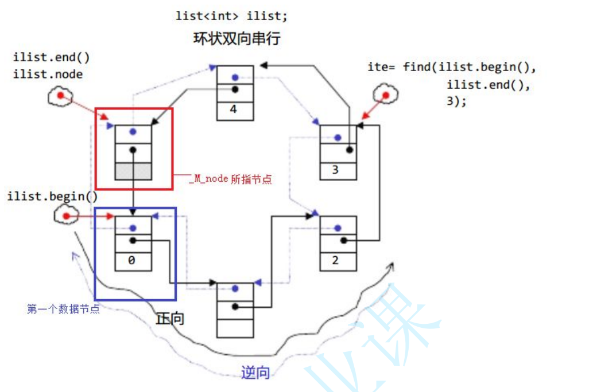

# list

## 目录

-   [list的介绍及使用](#list的介绍及使用)
    -   [ list的迭代器失效](#-list的迭代器失效)
-   [list的模拟实现](#list的模拟实现)
-   [list 反向迭代器](#list-反向迭代器)
-   [list与vector的对比](#list与vector的对比)
-   [list模拟实现细节](#list模拟实现细节)
    -   [1: 迭代器](#1-迭代器)
    -   [2: typename](#2-typename)

# list的介绍及使用

> list是可以在常数范围内在任意位置进行插入和删除的序列式容器，并且该容器可以前后双向迭代。

> list的底层是双向链表结构，双向链表中每个元素存储在互不相关的独立节点中，在节点中通过指针指向其前一个元素和后一个元素。

> list与forward\_list非常相似：最主要的不同在于forward\_list是单链表，只能朝前迭代，已让其更简单高效。

> 与其他的序列式容器相比(array，vector，deque)，list通常在任意位置进行插入、移除元素的执行效率更好。

> 与其他序列式容器相比，list和forward\_list最大的缺陷是不支持任意位置的随机访问，比如：要访问list的第6个元素，必须从已知的位置(比如头部或者尾部)迭代到该位置，在这段位置上迭代需要线性的时间开销；list还需要一些额外的空间，以保存每个节点的相关联信息(对于存储类型较小元素的大list来说这可能是一个重要的因素)



## &#x20;list的迭代器失效

前面说过，此处大家可将迭代器暂时理解成类似于指针，迭代器失效即迭代器所指向的节点的无效，即该节点被删除了。因为list的底层结构为带头结点的双向循环链表，因此在list中进行插入时是不会导致list的迭代器失效的，只有在删除时才会失效，并且失效的只是指向被删除节点的迭代器，其他迭代器不会受到影响。

```c++
void TestListIterator1()
{
  int array[] = { 1, 2, 3, 4, 5, 6, 7, 8, 9, 0 };
  list<int> l(array, array + sizeof(array) / sizeof(array[0]));
  auto it = l.begin();
  while (it != l.end())
  {
    // erase()函数执行后，it所指向的节点已被删除，因此it无效，在下一次使用it时，必须先给
    其赋值
      l.erase(it);
    ++it;
  }
}

 这个代码存在问题，因为在每次调用 l.erase(it) 后，原本指向该节点的迭代器 it 已经失效。此时对 it 进行自增运算会导致未定义行为，可能会访问已经被释放的内存，或者跳过一些节点。 


void TestListIterator1()
{
  int array[] = { 1, 2, 3, 4, 5, 6, 7, 8, 9, 0 };
  list<int> l(array, array + sizeof(array) / sizeof(array[0]));
  auto it = l.begin();
  while (it != l.end())
  {
    // 在调用erase之后，it会失效，需要使用erase的返回值获取到其下一个节点的迭代器
    it = l.erase(it);
  }
}
```

# list的模拟实现

[list模拟实现](list模拟实现/list模拟实现.md "list模拟实现")

***

# list 反向迭代器

通过前面例子知道，反向迭代器的++就是正向迭代器的--，反向迭代器的--就是正向迭代器的++，因此反向迭代器的实现可以借助正向迭代器，即：反向迭代器内部可以包含一个正向迭代器，对正向迭代器的接口进行包装即可。

[list反向迭代器](list反向迭代器/list反向迭代器.md "list反向迭代器")

***

# list与vector的对比

-   vector与list都是STL中非常重要的序列式容器，由于两个容器的底层结构不同，导致其特性以及应用场景不同，其主要不同如下：

|                           | vector                                                               | list                                                |
| ------------------------- | -------------------------------------------------------------------- | --------------------------------------------------- |
| 底&#xA;层&#xA;结&#xA;构       | 动态顺序表，一段连续空间                                                         | 带头结点的双向循环链表                                         |
| 随&#xA;机&#xA;访&#xA;问       | 支持随机访问，访问某个元素效率O(1)                                                  | 不支持随机访问，访问某个元素效率O(N)                                |
| 插&#xA;入&#xA;和&#xA;删&#xA;除 | 任意位置插入和删除效率低，需要搬移元素，时间复杂度为O(N)，插入时有可能需要增容，增容：开辟新空间，拷贝元素，释放旧空间，导致效率更低 | 任意位置插入和删除效率高，不&#xA;需要搬移元素，时间复杂度为O(1)                |
| 空&#xA;间&#xA;利&#xA;用&#xA;率 | 底层为连续空间，不容易造成内存碎片，空间利用率高，缓存利用率高                                      | 底层节点动态开辟，小节点容易&#xA;造成内存碎片，空间利用率低，&#xA;缓存利用率         |
| 迭&#xA;代&#xA;器             | 原生态指针                                                                | 对原生态指针(节点指针)进行封装                                    |
| 迭&#xA;代&#xA;器&#xA;失&#xA;效 | 在插入元素时，要给所有的迭代器重新赋值，因为插入元素有可能会导致重新扩容，致使原来迭代器失效，删除时，当前迭代器需要重新赋值否则会失效  | 插入元素不会导致迭代器失效，&#xA;删除元素时，只会导致当前迭代&#xA;器失效，其他迭代器不受影响 |
| 使&#xA;用&#xA;场&#xA;景       | 需要高效存储，支持随机访问，不关心插入删除效率                                              | 大量插入和删除操作，不关心随&#xA;机访问                              |

# list模拟实现细节

## 1: 迭代器

> iterator end()  begin() 时候 都会调到迭代器的构造

> 内部的begin和end构造的时候用到了迭代器的单参构造，虽然你没有直接掉用，但是单参构造函数具有类型转换作用,begin中虽然你没有调用这个构造函数创建迭代器的对象  但是在返回的时候伴一起会自动调用迭代器类构造函数的 &#x20;

当调用 `end()` 函数时，会创建一个新的迭代器对象，指向链表的结束位置。在 `list` 类中，`end()` 函数返回的是 `_head`，即链表的头节点。

在 `__list_iterator` 结构体中，存在一个单参构造函数 `__list_iterator(Node* node)`，它接受一个指向节点的指针作为参数。当调用 `end()` 函数时，会将 `_head`（一个指向链表头节点的指针）传递给 `__list_iterator` 的单参构造函数，从而创建一个新的迭代器对象。

这里的单参构造函数具有类型转换的作用。它将一个指向节点的指针转换为迭代器对象。这样，我们就可以通过迭代器来访问链表的元素，包括遍历和修改等操作。

需要注意的是，这里的单参构造函数没有使用 `explicit` 关键字进行修饰，因此它可以进行隐式类型转换。这意味着在需要迭代器对象的地方，可以直接使用指向节点的指针，而不需要显式地创建迭代器对象。这种隐式类型转换可以方便地在代码中使用迭代器，并且符合我们对迭代器的使用习惯。

当一个构造函数只有一个参数，并且除了第一个参数外，其他参数都有默认值时，这个构造函数可以具有类型转换的作用。这是因为在使用这个构造函数创建对象时，可以省略除第一个参数外的其他参数，从而实现隐式类型转换。

下面是一个示例：

```c++
#include <iostream>

class MyInt {
public:
    MyInt(int value = 0) : _value(value) {}

    int getValue() const {
        return _value;
    }

private:
    int _value;
};

void printValue(const MyInt& myInt) {
    std::cout << myInt.getValue() << std::endl;
}

int main() {
    int num = 5;
    printValue(num);  // 隐式类型转换，将int转换为MyInt对象

    return 0;
}

```

在上面的示例中，`MyInt` 类有一个构造函数 `MyInt(int value = 0)`，它接受一个 `int` 类型的参数，并且该参数有一个默认值。在 `main` 函数中，我们传递一个 `int` 类型的变量 `num` 给 `printValue` 函数，而 `printValue` 函数的参数类型是 `MyInt`。由于 `MyInt` 类的构造函数可以隐式地将 `int` 类型转换为 `MyInt` 对象，所以编译器会自动进行类型转换，将 `num` 转换为 `MyInt` 对象，并传递给 `printValue` 函数。

因此，构造函数的类型转换功能可以使得代码更加简洁和灵活，提供了更多的使用方式和方便性。但同时也需要注意，过度使用隐式类型转换可能会导致代码可读性降低和潜在的错误，所以在使用时需要谨慎权衡。

c++11支持了多参数，隐式类型转换

```c++
#include <iostream>

class MyInt {
public:
    MyInt(int value) : _value(value) {}

    MyInt(int a, int b) : _value(a + b) {}

    int getValue() const {
        return _value;
    }

private:
    int _value;
};

void printValue(const MyInt& myInt) {
    std::cout << myInt.getValue() << std::endl;
}

int main() {
    MyInt myInt1 = 5; // 隐式类型转换，将 int 转换为 MyInt 对象
    printValue(myInt1); // 输出: 5

    MyInt myInt2 = {3, 4}; // 多参数构造函数，隐式类型转换
    printValue(myInt2); // 输出: 7

    return 0;
}

```

***

## 2: typename

typename的作用是明确告诉编译器该类型存在

```c++
这样写是不会编译通过的，因为在 C++ 中，当在模板中使用嵌套从属类型时，编译器无法确定该名称是一个类型还是一个成员变量,所有无法去类里面找 
  template<class T>
  void print_list(const list<T>& lt)
  {
    list<T>::const_iterator it = lt.begin();
    while (it != lt.end())
    {
      cout << *it << " ";
      ++it;
    }
    cout << endl;
  }
```

因此，需要使用 `typename` 关键字来明确告诉编译器 `list<T>::const_iterator` 是一个类型。

```c++
// 实例化
  template<typename T>
  void print_list(const list<T>& lt)
  {
     // list<T>未实例化的类模板，编译器不能去他里面去找
    // 编译器就无法list<T>::const_iterator是内嵌类型，还是静态成员变量
    //  因为静态成员变量也是按照 类名::静态成员变量名 的方式访问的 
    // 前面加一个typename就是告诉编译器，这里是一个类型，等list<T>实例化
    // 再去类里面去取 
    typename list<T>::const_iterator it = lt.begin();
    while (it != lt.end())
    {
      cout << *it << " ";
      ++it;
    }
    cout << endl;
  }
```

这样写可以专打印容器的,不用写死是list

```c++
// 模板(泛型编程)本质，本来应该由我们干的活交给编译器 
  template<typename Container>
  void print_container(const Container& con)
  {
    typename Container::const_iterator it = con.begin();
    while (it != con.end())
    {
      cout << *it << " ";
      ++it;
    }
    cout << endl;
  }
```
