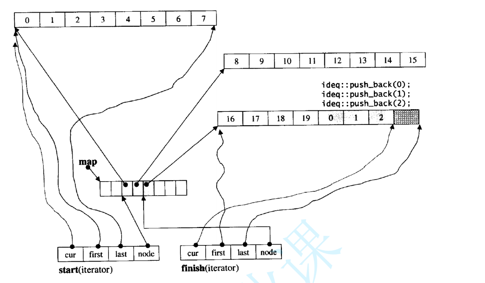

# stack & queue

## 目录

-   [1. queue的介绍](#1-queue的介绍)
-   [ 模拟实现](#-模拟实现)
-   [ 2. priority\_queue的介绍和使用](#-2-priority_queue的介绍和使用)
    -   [ priority\_queue](#-priority_queue)
-   [仿函数](#仿函数)
-   [3. stack介绍和使用](#3-stack介绍和使用)
-   [4. 容器适配器](#4-容器适配器)
    -   [4.1 STL标准库中stack和queue的底层结构](#41-STL标准库中stack和queue的底层结构)
    -   [4.2 deque的简单介绍(了解)](#42-deque的简单介绍了解)
        -   [deque的缺陷](#deque的缺陷)

# 1. queue的介绍

> 队列是一种容器适配器，专门用于在FIFO上下文(先进先出)中操作，其中从容器一端插入元素，另一端

提取元素。

> 队列作为容器适配器实现，容器适配器即将特定容器类封装作为其底层容器类，queue提供一组特定的

成员函数来访问其元素。元素从队尾入队列，从队头出队列。

> 底层容器可以是标准容器类模板之一，也可以是其他专门设计的容器类。该底层容器应至少支持以下操作:

-   empty：检测队列是否为空
-   size：返回队列中有效元素的个数
-   front：返回队头元素的引用
-   back：返回队尾元素的引用
-   push\_back：在队列尾部入队列
-   pop\_front：在队列头部出队列

> &#x20;标准容器类deque和list满足了这些要求。默认情况下，如果没有为queue实例化指定容器类，则使用标准容器deque。

> 因为queue的接口中存在头删和尾插，因此使用vector来封装效率太低，故可以借助list来模拟实现queue


-   queue\<int, list\<int>> q; 支持
-   queue\<int, vector\<int>> q;  不支持 vector没有pop\_front

***

# &#x20;模拟实现

[模拟实现Queue](模拟实现Queue/模拟实现Queue.md "模拟实现Queue")

***

# &#x20;2. priority\_queue的介绍和使用

> 优先队列是一种容器适配器，根据严格的弱排序标准，它的第一个元素总是它所包含的元素中最大的。

> 此上下文类似于堆，在堆中可以随时插入元素，并且只能检索最大堆元素(优先队列中位于顶部的元素)。

> 优先队列被实现为容器适配器，容器适配器即将特定容器类封装作为其底层容器类，queue提供一组特定的成员函数来访问其元素。元素从特定容器的“尾部”弹出，其称为优先队列的顶部。

> 底层容器可以是任何标准容器类模板，也可以是其他特定设计的容器类。容器应该可以通过随机访问迭代器访问，并支持以下操作：

-   empty()：检测容器是否为空
-   size()：返回容器中有效元素个数
-   front()：返回容器中第一个元素的引用
-   push\_back()：在容器尾部插入元素
-   pop\_back()：删除容器尾部元素

> 标准容器类vector和deque满足这些需求。默认情况下，如果没有为特定的priority\_queue类实例化指定容器类，则使用vector。

> 优先级队列默认使用vector作为其底层存储数据的容器，在vector上又使用了堆算法将vector中元素构造成堆的结构，因此priority\_queue就是堆，所有需要用到堆的位置，都可以考虑使用priority\_queue。**注意：默认情况下priority\_queue是大堆。**

## &#x20;priority\_queue

如果在priority\_queue中放自定义类型的数据，用户需要在自定义类型中提供> 或者< 的重载

[新页面](新页面/新页面.md "新页面")

但是要换成Date\* 可能就会错错了

```c++
int main()
{
    // 17:07继续
    bit::priority_queue<Date> q1;
    q1.push(Date(2018, 10, 29));
    q1.push(Date(2018, 10, 28));
    q1.push(Date(2018, 10, 30));
    cout << q1.top() << endl;

    bit::priority_queue<Date*, vector<Date*>, PDateCompare> q2;
    q2.push(new Date(2018, 10, 29));
    q2.push(new Date(2018, 10, 28));
    q2.push(new Date(2018, 10, 30));
    cout << *(q2.top()) << endl;

    return 0;
}
```

所有对于Date\* 的类型我们要自己写仿函数了

# 仿函数

```c++

 //自定义类型 指针比较，然后解引用在去用户需要在自定义类型中提供> 或者< 的重载比较 
struct PDateCompare
{
    bool operator()(Date* p1, Date* p2)
    {
        return *p1 > *p2;
    }
};
```

```c++
//小于比较
template<class T>
class Less
{
public:
  bool operator()(const T& x, const T& y)
  {
    return x < y;
  }
};

//大于比较
template<class T>
class Greater
{
public:
  bool operator()(const T& x, const T& y)
  {
    return x > y;
  }
};
```

-   为什么有的仿函数 要加() 有的不用加


priority\_queue 传过去的是类型，是一个模版参数会自动推导.

而sort接收的是是一个函数参数是一个参数，传过去的的是对象，是个匿名对象。

-   需要注意的是sort 和qsort 相反
    -   qsort  &#x20;
        
    -   sort &#x20;
        
    -   sort如果是结构体比较，如果没有显示传自定义比较函数，类内部重载了也是可以的.

        sort不传第三个参数，默认从小到大进行排序，也就是会使用运算符重载
        ```c++
        struct Sum
        {
            int s, c, d;
            bool operator< (const Sum &t) const
            {
                if (s != t.s) return s < t.s;
                if (c != t.c) return c < t.c;
                return d < t.d;
            }
        };

        const int N = 10;
        Sum sum[N];

        // 使用结构体内部的 < 运算符重载函数对 sum 数组进行排序
        std::sort(sum, sum + N);
        ```
    -   优先级队列 priority\_queue 的排序则 跟qsort一样
        

***

# 3. stack介绍和使用

> stack是一种容器适配器，专门用在具有后进先出操作的上下文环境中，其删除只能从容器的一端进行元素的插入与提取操作。

> stack是作为容器适配器被实现的，容器适配器即是对特定类封装作为其底层的容器，并提供一组特定的成员函数来访问其元素，将特定类作为其底层的，元素特定容器的尾部(即栈顶)被压入和弹出。

> stack的底层容器可以是任何标准的容器类模板或者一些其他特定的容器类，这些容器类应该支持以下操作：

-   empty：判空操作
-   back：获取尾部元素操作
-   push\_back：尾部插入元素操作
-   pop\_back：尾部删除元素操作

> 标准容器vector、deque、list均符合这些需求，默认情况下，如果没有为stack指定特定的底层容器，默认情况下使用deque。


***

-   从栈的接口中可以看出，栈实际是一种特殊的vector，因此使用vector完全可以模拟实现stack。当然底层还是 deque

[模拟实现stacks](模拟实现stacks/模拟实现stacks.md "模拟实现stacks")

***

# 4. 容器适配器

适配器是一种设计模式(设计模式是一套被反复使用的、多数人知晓的、经过分类编目的、代码设计经验的总结)，该种模式是将一个类的接口转换成客户希望的另外一个接口。

## 4.1 STL标准库中stack和queue的底层结构

> 虽然stack和queue中也可以存放元素，但在STL中并没有将其划分在容器的行列，而是将其称为容器适配器，这是因为stack和队列只是对其他容器的接口进行了包装，STL中stack和queue默认使用deque，比如：


## 4.2 deque的简单介绍(了解)

-   deque的原理介绍

> deque(双端队列)：是一种双开口的"连续"空间的数据结构，双开口的含义是：可以在头尾两端进行插入和删除操作，且时间复杂度为O(1)，与vector比较，头插效率高，不需要搬移元素；与list比较，空间利用率比较高。


> deque并不是真正连续的空间，而是由一段段连续的小空间拼接而成的，实际deque类似于一个动态的二维数组，其底层结构如下图所示：


> 双端队列底层是一段假象的连续空间，实际是分段连续的，为了维护其“整体连续”以及随机访问的假象，落在了deque的迭代器身上，因此deque的迭代器设计就比较复杂，如下图所示：


> 那deque是如何借助其迭代器维护其假想连续的结构呢？



### deque的缺陷

> 与vector比较，deque的优势是：头部插入和删除时，不需要搬移元素，效率特别高，而且在扩容时，也不需要搬移大量的元素，因此其效率是必vector高的

> 与list比较，其底层是连续空间，空间利用率比较高，不需要存储额外字段。

> 但是，deque有一个致命缺陷：不适合遍历，因为在遍历时，deque的迭代器要频繁的去检测其是否移动到某段小空间的边界，导致效率低下，而序列式场景中，可能需要经常遍历，因此在实际中，需要线性结构时，大多数情况下优先考虑vector和list，deque的应用并不多，而目前能看到的一个应用就是，STL用其作为stack和queue的底层数据结构

-   operato\[]计算稍显复杂大量使用]，性能下降中间插入删除效率不高相比vector的\[]
-   中间插入删除效率不高
-   底层角度迭代器会很复杂
-   为什么选择deque作为stack和queue的底层默认容器

> stack是一种后进先出的特殊线性数据结构，因此只要具有push\_back()和pop\_back()操作的线性结构，都可以作为stack的底层容器，比如vector和list都可以；queue是先进先出的特殊线性数据结构，只要具有push\_back和pop\_front操作的线性结构，都可以作为queue的底层容器，比如list。但是STL中对stack和queue默认选择deque作为其底层容器，主要是因为：

1.  stack和queue不需要遍历(因此stack和queue没有迭代器)，只需要在固定的一端或者两端进行操作。
2.  在stack中元素增长时，deque比vector的效率高(扩容时不需要搬移大量数据)；queue中的元素增长时，deque不仅效率高，而且内存使用率高。结合了deque的优点，而完美的避开了其缺陷。

结论
1\. 头尾的插入删除非常适合，相比vector和list而言。很适合去做stack和queue的默认适配容器
2\. 中间插入删除多用list
3\. 随机访问多用vector
