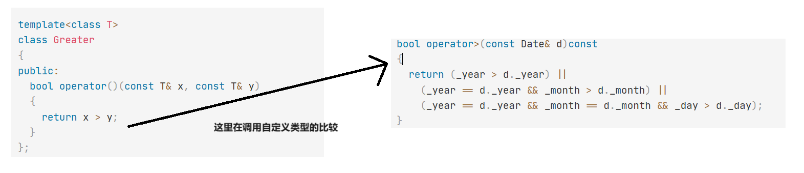

# 新页面

```c++
class Date
{
public:
  Date(int year = 1900, int month = 1, int day = 1)
    : _year(year)
    , _month(month)
    , _day(day)
  {}
  bool operator<(const Date& d)const
  {
    return (_year < d._year) ||
      (_year == d._year && _month < d._month) ||
      (_year == d._year && _month == d._month && _day < d._day);
  }
  bool operator>(const Date& d)const
  {
    return (_year > d._year) ||
      (_year == d._year && _month > d._month) ||
      (_year == d._year && _month == d._month && _day > d._day);
  }
  friend ostream& operator<<(ostream& _cout, const Date& d)
  {
    _cout << d._year << "-" << d._month << "-" << d._day;
    return _cout;
  }
private:
  int _year;
  int _month;
  int _day;
};


template<class T>
class Less
{
public:
  bool operator()(const T& x, const T& y)
  {
    return x < y;
  }
};

template<class T>
class Greater
{
public:
  bool operator()(const T& x, const T& y)
  {
    return x > y;
  }
};

void TestPriorityQueue()
{
  XMLife::priority_queue<Date> q1;
  q1.push(Date(2018, 10, 29));
  q1.push(Date(2018, 10, 28));
  q1.push(Date(2018, 10, 30));
  cout << q1.top() << endl;


  XMLife::priority_queue<Date, vector<Date>, greater<Date>> q2;
  q2.push(Date(2018, 10, 29));
  q2.push(Date(2018, 10, 28));
  q2.push(Date(2018, 10, 30));
  cout << q2.top() << endl;
}

输出结果：：
 2018-10-30
2018-10-28
```


