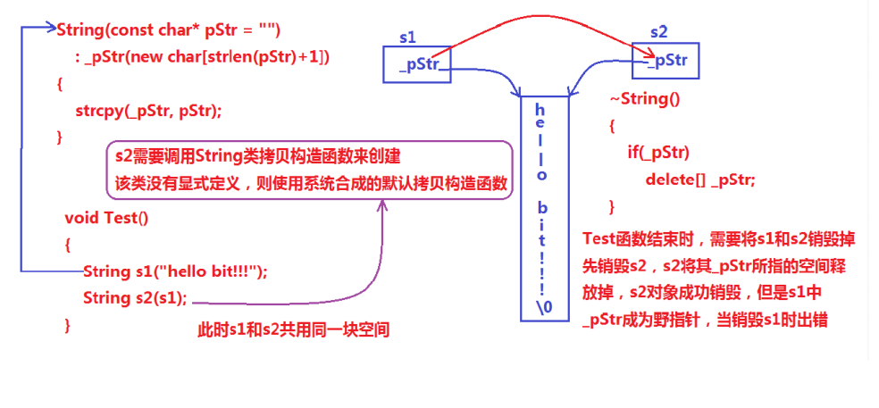
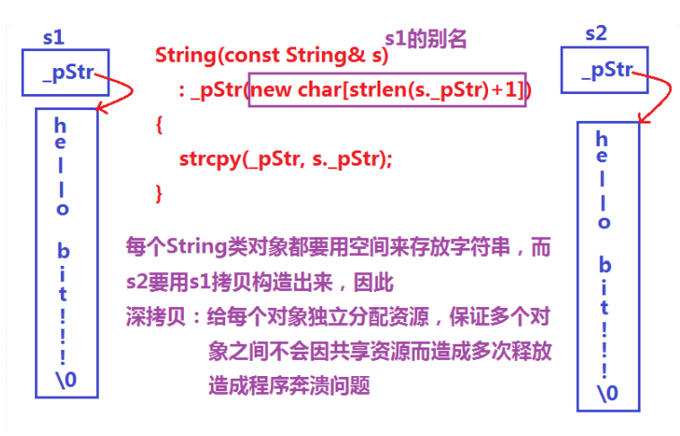

# string

## 目录

-   [1. 为什么学习string类？](#1-为什么学习string类)
    -   [1.1 C语言中的字符串](#11-C语言中的字符串)
-   [2. 标准库中的string类](#2-标准库中的string类)
    -   [2.1 string类(了解)](#21-string类了解)
    -   [2.2 string类的常用接口说明（注意下面我只讲解最常用的接口）](#22-string类的常用接口说明注意下面我只讲解最常用的接口)
    -   [2.3 用string 空格替换为20%](#23-用string-空格替换为20)
-   [3. string类的模拟实现](#3-string类的模拟实现)
    -   [3.1 经典的string类问题](#31-经典的string类问题)
    -   [3.2 浅拷贝](#32-浅拷贝)
    -   [3.3 深拷贝](#33-深拷贝)
        -   [3.3.1 传统版写法的String类](#331-传统版写法的String类)
        -   [3.3.2 现代版写法的String类](#332-现代版写法的String类)

做OJ时候，如果发现让我们是一段一段去处理的时候，是可以成段成段的去跳的，没必要老做++

# 1. **为什么学习string类？**

## **1.1 C语言中的字符串**

> C语言中，字符串是以'\0'结尾的一些字符的集合，为了操作方便，C标准库中提供了一些str系列的库函数，但是这些库函数与字符串是分离开的，不太符合OOP的思想，而且底层空间需要用户自己管理，稍不留神可能还会越界访问。

# **2. 标准库中的string类**

## **2.1 string类(了解)**

> 1\. string是表示字符串的字符串类。
> 2\. 该类的接口与常规容器的接口基本相同，再添加了一些专门用来操作string的常规操作。
> 3\. string在底层实际是：basic\_string模板类的别名，typedef basic\_string\<char, char\_traits, allocator>string;
> 4\. 不能操作多字节或者变长字符的序列。

在**使用string类时，必须包含#include头文件以及using namespace std**;

***

## 2.2 **string类的常用接口说明（注意下面我只讲解最常用的接口）**

1.  s**tring类对象的常见构造**

| Construct(构造函数)              | 功能说明                  |
| ---------------------------- | --------------------- |
| string() 重点                  | 构造空的string类对象，即空字符串   |
| string(const char\* s) （重点）  | 用C-string来构造string类对象 |
| string(const string\&s) （重点） | 拷贝构造函数                |
| string(size\_t n, char c)    | string类对象中包含n个字符c     |

```c++
void Teststring()
{
  string s1;                // 构造空的string类对象s1 
  string s2("hello bit");  // 用C格式字符串构造string类对象s2 
  string s3(s2);            // 拷贝构造s3 
  string(100, 'x');        //string类对象中包含n个字符c 
}
```

***

1.  **string类对象的容量操作**

| Capacity:函数名称                                                                              | 功能说明                         |
| ------------------------------------------------------------------------------------------ | ---------------------------- |
| size（重点）                                                                                   | 返回字符串有效字符长度                  |
| length                                                                                     | 返回字符串有效字符长度                  |
| empty （重点）                                                                                 | 检测字符串释放为空串，是返回true，否则返回false |
| clear （重点）                                                                                 | 清空有效字符                       |
| reserve （重点）                                                                               | 为字符串预留空间\*\*                 |
| resize （重点）                                                                                | 将有效字符的个数该成n个，多出的空间用字符c填充     |
| [**max\_size**](https://legacy.cplusplus.com/reference/string/string/max_size/ "max_size") | 返回字符串的最大容量                   |

-   注意：

1.  size()与length()方法底层实现原理完全相同，引入size()的原因是为了与其他容器的接口保持一致，一般情况下基本都是用size()。
2.  clear()只是将string中有效字符清空，不改变底层空间大小。
3.  resize(size\_t n) 与 resize(size\_t n, char c)都是将字符串中有效字符个数改变到n个，不同的是当字

符个数增多时：resize(n)用0来填充多出的元素空间，resize(size\_t n, char c)用字符c来填充多出的元素空间。注意：resize在改变元素个数时，如果是将元素个数增多，可能会改变底层容量的大小，如果是将元素个数减少，底层空间总大小不变。

1.  reserve(size\_t res\_arg=0)：为string预留空间，不改变有效元素个数，当reserve的参数小于

string的底层空间总大小时，reserver不会改变容量大小。利用reserve提高插入数据的效率，避免增容带来的开销

***

1.  string类对象的访问及遍历操作

| **Element access**:函数名称 | 功能说明                                                       |
| ----------------------- | ---------------------------------------------------------- |
| operator\[] （重点）        | 返回pos位置的字符，const string类对象只可调用                             |
| begin+ end              | begin获取一个字符的迭代器 + end获取最后一个字符下一个位置的迭代器                     |
| rbegin + rend           | begin获取一个字符的迭代器 + end获取最后一个字符下一个位置的迭代器                     |
| 范围for                   | C++11支持更简洁的范围for的新遍历方式，范围for -- 自动迭代，自动判断结束，范围for底层其实就是迭代器 |

```c++
// string的遍历
// begin()+end()   for+[]  范围for
// 注意：string遍历时使用最多的还是for+下标 或者 范围for(C++11后才支持)
// begin()+end()大多数使用在需要使用STL提供的算法操作string时，比如：采用reverse逆置string

void Teststring4()
{
  string s("hello Bit");
  // 3种遍历方式：
  // 需要注意的以下三种方式除了遍历string对象，还可以遍历是修改string中的字符，
  // 另外以下三种方式对于string而言，第一种使用最多
  // 1. for+operator[]
  for (size_t i = 0; i < s.size(); ++i)
    cout << s[i] << endl;

  // 2.迭代器
  string::iterator it = s.begin();
  while (it != s.end())
  {
    cout << *it << endl;
    ++it;
  }

  // string::reverse_iterator rit = s.rbegin();
  // C++11之后，直接使用auto定义迭代器，让编译器推到迭代器的类型
  auto rit = s.rbegin();
  while (rit != s.rend())
    cout << *rit << endl;

  // 3.范围for
  for (auto ch : s)
    cout << ch << endl;
}
```

***

1.  string类对象的修改操作

| Modifiers:函数名称  | 功能说明                            |
| --------------- | ------------------------------- |
| push\_back      | 在字符串后尾插字符c                      |
| append          | 在字符串后追加一个字符串                    |
| operator+= (重点) | 在字符串后追加字符串str                   |
| c\_str(重点)      | 返回C格式字符串                        |
| find + npos(重点) | 从字符串pos位置开始往后找字符c，返回该字符在字符串中的位置 |
| rfind           | 从字符串pos位置开始往前找字符c，返回该字符在字符串中的位置 |
| substr          | 在str中从pos位置开始，截取n个字符，然后将其返回     |

> 在string尾部追加字符时，s.push\_back(c) / s.append(1, c) / s += 'c'三种的实现方式差不多，一般情况下string类的+=操作用的比较多，+=操作不仅可以连接单个字符，还可以连接字符串。

> 对string操作时，如果能够大概预估到放多少字符，可以先通过reserve把空间预留好。

[Test\_string的使用](Test_string的使用/Test_string的使用.md "Test_string的使用")

***

1.  string类非成员函数

| 函数                        | 功能说明                 |
| ------------------------- | -------------------- |
| operator+                 | 尽量少用，因为传值返回，导致深拷贝效率低 |
| operator>> （重点）           | 输入运算符重载              |
| operator<< （重点）           | 输出运算符重载              |
| getline （重点）              | 获取一行字符串              |
| relational operators （重点） | 大小比较                 |

***

## 2.3 用string 空格替换为20%

insert/erase/repalce能不用就尽量不用，因为他们都涉及挪动数据，效率不高

-   用空间换时间的做法

```c++
int main()
{
    std::string s2("The quick brown fox jumps over a lazy dog.");
    string s3;
    for (auto ch : s2)
    {
        if (ch != ' ')
        {
            s3 += ch;
        }
        else
        {
            s3 += "20%";
        }
    }

    cout << s3 << endl;

    system("pause");
}
// 如果要修改s2呢？ 我们可以直接给s2赋值即可，但是要注意使用库函数swap时候，效率很低，因为一种要拷贝和赋值，我们可以直接调用string的swap，他们是直接交换地址，string的swap被定义成全局函数了，匹配时候我们先匹配string的swap，不会匹配库的.所有可以直接调用swap，也可以直接调用 
我们可以直接进行
 s2 = s3;
 s2.assign(s3);
swap(s2, s3); //不会调用库的
s2.swap(s3);
```

***

# 3. string类的模拟实现

## 3.1 经典的string类问题

> 上面已经对string类进行了简单的介绍，大家只要能够正常使用即可。在面试中，面试官总喜欢让学生自己来模拟实现string类，最主要是实现string类的构造、拷贝构造、赋值运算符重载以及析构函数。大家看下以下string类的实现是否有问题？

```c++
class String
{
public:
String(const char* str = "")
{
  // 构造String类对象时，如果传递nullptr指针，可以认为程序非
  if (nullptr == str)
  {
    assert(false);
    return;
  }
  _str = new char[strlen(str) + 1];
  strcpy(_str, str);
}
~String()
{
  if (_str)
  {
    delete[] _str;
    _str = nullptr;
  }
}
private:
  char* _str;
};
// 测试
void TestString()
{
  String s1("hello bit!!!");
  String s2(s1);
}
```



***

> 说明：上述String类没有显式定义其拷贝构造函数与赋值运算符重载，此时编译器会合成默认的，当用s1构造s2时，编译器会调用默认的拷贝构造。最终导致的问题是，s1、s2共用同一块内存空间，在释放时同一块空间被释放多次而引起程序崩溃，这种拷贝方式，称为浅拷贝。

***

## 3.2 浅拷贝

> 浅拷贝：也称位拷贝，编译器只是将对象中的值拷贝过来。如果对象中管理资源，最后就会导致多个对象共享同一份资源，当一个对象销毁时就会将该资源释放掉，而此时另一些对象不知道该资源已经被释放，以为还有效，所以当继续对资源进项操作时，就会发生发生了访问违规.

> 可以采用深拷贝解决浅拷贝问题，即：每个对象都有一份独立的资源，不要和其他对象共享。

## 3.3 深拷贝

> 如果一个类中涉及到资源的管理，其拷贝构造函数、赋值运算符重载以及析构函数必须要显式给出。一般情况都是按照深拷贝方式提供。



***

### 3.3.1 传统版写法的String类

```c++
class String
{
public:
    // 构造函数，传入一个字符串，生成一个String对象 
    String(const char* str = "")
    {
        // 如果传入的是空指针，则抛出异常
        if (nullptr == str)
        {
            assert(false);
            return;
        }
        // 分配空间，存储字符串
        _str = new char[strlen(str) + 1];
        strcpy(_str, str);
    }
    // 拷贝构造函数，从已经存在的String对象构造一个新的对象
    String(const String& s)
        : _str(new char[strlen(s._str) + 1])
    {
        strcpy(_str, s._str);
    }
    // 赋值操作符重载
    String& operator=(const String& s)
    {
        // 如果是自己给自己赋值，则直接返回本身
        if (this != &s)
        {
            char* pStr = new char[strlen(s._str) + 1];
            strcpy(pStr, s._str);
            delete[] _str;
            _str = pStr;
        }
        return *this;
    }
    // 析构函数，释放分配的内存
    ~String()
    {
        if (_str)
        {
            delete[] _str;
            _str = nullptr;
        }
    }
private:
    char* _str;  // 存储字符串的指针
};
```

### 3.3.2 现代版写法的String类

```c++
class String
{
public:
  String(const char* str = "")
  {
    if (nullptr == str)
    {
      assert(false);
      return;
    }
    _str = new char[strlen(str) + 1];
    strcpy(_str, str);
  }
  
  String(const String& s)
    : _str(nullptr)
  {
    String strTmp(s._str);
    swap(_str, strTmp._str);
  }
  
  // 对比下和上面的赋值那个实现比较好？
  String& operator=(String s)  // 传值传参，不会影响外部的
  {
    swap(_str, s._str);
    return *this;
  }
  
  /*
  String& operator=(const String& s)
  {
  if(this != &s)
  {
  String strTmp(s);
  swap(_str, strTmp._str);
  }
  return *this;
 }
 */
 
  ~String()
  {
    if (_str)
    {
      delete[] _str;
      _str = nullptr;
    }
  }
private:
  char* _str;
};
```
