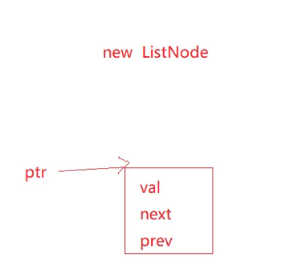
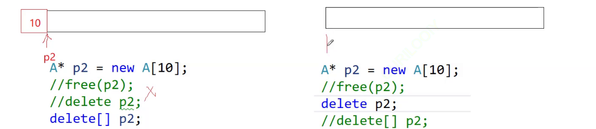
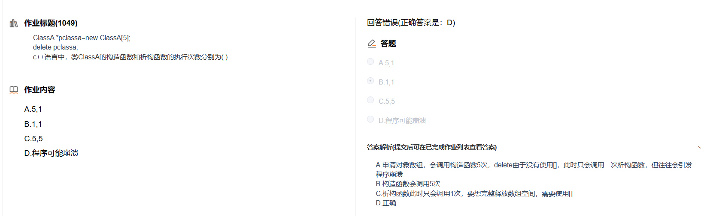

# 内存管理

new是开空间，new时候调用构造函数是开辟一块空间给array

main函数里面结束ptr不会自动调用析构函数，因为他是内置类型，只有自定义类型才会自己调用.

只有这样写才是开空间，调用构造函数时只是初始化

右边可能写会报错，该行为是未定义的，**一定要匹配使用！**

-   new A\[10] 时候 会在前面多开10个字节空间，匹配使用时delete\[] p2知道前面有多开10个字节回收.
-   而使用delete p2他不知道前面还有10个字节，直接把10个字节后面的资源回收了，导致前面10个字节没有回收，导致内存泄漏.

.在堆上频繁的调用new/delete容易产生内存碎片

堆大小受限于操作系统，而栈空间一般有系统直接分配

.堆无法静态分配，只能动态分配

new/delete与malloc/free最大区别就在于是否会调用构造函数与析构函数

申请数组空间，构造函数调用的次数就是数组的大小

> heap\_mem 是一个指针变量，它被分配在栈上

> heap\_mem 这个指针本来就是栈上的，只是这个printf打印% p指向了他内容的地址，所以这里是堆上的,这个变量它本身肯定在栈上的，你要看它的地址，你要取地址的，你要看hip member本身变量指向数据内容里边的值，那不需要取地址的。

> \&Hiphopfem 就是取Hiphopfem的地址，他是在栈上的
