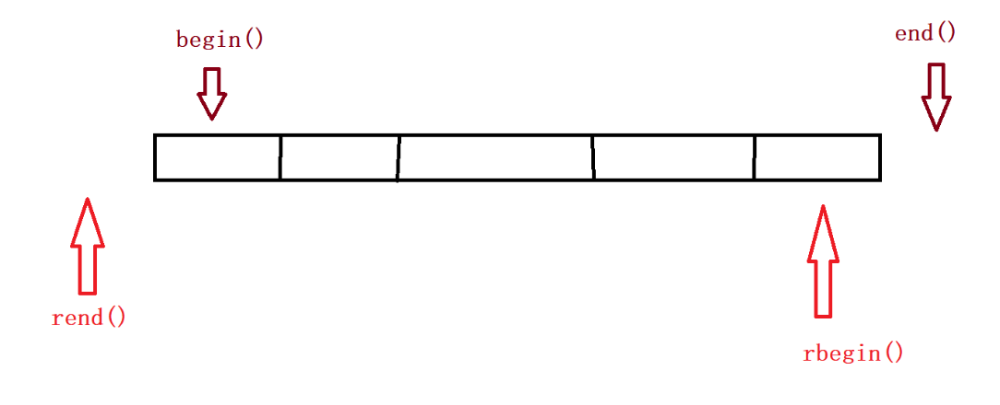

# 反向迭代器

-   反式迭代器尽复用 **迭代器适配器** (就是原来的正向迭代器）

反向迭代器模板可以用于支持双向迭代器的容器，包括 `list` 和 `vector`。由于 `list` 和 `vector` 都实现了双向迭代器，因此可以将它们作为模板参数传递给 `ReverseIterator` 类。

-   rbegin() —指向**容器尾元素**
-   rend()—指向容器**首元素之前一个位置**

迭代器都可以进行`++`操作。反向迭代器和正向迭代器的区别在于：

-   对正向迭代器进行`++`操作时，迭代器会指向容器中的后一个元素；
-   而对反向迭代器进行`++`操作时，迭代器会指向容器中的前一个元素。

**反向迭代器与正向迭代器的比较**



-   list

```c++
//反向迭代器
    typedef ReverseIterator<iterator, T&, T*> reverse_iterator;
    typedef ReverseIterator<const_iterator, const T&, const T*> const_reverse_iterator;


    //////////////////////   Iterators:  //////////////////
    //反向迭代器
   //反向迭代器
    reverse_iterator rbegin()
    {
      return reverse_iterator(--end());
    }

    reverse_iterator rend()
    {
      return reverse_iterator(end());
    }

    const_reverse_iterator rbegin()const
    {
      return const_reverse_iterator(--end());
    }

    const_reverse_iterator rend()const
    {
      return const_reverse_iterator(end());
    }

```

-   vector

rbegin 不能— 因为end()返回的是一个临时对象，临时对象具有常型。如果内置类型返回的是10。 减减10是不允许的，只能10-1

```c++
typedef ReverseIterator<iterator, T&, T*> reverse_iterator;
 typedef ReverseIterator<const_iterator, const T&, const T*> const_reverse_iterator;

    reverse_iterator rbegin()
    {
      return reverse_iterator(end() - 1); 
    }

    reverse_iterator rend()
    {
      return reverse_iterator(begin() - 1);
    }

    const_reverse_iterator rbegin() const
    {
      return const_reverse_iterator(end() - 1);
    }

    const_reverse_iterator rend() const
    {
      return const_reverse_iterator(begin() - 1);
    }
```

-   反向迭代器实现

```c++
template <class iterator, class Ref, class ptr>
class ReverseIterator
{
  typedef ReverseIterator<iterator, Ref, ptr> self;
public:
  ReverseIterator(iterator it)
    :_it(it)
  {}

  Ref operator*()
  {
    return *_it;
  }
  
  ptr operator->()
  {
    return _it.operator->();
  }
  
  self& operator++()
  {
    --_it;
    return *this;
  }

  bool operator!=(const self& s)
  {
    return _it != s._it;
  }
private:
  iterator _it;
};
```
