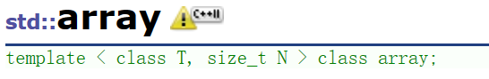
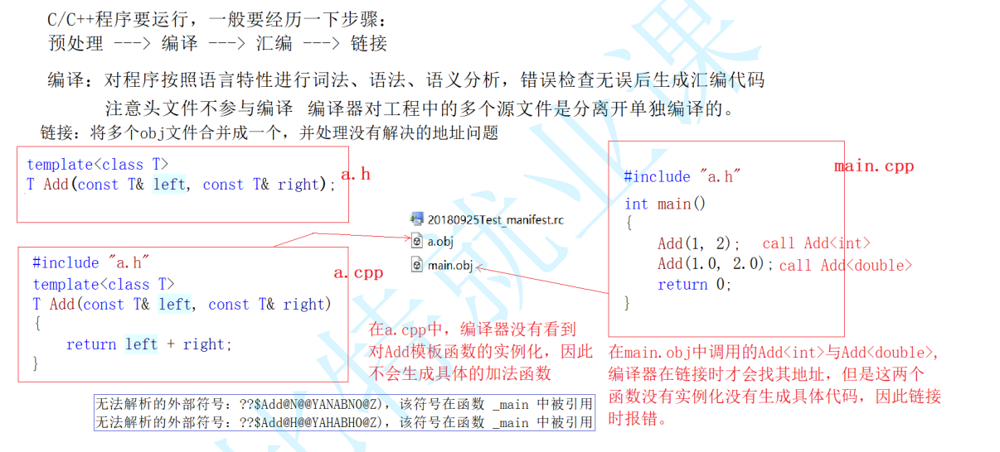
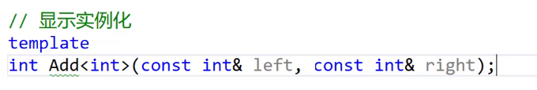

# 模板进阶

## 目录

-   [1. 非类型模板参数](#1-非类型模板参数)
-   [2. 模板的特化](#2-模板的特化)
    -   [2. 1概念](#2-1概念)
    -   [2.2 函数模板特化](#22-函数模板特化)
-   [3. 类模板特化](#3-类模板特化)
    -   [3.1 全特化](#31-全特化)
    -   [3.2 偏特化](#32-偏特化)
    -   [3.3 类模板特化应用示例](#33-类模板特化应用示例)
-   [4. 模板分离编译](#4-模板分离编译)
    -   [4.1 什么是分离编译](#41-什么是分离编译)
    -   [4.2 模板的分离编译](#42-模板的分离编译)
    -   [4.3 解决方法](#43-解决方法)
-   [5. 模板总结](#5-模板总结)

# 1. 非类型模板参数

> 模板参数分类 类型形参与非类型形参

> 类型形参即：出现在模板参数列表中，跟在class或者typename之类的参数类型名称.

> 非类型形参:   就是用一个常量作为类(函数)模板的一个参数，在类(函数)模板中可将该参数当成常量来使用。

```c++
#include <iostream>

template <int N>
void printNums() {
    for(int i = 0; i < N; i++) {
        std::cout << i << " ";
    }
    std::cout << std::endl;
}

int main() {
    printNums<5>(); // 输出 0 1 2 3 4
    printNums<10>(); // 输出 0 1 2 3 4 5 6 7 8 9
    return 0;
}
```

> 在调用该模板时，我们需要在尖括号内提供一个整数值 (int char short)，该值将被用于模板参数 N 的位置。通过这种方式，我们可以静态地确定数组大小

-   注意：

1.  &#x20;浮点数、类对象以及字符串是不允许作为非类型模板参数的。
2.  非类型的模板参数必须在编译期就能确认结果。

比如我们C++出的 array容器也是使用的非类型模板参数。但是他是个鸡肋。



```c++
int a[10];
 array<int, 100>;
 
 C++11初衷期望大家去替代静态数组
```

***

# 2. 模板的特化

## 2. 1概念

-   &#x20;概念

通常情况下，使用模板可以实现一些与类型无关的代码，但对于一些特殊类型的可能会得到一些错误的结果，需要特殊处理，比如：实现了一个专门用来进行小于比较的函数模板

```c++

struct Date
{
  Date(int year, int month, int day)
    :_year(year)
    , _month(month)
    , _day(day)
  {}

  bool operator<(const Date& d) const
  {
    if ((_year < d._year)
      || (_year == d._year && _month < d._month)
      || (_year == d._year && _month == d._month && _day < d._day))
    {
      return true;
    }
    else
    {
      return false;
    }
  }

  int _year;
  int _month;
  int _day;
};

// 函数模板 -- 参数匹配
template<class T>
bool Less(T left, T right)
{
  return left < right;
}
int main()
{
  cout << Less(1, 2) << endl; // 可以比较，结果正确
  Date d1(2022, 7, 7);
  Date d2(2022, 7, 8);
  cout << Less(d1, d2) << endl; // 可以比较，结果正确
  Date* p1 = &d1;
  Date* p2 = &d2;
  cout << Less(p1, p2) << endl; // 可以比较，多少结果有时候错误

  system("pause");
  return 0;
}
```

可以看到，Less绝对多数情况下都可以正常比较，但是在特殊场景下就得到错误的结果。上述示例中，p1指向的d1显然小于p2指向的d2对象，但是Less内部并没有比较p1和p2指向的对象内容，而比较的是p1和p2指针的地址，这就无法达到预期而错误。此时，就需要对模板进行特化。即：在原模板类的基础上，针对特殊类型所进行特殊化的实现方式。模板特化中分为函数模板特化与类模板特化

***

## 2.2 函数模板特化

-   函数模板的特化步骤：

. 1.  必须要先有一个基础的函数模板

1.  关键字template后面接一对空的尖括号<>
2.  函数名后跟一对尖括号，尖括号中指定需要特化的类型
3.  函数形参表: 必须要和模板函数的基础参数类型完全相同，如果不同编译器可能会报一些奇怪的错误。

```c++
Dats() 类这里就不写了

// 函数模板 -- 参数匹配
template<class T>
bool Less(T left, T right)
{
  return left < right;
}
// 对Less函数模板进行特化
template<>
bool Less<Date*>(Date* left, Date* right)
{
  return *left < *right;
}

int main()
{
  cout << Less(1, 2) << endl;
  Date d1(2022, 7, 7);
  Date d2(2022, 7, 8);
  cout << Less(d1, d2) << endl;
  Date* p1 = &d1;
  Date* p2 = &d2;
  cout << Less(p1, p2) << endl; // 调用特化之后的版本，而不走模板生成了
  return 0;
}
```

-   注意：

一般情况下如果函数模板遇到不能处理或者处理有误的类型，为了实现简单通常都是将该函数直接给出。

```c++
bool Less(Date* left, Date* right)
{
 return *left < *right;
}
```

> 该种实现简单明了，代码的可读性高，容易书写，因为对于一些参数类型复杂的函数模板，特化时特别给出，因此函数模板不建议特化。

***

# 3. 类模板特化

> 类模板用特化

> 函数模板可以不用特化,用重载

## 3.1 全特化

-   全特化即是将模板参数列表中所有的参数都确定化

```c++
template<class T1, class T2> 
class Data
{
public:
  Data() { cout << "Data<T1, T2>" << endl; }
private:
  T1 _d1;
  T2 _d2;
};

template<>
class Data<int, char>
{
public:
  Data() { cout << "Data<int, char>" << endl; }
private:
  int _d1;
  char _d2;
};

template<class T1, class T2>
class Data<T1*,T2*>
{
public:
  Data() { cout << "Data<T1*, T2*>" << endl; }
};

template<class T1, class T2>
class Data<T1&, T2&>
{
public:
  Data() { cout << "Data<T1&, T2&>" << endl; }
};

template<class T1, class T2>
class Data<T1&, T2*>
{
public:
  Data() { cout << "Data<T1&, T2*>" << endl; }
};

int main()
{
  Data<double, int> d1; // T1 T2
  Data<int, char> d2;  //int char
  Data<double*, double*> d4; //T* T*
  Data<int*, char*> d5;      //T* T*
  Data<int*, char> d6;     //T1 T2
  Data<int&, char&> d7;     //T& T&
  Data<int&, double*> d9;   //T& T*

  return 0;
}
```

***

## 3.2 偏特化

-   偏特化：任何针对模版参数进一步进行条件限制设计的特化版本。比如对于以下模板类：

```c++
template<class T1, class T2>
class Data
{
public:
 Data() {cout<<"Data<T1, T2>" <<endl;}
private:
 T1 _d1;
 T2 _d2;
};
```

偏特化有以下两种表现方式：

-   部分特化

> 将模板参数类表中的一部分参数特化。

```c++
// 将第二个参数特化为int
template <class T1>
class Data<T1, int>
{
public:
 Data() {cout<<"Data<T1, int>" <<endl;}
private:
 T1 _d1;
 int _d2;
};
```

-   参数更进一步的限制

> 偏特化并不仅仅是指特化部分参数，而是针对模板参数更进一步的条件限制所设计出来的一个特化版本。

```c++
//两个参数偏特化为指针类型
template <typename T1, typename T2>
class Data <T1*, T2*>
{
public:
  Data() { cout << "Data<T1*, T2*>" << endl; }

private:
  T1 _d1;
  T2 _d2;
};

//两个参数偏特化为引用类型
template <typename T1, typename T2>
class Data <T1&, T2&>
{
public:
  Data(const T1& d1, const T2& d2)
    : _d1(d1)
    , _d2(d2)
  {
    cout << "Data<T1&, T2&>" << endl;
  }

private:
  const T1& _d1;
  const T2& _d2;
};

//两个参数偏特化为一个指针类型，一个引用类型
template<class T1, class T2>
class Data<T1&, T2*>
{
public:
  Data() { cout << "Data<T1&, T2*>" << endl; }
};

void test2()
{
  Data<double, int> d1; // 调用特化的int版本
  Data<int, double> d2; // 调用基础的模板 
  Data<int*, int*> d3; // 调用特化的指针版本
  Data<int&, int&> d4(1, 2); // 调用特化的指针版本
  Data<int&,int*> d5();  //调用偏特化为一个指针类型，一个引用版本
}
```

## 3.3 类模板特化应用示例

-   有如下专门用来按照小于比较的类模板Less

```c++
template <class T>
struct Less
{
  bool operator()(const T& x, const T& y) const
  {
    return x < y;
  }
};

int main()
{
  Date d1(2022, 7, 7);
  Date d2(2022, 7, 6);
  Date d3(2022, 7, 8);
  vector<Date> v1;
  v1.push_back(d2);
  v1.push_back(d3);
  // 可以直接排序，结果是日期升序
  sort(v1.begin(), v1.end(), Less<Date>());
  
  vector<Date*> v2;
  v2.push_back(&d1);
  v2.push_back(&d2);
  v2.push_back(&d3);
  // 可以直接排序，结果错误日期还不是升序，而v2中放的地址是升序
  // 此处需要在排序过程中，让sort比较v2中存放地址指向的日期对象
  // 但是走Less模板，sort在排序时实际比较的是v2中指针的地址，因此无法达到预期
  sort(v2.begin(), v2.end(), Less<Date*>());
  return 0;
}

```

> 通过观察上述程序的结果发现，对于日期对象可以直接排序，并且结果是正确的。但是如果待排序元素是指针，结果就不一定正确。因为：sort最终按照Less模板中方式比较，所以只会比较指针，而不是比较指针指向空间中内容，此时可以使用类版本特化来处理上述问题：

```c++
// 对Less类模板按照指针方式特化

// 指针的比较都会走这个版本 
// 特化一下  当T是Date*时，进行特殊处理，按指向的对象比较 
template<>
struct Less<Date*>
{
 bool operator()(Date* x, Date* y) const
 {
 return *x < *y;
 }
};


template<class T>
class Less<T*>
{
public:
    bool operator()(T* x, T* y)
    {
        return *x < *y;
    }
};

int main()
{
    Data<double*, double*> d4;
    Data<int*, double*> d5;

    bit::priority_queue<Date*> q2;
    q2.push(new Date(2018, 10, 29));
    q2.push(new Date(2018, 10, 28));
    q2.push(new Date(2018, 10, 30));
    cout << *(q2.top()) << endl;
    return 0;
}

```

***

# 4. 模板分离编译

## 4.1 什么是分离编译

> 一个程序（项目）由若干个源文件共同实现，而每个源文件单独编译生成目标文件，最后将所有目标文件链接起来形成单一的可执行文件的过程称为分离编译模式。

## 4.2 模板的分离编译

模板不支持分离编译，所以不能在.h声明，在.cpp实现

由于不支持分离编译，模板程序一般只能放在一个文件里实现

.不支持分离编译并不是语法错误，而是暂时的编译器不支持，不久将来，或许会被支持

假如有以下场景，模板的声明与定义分离开，在头文件中进行声明，源文件中完成定义：

```c++
// a.h
template<class T>
T Add(const T& left, const T& right);

// a.cpp
template<class T>
T Add(const T& left, const T& right)
{
   return left + right;
}

// main.cpp
#include"a.h"
int main()
{
   Add(1, 2);
   Add(1.0, 2.0);
   return 0;
}

```

-   问题:

这个函数a.h中只有声明，没有定义，那么地址就只能在链接阶段去确认了,报错说明，链接阶段找不到!为什么呢?

a.cpp T又无法确定，所以没有实例化，Add就没有进符号表

模板的实现通常放在头文件中而不是源文件中，否则可能导致链接错误或未定义符号的错误

-   如何解决:
    1\.   推荐:    模板声明和定义不要分离到.h和.cpp &#x20;

```c++
//a.h 在同一个文件下进行
template<class T>
T Add(const T& left, const T& right);

template<class T>
T Add(const T& left, const T& right)
{
  return left + right;
}
```

&#x20;    2\.  不推荐，太麻烦了，换个类型就要显示实例化一次2、在.cpp显示实例化

&#x20; template

vector\<int>;

***

系统的分析 →



***

## 4.3 解决方法

1.  将声明和定义放到一个文件 "xxx.hpp" 里面或者xxx.h其实也是可以的。推荐使用这种。

    因为.h 又有声明和定义就可以找到了 . 如果一个文件取名叫hpp 大概有模版那他又有声明和定义。
2.  模板定义的位置.cpp显式实例化。这种方法不实用，不推荐使用。如果在来个double还要实例化多一份double的太麻烦了！不是一个长久之计.

    

-   一个实例

```c++
test.cpp 
template<class T>
void Stack<T>::Push(const T& x)
{
  cout << "void Stack<T>::Push(const T& x)" << endl;
}

template<class T>
void Stack<T>::Pop()
{
  cout << "void Pop()" << endl;
}


template
class Stack<int>;
template
class Stack<double>;
template
class Stack<char>;
....可能后面还会有更加多
```

```c++
.h 
template<class T>
class Stack 
{
public:
  void Push(const T& x);
  void Pop();
private:
  T* _a = nullptr;
  int _top = 0;
  int _capacity = 0;
};
```

【分离编译扩展阅读】

[(123条消息) 为什么C++编译器不能支持对模板的分离式编译\_pongba的博客-CSDN博客](https://blog.csdn.net/pongba/article/details/19130 "(123条消息) 为什么C++编译器不能支持对模板的分离式编译_pongba的博客-CSDN博客")

***

# 5. 模板总结

【优点】

1.  模板复用了代码，节省资源，更快的迭代开发，C++的标准模板库(STL)因此而产生
2.  增强了代码的灵活性

【缺陷】

1.  模板会导致代码膨胀问题，也会导致编译时间变长
2.  出现模板编译错误时，错误信息非常凌乱，不易定位错误

***

以下程序运行结果正确的是(   )

```c++
template<>

int Max<int>(const int &a, const int &b)
{
  cout<<"This is Max<int>"<<endl;
  return a > b ? a : b;
}

int Max(const int &a, const int &b)
{
  cout<<"This is Max"<<endl;
  return a > b ? a : b;
} 

  Max(10,20);
  Max<int>(20,30);
  
  :Max(10,20);    //能够直接匹配int参数，调动非模板函数  This is Max 
  
  Max<int>(20,30); //由于直接实例化了函数，因此要调动模板函数，但是，由于进行函数的int特化，所以会调动特化版本的模板函数  This is Max<int>
```

```c++
template <class T1>

class Data<T1, int>
{
public:
Data() { cout << "Data<T1, int>" << endl; }
};

template<class T1, class T2>

class Data
{
public:
Data() { cout << "Data<T1, T2>" << endl; }
}

:Data<double, int> d1; //  调用特化的int版本   Data<T1, int>

```
