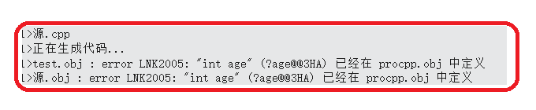
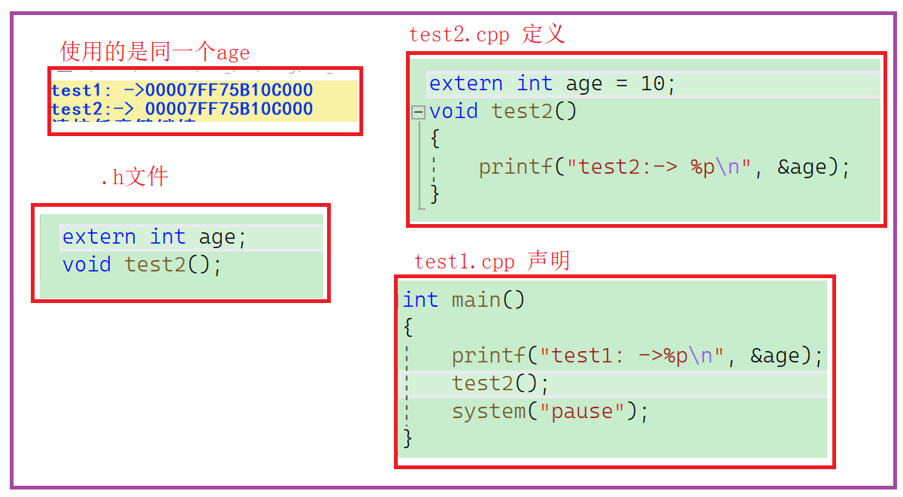
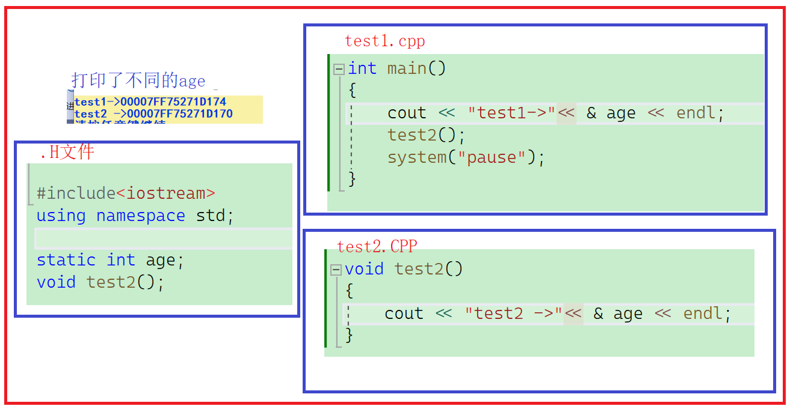

# 类和对象

-   只要写了构造，编译器就不会默认生成，拷贝构造也是构造

**类定义2种方式:**

-   可以将声明和成员函数的定义全部放在类中
-   类中只放成员变量和成员函数的声明，成员函数的定义可以放在.cpp文件中定义，注意: 成员函数名前必须添加类名:

[类的6个默认成员函数](类的6个默认成员函数/类的6个默认成员函数.md "类的6个默认成员函数")

# 类的实例化

-   当类没有实例化时，它的定义和相关信息通常存储在文件管理结构中，而不是分配具体的空间。只有在实例化类时才会分配内存空间来创建对象。
-   C++中的sizeof操作符在计算类类型的大小时，通常会按照内存对齐的规则进行计算。这意味着在计算类的大小时，会考虑成员变量的内存对齐需求，而不会考虑公有函数等成员。
-   **对于空类或只有成员函数的类，C++标准中规定其大小为1字节（byte）**，这是为了确保每个对象都占用独立的内存空间，而不会出现大小为0的对象。尽管空类或只有成员函数的类没有实际的数据成员，但其仍然需要占用一定的空间，以确保对象的唯一性。这个1字节的大小可以理解为一个占位符，用于标识空类或只有成员函数的类存在，并且每个对象都有其自己的内存地址。

# 链接属性

-   使用 `static int age` 是在当前文件中定义一个静态变量。静态变量具有文件作用域，它们只能在定义它们的文件中访问和使用，其他文件无法直接访问它们。静态变量不会进入全局符号表，这意味着其他文件无法通过外部引用的方式访问静态变量。
-   那什么影响生命周期：

生命周期与存储位置有关系.

> 比如在.h头文件定义了 全局变量 int age。在 cpp和h文件都使用链接时符号表合并到一起会报警告



> 声明和定义分离使用,extern int age 定义在.h，另外随机一个.CPP定义

> extern是告诉编译器以什么形式放进符号表



> static int age

> 如果有两个CPP文件，cpp文件使用的是不同的age，因为static是当前文件可见，如果.h文件展开，该age只可以当前文件使用，不会进入符号表。



static他和全局变量不同的是链接属性不一样

-   int age 定义全局变量是 所有文件可见
-   extern int age 是声明 (声明和定义分离使用)
-   static 是 当前文件可见 (不进入符号表)(定义

***

# this指针的特性

this在实参和形参位置不能显示写

但是在类里面可以显示的用

**空指针不会编译错误！！**

```c++
// 1.下面程序编译运行结果是？ A、编译报错 B、运行崩溃 C、正常运行
class A
{
  public:
 void Print()
 {
   cout << "Print()" << endl;
 }
  private:
   int _a;
};
int main()
{
   A* p = nullptr;
   p->Print();
   p->a;  // 额外：：知识 
   return 0;
}

 答案是选C
因为print（）是放公共代码区的，并没有访问类里面成员，在这个公共代码区他没有使用这个空指针.所有是正常运行的 

 额外：：知识 
p->a ，也不会解引用，因为没有访问和给他赋值，这个取决于编译器的优化，不同的编译器优化不一样.
```

.

```c++
// 1.下面程序编译运行结果是？ A、编译报错 B、运行崩溃 C、正常运行
class A
{ 
public:
    void PrintA() 
   {
        cout<<_a<<endl;
   }
private:
 int _a;
};
int main()
{
    A* p = nullptr;
    p->PrintA();
    return 0;
}

 B
print（）是放公共代码区的，并没有访问类里面成员,但是在公共代码区他使用了这个空指针解引用.所有是会导致运行崩 溃
```

【面试题】

1.  this指针存在哪里？

-   this指针会存储在**栈**中，但在某些情况下，编译器可能会进行优化，当对象的数据较小时会将this指针存储在**寄存器**中。这取决于编译器的决策和对代码效率的评估。

1.  this指针可以为空吗？

-   在C++中，this指针不可以为空，它总是指向当前对象的地址。this指针是隐含存在于非静态成员函数中的，它在函数调用时会被自动传递，并指向调用该函数的对象实例。因此，即使在没有显式创建对象的情况下调用非静态成员函数，this指针也会指向一个合法的对象地址。
