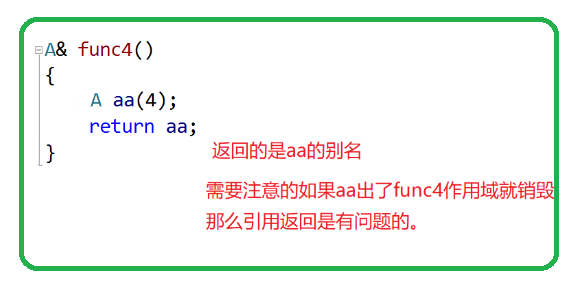

# 类的6个默认成员函数


# 构造函数

1.  函数名与类名相同。
2.  无返回值。
3.  对象实例化时编译器自动调用对应的构造函数。
4.  构造函数可以重载。

构造函数，也是默认成员函数，我们不写，编译器会自动生成

&#x20;编译生成的默认构造的特点：

-   我们不写才会生成，我们写了任意一个构造函数就不会生成了。
-   编译器会自动生成的构造函数成员参数是随机值
-   内置类型的成员不会处理（C++11，声明支持给缺省值）
-   自定义类型的成员才会处理，回去调用这个成员的默认构造函数

    **(不传参就可以调用的构造就是默认构造)**

&#x20;总结：一般情况都需要我们自己写构造函数，决定初始化方式

成员变量全是自定义类型，可以考虑不写构造函数 (但自定义类型构造要自己写)

# 析构函数

-   析构函数的名称与类名相同，前面加上一个波浪号(\~)作为前缀。
-   析构函数没有任何参数，不返回任何值，包括void。它只是用来执行对象的清理工作。
-   对象生命周期结束时，C++编译系统系统自动调用析构函数
-   析构函数会按照相反的顺序逆序调用类的成员对象的析构函数。

> 顿和栈里面的对象都要符合后进先出，也就是后定义先销毁/析构
> 所以先销毁局部变量，而全局变量和static都是放在静态区的，他会等程序结束时才会回收。而一般先会销毁最后定义那个static，最后才到全局变量。

-   如果类中有动态分配的资源（如堆内存或打开的文件），通常应该显式写析构函数以确保资源的释放和清理。
-   内置类型不处理，自定义类型回去自动调用他的构造

# 拷贝构造

如果要使用函数传参，普通的这样写会析构两次如  `void func(Date d1)`,如果是有资源申请的会给free两次，有两个解决办法.

```c++
class Date
{
public:
  Date(int year = 1, int month = 1, int day = 1)
  {
    _year = year;
    _month = month;
    _day = day;
  }
  ~Date()
  {
    cout << "~Date()" << endl;
  }
private:
  // 内置类型
  int _year;
  int _month;
  int _day;
};

void func1(Date d)
{
}

int main()
{
  Date d1(2023, 7, 21);
  func1(d1);
  
  return 0;
}
输出结果输出了：
"~Date()" 
"~Date()" 
析构两次

```

有两个解决办法

1.  解决方法

使用引用可以解决，`void func1(Date& d)` 因为一个对象不用析构两次，出了他创造那个作用域才会被析构，但有一个弊端修改了函数里面的对象，外面的对象也会跟着修改。

1.  解决方法

> 构造函数:&#x20;

我们不写，编译默认生成的拷贝构造，跟之前的构造函数特性不一样

1.  内置类型， 自动调用值拷贝
2.  自定义的类型，调用他的拷贝, (如有申请资源管理的，如不写，会给析构两次，造成错误)

    总结：Date不需要我们实现拷贝构造，默认生成就可以用

    像stack需要我们自己实现深拷贝的拷贝构造，默认生成会出问题

-   浅拷贝与深拷贝：

    浅拷贝：默认的拷贝构造函数实现的是浅拷贝，即只复制对象的引用而不是复制对象的内容。这意味着如果原始对象中有指针类型的成员变量，新对象和原始对象将引用同一块内存地址，可能会导致不可预料的错误。

    深拷贝：如果需要在拷贝构造函数中实现深拷贝，即复制指针所指向的对象而不是复制指针本身，我们需要自定义拷贝构造函数并根据需要手动复制对象的内容。

注意：类中如果没有涉及资源申请时，拷贝构造函数是否写都可以；一旦涉及到资源申请时，则拷贝构造函数是一定要写的，否则就是浅拷贝。

浅拷贝

1、一个对象修改会影响另一个对象

2、会析构两次，程序崩溃

拷贝构造函数典型调用场景：

-   使用已存在对象创建新对象
-   函数参数类型为类类型对象
-   函数返回值类型为类类型对象

```c++

class A
{
public:
  A(int a = 1)
  {
    _a = a;
    cout << "A->" << _a << endl;
  }
  ~A()
  {
    cout << "~A->" << _a << endl;
  }
  A(const A& aa)
  {
    _a = aa._a;
    cout << "copy" << _a << endl;
  }
private:
  int _a;
};

A fucn1()
{
  static A s1(1);
  return s1;
}
A& fucn2()
{
  static A s2(2);
  return s2;
}
int main()
{
  fucn1();
  cout << endl << endl;
  fucn2();
  return 0;

}

//输出结果
 A->1
copy1
~A->1

A->2
~A->2
```



***

# 赋值运算符重载

-   不能通过连接其他符号来创建新的操作符：比如operator@
-   重载操作符必须有一个类类型参数
-   用于内置类型的运算符，其含义不能改变，例如：内置的整型+，不 能改变其含义
-   作为类成员函数重载时，其形参看起来比操作数数目少1，因为成员函数的第一个参数为隐藏的this
-   注意以下5个运算符不能重载。这个经常在笔试选择题中出现。

> `.*` &#x20;

> `::`

> `sizeof `

> `?: `

> `.`

-   不能改变操作符的，操作数个数。一个操作符是几个操作数，那么重载的时候就有几个参数
