# C++11  (下)

## 目录

-   [1. C++11 新增了两个默认成员函数](#1-C11-新增了两个默认成员函数)
-   [2. 强制生成默认函数的关键字default](#2-强制生成默认函数的关键字default)
-   [3. 禁止生成默认函数的关键字delete:](#3-禁止生成默认函数的关键字delete)
-   [4. final与override关键字](#4-final与override关键字)
-   [5. 可变参数模板](#5-可变参数模板)
    -   [STL容器中的empalce接口](#STL容器中的empalce接口)
-   [6. lambda表达式](#6-lambda表达式)
    -   [6.1 lambda表达式语法](#61-lambda表达式语法)
    -   [6.2 lambda表达底层](#62-lambda表达底层)
-   [7. function包装器](#7-function包装器)
-   [8. bind](#8-bind)

# 1. C++11 新增了两个默认成员函数

-   原来C++类中，有6个默认成员函数：
    1.  构造函数
    2.  析构函数
    3.  拷贝构造函数
    4.  拷贝赋值重载
    5.  取地址重载
    6.  const 取地址重载
    最后重要的是前4个，后两个用处不大。默认成员函数就是我们不写编译器会生成一个默认的。 C++11 新增了两个：移动构造函数和移动赋值运算符重载。

    所以到了C++11后有8个默认成员函数。
    -   新增两个是
        -   **移动构造函数**
        -   **移动赋值运算符重载**
    -   只有在深拷贝的情况下才会有移动构造函数和移动赋值运算符重载。可以认为：
        -   **拷贝构造函数与拷贝赋值重载：** 针对于左值的拷贝。
        -   **移动构造函数和移动赋值重载：** 针对于右值的拷贝。

移动构造函数和移动赋值重载，编译器自行生成的默认成员函数，能用的条件的复杂度与苛刻程度远远大于：构造函数、析构函数 、拷贝构造函数 、拷贝赋值重载4个默认成员函数。（由于：取地址重载 、const 取地址重载几乎不用自己写，用编译器的即可，所以忽略）

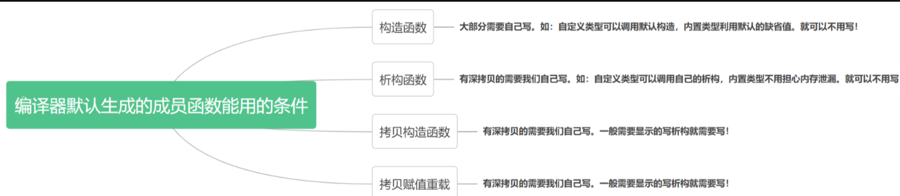

-   **对移动构造函数和移动赋值运算符重载有一些需要注意的点如下：**
    -   移动构造
        -   编译器生成默认移动构造函数的条件：

            没有自己实现移动构造函数，且没有实现析构函数 、拷贝构造、拷贝赋值重载中的任意一个(都没有实现)。那么编译器会自动生成一个默认移动构造。
        -   编译器生成默认移动构造函数的实现：

            默认生成的移动构造函数，对于内置类型成员会执行逐成员按字节拷贝。自定义类型成员，则需要看这个成员是否实现移动构造，如果实现了就调用移动构造，没有实现就调用拷贝构造。
    -   移动赋值 (跟拷贝构造特性完全类似)
        -   编译器生成默认移动赋值重载函数的条件：

            你没有自己实现移动赋值重载函数，且没有实现析构函数 、拷贝构造、拷贝赋值重载中的任意一个，那么编译器会自动生成一个默认移动赋值。
        -   编译器生成默认移动赋值重载函数的实现：

            默认生成的移动构造函数，对于内置类型成员会执行逐成员按字节拷贝，自定义类型成员，则需要看这个成员是否实现移动赋值，如果实现了就调用移动赋值，没有实现就调用拷贝赋值。(默认移动赋值跟上面移动构造完全类似)。
    -   如果你提供了移动构造或者移动赋值（任意一个），编译器不会自动提供拷贝构造和拷贝赋值。
-   什么生成条件如此严格 ？
    -   因为这三个其实是绑定在一起的。一般不会单独出现， 如果要写析构，证明你要深拷贝.

***

# 2. 强制生成默认函数的关键字default

C++11可以让你更好的控制要使用的默认函数。假设你要使用某个默认的函数，但是因为一些原

因这个函数没有默认生成。比如：我们提供了拷贝构造，就不会生成移动构造了，那么我们可以

使用default关键字显示指定移动构造生成。

```c++
class Person
{
public:
    Person(const char* name = "", int age = 0)
        : _name(name), _age(age)
    {}

    Person(const Person& p)
        : _name(p._name), _age(p._age)
    {}

    Person(Person&& p) = default;

private:
    XmLife::string _name;
    int _age;
};

int main()
{
    Person s1;
    Person s2 = s1;
    Person s3 = std::move(s1);
    return 0;
}
```

-   移动构造强制成为default。 就不会自动生成拷贝构造和构造了，相互排斥。 当然可以让两个强制生成.

***

# 3. 禁止生成默认函数的关键字delete:

如果能想要限制某些默认函数的生成，在C++98中，是该函数设置成private，并且只声明补丁

已，这样只要其他人想要调用就会报错。在C++11中更简单，只需在该函数声明加上=delete即

可，该语法指示编译器不生成对应函数的默认版本，称=delete修饰的函数为删除函数。

-   题目：要求delete关键字实现，一个类，只能在堆上创建对象

```c++
 
class HeapOnly
{
public:
    // HeapOnly()
    // {
    //     str_ = new char[10];
    // }
 
    // void Destroy()
    // {
    //     delete[] str_;
    //     operator delete(this); // 内存管理之重载operator delete
    // }
 
    ~HeapOnly() = delete;
private:
    char* str_;
};
 
int main()
{
    // HeapOnly hp1;  // 栈区 -- 会调析构
    // static HeapOnly h2; // 全局数据区 -- 会调析构
    
 
    // new出来的对象会调用构造 -- 这个时候会导致资源泄漏
    HeapOnly *ptr = new HeapOnly;
    operator delete(ptr);
 
    return 0;
}
```

-   new是c++中的操作符，malloc是c中的一个函数。
-   new不止是分配内存，而且会调用类的构造函数，同理delete会调用类的析构函数
-   malloc只会单纯的分配内存，不会进行初始化类成员的工作，同样free也不会调用析构函数。

**#问：**

```c++
class HeapOnly
{
public:
    HeapOnly()
    {
        str_ = new char[10];
    }
 
    ~HeapOnly() = delete;
private:
    char* str_;
};
```

-   **对于构造函数是new空间，因为不能调用析构而不能使用delete，导致值空间泄漏怎么办？**

    &#x20;我们可以搞一个函数，利用函数将其释放。
    ```c++
    class HeapOnly
    {
    public:
        HeapOnly()
        {
            str_ = new char[10];
        }
     
        void Destroy()
        {
            delete[] str_;
            operator delete(this); // 内存管理之重载operator delete
            // 也可以使用free
        }
     
        ~HeapOnly() = delete;
    private:
        char* str_;
    };
     
    int main()
    {
        // HeapOnly hp1;  // 栈区 -- 会调析构
        // static HeapOnly h2; // 全局数据区 -- 会调析构
        
        // new出来的对象会调用构造 -- 这个时候会导致资源泄漏
        HeapOnly *ptr = new HeapOnly;
     
        ptr->Destroy();
     
        return 0;
    }
    ```
    -   承的时候要小心，因为指针是可能出现偏移的，继承之后，切片可能成员位置发生变化，operator delete(this)；的释放位置就可能不对。

***

# 4. final与override关键字

这个我们在继承和多态章节已经进行了详细讲解这里就不再细讲，需要的话去复习继承和多台章

节吧。

-   &#x20;final：修饰虚函数，表示该虚函数不能再被重写
-   override: 检查派生类虚函数是否重写了基类某个虚函数，如果没有重写编译报错。

***

# 5. 可变参数模板

**可变参数**

**可变参数最早的出现是在C语言：**

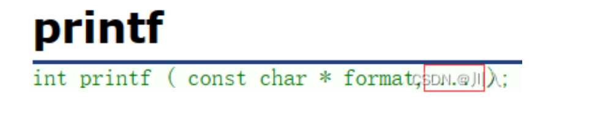

&#x20; 以printf，不确定参数传多少个参数，后面可以传一串值，也就可变参数，可以有0 \~ n个参数。底层是用数组实现的。

***

C++11的新特性可变参数模板能够让您创建可以接受可变参数的函数模板和类模板，相比

C++98/03，类模版和函数模版中只能含固定数量的模版参数，可变模版参数无疑是一个巨大的改

进。然而由于可变模版参数比较抽象，使用起来需要一定的技巧，所以这块还是比较晦涩的。现

阶段呢，我们掌握一些基础的可变参数模板特性就够我们用了，所以这里我们点到为止

下面就是一个基本可变参数的函数模板

```c++
// Args是一个模板参数包，args是一个函数形参参数包
// 声明一个参数包Args...args，这个参数包中可以包含0到任意个模板参数。 

template <class ...Args>
void ShowList(Args... args)
{}


// (不一定非要写作：Args、args，可以换一个名字，只是这两个常用)

```

上面的参数args前面有省略号，所以它就是一个可变模版参数，我们把带省略号的参数称为“参数

包”，它里面包含了0到N（N>=0）个模版参数。我们无法直接获取参数包args中的每个参数的，只能通过展开参数包的方式来获取参数包中的每个参数，这是使用可变模版参数的一个主要特

点，也是最大的难点，即如何展开可变模版参数。由于语法不支持使用args\[i]这样方式获取可变

参数，所以我们的用一些奇招来一一获取参数包的值。

-   &#x20;如果我们想拿到参数包里面的参数，是不好拿的， sizeof 可以帮助我们算参数包里面有多少个参数：
    ```c++
    #include <string>
    #include <iostream>

    // 可变参数的函数模板
    template <class ...Args>
    void ShowList(Args... args)
    {
      std::cout << sizeof...(args) << std::endl;
    }

    int main()
    {
      std::string str("hello");
      ShowList(); //0
      ShowList(1);//1
      ShowList(1, 'A');//2
      ShowList(1, 'A', str);//3
      system("pause");
      return 0;
    }
    ```

**Note：**

```c++
for(int i = 0; i< sizeof...(args); i++)
{
    std::cout << args[i] << " "; // error：args[i]不支持
}
  语法不支持使用args[i]这样方式获取可变参数，所以我们需要用一些奇招来 一一 获取参数包的值。
```

-   递归函数方式展开参数包

```c++
#include <iostream>
#include <string>

void _ShowList()
{
  cout << endl;
}
// 编译时的递归推演
// 第一个模板参数依次解析获取参数值
template <class T, class ...Args>
void _ShowList(const T& val, Args... args)
{
  cout << val << " ";
  _ShowList(args...);
}

template <class ...Args>
void ShowList(Args... args)
{
  _ShowList(args...);
}

int main()
{
  ShowList(1);
  ShowList(1, 2);
  ShowList(1, 2, 3);
  ShowList(1, 2.2, 'x', 3.3);
  system("pause");
  return 0;
}

输出结果->
1
1 2
1 2 3
1 2.2 x 3.3

```

-   逗号表达式展开参数包

第二种：逗号表达式展开参数包

这种展开参数包的方式，不需要通过递归终止函数，是直接在ShowList函数体中展开的, PrintArg不是一个递归终止函数，只是一个处理参数包中每一个参数的函数。这种就地展开参数包的方式实现的关键是逗号表达式，因为逗号表达式会按顺序执行逗号前面的表达式。

```c++
#include <iostream>
#include <string> 
 
template <class T>
void PrintArg(cosnt T t)
{
    std::cout << t << " ";
}
 
// 展开函数
template <class... Args>
void ShowList(Args... args)
{
    // 利用逗号表达式去初始化arr，arr编译的时候就会知道要开多大，这个时候就会依次展开args参数包。
    // 利用逗号表达式去取右边的值0。(逗号表达式会按顺序执行逗号前面的表达式)
    int arr[] = {(PrintArg(args), 0)...};
    std::cout << std::endl;
}
 
int main()
{
    ShowList(1);
    ShowList(1, 'A');
    ShowList(1, 'A', std::string("sort"));
    return 0;
}

```

-   同理，也可以优化为不适用逗号表达式展开参数包：

```c++
#include <iostream>
#include <string> 
 
template <class T>
int PrintArg(cosnt T t)
{
    std::cout << t << " ";
    return 0; 
}
 
// 展开函数
template <class... Args>
void ShowList(Args... args)
{
    // arr编译的时候就会知道要开多大，这个时候就会依次展开args参数包。
    int arr[] = { PrintArg(args)... };
    std::cout << std::endl;
}
 
int main()
{
    ShowList(1);
    ShowList(1, 'A');
    ShowList(1, 'A', std::string("sort"));
    return 0;
}
```

## STL容器中的empalce接口

```c++
template <class... Args>
void emplace_back(Args&&... args);
```

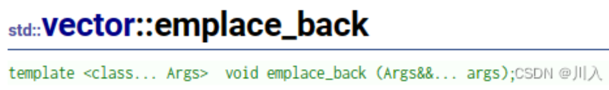

-   mplace\_back是在一个函数模板里面，把一个成员函数是实现成[可变参数](https://so.csdn.net/so/search?q=可变参数\&spm=1001.2101.3001.7020 "可变参数")包。其就是通过将可变参数包不断不断的往下传，传到最下面去初始化对应数据，或者是链表的话就初始化节点里的数据。
-   首先我们看到的emplace系列的接口，支持模板的可变参数，并且万能引用。
-   那么相对insert和emplace系列接口的优势到底在哪里呢?

```c++
// vector::emplace_back
#include <iostream>
#include <vector>
 
int main ()
{
    std::vector<int> myvector;
 
    myvector.push_back(100);
    myvector.emplace_back(200);
 
  return 0;
}
```

-   如果只是简单的int的，其与push\_back就没有什么区别。主要的区别在于：

```c++
// vector::emplace_back
#include <iostream>
#include <vector>
#include <string>
#include <utility>
 
int main()
{
    std::vector<std::pair<std::string, int>> myvector;
 
    myvector.push_back(std::make_pair("sort", 1));
 
    myvector.emplace_back(std::make_pair("sort", 1));
    myvector.emplace_back("sort", 1);
 
    return 0;
}
```

-   效率上就**emplace\_back**更好，因为make\_pair是先构造，构造了一个pair。如此push\_back就传了一个pair对象。所以调push\_back是：
    -   **左值：** 构造 + 拷贝构造。
    -   **右值：** 构造 + 移动构造。
-   &#x20; **emplace\_back**是不用着急创建pair对象，我们可将这个参数包一直向下传递，直到最后需要插入数据的时候，直接用这个数据包创建pair对象。
    -   直接构造。
-   所以emplace系列比insert系列接口不一定高效。
-   **通过代码凸显区别：**

    不一定所有容器都会出现，于源码的实现有关系，此处使用list容器，并在VS2019实现出来的：
    ```c++
    #include <iostream>
    #include <list>
    #include <string>
     
    class Date
    {
    public:
      Date(int year = 1, int month = 1, int day = 1)
        :_year(year)
        , _month(month)
        , _day(day)
      {
        std::cout << "Date(int year = 1, int month = 1, int day = 1)" << std::endl;
      }
     
      Date(const Date& d)
        :_year(d._year)
        , _month(d._month)
        , _day(d._day)
      {
        std::cout << "Date(const Date& d)" << std::endl;
      }
     
    private:
      int _year;
      int _month;
      int _day;
    };
     
    int main()
    {
      std::list<Date> lt1;
      lt1.push_back(Date(2022, 11, 16));
     
      std::cout << "---------------------------------" << std::endl;
        
      lt1.emplace_back(2022, 11, 16);
     
      return 0;
    }
    ```
    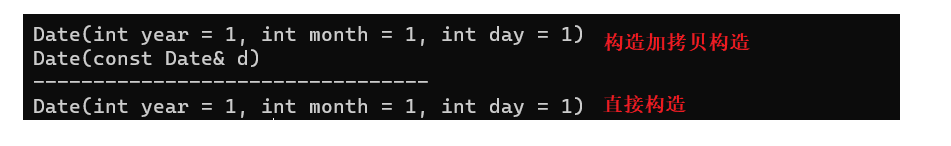
    -   &#x20; 所以建议：这个这种场景下直接使用emplace系列接口。

总结 list 的 emplace\_back是直接构造 ，push\_back 是先构造，再移动构造

***

# 6. lambda表达式

-   C++98中的一个例子

在C++98中，如果想要对一个数据集合中的元素进行排序，可以使用std::sort方法

但是这样太过繁琐了，如果需要按照其他类型比较排序比如价格等 其他的比较要写8个，如果命名不好就更加糟糕，那有没有什么办法，lambda就可以解决这个问题

```c++

struct Goods
{
  string _name;  // 名字
  double _price; // 价格
  int _evaluate; // 评价
  //...

  Goods(const char* str, double price, int evaluate)
    :_name(str)
    , _price(price)
    , _evaluate(evaluate)
  {}
};

//struct ComparePriceLess
struct Compare1
{
  bool operator()(const Goods& gl, const Goods& gr)
  {
    return gl._price < gr._price;
  }
};

//struct ComparePriceGreater
struct Compare2
{
  bool operator()(const Goods& gl, const Goods& gr)
  {
    return gl._price > gr._price;
  }
};

int main()
{
  vector<Goods> v = { { "苹果", 2.1, 5 }, { "香蕉", 3, 4 }, { "橙子", 2.2, 3 }, { "菠萝", 1.5, 4 } };

  sort(v.begin(), v.end(), Compare1());
  sort(v.begin(), v.end(), Compare2());
}

```

随着C++语法的发展，人们开始觉得上面的写法太复杂了，每次为了实现一个algorithm算法，

都要重新去写一个类，如果每次比较的逻辑不一样，还要去实现多个类，特别是相同类的命名，

这些都给编程者带来了极大的不便。因此，在C++11语法中出现了Lambda表达式。

***

## 6.1 lambda表达式语法

```c++
lambda表达式书写格式：
[capture-list] (parameters) mutable -> return-type { statement}
```

1.  lambda表达式各部分说明

-   \[capture-list] : 捕捉列表，该列表总是出现在lambda函数的开始位置，编译器根据\[]来

判断接下来的代码是否为lambda函数，捕捉列表能够捕捉上下文中的变量供lambda

函数使用。

-   (parameters)：参数列表。与普通函数的参数列表一致，如果不需要参数传递，则可以

连同()一起省略

-   mutable：默认情况下，lambda函数总是一个const函数，mutable可以取消其常量

性。使用该修饰符时，参数列表不可省略(即使参数为空)。

-   ->returntype：返回值类型。用追踪返回类型形式声明函数的返回值类型，没有返回

值时此部分可省略。返回值类型明确情况下，也可省略，由编译器对返回类型进行推

导。

-   {statement}：函数体。在该函数体内，除了可以使用其参数外，还可以使用所有捕获

到的变量。

注意：

在lambda函数定义中，参数列表和返回值类型都是可选部分，而捕捉列表和函数体可以为

空。因此C++11中最简单的lambda函数为：\[]{}; 该lambda函数不能做任何事情。

```c++
int main()
{
  // 两个数相加的lambda
  auto add1 = [](int a, int b)->int{return a + b; };
  cout << add1(1, 2) << endl;

  // 省略返回值
  auto add2 = [](int a, int b){return a + b; };
  cout << add2(1, 2) << endl;

  // 交换变量的lambda
  int x = 0, y = 1;
  auto swap1 = [](int& x1, int& x2)->void{int tmp = x1; x1 = x2; x2 = tmp; };
  swap1(x, y);
  cout << x << ":" << y << endl;

  auto swap2 = [](int& x1, int& x2)
  {
    int tmp = x1;
    x1 = x2;
    x2 = tmp;
  };

  swap2(x, y);
  cout << x << ":" << y << endl;

  // 不传参数交换x y的lambda  -- 捕捉列表
  // 默认捕捉的对象不能修改
  /*auto swap3 = [x, y]()mutable
  {
    int tmp = x;
    x = y;
    y = tmp;
  };

  swap3();
  cout << x << ":" << y << endl;*/

  auto swap3 = [&x, &y]
  {
    int tmp = x;
    x = y;
    y = tmp;
  };

  swap3();
  cout << x << ":" << y << endl;


  return 0;
}

 通过上述例子可以看出，lambda表达式实际上可以理解为无名函数，该函数无法直接调
用，如果想要直接调用，可借助auto将其赋值给一个变量。
```

-   &#x20;lambda表达式写法

```c++
int main()
{
  vector<Goods> v = { { "苹果", 2.1, 5 }, { "香蕉", 3, 4 }, { "橙子", 2.2,
   3 }, { "菠萝", 1.5, 4 } };
  sort(v.begin(), v.end(), [](const Goods& g1, const Goods& g2) {
    return g1._price < g2._price; });
    
  sort(v.begin(), v.end(), [](const Goods& g1, const Goods& g2) {
    return g1._price > g2._price; });
    
  sort(v.begin(), v.end(), [](const Goods& g1, const Goods& g2) {
    return g1._evaluate < g2._evaluate; });
    
  sort(v.begin(), v.end(), [](const Goods& g1, const Goods& g2) {
    return g1._evaluate > g2._evaluate; });
}
```

**#问：如何写一个交换swap函数？**

```c++
#include <iostream>
 
int main()
{
    // 交换变量的lambda - 行数会多
    int x = 0, y = 1;
    auto swap1 = [](int &x1, int &x2) -> void{int tmp = x1; x1 = x2; x2 = tmp; };
    swap1(x, y);
    std::cout << x << ":" << y << std::endl;
}
```

**#问：假如我们想不传参数交换x，y呢？**

利用捕捉列表实现，注意：

想捕捉谁就写谁，只能捕捉跟lambda表达式**同一个作用域的对象**。
默认捕捉过来的变量不能修改 —— 加mutable让捕捉过来的变量可以修改（使用mutable必须加()）。
默认捕捉是拷贝的方式捕捉，严格意义上说是传值捕捉。（lambda还是一个函数调用，是有栈帧的 —— 可以理解为：改变形参，不会改变实参）

```c++
#include <iostream>
 
int main()
{
    // 交换变量的lambda - 行数会多
    int x = 0, y = 1;
 
    // 可以理解为：改变形参，不会改变实参
    auto swap = [x, y]()mutable
    {
        int tmp = x; 
        x = y; 
        y = tmp; 
    };
    
    swap();
    std::cout << x << ":" << y << std::endl;
}
```

**捕获列表说明**

捕捉列表描述了上下文中那些数据可以被lambda使用，以及使用的方式传值还是传引用。

-   \[var]：表示值传递方式捕捉变量var
-   \[=]：表示值传递方式捕获所有父作用域中的变量(包括this)
-   \[\&var]：表示引用传递捕捉变量var
-   \[&]：表示引用传递捕捉所有父作用域中的变量(包括this)
-   \[this]：表示值传递方式捕捉当前的this指针
-   1、生命周期（存储区域）
-   2、作用域（编译器编译，用的地方能否找到）

注意：-

-   a. 父作用域指包含lambda函数的语句块
-   b. 语法上捕捉列表可由多个捕捉项组成，并以逗号分割。

    比如：\[=, \&a, \&b]：以引用传递的方式捕捉变量a和b，值传递方式捕捉其他所有变量

    \[&，a, this]：值传递方式捕捉变量a和this，引用方式捕捉其他变量

    对于以值传递方式捕获的变量 ，**在 lambda 表达式中对其进行递增操作是无效的**。这是因为在捕获时，这些变量被复制到了 lambda 表达式的闭包中，并且只能在闭包内部修改副本的值，而不会影响外部的原始变量。

<!---->

-   c. 捕捉列表不允许变量重复传递，否则就会导致编译错误。

    &#x20;  比如：\[=, a]：=已经以值传递方式捕捉了所有变量，捕捉a重复
-   d. 在块作用域以外的lambda函数捕捉列表必须为空。
-   e. 在块作用域中的lambda函数仅能捕捉父作用域中局部变量，捕捉任何非此作用域或者

    非局部变量都会导致编译报错。
-   f. lambda表达式之间不能相互赋值，即使看起来类型相同

```c++
void (*PF)();
int main()
{
  auto f1 = [] {cout << "hello world" << endl; };
  auto f2 = [] {cout << "hello world" << endl; };
   // 此处先不解释原因，等lambda表达式底层实现原理看完后，大家就清楚了
  //f1 = f2;   // 编译失败--->提示找不到operator=() 
  
  // 允许使用一个lambda表达式拷贝构造一个新的副本
  auto f3(f2);
  f3();
  
  // 可以将lambda表达式赋值给相同类型的函数指针
  PF = f2;
  PF();

  system("pause");
  return 0;
}
```

-   捕捉this
    ```c++
    class AA
    {
    public:
      void func()
      {
        /*auto f1 = [this]() {
          cout << a1 << endl;
          cout << a2 << endl;
        };*/
        auto f1 = [=]() {
          cout << a1 << endl;
          cout << a2 << endl;
        };

        f1();
      }
    private:
      int a1 = 1;
      int a2 = 1;
    };

    ```

***

## 6.2 **lambda表达底层**

-   **函数对象与lambda表达式**区别

函数对象，又称为仿函数，即可以想函数一样使用的对象，就是在类中重载了operator()运算符的类对象，与范围for很像。

**范围for：**

并没有看起来这么的智能，实际上是底层运用迭代器实现的。

```c++
class Rate
{
public:
    Rate(double rate) : _rate(rate)
    {}
 
    double operator()(double money, int year)
    {
        return money * _rate * year;
    }
 
private:
    double _rate;
};
 
int main()
{
    // 函数对象
    double rate = 0.49;
    Rate r1(rate);
    r1(10000, 2);
 
    // lamber
    auto r2 = [=](double monty, int year) -> double
    {
        return monty * rate * year;
    };
 
    r2(10000, 2);
    return 0;
}
```

从使用方式上来看，函数对象与lambda表达式完全一样。

函数对象将rate作为其成员变量，在定义对象时给出初始值即可，lambda表达式通过捕获列表可以直接将该变量捕获到

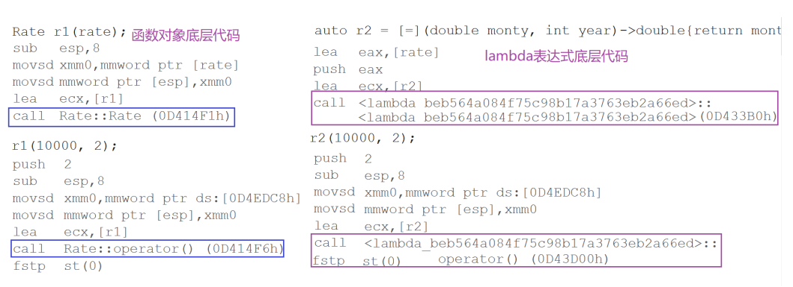

实际在底层编译器对于lambda表达式的处理方式，完全就是按照函数对象的方式处理的，即：如
果定义了一个lambda表达式，编译器会自动生成一个类，在该类中重载了operator()

***

# 7. **function包装器**

**function包装器**

-   **function包装器 也叫作适配器**。C++中的function本质是一个类模板，也是一个包装器。那么我们来看看，我们为什么需要function呢？

```c++
#include <iostream>
 
template <class F, class T>
T useF(F f, T x)
{
    static int count = 0;
    cout << "count:" << ++count << endl;
    cout << "count:" << &count << endl;
    return f(x);
}
double f(double i)
{
    return i / 2;
}
struct Functor
{
    double operator()(double d)
    {
        return d / 3;
    }
};
int main()
{
    // 函数名
    std::cout << useF(f, 11.11) << std::endl;
 
    // 仿函数对象
    std::cout << useF(Functor(), 11.11) << std::endl;
 
    // lamber表达式对象
    std::cout << useF([](double d)->double{ return d/4; }, 11.11) << std::endl;
    return 0;
}
```

-   &#x20;因为上述的 **f** 的类型不同，于是会被实例化成三个。

    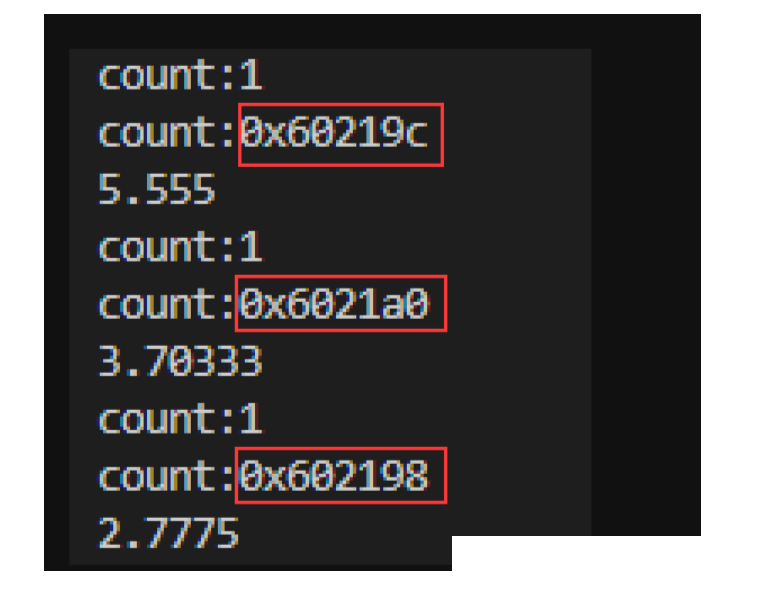
-   &#x20; 包装器可以很好的解决上面的问题，将其变为1份。

```c++
std::function在头文件 < functional >
// 类模板原型如下
template < class T > function ;     // undefined
template < class Ret , class ... Args >
class function < Ret ( Args ...) > ;
-

模板参数说明：

Ret : 被调用函数的返回类型
Args…：被调用函数的形参

```

-   **使用方法：**
    ```c++
    // 使用方法如下：
    #include <functional>
    #include <iostream>
     
    int f(int a, int b)
    {
        return a + b;
    }
     
    struct Functor
    {
    public:
        int operator()(int a, int b)
        {
            return a + b;
        }
    };
     
    int main()
    {
         // 函数名(函数指针) 
        std::function<int(int, int)> func1 = f;
        std::cout << func1(1, 2) << std::endl;
     
         // 函数对象 
        std::function<int(int, int)> func2 = Functor();
        std::cout << func2(1, 2) << std::endl;
     
         // lamber表达式 
        std::function<int(int, int)> func3 = [](const int a, const int b)
        { return a + b; };
        std::cout << func3(1, 2) << std::endl;
     
        return 0;
    }
    ```
    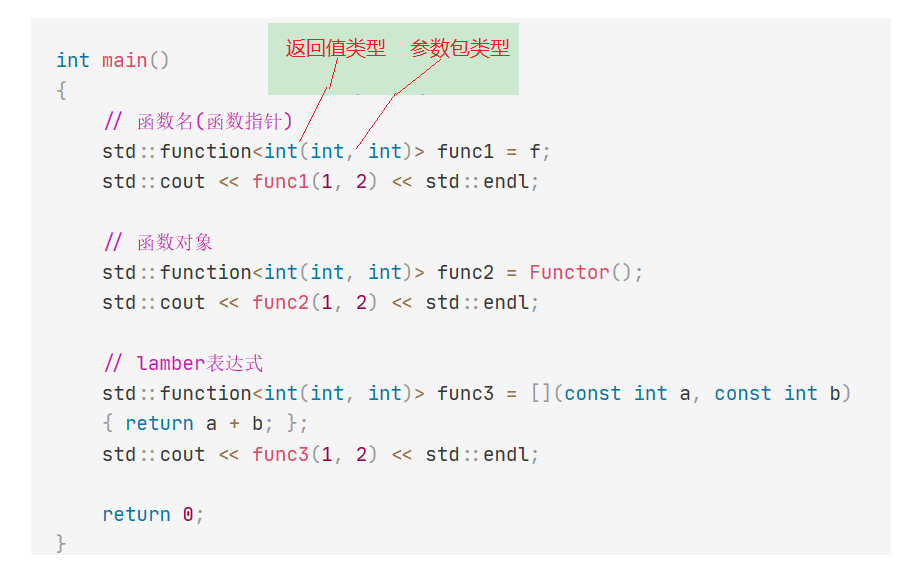
-   所以对于上面的，因为上述的 **f** 的类型不同，于是会被实例化成三个，就可以解决了：
    ```c++
    #include <iostream>
    #include <functional>
     
    template <class F, class T>
    T useF(F f, T x)
    {
        static int count = 0;
        std::cout << "count:" << ++count << std::endl;
        std::cout << "count:" << &count << std::endl;
        return f(x);
    }
    double f(double i)
    {
        return i / 2;
    }
    struct Functor
    {
        double operator()(double d)
        {
            return d / 3;
        }
    };
     
    int main()
    {
      // 函数指针
      std::function<double(double)> f1 = f;
      std::cout << useF(f1, 11.11) << std::endl;
     
      // 函数对象
      std::function<double(double)> f2 = Functor();
      std::cout << useF(f2, 11.11) << std::endl;
     
      // lamber表达式对象
      std::function<double(double)> f3 = [](double d)->double{ return d / 4; };
      std::cout << useF(f3, 11.11) << std::endl;
     
      return 0;
    }
    ```
    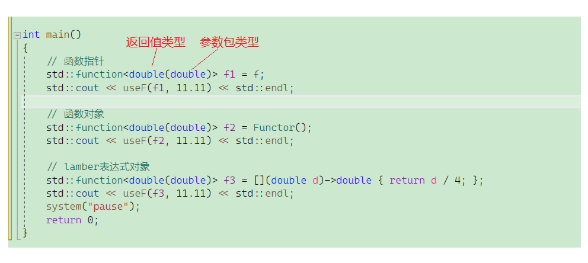

    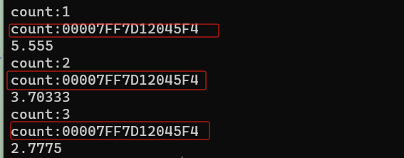
-   **对于静态成员函数与非静态成员函数的不同**
    ```c++
    #include <functional>
    #include <iostream>

    class Plus
    {
    public:
      static int plusi(int a, int b)
      {
        return a + b;
      }
      double plusd(double a, double b)
      {
        return a + b;
      }
    };

    int main()
    {
      //类的成员函数 -- 语法规定
       // 静态成员函数可以不用加&，可以加&。并且可以直接调用。 
      std::function<int(int, int)> func4 = Plus::plusi;
      std::cout << func4(1, 2) << std::endl;

       // 非静态成员函数需要加&，并且不能直接调用，需要传对象 (因为非静态成员函数有个this指针)，此处为Plus。（成员函数多传一个） 
      std::function<double(Plus, double, double)> func5 = &Plus::plusd;
      std::cout << func5(Plus(), 1.1, 2.2) << std::endl;

       //还可以这样传 不过麻烦一点 
      std::function<double(Plus*, double, double)> func6 = &Plus::plusd;
      Plus ps;
      std::cout << func6(&ps, 1.1, 2.2) << std::endl;
      return 0;
    }
    ```
-   \*\* 如果对于非静态成员函数，不想多传一个类对象的参数，可以通过绑定的方式解决这个问题。\*\* ​

***

# 8. bind

std::bind函数定义在头文件中，**是一个函数模板，它就像一个函数包装器(适配器)，接受一个可**

**调用对象（callable object）**，**生成一个新的可调用对象来“适应”原对象的参数列表**。一般而

言，我们用它可以把一个原本接收N个参数的函数fn，通过绑定一些参数，返回一个接收M个（M

可以大于N，但这么做没什么意义）参数的新函数。同时，**使用std::bind函数还可以实现参数顺**

序调整等操作。

```c++
// 原型如下：
template <class Fn, class... Args>
/* unspecified */ bind (Fn&& fn, Args&&... args);
// with return type (2) 
template <class Ret, class Fn, class... Args>
/* unspecified */ bind (Fn&& fn, Args&&... args)
```

调用bind的一般形式：**auto newCallable = bind(callable,arg\_list);**

库中就是使用了placeholders来占位：

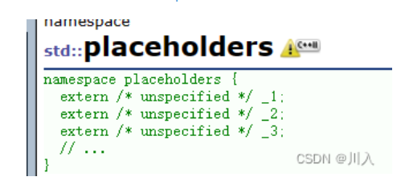

其中的\*\*\_1、\_2、\_3\*\*等，就是用来占位的。\_1代表第1个参数，\_2代表第2个参数……。调整的是形参的顺序。

其中，newCallable本身是一个可调用对象，arg\_list是一个逗号分隔的参数列表，对应给定的

callable的参数。当我们调用newCallable时，newCallable会调用callable,并传给它arg\_list中

的参数。

arg\_list中的参数可能包含形如\_n的名字，其中n是一个整数，这些参数是“占位符”，表示

newCallable的参数，它们占据了传递给newCallable的参数的“位置”。数值n表示生成的可调用对象中参数的位置：*1为newCallable的第一个参数，* 2为第二个参数，以此类推

```c++
#include <functional>
#include <iostream>

int Div(int a, int b)
{
  return a / b;
}

int main()
{
  int x = 10, y = 2;
  std::cout << Div(x, y) << std::endl;

  // 调整顺序 -- 鸡肋，一般用不上
  // _1, _2.... 定义在placeholders命名空间中，代表绑定函数对象的形参，
  // _1，_2... 分别代表第一个形参、第二个形参...

  //std::function<int(int, int)> bindFunc = bind(Div, std::placeholders::_2, std::placeholders::_1);
  auto bindFunc = bind(Div, std::placeholders::_2, std::placeholders::_1);

  // 传时候不会变
  std::cout << bindFunc(x, y) << std::endl;

  system("pause");
  return 0;
}

 //输出 
5 
0
```

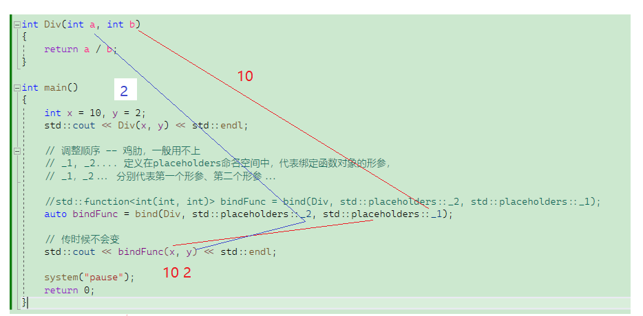

可以理解为：

```c++
// x -> _1 ->a
// y -> _2 ->b。
auto bindFunc = bind(Div, _1, _2);
bindFunc(x, y);
 
// x -> _2 ->b
// y -> _1 ->a。
auto bindFunc = bind(Div, _2, _1);
bindFunc(x, y);
```

-   **以用绑定解决前面的非静态成员函数，需要传类对象（成员函数多传一个），以绑定参数解决 -> 调整个数。**
    ```c++
    #include <functional>
    #include <iostream>
    #include <map>
     
    int Plus(int a, int b)
    {
      return a + b;
    }
     
    int Mul(int a, int b, double rate)
    {
      return a * b * rate;
    }
     
    class Sub
    {
    public:
      int sub(int a, int b)
      {
        return a - b;
      }
    };
     
    // 11:50继续
    int main()
    {
      // 调整个数, 绑定死固定参数
      std::function<int(int, int)> funcPlus = Plus;
     
        // 本来要传3个.
      // function<int(Sub, int, int)> funcSub = &Sub::sub;
        // 将其变为只传2个，将1个（此处Sub()）固定在这个地方绑死 — 不能变。
      std::function<int(int, int)> funcSub = std::bind(&Sub::sub, Sub(), std::placeholders::_1, std::placeholders::_2);
     
        // 1.5就固定死了
      std::function<int(int, int)> funcMul = std::bind(Mul, std::placeholders::_1, std::placeholders::_2, 1.5);
     
      std::map<std::string, std::function<int(int, int)>> opFuncMap = 
      {
        { "+", Plus},
        { "-", std::bind(&Sub::sub, Sub(), std::placeholders::_1, std::placeholders::_2)}
      };
     
      std::cout << funcPlus(1, 2) << std::endl;
      std::cout << funcMul(2, 2) << std::endl;
      std::cout << funcSub(1, 2) << std::endl;
     
      std::cout << opFuncMap["+"](1, 2) << std::endl;
      std::cout << opFuncMap["-"](1, 2) << std::endl;
     
      return 0;
    }
    ```
    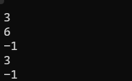
