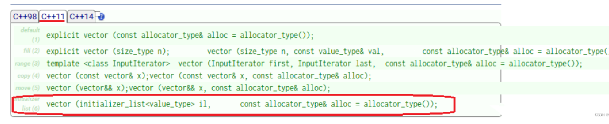
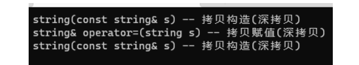
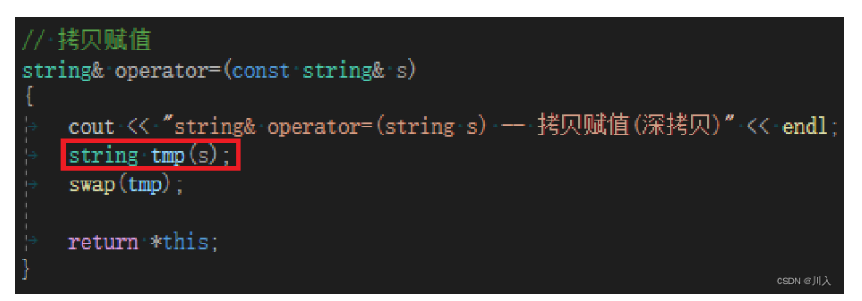
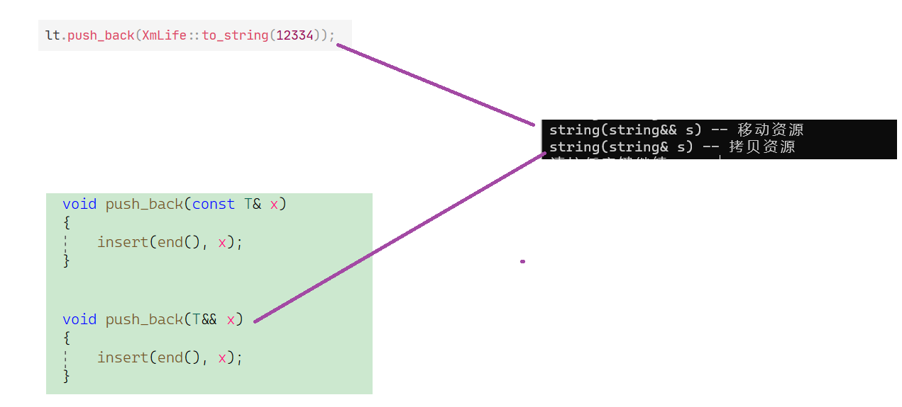

# C++11（上）

## 目录

-   [1. 统一的列表初始化](#1-统一的列表初始化)
    -   [ std::initializer\_list](#-stdinitializer_list)
        -   [std::initializer\_list使用场景：](#stdinitializer_list使用场景)
-   [2. 声明](#2-声明)
    -   [2.1 auto](#21-auto)
    -   [2.2 decltype](#22-decltype)
    -   [2.3 nullptr](#23-nullptr)
-   [3. 范围for](#3-范围for)
-   [4. STL中一些变化](#4-STL中一些变化)
    -   [array容器](#array容器)
    -   [forward\_list容器](#forward_list容器)
-   [5. 容器中的一些新方法](#5-容器中的一些新方法)
-   [6 右值引用和移动语义](#6-右值引用和移动语义)
    -   [6.1 左值引用的使用场景](#61-左值引用的使用场景)
    -   [6.2 右值引用使用场景和意义](#62-右值引用使用场景和意义)
    -   [6.3 右值引用和移动语义解决上述问题：](#63-右值引用和移动语义解决上述问题)
        -   [移动构造的价值：](#移动构造的价值)
        -   [移动赋值](#移动赋值)
        -   [C++11将STL库也进行了更新，此处举例几个容器：](#C11将STL库也进行了更新此处举例几个容器)
        -   [move](#move)
        -   [传值插入问题](#传值插入问题)
        -   [万能引用 & 完美转发](#万能引用--完美转发)
            -   [完美转发std::forward](#完美转发stdforward)

# 1. 统一的列表初始化

-   在C++98中，标准允许使用花括号{}对数组或者结构体元素进行统一的列表初始值设定。比如：
    ```c++
    struct Point
    {
      int _x;
      int _y;
    };
    int main()
    {
      int array1[] = { 1, 2, 3, 4, 5 };
      int array2[5] = { 0 };
      Point p = { 1, 2 };
      return 0;
    }
    ```
-   C++11扩大了用大括号括起的列表(初始化列表)的使用范围，使其可用于所有的内置类型和用户自定义的类型，**使用初始化列表时，可添加等号(=)，也可不添加**。
    ```c++
    struct A
    {
        int _x;
        int _y;
    };
     
    int main()
    {
      int x1 = 1;
      // 要能看懂，但是不建议使用
      int x2 = { 2 };
      int x3{ 2 };
     
      // 要能看懂，但是不建议使用
        int array1[]{ 1, 2, 3, 4, 5 };
        int array2[5]{ 0 };
        A p{ 1, 2 };
     
      // C++11中列表初始化也可以适用于new表达式中
      int* pa = new int[4]{ 0 };
     
      return 0;
    }
    ```
-   创建对象时也可以使用列表初始化方式调用构造函数初始化：
    ```c++
    // 日期类
    class Date
    {
    public:
      Date(int year, int month, int day)
        :_year(year)
        , _month(month)
        , _day(day)
      {
        cout << "Date(int year, int month, int day)" << endl;
      }
     
    private:
      int _year;
      int _month;
      int _day;
    };
     
    int main()
    {
      // 都是在调用构造函数
      Date d1(2022, 12, 31);
      // C++11 要能看懂，但是不建议使用
      
      // 类型转换  构造+拷贝构造-》优化直接构造
      // 跟对应构造函数参数个数匹配
      Date d2 = { 2022, 12, 31 }; // ->调用构造函数
      Date d3{ 2022, 12, 31 };
      return 0;
    }
    ```

***

## &#x20;std::initializer\_list

-   上面的{}使用添加，甚至可添加等号(=)，也可不添加的使用方式，更多的是为了此种方式的使用而开发的。只是给上面的也配置了，然而这，对于上面的普通使用就会显得十分臃肿，所以上面并不建议使用C++11扩大的{}使用规制。

**std::initializer\_list的介绍文档：**

[https://cplusplus.com/reference/initializer\_list/initializer\_list/](https://cplusplus.com/reference/initializer_list/initializer_list/ "https://cplusplus.com/reference/initializer_list/initializer_list/")

-   **对于**[**STL**](https://so.csdn.net/so/search?q=STL\&spm=1001.2101.3001.7020 "STL")**所封装的容器是支持一下的使用方法的：**
    ```c++
    #include<vector>
    #include<list>
    using namespace std;
     
    int main()
    {
      vector<int> v1 = { 1, 2, 3, 4, 5, 6 };
      vector<int> v2 { 1, 2, 3, 4, 5, 6 };
     
      list<int> lt1 = { 1, 2, 3, 4, 5, 6 };
      list<int> lt2{ 1, 2, 3, 4, 5, 6 };
      return 0;
    }
    ```
-   &#x20;这难道是因为为{}搞了一个operator{}重载吗？并不是的，因为{}是不属于运算符，所以并不可能是运算符重载，而是为{}封装成了一个类型：
    ```c++
    #include<iostream>
    #include<vector>
    #include<list>
    using namespace std;
    int main()
    {
      auto a = { 1, 2, 3, 4, 5, 6 };    // 利用auto将a变为{}的类型
      cout << typeid(a).name() << endl; // 打印出a类型，即{}的类型
     
      return 0;
    }
    ```
    

#### **std::initializer\_list使用场景：**


-   在initializer\_list的封装里拥有begin，end。可以说是将initializer\_list封装成了一个迭代器，而STL中容器就是利用此，通过调用构造函数利用initializer\_list所封装的迭代器进行初始化。（该构造函数为C++11新增）。对于operator=也是同理：

（以[list容器](https://so.csdn.net/so/search?q=list容器\&spm=1001.2101.3001.7020 "list容器")举例：）

\+


vector:&#x20;




总结：

-   td::initializer\_list一般是作为构造函数的参数，C++11对STL中的不少容器就增加
-   std::initializer\_list作为参数的构造函数，这样初始化容器对象就更方便了。也可以作为operator=的参数，这样就可以用大括号赋值。
-   自定义类型可以支持多个对象初始化，只需要增加initializer\_list类型的构造函数即可
-   在C++98支持的对于自定义对象，支持多个同类型的数据初始化：

```c++
#include<vector>
using namespace std;
 
// 日期类
class Date
{
public:
  Date(int year, int month, int day)
    :_year(year)
    , _month(month)
    , _day(day)
  {
    cout << "Date(int year, int month, int day)" << endl;
  }
 
private:
  int _year;
  int _month;
  int _day;
};
 
int main()
{
  Date d1(2022, 12, 31);
  Date d2(2022, 12, 31);
  Date d3(2022, 12, 31);
 
  vector<Date> v = { d1, d2, d3 };
  return 0;
}
```

-   &#x20; 而C++11有了对于{}的支持，也就有了一下的使用方法：
    ```c++
    #include<iostream>
    #include<vector>
    using namespace std;
     
    // 日期类
    class Date
    {
    public:
      Date(int year, int month, int day)
        :_year(year)
        , _month(month)
        , _day(day)
      {
        cout << "Date(int year, int month, int day)" << endl;
      }
     
    private:
      int _year;
      int _month;
      int _day;
    };
     
    int main()
    {
      vector<Date> v = { {2022, 12, 31},{2022, 1, 1} };
     
      return 0;
    }
    ```

.   这样的支持其实是相当于隐式类型的转换了。在C++98里面是单参数的构造函数支持隐式类型的转换，现在相当于多参数的构造函数也支持隐式类型的转换了。

```c++
#include<string>
using namespace std;
int main()
{
  // 单参数的构造函数支持隐式类型的转换：string支持了一个char*
  string str = "123456789";
  return 0;
}
```

-   其本质是：利用“123456789”构造了一个匿名对象的string，然后再拷贝构造给str。编译器一看，在一个步骤里面，于是直接进行了优化：直接变成构造，即：隐式类型的转换。
-   同样的道理，再拥有{}的使用之后，也就支持 {2022， 12， 31} 隐式类型的转换。其，其实也是先构造了一个匿名对象的Date，然后再拷贝构造给v。编译器直接优化：直接变成构造。不用写为：vector\<Date> v = { d1, d2, d3 }; 而直接写为；vector\<Date> v = { {2022, 12, 31}, {2022, 1, 1} }; 即，其会调用隐式类型的转换。
-   执行：上面的 vector\<Date> v = { {2022, 12, 31},{2022, 1, 1} }; 代码:


-   这就是C++11添加{}用法的主要原因，支持了多参数的隐式类型的转换，使得使用更加方便：
    ```c++
    #include<map>
    #include<string>
    using namespace std;
    int main()
    {
      map<string, string> dict = { {"sort", "排序"}, {"insert", "插入"} };
      return 0;
    }
    ```
-   此处是两层的支持：
    -   map支持了initializer\_list的构造
    -   initializer\_list是每个地方的数据{"sort", "排序"}，其又是一个pair，pair又支持链表的初始化，是匿名对象再拷贝构造的优化，直接调用构造，每一个{"sort", "排序"}单位都是调用一个pair构造，多参数的隐式类型的转换。

```c++
#include<map>
#include<string>
using namespace std;
int main()
{
  // 构造
  map<string, string> dict = { {"sort", "排序"}, {"insert", "插入"} };
 
  // 赋值重载
  dict = { {"erase", "删除"}, {"find", "寻找"} };
  return 0;
}
```

**note：**

**C++11**

**{}初始化的使用添加，使得在C++11之后的一切对象都可以用列表初始化，但是不建议普通对象进行使用，普通对象建议还是使用以前的方式。对于容器如果有需求，在容器初始化的时候是有其的价值的。**

***

# 2. **声明**

-   c++11提供了多种简化声明的方式，尤其是在使用模板时。

***

## 2.1 auto

-   在C++98中auto是一个存储类型的说明符，表明变量是局部自动存储类型，但是局部域中定义局部的变量默认就是自动存储类型，所以auto就没什么价值了。C++11中废弃auto原来的用法，将其用于实现自动类型腿断。这样要求必须进行显示初始化，让编译器将定义对象的类型设置为初始化值的类型。
    -   auto仅仅只是占位符，编译阶段编译器根据初始化表达式推演出实际类型之后会替换auto
    ```c++
    #include<iostream>
    #include<map>
    #include<string>
    using namespace std;
     
    int main()
    {
      int i = 10;
      auto p = &i;
      auto pf = strcpy;
      cout << typeid(p).name() << endl;
      cout << typeid(pf).name() << endl;
     
      // 对于过于复杂的类型，可以不用写直接使用auto让编译器自行推测
      map<string, string> dict = { {"sort", "排序"}, {"insert", "插入"} };
      //map<string, string>::iterator it = dict.begin();
      auto it = dict.begin();
      return 0;
    }
    ```

auto也一定的坏处，以auto it = dict.begin(); 为例：知道的人当然明白其是一个迭代器，但是如果是一个不明白的人，那么就需要去查看 dict.begin() 的返回值是什么，才能知道返回值 auto 所推测的类型。

所以，**auto在一定程度上的提高了代码的便捷性，但也一定程度上的降低了代码的可读性。**

***

## 2.2 **decltype**

decltype就是用来可以推导数据类型，那么其于 typeid().name 有什么区别？

typeid().name 是我们可以推导一个类型，但是我们不能用其去定义一个对象。只是单纯的拿到该类型的字符串。关键字decltype可以将变量的类型声明为表达式指定的类型：

```c++
int main()
{
  int x = 10;
 
  // typeid拿到只是类型的字符串，不能用这个再去定义对象什么的
  //typeid(x).name() y = 20;
 
  decltype(x) y = 20;
  return 0;
}
```

-   &#x20; 那auto也可以，为何需要decltype？因为decltype是由decltype推导的类型决定的，而auto是由 = 的右值决定的：
    ```c++
    #include<iostream>
    using namespace std;
     
    int main()
    {
      int x = 10;
     
      decltype(x) y1 = 3.1415926;
      auto y2 = 3.1415926;
      cout << y1 << endl;
      cout << y2 << endl;
     
      return 0;
    }
    ```


y1的类型是int，y2类型是double。

**decltype的使用场景举例：**

如两个类型相乘的值不知道最终的类型。

```c++
// decltype的一些使用使用场景
template<class T1, class T2>
 
void F(T1 t1, T2 t2)
{
    decltype(t1 * t2) ret;
    cout << typeid(ret).name() << endl;
}
```

```c++
int main()
{
  int i = 1;
  double d = 2.2;

  // 类型以字符串形式获取到
  cout << typeid(i).name() << endl;
  cout << typeid(d).name() << endl;

  auto ret = i * d;
  decltype(ret) x;

  // 用ret的类型去实例化vector 
  // decltype可以推导对象的类型。这个类型是可以用
  // 用来模板实参，或者再定义对象
  
  vector<typeid(ret).name()> v; //error
  vector<decltype(ret)> v;
  return 0;
}
```

***

## 2.3 nullptr

-   由于C++中NULL被定义成字面量0，这样就可能回带来一些问题，因为0既能指针常量，又能表示整形常量。所以出于清晰和安全的角度考虑，C++11中新增了nullptr，用于表示空指针。

```c++
#ifndef NULL

#ifdef __cplusplus

#define NULL   0

#else

#define NULL   ((void *)0)

#endif

#endif
```

-   &#x20;在之前的C++98**中的指针空值**中，我们所使用的空指针的定义是NULL。所以，相对应的以宏将NULL定义为0，就会出现一下类似的情况等：
    ```c++
    using namespace std;
    void pointer(int)
    {
      cout << "pointer(int)" << endl;
    }
     
    void pointer(int*)
    {
      cout << "pointer(int*)" << endl;
    }
     
    int main()
    {
      int* p = NULL;
      pointer(0);
      pointer(NULL);
      pointer(p);
      return 0;
    }
    ```
    pointer(NULL)传递的是int类型的。

    

***

# 3. 范围for

-   &#x20;若是在C++98中我们要遍历一个数组，可以按照以下方式：
    ```c++
    #include<iostream>
    using namespace std;
     
    int main()
    {
      int array[] = { 1, 2, 3, 4, 5, 6, 7, 8, 9, 10 };
     
      //打印数组中的所有元素
      for (int i = 0; i < sizeof(array) / sizeof(array[0]); i++)
      {
        cout << array[i] << " ";
      }
      cout << endl;
      return 0;
    }
    ```
-   C++11新标准引入一种更简单的 for 语句，这种语句可以**遍历容器或其他序列的所有元素**。for循环后的括号由冒号“ ：”分为两部分：第一部分是范围内用于迭代的变量，第二部分则表示被迭代的范围。
    ```c++
    void Test_For()
    {
        int array[] = { 1, 2, 3, 4, 5 };
     
        for (auto e : array)    //变化前
            cout << e << " ";
        cout << endl;
     
        for (auto& e : array)   //使用应用使得可以更改数据
            e *= 2;
     
        for (auto e : array)    //变化后
            cout << e << " ";
        cout << endl;
    }
    ```
    -   &#x20;范围for自动推导类型，自动取array中的值赋值给e，自动迭代（自动++），自动的判断结束。
        

**Note：**

与普通循环类似，可以用continue来结束本次循环，也可以用break来跳出整个循环。

-   范围for底层就是被替换成了迭代器，如果是原生数组就是被替换成了类似迭代器的样子（如同vector迭代器实现的指针）。

***

# 4. STL**中一些变化**

-   **新容器**

    
-   &#x20;**array容器、forward\_list容器吐槽的地方，很鸡肋：食之无味弃之可惜。**

***

#### **array容器**

[array的相关文档](https://cplusplus.com/reference/array/array/ "array的相关文档")

-   &#x20;vector容器可以说是动态的数据表，array容器可以说是静态的顺序表。**array是固定大小的序列容器**。

    

    由于其是固定大小的序列容器。所以其并不支持插入删除，因为它的空间开好了，而且是固定大小的，所以访问都是使用 operator\[] ，也可以用迭代器，所以对于vector容器而言，array容器没有什么好介绍的。

    其实C++11增加array容器的初衷是想大家不要使用C语言的数组，其觉得C语言的数组不好，甚至可以说是非常的而不好。因为其期待都容器化。最主要的就是对越界的判定。对于C语言的普通数组越界也没有什么很好的方法判定，越界读是很有可能判断不出来的。

    对于C语言的数组的越界判定，是判定数组后的几个连续空间，内抽查，但是如果访问的跨度很大，或正好躲过抽查，就会出现，越界判断不出来：
    ```c++
    int main()
    {
      const size_t N = 10;
      int arr[N];
     
        // C语言数组越界检查，越界读基本检查不出来，越界写是抽查
      arr[N];           // 越界读查不出来
      //arr[N] = 1;     // 越界写可能查的出来
      arr[N + 10] = 1;  // 越界写可能查不出来
      return 0;
    }
    ```
    C语言数组越界检查，越界读基本检查不出来。只有一个地方的越界读检查的出来：就是对于常量区或者是代码段，其上的写都检查的出来，因为这两个区域在硬件上就是保护的，从进程的地址空间，只要访问那段进程空间的地址，只要是在那段范围之内，是硬判断的，那段空间是不允许写的。

    array容器，是无论你是读还是写，只要是越界都检查的出来。因为最不同的地方是调用的时候调用的是一个函数 operator\[] 。其与vector容器的方括号几乎一致，一进来就先对你的下标进行检查，是否处于合理范围之内。

    所以，array容器称不上画蛇添足，还是有它的价值的。但是，实际的结果是array容器用的很少：
    -   一方面，大家用C语言的静态数组用习惯了，更可以说是一种先入为主的思想。
    -   二方面，如果怕越界，用array容器不如用vector容器 + resize，也能使用vector容器将空间开好。
    -   三方面，如果array容器的空间过于的大，会导致栈空间的溢出，栈本身就不大。vector容器在堆上，堆相对于栈是很大的。

***

#### **forward\_list容器**

[forward\_list的相关文档](https://cplusplus.com/reference/forward_list/forward_list/https://cplusplus.com/reference/forward_list/forward_list/ "forward_list的相关文档")

-   forward\_list容器被实现为单链接列表。其支持的功能与list非常非常的像。其针对于list容器真正的优势是节省一点点的空间。list容器底层是双向链表实现，forward\_list容器是单向链表实现，看起来是每一个节点都少一个指针。但是如果不是大量需要数据的情况下，省一个指针，根本起不了很大的功能。
-   更主要的是，forward\_list容器 功能是不全的，或者是说怪怪的：

    

    insert插入的位置与普遍的插入在前面不同，其是插入在节点的后面。因为在前面插入时间复杂度就是O(N)了。毕竟缺少了一个指向前面的指针，缺少这个指针，其需要找到前一个节点，就需要将一整个单链表遍历。
    -   其实 insert 还好，但是 erase 就更坑了：erase不是当前位置，而是erase当前位置下一个位置。
    -   在实际当中，如果不是非常特殊的使用要求，几乎是不会使用到 forward\_list容器 的。相比起来 list容器 更好。
    -   如果只需要尾删，尾删。选择forward\_list 就比较合适

***

# 5. **容器中的一些新方法**

**容器内部的变化：**

-   **都支持initializer\_list构造，用来支持列表初始化。**
-   **比较鸡肋的接口。比如：cbegin、cend系列（没有什么价值）**


以vector容器的begin与cbegin为例：


普通对象的就使用普通的，const对象的就是用const的，挺好的，但是它偏偏又分出了个cbegin系列。


***

# 6 右值引用和移动语义

其实在C++11之前，C++没有左右值之分，只有一种引用。而在传统的C++语法中的引用的语法存在的情况下，C++11中又新增了的引用语法特性，就有了左值引用和右值引用之分，所以从现在开始我们之前学习的引用就叫做左值引用。

-   什么是左值？什么是左值引用？
    -   左值是一个表示数据的表达式(如变量名或解引用的指针)，我们可以获取它的地址+可以对它的值，左值可以出现赋值符号的左边.
    -   左值可以出现赋值符号的左边，也可以出现在赋值符号的右边。无论左值引用还是右值引用，都是给对象取别名。左值也有一个例外（const），我们可以获取它的地址，但是不能将其放在赋值符号的左边，不能被赋值修改，所以我们需要分别的看待。
    -   左值是一个表示数据的表达式（如变量名或解引用的指针），我们可以获取它的地址+可以对它赋值，但是左值引用的核心：我们可以获取它的地址，因为基本上百分之99的值，左值引用都可以对它进行赋值。但是定义时const修饰符后的左值，不能给他赋值，但是可以取它的地址。左值引用就是给左值起别名。
    -   什么是左值？我们可以获取它的地址的就是左值。
    ```c++
    int main()
    {
      //左值（表示数据的表达式）：可以取地址 + （可以对它赋值<--不是一定的）
      int a = 10;
     
      const int b = 20; //b左值，但是不可以对它赋值
      //b = 10;   /* error */
     
      int* p = &a;
      *p = 100;    //左可以是表达式所以*p是
      return 0;
    }

    ```
    -   **什么是左值引用？**
        对左值取别名的就是左值引用，即：以前所学的引用都叫做左值引用。
    ```c++
    int main()
    {
      // 以下的p、b、c、*p都是左值
      int* p = new int(0);
      int b = 1;
      const int c = 2;
     
      // 以下几个是对上面左值的左值引用
      int*& rp = p;
      int& rb = b;
      const int& rc = c;
      int& pvalue = *p;
      return 0;
    }
    ```

***

-   **什么是右值？什么是右值引用？**
    -   值也是一个表示数据的表达式，如：**字面常量、表达式返回值，函数返回值**(**这个不能是左值引****用返回**)等等，右值可以出现在赋值符号的右边，但是不能出现出现在赋值符号的左边，右值不能
    取地址。右值引用就是对右值的引用，给右值取别名。
-   **什么是右值？**
    -   右值的特点：不能取地址。取地址会报不是左值的错误。
        ```c++
        int main()
        {
          double x = 1.1, y = 2.2;
          
          // 以下几个都是常见的右值
          10;
          x + y;
          fmin(x, y);
          
          // 以下几个都是对右值的右值引用
          int&& rr1 = 10;
          double&& rr2 = x + y;
          double&& rr3 = fmin(x, y);

          // 这里编译会报错：error C2106 : “=”: 左操作数必须为左值 
          10 = 1;
          x + y = 1;
          fmin(x, y) = 1;
          return 0;
        }
        ```
        -   为什么 x+y 与 fmin(x, y) 会产生一个右值呢？因为 fmin(x, y) 是传值返回，会产生一个临时对象，x+y 也会产生一个临时对象，所以可以认为临时对象就是右值。
    -   **什么是右值引用？**

        右值引用与左值引用的区别是：两个 ‘&’ 。右值引用是给右值取别名。
        ```c++
        double fmin(double x, double y)
        {
          double min = x;
          if (min > y)
            return y;
          return x;
        }
         
        int main()
        {
          double x = 1.1, y = 2.2;
           // 以下几个都是常见的右值 
          10;
          x + y;
          fmin(x, y);
         
           // 以下几个都是对右值的右值引用 
          int&& rr1 = 10;
          double&& rr2 = x + y;
          double&& rr3 = fmin(x, y);
         
           // 这里编译会报错：error C2106: “=”: 左操作数必须为左值 
          10 = 1;
          x + y = 1;
          fmin(x, y) = 1;
         
          return 0;
        }
        ```
-   **左值引用能引用右值吗？**

    &#x20; 左值引用是不能直接的引用右值的：
    ```c++
    int main()
    {
      double x = 1.1, y = 2.2;
      double& sum = x + y; // error C2440: 无法从“double”转换为“double & ”
      return 0;
    }
    ```
-   ，T&只能引用左值，const T&是万能引用，左值和右值都可以引用
-   右值最大的缺陷就是不能被改变的，左值引用的意义是能被改变的，于是左值引用需要加一个 const，即：**const的左值引用才能引用右值**。
    ```c++
    int main()
    {
      double x = 1.1, y = 2.2;
      const double& sum = x + y;
      return 0;
    }
    ```
-   &#x20; 利用左值引用引用右值的意义：正如我们前面的引用所学。当函数传参接受的时候：
    ```c++
    template<class T>
    int FunC(T x){}
    ```
    &#x20;x可以通过拷贝，接收左值或右值的数据，但是拷贝毕竟是花费额外的空间，如果T为自定义类型的时候，过大，无非是浪费空间，于是变有了以下操作：
    ```c++
    template<class T>
    int FunC(T& x){}
    ```
    &#x20; 然而，在进行此操作的时候有一条建议：当x值不需要被修改的时候，甚至不能被修改的时候，建议设置为const修饰：
    ```c++
    template<class T>
    int FunC(const T& x){}
    ```
    这是对不能被修改的数据的保护，也是让其在能接收左值的同时也能接收右值。当然了，当需要被修改的时候也就不能用const修饰了，也就不能传右值了。
-   s**右值引用能引用左值吗？**

    [右值引用](https://so.csdn.net/so/search?q=右值引用\&spm=1001.2101.3001.7020 "右值引用")是不能直接的引用左值的。
    ```c++
    int main()
    {
      int a = 10;
      int&& r2 = a;  // error C2440: “初始化”: 无法从“int”转换为“int &&”
      return 0;
    }
    ```
    -   &#x20;  右值引用可以move以后的左值。
        ```c++

        int main()
        {
          int a = 10;
         
          // 右值引用可以引用move以后的左值
          int&& r3 = move(a);
          return 0;
        }
        ```
-   **左值引用总结：**
    1.  左值引用只能引用左值，不能引用右值。
    2.  但是const左值引用既可引用左值，也可引用右值。
-   **右值引用总结：**
    1.  右值引用只能右值，不能引用左值。
    2.  但是右值引用可以move以后的左值。
    ```c++
    int main()
    {
       // 右值引用只能右值，不能引用左值。
       int&& r1 = 10;
     
       // error C2440: “初始化”: 无法从“int”转换为“int &&”
       // message : 无法将左值绑定到右值引用
       int a = 10;
       int&& r2 = a;
       // 右值引用可以引用move以后的左值
       int&& r3 = std::move(a);
       return 0;
    }
    ```
-   在左边的一定是左值引用，在右边的一定是右值引用吗？

    **答：不是的！**

需要注意的是右值是不能取地址的，但是给右值取别名后，会导致右值被存储到特定位置，且可以取到该位置的地址，也就是说例如：不能取字面量10的地址，但是rr1引用后，编译器会为其开辟一个空间，然后将10存进去，再引用。也就是说，可以对rr1取地址，也可以修改rr1。如果不想rr1被修改，可以用const int&& rr1 去引用，实际中右值引用的使用场景并不在于此，这个特性也不重要。（作为了解）

```c++
#include<iostream>
using namespace std;
 
int main()
{
  double x = 1.1, y = 2.2;
  int&& rr1 = 10;
  const double&& rr2 = x + y;
 
  rr1 = 20;
  rr2 = 5.5;  // 报错
 
  cout << &rr1 << endl;
  cout << &rr2 << endl;
 
  return 0;
}
```

-   右值被右值引用之后会变成左值。

***

## 6.1 左值引用的使用场景

**问：先不说左值引用与右值引用，就说引用是用来干什么的？**

引用的价值：**减少拷贝**（拷贝的代价很大，尤其是深拷贝）

```c++
void func1(bit::string s)
{}
void func2(const bit::string& s)
{}
int main()
{
  string s1("hello world");
  // func1和func2的调用我们可以看到左值引用做参数减少了拷贝，提高效率的使用场景和价值
  func1(s1);
  func2(s1);
  // string operator+=(char ch) 传值返回存在深拷贝
  // string& operator+=(char ch) 传左值引用没有拷贝提高了效率
  s1 += '!';
  return 0;
}
```

&#x20;本来就在C++11之前的引用就可以引用左值也可以引用右值，就是加const罢了，没有任何的问题。所以引用的核心价值就是在减少拷贝。自C++11之后区分的就更加详细了些：

-   **左值引用解决哪些问题:**
    1、做参数。   a、减少拷贝，提高效率 b、做输出型参数
    2、做返回值。a、减少拷贝，提高效率 b、引用返回，可以修改返回对象(比如: operatorl)。

看起来左值引用解决的很完美，其实左值引用只是解决了绝大多数的问题。做返回值的问题其实解决的不行。 只解决了百分之70的问题。

比如；将数值转为string的函数，左值引用是解决不利了的，左值引用不敢用。


&#x20;to\_string是经典的传值返回，因为如果我们简单的实现to\_string，会发现：

```c++
#include<string>
using namespace std;
namespace cr
{
  string to_string(int value)
  {
  //... 处理逻辑
    string str;   // str在这个地方是一个局部对象 -- 出作用域就销毁了，根本不敢用左值引用
  //... 处理逻辑
    return str;
  }
}
```

&#x20;str在to\_string函数中是一个局部对象，是出了作用域就会销毁，所以根本不敢用左值引用。如果用左值引用这里就崩了，因为返回了它的别名，但是其其实已经析构了。

&#x20;对于这种类似的情况，有一道题也是同样的： 比如**杨辉三角**


如果是vector\<int>也就算了，还能接受，但是其是vector\<vector\<int>>这样的类型，其数据量将会是恐怖的，但是又因为是内部创建的局部变量，出了作用域就调用析构函数，所以根本不敢使用左值引用。

> 这里调用拷贝构造 拷贝的数据量太大了.那有没有更加好的方法呢？

**C++98的左值引用处理上面的场景是很难的**


-   **使用全局处理：**

    是不好的，会有安全问题，线程安全问题。在多线程同时调用这个函数的时候，是会为了此资源发生竞争的问题。（会有多线程的程序，谨慎使用静态变量与全局变量）
-   **使用new：**

    会有内存泄漏的问题，new出来的空间，是需要使用delete的，万一忘记了。并且，有时候会在想到释放的时候抛异常，就会有内存泄漏的问题。
-   **使用输出型参数：**

    &#x20;这是C++98最好的处理方式。也是公司所会采取的方式。

    
    -   但是此方法也是有不好的地方，其是**不太符合使用习惯**的。

***

## 6.2 右值引用使用场景和意义

**C++11右值引用一个重要功能就要解决上面的问题**

右值 : 1、内置类型右值-纯右值     2、自定义类型右值-将亡值

右值引用的使用方法是与左值应用的使用方法截然不同的。下面研究右值引用是怎么使用的，并且是如何做到的：  **(为方便讲解，此处使用一个模拟实现的string容器，未添加移动构造与移动赋值）**

```c++
#include<string>
#include<iostream>
#include<assert.h>
using namespace std;
 
  class string
  {
  public:
    string(const char* str = "")
      :_size(strlen(str))
      , _capacity(_size)
    {
      _str = new char[_capacity + 1];
      strcpy(_str, str);
    }
 
    void swap(string& s)
    {
      ::swap(_str, s._str);
      ::swap(_size, s._size);
      ::swap(_capacity, s._capacity);
    }
 
        // 拷贝构造
        string(const string& s)
          :_str(nullptr)
        {
          cout << "string(const string& s) -- 拷贝构造(深拷贝)" << endl;
        
            string tmp(s._str);
            swap(tmp);
        }
 
    // 拷贝赋值
    string& operator=(const string& s)
    {
      cout << "string& operator=(string s) -- 拷贝赋值(深拷贝)" << endl;
      string tmp(s);
      swap(tmp);
 
      return *this;
    }
 
    ~string()
    {
      delete[] _str;
      _str = nullptr;
    }
 
  string to_string(int value)
  {
     //处理逻辑
     return str;
  }

 
int main()
{
 string ret = to_string(1234);
 
  return 0;
}
```

-   **string ret = cr::to\_string(1234); 调用了几次拷贝构造**

    &#x20; 调用了2次拷贝构造，编译器优化成了一次拷贝构造。

    
    -   左值引用的短板：

        但是当函数返回对象是一个局部变量，出了函数作用域就不存在了，就不能使用左值引用返回，只能传值返回。例如：string to\_string(int value)函数中可以看到，这里只能使用传值返回，传值返回会导致至少1次拷贝构造(如果是一些旧一点的编译器可能是两次拷贝构造)。
        Note：
    也有的编译器是一次拷贝构造都没有进行，比如Linux的g++，因为g++一看你虽然搞出来了一个ret的值，但是你并没有去使用它，所以直接优化的一次也不给你拷贝了。这种时候就需要使用ret一下才会有一次拷贝构造。因为Linux的g++的默认情况是Release版本。

    可以利用Linux，通过参数-fno-elide-constructors关闭g++的编译优化，打印未优化时调用的结果：

    

    

    

    

    而为了压入调用to\_string函数的返回值，而在main函数开辟的空间，是在该语句结束后销毁，即在拷贝给ret后销毁。
    -   优化成调用一次拷贝构造，其实就是相当于它把中间生成的值给干掉了，就是编译器觉得很多余，既然是给ret的，那直接给以str给ret就行了，直接一步到位。
    -   只能使用传值返回，传值返回会导致至少1次拷贝构造(如果是一些旧一点的编译器可能是两次拷贝构造)。

问：既然这个样子，那为什么编译器要设置一个临时栈帧存这个临时变量？不要岂不是更好？

因为在有一些场景下，如定义后，其在一些列的操作下再使用+=，就是不能被省略优化的了（这个地方需要移动赋值解决）：ps: 连续的构造和拷贝构造才会被优化, 赋值不会 .

```c++
int main()
{
 string ret;
  ret = to_string(1234);
  return 0;
}
```




-   处，最后多一个拷贝构造是因为，string容器的模拟实现的operator=的实现方法：所以，将其看作一次拷贝构造（深拷贝），一次拷贝赋值（深拷贝）即可。因为这的拷贝赋值由一次拷贝构造实现。

    
-   const左值既可以引用左值 也可以引用右值


-   问 → 那这些地方怎么办呢？右值引用又是如何起的作用？

    &#x20;  右值引用不是直接起作用而是间接起作用。右值引用在这个地方增加了两个函数。

    **原本在C++98是拥有，拷贝构造与拷贝赋值。**
    ```c++
    // 拷贝构造
    string(const string& s)
      :_str(nullptr)
    {
      cout << "string(const string& s) -- 拷贝构造(深拷贝)" << endl;
     
        string tmp(s._str);
        swap(tmp);
    }
     
    // 拷贝赋值
    string& operator=(const string& s)
    {
      cout << "string& operator=(string s) -- 拷贝赋值(深拷贝)" << endl;
      string tmp(s);
      swap(tmp);
     
      return *this;
    }
    ```
    \`C++98是通过const string& s可以引用右值的特点执行。

    **C++11又提供增加了，移动构造与移动赋值。**

***

## 6.3 右值引用和移动语义解决上述问题：

-   移动构造本质是将参数右值的资源窃取过来，占位已有，那么就不用做深拷贝了，所以它叫做移动构造，就是窃取别人的资源来构造自己。
-   区别:
    ```c++
    // 拷贝赋值
     string(const string& s)
         :_str(nullptr)
     {
        string tmp(s._str);
         swap(tmp);  //把this指针内容换到tmp里面,然后tmp出了作用域销毁
     }
    // 移动构造
    string(string&& s)
      :_str(nullptr)
      , _size(0)
      , _capacity(0)
    {
      cout << "string(string&& s) -- 移动资源" << endl;
      swap(s);
    }
    ```
-   &#x20;其利用了，编译器会按照，最符合该路径的路径执行，虽然拷贝构造可以执行右值，但是移动构造更加符合右值，于是右值都执行移动构造。
    -   **C++11增加了对右值的定义同时，将其划分为：**
        -   内置类型右值 -- **纯右值**
        -   自定义类型右值 -- **将亡值**
            &#x20;之所以叫将亡值，是因为如**字面常量、表达式返回值，函数返回值返回**，其在执行完它的那条语句之后，就会销毁，就死亡了。而移动构造就是抓住自定义类型右值死亡销毁之前，与其做一条交易，将数据给我，你都将死亡了，带着这些数据也没有用，也就是带去销毁，给我吧。
    
    ```c++
    int main()
    {
      cr::string str1("hello");
      cr::string str2(str1);
     
      cr::string str3(move(str1)); // move之后的左值变为右值
      return 0;
    }
    ```
    
    -   &#x20;  之所以其的数据\_str = nullptr，size = 0， capacity = 0。是因为移动构造的定义：
        

***

### **移动构造的价值：**

-   在拥有移动构造后的：
    ```c++
    int main()
    {
        string ret = cr::to_string(1234);
        return 0;
    }
    ```
    -   调用的不是一次拷贝钩构造了，而是一次移动构造。
        
    **此处，只进行一次移动构造的原理：**
    -   **未优化的情况：**

        

        &#x20;虽然str是左值，但是编译器发现执行完return str; 就函数结束了，str销毁了，于是将其看作了右值， 于是执行移动构造。

        
    -   &#x20;**优化后的情况：**

        
        -   优化成调用一次移动构造，其实就是相当于它把中间生成的值给干掉了，就是编译器觉得很多余，既然是给ret的，那直接给以str给ret就行了，直接一步到位。

            

<!---->

-   拷贝构造的代价 > 移动构造的代价。因为拷贝构造拷贝了还要将旧的资源进行释放。是一次深拷贝加一次前面的值的释放。而移动构造是将资源转移过来，不需要拷贝。

    **右值引用此处最重要的功能：透过移动构造，在传值的场景下来减少拷贝**。

***

### **移动赋值**

-   &#x20;移动赋值与拷贝赋值的区别：

```c++
// 拷贝赋值
string& operator=(const string& s)
{
  cout << "string& operator=(string s) -- 拷贝赋值(深拷贝)" << endl;
  string tmp(s);
  swap(tmp);
 
  return *this;
}
 
// 移动赋值
string& operator=(string&& s)
{
  cout << "string& operator=(string&& s) -- 移动赋值(资源移动)" << endl;
  swap(s);
 
  return *this;
}
```

此处是移动构造与移动赋值都为存在：

-   一方面：由于移动构造会在未有移动赋值时起作用，而此处本应移动构造起作用的点。所以此处忽略掉移动构造。
-   二方面：移动构造与移动赋值本就是在C++11同时出现，为的是解决C++98的问题。所以只有在忽略掉移动构造才能凸显移动构造解决的C++98问题。

```c++
int main()
{
  string ret;
  ret = to_string(1234);
  return 0;
}
```


-   这个点也是在移动构造篇中讲解到的C++98无法优化的场景。

此处，最后多一个拷贝构造是因为，string容器的模拟实现的operator=的实现方法：所以，将其看作**一次拷贝构造（深拷贝），一次拷贝赋值（深拷贝）** 即可。因为这的拷贝赋值由一次拷贝构造实现。




-   **而在同时加入移动构造与移动赋值之后：**
    ```c++
    // 移动赋值
    string& operator=(string&& s)
    {
      cout << "string& operator=(string&& s) -- 移动赋值(资源移动)" << endl;
      swap(s);
     
      return *this;
    }


    // 移动构造
    string(string&& s)
      :_str(nullptr)
      , _size(0)
      , _capacity(0)
    {
      cout << "string(string&& s) -- 移动资源" << endl;
      swap(s);
    }

    ```
    ```c++
    int main()
    {
     string ret;
      ret = to_string(1234);
      return 0;
    }
    ```
    

    
    -   &#x20; 在将将亡值str会带走得资源换下来并保留继续使用的同时，并将ret原有的无用资源交给将亡值str让其带走。
        这里运行后，我们看到调用了一次移动构造和一次移动赋值。因为如果是用一个已经存在的对象
        接收，编译器就没办法优化了to\_string函数中会先用str生成构造生成一个临时对象，但是
        我们可以看到，编译器很聪明的在这里把str识别成了右值，调用了移动构造。然后在把这个临时
        对象做 to\_string函数调用的返回值赋值给ret，这里调用的移动赋值
-   日期类这些没必要写移动构造，移动赋值。 因为移动年月日只是拷贝
-   移动构造，移动赋值对于深拷贝是有意义的，对于自定义类型浅拷贝没有多大价值
    -   拷贝是指将一个对象的引用复制给另一个变量，这些变量将指向内存中的同一对象。因此，当一个变量发生变化时，另一个变量也将随之发生相同的变化。在浅拷贝的情况下，两个变量引用的是同一个对象。
    -   深拷贝则是指将被复制对象的所有数据都复制到新的内存地址中，新对象的改变不会影响原始对象，原始对象的改变也不会影响新对象。在深拷贝的情况下，两个变量引用的是不同的对象。

***

### **C++11将STL库也进行了更新，此处举例几个容器：**


-   总结
    -   移动构造与移动赋值在拷贝构造与拷贝赋值的角度上大大的节省了空间，也大大的提升了效率。
    -   对于函数的传值返回，右值引用不是直接起作用的，与左值引用不同。右值引用是通过移动构造与移动赋值起作用的。通过函数的传值返回是一个右值（将亡值），然后通过转移它的资源来减少拷贝。
    -   拷贝构造与拷贝赋值的主要数据是通过不断的复制拷贝传递，移动构造与移动赋值的主要数据是通过不断的击鼓传花传递。
    -   有一些地方说右值引用延长了数据的声明周期，这是不完全准确的，从上面的讲解可以看到，右值引用是通过不断的转移资源，来确保了数据的保留。并未干扰到析构的时机。

***

### move

按照语法，右值引用只能引用右值，但右值引用一定不能引用左值吗？因为：有些场景下，可能
真的需要用右值去引用左值实现移动语义。当需要用右值引用引用一个左值时，可以通过move
函数将左值转化为右值。C++11中，std::move()函数位于 头文件中，该函数名字具有迷惑性，
它并不搬移任何东西，唯一的功能就是将一个左值强制转化为右值引用，然后实现移动语义。

```c++
int main()
{
  cr::string str1("hello");
  cr::string str2(str1);
 
  cr::string str3(move(str1)); // move之后的左值变为右值
  return 0;
}
```


-   move

    move 不会改变一个对象的属性，而是他的返回值是右值.
    ```c++
    int main()
    {
      XmLife::string s = XmLife::to_string(1234);

      XmLife::string s1("hello world");
      XmLife::string s2 = s1;

      move(s1)
      XmLife::string s3 = s1;

      return 0;
    }
    ```
    
    -   执行完后
        

***

### 传值插入问题

-   **C++11将STL库中容器的插入也进行了更新，此处举例几个容器：**

    

    

```c++
int main()
{
  XmLife::string s1("hello");

  cout << "--------------- vector -------------------" << endl;
  vector<XmLife::string> v;
  v.push_back(s1);

  cout << "===================================" << endl;

  v.push_back(XmLife::string("world"));


  cout << "----------------- list -------------------" << endl;
  list<XmLife::string> lt;
  lt.push_back(s1);

  cout << "===================================" << endl;

  lt.push_back(XmLife::string("world"));

  system("pause");
  return 0;
}
```


&#x20; vector容器与list容器的push\_back右值引用版，有些许的不同是因为其内部，源代码的不同所导致的。但是其本质上都是有一次资源移动（移动构造）。

-   **以list容器的push\_back做分析：**

```c++
int main()
{
  list<XmLife::string> v;
  XmLife::string s1("1111");
  v.push_back(s1);

  v.push_back("2222");
  v.push_back(std::move(s1));

  return 0;
}
```


**左值：** 把对象构造上去。由于左值不能也不敢转移资源，移动资源。所以左值构造就是拷贝构造。

**右值：** 把对象构造上去。由于右值是将亡值，所以没有必要调用拷贝构造，需要调用移动构造。

-   **所以，对于插入接口都提供了右值引用接口：**

    STL容器，插入接口C++11后都提供右值版本。插入过程中，如果传递对象是右值对象，那么进行资源转移减少拷贝。


***

-   **那我们自己造个list轮子试试？**

```c++
  void push_back(T&& x)  //右值引用 
    {
      insert(end(), x);
    }

    void push_front(const T& x)
    {
      insert(begin(),x);
    }

    iterator insert(iterator pos, const T& x) //
    {
      Node* cur = pos._node;
      Node* newnode = new Node(x);
      Node* prev = cur->_prev;

      //prev newnode cur
      prev->_next = newnode;
      newnode->_prev = prev;
      newnode->_next = cur;
      cur->_prev = newnode;
      ++_sz;
      return iterator(newnode);
    }

    iterator insert(iterator pos, const T&& x) //右值引用 
    {
      Node* cur = pos._node;
      Node* newnode = new Node(x);
      Node* prev = cur->_prev;
      
      //prev newnode cur
      prev->_next = newnode;
      newnode->_prev = prev;
      newnode->_next = cur;
      cur->_prev = newnode;
      ++_sz;
      return iterator(newnode);
    }
```

```c++
int main()
{
  XmLife::list<XmLife::string> lt;

  lt.push_back(XmLife::to_string(12334));

  system("pause");
  return 0;
}
```



-   此处可看 我们push\_back 后不应该是匹配 右值引用那个吗？怎么调全了左值版本的。不应该有最匹配的会调用最匹配的吗.
    -   最匹配的会调用最匹配的是正确的。但是这里只能说明这个x是左值，才会调用到左版本.为什么呢？
        -   结论:右值被右值引用引用以后的属性是左值

            这是编译器设置的。因为右值不能被修改，右值引用可以。

            
-   如想把右转属性继续往下传如何解决。
    1.  直接move变成右值。 右值引用接受在传给下一层，要都处理move变成右值.（如不实现又会变成左值，因为右值引用）还需实现个new node 的右值版本。

        

        
    2.  万能引用 & 完美转发

***

### 万能引用 & 完美转发

-   模板中的&& 万能引用

模板中的&& 万能引用

```c++
template<typename T>
void PerfectForward(T&& t) // 引用折叠/万能引用
{
 Fun(t);
}
```

-   &#x20;如果是普通参数的这个版本叫做右值版本，但是如果模板之后提供这个版本，可以叫做万能引用，也可以叫做引用折叠。

```c++
void Fun(int& x) { cout << "左值引用" << endl; }
void Fun(const int& x) { cout << "const 左值引用" << endl; }
void Fun(int&& x) { cout << "右值引用" << endl; }
void Fun(const int&& x) { cout << "const 右值引用" << endl; }
 
// 万能引用：T既能引用左值，也能引用右值
// 引用折叠：a.左值&&会被折叠为&；b.右值会被右值引用然后变为左值，折叠为左值
template<typename T>
void PerfectForward(T&& t)
{
  Fun(t);
}
 
int main()
{
  PerfectForward(10);        // 右值
  int a;
  PerfectForward(a);        // 左值
  PerfectForward(std::move(a));   // 右值
  const int b = 8;
  PerfectForward(b);        // const 左值
  PerfectForward(std::move(b));   // const 右值
  return 0;
}
```


左值引用后是左值。右值引用后变为左值。通通变为左值

右值经过右值引用变为左值，正是前面所提的了解的知识点（需要注意的是右值是不能取地址的，但是给右值取别名后，会导致右值被存储到特定位置，且可以取到该位置的地址，也就是说例如：不能取字面量10的地址，但是rr1引用后，编译器会为其开辟一个空间，然后将10存进去，再引用。也就是说，可以对rr1取地址，也可以修改rr1。如果不想rr1被修改，可以用const int&& rr1 去引用，实际中右值引用的使用场景并不在于此，这个特性也不重要。（作为了解））

可以理解为，编译器是为了实现一些底层所导致的。至于那些底层，过复杂，没有必要了解研究。

-   **：那我们这么保持属性呢？**

    答：利用完美转发std::forward。

#### **完美转发std::forward**

-   &#x20;std::forward 完美转发在传参的过程中保留对象原生类型属性。
    ```c++
    void Fun(int& x) { cout << "左值引用" << endl; }
    void Fun(const int& x) { cout << "const 左值引用" << endl; }
    void Fun(int&& x) { cout << "右值引用" << endl; }
    void Fun(const int&& x) { cout << "const 右值引用" << endl; }
     
    template<typename T>
    void PerfectForward(T&& t)
    {
      // 完美转发：保持t引用对象属性
      Fun(std::forward<T>(t));
    }
     
    int main()
    {
      PerfectForward(10);        // 右值
      int a;
      PerfectForward(a);        // 左值
      PerfectForward(std::move(a));   // 右值
      const int b = 8;
      PerfectForward(b);        // const 左值
      PerfectForward(std::move(b));   // const 右值
      return 0;
    }
    ```
    

    &#x20;是左值就是左值，是右值就是右值。不再会折叠掉属性。
-   刚刚 list**完美转发实际中的使用场景**

    

    

**note：**

**需要使用完美转发std::forward，否者因为：引用折叠，左值&&会被折叠为&，右值被右值引用引用以后的属性是左值。最终还是调用一次拷贝构造。**

&#x20;  模板中的&& 不代表右值引用，而是万能引用，其既能接收左值又能接收右值。

模板的万能引用只是提供了能够接收同时接收左值引用和右值引用的能力，

但是引用类型的唯一作用就是限制了接收的类型，后续使用中都退化成了左值，

我们希望能够在传递过程中保持它的左值或者右值的属性, 所有需要 f**orward**
