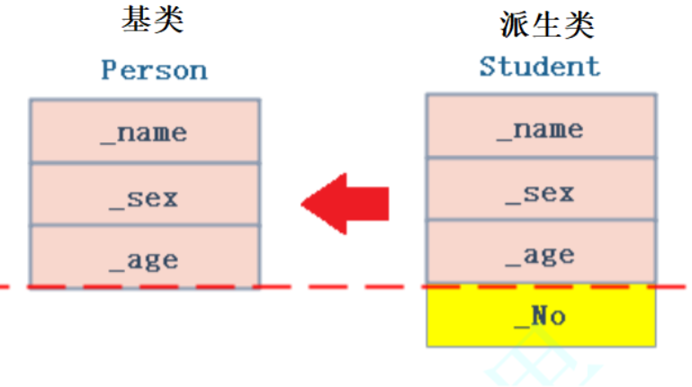
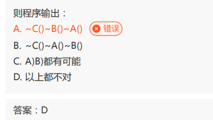

# C++的类型转换

## 目录

-   [C语言中的类型转换](#C语言中的类型转换)
-   [为什么C++需要四种类型转换](#为什么C需要四种类型转换)
-   [C++强制类型转换](#C强制类型转换)
    -   [static\_cast](#static_cast)
    -   [reinterpret\_cast](#reinterpret_cast)
-   [const\_cast](#const_cast)
-   [dynamic\_cast](#dynamic_cast)
-   [ RTTI（了解）](#-RTTI了解)

# C语言中的类型转换

-   在C语言中，如果**赋值运算符左右两侧类型不同，或者形参与实参类型不匹配，或者返回值类型与接收返回值类型不一致时，就需要发生类型转化**，C语言中总共有两种形式的类型转换：**隐式类型转换和显式类型转换**。

1.  隐式类型转化：编译器在编译阶段自动进行，能转就转，不能转就编译失败
2.  显式类型转化：需要用户自己处理

```c++
#include<iostream>
using namespace std;
int main()
{
  int i = 1;
   // 隐式类型转换
   double d = i;
  printf("%d, %.2f\n", i, d);
  int* p = &i;

   // 显示的强制类型转换
   int address = (int)p;
  printf("%x, %d\n", p, address);
  system("pause");
}
```

缺陷：

转换的可视性比较差，所有的转换形式都是以一种相同形式书写，难以跟踪错误的转换

C语言是**意义相近的类型**允许隐式类型的准换，如：整形家族和浮点数家族。

-   **整形之间转换是：** 小的可以转大的（提升），大的也可以转小的（截断）。
-   **整形和浮点之间转换是：** 通过补s位的方式，整形转浮点补浮点就行因为精度，浮点转整形丢掉精度。

C语言中对于显示[强制类型转换](https://so.csdn.net/so/search?q=强制类型转换\&spm=1001.2101.3001.7020 "强制类型转换")是**意义不相近的类型，值转换后有意义**。

**Note：**

整体来说，隐式类型还好，但是**显示类型是有巨大的坑的**。以日常中常见的insert函数为例，起实现（数据移动）中，就有**坑**。

```c++
void insert(size_t pos, char ch)
{
  int end = 10;
  while (end >= pos)
  {
    cout << end << endl;
    --end;
  }
}

int main()
{
  insert(5, 'x');
  insert(0, 'x');
  system("pause");
  return 0;
}
```

&#x20;在其中，第二个Insert就存在问题，因为在判断的时候就会发生隐式类型的转换。

这个时候会悄悄的产生一个变量将end进行了提升（从有符号提升成无符号），然后就会导致数据的越界。造成死循环.

所以，C语言留下的这个东西也是一个坑。并且没有办法因为为了兼容前面的内容，所以没有办法移除隐式转换，所以我们需要注意隐式转换的坑。

-   **于是，便有了C++的规范化。**

***

# 为什么C++需要四种类型转换

C风格的转换格式很简单，但是有不少缺点的：

1.  隐式类型转化有些情况下可能会出问题：比如数据精度丢失
2.  显式类型转换将所有情况混合在一起，代码不够清晰

因此C++提出了自己的类型转化风格，注意因为C++要兼容C语言，所以C++中还可以使用C语言的转化风格

&#x20;

-   这个时候C语言的隐式类型转换的一套还是可以使用的，只不过一般编译器会报警告，不影响运送，但是会告诉你，如：浮点数转换为整形精度可能会丢失。

***

# C++强制类型转换

标准C++为了加强类型转换的可视性，引入了四种命名的强制类型转换操作符：

1.  兼容c隐式类型转换和强制类型转换
2.  期望不要用了，期望你用规范的C++显示强制类型转换。
3.  static cast(隐式类型转换)、 reinterpret cast、const cast(强制类型转换)

-   static\_cast
-   reinterpret\_cast
-   const\_cast
-   dynamic\_cast

***

## static\_cast

static\_cast用于非多态类型的转换（静态转换），编译器隐式执行的任何类型转换都可用static\_cast，

但它不能用于两个不相关的类型进行转换 -   只能用于意义相近的类型。

```c++

int main()
{
  double d = 12.34;
  int a = static_cast<int>(d);
  cout << a << endl;
  return 0;
}
```

-   **不是相近的类型不可以运用其来转换。**
    ```c++
    int main()
    {
      int* p = &a;
     
      // 不支持的
      int address = static_cast<int>(p);
      return 0;
    }
    ```
    其是会报错为，如："static\_cast"：无法从"int \*"转换为"int"，的错误（无效的）。

***

## reinterpret\_cast

(reinterpret**重新解释**)

reinterpret\_cast操作符通常为操作数的位模式提供较低层次的重新解释，用于将一种类型转换为另一种不同的类型

-   用于 意义不相关的类型转换。

```c++
int main()
{
  double d = 12.34;
  int a = static_cast<int>(d);
  cout << a << endl;

   // 这里使用static_cast会报错，应该使用reinterpret_cast 
  //int *p = static_cast<int*>(a);
  int* p = reinterpret_cast<int*>(a);
  return 0;
}
```

-   对于const修饰的变量，不能转化，因为C++的规范会进行检查。

```c++
int main()
{
  const int a = 2;
    // 不支持
  int* p = reinterpret_cast<int*>(&a)
 
  *p = 3;
  return 0;
}
```

**补充：**

甚至有一些地方还可以支持一些比较bug的转化。因为其相当于重新解释了，转换成完全另外一个类型。如：其实是一个指针，转换成为了一个数据大小，或者是一个数据大小转换成为了指针。

***

# const\_cast

const\_cast最常用的用途就是删除变量的const属性，方便赋值

```c++
int main()
{
  const int a = 2;
  int* p = const_cast<int*>(&a);
  //int* p = (int*)&a;
  *p = 3;

  cout << a << endl;  //   2
  cout << *p << endl; //   3
  system("pause");
  return 0;
}
 这段代码在VS中输出的结果是2 3，这是因为在赋值和打印的过程中，变量a的值被存储在了寄存器中。当对指针p进行赋值时，实际上是在内存中为p分配了一个地址，并将值3存储在该地址处。然而，在打印a的值时，程序会从寄存器中获取a的值，而不是从内存中读取。 


int main()
{
  volatile const int a = 2;
  int* p = const_cast<int*>(&a);
  //int* p = (int*)&a;
  *p = 3;

  cout << a << endl;  // 3
  cout << *p << endl; // 3  

  system("pause");
  return 0;
}
 这样写就输出了 3 3  
volatile

```

-   `volatile`关键字告诉编译器它后面所定义的变量随时都有可能改变，因此编译后的程序每次需要存储或读取这个变量的时候，**告诉编译器对该变量不做优化，都会直接从变量内存地址中读取数据**，从而可以提供对特殊地址的稳定访问。如果没有volatile关键字，则编译器可能优化读取和存储，可能暂时使用寄存器中的值，如果这个变量由别的程序更新了的话，将出现不一致的现象。

***

# dynamic\_cast

&#x20;  是C语言没有的，是C++自己增加的，适用于向下转化。`dynamic_cast`用于将一个父类对象的指针 / 引用转换为子类对象的指针或引用（动态转换）。

-   **向上转型：** 子类对象指针/引用->父类指针/引用（不需要转换，赋值兼容规则） ——**天然支持**
    -   派生类对象 可以赋值给 基类的对象 / 基类的指针 / 基类的引用.&#x20;
        

我们日常中所用的继承关系的转换就是 **天然支持** 向上转型的

```c++
class A
{
public :
    virtual void f(){}
};
 
class B : public A
{};
 
int main ()
{
    B bb;
    A aa = bb;
    A& ra = bb;
    return 0;
}
```

-   向下转型：父类对象指针/引用->子类指针/引用(用dynamic\_cast转型是安全的)

    ps:&#x20;
    -   以前父类对象无论如何都是不允许转换成子类对象的
    -   但是父类指针可以,但是强行进行转会导致越界访问

        指针是允许转的。因为涉及到一个指针，是有可能指向父类，也有可能指向子类。而如果是父类指针指向是父类的对象，那么就会导致出现越界问题。所有C++提出了 **dynamic\_cast** 该行为转换是安全的,

注意：

-   **dynamic\_cast只能用于父类含有虚函数的类** —— 否者编译直接报错。

1.  dynamic\_cast会先检查是否能转换成功，能成功则转换，不能则返回0
2.  `dynamic_cast`是C++中的一种类型转换操作符，用于在类层次结构中执行安全的向下转型（从基类到派生类）。当尝试将基类指针或引用转换为派生类指针或引用时，

    `dynamic_cast`会执行安全检查，确保转换是合法的。如果转换是不合法的，`dynamic_cast`会返回空指针（对于指针类型）或抛出异常（对于引用类型）。
    -   如果父类指针指向的是子类的对象，那么可以转换，转换表达式返回正确的地址。
    -   如果父类指针指向的是父类的对象，那么不能转换，转换表达式返回nullptr。

```c++
class A
{
public:
    virtual void f() {}
public:
    int _a = 0;
};

class B : public A
{
public:
    int _b = 0;
};

// A*指针pa有可能指向父类，有可能指向子类
void fun(A* pa)
{
     // 如果pa是指向子类，那么可以转换，转换表达式返回正确的地址
    // 如果pa是指向父类，那么不能转换，转换表达式返回nullptr 
    B* pb = dynamic_cast<B*>(pa); // 安全的
    //B* pb = (B*)pa;             // 不安全 可能会越界
    if (pb)
    {
        cout << "转换成功" << endl;
        pb->_a++;
        pb->_b++;
        cout << pb->_a << ":" << pb->_b << endl;
    }
    else
    {
        cout << "转换失败" << endl;
        pa->_a++;
        cout << pa->_a << endl;
    }
}

int main()
{
    A aa;
    B bb;
    fun(&aa);
    fun(&bb);
    return 0;
}
```

**总结：**

其中，向上转型就是所说的切割/切片，是语法天然支持的，不需要进行转换，而向下转型是语法不支持的，需要进行强制类型转换所有` danamic_cast`。

注意

强制类型转换关闭或挂起了正常的类型检查，每次使用强制类型转换前，程序员应该仔细考虑是否还有其他不同的方法达到同一目的，如果非强制类型转换不可，则应限制强制转换值的作用域，以减少发生错误的机会。强烈建议：避免使用强制类型转换

-   笔试不会等讲到这节在解答

```c++
#include <iostream>
using namespace std;
class A {
 public:
 ~A() {
 cout << "~A()";
 }
};
class B{
 public:
 virtual ~B() {
 cout << "~B()";
}
};
class C: public A, public B {
 public:
 ~C() {
 cout << "~C()";
 }
};
int main() {
 C * c = new C;
 B * b1 = dynamic_cast<B *>(c);
 A * a2 = dynamic_cast<A *>(b1);
 delete a2;
}
```



当使用 `delete` 运算符删除具有非虚析构函数的基类指针时，只会调用基类的析构函数，而不会调用派生类的析构函数。

***

# &#x20;RTTI（了解）

RTTI：Run-time Type identification的简称，即：运行时类型识别。

C++通过以下方式来支持RTTI：

1.  typeid运算符  获取对象类型字符串
2.  dynamic\_cast运算符  父类的指针指向父类对象，还是子类对象
3.  decltype  推导一个对象类型，这个类型可以用来定义另一个对象
