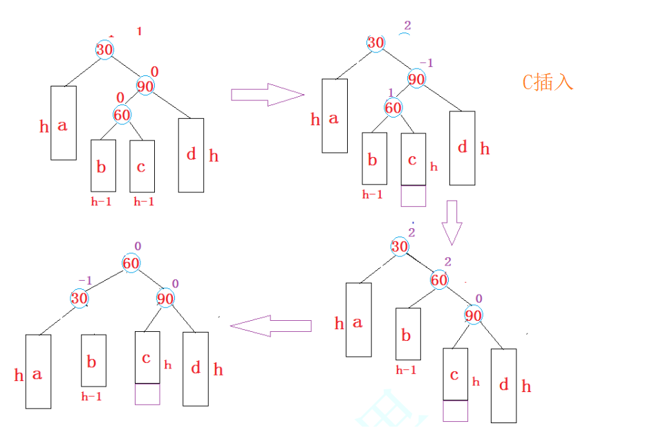
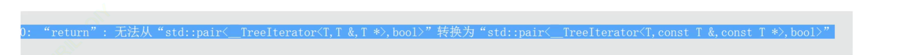
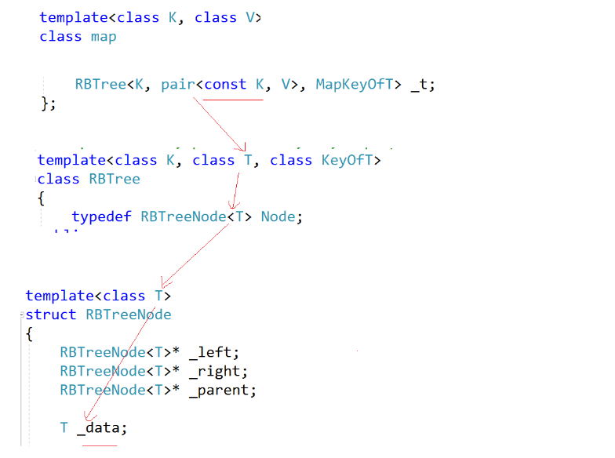

# map和set

## 目录

-   [1 关联式容器](#1-关联式容器)
-   [2 键值对](#2-键值对)
-   [3 树形结构的关联式容器](#3-树形结构的关联式容器)
    -   [3.1 set](#31-set)
        -   [3.1.1 set 特需接口](#311-set-特需接口)
            -   [3.1.1.1 lower\_bound() 函数用于查找第一个大于或等于指定值的元素，返回一个指向该元素的迭代器；如果不存在这样的元素，则返回指向容器末尾的迭代器。](#3111-lower_bound-函数用于查找第一个大于或等于指定值的元素返回一个指向该元素的迭代器如果不存在这样的元素则返回指向容器末尾的迭代器)
            -   [3.1.1.2 upper\_bound() 函数用于查找第一个大于指定值的元素，返回一个指向该元素的迭代器；如果不存在这样的元素，则也返回指向容器末尾的迭代器。](#3112-upper_bound-函数用于查找第一个大于指定值的元素返回一个指向该元素的迭代器如果不存在这样的元素则也返回指向容器末尾的迭代器)
            -   [3.1.1.3 equal\_range() 函数接受一个参数作为指定的值，它会在有序集合中查找这个值，并返回一个 pair 对象，该 pair 对象包含两个迭代器，分别表示指定值在集合中的该值的起始位置和该值的结束位置。 如果找不到first返回>= val  的值，second 返回 > val的值](#3113-equal_range-函数接受一个参数作为指定的值它会在有序集合中查找这个值并返回一个-pair-对象该-pair-对象包含两个迭代器分别表示指定值在集合中的该值的起始位置和该值的结束位置-如果找不到first返回-val--的值second-返回--val的值)
    -   [3.2 multiset](#32-multiset)
        -   [3.2.1 find](#321-find)
        -   [3.2.2 equal\_range](#322-equal_range)
-   [4 map](#4-map)
    -   [4.1 map 的【】](#41-map-的)
-   [5 力扣](#5-力扣)
-   [6 AVL数](#6-AVL数)
    -   [6.1  AVL树的旋转](#61--AVL树的旋转)
-   [7 红黑树](#7-红黑树)
    -   [7.1 红黑树的性质](#71-红黑树的性质)
    -   [7.2 红黑树节点的定义](#72-红黑树节点的定义)
    -   [7.3 红黑树的插入操作](#73-红黑树的插入操作)
        -   [7.3.1 1. 按照二叉搜索的树规则插入新节点](#731-1-按照二叉搜索的树规则插入新节点)
        -   [7.3.2 2. 检测新节点插入后，红黑树的性质是否造到破坏](#732-2-检测新节点插入后红黑树的性质是否造到破坏)
    -   [7.4 AVL 验证](#74-AVL-验证)
-   [8 map set 封装](#8-map-set-封装)
    -   [8.1 红黑树的迭代器](#81-红黑树的迭代器)
    -   [8.2 改造红黑树](#82-改造红黑树)
    -   [8.3 那如何防止 set的key 和map的key 被修改呢？ 这是我们看看库的源码](#83-那如何防止-set的key-和map的key-被修改呢-这是我们看看库的源码)

# 1 关联式容器

-   序列式容器vector/list/deque
-   关联式容器: map/set

    在初阶阶段，我们已经接触过STL中的部分容器，比如：vector、list、deque、forward\_list(C++11)等，这些容器统称为序列式容器，因为其底层为线性序列的数据结构，里面存储的是元素本身。那什么是关联式容器？它与序列式容器有什么区别？

    关联式容器也是用来存储数据的，与序列式容器不同的是，其里面存储的是\<key, value>结构的键值对，在数据检索时比序列式容器效率更高.

***

# 2 键值对

用来表示具有一一对应关系的一种结构，该结构中一般只包含两个成员变量key和value，key代

表键值，value表示与key对应的信息。比如：现在要建立一个英汉互译的字典，那该字典中必然

有英文单词与其对应的中文含义，而且，英文单词与其中文含义是一一对应的关系，即通过该应

该单词，在词典中就可以找到与其对应的中文含义。

SGI-STL中关于键值对的定义

```c++
//pair
template <class T1, class T2>
struct pair
{
    typedef T1 first_type;
    typedef T2 second_type;
    T1 first;
    T2 second;
    pair() : first(T1()), second(T2())
    {}
    pair(const T1& a, const T2& b) : first(a), second(b)
    {}
};

//make_pair

template <class T1,class T2>
  pair<T1,T2> make_pair (T1 x, T2 y)
  {
    return ( pair<T1,T2>(x,y) );
  }

```

`make_pair`函数和`pair`模板类最大的区别在于类型推导。使用`make_pair`时，编译器会根据传入的参数自动推导出`pair`对象的类型。而使用`pair`模板类时，需要显式地指定类型参数。

```c++
int main() {
    int a = 1;
    double b = 2.5;

    // 使用 make_pair 进行自动类型推导
    auto p1 = make_pair(a, b); 
    cout << "p1: " << p1.first << ", " << p1.second << endl;
    
    // 使用 pair 显式指定类型参数
    pair<int, double> p2(a, b); 
    cout << "p2: " << p2.first << ", " << p2.second << endl;

    return 0;
}
```

***

# 3 树形结构的关联式容器

-   根据应用场景的不桶，STL总共实现了两种不同结构的管理式容器：树型结构与哈希结构。树型结
    构的关联式容器主要有四种：map、set、multimap、multiset。这四种容器的共同点是：使
    用平衡搜索树(即红黑树)作为其底层结果，容器中的元素是一个有序的序列。下面一依次介绍每一
    个容器。

## 3.1 set

1.  set是按照一定次序存储元素的容器
2.  在set中，元素的value也标识它(value就是key，类型为T)，并且每个value必须是唯一的。

set中的元素不能在容器中修改(元素总是const)，但是可以从容器中插入或删除它们。

1.  在内部，set中的元素总是按照其内部比较对象(类型比较)所指示的特定严格弱排序准则进行排序。
2.  set容器通过key访问单个元素的速度通常比unordered\_set容器慢，但它们允许根据顺序对子集进行直接迭代。
3.  set在底层是用二叉搜索树(红黑树)实现的。

-   **注意**
    1.  与map/multimap不同，map/multimap中存储的是真正的键值对\<key, value>，set中只放
        value，但在底层实际存放的是由\<value, value>构成的键值对。
    2.  set中插入元素时，只需要插入value即可，不需要构造键值对。
    3.  set中的元素不可以重复(因此可以使用set进行去重)。
    4.  使用set的迭代器遍历set中的元素，可以得到有序序列
    5.  set中的元素默认按照小于来比较
    6.  set中查找某个元素，时间复杂度为：$log_2 n$
    7.  set中的元素不允许修改(为什么?)
    8.  set中的底层使用二叉搜索树(红黑树)来实现


T: set中存放元素的类型，实际在底层存储\<value, value>的键值对。

Compare：set中元素默认按照小于来比较

Alloc：set中元素空间的管理方式，使用STL提供的空间配置器管理

### 3.1.1 set 特需接口

#### `3.1.1.1 lower_bound()` 函数用于查找第一个大于或等于指定值的元素，返回一个指向该元素的迭代器；如果不存在这样的元素，则返回指向容器末尾的迭代器。

#### `3.1.1.2 upper_bound()` 函数用于查找第一个大于指定值的元素，返回一个指向该元素的迭代器；如果不存在这样的元素，则也返回指向容器末尾的迭代器。

```c++
void test_set2()
{
  std::set<int> myset;
  std::set<int>::iterator itlow, itup;

  for (int i = 1; i < 10; i++) myset.insert(i * 10); // 10 20 30 40 50 60 70 80 90


  //itlow = myset.lower_bound(30);              //
  itlow = myset.lower_bound(25);                // >= val值位置的iterator
  itup = myset.upper_bound(70);                 // >  val值位置的iterator

  // [25, 70]
  myset.erase(itlow, itup);                     // 10 20 70 80 90

  for (auto e : myset)
  {
    cout << e << " ";
  }
  cout << endl;
}

```

-   C++ STL 的 set 容器中元素必须唯一且按照一定的排序规则排序，因此 `lower_bound()` 和 `upper_bound()` 函数的行为也是按照这个排序规则来确定的。

***

#### `3.1.1.3 equal_range()` 函数接受一个参数作为指定的值，它会在有序集合中查找这个值，并返回一个 `pair` 对象，该 `pair` 对象包含两个迭代器，分别表示指定值在集合中的该值的起始位置和该值的结束位置。 如果找不到first返回>= val  的值，second 返回 > val的值

```c++

void test_set3()
{
  std::set<int> myset;

  for (int i = 1; i <= 5; i++) myset.insert(i * 10);   // myset: 10 20 30 40 50

  //std::pair<std::set<int>::const_iterator, std::set<int>::const_iterator> ret;
  auto ret = myset.equal_range(30);

  std::cout << "the lower bound points to: " << *ret.first << '\n';   // >= val  //
  std::cout << "the upper bound points to: " << *ret.second << '\n';  // > val   //
  
   打印了 30 40 
}
```

***

***

## 3.2 multiset

1.  multiset是按照特定顺序存储元素的容器，其中元素是可以重复的。
2.  在multiset中，元素的value也会识别它(因为multiset中本身存储的就是\<value, value>组成

的键值对，因此value本身就是key，key就是value，类型为T). multiset元素的值不能在容器

中进行修改(因为元素总是const的)，但可以从容器中插入或删除。

1.  在内部，multiset中的元素总是按照其内部比较规则(类型比较)所指示的特定严格弱排序准则

进行排序。

1.  multiset容器通过key访问单个元素的速度通常比unordered\_multiset容器慢，但当使用迭

代器遍历时会得到一个有序序列。

1.  multiset底层结构为二叉搜索树(红黑树)。

-   注意
    1.  multiset中再底层中存储的是\<value, value>的键值对
    2.  mtltiset的插入接口中只需要插入即可
    3.  与set的区别是，multiset中的元素可以重复，set是中value是唯一的
    4.  使用迭代器对multiset中的元素进行遍历，可以得到有序的序列
    5.  multiset中的元素不能修改
    6.  在multiset中找某个元素，时间复杂度为$O(log_2 N)$
    7.  multiset的作用：可以对元素进行排序

### `3.2.1 find`

如果有多个值，find返回中序第一个val的位置

```c++
void test_set4()
{
  // 排序
  multiset<int> s;
  s.insert(5);
  s.insert(2);
  s.insert(6);
  s.insert(1);
  s.insert(1);
  s.insert(2);
  s.insert(1);
  s.insert(5);
  s.insert(2);


  // 如果有多个值，find返回中序第一个val
  multiset<int>::iterator it = s.find(2);
  while (it != s.end())
  {
    cout << *it << " ";  //2 2 2 5 6
    ++it;
  }
  cout << endl;
}
```

### `3.2.2 equal_range`

```c++

void test_set4()
{
  // 排序
  multiset<int> s;
  s.insert(5);
  s.insert(2);
  s.insert(6);
  s.insert(1);
  s.insert(1);
  s.insert(2);
  s.insert(1);
  s.insert(5);
  s.insert(2);


  // [>=val, >val)
  pair<multiset<int> ::iterator, multiset<int> ::iterator> ret = s.equal_range(2);
  s.erase(ret.first, ret.second);
  size_t n = s.erase(2);
  cout << n << endl;
  for (auto e : s)
  {
    cout << e << " ";   //1 1 1 5 5 6 
  }
  cout << endl;
}
```

# 4 map

1.  map是关联容器，它按照特定的次序(按照key来比较)存储由键值key和值value组合而成的元

素。

1.  在map中，键值key通常用于排序和惟一地标识元素，而值value中存储与此键值key关联的

内容。键值key和值value的类型可能不同，并且在map的内部，key与value通过成员类型

value\_type绑定在一起，为其取别名称为pair:

typedef pair\<const key, T> value\_type;

1.  在内部，map中的元素总是按照键值key进行比较排序的。
2.  map中通过键值访问单个元素的速度通常比unordered\_map容器慢，但map允许根据顺序

对元素进行直接迭代(即对map中的元素进行迭代时，可以得到一个有序的序列)。

1.  map支持下标访问符，即在\[]中放入key，就可以找到与key对应的value。
2.  map通常被实现为二叉搜索树(更准确的说：平衡二叉搜索树(红黑树))。

-   map的模板参数说明


key: 键值对中key的类型T： 键值对中value的类型

Compare: 比较器的类型，map中的元素是按照key来比较的，缺省情况下按照小于来比较，一般情况下(内置类型元素)该参数不需要传递，如果无法比较时(自定义类型)，需要用户自己显式传递比较规则(一般情况下按照函数指针或者仿函数来传递)

Alloc：通过空间配置器来申请底层空间，不需要用户传递，除非用户不想使用标准库提供的空间配置器

注意：在使用map时，需要包含头文件

## `4.1 map 的【】`


***

问题：当key不在map中时，通过operator\[ ] 获取对应value时会发生什么问题？


-   查看下插入insert操作返回值

    
    -   key已经在map中, 插入成功 pair<新插入key所在节点的iterator， true>
    -   key已经在map中 ,插入失败 pair<已经存在的key所在节点的iterator， false>
-   `map 的【】` 库里面写的


> 调用insert  `mapped_type()` 为默认参数int为0 char为/0 自定义类型调用自己的拷贝构造，然后返回所在节点的iterator， 解引用\*iterator . iterator的second 返回他的引用， 因为返回的iterator也是个pair类型的.
>
> 1、map中有这个key，返回value的引用。(查找、修改value)
> 2、map中没有这个key，会插入一个pair(key, V( ));返回value的引用。(插入+修改)&#x20;

在元素访问时，有一个与operator\[ ]类似的操作at()(该函数不常用)函数，都是通过

key找到与key对应的value然后返回其引用，不同的是：当key不存在时，operator\[]用默认

value与key构造键值对然后插入，返回该默认value，at()函数直接抛异常。

***

# 5 力扣

[692. 前K个高频单词](https://leetcode.cn/problems/top-k-frequent-words/ "692. 前K个高频单词")


`RandomAccessIterator` 是一种迭代器类型，它是随机访问迭代器。

不能支持对map进行排序，

map的迭代器是双向迭代器`（bidirectional iterator）`，可以逆序遍历容器，但不能像顺序容器一样使用随机访问迭代器（random-access iterator）。

```c++
class Solution {
public:
    template<class T>
    struct cmp {
        bool operator()(const T& x, const T& y) {
            if(x.second  > y.second) return true;
             else if(x.second == y.second && x.first < y.first) return true;
             return false;
        }
    };
    
    vector<string> topKFrequent(vector<string>& words, int k) {
        map<string, int> mp;
        for (auto i : words)
            mp[i]++;
        
        vector<pair<string,int>> vv(mp.begin(),mp.end());
        sort(vv.begin(),vv.end(),cmp<pair<string,int>>());

        vector<string> ret;
        vector<pair<string,int>>::iterator it= vv.begin();
       for(int i = 0; i < k; i++)
        {
            ret.push_back(it->first);
            ++it;
        }
        return ret;
    }
};
```

优先级队列的解法，但是要了解优先级的用法


```c++
class Solution {
public:
    template<class T>
    struct cmp {
        bool operator()(const T& x, const T& y) {
            if(x.second  < y.second) return true;
             else if(x.second == y.second && x.first > y.first) return true;
             else return false;
        }
    };
    
    vector<string> topKFrequent(vector<string>& words, int k) {
        map<string, int> mp;
        for (auto i : words)
            mp[i]++;
      priority_queue<pair<string,int>,vector<pair<string,int>>,cmp<pair<string, int>>> qu(mp.begin(),mp.end());
      vector<string> ret;
      for(int i = 0; i < k; i++)
      {
          pair<string,int> tmp = qu.top();
          qu.pop();
          ret.push_back(tmp.first);
      }
      return ret;
    }
};
```

[349. 两个数组的交集](https://leetcode.cn/problems/intersection-of-two-arrays/ "349. 两个数组的交集")

-   两个set 分别遍历num1 num2 ，去掉自己重复的元素
-   在遍历某个 set （s1），然后在另外的set（s2）查找 看看s1的元素在不在s2里面。如果在就添加元素

```c++
class Solution {
public:
    vector<int> intersection(vector<int>& nums1, vector<int>& nums2) {
        unordered_set<int> s1;
        unordered_set<int> s2;

        for(auto x : nums1)
        {
            s1.insert(x);
        }
        for(auto x : nums2)
        {
            s2.insert(x);
        }

        vector<int> vv;
        for(auto x : s1)
        {
            if(s2.find(x) != s2.end())
                vv.push_back(x);
        }

        return vv;
    }
};
```

-   方法二更加常用
    -   前提是 排序 加 去重
        -   找交集
            1.  相同就是交集值it1 it2 同时++
            2.  不相同，小的++ (因为小的肯定不在这个交集里面了，但是另外一个大的可能，因为小的这个数组后面的元素可能和这个大的匹配)
            3.  有一个结束就结束了
                
        -   **找差集**
            > 什么是差集 → 比如，A={1,2,3,4,5}，B={2,4,6}，则 A 减去 B 的差集为 A∖B={1,3,5}。
            >
            > -   解法
            >     1.  相等，it1 it2同时++
            >     2.  小的是差集值 小的++
            >     3.  一个结束了，另一个没结束的也是差集
            >         
-   找交集代码

```c++

//前提是 排序 加 去重
class Solution {
public:
    vector<int> intersection(vector<int>& nums1, vector<int>& nums2) {
        set<int> s1;
        set<int> s2;

        for (auto& x : nums1)
            s1.insert(x);
        for (auto& x : nums2)
            s2.insert(x);

        set<int>::iterator it1 = s1.begin();
        set<int>::iterator it2 = s2.begin();

        vector<int> ret;
        //有一个结束就结束了
        while (it1 != s1.end() && it2 != s2.end())
        {
            //相同就是交集值it1 it2 同时++
            if (*it1 == *it2)
            {
                ret.push_back(*it1);
                it1++;
                it2++;
            }
            //不相同，小的++
            else if (*it1 < *it2)
            {
                it1++;
            }
            else
            {
                it2++;
            }
        }
        return ret;
    }
};
```

***

# 6 AVL数

二叉搜索树虽可以缩短查找的效率，但如果数据有序或接近有序二叉搜索树将退化为单支树，查找元素相当于在顺序表中搜索元素，效率低下。因此，两位俄罗斯的数学家G.M.Adelson-Velskii和E.M.Landis在1962年.

发明了一种解决上述问题的方法：当向二叉搜索树中插入新结点后，如果能保证每个结点的左右子树高度之差的绝对值不超过1(需要对树中的结点进行调整)，即可降低树的高度，从而减少平均搜索长度。

-   **一棵AVL树或者是空树，或者是具有以下性质的二叉搜索树：**
    -   它的左右子树都是AVL树
    -   左右子树高度之差(简称平衡因子)的绝对值不超过1(-1/0/1)
    -   平衡因子：左右子树高度之间，其绝对值如果不超过1，则认为树就是平衡的


> &#x20;  如果一棵二叉搜索树是高度平衡的，它就是AVL树。如果它有n个结点，其高度可保持在$O(log_2 n)$，搜索时间复杂度O($log_2 n$


## 6.1  AVL树的旋转

-   如果在一棵原本是平衡的AVL树中插入一个新节点，可能造成不平衡，此时必须调整树的结构，
    使之平衡化。根据节点插入位置的不同，AVL树的旋转分为四种
-   单旋

    

    
-   左右双旋
    -   **新节点插入较高右子树的左侧---右左：先右单旋再左单旋** &#x20;
        -   [ ] **更新平衡因子有三种情况**
        -   在C插入(在右子树的左侧的 右插入)
            
    -   在B插入(在右子树的左侧的 左插入)
        
    -   60就是新增的(在右子树的左侧插入)
        
    -   我们最后要靠右边的最左边的节点考虑平衡因子的更新.分为以上三种情况.
    -   **新节点插入较高左子树的右侧---左右：先左单旋再右单旋**
    -   [ ] **更新平衡因子有三种情况**
    -   在b插入 （**左子树的右侧**左边插入）
        
    -   在c插入 （**左子树的右侧**右边插入）
        
    -   新增7.5　这个节点(在右子树的左侧就是新增节点)
        
-   旋转完成后，原pParent为根的子树个高度降低，已经平衡，不需要再向上更新

总结：

-   参考map set课件

***

\-

# 7 红黑树

-   红黑树，是一种二叉搜索树，但在每个结点上增加一个存储位表示结点的颜色，可以是Red或
    Black。 通过对任何一条从根到叶子的路径上各个结点着色方式的限制，红黑树确保没有一条路
    径会比其他路径长出俩倍，因而是接近平衡的.
    -   **AVL树严格平衡: 左右高度差不超过1**
    -   **红黑树近似平衡: 最长路径不超过最短路径的2倍**
    -   **红黑树不像AVL树那么严格，是一棵近似平衡的二叉搜索树**


## 7.1 红黑树的性质

1.  每个结点不是红色就是黑色
2.  根节点是黑色的
3.  如果一个节点是红色的，则它的两个孩子结点是黑色的.&#x20;

    ps: **不能出现连续的红色节点**  &#x20;
    -   **父子节点**颜色分三种:&#x20;

        黑+黑&#x20;

        黑+红&#x20;

        红+黑
4.  对于每个结点，从该结点到其所有后代叶结点的简单路径上，均 包含相同数目的黑色结点

    ps: **每条路径都包含相同数量的黑色节点** , **路径是从根节点走到空**
5.  每个叶子结点都是黑色的(此处的叶子结点指的是空结点)

    ps : **NIL节点方便数路径，不容易数错**. 不啥用。就是left right两个指针指向的空节点

    空树也是红黑树，性质5中规定树中的空指针域为叶子节点，因此空树也是有节点的

    

    

-   思考：为什么满足上面的性质，红黑树就能保证：其最长路径中节点个数不会超过最短路径节点个数的两倍？
    -   最短路径:**全黑**
    -   最长路径: **一黑一红间隔**

***

## 7.2 红黑树节点的定义

```c++
// 节点的颜色
enum Color { RED, BLACK };
// 红黑树节点的定义
template<class ValueType>
struct RBTreeNode
{
  RBTreeNode(const ValueType& data = ValueType()，Color color = RED)
    : _pLeft(nullptr), _pRight(nullptr), _pParent(nullptr)
    , _data(data), _color(color)
  {}
  RBTreeNode<ValueType>* _pLeft; // 节点的左孩子
  RBTreeNode<ValueType>* _pRight; // 节点的右孩子
  RBTreeNode<ValueType>* _pParent; // 节点的双亲(红黑树需要旋转，为了实现简单给
  出该字段)
  ValueType _data; // 节点的值域
  Color _color; // 节点的颜色
};
```

-   思考：在节点的定义中，为什么要将节点的默认颜色给成红色的？
    -   新增插入黑色节点会影响所有路径
        
    -   新增插入红色节点只会影响父亲

        新增节点父亲是黑色的，那么插入结束，不需要处理
        
    -   如父节点是红色则需要处理
        
    -   新增节点，选择新增红色的
        1\. 新增节点的父亲是黑色的，不需要处理
        2\. 新增节点的父亲是红色的，需要处理(变) or (变色+旋转)

## 7.3 红黑树的插入操作

### 7.3.1 1. 按照二叉搜索的树规则插入新节点

### 7.3.2 2. 检测新节点插入后，红黑树的性质是否造到破坏

因为新节点的默认颜色是红色，因此：如果其双亲节点的颜色是黑色，没有违反红黑树任何性质，则不需要调整；但当新插入节点的双亲节点颜色为红色时，就违反了性质三不能有连在一起的红色节点，此时需要对红黑树分情况来讨论：

约定:cur为当前节点，**p为父节点，g为祖父节点，u为叔叔节点**

-   况一: cur为红，p为红，g为黑，u存在且为红

    

    

    cur和p均为红，违反了性质三
    -   **解决方式**：
        将p,u改为黑，g改为红，然后把g当成cur，继续向上调整。
-   情况二: cur为红，p为红，g为黑，u不存在/u存在且为黑

    

    
    -   **说明: u的情况有两种**
        1.  如果u节点不存在，则cur一定是新插入节点，因为如果cur不是新插入节点则cur和p一定有一个节点的颜色是黑色，就不满足性质4: 每条路径黑色节点个数相同。
            
        2.  如果u节点存在，则其一定是黑色的，那么cur节点原来的颜色一定是黑色的现在看到其是红色的原因是因为**cur的子树在调整的过程中将cur节点的颜色由黑色改成红色.** 是由上面情况一向上调整而来的.
    -   **解决方式**：

        p为g的左孩子，cur为p的左孩子，则进行右单旋转；相反，

        p为g的右孩子，cur为p的右孩子，则进行左单旋转

        p、g变色   → p变黑，g变红
-   情况三: cur为红，p为红，g为黑，u不存在/u存在且为黑

    

    p为g的左孩子，cur为p的右孩子，则针对做左右双旋 → (p)左旋 （g）右旋

    相反
    p为g的右孩子，cur为p的左孩子，则针对做右左双旋 →  (p)左旋 （g）右旋

    cur g 变色 → cur变黑 g变红

***

## 7.4 AVL 验证

```c++
红黑树的检测分为两步：
1. 检测其是否满足二叉搜索树(中序遍历是否为有序序列)
2. 检测其是否满足红黑树的性质
```

```c++
//检查红黑树是否平衡
  bool IsBalance()
  {
    if (_root == nullptr)
      return true;

    if (_root->_col == RED)
      return false;


    //用来检查每条路径的黑色节点是否相等 先检查一条的路径然后check函数在每条路径进行比较
    Node* cur = _root;
    int refval = 0;
    while (cur)
    {
      if (cur->_col == BLACK)
      {
        ++refval;
      }
      cur = cur->_left;
    }

    int blacknum = 0;
    return Check(_root, blacknum,refval);
  }
  
  bool Check(Node* root, int blacknum,const int refval)
  {
    if (root == nullptr)
    {
      //cout << blacknum << endl;
      if (blacknum != refval)
      {
        cout << "存在黑色节点数量不相等的路径" << endl;
        return false;
      }
      return true;
    }

    if (root->_col == BLACK)
    {
      ++blacknum;
    }

    //破坏规则 父子不能出现连续的红色节点
    if (root->_col == RED)
    {
      if (root->_parent->_col == RED)
      {
        cout << "有连续的红色节点" << endl;
        return false;
      }
    }
    

    return Check(root->_left,blacknum,refval) && Check(root->_right, blacknum, refval);
  }
```

***

# 8 map set 封装

-   库的原码红黑树第二个模板参数决定node中存什么, 使用key还是key/value


-   但是这样取了 红黑色插入比较时候该如何比较，set则可以直接比较。 map不能直接比较pair，只能比较pair的first. 此时我们需要获取我们第三个模版模版参数。

    
    > (set or map) Keyof传过去什么类型就是什么类型，
    > 
    > 因为是一个模版keyofT始终是个仿函数，仿函数用这个类型实例化成 kof这个对象后，就调operator () 就调上去了
    > 仿函数也叫函数对象
    -   总结：
        -   因为关联式容器中存储的是\<key, value>的键值对，因此
        -   k为key的类型，
        -   &#x20;ValueType: 如果是map，则为pair\<K, V>;  如果是set，则为k&#x20;
        -   &#x20;KeyOf: 通过value来获取key的一个仿函数类

## 8.1 红黑树的迭代器

-   begin()与end()

    STL明确规定，begin()与end()代表的是一段前闭后开的区间，而对红黑树进行中序遍历后，
    可以得到一个有序的序列，因此：begin()可以放在红黑树中最小节点(即最左侧节点)的位
    置，end()放在最大节点(最右侧节点)的下一个位置，关键是最大节点的下一个位置在哪块？
    能否给成nullptr呢？答案是行不通的，因为对end()位置的迭代器进行--操作，必须要能找最
    后一个元素，此处就不行，因此最好的方式是将end()放在头结点的位置

    
    ```c++
    iterator begin()
      {
        Node* cur = _root;
        while (cur && cur->_left)
        {
          cur = cur->_left;
        }
        return iterator(cur);
      }

      iterator end()
      {
        return iterator(nullptr);
      }
    ```
-   迭代器的操作

```c++
template<class T>
struct __TreeIterator
{
  typedef RBTreeNode<T> Node;
  typedef __TreeIterator<T> self;
  Node* _node;
  
  __TreeIterator(Node* node)
    :_node(node)
  {}

  T& operator*()
  {
    return _node->_data;
  }

  T* operator->()
  {
    return &_node->_data;
  }
  
  self operator++()
  {}
  
  bool operator!=(const self& s)
  {
    return _node != s._node;
  }

  bool operator==(const self& s)
  {
    return _node == s._node;
  }

}
```

-   迭代器++操作
    ```c++
      /*
      + +it的核心，找中序的下一个
      1:  it指向的节点，右子树不为空，下一个就是右子了树的最左节点
      2 : it指向的节点，右子树为空，it中的节点所在的子树访问完了，往上找孩子是父亲左的那个祖先
      */
      self operator++()
      {
        //分两种情况讨论:Node的右子树存在和不存在
        // 右子树存在
        if (_node->_right)
        {
          // 右子树中最小的节点，即右子树中最左侧节点
          Node* cur = _node->_right;
          while (cur->_left)
          {
            cur = cur->_left;
          }
          _node = cur;
        }
        else
        {
          // 右子树不存在，向上查找
          Node* cur = _node;
          Node* parent = cur->_parent;
          while (parent && parent->_right == cur)
          {
            cur = parent;
            parent = cur->_parent;
          }
          _node = parent;
        }
        return *this;
      }

    ```

## 8.2 改造红黑树

-   map
    ```c++
    template <class Key,class Value>
      class map
      {
        
        struct MapKeyOfT
        {
          const Key& operator()(const pair<Key,Value>& kv)
          {
            return kv.first;
          }
        };
        
      public:
        // 对类模板取内嵌类型，加typename告诉编译器这里是类型
        typedef typename RBTree<Key, pair<Key, Value>, MapKeyOfT>::iterator iterator;

        pair<iterator, bool>  insert(const pair<Key, Value> data)
        {
          return _t.insert(data);
        }

        Value& operator[](const Key k)
        {
          pair<iterator, bool> ret = insert(make_pair(k, Value()));
          return  ret.first->second;
        }


        iterator begin()
        {
          return _t.begin();
        }

        iterator end()
        {
          return _t.end();
        }


      private:
        RBTree<Key, pair<Key, Value>, MapKeyOfT> _t;
      };
    ```


-   set
    ```c++

    namespace XMLife
    {
      template <class K>
      class set
      {
        struct SetKeyOfT
        {
          const K& operator()(const K& data)
          {
            return data;
          }
        };

      public:
        // 对类模板取内嵌类型，加typename告诉编译器这里是类型
        typedef typename RBTree<K, K, SetKeyOfT>::iterator iterator;
        pair<iterator, bool> insert(const K data)
        {
          return _t.insert(data);
        }

        iterator begin()
        {
          return _t.begin();
        }

        iterator end()
        {
          return _t.end();
        }

      private:
        RBTree<K, K, SetKeyOfT> _t;
      };
    }

    ```

## 8.3 那如何防止 set的key 和map的key 被修改呢？ 这是我们看看库的源码

-   set
    -   我们发现set 迭代器 iterator const\_iterator 都是调用红黑树的const\_iterator迭代器实现.因为set是不能被修改的，所有都调用红黑树的const迭代器


-   map

    map只是key不能被修改，Value可以修改，在Value: pair时候 ，first给成了const Key, 此时key就不会被修改.

    

，

-   开始构造
    -   首先把红黑树的迭代器构造
        ```c++
        template<class T,class Ref,class Ptr>
        struct __TreeIterator
        {
          typedef RBTreeNode<T> Node;
          typedef __TreeIterator<T,Ref,Ptr> self;
        ```
        ```c++
        //  set->RBTree<K, K, SetKeyOfT> _t;
        //  map->RBTree<K, pair<K, T>, MapKeyOfT> _t;
        template <class Key, class T, class KeyofT>
        class RBTree
        {
          typedef RBTreeNode<T> Node;
        public:

          typedef __TreeIterator<T, T&, T*> iterator;
          typedef __TreeIterator<T, const T&,const T*> const_iterator;

          iterator begin()
          {
            Node* cur = _root;
            while (cur && cur->_left)
            {
              cur = cur->_left;
            }
            return iterator(cur);
          }

          iterator end()
          {
            return iterator(nullptr);
          }

          const_iterator begin() const
          {
            Node* cur = _root;
            while (cur && cur->_left)
            {
              cur = cur->_left;
            }
            return const_iterator(cur);
          }

          const_iterator end() const
          {
            return const_iterator(nullptr);
          }
        ```
    -   构造set不能被修改
        ```c++
          // 对类模板取内嵌类型，加typename告诉编译器这里是类型
            // 注意：此处typename的作用是明确告诉编译器，Iterator类中的一个类型，而不是静态成员变量
            // 否则编译器编译时就不知道Ref是Iterator中的类型还是静态成员变量
            // 因为静态成员变量也是按照 类名::静态成员变量名 的方式访问的

        typedef typename RBTree<K, K, SetKeyOfT>::const_iterator iterator;
        typedef typename RBTree<K, K, SetKeyOfT>::const_iterator const_iterator;

        ```
        -   而set 这里的iterator 看似iterator 其实都是红黑色const\_iterator的。因为set不能被修改，普通对象或者const对象调用也是 不能被修改，所有直接写成一份即可
        ```c++
        iterator begin()const
        {
             return _t.begin();
        }
        iterator  end()const
        {
             return _t.end();
        }
        ```
        > &#x20;但是这里会面临一个新问题，myset的 insert会报错了。
        > 
        因为这个树是个普通对象，红黑树这一层的insert的返回值是个` pair<iterator,bool>` 普通迭代器（红黑树插入的返回值），会匹配不上，因为在set这一层insert的迭代器是个红黑树`const_iterator` ,而红黑树返回的是一个普通的 `iterator迭代器` 导致匹配不上。虽然他们名字一样，但是实际不一样，因为不在同一层面上（一层是红黑树的`iterato`，另外一层是set的 `const_iterator`），那如何解决呢？

        
        -   解决方案
            1.  iterator 转换成const\_iterator （这个没讲）
            2.  把 红黑色的 插入操作 返回值改成`pair<Node*,bool> ` 用`Node*` 去构造 set的 `iterator(即红黑树的const_iterator)`，为什么这样就会支持了呢？ &#x20;
            -   红黑树的 `pair<Node*,bool> insert(const T data)`  这个Node\* 去构造set 的`pair<iterator, bool> insert(const K data)` 的迭代器。原因是pair支持了这个构造。
                -   他是一个带模版参数的构造，如果U,V跟你T1,T2类型一样，那就是拷贝构造，如果U,V跟你类型不一样那就是个构造，用其他类型的去构造你的first，second
                    
                
                -   这里Node\* 可以初始化红黑树`const_iterator` 迭代器
-   以上情况map情况不受影响，因为map的迭代器的Value是可以修改的.普通迭代器还是普通迭代器。const迭代器还是const 迭代器
-   构造set不能被修改

    将map内部的红黑树 第二个参数pair 的key 改成const key
    ```c++
    RBTree<Key, pair<const Key, Value>, MapKeyOfT> _t;
    ```
    
-   其实在map中的插入 调用了红黑树的插入时候，也发生了构造

    
-   红黑树能不能不传第一个模版key过来，好像没什么用。

    不行，当你写一个Find 时候参数需要用到，`bool Find(const K& data)` 此时`KeyofT` 就无法使用，导不出来.keyoft 是取一个对象的类型，而不可以取一个类型.
