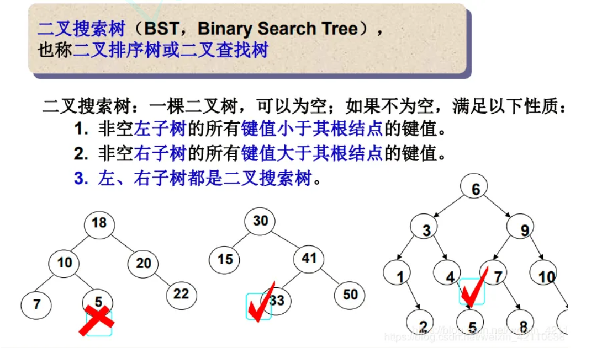
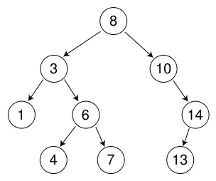
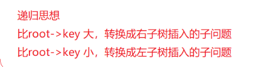
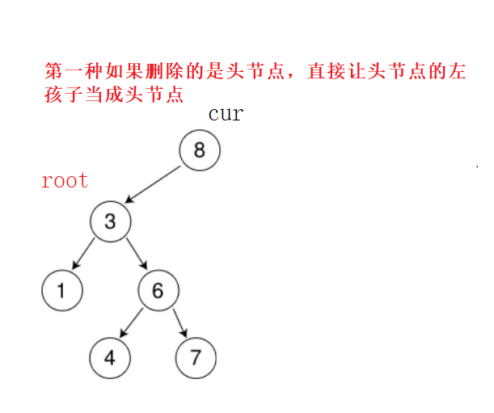
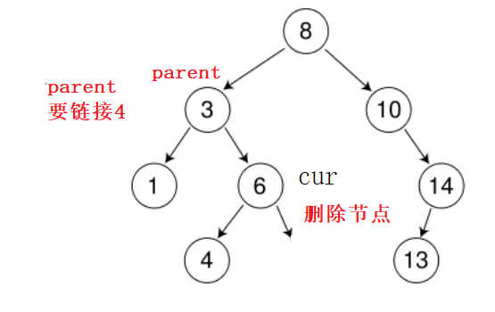
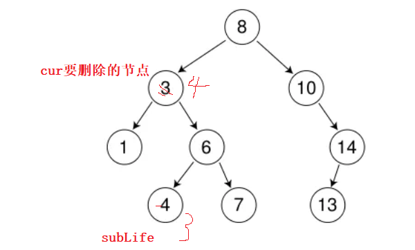
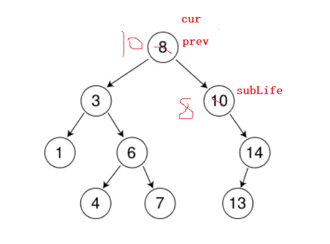
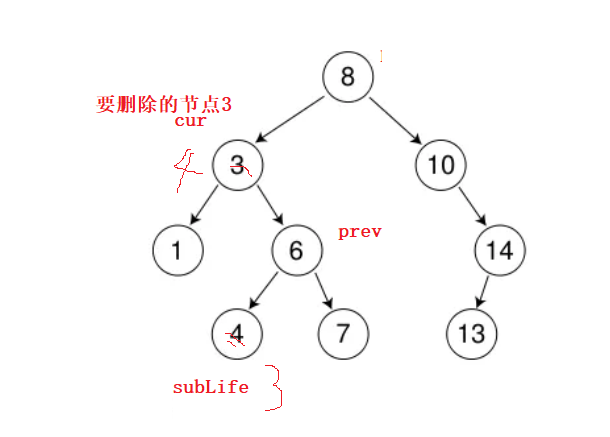

# 二叉树进阶

## 目录

-   [1. 二叉搜索树](#1-二叉搜索树)
    -   [二叉搜索树操作](#二叉搜索树操作)
        -   [二叉树的节点](#二叉树的节点)
        -   [二叉搜索树的查找](#二叉搜索树的查找)
            -   [迭代法](#迭代法)
            -   [递归](#递归)
        -   [二叉搜索树的插入](#二叉搜索树的插入)
            -   [迭代法](#迭代法)
            -   [递归](#递归)
        -   [二叉搜索树的删除](#二叉搜索树的删除)
            -   [迭代法](#迭代法)
            -   [递归法](#递归法)
-   [2. 二叉搜索树的应用](#2-二叉搜索树的应用)

# 1. 二叉搜索树

-   二叉搜索树概念

    二叉搜索树又称二叉排序树，它或者是一棵空树，或者是具有以下性质的二叉树:
    -   若它的左子树不为空，则左子树上所有节点的值都小于根节点的值
    -   若它的右子树不为空，则右子树上所有节点的值都大于根节点的值
    -   它的左右子树也分别为二叉搜索树



***

## 二叉搜索树操作



```c++
int a[] = {8, 3, 1, 10, 6, 4, 7, 14, 13};
```

***

-   递归法因为无法拿到每次树的节点，在外面调用只可以拿到this指针root节点，所有我们在类里面重新写个函数去递归.

### 二叉树的节点

```c++
template <class k>
struct BSTreeNode
{
  BSTreeNode<k>* _left;
  BSTreeNode<k>* _right;
  k _val;
  BSTreeNode(k val)
    :_left(nullptr)
    ,_right(nullptr)
    ,_val(val)
  {}
};
```

### 二叉搜索树的查找

1.  从根开始比较，查找，比根大则往右边走查找，比根小则往左边走查找。
2.  最多查找高度次，走到到空，还没找到，这个值不存在。

#### 迭代法

```c++
bool Find(const k& x)
  {
    if (_root == nullptr)
    {
      return false;
    }
    
    Node* cur = _root;

    while (cur)
    {
      if (cur->_val > x)
      {
        cur = cur->_left;
      }
      else if (cur->_val < x)
      {
        cur = cur->_right;
      }
      else
      {
        return true;
      }
    }

    return false;
  }
```

#### 递归



```c++
bool FindR(const k& key)
  {
    return _FindR(_root, key);
  }
 
 bool _FindR(Node* root, const k& key)
  {
    if (!root)
      return false;
    
    if (root->_val > key)
    {
      _FindR(_root->_left, key);
    }

    else if (root->_val < key)
    {
      _FindR(_root->_right, key);
    }

    else
    {
      return true;
    }
  }

```

***

### 二叉搜索树的插入

插入的具体过程如下：

1.  树为空，则直接新增节点，赋值给root指针
2.  树不空，按二叉搜索树性质查找插入位置，插入新节点

#### 迭代法

```c++
bool Insert(const k& x)
  {
    if (_root == nullptr)
    {
      _root = new Node(x);
      return true;
    }
    Node* parent = nullptr;
    Node* cur = _root;
    
    while (cur)
    {
      if (cur->_val > x)
      {
        parent = cur;
        cur = cur->_left;
      }
      else if (cur->_val < x)
      {
        parent = cur;
        cur = cur->_right;
      }
      else
      {
        return false;
      }
    }
    cur = new Node(x);
    if (parent->_val < x)
    {
      parent->_right = cur;
    }
    else
    {
      parent->_left = cur;
    }
    return true;
  }
```

```c++
 cur = new Node(x);
    if (parent->_val < x)
    {
      parent->_right = cur;
    }
    else
    {
      parent->_left = cur;
    }
```

> 这段代码是判断最后的cur 是在左边还是右边，parent记录每次的父节点。

#### 递归

> root→left 或者 root—>right 是上一层root的别名，所有改变这层的root相当于改变上一层的root→left 或者root→right的指向，到了nullptr就new了一个对象，相当于链接了上一层root的left或者right


```c++
bool InsertR(const k& key)
  {
    return _InsertR(_root, key);
  }
  
  
  bool _InsertR(Node*& root, const k& key)
  {
    if (root == nullptr)
    {
      root = new Node(key);
      return true;
    }

    if (root->_val > key)
    {
      return _InsertR(root->_left, key);
    }

    else if (root->_val < key)
    {
      return _InsertR(root->_right, key);
    }

    else
    {
      return false;
    }
  }
```

***

### 二叉搜索树的删除

首先查找元素是否在二叉搜索树中，如果不存在，则返回, 否则要删除的结点可能分下面四种情况：

a. 要删除的结点无孩子结点

b. 要删除的结点只有左孩子结点

c. 要删除的结点只有右孩子结点

d. 要删除的结点有左、右孩子结点

-   看起来有待删除节点有4中情况，实际情况a可以与情况b或者c合并起来，因此真正的删除过程如下：

    情况b：删除该结点且使被删除节点的双亲结点指向被删除节点的左孩子结点--直接删除

    情况c：删除该结点且使被删除节点的双亲结点指向被删除结点的右孩子结点--直接删除

    情况d：在它的右子树中寻找中序下的第一个结点(关键码最小)，用它的值填补到被删除节点中，再来处理该结点的删除问题--替换法删除

#### 迭代法

```c++
bool Erase(const k& x)
  {
    if (_root == nullptr)
    {
      return false;
    }

    Node* cur = _root;
    Node* parent = nullptr;

    // 查找在x在树中的位置
    while (cur)
    {
      if (cur->_val > x)
      {
        parent = cur;
        cur = cur->_left;
      }
      else if (cur->_val < x)
      {
        parent = cur;
        cur = cur->_right;
      }

      else
      {
        //1. 要删除的结点只有左孩子结点, 则右节点为空
        if (cur->_right == nullptr)
        {
          //开始删除
          
          //删的是头节点则另外处理
          if (cur == _root)
          {
            _root = cur->_left;
          }
          else
          {
            //判断要删除的节点是在parent的左边还是右边 方便链接cur的左边
            if (cur == parent->_left)
            {
              parent->_left = cur->_left;
            }
            else
            {
              parent->_right = cur->_left;
            }
          }
        }

        //2. 要删除的结点只有右孩子结点, 则左节点为空
        else if (cur->_left == nullptr)
        {
          //开始删除

          //删的是头节点则另外处理
          if (cur == _root)
          {
            _root = cur->_left;
          }
          else
          {
            //判断要删除的节点是在parent的左边还是右边 方便链接cur的左边
            if (cur == parent->_left)
            {
              parent->_left = cur->_right;
            }
            else
            {
              parent->_right = cur->_right;
            }
          }
        }

        else
        {
          //要删除的结点有左、右孩子结点  则左右都不为空
          //找  右树的最小节点(最左节点)

          // 当前节点左右孩子都存在，直接删除不好删除，可以在其子树中找一个替代结点比如：
            // 找其左子树中的最大节点，即左子树中最右侧的节点，或者在其右子树中最小的节
          //点，即右子树中最小的节点
          // 替代节点找到后，将替代节点中的值交给待删除节点，转换成删除替代节点
          Node* prev = cur;
          Node* subLeft = cur->_right;
          while (subLeft->_left)
          {
            prev = subLeft;
            subLeft = subLeft->_left;
          }

          swap(cur->_val, subLeft->_val);

          //如果subLeft没有进循环既他的左孩子为空
          if (prev->_right == subLeft)
          {
            prev->_right = subLeft->_right;
          }
          else
          {
            prev->_left = subLeft->_right;
          }
        }
        return true;
      }
    }
    return false;
  }
```

-   要删除的结点只有右孩子结点, 则节点节点为空, 同下情况一样.
-   要删除的结点只有左孩子结点, 则右节点为空, 需要考虑两种情况，
    -   第一种如果删除的是头节点，直接让头节点的左孩子当成头节点，
        
    -   如果不是头节点，则要判断删除的节点是在parent的左边还是右边.parent记录每次cur路程的的父节点,然后链接cur左节点
        

```c++
//1. 要删除的结点只有左孩子结点, 则右节点为空
        if (cur->_right == nullptr)
        {
          //开始删除
          
          //删的是头节点则另外处理
          if (cur == _root)
          {
            _root = cur->_left;
          }
          else
          {
            //判断要删除的节点是在parent的左边还是右边 方便链接cur的左边
            if (cur == parent->_left)
            {
              parent->_left = cur->_left;
            }
            else
            {
              parent->_right = cur->_left;
            }
          }
        }
```

***

-   要删除的结点有左、右孩子结点
    -   找  右树的最小节点(最左节点)
    -   然后跟删除节点替换
        
    ```c++
    Node* prev = cur; //不能给成空如果while循环没进去就是野指针了
    ```
    -   &#x20; 最后链接分两个情况
        1.  &#x20; if (prev->\_right == subLeft)

            说明循环没有进去，则`subLeft->_left` 是空的，直接让`subLeft->_right`链接prev的右

            
        2.  else情况就是进入循环了,此时直接让`prev->_left = subLeft->_right;` 此时的`subLeft->_Left`  肯定为空，因为while一直循环下去判断了，而`subLeft->_right`不一定为空，所有让`prev->_left = subLeft->_right`。

            

```c++
          Node* prev = cur;
          Node* subLeft = cur->_right;
          while (subLeft->_left)
          {
            prev = subLeft;
            subLeft = subLeft->_left;
          }

          swap(cur->_val, subLeft->_val);

          //如果subLeft没有进循环既他的左孩子为空
          if (prev->_right == subLeft)
          {
            prev->_right = subLeft->_right;
          }
          else
          {
            prev->_left = subLeft->_right;
          }
        }
        return true;
```

***

#### 递归法

> root→left 或者 root—>right 是上一层root的别名，所有改变这层的root相当于改变上一层的root→left 或者root→right的指向


```c++
bool EraseR(const k& key)
  {
    return _EraseR(_root, key);
  }
  
 bool _EraseR(Node*& root, const k& key)
  {
    if (root == nullptr)
    {
      return false;
    }

    if (root->_val < key)
    {
      return _EraseR(root->_right, key);
    }
    else if (root->_val > key)
    {
      return _EraseR(root->_left, key);
    }
    else
    {
      // 删除
      if (root->_left == nullptr)
      {
        Node* del = root;
        root = root->_right;
        delete del;

        return true;

      }
      else if (root->_right == nullptr)
      {
        Node* del = root;
        root = root->_left;
        delete del;

        return true;
      }
      else
      {
        Node* subLeft = root->_right;
        while (subLeft->_left)
        {
          subLeft = subLeft->_left;
        }

        swap(root->_val, subLeft->_val);

        // 转换成在子树去递归删除
        return _EraseR(root->_right, key);
      }
    }
  }
```

***

# 2. 二叉搜索树的应用

-   K模型：K模型即只有key作为关键码，结构中只需要存储Key即可，关键码即为需要搜索到的值。

    比如：给一个单词word，判断该单词是否拼写正确，具体方式如下：

    以词库中所有单词集合中的每个单词作为key，构建一棵二叉搜索树

    在二叉搜索树中检索该单词是否存在，存在则拼写正确，不存在则拼写错误
-   KV模型：每一个关键码key，都有与之对应的值Value，即\<Key, Value>的键值对。该种方

式在现实生活中非常常见：

-   比如英汉词典就是英文与中文的对应关系，通过英文可以快速找到与其对应的中文，英文单词与其对应的中文\<word, chinese>就构成一种键值对；
-   再比如统计单词次数，统计成功后，给定单词就可快速找到其出现的次数，单词与其出现次数就是\<word, count>就构成一种键值对
