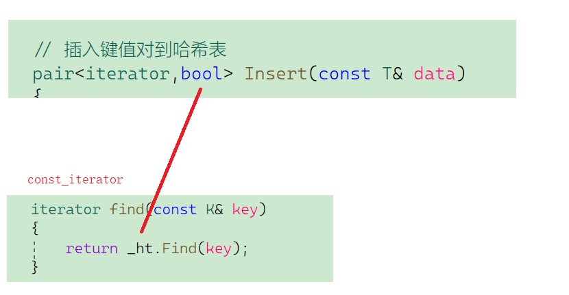

# 哈希

## 目录

-   [unordered\_map](#unordered_map)
-   [unordered\_set](#unordered_set)
-   [底层结构](#底层结构)
    -   [哈希概念](#哈希概念)
    -   [哈希冲突](#哈希冲突)
    -   [哈希冲突解决](#哈希冲突解决)
        -   [闭散列（开放定址法）](#闭散列开放定址法)
            -   [线性探测 ](#线性探测-)
            -   [二次探测](#二次探测)
        -   [只能存储key为整形的元素，其他类型怎么解决](#只能存储key为整形的元素其他类型怎么解决)
        -   [开散列 ](#开散列-)
        -   [哈希闭散列与开散列实现](#哈希闭散列与开散列实现)
-   [哈希表的封装](#哈希表的封装)
    -   [模板参数列表的改造](#模板参数列表的改造)
    -   [增加迭代器操作](#增加迭代器操作)

[哈希的应用](哈希的应用/哈希的应用.md "哈希的应用")

# unordered\_map

1.  unordered\_map是存储\<key, value>键值对的关联式容器，其允许通过keys快速的索引到与

其对应的value。

1.  在unordered\_map中，键值通常用于惟一地标识元素，而映射值是一个对象，其内容与此

键关联。键和映射值的类型可能不同。

1.  在内部,unordered\_map没有对\<kye, value>按照任何特定的顺序排序, 为了能在常数范围内

找到key所对应的value，unordered\_map将相同哈希值的键值对放在相同的桶中。

1.  unordered\_map容器通过key访问单个元素要比map快，但它通常在遍历元素子集的范围迭

代方面效率较低。

1.  unordered\_maps实现了直接访问操作符(operator\[])，它允许使用key作为参数直接访问

value。

1.  它的迭代器至少是前向迭代器

***

# unordered\_set

参考手册

[cplusplus.com/reference/unordered\_set/unordered\_set/?kw=unordered\_set](https://cplusplus.com/reference/unordered_set/unordered_set/?kw=unordered_set "cplusplus.com/reference/unordered_set/unordered_set/?kw=unordered_set")

***

# 底层结构

unordered系列的关联式容器之所以效率比较高，是因为其底层使用了哈希结构。

***

## 哈希概念

-   顺序结构以及平衡树中，元素关键码与其存储位置之间没有对应的关系，因此在查找一个元素时，必须要经过关键码的多次比较。顺序查找时间复杂度为O(N)，平衡树中为树的高度，即O($log_2 N$)，搜索的效率取决于搜索过程中元素的比较次数
-   理想的搜索方法：可以不经过任何比较，一次直接从表中得到要搜索的元素。如果构造一种存储结构，通过某种函数(hashFunc)使元素的存储位置与它的关键码之间能够建立一一映射的关系，那么在查找时通过该函数可以很快找到该元素
-   当向该结构中：
    -   插入元素

        根据待插入元素的关键码，以此函数计算出该元素的存储位置并按此位置进行存放
    -   搜索元素

        对元素的关键码进行同样的计算，把求得的函数值当做元素的存储位置，在结构中按此位置
        取元素比较，若关键码相等，则搜索成功
-   哈希（hash）是一种将任意大小的数据映射为固定大小值的函数，它把数据压缩为散列表（hash table）中的固定大小索引，以便查找、排序和识别记录。开散列和闭散列是两种常见的散列技术，它们都在哈希表中使用。
    -   开散列中，哈希表中每个槽位都指向一个链表，其中对应的数据项存储在链表中。当发生哈希冲突时，将使用链接方法将额外的项添加到链接列表中。
    -   闭散列中，每个槽位都是一个可容纳一个数据项的容器，当出现冲突时，用开放定址法来解决冲突，即线性探测,二次探测；这种方法会在检测到一个冲突时，尝试在哈希表中寻找另一个可用的槽位，直到所有的位置都检测完毕或寻找到空槽位。

因此，开散列和闭散列都是哈希表的不同实现方式，开散列中使用链接法来处理冲突，而闭散列则使用开放定址法的线性探测方法来处理冲突。

-   该方式即为哈希(散列)方法，哈希方法中使用的转换函数称为哈希(散列)函数，构造出来的结构称
    为哈希表(Hash Table)(或者称散列表)
    -   例如：数据集合{1，7，6，4，5，9}

        哈希函数设置为：hash(key) = key % capacity; capacity为存储元素底层空间总的大小。

        

        用该方法进行搜索不必进行多次关键码的比较，因此搜索的速度比较快
    问题：按照上述哈希方式，向集合中插入元素44，会出现 冲突的问题

***

## 哈希冲突

-   引起哈希冲突的一个原因可能是：哈希函数设计不够合理。哈希函数设计原则：
    -   哈希函数的定义域必须包括需要存储的全部关键码，而如果散列表允许有m个地址时，其值域必须在0到m-1之间
    -   哈希函数计算出来的地址能均匀分布在整个空间中
    -   哈希函数应该比较简单
    -   常见哈希函数

        哈希函数，把学生的姓名直接映射为哈希表上的索引，然后就可以通过查询索引下标快速知道这位同学是否在这所学校里了。

        哈希函数如下图所示，通过hashCode把名字转化为数值，一般hashcode是通过特定编码方式，可以将其他数据格式转化为不同的数值，这样就把学生名字映射为哈希表上的索引数字了。

        
        -   直接定址法--(常用)
            1.  值和位置关系唯一关系，每个人都有一个唯一位置)
            2.  缺点：空间开很大，浪费值很分散，直接定址会导致空间开很大，浪费.
            3.  优点：简单、均匀
            4.  使用场景：适合查找比较小且连续的情况
                

空间开很大，浪费值很分散，直接定址会导致

-   注意：当两个元素索引下标都映射到 同一位置，**这一现象叫做哈希碰撞**。哈希函数设计的越精妙，产生哈希冲突的可能性就越低，但是无法避免哈希冲突（**哈希碰撞**）

***

## 哈希冲突解决

除留余数法、平方取中法、直接定址法和折叠法都是哈希函数的选择方法。它们用于将关键字映射到哈希表中的槽位上。

-   除留余数法：将关键字除以一个固定数，然后取余数作为哈希值。
-   平方取中法：将关键字先平方，然后取平方后的值中间的几位作为哈希值。
-   直接定址法：直接使用关键字本身作为哈希值。适用于关键字的范围较小的情况。
-   折叠法：将关键字分成若干段，然后将这些段相加，并取结果的低位作为哈希值。

而开放定址法是一种解决哈希冲突的方法，它在发生冲突时通过探测其他槽位来插入冲突的关键字。线性探测是开放定址法的一种实现策略，通过在哈希表中依次探测下一个槽位来解决冲突。

所以，除留余数法、平方取中法、直接定址法和折叠法是哈希函数的选择方法，而开放定址法和线性探测是解决哈希冲突的方法。它们可以在哈希表的实现中相互结合使用。

-   下面介绍 （开放定址法）
    -   直接定址法：直接使用关键字本身作为哈希值。适用于关键字的范围较小的情况。

***

### 闭散列（开放定址法）

闭散列：也叫开放定址法，当发生哈希冲突时，如果哈希表未被装满，说明在哈希表中必然还有空位置，那么可以把key存放到冲突位置中的“下一个” 空位置中去。那如何寻找下一个空位置呢？

#### 线性探测&#x20;

比如2.1中的场景，现在需要插入元素44，先通过哈希函数计算哈希地址，hashAddr为4，

因此44理论上应该插在该位置，但是该位置已经放了值为4的元素，即发生哈希冲突


-   线性探测：从发生冲突的位置开始，依次向后探测，直到寻找到下一个空位置为止
    -   **插入**
        -   通过哈希函数获取待插入元素在哈希表中的位置
        -   如果该位置中没有元素则直接插入新元素，如果该位置中有元素发生哈希冲突，使用线性探测找到下一个空位置，插入新元素
            
    -   **删除**

        采用闭散列处理哈希冲突时，不能随便物理删除哈希表中已有的元素，若直接删除元素会影响其他元素的搜索。比如删除元素4，如果直接删除掉，44查找起来可能会受影响。因此线性探测采用标记的伪删除法来删除一个元素。
        ```c++
        // 哈希表每个空间给个标记
        // EMPTY此位置空， EXIST此位置已经有元素， DELETE元素已经删除
        enum State { EMPTY, EXIST, DELETE };
        ```
        -   &#x20; 即：删除的时候并不是标为空，而是标为删除。这样查找的时候看EMPTY，EMPTY是无该数据。插入的是时候看是DELETE还是EMPTY，是DELETE更改数据，是EMPTY填补数据。
            
-   使用线性探测法，一定要保证tableSize大于dataSize。 我们需要依靠哈希表中的空位来解决碰撞问题。例如冲突的位置，放了小李，那么就向下找一个空位放置小王的信息。所以要求tableSize一定要大于dataSize ，要不然哈希表上就没有空置的位置来存放 冲突的数据了。


-   哈希表什么情况下进行扩容？如何扩容
    -   散列表的载荷因子定义为:$  a = 填入表中的元素个 /散列表的长度 $
    -   负载因子: $存储关键字个数 / 空间大小$
    > 对于开放定址法，荷载因子是特别重要因素，应严格限制在0.7-0,8以下。超过0.8，查表时的CPU缓存不命中(cachemissing)按照指数曲线上升。因此，一些采用开放定址法的hash库，如Java的系统库限制了荷载因子为0.75，超过此值将resize散列表。
    >
    > -   负载因子太大，冲突可以会剧增，冲突增加，
    > -   效率降低负载因子太小，冲突降低，但是空间利用率就低了
-   那负数是否可以映射

    `负数 % tables.size()`时  `tables.size()` 是无符号，如果有符号如果对无符号运算时会发生隐式类型转换，低的对高的转换，及有符号变成无符号，所以负数也无需另外处理，也能映射成功.
-   线性探测优点：实现非常简单，
-   线性探测缺点：一旦发生哈希冲突，所有的冲突连在一起，容易产生数据“堆积”，即：不同关键码占据了可利用的空位置，使得寻找某关键码的位置需要许多次比较，导致搜索效率降低。如何缓解呢？

***

#### 二次探测


线性探测的缺陷是产生冲突的数据堆积在一块，这与其找下一个空位置有关系，因为找空位置的方式就是挨着往后逐个去找，因此二次探测为了避免该问题，而二次探测则采用二次探测序列来查找下一个槽位。具体做法是，如果发生哈希冲突，先检查目标槽位是否被占用，如果占用了，则依次探测下一个槽位，使用二次探测序列计算新的槽位索引。二次探测序列一般为i^2，其中i是探测次数。

对于2.1中如果要插入44，产生冲突，使用解决后的情况为：


研究表明：当表的长度为质数且表装载因子a不超过0.5时，新的表项一定能够插入，而且任
何一个位置都不会被探查两次。因此只要表中有一半的空位置，就不会存在表满的问题。在
搜索时可以不考虑表装满的情况，但在插入时必须确保表的装载因子a不超过0.5，如果超出
必须考虑增容

-   二次探测的实现与线性探测的实现的核心是极为相似的，也就是对于哈希地址取值方式的改变。
    ```c++
    Hash hash;
        size_t start = hash(kv.first) % _tables.size();
        size_t i = 0;
        size_t hashi = start;
        // 二次探测
        while (_tables[hashi]._state == EXIST)
        {
          ++i;
          hashi = start + i * i;
          hashi %= _tables.size();
        }
     
        _tables[hashi]._kv = kv;
        _tables[hashi]._state = EXIST;
        ++_size;

    ```
-   因此：闭散列最大的缺陷就是空间利用率比较低，这也是哈希的缺陷

***

### 只能存储key为整形的元素，其他类型怎么解决

-   如果key不是整形，该如何处理比如 key 是 string类型（只有整数才可以取模%）
    -   解决方案 哈希
        -   一个字符串映射对应一个整数在开始取模
            -   仿函数上场 ，（缺省值给成整型的仿函数，如字符串则调用对应仿函数
                -   （把字符串的ASCII值加起来对应一个整数，这样可以吗， 答案是不行的，要是插入“abc”和"cba"）,就会整整型相同了，存储的位置就冲突了）
                -   解决方案: 字符串哈希算法
                    -   其实下面这个 字符串哈希算法 只是把ASCII每次加时候\*一个31
                        [各种字符串Hash函数 - clq - 博客园 http://www.cnblogs.com/atlantis13579/archive/2010/02/06/1664792.htmlhttp://blog.csdn.net/icefireelf/article/details/5796529 字符串Hash函数对比 分类： 数据结构与算法 20 https://www.cnblogs.com/-clq/archive/2012/05/31/2528153.html](https://www.cnblogs.com/-clq/archive/2012/05/31/2528153.html "各种字符串Hash函数 - clq - 博客园 http://www.cnblogs.com/atlantis13579/archive/2010/02/06/1664792.htmlhttp://blog.csdn.net/icefireelf/article/details/5796529 字符串Hash函数对比 分类： 数据结构与算法 20 https://www.cnblogs.com/-clq/archive/2012/05/31/2528153.html")
                    ```c++
                    template<class T>
                    class DefHashF
                    {
                    public:
                      size_t operator()(const T& val)
                      {
                        return val;
                      }
                    };

                    class Str2Int
                    {
                      size_t operator()(const string& key)
                      {
                        // BKDR
                        size_t hash = 0;
                        for (auto e : key)
                        {
                          hash *= 31;
                          hash += e;
                        }
                        cout << key << ":" << hash << endl;
                        return hash;
                      }
                    }
                    ```
-   我们平时写的 `unordered_map<string,string>` 也没有写string转换整型啊，那是怎么支持的，怎么取模的？
    -   解决方案： 模版特化

        [模版特化版本](模版特化版本/模版特化版本.md "模版特化版本")
    -   ps: 如果里面重载两个`  operator() 一个是int，一个是string  `是不可以的，因为在实例化时，如果实例化出一个string时`， operator(k data)  operator<string data>` 都是string时就冲突了。
        ```c++
        template <class K>
        struct DefHashF
        {
          int operator()(const K& data)
          {}

          int operator()(const string& data)
          {}
        };

         error
        ```

***

### 开散列&#x20;

有三个叫法 → 拉链法  开散列  开链法 哈希桶

-   开散列概念

    开散列法又叫链地址法(开链法)，首先对关键码集合用散列函数计算散列地址，具有相同地
    址的关键码归于同一子集合，每一个子集合称为一个桶，各个桶中的元素通过一个单链表链
    接起来，各链表的头结点存储在哈希表中。
    -   刚刚小李和小王在索引1的位置发生了冲突，发生冲突的元素都被存储在链表中。 这样我们就可以通过索引找到小李和小王了

        

        （数据规模是dataSize， 哈希表的大小为tableSize）
        -   其实拉链法就是要选择适当的哈希表的大小，这样既不会因为数组空值而浪费大量内存，也不会因为链表太长而在查找上浪费太多时间。
            
        
    -   **从上图可以看出，开散列中每个桶中放的都是发生哈希冲突的元素。**
-   拉链法：查找平局时间复杂度为 0(1)

    最坏情况都在一个桶里面 O(n) 但是很多该情况很极限
    > java 某个桶超过一定的长度就挂成红黑树。 C++不会
-   插入

    由于是单链表，并且哈希桶并未要求对数据进行排序，所以表中的每一个单链表，进行尾插还是头插都是可以的，此处选择**头插**。
-   删除

    根据哈希地址寻找后，直接按照单链表的删除方式即可。

    
-   开散列增容

    桶的个数是一定的，随着元素的不断插入，每个桶中元素的个数不断增多，极端情况下，可
    能会导致一个桶中链表节点非常多，会影响的哈希表的性能，因此在一定条件下需要对哈希
    表进行增容，那该条件怎么确认呢？开散列最好的情况是：每个哈希桶中刚好挂一个节点，
    再继续插入元素时，每一次都会发生哈希冲突，因此，在元素个数刚好等于桶的个数时，可
    以给哈希表增容。
    ```c++
    // 负载因子到1就扩容
          if (_tables.size() == _n)
          {
            vector<Node*> newtables;
            newtables.resize(_tables.size() * 2, nullptr);  // 将新的哈希桶数组大小扩大一倍

            for (int i = 0; i < _tables.size(); i++)
            {
              if (_tables[i])
              {
                Hash hf;
                Node* cur = _tables[i];
                while (cur)
                {
                  Node* next = cur->_next; //保存下一个指针
                  size_t index = hf(cur->_kv.first) % newtables.size();

                  //将旧表的数据头插到新表位置
                  cur->_next = newtables[index];
                  newtables[index] = cur;
                  cur = next;
                }
                _tables[i] = nullptr; // 旧的哈希桶置为空
              }
            }

            _tables.swap(newtables); // 交换新旧哈希桶数组的指针
          }
    ```

### 哈希闭散列与开散列实现

请参考git &#x20;

[哈希 闭散列 开散列 · 0f6846c · 虾米Life/Data.structure - Gitee.com](https://gitee.com/XMLife/data.structure/commit/0f6846c56bdabe7aae2dfa6b22c4c17cae76b817 "哈希 闭散列 开散列 · 0f6846c · 虾米Life/Data.structure - Gitee.com")

-   开散列与闭散列比较

    应用链地址法处理溢出，需要增设链接指针，似乎增加了存储开销。事实上：

    由于开地址法必须保持大量的空闲空间以确保搜索效率，如二次探查法要求装载因子a <= 0.7，而表项所占空间又比指针大的多，所以使用链地址法反而比开地址法节省存储空间。
-   使哈希高效: 选择好的哈希函数非常关键
-   好的哈希函数可以减少发生冲突的概率
-   万一发生冲突，好的处理好戏冲突的方法也比较关键，否则冲突处理不当，也会增加后序元素冲突的概率
-   散列函数有一个共同性质，即函数值应按（同等概率）取其值域的每一个值。&#x20;

    哈希函数设计原则：
    1.  哈希函数应该尽可能简单
    2.  哈希函数的值域必须在哈希表格的范围之内
    3.  哈希函数的值域应该尽可能均匀分布，即取每个位置应该是等概率的


***

# 哈希表的封装

## 模板参数列表的改造

```c++
// K:关键码类型
// T: 不同容器V的类型不同，如果是unordered_map，V代表一个键值对，如果是 unordered_set,V 为 K
// ketoft: 因为V的类型不同，通过value取key的方式就不同，详细见unordered_map/set的实现

// Hash: 哈希函数仿函数对象类型，需要将Key转换为整形数字才能取模 ps:哈希函数是在un_set和 un_map这一层控制然后传给哈希表的
template<class K, class V, class KeyOfValue, class HF>
class HashBucket;
```

-   哈希函数是在容器内部控制的，并且将它传递给底层的哈希表实现。

    在使用 `unordered_map` 和 `unordered_set` 时，你可以通过提供一个自定义的哈希函数对象来指定如何计算关键字的哈希值。

***

## 增加迭代器操作

-   为了实现简单，在哈希桶的迭代器类中需要用到hashBucket本身 ,或者只传个hashBucket 中的数组过去。 其实最重要拿到那个hashBucket本身那个数组就可以遍历++操作了. 这里为了展现更加的操作，传hashBucket对象过去
-   哈希桶在底层是单链表结构，所以哈希桶的迭代器不需要--操作

```c++
template <class K, class T, class KeyOfT, class Hash>
struct __HTIterator
{
    typedef HashNode<T> Node;
    typedef __HTIterator<K, T, KeyOfT, Hash> Self;

    Node* _node;                            // 当前迭代器指向的节点
    Hashtable<K, T, KeyOfT, Hash>* _pht;    // 指向哈希表的指针
    size_t _hashi;                          // 当前迭代器所指节点所属的桶的索引

    __HTIterator(Node* node, Hashtable<K, T, KeyOfT, Hash> pht, size_t hashi)
        : _node(node)
        , _pht(pht)
        , _hashi(hashi)
    {}

    K& operator*()
    {
        return _node->_data;    // 返回当前节点中存储的键值对的键的引用
    }

    K* operator->()
    {
        return &_node->_data;   // 返回当前节点中存储的键值对的键的指针
    }

    bool operator!=(const Self& s)
    {
        return _node != s._node;    // 判断两个迭代器是否指向不同的节点
    }
};
```

`_hashi` 是一个成员变量，用于保存哈希值对应的索引。它的作用是帮助定位当前迭代器所指向的元素在哈希表中的位置。

在哈希表中，元素被散列到不同的桶（bucket）中，每个桶对应一个索引。通过计算元素的哈希值，可以确定其应该位于哪个桶中。而 `_hashi` 则记录了当前迭代器指向的元素所属的桶的索引。

通过 `_hashi` 可以在迭代器的操作中更方便快速地定位和访问当前元素所在的桶。它可以用于实现遍历哈希表中元素的功能，或者在其他需要查找或操作特定元素的操作中提供更高效的定位方法。

***

-   这里有一个问题，哈希表要用迭代器，迭代器要用哈希表，相互排斥。到底是谁先“在上，谁先在下呢是”“先有蛋还是先有鸡呢”

    
    -   解决方案&#x20;
        1.  不传哈希对象，传个哈希数据过去， vector\<Node \*> \_tables
        2.  加一个前置声明.

            
            -   ps:  但是加了会发现还是用不了的。 因为哈希对象的数组是私有的，无法访问要加个友元

                
                -   ps: 类模版的友元要把前置声明带上
                    
-   这里还有个问题 → `const_iterator`  如果此时`const_iterator begin/end()const,` const 已经修饰this了 保护指向了的对象，传参迭代器时就传不过去了，因为接受的是非const，此时迭代器哈希表对象应该是个const 类型的。在构造函数时我们只有一个非const的类型来结束，权限放大了。

    

    
    -   解决方案:
        -   重新重载一个构造函数，用const来接收。但是这样还不可以解决问题，还需要把迭代器中的哈希表对象改为const的.
-   map "\[]" 的实现

    “\[]” 跟红黑树那里类似，但返回 `pair<Node* ,bool>`哈希这不行。哈希这里的迭代器构造有三个值，就无法像之前的那样构造了

    
    -   解决法案:&#x20;

        在hash这一层直接用迭代器构造跟值来初始化，用值依次来构造。

        `return make_pair(iterator(newnode,this,index),true);`
        -   新问题: 如果hash这一层返回一个 普通迭代器，而set这一层的迭代器是const类型的，该set这层insert 和 find如何接收呢？

            
            -   解决方案 → 直接用一个auto接收(跟他什么类型)，然后在用auto返回迭代器依次给值构造.`const_iterator 在返回`
                ```c++
                pair<iterator,bool> insert(const K& key)
                    {
                      auto ret = _ht.Insert(key);
                      return pair<const_iterator, bool>(const_iterator(ret.first._node, ret.first._pht, ret.first._hashi),ret.second);
                    }
                   ---------------------------------------

                ```
                ```c++
                 iterator find(const K& key)
                    {
                      auto ret = _ht.Find(key);
                      return const_iterator(ret.first._node, ret.first._pht, ret.first._hashi);
                    }
                ```
