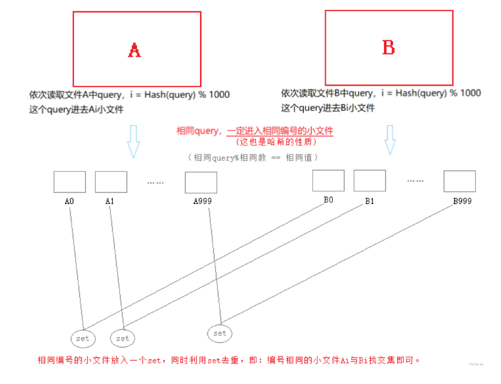

# 哈希的应用

## 目录

-   [位图](#位图)
    -   [位图的概率](#位图的概率)
    -   [位图的实现](#位图的实现)
        -   [开辟bit空间](#开辟bit空间)
        -   [数据输入set](#数据输入set)
        -   [数据删除reset](#数据删除reset)
        -   [数据确认test](#数据确认test)
        -   [位图的应用](#位图的应用)
-   [布隆过滤器](#布隆过滤器)
    -   [布隆过滤器提出](#布隆过滤器提出)
    -   [布隆过滤器概念](#布隆过滤器概念)
    -   [布隆过滤器的实现](#布隆过滤器的实现)
        -   [布隆过滤器的插入](#布隆过滤器的插入)
        -   [布隆过滤器的查找](#布隆过滤器的查找)
        -   [布隆过滤器的删除](#布隆过滤器的删除)
    -   [布隆过滤器的使用场景](#布隆过滤器的使用场景)
        -   [精准查询 - 不允许误判](#精准查询---不允许误判)
        -   [简陋查询 - 允许误判](#简陋查询---允许误判)
    -   [布隆过滤器优点](#布隆过滤器优点)
    -   [布隆过滤器缺陷](#布隆过滤器缺陷)
-   [海量数据面试题](#海量数据面试题)
    -   [容器位图的衍生使用](#容器位图的衍生使用)
        -   [给定100亿个整数，设计算法找到只出现一次的整数？](#给定100亿个整数设计算法找到只出现一次的整数)
        -   [给两个文件，分别有100亿个整数，我们只有1G内存，如何找到两个文件交集？](#给两个文件分别有100亿个整数我们只有1G内存如何找到两个文件交集)
        -   [位图应用变形：1个文件有100亿个int，1G内存，设计算法找到出现次数不超过2次的所有整数](#位图应用变形1个文件有100亿个int1G内存设计算法找到出现次数不超过2次的所有整数)
    -   [布隆过滤器](#布隆过滤器)
    -   [哈希切割](#哈希切割)

# 位图

***

## 位图的概率

-   面试题 → 给40亿个不重复的无符号整数，没排过序。给一个无符号整数，如何快速判断一个数是否在这40亿个数中。【腾讯】
    1.  遍历，时间复杂度O(N)
    2.  排序(O(NlogN))，利用二分查找: logN&#x20;

        ps : （40亿个无符号整数约等于16G，光看内存所需就是极为恐怖的）

        1 `byte` = 8 `bit
        `1 `KB` = 1024 `byte
        `1 `MB` = 1024 `KB
        `1 `GB` = 1024 `MB`
    3.  位图解决
-   位图
    -   数据是否在给定的整形数据中，结果是在或者不在，刚好是两种状态，那么可以使用一
        个二进制比特位来代表数据是否存在的信息，如果二进制比特位为1，代表存在，为0
        代表不存在。 每个值映射一个bit位.

        
    -   &#x20;**所谓位图，就是用每一位来存放某种状态，适用于海量数据，数据无重复的场景。通常是用来判断某个数据存不存在的。**

## **位图的实现**

-   &#x20;由于没有字节的类型于是需要我们自行进行分割使用，所以使用char或int类型的数组皆可。

```c++

namespace xm
{
  template<size_t N> // 非类型模板参数 N为需开辟的bit位个数
  class bitset
  {
  public:
    //开辟bit空间
    bitset();
 
    //数据输入set
    void set(size_t x);
 
    //数据删除reset
    void reset(size_t x);
 
    //数据确认test
    bool test(size_t x);
  private:
    vector<int> _bits; // 此处采取vector容器实现
  };

```

#### **开辟bit空间**

-   所知N为需开辟的bit位个数，而我们利用vector\<int>容器开辟了一段数组，而 32位为1byte：

```c++
//开辟bit空间
    bitset()
    {
      _bits.resize(N / 32 + 1, 0);
    }
```

由于 N / 32  是会省去余数。所以，时常会因为 N / 32 的除不净，而导致的开辟空间不足。而又因为采取的容器是vector\<int>容器，所以一次空间开辟至少为int（32），所以只能在 N / 32 的基础上 + 1。

由于位图是利用bit位的0与1判断数据是否存在，所以数据置0是至关重要的。

#### **数据输入set**

-   映射x
    x在数组的第一个整形呢? i = x/32

    x在这个整形的第几个位? j= x%32

set 第j位处理成1，其他位不变

```c++
  //数据输入set
    void set(size_t x)
    {
      size_t i = x / 32;  // 计算位所在的元素索引
      size_t j = x % 32;  // 计算位在元素中的偏移
      _bits[i] = _bits[i] | (1 << j);  // 使用位运算将对应位设置为1
    }
```


因为底层采取的是vector\<size\_t>容器，所以每32bit位就是vector\<size\_t>容器实现的数组的一位。所以根据x / 32判断其应在int数组的哪一个字节。。而x % 32即为其在此字节中的哪一个位.

由于是位操作。即利用位操作符 << 数据 1 ，保证只有数据的位置为1，然后利用位操作符 | 的有1即为1。记录数据是否存在。

***

#### **数据删除reset**

-   映射x
    x在数组的第一个整形呢? i = x/32

    x在这个整形的第几个位? j= x%32

```c++
//数据删除reset
    void reset(size_t x)
    {
      size_t i = x / 32;  // 计算位所在的元素索引
      size_t j = x % 32;  // 计算位在元素中的偏移
      _bits[i] = _bits[i] & (~(1 << j));  // 使用位运算将对应位重置为0
    }
```


由于是位操作。即利用位操作符 **<<** 数据 1 并取反，保证只有数据的位置为0，然后利用位操作符 **&** 的都为1才是1。将存在的数据记录删除。

***

#### **数据确认test**

-   映射x
    x在数组的第一个整形呢? i = x/32

    x在这个整形的第几个位? j= x%32

```c++
//数据确认test
    bool test(size_t x)
    {
      size_t i = x / 32;  // 计算位所在的元素索引
      size_t j = x % 32;  // 计算位在元素中的偏移
      return _bits[i] & (1 << j);  // 使用位运算检查指定位是否为1
    }
```

&#x20;


由于是位操作。即利用位操作符 **<<** 数据 1 ，保证只有数据的位置为1，然后利用位操作符 **&** 的都为1才是1。判断数据是否存在。

***

### 位图的应用

-   快速查找某个数据是否在一个集合中。
-   排序 + 去重。
-   求两个集合的交集、并集等。
-   操作系统中磁盘块标记。

位图对于处理大量数据很方便，但是只能运用于整数。

-   位图的特点

    快、节省空间。

    相对局限，只能映射处理整形。
-   搜索
    1\. 暴力查找 数据量大了，效率就低
    2\. 排序+二分查找 问题a: 排序有代价 问题 b: 数组不方便增删
    3搜索树 ->AVL树+红黑树
    4\. 哈希
-   以上数据结构，空间消耗很高
    -   数量很大的数据&#x20;
        5、\[整形] 的在不在及其扩展问题 →  位图及变形 节省空间
        6、\[其他类型] 的在不在呢 ? → 布隆过滤器

***

# 布隆过滤器

## 布隆过滤器提出

我们在使用新闻客户端看新闻时，它会给我们不停地推荐新的内容，它每次推荐时要去重，去掉
那些已经看过的内容。问题来了，新闻客户端推荐系统如何实现推送去重的？ 用服务器记录了用
户看过的所有历史记录，当推荐系统推荐新闻时会从每个用户的历史记录里进行筛选，过滤掉那
些已经存在的记录。 如何快速查找呢？

-   用哈希表存储用户记录，缺点：浪费空间
-   用位图存储用户记录，缺点：位图一般只能处理整形，如果内容编号是字符串，就无法处理了。
-   将哈希与位图结合，即布隆过滤器 → 可以解决字符串类型等

***

## 布隆过滤器概念

布隆过滤器是由布隆（Burton Howard Bloom）在1970年提出的 一种紧凑型的、比较巧妙的概
率型数据结构，特点是高效地插入和查询，可以用来告诉你 “某样东西一定不存在或者可能存
在”，它是用多个哈希函数 → 转化成对应的整型，将一个数据映射到位图结构中。此种方式不仅可以提升查询效率，也可以节省大量的内存空间.

-   其本质上就是一个位图，对于位图我们知道：其是用每一位来存放某种状态，是适用于海量数据，用来判断某个数据存不存在的。这正映衬着使用新闻客户端看新闻时，不停地推荐新的内容，每次推荐时的去重。
-   可是，内容是由字符串代表的，而字符串是有很多的状态。字符的不同，长度的不同等，皆会导致字符串转换的数值会有重复。这代表，如果我们使用位图完全同样的思维，会导致大量资源因为哈希地址的相同而被判断为出现过。
-   于是，如何防止大量不同的字符串因为哈希地址的相同而导致的判断不准确就是重点：
-   **采用多个位置映射**
    -   理论而言：一个值映射的位越多，误判的概率越低。但是也不能映射的太多，映射位越多，那么空间的消耗就越多。
    -   **（此处采取三个位映射）**
    -   **采取多个位映射只能一定程度上的减少误判，并不能完全的避免。**

\-&#x20;

[详解布隆过滤器的原理，使用场景和注意事项 - 知乎 (zhihu.com)](https://zhuanlan.zhihu.com/p/43263751/ "详解布隆过滤器的原理，使用场景和注意事项 - 知乎 (zhihu.com)")

**（下列数据来自于链接中的知乎）**


-   选择适合的 k 和 m 值公式：


-   此文，我们使用第二公式（通过：3个哈希函数，ln2 ≈ 0.693）：


***

## **布隆过滤器的实现**

-   采取对bitset（位图）的再封装实现。

[各种字符串Hash函数 - clq - 博客园 (cnblogs.com)](https://www.cnblogs.com/-clq/archive/2012/05/31/2528153.html "各种字符串Hash函数 - clq - 博客园 (cnblogs.com)")

***

### 布隆过滤器的插入

-   利用三个哈希函数映射不同的整型，分别插入不同的位置。


-   向布隆过滤器中插入："baidu" 和  "tencent"


```c++
```

***

### 布隆过滤器的查找

-   布隆过滤器的思想是将一个元素用多个哈希函数映射到一个位图中，因此被映射到的位置的比特位一定为1。所以可以按照以下方式进行查找：分别计算每个哈希值对应的比特位置存储的是否为零，**只要有一个为零，代表该元素一定不在哈希表中，否则可能在哈希表中。**
-   注意：布隆过滤器如果说某个元素不存在时，该元素一定不存在，如果该元素存在时，该元素可能存在，有可能不存在，因为有些哈希函数存在一定的误判。
-   比如：在布隆过滤器中查找"alibaba"时，假设3个哈希函数计算的哈希值为：1、3、7，刚好和其他元素的比特位重叠，此时布隆过滤器告诉该元素存在，但实该元素是不存在的

由于其采用的是一个或多个bitset（位图）结合多个哈希地址映射实现，所以对于数据的存在是有误差的：

-   **在：** 不准确的，存在误差的 (可能出现了其他位的整型已经映射到了该位置)
-   **不在：** 准确的，不存在误判

```c++
//查找在不在
  void test()
  {
    size_t hash1 = HashFunc1()(key) & N;  // 使用 HashFunc1() 计算元素的哈希值
    size_t hash2 = HashFunc2()(key) & N;  // 使用 HashFunc2() 计算元素的哈希值
    size_t hash3 = HashFunc3()(key) & N;  // 使用 HashFunc3() 计算元素的哈希值

    // 判断不存在是准确的
    if (_bs.test(hash1) == false)
      return false;
    if (_bs.test(hash2) == false)
      return false;
    if (_bs.test(hash3) == false)
      return false;
    
    //存在误判....
    return true;
  }
```

***

### **布隆过滤器的删除**

布隆过滤器不能直接支持删除工作，因为在删除一个元素时，可能会影响其他元素

。


-   比如：删除上图中"tencent"元素，如果直接将该元素所对应的二进制比特位置0，“baidu”元素也被删除了，因为这两个元素在多个哈希函数计算出的比特位上刚好有重叠。
-   缺陷：
    1.  无法确认元素是否真正在布隆过滤器中
    2.  存在计数回绕
-   一种支持删除的方法：将布隆过滤器中的每个比特位扩展成一个小的计数器，插入元素时给k个计数器(k个哈希函数计算出的哈希地址)加一，删除元素时，给k个计数器减一，通过多占用几倍存储空间的代价来增加删除操作。→\*\* 引用计数\*\*


利用多个bitset（位图）进行计数型的布隆过滤器实现。

-   1个位图：1（计数最大为：1）
-   2个位图：11（计数最大为：3）
-   3个位图：111（计数最大为：7）
-   ……以此类推

***

## **布隆过滤器的使用场景**

### **精准查询 - 不允许误判**

在日常生活中时常会进行罪犯的抓捕，而对于罪犯的抓捕需要提取一些数据到电脑中，在利用这些数据到海量的数据库中寻找。但是，数据库的大小是海量的，大到不是一台移动电脑就能存下的，甚至需要数台服务器存储。如果可疑的数据一一到数据库中寻找，会因为如：硬盘查询速度缓慢，数据总量太多，网络的延迟等，都会造成长时间数据搜索。

这个时候就需要利用布隆过滤器对数据进行过滤，将大量的可疑数据在电脑中就进行一次大筛选。


### **简陋查询 - 允许误判**


在日常生生活中，针对于某个游戏、某个app需要进行用户注册的时候，有一项选择是用户名的注册。有时候就会提醒你，你的用户名与他人相撞，需要更改用户名，这个时候，系统对于用户名是否有人使用**的查询就是使用​布隆过滤器**。因为系统并没有必要精准的查询用户名是否真正的被占用。


***

## 布隆过滤器优点

1.  增加和查询元素的时间复杂度为:O(K), (K为哈希函数的个数，一般比较小)，与数据量大小无关
2.  哈希函数相互之间没有关系，方便硬件并行运算
3.  布隆过滤器不需要存储元素本身，在某些对保密要求比较严格的场合有很大优势
4.  在能够承受一定的误判时，布隆过滤器比其他数据结构有这很大的空间优势
5.  数据量很大时，布隆过滤器可以表示全集，其他数据结构不能
6.  使用同一组散列函数的布隆过滤器可以进行交、并、差运算

***

## 布隆过滤器缺陷

1.  有误判率，即存在假阳性(False Position)，即不能准确判断元素是否在集合中(补救方法：再建立一个白名单，存储可能会误判的数据)
2.  不能获取元素本身
3.  一般情况下不能从布隆过滤器中删除元素
4.  如果采用计数方式删除，可能会存在计数回绕问题

***

# 海量数据面试题

### 容器**位图的衍生使用**

***

#### 给定100亿个整数，设计算法找到只出现一次的整数？

-   对于给定的100亿个整数，\*\*可以使用两个位图来解决这个问题. \*\*

    ps: 一百亿个数，需要两个位图，相当于需要二百亿个数存的下去吗？ 其实这里面有许多重复的值（因为没有100亿整数，里面有重复的，整数无符号也就  4,294,967,295 个整数)  不要给迷惑了， 这里开0xff ff ff ff 或者 -1 就可以存下了， 对于bitset容器的空间开辟使用**bitset<-1> bs;**（数据的范围与个数无关，所以我们只需要取到整数的大小范围，即：(size\_t) -1）
    -   如何用**两个位图来解决这个问题.**
        -   创建两个位图,用三种状态来表示 00 01 10  01表示过只出现一次

            
            1.  对于遍历到的每个整数，首先检查已经出现过一次的位图中对应的位。如果是00，说明这个整数是第一次出现，将位图中对应的位设置为01。如果是01，说明这个整数已经出现过一次，将位图中对应的位设置为10，表示出现过多次。如果是10，说明这个整数已经出现过多次，不做任何操作。
            2.  找到只出现一次的整数：遍历完整个整数列表后，再次遍历已经出现过一次的位图，找到状态为01的位，表示对应的整数只出现过一次。
    ```c++
    template <size_t N>
    class twobitset
    {
    public:
      void set(size_t x)
      {
        //00->01
        //01->10
        //10 不变  出现两次及以上
        size_t i = x / 32;
        size_t t = x % 32;
        if (_b1.test(x) == false && _b2.test(x) == false) //00 -> 01
        {
          _b2.set(x);
        }
        else if (_b1.test(x) == false && _b2.test(x) == true) //01 -> 10
        {
          _b1.set(x);
          _b2.set(x);
        }
      }

      void PrintOnce()
      {
        
        for (size_t i = 0; i < N; i++)
        {
          if (_b1.test(i) == false && _b2.test(i) == true)
          {
            cout << i << endl;
          }
        }
        cout << endl;
      }
    private:
      XmLife::bitset<N> _b1;
      XmLife::bitset<N> _b2;
    };
    ```

#### 给两个文件，分别有100亿个整数，我们只有1G内存，如何找到两个文件交集？

-   使用两个bitset（位图），分别记录两个文件中的数据的存在状态，最后将两个两个bitset（位图）结合（映射位都是1的值就是交集）。各自映射到一个位图，一个值在两个位图都存在，则是交集。

***

#### 位图应用变形：1个文件有100亿个int，1G内存，设计算法找到出现次数不超过2次的所有整数

-   跟题一一样 利用两个位图进行计数。

    

    

```c++
template <size_t N>
class twobitset_2
{
public:
  void set(size_t x)
  {
    //00->01
    //01->10
    //10->11
    //11->不变
    size_t i = x / 32;
    size_t t = x % 32;
    if (_b1.test(x) == false && _b2.test(x) == false) //00 -> 01
    {
      _b2.set(x);
    }
    else if (_b1.test(x) == false && _b2.test(x) == true) //01 -> 10
    {
      _b1.set(x);
      _b2.reset(x);
    }
    else if (_b1.test(x) == true && _b2.test(x) == false) //10 -> 11
    {
      _b1.set(x);
      _b2.set(x);
    }
  }

  void Print()
  {
    for (size_t i = 0; i < N; i++)
    {
      if (_bs1.test(i) == false && _bs2.test(i) == true) //01 出现一次的
      {
        cout << "1->" << i << endl;
      }
      else if (_bs1.test(i) == true && _bs2.test(i) == false) //10 出现二次
      {
        cout << "2->" << i << endl;
      }
    }
    cout << endl;
  }
private:
  XmLife::bitset<N> _b1;
  XmLife::bitset<N> _b2;
};
```

***

***

## 布隆过滤器

-   给两个文件，分别有100亿个query(字符串)，我们只有1G内存，如何找到两个文件交集？分别给出

精确算法和近似算法

**解题思路：**

哈希**切割**

1.  假设每个query是30byte，则100亿query需要的空间为：3000亿byte约等于300G （1 GB 相当于 1024 MB，1 MB 相当于 1024 KB，1 KB 相当于 1024 字节）（这对于内存来说是一个恐怖的数据，所以需要用到哈希切分）因为内存存不下，哈希表/红黑树统统靠边站。
2.  假设两个文件分别叫A和B



假设有两个文件A和B，每个文件包含100亿个query，内存只有1G。我们可以按照query被哈希到的编号依次将A和B中的query放入Ai和Bi这些小文件中。将同样编号的小文件放入一个set中，并且用set去重，然后取出同样编号的Ai和Bi找到它们的交集即可。


1.  如何扩展BloomFilter使得它支持删除元素的操作.

    非要支持删除，也是可以的，用多个位标记一个值，存引用计数

    但是这样话，空间消耗的就变大，通过多占用几倍存储
    空间的代价来增加删除操作。

***

## 哈希切割

给一个超过100G大小的log file, log中存着IP地址, 设计算法找到出现次数最多的IP地址？

**解题思路：**

**哈希切割**

与上一题同样的道理，只不过最后用的不是set，而是map，通过编号相同的小文件Ai和Bi组成的map中，找到出现最多的。

**#附加：** 与上题条件相同，如何找到top K的IP？

通过前面，编号相同的小文件组成的map的情况下，写一个K个数据的小根堆，再通过一一个map，以此筛选top K
