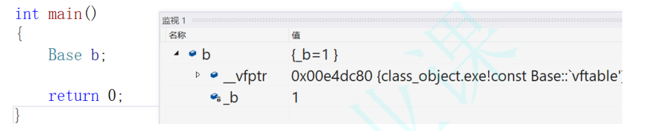
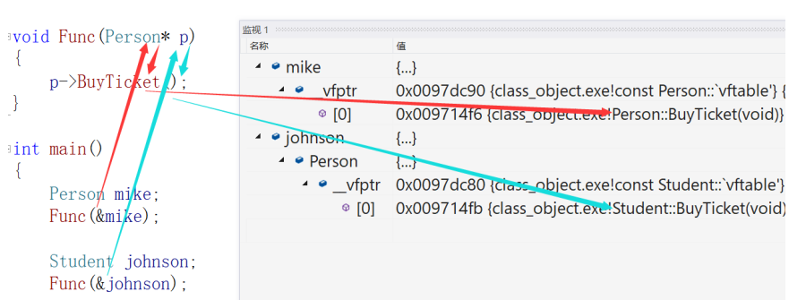
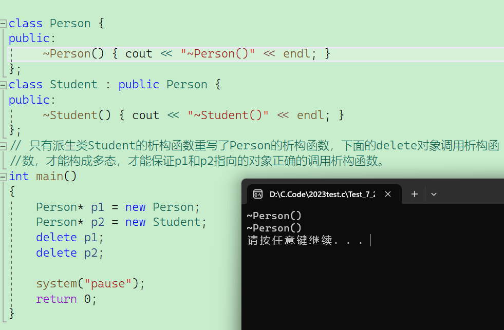
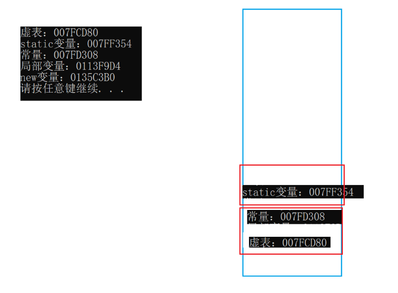
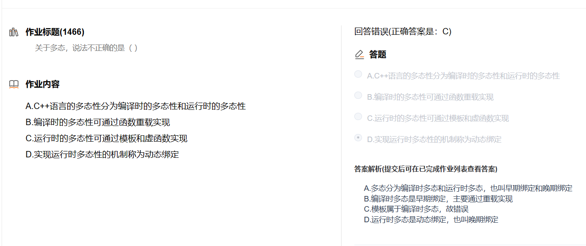
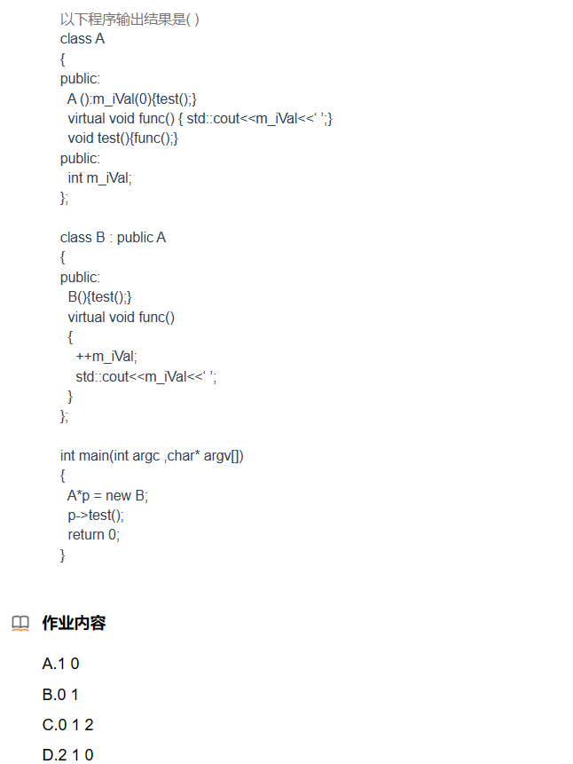

# 多态

## 目录

-   [1. 多态的定义及实现](#1-多态的定义及实现)
    -   [1. 1 虚函数](#1-1-虚函数)
    -   [1.2 虚函数的重写3](#12-虚函数的重写3)
    -   [1.3  C++11 override 和 final](#13--C11-override-和-final)
    -   [1.4 静态成员与友元](#14-静态成员与友元)
    -   [1.5 重载、覆盖(重写)、隐藏(重定义)的对比](#15-重载覆盖重写隐藏重定义的对比)
    -   [总结：：多态两个条件:](#总结多态两个条件)
-   [2. 抽象类](#2-抽象类)
    -   [纯虚函数](#纯虚函数)
    -   [接口继承和实现继承](#接口继承和实现继承)
-   [3. 多态的原理](#3-多态的原理)
    -   [验证虚函数与虚函数表的存储位置](#验证虚函数与虚函数表的存储位置)
    -   [多态的原理](#多态的原理)
    -   [动态绑定与静态绑定](#动态绑定与静态绑定)
-   [4. 单继承和多继承关系的虚函数表](#4-单继承和多继承关系的虚函数表)
    -   [单继承中的虚函数表](#单继承中的虚函数表)
    -   [多继承中的虚函数表](#多继承中的虚函数表)
-   [ 5. 继承和多态常见的面试问题](#-5-继承和多态常见的面试问题)

> 需要声明的，本节课件中的代码及解释都是在vs2013下的x86程序中，涉及的指针都是4bytes.如果要其他平台下，部分代码需要改动。比如: 如果是x64程序，则需要考虑指针是8bytes问题等等

# 1. 多态的定义及实现

多态是在不同继承关系的类对象，去调用同一函数，产生了不同的行为。比如Student继承了Person。Person对象买票全价，Student对象买票半价。

那么在继承中要构成多态还有两个条件：

1.  必须通过基类的指针或者引用调用虚函数
2.  被调用的函数必须是虚函数，且派生类必须对基类的虚函数进行重写


***

## 1. 1 虚函数

虚函数：即被virtual修饰的类成员函数称为虚函数

```c++
class Person {
public:
virtual void BuyTicket() { cout << "买票-全价" << endl;}
};
```

***

## 1.2 虚函数的重写3

-   虚函数重写继承的是父类的接口声明，重写的是实现

1.  虚函数的重写(覆盖)：派生类中有一个跟基类完全相同的虚函数(即派生类虚函数与基类虚函数的
    返回值类型、函数名字、参数列表完全相同)，称子类的虚函数重写了基类的虚函数。
    -   在重写基类虚函数时，派生类的虚函数在不加virtual关键字时，虽然也可以构成重写(因
        为继承后基类的虚函数被继承下来了在派生类依旧保持虚函数属性),但是该种写法不是很规范，不建议这样使用

```c++
class Person {
public:
  virtual void BuyTicket() { cout << "买票-全价" << endl; }
};
class Student : public Person {
public:
  virtual void BuyTicket() { cout << "买票-半价" << endl; }
  /*注意：在重写基类虚函数时，派生类的虚函数在不加virtual关键字时，虽然也可以构成重写(因
  为继承后基类的虚函数被继承下来了在派生类依旧保持虚函数属性),但是该种写法不是很规范，不建议
  这样使用*/
  /*void BuyTicket() { cout << "买票-半价" << endl; }*/ //也可以构成重写
};
void Func(Person& p)
{
  p.BuyTicket();
}
int main()
{
  Person ps;
  Student st;
  Func(ps);
  Func(st);
  return 0;
}
```

1.  虚函数重写的两个例外：
    -   派生类重写基类虚函数时，与基类虚函数返回值类型不同。即基类虚函数返回基类对象的指
        针或者引用，派生类虚函数返回派生类对象的指针或者引用时，称为协变。（了解）
        -   （可以是其他类的父子关系也可以是自己的，但顺序不能颠倒）

```c++

class A {};
class B : public A {};
class Person {
public:
// virtual A& f() { return new A; }
  virtual A* f() { return new A; }
};
class Student : public Person {
public:
//virtual B& f() { return new B; }
  virtual B* f() { return new B; }
};


class Person {
public:
  //virtual Person& f() { return new A; }
  virtual Person* f() { return new A; }
};
class Student : public Person {
public:
//virtual Student& f() { return new B; }
  virtual Student* f() { return new B; }
};

```

-   析构函数的重写(基类与派生类析构函数的名字不同)

    如果基类的析构函数为虚函数，此时派生类析构函数只要定义，无论是否加virtual关键字(但是基类必须写上virtual)，都与基类的析构函数构成重写，虽然基类与派生类析构函数名字不同。虽然函数名不相同，看起来违背了重写的规则，其实不然，这里可以理解为编译器对析构函数的名称做了特殊处理，编译后析构函数的名称统一处理成destructor.

```c++
class Person {
public:
  virtual ~Person() { cout << "~Person()" << endl; }
};
class Student : public Person {
public:
//virtual ~Student() { cout << "~Student()" << endl; } //也会重写
  virtual ~Student() { cout << "~Student()" << endl; }
};
// 只有派生类Student的析构函数重写了Person的析构函数，下面的delete对象调用析构函
// 数，才能构成多态，才能保证p1和p2指向的对象正确的调用析构函数。
int main()
{
  Person* p1 = new Person;  //~Person()
  //如果没有重写就会析构~~Person 
  Person* p2 = new Student; //~Student()  ~Person()
  delete p1;
  delete p2;
  system("pause");
  return 0;
}


```

> 如果析构函数不勾成重写，那么在通过基类指针删除派生类对象时，只会调用基类的析构函数，而不会调用派生类的析构函数。这样会导致内存泄漏和不正确的资源释放，因为派生类可能有自己特定的资源需要在析构函数中进行释放。

> 在上述代码中，如果Person的析构函数不是虚函数，那么当通过基类指针p2删除派生类对象时，只会调用Person的析构函数而不会调用Student的析构函数。这样就无法正确释放派生类Student所占用的资源，可能会导致内存泄漏或者其他不可预期的结果。

***

***

## 1.3  C++11 override 和 final

-   final 修饰类，不能被继承
-   final 修饰虚函数，不能被重写

从上面可以看出，C++对函数重写的要求比较严格，但是有些情况下由于疏忽，可能会导致函数

名字母次序写反而无法构成重载，而这种错误在编译期间是不会报出的，只有在程序运行时没有

得到预期结果才来debug会得不偿失，因此：C++11提供了override和final两个关键字，可以帮

助用户检测是否重写

-   final：修饰虚函数，表示该虚函数不能再被重写

```c++
class Car
{
public:
  virtual void Drive() final {}
};
class Benz :public Car
{
public:
  virtual void Drive() { cout << "Benz-舒适" << endl; }
};
```

-   override: 检查派生类虚函数是否重写了基类某个虚函数，如果没有重写编译报错。

```c++
class Car {
public:
  virtual void Drive() {}
};
class Benz :public Car {
public:
  virtual void Drive() override { cout << "Benz-舒适" << endl; }
};
```

-   以下程序输出结果是什么（）

```c++
 class A
   {
   public:
       virtual void func(int val = 1){ std::cout<<"A->"<< val <<std::endl;}
       virtual void test(){ func();}
   };
   
   class B : public A
   {
   public:
       void func(int val=0){ std::cout<<"B->"<< val <<std::endl; }
   };
   
   int main(int argc ,char* argv[])
   {
       B*p = new B;
       p->test();
       return 0;
   }
   
   A: A->0 B: B->1 C: A->1 D: B->0 E: 编译出错 F: 以上都不正确
```

-   答案选B.

    p切片给了父类的test，父类的test中func()符合多态调用 this→func(),虽然切片过去了但此时this指针还是指向B空间的虚拟表的，所有会调用B的func(),但是虚函数重写是接口继承重写实现，先会走到 `virtual void func(int val = 1)`  在去调用B的func 所有答案是B->1


***

-   以下程序输出结果是什么（）

```c++
class A
{
public:
  virtual void func(int val){ std::cout << "A->" << val << std::endl; }
  void test(){ func(1); }
};

class B : public A
{
public:
  void func(int val){ std::cout << "B->" << val << std::endl; }
};

int main(int argc, char* argv[])
{
  A*p = new B;
  p->test();
  system("pause");
  return 0;
}
 A: A->0 B: B->1 C: A->1 D: B->0 E: 编译出错 F: 以上都不正确

```

-   答案还是选B：B→1&#x20;

    此时 new b 时候 已经切片给A了，A指向了B的虚拟表, 父类的test中func()符合多态调用 this→func()，此时this指针还是指向B空间的虚拟表的，所有会调用B的func(),但是虚函数重写是接口继承重写实现，所有传递的1会走到父类的  `virtual void func(int val)` 在走到子类的Func()


## 1.4 静态成员与友元

-   静态成员函数与具体对象无关，属于整个类，核心关键是没有隐藏的this指针，可以通过类名::成员函数名 直接调用，此时没有this无法拿到虚表，就无法实现多态，因此不能设置为虚函数
-   友元函数不属于成员函数，不能成为虚函数，静态成员函数就不能设置为虚函数


静态成员和成员函数、以及友元函数之间有一些区别。下面我将逐个解释这些区别，并解释为什么不能把它们设置为虚函数。

1.  静态成员：
    -   静态成员属于类本身，而不是类的对象。它们在全局静态存储区分配内存，并且在程序运行期间存在。
    -   静态成员在内存中只有一份拷贝，无论创建多少个类的对象，它们共享相同的静态成员。
    -   静态成员不在对象中，因此对静态成员的访问不依赖于任何特定的对象。
    -   由于静态成员与类本身相关，它们不具备对象的上下文信息，无法访问非静态成员变量或调用非静态成员函数。
2.  成员函数：
    -   成员函数是属于类的对象的，它们可以访问类的非静态成员变量和其他成员函数。
    -   成员函数在使用时需要通过对象来调用。
3.  友元函数：
    -   友元函数是在类外声明并在类内声明为友元的函数。它具有访问类的非公有成员的权限。
    -   友元函数不是类的成员函数，因此它们在调用时不依赖于类的对象。

为什么不能将静态成员、友元函数设置为虚函数呢？ &#x20;
虚函数的机制是通过对象的虚函数表（vtable）来维护的，每个对象都有自己的虚函数表，存储了各个虚函数的地址。然而，静态成员和友元函数都不依赖于对象的上下文，它们是与类本身关联的。因此，它们无法在对象的虚函数表中找到对应的地址，无法进行虚函数的动态绑定。

总结一下，静态成员和成员函数是与类本身关联的，而不是特定的对象，它们不具备对象的上下文信息。友元函数是在类外声明的函数，不是类的成员函数。由于这些特点，它们都无法作为虚函数来实现多态性的机制。

***

## 1.5 重载、覆盖(重写)、隐藏(重定义)的对比

-   重写即覆盖，针对多态， 重定义即隐藏， 两者都发生在继承体系中
-   重载只能在一个范围内，不能在不同的类里
-   只有重写要求原型相同
-   重写和重定义是两码事,重写即覆盖，针对多态， 重定义即隐藏


***

## 总结：：多态两个条件:

1.  虚数重写

&#x20;   虚函数重写/覆盖条件  虚函数(virtual) :三同(函数名、参数、返回值), 如不符合重写，就是隐藏关系

特例1: 子类虚函数不加virtual，依旧构成重写 (实际最好加上)

特例2: 重写的协变。子类中的虚函数的返回类型可以不同于父类中的虚函数的返回类型，但要求返回类型必须是父子关系的指针或引用（可以是其他类的父子关系，但顺序不能颠倒）。

特例3: 析构函数的重写.上面有写.

1.  父类指针或者引用去调用虚函数

[不符合多态的例子\_副本](不符合多态的例子_副本/不符合多态的例子_副本.md "不符合多态的例子_副本")

-   构造和析构时候就算调用其他虚函数，就会调用本类自己的方法,而不会触发动态多态性.

***

# 2. 抽象类

## 纯虚函数

-   间接强制去派生类去重写
-   抽象类-不能实例化出对象

    抽象类是在面向对象编程中的一个概念，它不能被实例化，只能被用作其他类的基类。抽象类提供了一种定义通用特征和行为的机制，但具体实现是在其子类中完成的。抽象类通常包含抽象方法，这些方法只有声明，而没有具体的实现。抽象类一般有多个子类.  抽象类的派生类如果不实现纯虚函数，它也是抽象类
-   纯虚函数可以有函数体

在虚函数的后面写上 =0 ，则这个函数为纯虚函数。包含纯虚函数的类叫做抽象类（也叫接口
类），抽象类不能实例化出对象。派生类继承后也不能实例化出对象(但是可以定义指针)，只有重写纯虚函数，派生类才能实例化出对象。纯虚函数规范了派生类必须重写，另外纯虚函数更体现出了接口继承

```c++
class Car
{
public:
virtual void Drive() = 0;
};
class Benz :public Car
{
public:
    virtual void Drive()
    {
        cout << "Benz-舒适" << endl;
    }
};
class BMW :public Car
{
public:
    virtual void Drive()
    {
        cout << "BMW-操控" << endl;
    }
};
void Test()
{
    //Car s error 抽象类不能实例化出对象
    Car* pBenz = new Benz;
    pBenz->Drive();
    Car* pBMW = new BMW;
    pBMW->Drive();
}
```

-   如果一个子类包含了一个纯虚函数的父类，也不能实例出对象，除非子类写上纯虚函数的实现方法(重写)。  抽象类的派生类如果不实现纯虚函数，它也是抽象类

```c++
#include<iostream>
using namespace std;


class A
{
public:
    virtual void Div() = 0;
};

class B : public A
{
public:

};


int main()
{
    A a; //error 抽象类不能实例化出对象
    B b; //error 必须提供实现方法
}
```

-   更多时候是这样使用的
    ```c++
    class Car
    {
    public:
      // 纯虚函数
      // 1、间接强制去派生类去重写
      // 2、抽象类-不能实例化出对象
      virtual void Drive() = 0;

      void func()
      {
        cout << "void func()" << endl;
      }
    };

    class Benz :public Car
    {
    public:
      virtual void Drive()
      {
        cout << "Benz-舒适" << endl;
      }
    };

    class BMW :public Car
    {
    public:
      virtual void Drive()
      {
        cout << "BMW-操控" << endl;
      }
    };

    void func(Car* ptr)
    {
      ptr->Drive();
    }

    int main()
    {
      func(new Benz);
      func(new BMW);
      // Benz-舒适
      // BMW-操控
      return 0;
    }
    ```
-   抽象类可以定义指针，而且经常这样做，其目的就是用父类指针指向子类从而实现多态

## 接口继承和实现继承

普通函数的继承是一种实现继承，派生类继承了基类函数，可以使用函数，继承的是函数的实
现。虚函数的继承是一种接口继承，派生类继承的是基类虚函数的接口，目的是为了重写，达成
多态，继承的是接口。所以如果不实现多态，不要把函数定义成虚函数。

***

# 3. 多态的原理

-   一个类的不同对象共享该类的虚表

```c++
// 这里常考一道笔试题：sizeof(Base)是多少？
class Base
{
public:
    virtual void Func1()
    {
        cout << "Func1()" << endl;
    }
private:
    int _b = 1;
};
//sizeof(Base) 8
```

&#x20;通过观察测试我们发现b对象是8bytes，除了\_b成员，还多一个\_\_vfptr放在对象的前面(注意有些
平台可能会放到对象的最后面，这个跟平台有关)，对象中的这个指针我们叫做虚函数表指针(v代
表virtual，f代表function)。一个含有虚函数的类中都至少都有一个虚函数表指针，因为虚函数
的地址要被放到虚函数表中，虚函数表也简称虚表，。那么派生类中这个表放了些什么呢？我们
接着往下分析



-   父类对象和子类对象的前4字节都是虚表地址

```c++
// 针对上面的代码我们做出以下改造
// 1.我们增加一个派生类Derive去继承Base
// 2.Derive中重写Func1
// 3.Base再增加一个虚函数Func2和一个普通函数Func3 
class Base
{
public:
    virtual void Func1()
    {
        cout << "Base::Func1()" << endl;
    }
    virtual void Func2()
    {
        cout << "Base::Func2()" << endl;
    }
    void Func3()
    {
        cout << "Base::Func3()" << endl;
    }
private:
    int _b = 1;
};
class Derive : public Base
{
public:
    virtual void Func1()
    {
        out << "Derive::Func1()" << endl;
    }
private:
    int _d = 2;
};
int main()
{
    Base b;
    Derive d;
    return 0;
}
```

-   通过观察和测试，我们发现了以下几点问题：
    -   派生类对象d中也有一个虚表指针，d对象由两部分构成，一部分是父类继承下来的成员，虚
        表指针也就是存在部分的另一部分是自己的成员。
    -   基类b对象和派生类d对象虚表是不一样的，这里我们发现Func1完成了重写，所以d的虚表
        中存的是重写的Derive::Func1，所以虚函数的重写也叫作覆盖，覆盖就是指虚表中虚函数
    的覆盖。重写是语法的叫法，覆盖是原理层的叫法。
    -   另外Func2继承下来后是虚函数，所以放进了虚表，Func3也继承下来了，但是不是虚函
        数，所以不会放进虚表。
    -   虚函数表本质是一个存虚函数指针的指针数组，一般情况这个数组最后面放了一个nullptr。
    -   总结一下派生类的虚表生成：
        1.  先将基类中的虚表内容拷贝一份到派生类虚表中&#x20;
        2.  b.如果派生类重写了基类中某个虚函数，用派生类自己的虚函数覆盖虚表中基类的虚函数&#x20;
        3.  派生类自己新增加的虚函数按其在派生类中的声明次序增加到派生类虚表的最后。
        4.  虚表是在编译期间生成的
    -   这里还有一个童鞋们很容易混淆的问题：虚函数存在哪的？虚表存在哪的？ 答：虚函数存在
        虚表，虚表存在对象中。注意上面的回答的错的。但是很多童鞋都是这样深以为然的。注意
    虚表存的是虚函数指针，不是虚函数，虚函数和普通函数一样的，都是存在代码段的，只是

    他的指针又存到了虚表中。另外对象中存的不是虚表，存的是虚表指针。那么虚表存在哪的

    呢？实际我们去验证一下会发现vs下是存在代码段的，Linux g++下大家自己去验证


## 验证虚函数与虚函数表的存储位置

```c++
class Base {
public:
  virtual void func1() { cout << "Base::func1" << endl; }
  virtual void func2() { cout << "Base::func2" << endl; }
private:
  int a;
};

void func()
{
  cout << "void func()" << endl;
}

int main()
{
  Base b1;
  Base b2;

  static int a = 0;
  int b = 0;
  int* p1 = new int;
  const char* p2 = "hello world";
  printf("静态区:%p\n", &a);
  printf("栈:%p\n", &b);
  printf("堆:%p\n", p1);
  printf("代码段:%p\n", p2);
  printf("虚表:%p\n", *((int*)&b1));
  printf("虚函数地址:%p\n", &Base::func1);
  printf("普通函数地址:%p\n", func);

  system("pause");
  return 0;
}
//打印结果
静态区:0020C3FC
栈:006FFD10
堆:00B0AA08


//代码段
代码段:00209B70
虚表: 00209B34

//代码段
虚函数地址: 0020146F
普通函数地址:002013E3

```

-   虚函数和普通函数一样，都是存在代码段，同时把虚函数地址存了一份到虚函数表而已
-   虚函数表存在代码段(常量区)

***

## 多态的原理

-   上面分析了这个半天了那么多态的原理到底是什么？还记得这里Func函数传Person调用的
    Person::BuyTicket，传Student调用的是Student::BuyTicket


```c++
class Person {
public:
    virtual void BuyTicket() { cout << "买票-全价" << endl; }
};
class Student : public Person {
public:
    virtual void BuyTicket() { cout << "买票-半价" << endl; }
};
void Func(Person& p)
{
    p.BuyTicket();
}
int main()
{
    Person Mike;
    Func(Mike);
    Student Johnson;
    Func(Johnson);
    return 0;
}
```

-   观察下图的红色箭头我们看到，
    -   p是指向mike对象时，p->BuyTicket在mike的虚表中找到虚

        函数是Person::BuyTicket。
-   观察下图的蓝色箭头我们看到，
    -   p是指向johnson对象时，p->BuyTicket在johson的虚表中

        找到虚函数是Student::BuyTicket。
-   这样就实现出了不同对象去完成同一行为时，展现出不同的形态。



-   反过来思考我们要达到多态，有两个条件，一个是虚函数覆盖，一个是对象的指针或引用调

    用虚函数。反思一下为什么？
-   再通过下面的汇编代码分析，看出满足多态以后的函数调用，不是在编译时确定的，是运行

起来以后到对象的中取找的。不满足多态的函数调用时编译时确认好的。

```c++
void Func(Person* p)
{
    p->BuyTicket();
}
int main()
{
    Person mike;
    Func(&mike);
    mike.BuyTicket();
    return 0;
}
// 以下汇编代码中跟你这个问题不相关的都被去掉了
void Func(Person* p)
{
    ...
        p->BuyTicket();
        // p中存的是mike对象的指针，将p移动到eax中
        001940DE mov eax, dword ptr[p]
        // [eax]就是取eax值指向的内容，这里相当于把mike对象头4个字节(虚表指针)移动到了edx
        001940E1 mov edx, dword ptr[eax]
        // [edx]就是取edx值指向的内容，这里相当于把虚表中的头4字节存的虚函数指针移动到了eax
        00B823EE mov eax, dword ptr[edx]
        // call eax中存虚函数的指针。这里可以看出满足多态的调用，不是在编译时确定的，是运行起来以后到对象的中取找的。
        001940EA call eax
        00头1940EC cmp esi, esp
}
int main()
{
    ...
        // 首先BuyTicket虽然是虚函数，但是mike是对象，不满足多态的条件，所以这里是普通函数的调用转换成地址时，是在编译时已经从符号表确认了函数的地址，直接call 地址
        mike.BuyTicket();
        00195182 lea ecx, [mike]
        00195185 call Person::BuyTicket(01914F6h)
        ...
}
```

总结:


-   多态的本质原理，符合多态的两个条件那么调用时，会到指向对象的虚表中找到对应的虚函数地址，进行调用。
-   多态调用，程序运行时去指向对象的虚表中找到函数的地址，进行调用
-   普通函数调用，编译链接时确定函数的地址，运行时直接调用
-   只要有虚函数就会有虚函数表，不管有没有继承
-   派生类有几个父类，如果父类有虚函数，则就会有几张虚表，自身子类不会产生多余的虚表
-   同一个类型的对象共用一个虚表
-   vs下 不管是否完成重写，子类虚表跟父类虚表都不是同一个


-   为什么父类对象接受时候不会正确调用多态+


\+


-   为什么不会拷贝虚函数的指针

    

***

## 动态绑定与静态绑定

1.  静态绑定又称为前期绑定(早绑定)，在程序编译期间确定了程序的行为，也称为静态多态，

    比如函数重载
2.  动态绑定又称后期绑定(晚绑定)，是在程序运行期间，根据具体拿到的类型确定程序的具体

行为，调用具体的函数，也称为动态多态。

1.  本小节之前(5.2小节)买票的汇编代码很好的解释了什么是静态(编译器)绑定和动态(运行时)绑

定

***

# 4. 单继承和多继承关系的虚函数表

-   需要注意的是在单继承和多继承关系中，下面我们去关注的是派生类对象的虚表模型，因为基类
    的虚表模型前面我们已经看过了，没什么需要特别研究的

## 单继承中的虚函数表

-   需要注意的是在单继承和多继承关系中，下面我们去关注的是派生类对象的虚表模型，因为基类
    的虚表模型前面我们已经看过了，没什么需要特别研究的
    ```c++
    class Base {
    public:
      virtual void func1() { cout << "Base::func1" << endl; }
      virtual void func2() { cout << "Base::func2" << endl; }
    private:
      int a;
    };
    class Derive :public Base {
    public:
      virtual void func1() { cout << "Derive::func1" << endl; }
      virtual void func3() { cout << "Derive::func3" << endl; }
      virtual void func4() { cout << "Derive::func4" << endl; }
    private:
      int b;
    };
    ```
-   观察下图中的监视窗口中我们发现看不见Derive的func3和func4。这里是编译器的监视窗口故意隐藏了这两个函数，也可以认为是他的一个小bug。那么我们如何查看d的虚表呢？下面我们使用代码打印
    出虚表中的函数


-   我们打开内存窗口在向下查看发现后面后还两个地址跟上面的很接近，我们应该注意这两个地址应该是fun3，或者fun4的地址


-   打印出虚表中的函数

取出b、d对象的头4bytes，就是虚表的指针，前面我们说了

```c++
typedef void (*VFPTR)();


void PrintVTable(VFPTR* vTable)
{
  // 依次取虚表中的虚函数指针打印并调用。调用就可以看出存的是哪个函数
  cout << " 虚表地址>" << vTable << endl;
  for (int i = 0; vTable[i]; i++)
  {
    printf(" 第%d个虚函数地址 :0X%x,->", i, vTable[i]);

    //为了更加好的看见虚表的地址调用我们打印出来
    VFPTR f = vTable[i];
    f();
  }
  cout << endl;
}
int main()
{
  Base b;
  Derive d;

  void (*f1)();
  VFPTR f2;//typedef 后可以这样定义函数指针对象

  // 思路：取出b、d对象的头4bytes，就是虚表的指针，前面我们说了虚函数表本质是一个存虚函数
  //指针的指针数组，这个数组最后面放了一个nullptr
    // 1.先取b的地址，强转成一个int*的指针
    // 2.再解引用取值，就取到了b对象头4bytes的值，这个值就是指向虚表的指针
    // 3.再强转成VFPTR*，因为虚表就是一个存VFPTR类型(虚函数指针类型)的数组。
    // 4.虚表指针传递给PrintVTable进行打印虚表
    // 5.需要说明的是这个打印虚表的代码经常会崩溃，因为编译器有时对虚表的处理不干净，虚表最
    //  后面没有放nullptr，导致越界，这是编译器的问题。我们只需要点目录栏的 - 生成 - 清理解决方案，再
    //  编译就好了。
  
  PrintVTable((VFPTR*)(*((int*)(&b))));
  
  PrintVTable((VFPTR*)(*((int*)(&d))));


  system("pause");
  return 0;
}

虚表地址>00349B34
 第0个虚函数地址 :0X341294,->Base::func1
 第1个虚函数地址 :0X34110e,->Base::func2

 虚表地址>00349B64
 第0个虚函数地址 :0X34122b,->Derive::func1
 第1个虚函数地址 :0X34110e,->Base::func2
 第2个虚函数地址 :0X34121c,->Derive::func3
 第3个虚函数地址 :0X341159,->Derive::func4
 
 - 当然为了简洁一点可以写成这样
VFPTR* vTableb = (VFPTR*)(*(int*)&b);
 PrintVTable(vTableb);
VFPTR* vTabled = (VFPTR*)(*(int*)&d);
 PrintVTable(vTabled);
```


***

## 多继承中的虚函数表

-   如果我们多继承的派生类实现的虚函数放在哪里呢，但是又没有发生多态？会不会进虚表，如果进，进哪个续表
-   多继承的时候，就会可能有多张虚表

```c++
class Base1{
public:
  virtual void func1() { cout << "Base1::func1" << endl; }
  virtual void func2() { cout << "Base1::func2" << endl; }
private:
  int b1;
};
class Base2 {
public:
  virtual void func1() { cout << "Base2::func1" << endl; }
  virtual void func2() { cout << "Base2::func2" << endl; }
private:
  int b2;
};
class Derive : public Base1, public Base2 {
public:
  virtual void func1() { cout << "Derive::func1" << endl; }
  virtual void func3() { cout << "Derive::func3" << endl; }
private:
  int d1;
};


typedef void (*VFPTR)();


void PrintVTable(VFPTR* vTable)
{
  // 依次取虚表中的虚函数指针打印并调用。调用就可以看出存的是哪个函数
  cout << " 虚表地址>" << vTable << endl;
  for (int i = 0; vTable[i]; i++)
  {
    printf(" 第%d个虚函数地址 :0X%x,->", i, vTable[i]);

    //为了更加好的看见虚表的地址调用我们打印出来
    VFPTR f = vTable[i];
    f();
  }
  cout << endl;
}
int main()
{
  Derive d;
  VFPTR* vTableb1 = (VFPTR*)(*(int*)&d);
  PrintVTable(vTableb1);

   //需要偏移到 第二个基类的虚表
  //先计算Base1 的大小，然后把d强制成（char*） 每次跳过一个字节，总跳过Base1个字节 
  VFPTR* vTableb2 = (VFPTR*)(*(int*)((char*)&d + sizeof(Base1)));
  //PrintVFT((VFUNC*)(*(int*)((char*)&d + sizeof(Base1))));
  PrintVTable(vTableb2);
  system("pause");
  return 0;
}

//输出结果  fuc3 放进了第一个继承基类部分的虚函数表中
 虚表地址>006D9B94
 第0个虚函数地址 :0X6d1244,->Derive::func1
 第1个虚函数地址 :0X6d12e9,->Base1::func2
 第2个虚函数地址 :0X6d1230,->Derive::func3

 虚表地址>006D9BA8
 第0个虚函数地址 :0X6d1357,->Derive::func1
 第1个虚函数地址 :0X6d10be,->Base2::func2

```


-   观察下图可以看出：多继承派生类的未重写的虚函数放在第一个继承基类部分的虚函数表中


-   无论继承多少个基类，派生类就会有多少种虚函数表。
-   子类自己的虚函数只会放到第一个父类的虚表后面，其他父类的虚表不需要存储，因为存储了也不能调用
-   我们仔细观察&#x20;
    -   第一个虚表

        第0个虚函数地址 :0X6d1244,->Derive::func1
    -   第二个虚表

        &#x20;第0个虚函数地址 :0X6d1357,->Derive::func1
        他们的地址并不一样。为什么呢？
    -   我们来通过汇编观察一下
    ```c++
    class Base1{
    public:
      virtual void func1() { cout << "Base1::func1" << endl; }
      virtual void func2() { cout << "Base1::func2" << endl; }
    private:
      int b1;
    };
    class Base2 {
    public:
      virtual void func1() { cout << "Base2::func1" << endl; }
      virtual void func2() { cout << "Base2::func2" << endl; }
    private:
      int b2;
    };
    class Derive : public Base1, public Base2 {
    public:
      virtual void func1() { cout << "Derive::func1" << endl; }
      virtual void func3() { cout << "Derive::func3" << endl; }
    private:
      int d1;
    };

    int main()
    {
      Derive d;
      Base1* p1 = &d;
      p1->func1();

      Base2* p2 = &d;
      p2->func1();
    }
    ```
    -   我们看第一句指令 p1→func1(), 他绕了一圈 。call了eax寄存器在通过jmp跳到真正的 func1地址处&#x20;

        
    -   我们看第二句指令 p2→func1(), 他绕了三圈 ， 先通过call了eax寄存器 在通过jmp跳到其他地方，在修改修正this - 8 ，最后再调用 driver的func1在通过jmp跳到真正的 func1地址处&#x20;

        

***

# &#x20;5. 继承和多态常见的面试问题

1.  什么是多态？答：参考本节课件内容
2.  什么是重载、重写(覆盖)、重定义(隐藏)？答：参考本节课件内容
3.  多态的实现原理？答：参考本节课件内容
4.  inline函数可以是虚函数吗？
    1.  可以

        答：可以，不过编译器就忽略inline属性，这个函数就不再是inline，因为虚函数要放到虚表中去  。&#x20;

        普通调用，inline起作用(可以) 普通调用时，虚函数属性就在 。 &#x20;

        多态调用，inline不起作用，多态调用时，虚函数属性就丢失了。&#x20;

        但是写成inline可以编译通过，
    2.  不可以

        笔试强训选这个

        因为inline展开时候没有地址，无法调用，就无法形成多态。
5.  静态成员可以是虚函数吗？

    答：不能，因为静态成员函数没有this指针，使用类型::成员函数的调用方式无法访问虚函数表，所以静态成员函数无法放进虚函数表
6.  构造函数可以是虚函数吗？
    1.  答：不能，因为对象中的虚函数表指针是在构造函数初始化列表阶段才初始化的
7.  析构函数可以是虚函数吗？

    什么场景下析构函数是虚函数？答：可以，并且最好把基类的析构函数定义成虚函数。参考本节课件内容
8.  对象访问普通函数快还是虚函数更快？

    答：首先如果是普通对象，是一样快的。如果是指针对象或者是引用对象，则调用的普通函数快，因为构成多态，运行时调用虚函数需要到虚函数表中去查找。

.9. 虚函数表是在什么阶段生成的，存在哪的？

答：虚函数表是在编译阶段就生成的，一般情况下存在代码段(常量区)的

1.  C++菱形继承的问题？虚继承的原理？

    答：参考继承课件。注意这里不要把虚函数表和虚基表搞混了。
2.  什么是抽象类？抽象类的作用？

    答：参考（3.抽象类）。抽象类强制重写了虚函数，另外抽象类体现出了接口继承关系

***

> 错误写法，没有加virtual，new student时候，p2应该调用student的析构函数，但是没有形成多态调用，只能调用了Person的析构函数，剩下的student资源没有清理.



> 正确写法


子类析构函数重写父类析构函数，这里才能正确调用指

-   向父类调用父类析构函数
-   指向子类调用子类析构函数


```c++
int main()
{
  A aa1;
  A aa2;
  B bb;
  printf("虚表：%p\n", *((int*)&bb));

  static int x = 0;
  printf("static变量：%p\n", &x);

  const char* ptr = "hello world";
  printf("常量：%p\n", ptr);

  int y = 0;
  printf("局部变量：%p\n", &y);

  printf("new变量：%p\n", new int);


  return 0;
}
```



***

-   错题






```c++
分析:new B时先调用父类A的构造函数，执行test()函数，在调用func()函数，由于此时还处于对象构造阶段，多态机制还没有生效，所以，此时执行的func函数为父类的func函数，打印0，构造完父类后执行子类构造函数，又调用test函数，然后又执行func(),由于父类已经构造完毕，虚表已经生成，func满足多态的条件，所以调用子类的func函数，对成员m_iVal加1，进行打印，所以打印1， 最终通过父类指针p->test(),也是执行子类的func,所以会增加m_iVal的值，最终打印2， 所以答案为C 0 1 2
```


