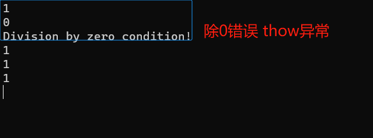
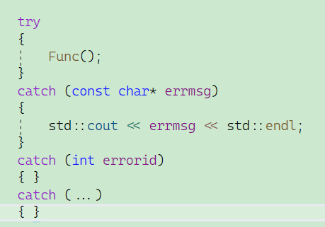
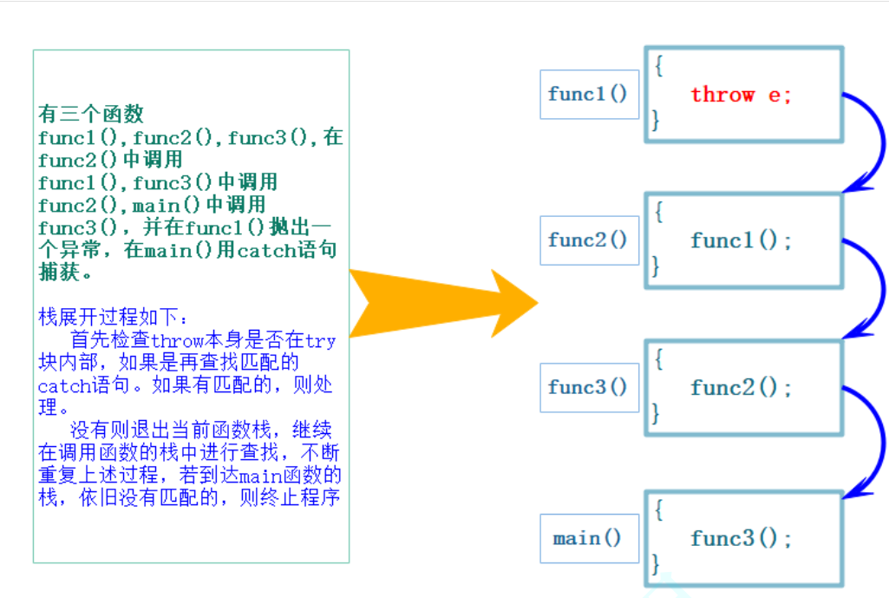
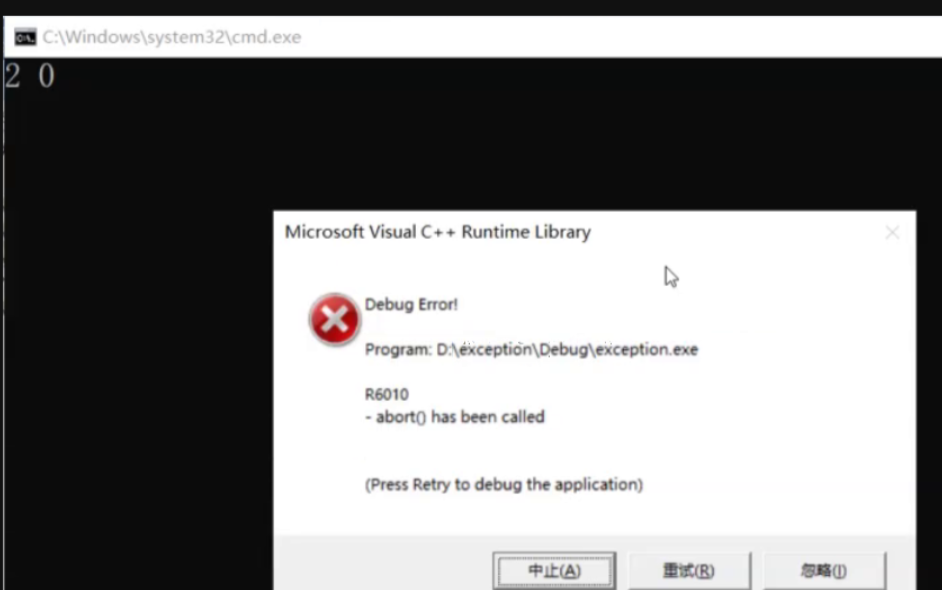
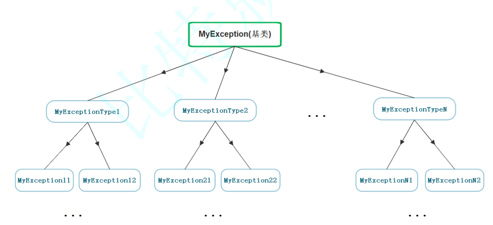
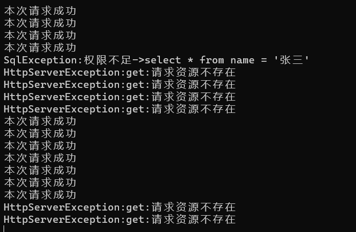
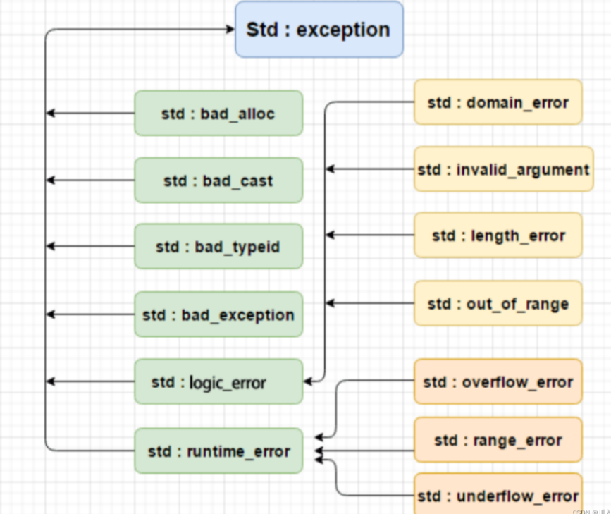
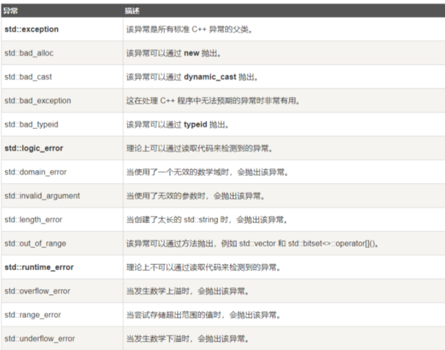

# 异常

## 目录

-   [1. C语言传统的处理错误的方式](#1-C语言传统的处理错误的方式)
-   [2.  C++异常概念](#2--C异常概念)
-   [3. 异常的使用](#3-异常的使用)
    -   [3.1异常的抛出和捕获](#31异常的抛出和捕获)
    -   [3.2 异常的重新抛出](#32-异常的重新抛出)
    -   [3.3 异常安全](#33-异常安全)
    -   [3.4 异常规范（C++期望）](#34-异常规范C期望)
-   [4. C++标准库的异常体系](#4-C标准库的异常体系)
-   [5. 异常的优缺点](#5-异常的优缺点)
    -   [总结](#总结)

# 1. C语言传统的处理错误的方式

**传统的错误处理机制：**

1.  终止程序，如assert，缺陷：用户难以接受。如发生内存错误，除0错误时就会终止程序。
2.  返回错误码，缺陷：需要程序员自己去查找对应的错误。如系统的很多库的接口函数都是通过把错误码放到errno中，表示错误.

实际中C语言基本都是使用返回错误码的方式处理错误，部分情况下使用终止程序处理非常严重的错误。

但是返回错误码是有缺陷的，尤其是一些复杂的场景，因为错误的形式太多，所以错误码一个数字很难搞清楚。所以面向对象的语言就不想使用 —— C++就用异常解决。

***

# 2.  C++异常概念

异常是一种处理错误的方式，**当一个函数发现自己无法处理的错误时就可以抛出异常，让函数的直接或间接的调用者处理这个错误**。

-   throw：当问题出现时，程序会抛出一个异常。这是通过使用 throw 关键字来完成的。
-   catch：在您想要处理问题的地方，通过异常处理程序捕获异常.catch 关键字用于捕获异常，可以有多个catch进行捕获。
-   try：try 块中的代码标识将被激活的特定异常,它后面通常跟着一个或多个 catch 块。

如果有一个块抛出一个异常，捕获异常的方法会使用 try 和 catch 关键字。try 块中放置可能抛出异常的代码，try 块中的代码被称为保护代码。使用 try/catch 语句的语法如下所示：

```c++
try
{
  // 保护的标识代码
}
catch (ExceptionName e1)
{
  // catch 块
}
catch (ExceptionName e2)
{
  // catch 块
}
catch (ExceptionName eN)
{
  // catch 块
}
```

try

{

// 保护的标识代码

}

catch (ExceptionName e1)

{

// catch 块

}

catch (ExceptionName e2)

{

// catch 块

}

catch (ExceptionName eN)

{

// catch 块

}

-   **如此就会更直观一些，无需再去查错误码表。**
    ```c++
    #include <iostream>
    #include <string>

    double Division(int a, int b)
    {
        // 当b == 0时抛出异常
        if (b == 0)
            throw "Division by zero condition!"; // 异常不是一层一层的返，而是直接到捕捉异常的地方。
        else
            return ((double)a / (double)b);
    }

    void Func()
    {
        int len, time;
        std::cin >> len >> time;
        std::cout << Division(len, time) << std::endl;
    }

    int main()
    {
        while (1)
        {
            try
            {
                Func();
            }
            // 如果是正常走就，直接跳过catch，只有抛异常才会跳到对应的catch
            catch (const char* errmsg)
            {
                std::cout << errmsg << std::endl;
            }
        }
        system("pause");
        return 0;
    }
    ```
    

    &#x20; 异常是由throw引发的，throw可以抛出一个异常对象，throw一个异常后可以直接跳到catch。可以理解为：throw与catch的关系如同传参，throw就像实参，catch接收成形参。

# 3. 异常的使用

## 3.1**异常的抛出和捕获**

**异常的抛出和匹配原则**

> **1.** 异常是通过**抛出对象而引发**的，该**对象的类型**决定了应该激活哪个catch的处理代码。
>
> 因为catch是允许多份的，用于匹配不同的类型
>
> 

Note：

**1.** **抛异常可以抛任意类型对象。**

**2.** **捕获时，要求类型匹配。**

> **2.** 被**选中的处理代码**是调用链中**与该对象类型匹配且离抛出异常位置最近**的那一个。
>
> 

**Note：**



&#x20;   异常是必须被捕获的，不捕获是很严重的，相当于直接终止掉程序，终止程序是最最最严重的处理方式。

比如：一个APP点开一个信息，然后其因为某些原因没有获取到，然后其就给我们报一个错，如：网络链接问题（弹窗）。这个是能接受的，关掉这个程序还在运行。但是出现问题直接程序崩溃，APP直接终止，这就是让人没办法接受的事情的了。

所以，为了出现类似的异常未捕捉的情况，在最后加了一个保险。因为异常的捕捉是有要求的 **——** 类型必须匹配。

> **3.****catch(...)可以捕获任意类型的异常，问题是不知道异常错误是什么。** 否则当有异常没捕获，程序就会直接终止。
>
> ```c++
> int main()
> {
>     try
>     {
>         Func();
>     }
>     catch (const char* errmsg)
>     {
>         std::cout << errmsg << std::endl;
>     }
>     // 程序出现某一个错误的时候，都能正常运行 —— 提高了程序健壮性
>     // 程序出现问题，但是其他功能还能继续跑
>     catch (...) // 终结的捕获 —— 捕获任意类型的异常（防止出现未捕获异常时，程序终止）
>     {
>         std::cout << "unkown exception" << std::endl; // 缺点：不知道捕获的是什么
>     }
>     return 0;
> }
> ```

**Note：**

语法规定：捕获异常不能用模板

> **4.** 抛出异常对象后，会生成一个异常对象的拷贝，因为抛出的异常对象可能是一个临时对象，所以会生成一个拷贝对象，这个拷贝的临时对象会在被catch以后销毁。（这里的处理类似于函数的传值返回）,所以捕获列表中捕获到的不是异常本身。

-   **异常报错的规范讲究使用：**

    &#x20; 使用类将错误码和错误信息一同封装。
    ```c++
    #include <iostream>
    #include <string>

    class Exception
    {
    public:
      Exception(const std::string& errmsg, int id)
        :_errmsg(errmsg)
        , _errid(id)
      {}

      virtual std::string what() const
      {
        return _errmsg;
      }

      int GetErrid()
      {
        return _errid;
      }

    protected:
      std::string _errmsg;
      int _errid;
    };

    double Division(int a, int b)
    {
      // 当b == 0时抛出异常
      if (b == 0)
      {
        Exception e("除0错误", 1);   // 局部对象，出作用域即销毁 
        throw e;
      }
      else
        return ((double)a / (double)b);
    }

    void Func1()
    {
      int len, time;
      std::cin >> len >> time;
      std::cout << Division(len, time) << std::endl;
    }

    // 1、抛异常可以抛任意类型对象
    // 2、捕获时，要求类型匹配
    int main()
    {
      while (1)
      {
        try
        {
          Func1();
        }
        catch (const Exception& e) // 此处捕获的是拷贝构造的临时对象 -- catch走完才销毁
        {
          std::cout << e.what() << std::endl;
        }
        catch (...) // 捕获任意类型的异常 -- 防止出现未捕获异常时，程序终止
        {
          std::cout << "未知异常" << std::endl;
        }
      }

      return 0;
    }
    ```

> **5.** 实际中抛出和捕获的匹配原则有个例外，并不都是类型完全匹配，**可以抛出的派生类对象，使用基类捕获，这个在实际中非常实用**。

因为，如果在很大的项目，有很多人，每个人都各抛各的异常，捕获异常的地方就会苦不堪言。所以使用可以抛出的派生类（子类）对象，使用基类（父类）捕获。

实际使用中很多公司都会自定义自己的异常体系进行规范的异常管理，因为一个项目中如果大家随意抛异常，那么外层的调用者基本就没办法玩了，所以实际中都会定义一套继承的规范体系。这样大家抛出的都是继承的派生类对象，捕获一个基类就可以了 —— 自定义异常体系



一般都是设计一个Exception的基类，可以抛这个基类，也可以抛它的派生类。其他地方要求必须类型和类型匹配，这个地方允许抛派生类对象，用基类捕获。这也就意味着设计出一个基类后，公司里的不管项目多大，有多少人，只要大家按规范。抛的类型要加任何东西都可以，但是又唯一一个要求，就是你继承了这个基类。这个时候我们只要**捕捉这个基类就全部达到目的**了。

```c++
#include <iostream>
#include <string>

// 服务器开发中通常使用的异常继承体系
class Exception
{
public:
    Exception(const std::string& errmsg, int id)
        : _errmsg(errmsg), _id(id)
    {
    }

    virtual std::string what() const
    {
        return _errmsg;
    }

    int getid() const
    {
        return _id;
    }

protected:
    std::string _errmsg; // 错误信息
    int _id;             // 错误码
};

class SqlException : public Exception // 数据库层的错误
{
public:
    SqlException(const std::string& errmsg, int id, const std::string& sql)
        : Exception(errmsg, id), _sql(sql)
    {
    }

    virtual std::string what() const
    {
        std::string str = "SqlException:";
        str += _errmsg;
        str += "->";
        str += _sql;

        return str;
    }

protected:
    const std::string _sql;
};

class HttpServerException : public Exception // 网络层的错误
{
public:
    HttpServerException(const std::string& errmsg, int id, const std::string& type)
        : Exception(errmsg, id), _type(type)
    {}

    virtual std::string what() const
    {
        std::string str = "HttpServerException:";
        str += _type;
        str += ":";
        str += _errmsg;

        return str;
    }

private:
    const std::string _type;
};

// 模拟 — 数据库
void SQLMgr()
{
    srand(time(0));
    if (rand() % 7 == 0)
    {
        throw SqlException("权限不足", 100, "select * from name = '张三'"/*带上数据，方便理解*/);
    }

    std::cout << "本次请求成功" << std::endl;
}

// 模拟 - 网络
void HttpServer()
{
    // ...
    srand(time(0));
    if (rand() % 3 == 0)
    {
        throw HttpServerException("请求资源不存在", 100, "get"/*带上操作，方便理解*/);
    }
    else if (rand() % 4 == 0)
    {
        throw HttpServerException("权限不足", 101, "post"/*带上操作，方便理解*/);
    }

    // 网络没有问题 - 进入数据库
    SQLMgr();
}


int main()
{
    while (true)
    {
        sleep(1);
        try
        {
            HttpServer();
        }
        // 不管哪一类类型，Exception都能兜得住，因为Exception基类。
        catch (const Exception& e) // 这里捕获父类对象就可以（传父类可以捕获到，传子类也可以捕获到）
        {
            // 多态 - 抛子类调子类，抛父类调父类。
            // 这个父类引用（指针）指向谁，就会调用谁的虚函数
            std::cout << e.what() << std::endl;
            // 因为按原理来说：是运行时候，到指向的对象的虚表里面去找对应的虚函数，而对应的子类对象的\
            虚表都被重写了,虚表都被覆盖成自己重写的那个虚函数。
        }
        catch (...) // 防止，抛的异常不是Exception的派生类 / Exception -- 必须有。
        {
            std::cout << "Unkown Exception" << std::endl;
        }
    }
    return 0;
}
```



-   **总结：在函数调用链中异常栈展开匹配原则**
    -   首先检查throw本身是否在try块内部，如果是再查找匹配的catch语句。如果有匹配的，则调到catch的地方进行处理。
    -   没有匹配的catch则退出当前函数栈，继续在调用函数的栈中进行查找匹配的catch。
    -   如果到达main函数的栈，依旧没有匹配的，则终止程序。上述这个沿着调用链查找匹配的catch子句的过程称为栈展开。所以实际中我们最后都要加一个catch(...)捕获任意类型的异常，否则当有异常没捕获，程序就会直接终止。
    -   找到匹配的catch子句并处理以后，会继续沿着catch子句后面继续执行。

***

## 3.2 异常的重新抛出

有可能单个的catch不能完全处理一个异常，在进行一些校正处理以后，希望再交给更外层的调用链函数来处理，catch则可以通过重新抛出将异常传递给更上层的函数进行处理。

希望将一个抛异常的错误，重试多次。比如此处的重试三次：

```c++
#include <iostream>
#include <string>
#include <unistd.h>
 
// 服务器开发中通常使用的异常继承体系
class Exception
{
public:
    Exception(const std::string &errmsg, int id)
        : _errmsg(errmsg), _id(id)
    {
    }
 
    virtual std::string what() const
    {
        return _errmsg;
    }
 
    int getid() const
    {
        return _id;
    }
 
protected:
    std::string _errmsg; // 错误信息
    int _id;             // 错误码
};
 
class HttpServerException : public Exception // 网络层的错误
{
public:
    HttpServerException(const std::string &errmsg, int id, const std::string &type)
        : Exception(errmsg, id), _type(type)
    {}
 
    virtual std::string what() const
    {
        std::string str = "HttpServerException:";
        str += _type;
        str += ":";
        str += _errmsg;
 
        return str;
    }
 
private:
    const std::string _type;
};
 
void SeedMsg(const std::string& s)
{
  // 要求出现网络错误重试三次
  srand(time(0));
  if (rand() % 3 == 0)
  {
    throw HttpServerException("网络错误", 100, "get");
  }
  else if (rand() % 4 == 0)
  {
    throw HttpServerException("权限不足", 101, "post");
  }
 
  std::cout << "发送成功:" << s << std::endl;
}
 
void HttpServer()
{
  // 要求出现网络错误，重试3次
  std::string str = "访问一个文件可以吗？"; // 我们的输入
  //cin >> str;
 
  int n = 3;
  while (n--)
  {
    try
    {
      SeedMsg(str); // 将异常截胡了
 
      // 没有发生异常
      break;
    }
    catch (const Exception& e)
    {
      // 网络错误，且重试3次内。（100：网络错误对应的错误码）
      if (e.getid() == 100 && n > 0)
      {
        continue;
      }
      else
      {
        throw e; // 3次过后还抛异常，或其他错误，直接重新抛出。
      }
    }
  }
}
 
int main()
{
  while (true)
  {
    //this_thread::sleep_for(chrono::seconds(1));
    sleep(1);
 
    try
    {
      HttpServer();
    }
    catch (const Exception& e) // 这里捕获父类对象就可以
    {
      // 多态
      std::cout << e.what() << std::endl;
      // 记录日志
    }
    catch (...)
    {
      std::cout << "Unkown Exception" << std::endl;
    }
  }
 
  return 0;
}
```

-   抛异常可能会导致[内存泄漏](https://so.csdn.net/so/search?q=内存泄漏\&spm=1001.2101.3001.7020 "内存泄漏")，毕竟不会执行捕捉抛异常的后续代码。
    ```c++
    #include <iostream>
    #include <string>
    #include <unistd.h>
     
    double Division(int a, int b)
    {
        // 当b == 0时抛出异常
        if (b == 0)
        {
            throw "Division by zero condition!";
        }
        return (double)a / (double)b;
    }
    void Func()
    {
        int *array = new int[10];
     
        int len, time;
        std::cin >> len >> time;
        std::cout << Division(len, time) << std::endl; // 抛异常会直接到main函数，导致后续的delete未执行
     
        // 由于上面抛异常，所以不会执行，导致内存泄漏
        std::cout << "delete []" << array << std::endl;
        delete[] array;
    }
    int main()
    {
        try
        {
            Func();
        }
        catch (const char *errmsg)
        {
            std::cout << errmsg << std::endl;
        }
        return 0;
    }
    ```
-   于是通过异常的重新抛出解决。
    ```c++
    #include <iostream>
    #include <string>
    #include <unistd.h>
     
    double Division(int a, int b)
    {
        // 当b == 0时抛出异常
        if (b == 0)
        {
            throw "Division by zero condition!";
        }
        return (double)a / (double)b;
    }
    void Func()
    {
     
        // 这里可以看到如果发生除0错误抛出异常，另外下面的array没有得到释放。
        // 所以这里捕获异常后并不处理异常，异常还是交给外面处理，这里捕获了再
        // 重新抛出去。
        int *array = new int[10];
        try
        {
            int len, time;
            std::cin >> len >> time;
            std::cout << Division(len, time) << std::endl;
        }
        catch (...)
        {
            std::cout << "delete []" << array << std::endl;
            delete[] array;
     
            throw;  // 捕获什么抛出什么 
        }
     
        std::cout << "delete []" << array << std::endl;
        delete[] array;
    }
     
    int main()
    {
        try
        {
            Func();
        }
        catch (const char *errmsg)
        {
            std::cout << errmsg << std::endl;
        }
        return 0;
    }
    ```

## 3.3 异常安全

-   构造函数完成对象的构造和初始化，最好不要在构造函数中抛出异常，否则可能导致对象不完整或没有完全初始化。

    比如一个类，有5个成员变量，如果在初始化第3个成员变量后，调用了一个函数，导致出现了抛异常，而会使得后面2个成员函数没有初始化。
-   析构函数主要完成资源的清理，最好不要在析构函数内抛出异常，否则可能导致资源泄漏(内存泄漏、句柄未关闭等)。

    与构造同样的道理，在未清理完时，因为调用一个函数导致抛异常，而导致的还有成员没有清理完。
-   C++中异常经常会导致资源泄漏的问题，比如在new和delete中抛出了异常，导致内存泄漏，在lock和unlock之间抛出了异常导致死锁，C++经常使用RAII来解决以上问题。（智能指针的核心原理）。

***

## 3.4 **异常规范（C++期望）**

1.  异常规格说明的目的是为了让函数使用者知道该函数可能抛出的异常有哪些。 可以在函数的后面接throw(类型)，列出这个函数可能抛掷的所有异常类型。
2.  函数的后面接throw()，表示函数不抛异常。
3.  若无异常接口声明，则此函数可以抛掷任何类型的异常。

```c++
// C++98
// 这里表示这个函数会抛出A/B/C/D中的某种类型的异常
void fun() throw(A，B，C，D);
// 如：这里表示这个函数只会抛出bad_alloc的异常
void* operator new (std::size_t size) throw (std::bad_alloc);
// 如：这里表示这个函数不会抛出异常
void* operator delete (std::size_t size, void* ptr) throw();
 
 
// C++11 中新增的noexcept，表示不会抛异常
thread() noexcept;
thread (thread&& x) noexcept;
```

***

# 4. C++标准库的异常体系

C++ 提供了一系列标准的异常，定义在中，我们可以在程序中使用这些标准的异常。它们是以父子类层次结构组织起来的，如下所示：

[https://legacy.cplusplus.com/reference/exception/exception/?kw=exception](https://legacy.cplusplus.com/reference/exception/exception/?kw=exception "https://legacy.cplusplus.com/reference/exception/exception/?kw=exception")





**说明**：实际中我们可以可以去继承exception类实现自己的异常类。但是实际中很多公司像上面一样自己定义一套异常继承体系。因为C++标准库设计的不够好用。

```c++
#include <vector>
#include <iostream>
#include <exception>
 
int main()
{
    try
    {
        std::vector<int> v(10, 5);
        // 这里如果系统内存不够也会抛异常
        v.reserve(1000000000);
        // 这里越界会抛异常
        v.at(10) = 100;
    }
    catch (const std::exception &e) // 这里捕获父类对象就可以
    {
        std::cout << e.what() << std::endl;
    }
    catch (...)
    {
        std::cout << "Unkown Exception" << std::endl;
    }
    return 0;
}
```

***

# 5. 异常的优缺点

-   **C++异常的优点**
    1.  异常对象定义好了，相比错误码的方式可以清晰准确的展示出错误的各种信息，甚至可以包含堆栈调用的信息，这样可以帮助更好的定位程序的bug。
    2.  返回错误码的传统方式有个很大的问题就是，在函数调用链中，深层的函数返回了错误，那么我们得层层返回错误，最外层才能拿到错误。而使用异常就可以直接到接受抛异常的位置。
        ````c++
        // 1.下面这段伪代码我们可以看到ConnnectSql中出错了，先返回给ServerStart，
        // ServerStart再返回给main函数，main函数再针对问题处理具体的错误。 
         // 2.如果是异常体系，不管是ConnnectSql还是ServerStart及调用函数出错，都不用检查，因为抛出的异常异常会直接跳到main函数中catch捕获的地方，main函数直接处理错误。 
        int ConnnectSql()
        {
            // 用户名密码错误
            if (...)
                return 1;
            // 权限不足
            if (...)
                return 2;
        }
        int ServerStart() {
            if (int ret = ConnnectSql() < 0)
                return ret;
            int fd = socket()
                if（fd < 0）
                return errno;
        }
        int main()
        {
            if (ServerStart() < 0)
                ...
                return 0;

        }
        ```
        ````
    3.  很多的第三方库都包含异常，比如boost、gtest、gmock等等常用的库，那么我们使用它们也需要使用异常。
    4.  部分函数使用异常更好处理，比如构造函数没有返回值，不方便使用错误码方式处理。比如：T& operator这样的函数，如果pos越界了只能使用异常或者终止程序处理，没办法通过返回值表示错误。
-   **C++异常的缺点**

第一个缺点才是麻烦，其他的可以算半个。

-   常会导致程序的执行流乱跳，并且非常的混乱，并且是运行时出错抛异常就会乱跳。这会导致我们跟踪调试时以及分析程序时，比较困难。
-   异常会有一些性能的开销。当然在现代硬件速度很快的情况下，这个影响基本忽略不计。

    &#x20;  毕竟是返回一个对象，原来是只用返回一个错误码。
-   C++没有垃圾回收机制，资源需要自己管理。有了异常非常容易导致内存泄漏、死锁等异常安全问题。这个需要使用RAII来处理资源的管理问题。学习成本较高。
-   C++标准库的异常体系定义得不好，导致大家各自定义各自的异常体系，非常的混乱。
-   异常尽量规范使用，否则后果不堪设想，随意抛异常，外层捕获的用户苦不堪言。所以异常规范有两点：
    1.  抛出异常类型都继承自一个基类。
    2.  **函数是否抛异常、抛什么异常，都使用 func() throw();的方式规范化。**（由于历史的C语言的原因，所以规范是不是强制的）

***

#### **总结**

异常总体而言，利大于弊，所以工程中我们还是鼓励使用异常的。另外OO的语言基本都是用异常处理错误，这也可以看出这是大势所趋。
