# 智能指针

## 目录

-   [为什么需要智能指针？](#为什么需要智能指针)
-   [RAII](#RAII)
    -   [智能指针的原理   ](#智能指针的原理---)
-   [auto\_ptr](#auto_ptr)
    -   [模拟实现 auto\_ptr](#模拟实现-auto_ptr)
-   [unique\_ptr](#unique_ptr)
    -   [模拟下实现unique\_ptr](#模拟下实现unique_ptr)
-   [shared\_ptr](#shared_ptr)
    -   [shared\_ptr模拟实现](#shared_ptr模拟实现)
    -   [shared\_ptr的循环引用](#shared_ptr的循环引用)
    -   [wake\_ptr 模拟实现](#wake_ptr-模拟实现)
-   [删除器](#删除器)
    -   [模拟实现](#模拟实现)
-   [C++11和boost中智能指针的关系](#C11和boost中智能指针的关系)

# 为什么需要智能指针？

```c++
#include <iostream>
#include <stdexcept>
 
int div()
{
    int a, b;
    std::cin >> a >> b;
    if (b == 0)
        throw std::invalid_argument("除0错误");
    return a / b;
}
 
void Func()
{
     // 1、如果p1这里new 可能会抛异常。
    // 2、如果p2这里new 可能会抛异常。
    // 3、如果div调用也可能会抛异常。 
    int *p1 = new int;
    int *p2 = new int;
    std::cout << div() << std::endl;
    delete p1;
    delete p2;
}
 
int main()
{
    try
    {
        Func();
    }
    catch (std::exception &e)
    {
        std::cout << e.what() << std::endl;
    }
    return 0;
}
```

在一异常中，因为异常会导致程序的执行流乱跳，所以很多个会出现异常的代码，放在一起就很容易其中一个抛异常，而导致其余的未执行 / 需要释放的空间未释放。如上：p2出问题，需要释放p1，div出问题，需要释放p1、p2，智能指针就是用来解决这个问题。

***

# RAII

RAII（Resource Acquisition Is Initialization - 获取资源即初始化）是一种利用对象生命周期来控制程序资源（如内存、文件句柄、网络连接、互斥量等等）的简单技术。资源：需要手动释放的。（RAII：请求到志愿就初始化）

**初始化指的是：** &#x20;

> 调用一个其他类的构造函数，利用其他类的生命周期来进行管理。

&#x20;     **在对象构造时获取资源**，接着控制对资源的访问使之在对象的生命周期内始终保持有效，最后在

对象析构的时候释放资源。借此，我们实际上把管理一份资源的责任托管给了一个对象。这种做

法有两大好处：

> 就是在获取到资源的时候，交给一个对象管理，于是在该对象的生命周期里这个资源始终有效。而这个对象无论如何是异常还是正常结束，都会调用这个对象的析构函数，于是利用这个对象的析构函数释放资源。

-   不需要显式地释放资源。
-   采用这种方式，对象所需的资源在其生命期内始终保持有效

## 智能指针的原理  &#x20;

-   **最基础的智能指针：**

```c++
// 使用RAII思想设计的SmartPtr类
template <class T>
class SmartPtr
{
public:
    SmartPtr(T *ptr = nullptr) // 将资源给智能指针
        : _ptr(ptr) // 智能指针将资源保存
    {}
    
    ~SmartPtr()
    {
        if (_ptr)
            delete _ptr;
    }
 
private:
    T *_ptr;
};
```

上述的SmartPtr还不能将其称为智能指针，因为它还不具有指针的行为。指针可以解引用，也可以通过 **"->"** 去访问所指空间中的内容，因此：**智能指针模板类中还得需要将** **" \*"** **、** **"->"** **重载下，才可让其像指针一样去使用**。

```c++
#include <iostream>
#include <stdexcept>
 
// 1、利用RAII思想设计delete资源的类
// 2、像指针一样的行为
template<class T>
class SmartPtr
{
public:
  SmartPtr(T* ptr) // 将资源给智能指针
    :_ptr(ptr) // 智能指针将资源保存
  {}
 
  ~SmartPtr()
  {
    cout << "delete:" << _ptr << endl;
    delete _ptr;
  }
 
  T& operator*()
  {
    return *_ptr;
  }
 
  T* operator->()
  {
    return _ptr;
  }
 
private:
  T* _ptr;
};
 
int div()
{
    int a, b;
    std::cin >> a >> b;
    if (b == 0)
        throw std::invalid_argument("除0错误");
    return a / b;
}
void Func()
{
    // sp1、sp2出作用域会调用析构函数，抛异常，栈帧会正常结束
  SmartPtr<int> sp1(new int);
  SmartPtr<int> sp2(new int);
 
  *sp1 = 0;
  *sp2 = 2;
 
  std::cout << div() << std::endl;
}
 
int main()
{
  try
  {
    Func();
  }
  catch (std::exception& e)
  {
    std::cout << e.what() << std::endl;
  }
 
  return 0;
}
```

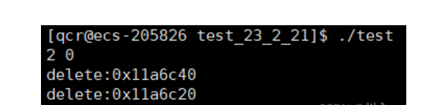

总结一下智能指针的原理：

1.  RAII特性
2.  重载operator\*和opertaor->，具有像指针一样的行为。

**Note：**

智能指针看起来很完美，但是又一个致命的问题：智能指针的拷贝问题。默认的拷贝构造只会进行浅拷贝，就会导致一个地址被析构两次。主要原因就是：[智能指针](https://so.csdn.net/so/search?q=智能指针\&spm=1001.2101.3001.7020 "智能指针")管理资源的释放。

**解决方案：**

> **深拷贝**
>
> &#x20; 不能，违背了智能指针的功能需求，需要的就是浅拷贝，智能指针不知道该空间有多大，只是对与指针的保存。

**（问题先保留看看C++库中的解决方式）**

***

# auto\_ptr

[http://www.cplusplus.com/reference/memory/auto\_ptr/](http://www.cplusplus.com/reference/memory/auto_ptr/ "http://www.cplusplus.com/reference/memory/auto_ptr/")

C++98版本的库中就提供了auto\_ptr的智能指针。下面演示的auto\_ptr的使用及问题。

auto\_ptr的实现原理：管理权转移的思想

```c++
#include <iostream>
#include <memory>
 
class A
{
public:
  ~A()
  {
    std::cout << "~A()" << std::endl;
  }
 
  int _a1 = 0;
  int _a2 = 0;
};
 
int main()
{
  std::auto_ptr<A> ap1(new A);
  ap1->_a1++;
  ap1->_a2++;
 
  std::auto_ptr<A> ap2(ap1);
  //ap1->_a1++;
  //ap1->_a2++;
 
  return 0;
}
```

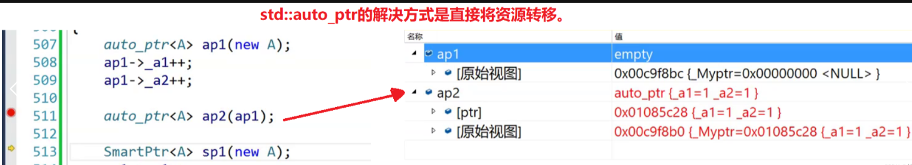

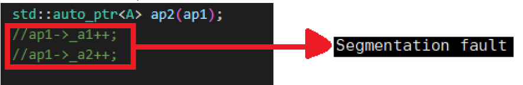

**总结：**

**std::auto\_ptr**是采用的资源管理权转移。但是，是不负责任的拷贝，会导致被拷贝对象悬空。所以多年以来被挂在耻辱柱上，很多公司明确要求不能使用它。

## 模拟实现 auto\_ptr

注意：不是交换 —— 是管理权的转移，所以如果是：

```c++
std::auto_ptr<A> ap1(new A);
std::auto_ptr<A> ap2(new A);
ap2 = ap1;
```

ap2是获取ap1的资源 **（资源管理权的转移）** ，ap2之前的资源自动调用析构释放，ap1置空 **（nullptr）**。

```c++
namespace cr
{
  template<class T>
  class auto_ptr 
  {
  public:
    auto_ptr(T* ptr = nullptr)
      : _ptr(ptr)
    {}
 
        // 不是交换 —— 是管理权的转移
        // 不是交换
    auto_ptr(auto_ptr<T>& ap)
      :_ptr(ap._ptr)
    {
      ap._ptr = nullptr;
    }
 
        // 不是交换 —— 是管理权的转移
    // ap1 = ap2;
    auto_ptr<T>& operator=(auto_ptr<T>& ap)
    {
      if (this != &ap)
      {
        if (_ptr)
        {
          cout << "Delete:" << _ptr << endl;
          delete _ptr;
        }
 
        _ptr = ap._ptr;
        ap._ptr = nullptr;
      }
 
      return *this;
    }
 
    ~auto_ptr()
    {
      if (_ptr)
      {
        cout << "Delete:" << _ptr << endl;
        delete _ptr;
      }
    }
 
    T& operator*()
    {
      return *_ptr;
    }
 
    T* operator->()
    {
      return _ptr;
    }
 
  private:
    T* _ptr;
  };
}
```

***

# unique\_ptr

-   C++11中开始提供更靠谱的unique\_ptr

[https://cplusplus.com/reference/memory/unique\_ptr/](https://cplusplus.com/reference/memory/unique_ptr/ "https://cplusplus.com/reference/memory/unique_ptr/")

-   unique\_ptr的 实现原理不让你拷贝 ，简单粗暴的防拷贝，下面简化模拟实现了一份UniquePtr来了解它的原理。**只适用于不需要拷贝的场景。**

***

unique\_ptr的实现原理：简单粗暴的防拷贝，

## 模拟下实现unique\_ptr

```c++

  template<class T>
  class unique_ptr
  {
  private: // 防止有人跑到类外实现写一个浅拷贝
 
    // 防拷贝 C++98 - 当时还是boost库中
    // 只声明不实现 
    // unique_ptr(unique_ptr<T>& ap);
    // unique_ptr<T>& operator=(unique_ptr<T>& ap);
  public:
    unique_ptr(T* ptr = nullptr)
      : _ptr(ptr)
    {}
 
    // 防拷贝 C++11
    unique_ptr(unique_ptr<T>& ap) = delete;
    unique_ptr<T>& operator=(unique_ptr<T>& ap) = delete;
 
    ~unique_ptr()
    {
      if (_ptr)
      {
        cout << "Delete:" << _ptr << endl;
        delete _ptr;
      }
    }
 
    T& operator*()
    {
      return *_ptr;
    }
 
    T* operator->()
    {
      return _ptr;
    }
 
  private:
    T* _ptr;
  };

```

# shared\_ptr

-   C++11中开始提供更靠谱的并且支持拷贝的shared\_ptr

[www.cplusplus.com/reference/memory/shared\_ptr/](http://www.cplusplus.com/reference/memory/shared_ptr/ "www.cplusplus.com/reference/memory/shared_ptr/")

***

## shared\_ptr模拟实现

-   **C++11中开始提供更靠谱的并且支持拷贝的shared\_ptr**

```c++
#include <memory>
#include <iostream>
 
class A
{
public:
  ~A()
  {
    std::cout << "~A()" << std::endl;
  }
 
  int _a1 = 0;
  int _a2 = 0;
};
 
void test_shared_ptr()
{
  std::shared_ptr<A> sp1(new A);
  std::shared_ptr<A> sp2(sp1);
 
  sp1->_a1++;
  sp1->_a2++;
 
  std::cout << sp2->_a1 << ":" << sp2->_a2 << std::endl;
    
  sp2->_a1++;
  sp2->_a2++;
 
  std::cout << sp1->_a1 << ":" << sp1->_a2 << std::endl;
}
 
int main()
{
    test_shared_ptr();
    return 0;
}
```

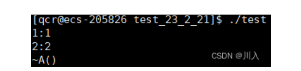

&#x20;**shared\_ptr的** **原理是通过引用计数的方式来实现多个shared\_ptr对象之间共享资源** 。例如： 学校老师晚上在下班之前都会通知，让最后走的学生记得把门锁下，并且打扫一下教室。

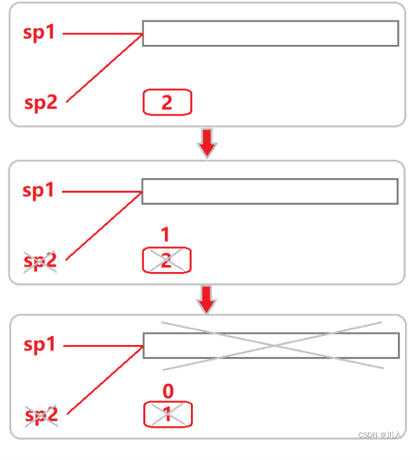

1.  shared\_ptr在其内部，给每个资源都维护了着一份计数，用来记录该份资源被几个对象共享。
2.  在对象被销毁时(也就是析构函数调用)，就说明自己不使用该资源了，对象的引用计数减一。
3.  如果引用计数是0，就说明自己是最后一个使用该资源的对象，必须释放该资源；
4.  如果不是0，就说明除了自己还有其他对象在使用该份资源，不能释放该资源，否则其他对象就成野指针了。

-   实现方法：使用一个指针来管理该类，不能用static静态成员，因为static静态成员变量只有一份

    不能用static修饰计数器，因为这样会让所有的模拟实现的shared\_ptr的不同类型的实例化，同用一个计数器。需要的是一个资源，配一个计数器，多个智能指针对象共管静态计数对象，所以资源都只有一个计数，因为静态成员属于整个类，属于类的所有对象。

    所以使用的是一个指针，这个时候这个指针指向的空间就是new出来的，使用构造函数new，这就保证了同一个资源，用一个计数器。并且这样这个指针就会指向需释放的资源，也指向了计数。

    即：每个资源需要管理的时候，会给构造函数，构造new一个计数。

```c++
namespace cr
{
  template<class T>
  class shared_ptr
  {
  public:
    shared_ptr(T* ptr = nullptr)
      : _ptr(ptr)
      , _pCount(new int(1))
    {}
 
        // 判断是否释放
    void Release()
    {
       // 减减被赋值对象的计数，如果是最后一个对象，要释放资源
       if (--(*_pCount) == 0)
      {
        cout << "Delete:" << _ptr << endl;
        delete _ptr;
        delete _pCount;
      }
    }
 
    ~shared_ptr()
    {
      Release();
    }
 
    // sp1(sp2)
    shared_ptr(const shared_ptr<T>& sp)
      : _ptr(sp._ptr)
      , _pCount(sp._pCount)
    {
      (*_pCount)++;
    }
 
    shared_ptr<T>& operator=(const shared_ptr<T>& sp)
    {
      //if (this != &sp)
      if (_ptr != s._ptr)
      {
          release();
    
          _ptr = s._ptr;
          _count = s._count;
          (*_count)++;
        }
        return *this;

    }
 
    T& operator*()
    {
      return *_ptr;
    }
 
    T* operator->()
    {
      return _ptr;
    }
 
  private:
    T* _ptr;
 
    // 引用计数
    int* _pCount;
  };
}
```

**shared\_ptr的问题：**

shared\_ptr看起来很完美，但是也有问题：

-   在多线程使用shared\_ptr的时候，shared\_ptr不是线程安全的。
-   **shared\_ptr存在一个循环引用的问题。**

***

## shared\_ptr的循环引用

```c++
#include <iostream>
#include <memory>
 
class Node
{
public:
    ~Node()
    {
        std::cout << "~Node" << std::endl;
    }
 
    int val = 0;
    std::shared_ptr<Node> _next;
    std::shared_ptr<Node> _prev;
};
 
void test_shared_ptr()
{
    std::shared_ptr<Node> s1(new Node);
    std::shared_ptr<Node> s2(new Node);
    
    s1->_next = s2;
    s2->_prev = s1;
}
 
int main()
{
    test_shared_ptr();
    return 0;
}
```

-   我们可以发现上面代码并没有像我们想象的一样，自动调用析构函数：

    

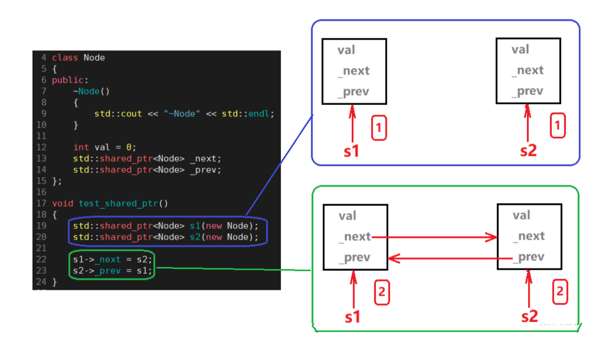

-   当下图的时候，是没有问题的，也就是对于[shared\_ptr](https://so.csdn.net/so/search?q=shared_ptr\&spm=1001.2101.3001.7020 "shared_ptr")智能指针的使用，shared\_ptr的计数器分别都++。

    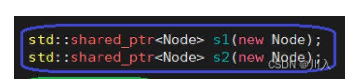
-   但是当继续向下执行的时候，就是问题的关键所在。

    
    -   此处：shared\_ptr类型的s1，经过operator ->的重载，于是变为(Node \*)->\_next = s2，此处Note中的\_next对象是shared\_ptr类型的，所以会调用s2中的智能指针的赋值。
    -   同理：会调用s1中的智能指针的赋值。
        
    -   于是s1与s2的计数器分别都++到了2。
-   **#问：通过以上为什么不会调用析构？**

    因为，根据函数的创建顺序，s2后构造所以先析构，s1先构造所以后析构。
    -   n2析构，计数减到1
    -   n1析构，计数减到1
        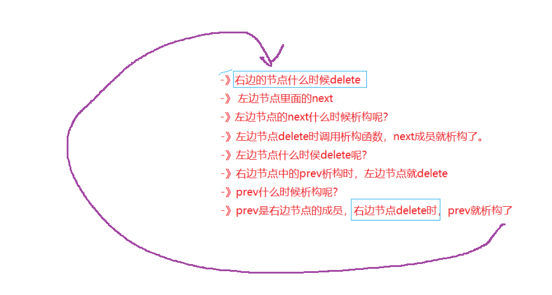
    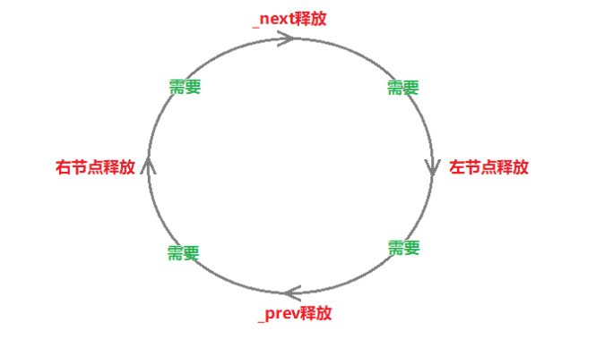
-   &#x20;这就是一个**死循环**，所以没有调用Node的析构函数，也就不可能看到Node类型对象的析构释放显示。
-   **解决方式：**
    -   这个地方想使用shared\_ptr进行Node类型的对象中类似的操作是把必定错的，没有办法，所以C++也为我们提供了一个新的方式：weak\_ptr（弱指针）
    -   weak\_ptr与其他的智能指针都不一样，其并不是常规智能指针，没有RAII，不支持直接管理资源。weak\_ptr主要用shared\_ptr构造，用来解决shared\_ptr循环引用问题。
        [https://legacy.cplusplus.com/reference/memory/weak\_ptr/?kw=weak\_ptr](https://legacy.cplusplus.com/reference/memory/weak_ptr/?kw=weak_ptr "https://legacy.cplusplus.com/reference/memory/weak_ptr/?kw=weak_ptr")

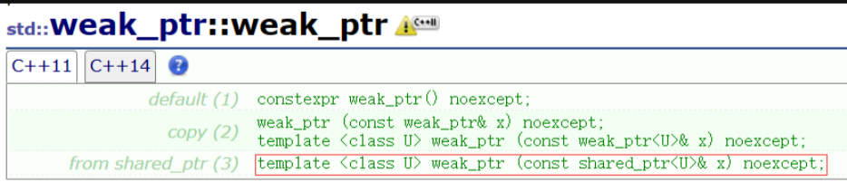

-   \*\*  主要用share\_ptr来构造自己，并不支持用一个资源构造自己，所以其并不支持RAII。\*\*​
-   **特点：** 不++share\_ptr的计数器。
    ```c++
    #include <iostream>
    #include <memory>
     
    class Node
    {
    public:
        ~Node()
        {
            std::cout << "~Node" << std::endl;
        }
     
        int val = 0;
        std::weak_ptr<Node> _next;
        std::weak_ptr<Node> _prev;
    };
     
    void test_shared_ptr()
    {
        std::shared_ptr<Node> s1(new Node);
        std::shared_ptr<Node> s2(new Node);
        
        s1->_next = s2;
        s2->_prev = s1;
    }
     
    int main()
    {
        test_shared_ptr();
        return 0;
    }
    ```
    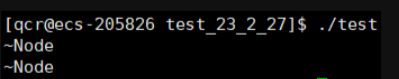
-   当 \_next 与 \_prev 是 weak\_ptr 的时候，它们不参加资源的释放管理，但是可以访问和修改数据，且并不增加计数，所以不会存在循环引用的问题了。**（这个方法可行，但是因为不计数，多以我们要识别到这个问题）**

**Note：**

想看到计数的对应变化，可以使用shared\_ptr的成员函数 **use\_count** 。

***

## wake\_ptr 模拟实现

-   **对于前面所模拟实现的****shared\_ptr****同样的也具有循环引用的问题。**
    ```c++
    template <class T>
    class myshared_ptr
    {
    public:
      myshared_ptr(T* ptr = nullptr)
        :_ptr(ptr)
        , _count(new int(1))
      {}

      myshared_ptr(const myshared_ptr<T>& s)
        :_ptr(s._ptr)
        , _count(s._count)
      {
        (*_count)++;
      }

      ~myshared_ptr()
      {
        release();
      }

      myshared_ptr<T>& operator=(myshared_ptr<T>& s)
      {
        //if (this != &sp)
        if (_ptr != s._ptr)
        {
          release();

          _ptr = s._ptr;
          _count = s._count;
          (*_count)++;
        }

        return *this;
      }

      T& operator*()
      {
        return *_ptr;
      }

      T* operator->()
      {
        return _ptr;
      }

    private:
      void release()
      {
        if (--(*_count) == 0)
        {
          cout << "delete" << " -> " << _ptr << endl;
          delete _ptr;
          delete _count;
        }
      }
      T* _ptr;
      int* _count;
    };

    struct ListNode
    {
      int val;
      myshared_ptr<ListNode> next;
      myshared_ptr<ListNode> prev;

      ~ListNode()
      {
        cout << "~ListNode()" << endl;
      }
    };

    void test_shared_ptr3()
    {
      myshared_ptr<ListNode> n1(new ListNode);
      myshared_ptr<ListNode> n2(new ListNode);
      
      // 循环引用
      n1->next = n2;
      n2->prev = n1;
    }

    int main()
    {
      test_shared_ptr3();
      system("pause");
    }
    ```

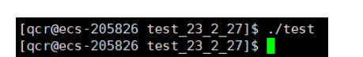

-   于是可以通过模拟实现weak\_ptr进行避免我们所模拟实现的shared\_ptr，出现循环引用的问题。

```c++
// 辅助型智能指针，使命配合解决shared_ptr循环引用问题
 
#include <iostream>
  template <class T>
  class shared_ptr
  {
  public:
      shared_ptr(T *ptr = nullptr) : _ptr(ptr), _pCount(new int(1)) {}
      // 判断是否释放
      void Release()
      {
          // 减减被赋值对象的计数，如果是最后一个对象，要释放资源
          if (--(*_pCount) == 0)
          {
              delete _ptr;
              delete _pCount;
          }
      }
      ~shared_ptr() { Release(); }
      // sp1(sp2)
      shared_ptr(const shared_ptr<T> &sp) : _ptr(sp._ptr), _pCount(sp._pCount) { (*_pCount)++; }
      
      shared_ptr<T> &operator=(const shared_ptr<T> &sp)
      {
          // 防止自己给自己赋值，导致计数--，出现内存泄漏
          if (_ptr == sp._ptr)
              return *this;
          // 判断是否释放 -- 防止_ptr原来的数据未计数--，导致内存泄漏
          Release();
          // 共管新资源，++计数
          _ptr = sp._ptr;
          _pCount = sp._pCount;
          (*_pCount)++;
          return *this;
      }
      
      
      T &operator*() { return *_ptr; }
      T *operator->() { return _ptr; }
      
      // 便于外部获取ptr，如weak_ptr
      T *get()const
      {
          return _ptr;
      }
  private:
      T *_ptr;
      // 引用计数
      int *_pCount;
  };
 
     // 辅助型智能指针，使命配合解决shared_ptr循环引用问题
     template <class T>
    class weak_ptr
    {
    public:
        weak_ptr()
            : _ptr(nullptr)
        {}
 
        weak_ptr(const shared_ptr<T> &sp)
            : _ptr(sp.get())
        {}
 
        weak_ptr(const weak_ptr<T> &wp)
            : _ptr(wp._ptr)
        {}
 
        weak_ptr<T>& operator=(const shared_ptr<T>& sp)
        {
            _ptr = sp.get();
            return *this;
        }
 
        T& operator*()
        {
            return *_ptr;
        }
 
        T* operator->()
        {
            return _ptr;
        }
 
    private:
        T *_ptr;
    };

 
class Node
{
public:
    ~Node() { std::cout << "~Node" << std::endl; }
 
    int val = 0;
 
    weak_ptr<Node> _next;
    weak_ptr<Node> _prev;
};
 
void test_shared_ptr()
{
    cr::shared_ptr<Node> s1(new Node);
    cr::shared_ptr<Node> s2(new Node);
    s1->_next = s2;
    s2->_prev = s1;
}
 
int main()
{
    test_shared_ptr();
    return 0;
}
```

-   wake\_ptr的模拟实现

```c++
// 辅助型智能指针，用于解决shared_ptr循环引用问题
template <class T>
class myweak_ptr
{
public:
    myweak_ptr()
        : _ptr(nullptr)
    {}

    // 从shared_ptr构造weak_ptr
    myweak_ptr(const shared_ptr<T>& sp)
        : _ptr(sp.get())
    {}

    // 拷贝构造函数
    myweak_ptr(const myweak_ptr<T>& wp)
        : _ptr(wp._ptr)
    {}

    // 从shared_ptr赋值给weak_ptr
    myweak_ptr<T>& operator=(const myshared_ptr<T>& sp)
    {
        _ptr = sp.get();
        return *this;
    }

    // 重载解引用运算符
    T& operator*()
    {
        return *_ptr;
    }

    // 重载箭头运算符
    T* operator->()
    {
        return _ptr;
    }

private:
    T* _ptr;     // 指向动态分配内存的指针
};

```

-   `weak_ptr`不是传统的智能智能了，不参与share\_ptr的引用计数.
    -   但是`weak_ptr` 有一个问题，如果`sharted_ptr`销毁了，weak\_ptr就会悬空。所有`weak_ptr`就出了一个 `expried`成员函数， 每次使用时都检查一下引用计数是否变成0。

        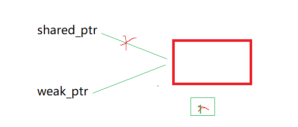

        

***

# 删除器

-   share\_ptr 如果new 一个\[]数组出来会崩溃，因为delte时不是\[] ，没有匹配使用.

```c++
struct ListNode
{
  int val;
  myweak_ptr<ListNode> next;
  myweak_ptr<ListNode> prev;

  ~ListNode()
  {
    cout << "~ListNode()" << endl;
  }
};

void Test()
{
  myshared_ptr<ListNode> sp1(new ListNode[10]);
}
```

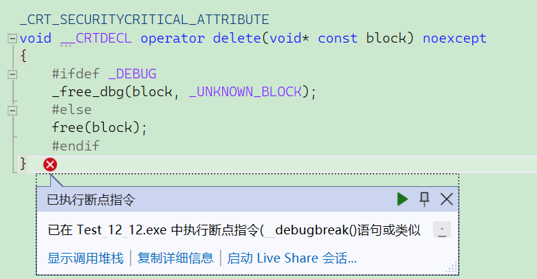

如果不是new出来的对象 或者 new\[] 和 malloc 如何通过智能指针管理呢？其实shared\_ptr设计了一个删除器来解决这个问题.

-   库里面的 可以这样使用（但是实现麻烦）我们简单实现一个简单的

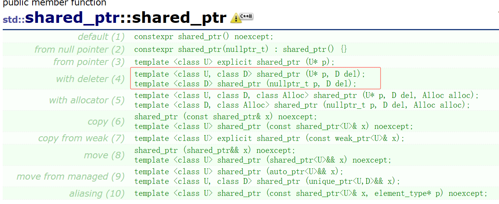

```c++
struct ListNode
{
  int val;
  myweak_ptr<ListNode> next;
  myweak_ptr<ListNode> prev;

  ~ListNode()
  {
    cout << "~ListNode()" << endl;
  }
};

template<class T>
struct DelArray
{
  void operator()(T* ptr)
  {
    delete[] ptr;
  }
};

void Test()
{
   // 定制删除器
 
   //1. 仿函数对象
   std::shared_ptr<ListNode> sp1(new ListNode[2], DelArray<ListNode>());

   //2. lambda
   std::shared_ptr<ListNode> sp2(new ListNode[2], [](ListNode* ptr){delete []ptr; });
  std::shared_ptr<FILE> sp3(fopen("test.cpp", "r"), [](FILE* fp){fclose(fp); });
  
  std::shared_ptr<ListNode> sp4(new ListNode);
}
```

-   模拟实现一个

***

## 模拟实现

```c++
#include<functional>

template <class T>
class myshared_ptr
{
public:
    myshared_ptr(T* ptr = nullptr)
        : _ptr(ptr)
        , _count(new int(1))
    {
    }

     //提供一个删除器的构造
     template <class D>
    myshared_ptr (T* ptr, D del )
        :_ptr(ptr)
        ,_count(new int(1))
        ,_del(del)
    {
    }

    // 拷贝构造函数，引用计数加1
    myshared_ptr(const myshared_ptr<T>& s)
        : _ptr(s._ptr)
        , _count(s._count)
    {
        (*_count)++;
    }

    ~myshared_ptr()
    {
        release();
    }

    // 赋值操作符重载，处理自赋值情况
    myshared_ptr<T>& operator=(myshared_ptr<T>& s)
    {
        if (_ptr != s._ptr)
        {
            release();

            _ptr = s._ptr;
            _count = s._count;
            (*_count)++;
        }

        return *this;
    }

    // 重载解引用运算符
    T& operator*()
    {
        return *_ptr;
    }

    // 重载箭头运算符
    T* operator->()
    {
        return _ptr;
    }

    // 获取原始指针
    T* get()const
    {
        return _ptr;
    }

private:
    // 释放资源，如果引用计数为0，则删除指针和计数
    void release()
    {
        if (--(*_count) == 0)
        {
            //cout << "delete: " << _ptr << endl;
            _del(_ptr);
            delete _count;
        }
    }

    T* _ptr;     // 指向动态分配内存的指针
    int* _count; // 引用计数
    function<void(T*)> _del = [](T* ptr) {delete ptr; }; //如果没有初始化，就使用缺省值 
};

// 辅助型智能指针，用于解决shared_ptr循环引用问题
template <class T>
class myweak_ptr
{
public:
    myweak_ptr()
        : _ptr(nullptr)
    {}

    // 从shared_ptr构造weak_ptr
    myweak_ptr(const shared_ptr<T>& sp)
        : _ptr(sp.get())
    {}

    // 拷贝构造函数
    myweak_ptr(const myweak_ptr<T>& wp)
        : _ptr(wp._ptr)
    {}

    // 从shared_ptr赋值给weak_ptr
    myweak_ptr<T>& operator=(const myshared_ptr<T>& sp)
    {
        _ptr = sp.get();
        return *this;
    }

    // 重载解引用运算符
    T& operator*()
    {
        return *_ptr;
    }

    // 重载箭头运算符
    T* operator->()
    {
        return _ptr;
    }

private:
    T* _ptr;     // 指向动态分配内存的指针
};


template<class T>
struct DelArray
{
  void operator()(T* ptr)
  {
    delete[] ptr;
  }
};

void Test2()
{
  // 定制删除器

  //1. 仿函数对象
  myshared_ptr<ListNode> sp1(new ListNode[2], DelArray<ListNode>());

  //2. lambda
  myshared_ptr<ListNode> sp2(new ListNode[2], [](ListNode* ptr) {delete[]ptr; });
  myshared_ptr<FILE> sp3(fopen("test.cpp", "r"), [](FILE* fp) {fclose(fp); });

  myshared_ptr<ListNode> sp4(new ListNode);
}

```

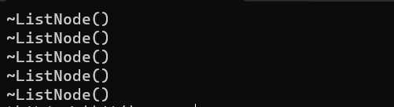

***

***

# C++11和boost中智能指针的关系

1.  C++ 98 中产生了第一个智能指针auto\_ptr.
2.  C++ boost给出了更实用的scoped\_ptr和shared\_ptr和weak\_ptr.
3.  C++ TR1，引入了shared\_ptr等。不过注意的是TR1并不是标准版。
4.  C++ 11，引入了unique\_ptr和shared\_ptr和weak\_ptr。需要注意的是unique\_ptr对应boost

的scoped\_ptr。并且这些智能指针的实现原理是参考boost中的实现的。

-   本节需掌握

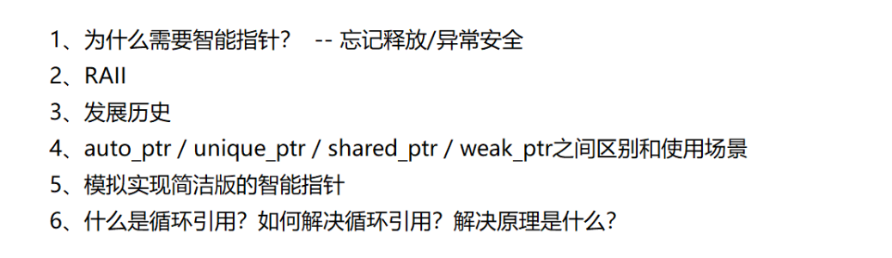

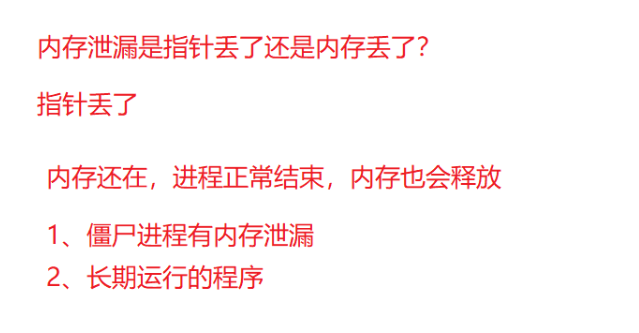

C++11库才更新智能指针实现

C++11出来之前，boost搞除了更好用的scoped\_ptr/shared\_ptr/weak\_ptr

C++11将boost库中智能指针精华部分吸收了过来

C++11->unique\_ptr/shared\_ptr/weak\_ptr

boost -- 探路者                     scoped\_ptr/shared\_ptr/weak\_ptr

C++11 -- 抄boost库的作业 unique\_ptr/shared\_ptr/weak\_ptr

***

-   需要掌握：
    -   为什么需要智能指针？

        主要的原因还是因为内存泄漏：忘记释放的问题，更重要还有异常安全的问题。
    -   RAII？

        资源获得，资源请求机立即初始化。指的就是把资源交给一个对象，利用构造将其资源交给一个对象去管理。
    -   发展历史

        auto\_ptr / unique\_ptr / shared\_ptr / weak\_ptr之间的区别与使用场景。
    -   模拟实现简洁版智能指针。

        什么是循环引用？如何解决循环引用？解决的原理是什么？
