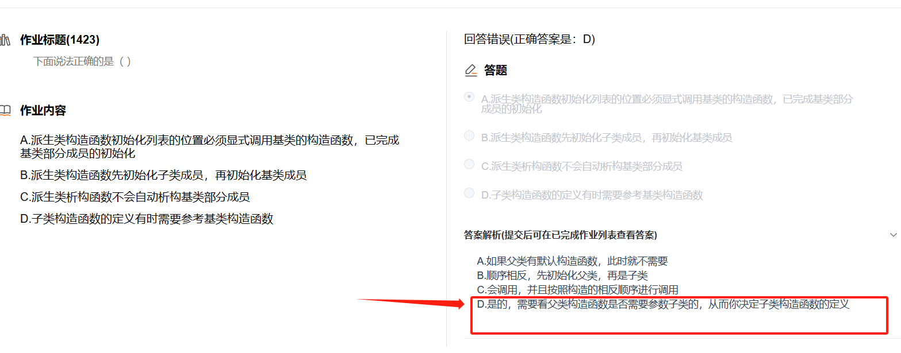

# 继承

## 目录

-   [1. 继承的概念及定义](#1-继承的概念及定义)
    -   [1.1继承的概念](#11继承的概念)
    -   [1.2 继承定义](#12-继承定义)
        -   [1.2.1定义格式](#121定义格式)
        -   [1.2.2继承关系和访问限定符](#122继承关系和访问限定符)
        -   [1.2.3继承基类成员访问方式的变化](#123继承基类成员访问方式的变化)
    -   [私有继承通常用于实现"实现细节"或"has-a"关系，即当派生类是基类的一种实现细节或私有组件时。](#私有继承通常用于实现实现细节或has-a关系即当派生类是基类的一种实现细节或私有组件时)
-   [2. 继承中的作用域](#2-继承中的作用域)
-   [3. 基类和派生类对象赋值转换](#3-基类和派生类对象赋值转换)
-   [4. 派生类的默认成员函数](#4-派生类的默认成员函数)
-   [5.继承与友元](#5继承与友元)
-   [6. 继承与静态成员](#6-继承与静态成员)
-   [7 如何定义一个不能被继承的类](#7-如何定义一个不能被继承的类)
-   [ 8. 练习](#-8-练习)
-   [9 复杂的菱形继承及菱形虚拟继承](#9-复杂的菱形继承及菱形虚拟继承)
    -   [总结](#总结)
-   [继承的总结和反思](#继承的总结和反思)
-   [10. 面试题](#10-面试题)
-   [思维导图](#思维导图)

# 1. 继承的概念及定义

-   **继承里面谁先继承就谁先声明**

## 1.1继承的概念

> 继承(inheritance)机制是面向对象程序设计使代码可以复用的最重要的手段，它允许程序员在保持原有类特性的基础上进行扩展，增加功能，这样产生新的类，称派生类。继承呈现了面向对象程序设计的层次结构，体现了由简单到复杂的认知过程。以前我们接触的复用都是函数复用，继承是类设计层次的复用


```c++
class Person
{
public:
  void Print()
  {
    cout << "name:" << _name << endl;
    cout << "age:" << _age << endl;
  }
  string _name = "peter"; // 姓名
  int _age = 18; // 年龄
};
 //继承后父类的Person的成员（成员函数+成员变量）都会变成子类的一部分。这里体现出了
//Student和Teacher复用了Person的成员。下面我们使用监视窗口查看Student和Teacher对象，可
//以看到变量的复用。调用Print可以看到成员函数的复用。 
class Student : public Person
{
protected:
  int _stuid; // 学号
};

class Teacher : public Person
{
protected:
  int _jobid; // 工号
};

int main()
{
  Student s;
  Teacher t;
  s._age = 18;
  s._name = "王伍";
  s.Print();

  t._age = 43;
  t._name = "刘老师";
  t.Print();
  system("pause");
  return 0;
}
```

***

## 1.2 继承定义

### 1.2.1定义格式

下面我们看到Person是父类，也称作基类。Student是子类，也称作派生类。


### 1.2.2继承关系和访问限定符


### 1.2.3继承基类成员访问方式的变化

| 类成员/继承方式       | public继承        | protected继承          | private继承          |
| -------------- | --------------- | -------------------- | ------------------ |
| 基类的public成员    | 派生类的public成员    | 派生类的protected成员      | 派生类的private&#xA;成员 |
| 基类的protected成员 | 派生类的protected成员 | 派生类的protected&#xA;成员 | 派生类的private&#xA;成员 |
| 基类的private成员   | 在派生类中不可见        | 在派生类中不可见             | 在派生类中不可见           |

\*\*protected/private  \*\*： 类外面不能访问类里面可以访问

\*\*不可见 \*\*： 隐身，类里面外面都无法访问

总结：

1.  **基类private成员在派生类中无论以什么方式继承都是**不可见的。这里的不可见是指基类的私

有成员还是被继承到了派生类对象中，但是语 法上限制派生类对象不管在类里面还是类外面都不能去访问它。

1.  基类private成员在派生类中是不能被访问，如果基类成员不想在类外直接被访问，但需要在

派生类中能访问，就定义为protected。可以看出保护成员限定符是因继承才出现的。

1.  实际上面的表格我们进行一下总结会发现，基类的私有成员在子类都是不可见。基类的其他

成员在子类的访问方式 == Min(成员在基类的访问限定符，继承方式)，**public > protected>private。**

1.  使用关键字class时默认的继承方式是private，使用struct时默认的继承方式是public，不过

最好显示的写出继承方式。

1.  在实际运用中一般使用都是public继承，几乎很少使用protetced/private继承，也不提倡

使用protetced/private继承，因为protetced/private继承下来的成员都只能在派生类的类里

面使用，实际中扩展维护性不强。


***

公有继承、私有继承和保护继承都可以访问基类的公有成员和保护成员，但它们之间有一些区别：

1.  公有继承（public inheritance）：
    -   公有继承是最常见的继承方式。派生类继承了基类的公有成员，这些成员在派生类内部和外部都是可见的。
    -   派生类对象可以被视为基类对象，可以传递给接受基类对象的函数或方法。
    -   基类的公有成员在派生类中仍然保持公有成员的访问权限。
2.  私有继承（private inheritance）：
    -   私有继承意味着派生类继承了基类的成员，但这些成员在派生类的外部是不可见的。
    -   派生类对象不能被视为基类对象，无法传递给接受基类对象的函数或方法。
    -   基类的公有和保护成员在派生类中变成了私有成员，只能在派生类内部访问。
    ## 私有继承通常用于实现"实现细节"或"has-a"关系，即当派生类是基类的一种实现细节或私有组件时。
3.  保护继承（protected inheritance）：
    -   保护继承类似于私有继承，派生类继承了基类的成员，但这些成员在派生类的外部是不可见的。
    -   派生类对象不能被视为基类对象，无法传递给接受基类对象的函数或方法。
    -   基类的公有和保护成员在派生类中变成了保护成员，只能在派生类内部和派生类的友元函数中访问。
    -   保护继承通常用于实现"实现细节"或"is-a"关系，即当派生类是基类的一种实现细节或私有组件，但仍然希望让派生类的子类访问这些成员。

继承关系的选择取决于程序的设计需求和语义。它们各自具有不同的访问控制级别和语义含义，应根据具体情况选择合适的继承方式。

1.  公有继承（public inheritance）：
    -   基类的公有成员（public members）在派生类中仍然是公有的。
    -   基类的保护成员（protected members）在派生类中变为保护的。
    -   基类的私有成员（private members）在派生类中无法直接访问。

下面是一个示例代码，演示了公有继承下基类成员的访问关系变化：

```c++
class Base {
public:
    int publicMember;
protected:
    int protectedMember;
private:
    int privateMember;
};

class Derived : public Base {
public:
    void accessBaseMembers() {
        publicMember = 1;       // 可以访问基类的公有成员
        protectedMember = 2;    // 可以访问基类的保护成员
        // privateMember = 3;   // 无法直接访问基类的私有成员
    }
};

int main() {
    Derived derivedObj;
    derivedObj.publicMember = 1;        // 可以访问基类的公有成员
    // derivedObj.protectedMember = 2;  // 无法直接访问基类的保护成员
    // derivedObj.privateMember = 3;    // 无法直接访问基类的私有成员

    return 0;
}
```

1.  私有继承（private inheritance）：
    -   基类的公有成员、保护成员和私有成员在派生类中都变为私有的。

下面是一个示例代码，演示了私有继承下基类成员的访问关系变化：

```c++
#include <iostream>

class Base {
public:
    int publicMember;
protected:
    int protectedMember;
private:
    int privateMember;
};

class Derived : private Base {
public:
    void accessBaseMembers() {
        publicMember = 1;       // 可以访问基类的公有成员
        protectedMember = 2;    // 可以访问基类的保护成员
        // privateMember = 3;   // 无法直接访问基类的私有成员
    }
};

int main() {
    Derived derivedObj;
    // derivedObj.publicMember = 1;        // 无法直接访问基类的公有成员
    // derivedObj.protectedMember = 2;     // 无法直接访问基类的保护成员
    // derivedObj.privateMember = 3;       // 无法直接访问基类的私有成员

    return 0;
}
```

1.  受保护继承（protected inheritance）：
    -   基类的公有成员和保护成员在派生类中变为保护的。
    -   基类的私有成员在派生类中无法直接访问。

下面是一个示例代码，演示了受保护继承下基类成员的访问关系变化：

```c++
class Base {
public:
    int publicMember;
protected:
    int protectedMember;
private:
    int privateMember;
};

class Derived : protected Base {
public:
    void accessBaseMembers() {
        publicMember = 1;       // 可以访问基类的公有成员
        protectedMember = 2;    // 可以访问基类的保护成员
        // privateMember = 3;   // 无法直接访问基类的私有成员
    }
};

int main() {
    Derived derivedObj;
    // derivedObj.publicMember = 1;        // 无法直接访问基类的公有成员
    // derivedObj.protectedMember = 2;     // 无法直接访问基类的保护成员
    // derivedObj.privateMember = 3;       // 无法直接访问基类的私有成员

    return 0;
}
```

**这些示例展示了不同继承关系下基类成员的访问关系变化。请注意，这些访问规则仅适用于在派生类中直接访问基类成员。通过派生类对象可以访问相应的继承成员，但无法直接访问基类的私有成员。**

-   子类对象中没有包含基类的私有成员  （错！！！）

    这句话不对。子类对象中包含基类的私有成员，但是无法直接访问这些私有成员。在继承关系中，子类会继承基类的所有成员，包括私有成员。私有成员在基类内部可见，只能在基类内部进行访问和操作。

    子类对象中包含基类的私有成员的作用是，它们在子类对象的内存布局中存在，并且会被合适地初始化和销毁，但是无法通过子类对象直接访问这些私有成员。

    子类可以通过继承基类的公有成员和受保护成员来访问和使用基类的私有成员。公有成员可以被子类对象直接访问，而受保护成员可以在子类的成员函数内访问。

    总结起来，子类对象中包含基类的私有成员，但是无法直接访问这些私有成员。可以通过继承基类的公有成员和受保护成员来间接访问和使用基类的私有成员。
    ```c++
    #include <iostream>

    class Base {
    private:
        int privateData;

    public:
        Base(int data) : privateData(data) {}

        void accessPrivateData() {
            std::cout << "Accessing private data from Base: " << privateData << std::endl;
        }
    };

    class Derived : public Base {
    public:
        Derived(int data) : Base(data) {}
    };

    int main() {
        Derived derived(10);
        derived.accessPrivateData(); // 通过公有成员函数间接访问基类的私有成员

        return 0;
    }
    ```
-   静态成员一定是不被包含在对象中的.

> 静态成员不会被包含在对象中，而是独立于对象存在的。静态成员属于类本身而不是类的对象，它在全局静态存储区分配内存，并在程序运行期间存在。静态成员在内存中只有一份拷贝，无论创建多少个类的对象，它们共享相同的静态成员。

***

# 2. 继承中的作用域

1.  在继承体系中基类和派生类都有独立的作用域。默认情况直接访问是子类的.
2.  子类和父类中有同名成员，子类同名成员隐藏父类同名成员，这种情况叫隐藏，也叫重定义。（在子类成员函数中，可以使用 基类::基类成员 显示访问）
3.  需要注意的是如果是成员函数的隐藏，只需要函数名相同就构成隐藏。不管参数和返回值
4.  注意在实际中在继承体系里面最好不要定义同名的成员。

```c++
//  Student的_num和Person的_num构成隐藏关系，可以看出这样代码虽然能跑，但是非常容易混淆 
class Person
{
protected:
  string _name = "小李子"; // 姓名
  int _num = 111; // 身份证号
};
class Student : public Person
{
public:
  void Print()
  {
    cout << " 姓名:" << _name << endl;
    cout << " 学号:" << _num << endl; //999  访问自己类的num 

    cout << " 身份证号:" << Person::_num << endl;  //111  访问基类的num 
  }
protected:
  int _num = 999; // 学号
};

int main()
{
  Student s1;
  s1.Print();
  system("pause");
}
```

\`

```c++
// 1、 两个fun构成函数重载？ -- 不对 函数重载要求在同一作用域 
// 2、 两个fun构成隐藏  -- ok 
 继承中，同名的成员函数，函数名相同就构成隐藏，不管参数和返回值 
class A
{
public:
  void fun()
  {
    cout << "func()" << endl;
  }
};

class B : public A
{
public:
  void fun(int i)
  {
    cout << "func(int i)->" << i << endl;
  }
};

int main()
{
  B b;
  b.fun(10);
  //b.fun(); //错误
  b.A::fun();
  return 0;
};
```

***

# 3. 基类和派生类对象赋值转换


-   派生类对象 可以赋值给 基类的对象 / 基类的指针 / 基类的引用。这里有个形象的说法叫切片

或者切割。寓意把派生类中父类那部分切来赋值过去。

-   基类对象不能赋值给派生类对象。
-   基类的指针或者引用可以通过强制类型转换赋值给派生类的指针或者引用。但是必须是基类

的指针是指向派生类对象时才是安全的。这里基类如果是多态类型，可以使用RTTI(Run

Time Type Information)的dynamic\_cast 来进行识别后进行安全转换。（ps：这个我们后

面再讲解，这里先了解一下）


```c++
class Person
{
protected:
  string _name; // 姓名
  string _sex;  //性别
  int _age; // 年龄
};

class Student : public Person
{
public:
  int _No; // 学号
};

void Test()
{
  // 派生类对象 可以赋值给 基类的对象 / 基类的指针 / 基类的引用。 
  //  这里有个形象的说法叫切片或者切割。寓意把派生类中父类那部分切来赋值过去。 
  Student sobj;
  Person pobj = sobj;
  Person* pp = &sobj;
  Person& rp = sobj;

  //2. 基类对象不能赋值给派生类对象 
  //sobj = pobj;  error

  //3.  基类的指针可以通过强制类型转换赋值给派生类的指针 
  Student* ps1 = (Student*)pp;// 这种情况转换时可以的。
  ps1->_No = 10;
  
  pp = &sobj;
  Student* ps2 = (Student*)pp; // 这种情况转换时虽然可以，但是会存在越界访问的问题
  ps2->_No = 10;
  
}
```

***

# 4. 派生类的默认成员函数

6个默认成员函数，“默认”的意思就是指我们不写，编译器会变我们自动生成一个，那么在派生类

中，这几个成员函数是如何生成的呢？

1.  派生类的构造函数必须调用基类的构造函数初始化基类的那一部分成员。如果基类没有默认

的构造函数，则必须在派生类构造函数的初始化列表阶段显示调用。

1.  派生类的拷贝构造函数必须调用基类的拷贝构造完成基类的拷贝初始化。
2.  派生类的operator=必须要调用基类的operator=完成基类的复制。
3.  派生类的析构函数会在被调用完成后自动调用基类的析构函数清理基类成员。因为这样才能

保证派生类对象先清理派生类成员再清理基类成员的顺序。

1.  派生类对象初始化先调用基类构造再调派生类构造。
2.  派生类对象析构清理先调用派生类析构再调基类的析构。
3.  因为后续一些场景析构函数需要构成重写，重写的条件之一是函数名相同(这个我们后面会讲

解)。那么编译器会对析构函数名进行特殊处理，处理成destrutor()，所以父类析构函数不加

virtual的情况下，子类析构函数和父类析构函数构成隐藏关系


-   子类编译默认生成的构造函数会干嘛!
    1    自己成员，跟类和对象一样。 内置类型不处理，自定义类型调用他的默认构造

&#x20;     2    继承父类成员，必须调用父类的构造函数初始化。

-   编译器默认生成的析构函数
    1    自己的成员内置类型不处理，自定义类型调用他的析构构造
    2    继承的成员，调用父类析构函数处理
-   编译生成默认拷贝构造
    1   自己成员，跟类和对象一样。 (内置类型值拷贝，自定义类型调用它的拷贝构造)
    2   继承的父类成员，必须调用父类拷贝构造初始化。

&#x20;     编译器默认生成的operator=同上

```c++
class Person
{
public:
  Person(const char* ptr = "pettor")
    :_name(ptr)
  {
    cout << "Person()" << endl;
  }

  Person(const Person& p)
    :_name(p._name)
  {
    cout << "Person(const Person& p)" << endl;
  }

  Person& operator=(const Person& p)
  {
    cout << "Person operator=(const Person& p)" << endl;
    if (this != &p)
    {
      _name = p._name;
    }
    return *this;
  }

  ~Person()
  {
    cout << "~Person()" << endl;
  }
protected:
  string _name;
};

class Student : public Person
{
public:
  Student(const char* ptr, int num)
    :Person(ptr)
    ,_num(num)
  {
    cout << "Student()" << endl;
  }


  Student(const Student& p)
   //必须切割拿到父类那一部分，不然父类无法拿到他的成员 
    :Person(p)  //切割 
    ,_num(p._num)
  {
    cout << "Student(const Student& p)" << endl;
  }

  Student& operator=(const Student& p)
  {
    cout << "Student& operator=(const Student& p)" << endl;
    if (this != &p)
    {
      Person::operator=(p);  //要指定命名空间，不然会死递归 
      _num = p._num;
    }
    return *this;
  }


    // 子类的析构的函数跟父类析构函数构成隐藏。
  // 由于后面多态的需要，析构函数名字会统一处理成destructor() 
  ~Student()
  {
     //不需要显示调用父类析构函数
    // 每个子类析构函数后面，会自动调用父类析构函数，这样才能保证先析构子类，再析构父类
    //Person::~Person();  error 不能自己写，会自己调用 

    //...处理子类自己的
    cout << " ~Student() " << endl;  
  } //出来后自动调用基类的析构函数 
protected:
  int _num;
};
int main()
{
  Student s1("张三", 1);

  //Student s2(s1);
  Student s2 = s1;

  Student s3("李四", 2);

  s1 = s3;

  //cout << &s1 << endl;
  system("pause");
  return 0;
}
```


总结：

总的来说因为栈是先进后出,所有构造和拷贝构造时候都是先构造父类，在构造子类，销毁时因为是栈先调用子类的析构在自动调用父类的析构.

-   构造： 先父后子
-   析构： 先子后父. (如果先父后子，会存在风险，比如在析构父类后，在去访问父类成员) (先子后父，父不能访问子，就不存在风险了)父类析构函数不需要显示调用，子类析构函数结束时会自动调用父类析构


***

# 5.继承与友元

**友元关系不能继承，** 也就是说基类友元不能访问子类私有和保护成员

友元函数不能被继承，相当于你爹的朋友不一定是你的朋友

```c++
class Student;
class Person
{
public:
  friend void Display(const Person& p, const Student& s);
protected:
  string _name; // 姓名
};

class Student : public Person
{
  //friend void Display(const Person& p, const Student& s);
protected:
  int _stuNum; // 学号
};

void Display(const Person& p, const Student& s)
{
  cout << p._name << endl;
  //cout << s._stuNum << endl; //error 把Student友元放开既可以编译通过
}

void main()
{
  Person p;
  Student s;
  Display(p, s);
}
```

***

# 6. 继承与静态成员

**基类定义了static静态成员**，则整个继承体系里面只有一个这样的成员。无论派生出多少个子

类，都只有一个static成员实例 。&#x20;

```c++
class Person
{
public:
  Person() { ++_count; }
//protected:
  string _name; // 姓名
public:
  static int _count; // 统计人的个数。
};
int Person::_count = 0;

class Student : public Person
{
protected:
  int _stuNum; // 学号
};

int main()
{
  Person p;
  Student s;

  p._name = "张三";
  cout << s._name << endl;

  cout << Student::_count << endl;
  ++Person::_count;
  cout << Student::_count << endl;

  cout << &Person::_count << endl;
  cout << &Student::_count << endl;

  system("pause");
  return 0;
}
```


***

# 7 如何定义一个不能被继承的类

&#x20;C++98
&#x20;1、父类构造函数私有-- 子类是不可见
&#x20;2、子类对象实例化，无法调用构造函数

&#x20;C++11
&#x20;final

```c++
class A //final
{
private:
  A()
  {}

protected:
  int _a;
};

class B : public A
{

};
// C++98
// 1、父类构造函数私有-- 子类是不可见
// 2、子类对象实例化，无法调用构造函数

// C++11
// final

int main()
{
  //B bb;  // 无法引用“B”的默认构造函数 -- 它是已删除的函数,因为无法调用A的构造 

  return 0;
}
```

# &#x20;8. 练习


指针p1是指向Base1的指针，指向了派生类对象d，而派生类对象d中的Base1子对象的地址与派生类对象的地址相同，因此p1的值与p3的值相同，都为d对象的地址。

指针p2是指向Base2的指针，同样指向了派生类对象d，然而派生类对象中的Base2子对象的地址与派生类对象的地址不同，因此p2的值与p1和p3的值不同。

所以，输出的结果应该是： &#x20;
p1的值与p3的值相同，即d对象的地址； &#x20;
p2的值与p1和p3的值不同，即Base2子对象的地址

***

# 9 复杂的菱形继承及菱形虚拟继承

**单继承：** 一个子类只有一个直接父类时称这个继承关系为单继承


**多继承：** 一个子类有两个或以上直接父类时称这个继承关系为多继承


**菱形继承：** 菱形继承是多继承的一种特殊情况


**菱形继承的问题：** 从下面的对象成员模型构造，可以看出菱形继承有数据冗余和二义性的问题。

在Assistant的对象中Person成员会有两份。


```c++
class Person
{
public:
  string _name; // 姓名
};
class Student : public Person
{
protected:
  int _num; //学号
};
class Teacher : public Person
{
protected:
  int _id; // 职工编号
};
class Assistant : public Student, public Teacher
{
protected:
  string _majorCourse; // 主修课程
};
void Test()
{
  //  这样会有二义性无法明确知道访问的是哪一个 
  Assistant a;
  a._name = "peter";  //error  
  //  需要显示指定访问哪个父类的成员可以解决二义性问题，但是数据冗余问题无法解决 
  a.Student::_name = "xxx";
  a.Teacher::_name = "yyy";
}
```

***

虚拟继承可以解决菱形继承的二义性和数据冗余的问题。如上面的继承关系，在Student和

Teacher的继承Person时使用虚拟继承，即可解决问题。需要注意的是，虚拟继承不要在其他地

方去使用。

```c++
class Person
{
public:
  string _name; // 姓名
};

class Student : virtual public Person 
{
protected:
  int _num; //学号
};

class Teacher : virtual public Person
{
protected:
  int _id; // 职工编号
};

class Assistant : public Student, public Teacher
{
protected:
  string _majorCourse; // 主修课程
};

void Test()
{
  Assistant a;
  a._name = "peter";
}

```

虚拟继承在解决菱形继承问题时，确保共享基类(Person)只有一个实例，但成员变量会被继承下来。因此，Assistant对象的\_name成员变量会同时属于Student和Teacher。

在这样的继承结构中，虚拟继承只是保证了Person仅被实例化一次，但并不会消除对共享变量的继承。

所以，当你在Test函数中给Assistant对象a的\_name赋值时，这个\_name会被赋值给Student和Teacher中的\_name成员变量。

***

虚拟继承解决数据冗余和二义性的原理

为了研究虚拟继承原理，我们给出了一个简化的菱形继承继承体系，再借助内存窗口观察对象成

员的模型。


```c++
class A
{
public:
  int _a;
};
class B : public A
{
public:
  int _b;
};
 class C : public A
{
public:
  int _c;
};
class D : public B, public C
{
public:
  int _d;
};
int main()
{
  D d;
  d.B::_a = 1;
  d.C::_a = 2;
  d._b = 3;
  d._c = 4;
  d._d = 5;
  return 0;
}


```

下图是菱形继承的内存对象成员模型：这里可以看到数据冗余，先继承谁谁在前面


-   下图是菱形虚拟继承的内存对象成员模型：这里可以分析出D对象中将A放到的了对象组成的最下面，这个A同时属于B和C，那么B和C如何去找到公共的A呢？这里是通过了B和C的两个指针，指向的一张表。这两个指针叫虚基表指针，这两个表叫虚基表。虚基表中存的偏移量。通过偏移量可以找到下面的A。


```c++

class A
{
public:
  int _a;
};
// class B : public A
class B : virtual public A
{
public:
  int _b;
};
// class C : public A
class C : virtual public A
{
public:
  int _c;
};
class D : public B, public C
{
public:
  int _d;
};
int main()
{
  D d;
  d.B::_a = 1;
  d.C::_a = 2;
  d._b = 3;
  d._c = 4;
  d._d = 5;
  return 0;
}
```


-   为什么要存在虚基类里面，不能每个派生类对象中存在一份基类的偏移量

    虚基类的存在主要是解决多重继承中的菱形继承问题，也就是同一个基类被派生类的多个直接或间接基类所继承的情况。如果每个派生类对象中都存在一份基类的偏移量，会导致以下问题：
    1.  冗余的数据：每个派生类对象都需要存储一份基类的偏移量信息，这会浪费内存空间。
    2.  冲突的访问：如果多个派生类通过不同的路径继承同一个基类，那么它们将分别存储基类的偏移量，导致在访问基类成员时出现混淆和冲突。
        虚基类通过虚基表的方式解决了上述问题。虚基表中存储了虚基类的偏移量和指针，每个派生类对象只需要存储一个指向虚基表的指针，而不是冗余的偏移量信息。这样就消除了冗余的数据，并且实现了对虚基类成员的统一访问。
    此外，通过虚基表的机制，虚继承也能够确保派生类对象中只包含一份虚基类子对象。这样就避免了多个路径上继承同一个基类引起的多次构造和析构的问题。

    因此，通过虚基类和虚基表的设计，C++能够实现多重继承中的菱形继承问题的解决，避免了冗余的数据和访问冲突。
-   为什么D中B和C部分要去找属于自己的A？那么大家看看当下面的切割赋值发生时，d是
    不是要去找出B/C成员中的A才能赋值过去？


虚拟继承的实现方法是，在派生类对象的内存布局中保留一个指向虚基类子对象的指针，这个指针指向虚基类的实例。这样一来，派生类就可以通过这个指针来访问虚基类的成员。便能找到A的成员。

-   观察下b的模型，也是存着一个虚基类子对象的指针，这个指针指向虚基类的实例


-   如果不加Virtual就无需放这个指向虚基类子对象的指针,可以直接切割给子类.因为无需找到A，每个继承的子类都包含一个A.


```c++

class A
{
public:
  int _a;
};


class B : virtual public A
{
public:
  int _b;
};


class C : virtual public A
{
public:
  int _c;
};

class D : public B, public C
{
public:
  int _d;
};

void test()
{
  B dd;
  dd._a = 1;
  dd._b = 2;
  cout << sizeof(dd) << endl; //32 平台下是12
}
```


在派生类对象的内存布局中保留一个指向虚基类子对象的指针，这个指针指向虚基类的实例。所有还要计算这个指针的大小

## 总结

-   当一个类被虚继承时，编译器会为该类创建一个虚基表（vtable）。虚基表是一个存储类的虚基类相关信息的数据结构，**包括虚基类的偏移量和虚基类的指针**。虚基表中的每个条目对应一个虚基类。
-   在虚继承的情况下，派生类的虚函数表（vtable）中一般会多出一个指向虚基表的指针。这样可以保证不同路径上的派生类实例访问虚基类时，能够共享同一个虚基类对象。
-   当进行虚拟继承时，每个虚基类子对象只会在派生类对象中存在一份。这意味着，派生类的构造函数在初始化虚基类子对象时，会调用虚基类的构造函数，并通过寻址虚基表的方式获取虚基类相关信息。
-   虚基表的存在使得在继承链中的每个类都可以通过偏移量和虚基表指针来访问虚基类的成员。这样，虚继承保证了虚基类的共享和派生类对虚基类成员的唯一性访问。

**总结😀**

虚拟继承是一种解决多继承中的数据冗余和二义性问题的机制。

在普通的多继承中，如果一个派生类从多个基类继承相同的成员变量或函数，就会导致数据冗余和二义性。例如，如果一个派生类从两个基类分别继承了相同的成员变量，那么这个派生类将包含两份相同的成员变量，造成数据冗余。同样，如果两个基类都定义了同名的成员函数，那么派生类将继承两个同名函数，调用时就会产生二义性。

虚拟继承通过创建虚基类（virtual base class）来解决这些问题。虚基类是在多层次继承中作为共享基类的特殊类型。当一个类通过虚拟继承从虚基类派生时，派生类中只保留一个虚基类的实例，而不是从每个基类都继承一份。

虚拟继承的实现方法是，在派生类对象的内存布局中保留一个指向虚基类子对象的指针，这个指针指向虚基类的实例。这样一来，派生类就可以通过这个指针来访问虚基类的成员。

通过使用虚拟继承，多继承中的数据冗余问题得到解决，每个派生类只包含一个虚基类的实例，避免了数据的重复存储。同时，虚拟继承也解决了二义性问题，因为派生类只保留了一个虚基类的成员，消除了同名成员函数的二义性。

总结起来，虚拟继承通过共享基类，解决了多继承中数据冗余和二义性的问题。它确保派生类只包含一个虚基类的实例，并且通过指针来访问虚基类的成员，从而避免了数据冗余和二义性的产生。

***

# 继承的总结和反思

1.  很多人说C++语法复杂，其实多继承就是一个体现。有了多继承，就存在菱形继承，有了菱

形继承就有菱形虚拟继承，底层实现就很复杂。一定不要设计出菱形继承。否则在复杂度及性能上都有问题。

1.  多继承可以认为是C++的缺陷之一，很多后来的OO语言都没有多继承，如Java。
2.  继承和组合

-   public继承是一种is-a的关系。也就是说每个派生类对象都是一个基类对象。

例如，如果我们有一个基类动物（Animal），并且有一个派生类狗（Dog），我们可以说狗是一种动物。因此，这可以用继承方式来表示，如下所示：

```c++
class Animal { ... };
class Dog : public Animal { ... };
```

-   组合是一种has-a的关系。假设B组合了A，每个B对象中都有一个A对象。

例如，如果我们有一个类Car（汽车），并且有一个类Engine（引擎），我们可以说汽车"有一个"引擎。因此，这可以用组合方式来表示，如下所示：

```c++
class Engine { ... };
class Car {
   private:
    Engine engine;
   ...
};
```

-   [优先使用对象组合，而不是类继承 - 残雪余香 - 博客园 (cnblogs.com)](https://www.cnblogs.com/nexiyi/archive/2013/06/16/3138568.html "优先使用对象组合，而不是类继承 - 残雪余香 - 博客园 (cnblogs.com)")
-   继承允许你根据基类的实现来定义派生类的实现。这种通过生成派生类的复用通常被称

为白箱复用(white-box reuse)。术语“白箱”是相对可视性而言：在继承方式中，基类的

内部细节对子类可见 。继承一定程度破坏了基类的封装，基类的改变，对派生类有很

大的影响。派生类和基类间的依赖关系很强，耦合度高。

-   对象组合是类继承之外的另一种复用选择。新的更复杂的功能可以通过组装或组合对象

来获得。对象组合要求被组合的对象具有良好定义的接口。这种复用风格被称为黑箱复

用(black-box reuse)，因为对象的内部细节是不可见的。对象只以“黑箱”的形式出现。

-   组合类之间没有很强的依赖关系，耦合度低。优先使用对象组合有助于你保持每个类被

封装。

-   实际尽量多去用组合。组合的耦合度低，代码维护性好。不过继承也有用武之地的，有

些关系就适合继承那就用继承，另外要实现多态，也必须要继承。类之间的关系可以用

继承，可以用组合，就用组合。

Ps: 对象组合

对象组合的原理是，类A拥有类B的一个实例作为成员变量，但类A并不继承类B的成员。因此，类A只能访问类B中公有的成员。

如果需要访问类B中的私有成员和保护成员，可以通过类B提供的公有成员函数来实现间接访问。可以在类B中定义公有的成员函数，通过这些函数来访问类B的私有成员和保护成员，然后在类A中使用类B的对象调用这些公有成员函数来间接访问类B的私有成员和保护成员。

```c++
class B {
private:
    int privateMember;
public:
    void setPrivateMember(int value) {
        privateMember = value;
    }
    int getPrivateMember() {
        return privateMember;
    }
};

class A {
private:
    B bObject;
public:
    void setBPrivateMember(int value) {
        bObject.setPrivateMember(value);
    }
    int getBPrivateMember() {
        return bObject.getPrivateMember();
    }
};

int main() {
    A aObject;
    aObject.setBPrivateMember(10);
    int bPrivateMember = aObject.getBPrivateMember();  // 这样就可以访问B对象的私有成员 
    return 0;
}
```

***

如果有一个`Animal`类作为父类，可以派生出`Dog`和`Cat`作为子类。子类`Dog`和`Cat`都具有`Animal`类的共同属性和方法，但可能还有一些特定于自己的属性和方法。这样子类可以被称为"是一个"（is-a）`Animal`，因为它们是`Animal`类的具体实例。




***


# 10. 面试题

-   笔试面试题
    1.  什么是菱形继承？菱形继承的问题是什么？
    2.  什么是菱形虚拟继承？如何解决数据冗余和二义性的
    3.  继承和组合的区别？什么时候用继承？什么时候用组合？

# 思维导图


