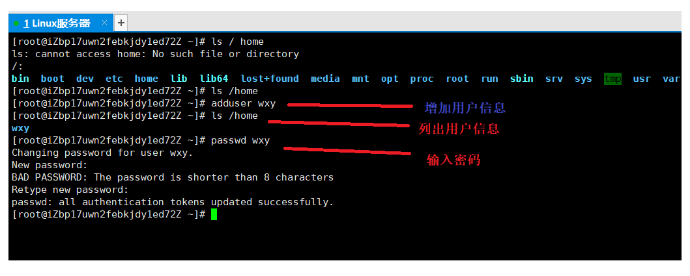
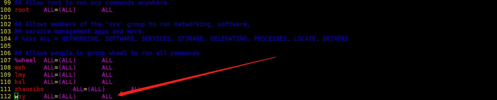
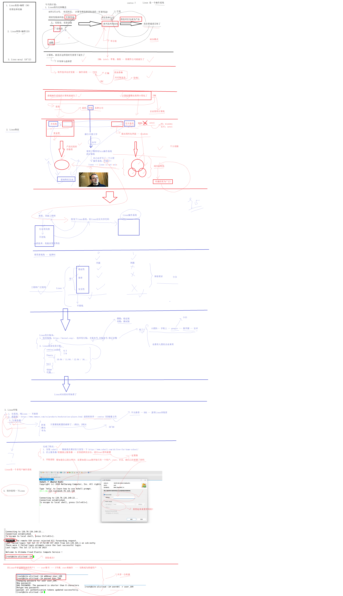

# linux的环境

腾讯云服务器

wxt

-   root  2003meizhihong
-   wxy  20223333114aA
-   XMLife 20223333114aA
-   公网IP 123.207.8.23

***

-   云访问在Xshell装配一个用户

-   增加信任列表

在root 账号下

> `vim /etc/sudoers`

将root 复制粘贴一下，改成自己名字即可

