# Linux 进程信号（处理、内核）

## 目录

-   [信号其他相关常见概念](#信号其他相关常见概念)
    -   [pending](#pending)
    -   [handler](#handler)
    -   [block](#block)
-   [信号处理的过程](#信号处理的过程)
-   [sigset\_t](#sigset_t)
    -   [sigset\_t使用](#sigset_t使用)
-   [系统接口](#系统接口)
    -   [sigpending](#sigpending)
    -   [sigprocmask](#sigprocmask)
-   [捕捉方法](#捕捉方法)
    -   [sigaction](#sigaction)
        -   [struct sigactio](#struct-sigactio)
        -   [sa\_mask](#sa_mask)
-   [补充](#补充)
    -   [可重入函数](#可重入函数)
    -   [volatile](#volatile)
    -   [SIGCHLD信号](#SIGCHLD信号)

# **信号其他相关常见概念**

-   实际执行信号的处理动作称为**信号递达(Delivery)**。
    -   信号递达：可能是默认、可能是忽略、可能是自定义捕捉。
-   信号从产生到递达之间的状态,称为**信号未决(Pending)**。
    -   信号产生，进程不是立即处理这个信号，不代表其不会处理。意味着未来会处理，于是从收到信号到未来准备处理时：信号存在但是没有被处理 —— 信号被临时保存（PCB的位图中），此时就被称为信号未决 —— `Pending`位图。

> **融汇贯通的理解：**
>
> &#x20;  所以，前面所提的临时存储概念是不准确的，应该称作为信号未决(Pending)。

-   进程可以选择**阻塞 (Block)** 某个信号。
    -   进程是可以将处于未决的信号就是不递达其，屏蔽某些信号 —— 阻塞 (Block)。

> **忽略和阻塞的区别：**
>
> 1.  **忽略：** 已经递达了，已经处理该信号了，只不过处理动作是忽略。
> 2.  **阻塞：根本就不会进行抵达，不进入**[**信号处理**](https://so.csdn.net/so/search?q=信号处理\&spm=1001.2101.3001.7020 "信号处理")**流程。**（阻塞即永远不递达）

-   被阻塞的信号产生时将保持在未决状态,直到进程解除对此信号的阻塞,才执行递达的动作.
-   注意,阻塞和忽略是不同的,只要信号被阻塞就不会递达,而忽略是在递达之后可选的一种处理动作。

***

-   为了支持`递达、未决、阻塞`三个概念，其在内核中有对应的表现 —— **内核当中有对应的三张表**。

    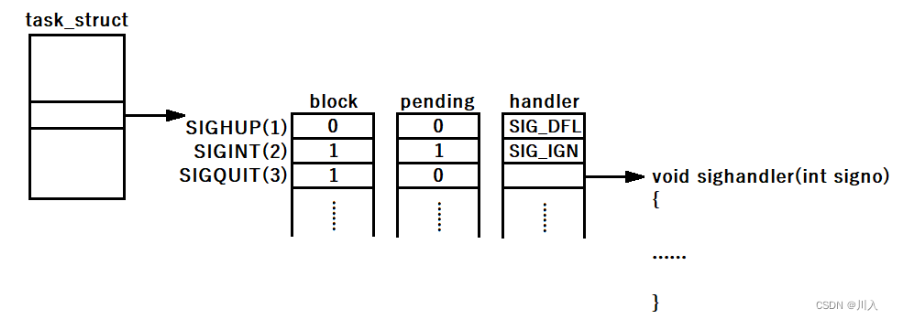
    ### **pending**
    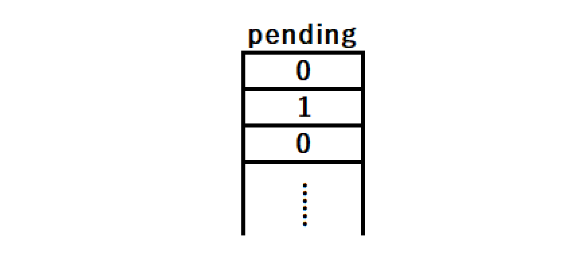

    &#x20;pending就是之前所提的位图，操作系统就是修改pending位图中指定的位置，来完成信号的发送过程。
    ***
    ### **handler**
    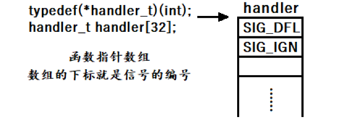

    当收到了一个信号，操作系统会在pending中修改对应的位图。处理信号的时候就会根据为1的信号，拿着信号去handler数值中索引。对应调用handler中的[函数指针](https://so.csdn.net/so/search?q=函数指针\&spm=1001.2101.3001.7020 "函数指针")的方法，去完成信号捕捉就可以了。

    所以，`signal`是两个参数的原因也在此，是根据第一个元素signum找到handler数组对应的位置，将第二个参数handler作为数据存入。
    -   但是需要注意，进程对于信号的处理方式有**三种**：
        -   默认（进程自带的，程序员写好的逻辑）
        -   忽略（也是信号的一种处理方式）
        -   自定义动作（捕捉信号）
            所以，此处的handler中并不只是signal函数这么简单。
        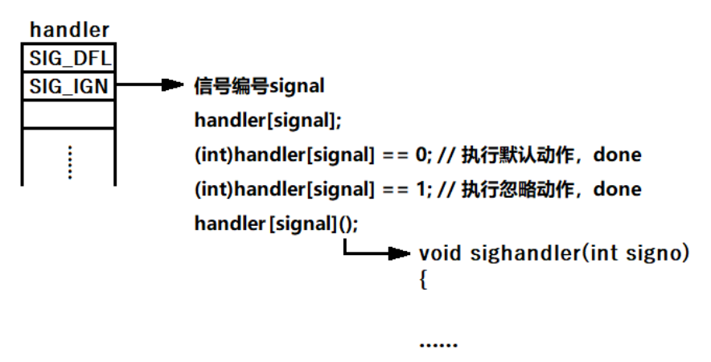

        **（路径**\*\*`：/usr/include/bits/signum.h`）\*\*​

        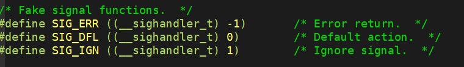
    ***
    ### **block**
    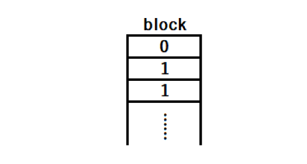

    &#x20;  block位图，结构和pending一摸一样。位图中的内容，代表的含义是对应的信号是否被阻塞。

***

# **信号处理的过程**

信号处理的大致流程图可以画为：


。

1.  向操作系统向`pending`中发送信号。
2.  处理信号，遍历`pending`找到为1的信号。
3.  找到之后，去对应的block中查看是否为1。block为1，该信号永远不递达。block为0，该信号合适的时候递达。
4.  block为0且需要抵达，根据handler数组中的数据处理信号。

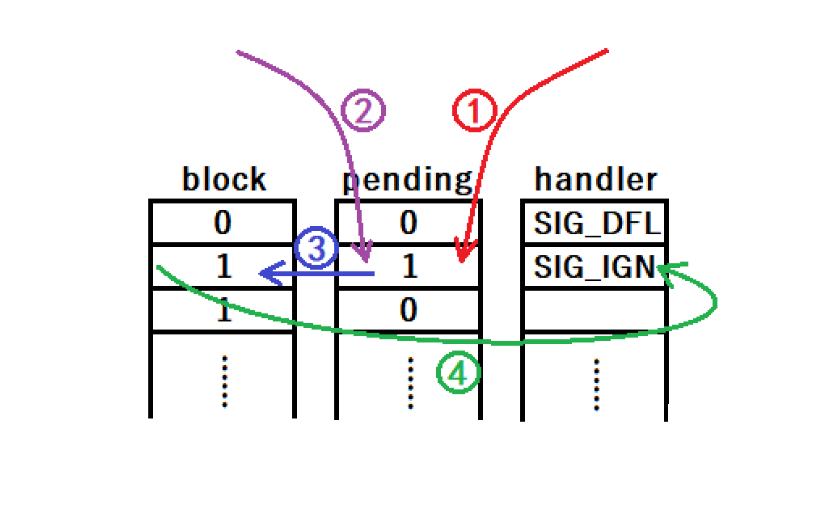

# **sigset\_t**

&#x20;    为了支持我们更好的编程，信号在内核当中是一个位图，不可能让我们直接操作其，也不可能让我们操作。操作系统为我们提供了一个类型`sigset_t。`

因为，操作系统提供的类型，需要与操作系统提供的.h文件相对应，也就是与系统调用接口相对应。因为有的接口不允许用户传语言层的参数，需要传一个结构体、一个位图等。于是操作系统必须提供对应的类型。

> **融汇贯通的理解：**
>
> 其实语言级的.h、.hpp也一样，因为只要涉及硬件级别的操作，就必须通过操作系统，那么就需要使用操作系统提供的.h以及操作系统提供的类型 —— 语言级的.h、.hpp一定对操作系统提供的.h与类型有着包含。最典型的就是文件操作。

```c++
# define _SIGSET_NWORDS  (1024 / (8 * sizeof (unsigned long int)))
typedef struct
  {
    unsigned long int __val[_SIGSET_NWORDS];
  } __sigset_t;
 
#endif
```

`sigset_t`是位图结构，操作系统提供的类型。

每个信号只有一个bit的未决标志，非0即1，不记录该信号产生了多少次，阻塞标志也是这样表示的。因此，未决和阻塞标志可以用相同的数据类型 sigset\_t 来表示， sigset\_t 称为 信号集 ，这个类型可以表示每个信号的 " 有效 " 或 " 无效 " 状态，在阻塞信号集中 " 有效 " 和 " 无效 " 的含义是该信号是否被阻塞，而在未决信号集中 " 有效 " 和 " 无效 " 的含义是该信号是否处于未决状态。阻塞信号集也叫做当前进程的 信号屏蔽字(Signal Mask) ，这里的 " 屏蔽 " 应该理解为阻塞而不是忽略。

***

#### **sigset\_t使用**

1\.  sigset\_t **——** 不允许用户自己进行位操作 **——** 操作系统给我们提供了对应的操作位图的方法。

| #include \<signal.h>                               |                                                       |                        |
| -------------------------------------------------- | ----------------------------------------------------- | ---------------------- |
| 系统接口                                               | 意义                                                    | 返回值                    |
| `int sigemptyset(sigset_t *set);`                  | 初始化set所指向的信号集，所有信号位清0，表示该信号集不包含任何有效信号。                | 成功时返回0，错误时返回-1         |
| `int sigfillset(sigset_t *set);`                   | 初始化set所指向的信号集，使其中所有信号的对应bit置位，表示该信号集的有效信号包括系统支持的所有信号。 | 成功时返回0，错误时返回-1         |
| `int sigaddset(sigset_t *set, int signo);`         |                                                       | 成功时返回0，错误时返回-1         |
| `int sigdelset(sigset_t *set, int signo);`         | 从set所指向的信号集中删除某种有效信号。                                 | 成功时返回0，错误时返回-1         |
| `int sigismember(const sigset_t *set, int signo);` | 判断在set所指向的信号集中是否包含某种信号。                               | 包含时返回1，不包含时返回0，错误时返回-1 |

1.  sigset\_t —— user是可以直接使用该类型 —— 和内置类型 && 自定义类型没有任何差别。
2.  sigset\_t —— 一定需要对应的系统接口，来完成对应的功能，其中系统接口需要的参数，可能就包含了sigset\_t定义的变量或者对象。

***

# **系统接口**

## **sigpending**

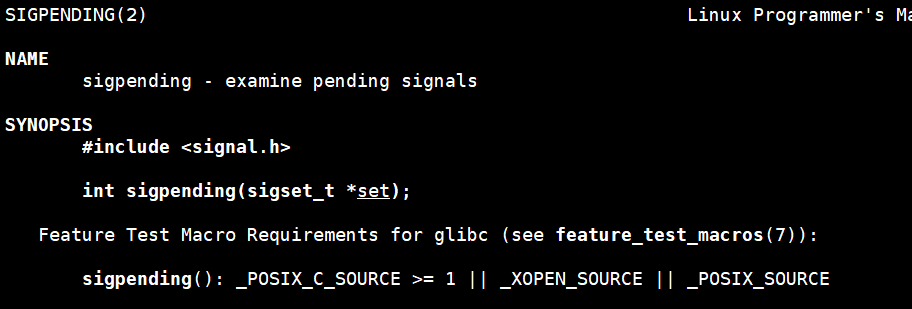

```c++
#include <signal.h>

int sigpending(sigset_t *set);

 功能:   读取当前进程的未决信号集,通过set参数传出 

 参数： set：类型为sigset_t的位图。

 返回值： （如果发生错误，将设置errno以指示原因）
- 成功时返回0。
- 错误时返回-1。
```

为什么pending只有获取，为什么没有设置？

因为其实前面讲的信号产生就是在设置。

***

## **sigprocmask**

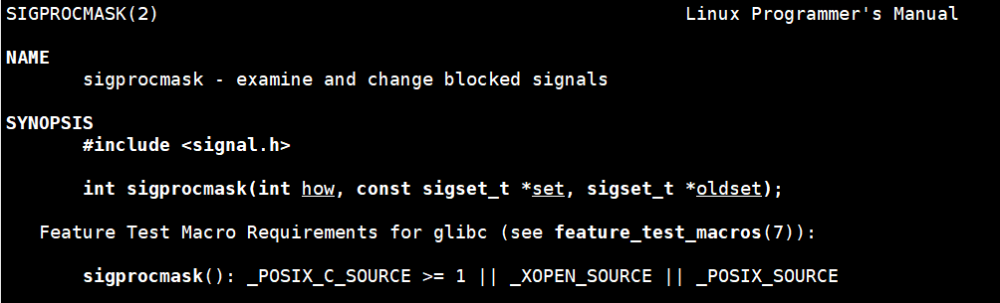

```c++
#include <signal.h>


int sigprocmask(int how, const sigset_t *set, sigset_t *oldset);

参数：
   how：参数更改信号屏蔽字。
   set：类型为sigset_t的位图。
   oldset：将原来的信号屏蔽字备份到oldset里。

返回值：（如果发生错误，将设置errno以指示原因）
   成功时返回0。
   错误时返回-1。

```

**how参数（宏）：** 下列宏没有任何交集，不自持按位|、按位&。

```c++
选项  含义
 SIG_BLOCK     set包含了我们希望添加到当前信号屏蔽字的信号，相当mask=mask | set
 SIG_UNBLOCK   set包含了我们希望从当前信号屏蔽字中解除阻塞的信号，相当mask=mask&~set
 SIG_SETMASK   设置当前信号屏蔽字为set所指向的值，相当于mask=set
```

-   如果调用sigprocmask解除了对当前若干个未决信号的阻塞,则在sigprocmask返回前,至少将其中一个信号递达。

> **#问：** ​**如果我们对所有的信号都进行了自定义捕捉，是不是就写了一个不会被异常或者用户杀掉的进程？**
>
> > 不是，也不可能，操作系统的设计者也考虑到了。
>
> ```c++
> #include <iostream>
> #include <signal.h>
> #include <unistd.h>
> #include <cassert>
>  
> static void handler(int signum)
> {
>     std::cout << "捕捉 信号： " << signum << std::endl;
>     // 不要终止进程，exit
> }
>  
> int main()
> {
>      // 将block全部设置
>      for(int sig = 1; sig <= 31; sig++)
>     {
>         signal(sig, handler);
>     }
>     
>     while(1) {}
>     return 0;
> }
> ```
>
> ` 9号`信号与`19号`信号属于**管理员信号，** 我们是无法设定自定义捕捉动作的。为的就是防止我们将所有的31个信号全部捕捉。
>
> **9号信号**:
>
> 
>
> 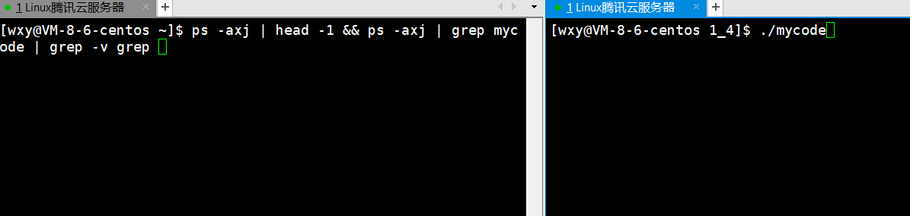
>
> **19号信号：**
>
> 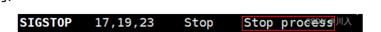
>
> 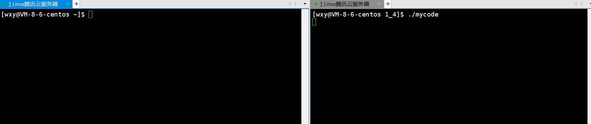

> 如果我们将2号信号block ，并且不断的获取并打印当前进程的pending信号集，如果我们突然发送一个2号信号，我们就应该肉眼看到pending信号集中，有一个比特位0->1
>
> ```c++
> #include<iostream>
> #include<unistd.h>
> #include<signal.h>
> #include<assert.h>
> using namespace std;
>
>
> void showPending(sigset_t & pending)
> {
>     for(int i = 1; i <= 31; i++)
>     {
>         if(sigismember(&pending,i)) 
>         {
>             cout << "1";
>         }
>         else 
>         {
>             cout << "0"; 
>         }
>     }
>     cout << endl;
>
> }
>
> static void handler(int signum)
> {
>     std::cout << "捕捉 信号： " << signum << std::endl;
>     // 不要终止进程，exit
> }
>
> int main()
> {
>     
>     // 1. 定义信号集对象
>     sigset_t bset,obset;
>     sigset_t pending;
>
>     // 2. 初始化
>     sigemptyset(&bset); 
>     sigemptyset(&obset);
>     sigemptyset(&pending);
>     
>     // 3. 添加要进行屏蔽的信号
>     sigaddset(&bset,2 /*SIGINT*/); 
>     
>     // 4. 设置set到内核中对应的进程内部[默认情况进程不会对任何信号进行block]
>     int n = sigprocmask(SIG_BLOCK,&bset,&obset); 
>     assert(n == 0); 
>     (void)n;  
>
>     std::cout << "block 2 号信号成功...., pid: " << getpid() << std::endl;
>     
>     // 5. 重复打印当前进程的pending信号集
>     int count = 0;
>     while(1)
>     {
>         // 5.1 获取当前进程的pending信号集
>         sigpending(&pending); //取出pending 位图
>         
>         // 5.2 显示pending信号集中的没有被递达的信号
>         showPending(pending);
>         
>         sleep(1);
>         count++;
>         if(count == 20)
>         {
>              // 默认情况下，恢复对于2号信号的block的时候，确实会进行递达
>              // 但是2号信号的默认处理动作是终止进程！
>              //  需要对2号信号进行捕捉
>              std::cout << "解除对于2号信号的block" << std::endl;
>              int n = sigprocmask(SIG_SETMASK, &obset, nullptr);
>              assert(n == 0);
>              (void)n;
>         }
>
>     }
>     return 0;
> }
>
> ```
>
> 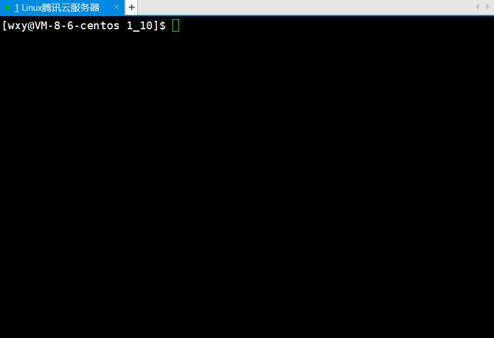
>
> 打印解除block和捕捉的顺序 -- 就是一个打印的问题

> **#问：** ​**如果我们将对所有的信号都进行了block，是不是就写了一个不会被异常或者用户杀掉的进程？**
>
> > &#x20;不是，也不可能，操作系统的设计者也考虑到了。
>
> ```c++
> #include <iostream>
> #include <signal.h>
> #include <unistd.h>
> #include <cassert>
>  
> // 打印pending
> static void showPending(sigset_t &pending)
> {
>     for (int sig = 1; sig <= 31; sig++)
>     {
>         if (sigismember(&pending, sig))
>             std::cout << "1";
>         else
>             std::cout << "0";
>     }
>     std::cout << std::endl;
> }
>  
> // 设置block
> static void blockSig(int sig)
> {
>     sigset_t bset;
>     
>      //初始化set所指向的信号集，所有信号位清0，表示该信号集不包含任何有效信号。
>      sigemptyset(&bset);
>     
>      //向set所指向的信号集中添加某种有效信号。
>      sigaddset(&bset, sig);
>     
>      //修改当前进程的信号屏蔽字
>       //1.set包含了我们希望添加到当前信号屏蔽字的信号
>      int n = sigprocmask(SIG_BLOCK, &bset, nullptr);
>     assert(n == 0);
>     (void)n;
> }
>  
> int main()
> {
>     // 将block全部设置
>     for(int sig = 1; sig <= 31; sig++)
>     {
>         blockSig(sig);
>     }
>  
>     // 循环打印pending
>     sigset_t pending;
>     while(true)
>     {
>         //功能: 获取pending位图。
>          sigpending(&pending);
>         showPending(pending);
>         sleep(1);
>     }
>     return 0;
> }
> ```
>
> 9号信号与19号信号属于管理员信号，我们是无法设定block。为的就是防止我们将所有的31个信号全部block。
>
> 9号：
>
> 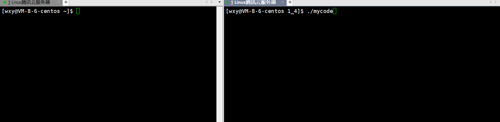
>
> 19号：
>
> 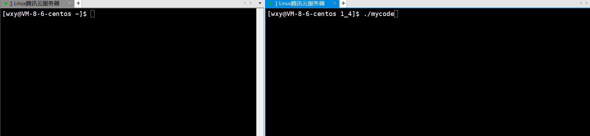
>
> > Note:
> >
> > 9号信号与19号信号，永远不会被阻塞、永远不会被捕捉。

貌似没有一个接口用来设置pending位图(所有的信号发送方式，都是修改pending位图的过程)，我们是可以获取的sigpending

***

# **捕捉方法**

**1.**  **信号在合适的时候处理（什么时候？）**

> &#x20;合适的时候：内核态返回到用户态的时候处理。
>
> > **#问：什么叫做用户态？什么叫做内核态？**
> >
> > 我们调用某些系统调用（或者是时间片到了、或者是我们主导的调用了陷入内核的汇编指令）。以此，进入操作系统，在操作系统内，执行操作系统的代码。其中执行操作系统底层的代码的状态，就称作为*内*核态 —— 同理：执行用户层代码时称作为用户态。&#x20;
>
> 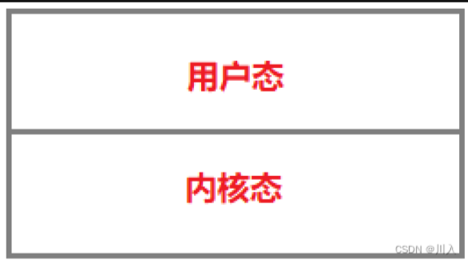
>
> -   **用户态：** 是一个受管控的状态。
> -   **内核态：** 是一个操作系统执行自己代码的一个状态，具备非常高的优先级。
>
> > **#问：从内核态返回到用户态，即必须要进入过内核态。为什么要进入内核态？如何进入的内核态？**
> >
> > &#x20;  在操作系统或者是在硬件CPU上执行代码的时候，执行的一大批代码都在内存之中保存着（二进制）。CPU执行的时候区分是用户的代码还是内核的代码，即执行用户的代码就是用户态，执行内核的代码就是内核态。

-   **内核范畴：**
    -   相关数据在操作系统内部，普通用户没有权利去进行检测。

> **内核状态：** 系统调用接口。

> **用户状态：** hello world。

> 我们大部分执行的是我们的代码，所以我们是用户态。

-   **进入内核态最典型的方式：**
    -   进行系统调用。
    -   而有时候缺陷、陷阱、异常等，也可能进入内核态。

> **#问：** ​**我们怎么进入内核态和用户态？（我们不用担心）**
>
> 在汇编语言中，有一个中断编号80，有一个汇编指令int。以int 80可以让我们陷入内核，即：代码的执行权限，由我下达给操作系统，让操作系统去执行。
>
> **（int 80内置在系统调用函数中，我们不用管）**
>
> 用户态是一个受管控的状态：即不管是哪一个用户，都叫做普通用户。其启动的进程或者是任务，都是需要以用户态来运行的。 **（受管控：受访问权限的约束、资源限制等）** 如果，基本不受任何资源的约束，也就是不受权限的管控。

-   **页表分为：**
    -   用户级页表：用于映射用户所写的代码和数据所对应的物理内存（位于用户空间：0 \~ 3G）
    -   内核级页表：用于映射操作系统的代码和数据所对应的物理内存（位于内核空间：3 \~ 4G ）
    内核级页表不同于用户级页表。对于用户级页表而言，因为不同进程的代码和数据是不相同的，所以需要每一个进程有属于自己的用户级页表 **（进程的独立性的体现）。** 对于内核级页表而言，因为所有的进程都是在一个操作系统上跑的（只有一份操作系统），所以内核级页表只有一份。

    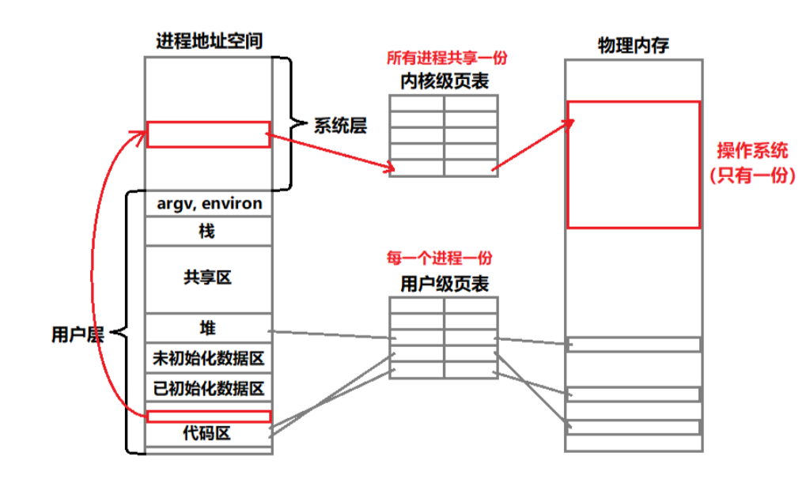

    &#x20;当我们的代码中有类似open的系统调用时，根本不用担心，因为操作系统也在进程地址空间里。所以，无非就是跳转到open对应的内核地址空间里。

    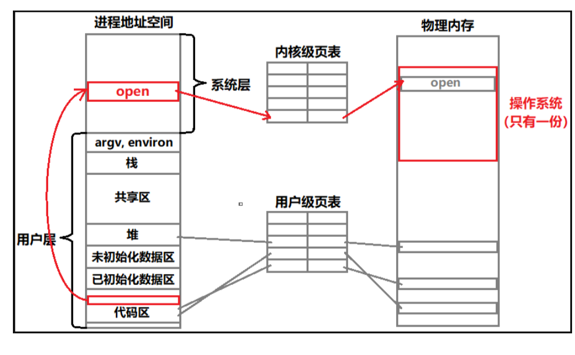

    **即：** 操作系统的代码可以找到，因为整个操作系统被映射进了所有进程的3\~4G中。所以，所有进程想调系统调用，只是在自己的地址空间上，通过函数调用跳转到系统里就可以了。

> **融会贯通的理解：**
>
> > \#问：进程切换的过程是什么？
> >
> > 操作系统内有一个switch process对应的函数，然后当我们对应的进程时间片到了，操作系统底层硬件给我们发时钟中断。操作系统就直接，在CPU找当执行的进程，然后通过其的地址空间，找到对应的进程切换的函数，因为在当前进程中切换，所以可以将CPU内所有的临时数据压到PCB当中，即切换成功。（下面一个进程，运用其进程地址空间中3\~4G，与内核级页表，找到恢复上下文的代码和数据。）
>
> 时钟中断执行的频率很高：100次/秒，时钟中断的主要工作是处理和时间有关的所有信息、决定是否执行调度程序以及处理下半部分。 和时间有关的所有信息包括系统时间、进程的时间片、延时、使用CPU的时间、各种定时器，进程更新后的时间片为进程调度提供依据，然后在时钟中断返回时决定是否要执行调度程序。

> **#问****：我们凭什么有权利执行操作系统的代码？** ​
>
> 凭的是我们是处于内核态还是用户态。因为CPU里面的寄存器一般分为两类：一套可见（程序员可用），一套不可见（权限、控制等，CPU自己用）。其中有一个寄存器，叫做CR3寄存器 —— 表示当前CPU的执行权限。
>
> 只有内核态才可以访问操作系统里，结合前面所提：其实执行open的时候，就会执行其本身自带的指令int 80，该指令第一件事就会将CR3寄存器由用户态变为内核态，于是后面权限检查发现是内核态，于是就可以访问操作系统（使用内核级页表），于是跳转到操作系统执行open的代码。

> **#问：** ​**为什么从用户态 -> 内核态？**
>
> 因为有时候有一些功能，大部分情况下无法在用户态无法去执行的。因为操作系统是软硬件资源的管理者，换句话说，就是任何普通用户无法（不能、不可以）绕过操作系统去访问对应的软硬件资源。
>
> 用户需要通过访问软硬件资源，达到自身的目的。
>
> > 用户需要，操作系统不允许，所以便有了：先变成内核，然后用户通过其访问 —— 系统调用接口

> **#问：** ​**怎么从用户态 -> 内核态？**
>
> 目前最常见就是，系统调用接口。通过特定的接口陷入内核。

> **#问：** ​**为什么从内核态 -> 用户态？**
>
> 1.  当前用户的代码还没有执行完。
> 2.  当前用户层还有若干个进程没有被调度完。
>
> 计算机当中，操作系统是为了给用户提供服务的，所以执行用户的代码为主，执行操作系统的代码为辅，以此协同完成。所以是必定要从内核态 -> 用户态，不反回用户态就无法给用户提供完整的服务 —— 可以说：进入内核态是一种临时的状态。

> **#问：** ​**CPU如何知晓的当前其执行的代码是用户的还是内核的？**
>
> -   硬件上：
>
>     &#x20;CPU寄存器分为两类：一套可见，一套不可见。执行内核代码中，其第一件事就是自行自带的指令int 80，该指令第一件事就会将CR3寄存器由用户态变为内核态，于是后面权限检查发现是内核态。
> -   软件上：
>
>     除用户级页表（将虚拟的用户地址空间进行物理内存的实质化，同时每一个进程由独立的用户级页表，用以保证进程的独立性）之外，还有内核级页表，用于将进程地址空间中的内核地址空间映射到物理内存中存储的操作系统（开机启动电脑，无非就是将操作系统加载到物理内存，用以运行）。以此达到进程对于操作系统的代码和数据的访问，由于操作系统只有一份（只需要一份：Windows、Linux）。所以，所有进程只需要看见同一份资源，即同一份内核级页表即可。
>
> > 融会贯通的理解：
> >
> > 所有进程都在一个操作系统下跑 —— 必须看见同一份操作系统 —— 同一份内核级页表。
> >
> > CPU执行代码的时候都是进程的代码进程，而如何切换软硬件体系都可以找到操作系统，并且所有的操作系统执行都是在地址空间中 —— 执行系统调用 —— 在当前进程地址空间内执行跳转 —— 与动态库类似（区别：更改实行级别、状态、权限等）。

1.  **信号处理的整个流程：**

    &#x20;内核态处理默认、忽略，是水到渠成的事情。

> **融会贯通的理解：**
>
> 进程由内核态 -> 用户态的时，遍历检查pending中处于1的信号，然后其block中为0，即进行handler中的递达。
>
> -   **忽略：** 即pengding中的1置0，而后直接返回上层的用户代码处继续执行。
> -   **默认****：** 大部分是终止，直接将当前进程进入终止逻辑（不调度该进程了），将进程对应的PCB、地址空间、页表释放，无需返回用户态继续运行。
> -   进程终止\_exit()：就是直接终止，说白了就是这种终止无需返回到用户态。
> -   进程终止exit()：上层用户层由刷新行为（特殊处理），操作系统需要返回到用户态，将缓冲区数据进行刷新，然后再进行终止。
>     -   终止了如何还能执行用户层代码？—— 操作系统提供有一些相关接口。（进程终止之前，帮我们返回到用户态，执行特定的方法）
>         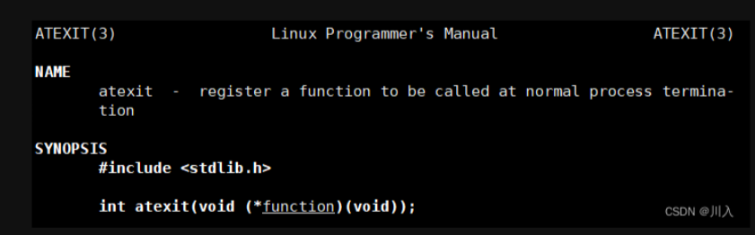
>     -   进程暂停：当前进程在内核态，将进程PCB的状态由运行态改为T状态，然后无需返回用户态，直接执行调度算法，将进程放入等待队列里。然后从新选择进程调度。
>
> &#x20;**默认和忽略都是处于内核态。**

-   **捕捉动作是最难的，下图以捕捉动作为例：**

    此时，处于信号检测，信号处理 -> 所以是处于内核态的。

    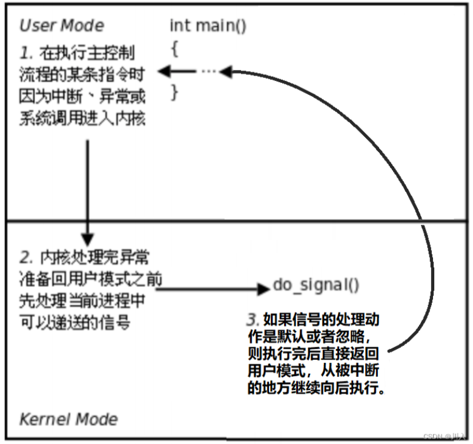
    > **#问：** ​**当前的状态，能不能执行user handler方法的？**
    >
    > &#x20;能执行，但是操作系统不想执行。因为不要认为操作系统内核态不能访问用户层的代码、数据。只要操作系统愿意，想访问就访问。
    > **融汇贯通的理解：**
    >
    > 以文件操作中为例：
    >
    > 用户通过read读取文件中的内容，而文件中的内容就是属于用户层的数据，但是read是系统接口，是属于内核层。
    >
    > 所以：我们获取文件内容的方式，就是通过我们自己写的用户级缓冲区buffer，获取数据，而缓冲区的数据就是操作系统拷贝进的。
    文件数据读取，操作系统愿意做，因为数据只是拷贝没有什么问题，但是如果以操作系统内核态的身份，如果user handler有非法的操作，那就完了 —> 操作系统是不会相信普通用户任何人的 —> 不能用内核态执行用户的代码。

    进行user handler方法时，从内核态切回用户态 —— 以用户态的身份执行我们所写的方法，如此，所有行为我们自己负责。

    &#x20;在完成之后，在用户的层面上，没有能力跳转回执行内核层的代码，然后继续向后执行。

    &#x20; 因为递达完成，需要将pending置0，此操作需要以内核态身份执行。并且当时在哪被中断进入内核，这个位置只有操作系统知道。

    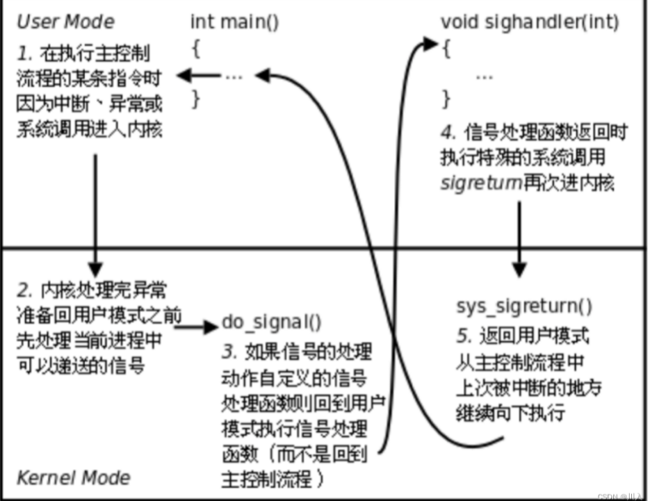
    -   图像简易化：
        -   **1 -> 2 -> 3 -> 4 -> 5**
        -   **1次的信号检测**
        -   **4次的状态的切换**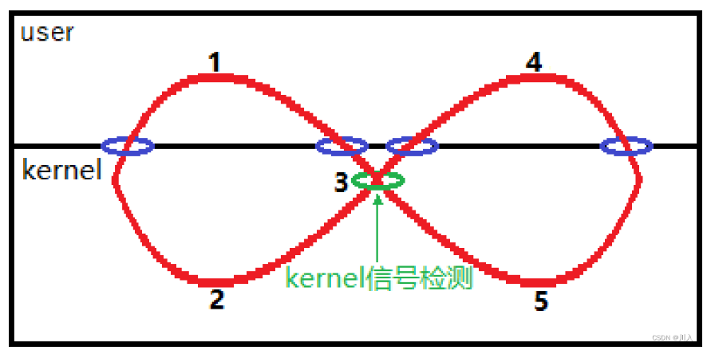

***

### **sigaction**

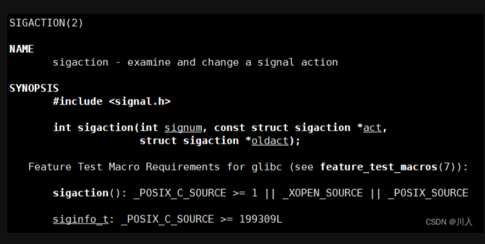

```c++
#include <signal.h>

int sigaction(int signum, const struct sigaction *act, struct sigaction *oldact);

 功能 ： 检查并更改信号动作。 

 参数：
   signum：信号的编号
  act：输入型参数     - 一个结构体，至少包含对于信号的处理 —— 回调函数
  oldact：输出型参数  - 一个结构体，曾经对于这个信号的老的处理方法
```

#### **struct sigactio**

&#x20; 结构体，操作系统提供的数据类型。（结构体名称能与函数相同 —— 不建议）

```c++
struct sigaction {
   void     (*sa_handler)(int);             /*信号捕捉对应的回调函数*/ 
   void     (*sa_sigaction)(int, siginfo_t *, void *);   /*实时信号使用*/
   sigset_t   sa_mask;
        int        sa_flags;               /*实时信号使用*/
        void     (*sa_restorer)(void);     /*实时信号使用*/
};
```

函数不仅可以捕捉普通信号，也可以捕捉实时信号，但是不考虑实时信号，即其中很多字段不管。

```c++
#include <iostream>
#include <signal.h>
#include <unistd.h>
 
void handler(int signum)
{
    std::cout << "获取了一个信号： " << signum << std::endl;
}
 
int main()
{
    std::cout << "getpid: " << getpid() << std::endl; 
 
    // 内核数据类型，用户栈定义的
    struct sigaction act, oact;
    act.sa_flags = 0;
    sigemptyset(&act.sa_mask); // 清空原理后面讲解
    act.sa_handler = handler;
 
    // 设置进当前调用进程的pcb中
    sigaction(2, &act, &oact);
 
    std::cout << "default action : " << oact.sa_handler << std::endl;
 
 
 
    while(true) sleep(1);
    return 0;
}
```

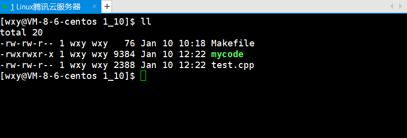

Linux的设计方案：在任意时刻，只能处理一层信号 —— 不允许信号正在被处理时又来信号需要处理 —— 信号什么时候来挡不住，但是可以挡得住信号什么时候被处理。

***

#### **sa\_mask**

当某个信号的处理函数被调用时，内核自动将当前信号加入进程的信号屏蔽字，当信号处理函数返回时自动恢复原来的信号屏蔽字，这样就保证了在处理某个信号时. 如果这种信号再次产生，那么它会被阻塞到当前处理结束为止。 如果在调用信号处理函数时，除了当前信号被自动屏蔽之外，还希望自动屏蔽另外一些信号，则用sa\_mask字段说明这些需要额外屏蔽的信号，当信号处理函数返回时自动恢复原来的信号屏蔽字。

```c++
#include <iostream>
#include <signal.h>
#include <unistd.h>
 
void handler(int signum)
{
    std::cout << "获取了一个信号： " << signum << std::endl;
    sleep(5);
}
 
int main()
{
    std::cout << "getpid: " << getpid() << std::endl; 
 
    // 内核数据类型，用户栈定义的
    struct sigaction act, oact;
    act.sa_flags = 0;
    sigemptyset(&act.sa_mask);  // 保证初始状态下，信号屏蔽字全为0
    act.sa_handler = handler;
 
    // 设置进当前调用进程的pcb中
    sigaction(2, &act, &oact);
 
    std::cout << "default action : " << oact.sa_handler << std::endl;
 
 
 
    while(true) sleep(1);
    return 0;
}
```

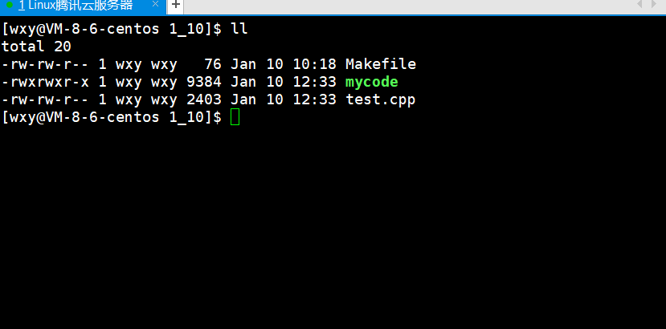

实验在信号处理期间，会屏蔽该信号。

&#x20;如果这种信号再次产生，那么它会被阻塞到当前处理结束为止。

```c++
#include <iostream>
#include <signal.h>
#include <unistd.h>
 
void showPending(sigset_t* pending)
{
    for(int sig = 1; sig <= 31; sig++)
    {
        if(sigismember(pending, sig)) std::cout << "1";
        else std::cout << "0";
    }
    std::cout << std::endl;
}
 
void handler(int signum)
{
    std::cout << "获取了一个信号： " << signum << std::endl;
 
    sigset_t pending;
    int c = 7;
    while(true)
    {
        sigpending(&pending);
        showPending(&pending);
        c--;
        if(!c) break;
        sleep(1);
    }
}
 
int main()
{
    std::cout << "getpid: " << getpid() << std::endl; 
 
    // 内核数据类型，用户栈定义的
    struct sigaction act, oact;
    act.sa_flags = 0;
    sigemptyset(&act.sa_mask);  // 保证初始状态下，信号屏蔽字全为0
    act.sa_handler = handler;
 
    // 设置进当前调用进程的pcb中
    sigaction(2, &act, &oact);
 
    std::cout << "default action : " << oact.sa_handler << std::endl;
 
    while(true) sleep(1);
    return 0;
}
```

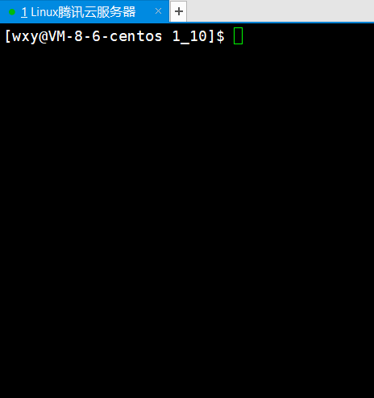

&#x20;  这也就是为什么会有block或者信号屏蔽字，这样的字段。也就是为了支持操作系统内处理普通信号，防止其进行递归式的处理。让其在自己的处理周期内只会调用一层，不出现太多的调用层次。

-   **在处理2号信号的期间，捎带的屏蔽一下信号：3、4、5、6**
    ```c++
    #include <iostream>
    #include <signal.h>
    #include <unistd.h>
     
    void showPending(sigset_t* pending)
    {
        for(int sig = 1; sig <= 31; sig++)
        {
            if(sigismember(pending, sig)) std::cout << "1";
            else std::cout << "0";
        }
        std::cout << std::endl;
    }
     
    void handler(int signum)
    {
        std::cout << "获取了一个信号： " << signum << std::endl;
     
        sigset_t pending;
        int c = 20;
        while(true)
        {
            sigpending(&pending);
            showPending(&pending);
            c--;
            if(!c) break;
            sleep(1);
        }
    }
     
    int main()
    {
        std::cout << "getpid: " << getpid() << std::endl; 
     
        // 内核数据类型，用户栈定义的
        struct sigaction act, oact;
        act.sa_flags = 0;
        sigemptyset(&act.sa_mask);  // 保证初始状态下，信号屏蔽字全为0
        act.sa_handler = handler;
     
        // 在处理2号信号的期间，捎带的屏蔽一下信号：3、4、5、6
        sigaddset(&act.sa_mask, 3);
        sigaddset(&act.sa_mask, 4);
        sigaddset(&act.sa_mask, 5);
        sigaddset(&act.sa_mask, 6);
     
        // 设置进当前调用进程的pcb中
        sigaction(2, &act, &oact);
     
        std::cout << "default action : " << oact.sa_handler << std::endl;
     
        while(true) sleep(1);
        return 0;
    }
    ```
    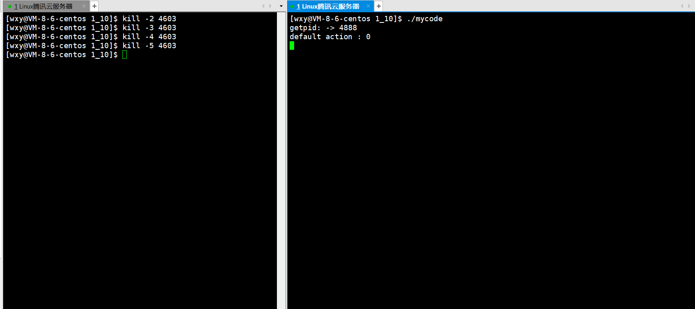

    因为，我们只是将2号信号设置为自定义捕捉，其他信号是默认。所以在执行完2号信号的自定义捕捉后，处于被block状态的信号，才会被递达。（此处最后递达的是：4号信号）

> **Note：**
>
> 信号捕捉，并没有创建新的进程或者线程。信号的处理整个流程都是单进程的，就是这一个进程处理信号时，处于此进程的上下文中处理。

***

# **补充**

### **可重入函数**

main函数调用insert函数向一个链表head中插入节点node1,插入操作分为两步,刚做完第一步的 时候,因为硬件中断使进程切换到内核,再次回用户态之前检查到有信号待处理,于是切换到sighandler函数,sighandler也调用insert函数向同一个链表head中插入节点node2,插入操作的两步都做完之后从sighandler返回内核态,再次回到用户态就从main函数调用的insert函数中继续往下执行,先前做第一步之后被打断,现在继续做完第二步。结果是，main函数和sighandler先后向链表中插入两个节点，而最后只有一个节点真正插入链表中了。于是便出现了经典的内存泄漏问题。

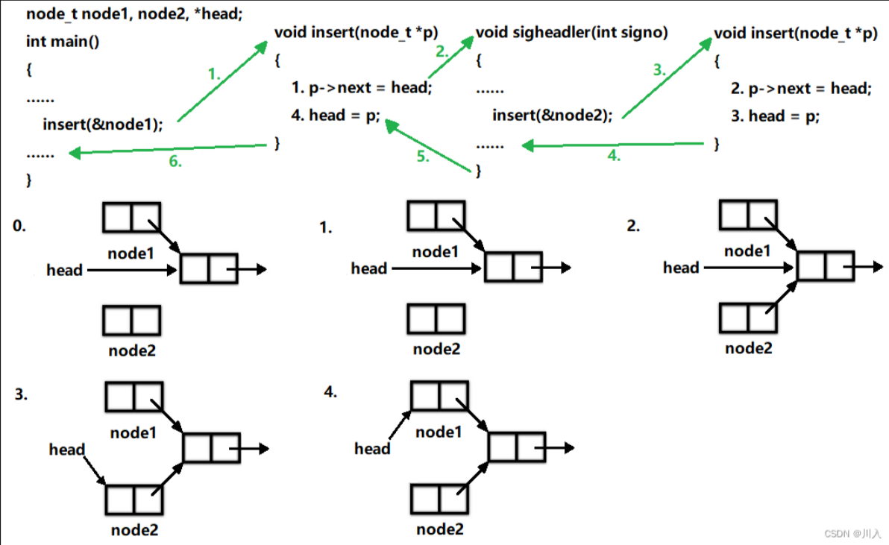

排查代码的时候，可以发现，我们的代码写的没有任何问题。对应的main函数、单链表头插insert、信号捕捉sighandler、函数调用都没有问题 —— 这个问题的产生严格来说并不是代码问题，而是因为操作系统调度导致的进程时序的变化 —— 时序问题。

此问题存在且，非常不容易排查。

像上例这样,insert函数被不同的控制流程调用,有可能在第一次调用还没返回时就再次进入该函数,这称为重入。insert函数访问一个全局链表,有可能因为重入而造成错乱,像这样的函数称为不可重入函数，反之， 如果一个函数只访问自己的局部变量或参数,则称为可重入(Reentrant) 函数。

**可重入函数 VS 不可重入函数**

是函数的一种特征，目前我们用的90%函数，都是不可重入的。

-   不可重入函数：好编写。
-   可重入函数：不好编写，书写成本高。
-   如果一个函数符合以下条件之一则是不可重入的: &#x20;
    -   调用了new、malloc或free，因为new、malloc也是用全局链表来管理堆的。
    -   99%的STL容器，都是不可重入的。
    -   函数里面带static的。
    -   调用了标准I/O库函数。标准I/O库的很多实现都以不可重入的方式使用全局数据结构
-   可重入函数：需要保证函数其是独立的，没有访问任何的全局数据。

***

### **volatile**

-   该关键字在C当中我们已经有所涉猎，今天我们站在信号的角度重新理解一下
    ```c++
    #include <stdio.h>
    #include <signal.h>
    int flag = 0;
    void handler(int sig)
    {
      printf("chage flag 0 to 1\n");
      flag = 1;
    }
    int main()
    {
      signal(2, handler);
      while (!flag);
      printf("process quit normal\n");
      return 0;
    }

    [wxy@VM-8-6-centos 1_10]$ ./mycode
    ^Cchage flag 0 to 1
    process quit normal

    ```

> 标准情况下，键入 CTRL-C ,2号信号被捕捉，执行自定义动作，修改 flag＝1 ， while 条件不满足,退出循环，进程退出
>
> ```c++
> #include <stdio.h>
> #include <signal.h>
> int flag = 0;
> void handler(int sig)
> {
>   printf("chage flag 0 to 1\n");
>   flag = 1;
> }
> int main()
> {
>   signal(2, handler);
>   while (!flag);
>   printf("process quit normal\n");
>   return 0;
> }
>
> [wxy@VM-8-6-centos 1_10]$ ./mycode
> ^Cchage flag 0 to 1
> ^Cchage flag 0 to 1
> ^Cchage flag 0 to 1
> ^Cchage flag 0 to 1
>
> ```
>
> 优化情况下，键入 CTRL-C ,2号信号被捕捉，执行自定义动作，修改 flag＝1 ，但是 while 条件依旧满足,进程继续运行！但是很明显flag肯定已经被修改了，但是为何循环依旧执行？很明显， while 循环检查的flag，并不是内存中最新的flag，这就存在了数据二异性的问题。 while 检测的flag其实已经因为优化，被放在了CPU寄存器当中。如何解决呢？很明显需要 volatile
>
> 编译器有时候会自动的给我们进行代码优化\*\* gcc g++\*\*
>
> ```c++
> #include <stdio.h>
> #include <signal.h>
> volatile int flag = 0;
> void handler(int sig)
> {
>   printf("chage flag 0 to 1\n");
>   flag = 1;
> }
> int main()
> {
>   signal(2, handler);
>   while (!flag);
>   printf("process quit normal\n");
>   return 0;
> }
>
> [wxy@VM-8-6-centos 1_10]$ ./mycode
> ^Cchage flag 0 to 1
> process quit normal
>
> ```

编译做优化的时候，自作聪明，它一看flag是一个全局的数据，发现在main函数里没有任何一个语句是改flag的。其认为每一次检测flag都需要访问内存，并将数据拷贝进CPU的寄存器中，于是自作聪明，将第一次的flag的值一直放在edx中，后面的检测就不去内存拿了，继续看edx中的数据，就是0，于是一直检测不过。

所以为了解决这个问题，一些可能被优化的字段，我们显性的告诉编译器，不要这么优化。

volatile 作用：**保持内存的可见性**，告知编译器，被该关键字修饰的变量，不允许被优化，对该变量

的任何操作，都必须在真实的内存中进行操作

***

### **SIGCHLD信号**

（只有Linux采用了这样的方案）

进程一章讲过用wait和waitpid函数清理僵尸进程,父进程可以阻塞等待子进程结束,也可以非阻 塞地查询是否有子进程结束等待清理(也就是轮询的方式)。采用第一种方式,父进程阻塞了就不 能处理自己的工作了;采用第二种方式,父进程在处理自己的工作的同时还要记得时不时地轮询一 下,程序实现复杂。

其实,子进程在终止时会给父进程发SIGCHLD信号,该信号的默认处理动作是忽略,父进程可以自 定义SIGCHLD信号的处理函数,这样父进程只需专心处理自己的工作,不必关心子进程了,子进程 终止时会通知父进程,父进程在信号处理函数中调用wait清理子进程即可。

事实上,由于UNIX 的历史原因,要想不产生僵尸进程还有另外一种办法:父进程调 用sigaction将SIGCHLD的处理动作置为SIG\_IGN,这样fork出来的子进程在终止时会自动清理掉,不 会产生僵尸进程,也不会通知父进程。系统默认的忽略动作和用户用sigaction函数自定义的忽略 通常是没有区别的,但这是一个特例。此方法对于Linux可用,但不保证在其它UNIX系统上都可 用。请编写程序验证这样做不会产生僵尸进程

-   &#x20; 本质上也就是：子进程通过操作系统来给父进程写入信号，逻辑同文上。
-   **验证子进程在终止时会给父进程发SIGCHLD信号：**
    ```c++
    #include <cstdio>
    #include <cstdlib>
    #include <signal.h>
    #include <unistd.h>
    #include <sys/wait.h>
    #include <sys/types.h>
     
    void handler(int sig)
    {
        printf("子进程退出:%d\n", sig);
    }
     
    // 证明：子进程退出，会向父进程发送信号
    int main()
    {
        signal(SIGCHLD, handler);
        pid_t cid;
        if ((cid = fork()) == 0)
        { 
            // child
            sleep(1);
            exit(0);
        }
        while(true) sleep(1);
        return 0;
    }
    ```
    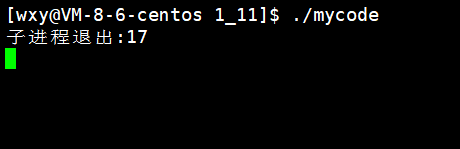
-   **父进程在信号处理函数中调用 wait / waitpid 清理子进程：**
    > Note：
    >
    > 我们需要注意，如果我们有10个子进程，而如果其中5个子进程在一个时刻退出。由于普通信号只会有与没有，没有个数的表达，而对于第6个子进程，也是需要进行判断是否退出的（我们知道5个子进程退出是我们站在上帝的视角）。此时我们使用常规的 wait / waitpid 去使用，信号处理就会阻塞在那里。
    >
    > **解决方法：**
    >
    > -   使用全局变量记录所有子进程的pid，用以遍历的非阻塞等待。
    > -   使用waitpid第一个参数为-1（等待任意一个子进程），并非阻塞等待。
    ```c++
    #include <stdio.h>
    #include <stdlib.h>
    #include <signal.h>
    #include <sys/wait.h>
    #include <sys/types.h>
     
    void handler(int sig)
    {
        pid_t id;
        while ((id = waitpid(-1, NULL, WNOHANG)) > 0)
        {
            printf("wait child success: %d\n", id);
        }
        printf("child is quit! %d\n", getpid());
    }
     
    int main()
    {
        signal(SIGCHLD, handler);
        pid_t cid;
        if ((cid = fork()) == 0)
        {
            // child
            printf("child : %d\n", getpid());
            sleep(3);
            exit(1);
        }
     
        //father
        while (1)
        {
            printf("father proc is doing some thing!\n");
            sleep(1);
        }
        return 0;
    }
    ```
    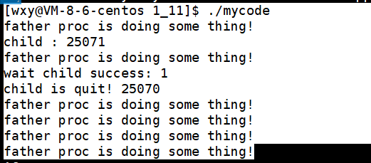
-   **父进程不关心子进程的任何推出信息：**
    ```c++
    #include <iostream>
    #include <unistd.h>
    #include <signal.h>
     
    // 如果我们不想等待子进程，并且我们还想让子进程退出之后，自动释放僵尸子进程
    int main()
    {
        // OS 默认就是忽略的
        signal(SIGCHLD, SIG_IGN); // 手动设置对子进程进行忽略
     
        if(fork() == 0)
        {
            std::cout << "child: " << getpid() << std::endl;
            sleep(5);
            exit(0);
        }
     
        while(true)
        {
            std::cout << "parent: " << getpid() << " 执行我自己的任务!" << std::endl;
            sleep(1);
        }
    }
    ```
    > **#问：操作系统默认就是忽略的，在此处我们还自己写一个忽略？**
    >
    > 也看得出来差别是很大的。忽略的概念是不一样的，可以理解为对信号的处理有第四方案：操作系统级别的忽略。可以理解为我们的忽略为1，操作系统的忽略为2，是不同级别的忽略。
