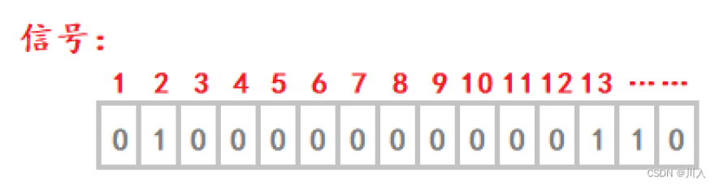
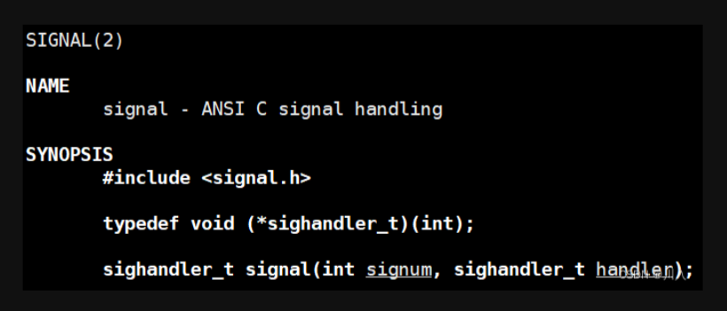
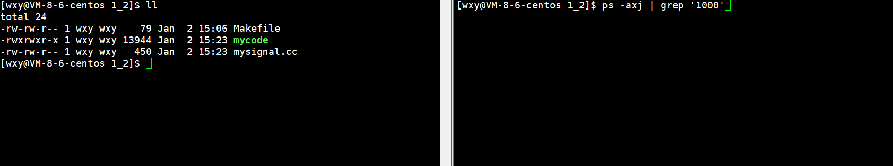

# Linux 进程信号（认识、应用）

## 目录

-   [信号初识](#信号初识)
    -   [生活中的信号](#生活中的信号)
    -   [Linux中的信号](#Linux中的信号)
-   [产生信号](#产生信号)
    -   [核心转储](#核心转储)
    -   [验证进程等待中的core dump标记位](#验证进程等待中的core-dump标记位)
-   [软件条件产生信号的样例](#软件条件产生信号的样例)
-   [系统调用接口](#系统调用接口)
    -   [raise](#raise)
    -   [kill](#kill)
    -   [abort](#abort)
    -   [ALARM闹钟](#ALARM闹钟)
-   [ 硬件异常产生信号](#-硬件异常产生信号)
    -   [ 如何理解除0错误](#-如何理解除0错误)
    -   [如何理解野指针 / 越界错误](#如何理解野指针--越界错误)
-   [总结](#总结)

## **信号初识**

**（信号和信号量是两个东西）**

***

### **生活中的信号**

-   红绿灯
-   狼烟
-   闹钟
-   转向灯

1.  认识这些信号：记住对应场景下的信号＋后续需要执行的”动作“。
2.  我们通过大脑，能够识别这个信号！
3.  如果特定信号没有产生，但是我们依旧知道应该如何处理这个信号。
4.  我在收到这个信号的时候，可能不会立即处理这个信号！
5.  信号本身，在我们无法立即被处理的时候，也—定要先被临时的记住！

***

### **Linux中的信号**

-   本质就是一种通知机制，用户 / 操作系统通过发送一定的信号，通知进程，某些事情已经发生，可以在后续进行处理。

1.  **进程 <-> 信号**
    1.  进程要处理信号，必须具备信号“识别”的能力（看到 + 处理动作）
    2.  进程对于信号的“识别”

        操作系统也是程序员写的，一个程序员在写进程如何实现的时候，是需要考虑到信号如何识别处理。
    3.  信号产生是随机的，进程可能正在忙自己的事情。所以，信号的后续处理，可能不是立即处理。

        &#x20;  如同，不知道外卖到达的准确时间。而你又在忙，于是就算到达时也会延迟取外卖。
    4.  信号会临时的记录下对应的信号，方便后续进行处理。

        &#x20;  延迟取外卖，就必须临时的几下这件事请，不能忘记。
    5.  进程处理信号的时间，合适的时候

        方便取外卖的时候，前去取。
    6.  一般而言，信号的产生相对于进程而言是异步的。

        **异步：不等待**，你做你的事情，他做他的事情。外卖小哥我们的单，继续送他手上的单，主要干的事请是互相不干扰的。

        **同步：等待**，两方的事情是互相干扰的。开会时，然一个人去拿一样东西，然后此时会议暂停等待此人将东西拿回，再继续开会。
2.  **信号如何产生**

    使用`ctrl + c`将一个死循环的进程终止运行。
    ```c++
    #include <iostream>
    #include <unistd.h>
     
    int main()
    {
        while(true)
        {
            std::cout << "hello world" << std::endl;
            sleep(1);
        }
        return 0;
    }
    ```
    

    &#x20;CTRL + c本质：向进程发送2号信号

    

    &#x20; 此时进程接收到了2号信号，进程就做了和原始行为不一样的行为。说明其一定处理了此信号。

    
3.  **信号处理的常见方式：**
    1.  默认（进程自带的，程序员写好的逻辑）

        每一个信号都有其的默认处理动作。如：收到此信号，进程就直接终止。（听见闹钟，默认该起床了）
    2.  忽略（也是信号的一种处理方式）

        一个信号被进程接收，但是由于一些原因，处理为忽略。如：进程将曾经记住的信号忘掉。（听见闹钟，但是太困选择了忽略）
    3.  自定义动作（捕捉信号）

        &#x20;（听见闹钟，不是起床，而是写作业）
    > **融会贯通的理解**
    >
    > 现在开始，对于信号要有一个新的认识，不能说CTRL + c可以用于终止，记住就完了。而是进一步理解，是因为我们发了一个2号信号，然后进程收到2号信号，由于进程已经由程序员写好的逻辑 -- 默认信号处理方式，即终止自己。
    > &#x20;这些信号各自在什么条件下产生,默认的处理动作是什么,在signal(7)中都有详细说明: `man 7 signal`
    

    
4.  常见信号
    > kill -l 查看操作系统中的信号。
    >
    > 
    >
    > -   前1-31 是普通信号(常用)
    > -   后面的是实时信号(在实际开发不常用，一般用于车载系统，飞行控制系统、工业自动化等。这些系统对于时间敏感的任务具有严格的响应时间要求实时响应迅速的)
    >
    > 每个信号都有一个编号和一个宏定义名称,这些宏定义可以在 signal.h 中找到 **`（路径：/usr/include/bits/signum.h）`** 中找到,例如其中有定义` #define SIGINT 2`
    >
    > 
5.  **如何理解组合键变成信号**
    -   **信号处理的常见方式：**
        -   键盘的工作方式是通过：中断方式进行的。
        > **中断：**
        >
        > 如：一位正在上课的老师，忽然校长来到教师将老师叫走了。此时老师停止上课，处理紧急事情，处理完才回来继续上课。
        >
        > 即：一件事情打断了一个进程正在做的事情，使得该进程先执行此事情再接着执行前面的事情。这种方式就是中断。
        我们在按键盘的时候，一但按下键盘，键盘有着对应的位置，有对应的编号（通过键盘驱动进行识别），发出信号可以让操作系统识别，所以当然操作系统也能够识别组合键（CTRL + c）。
6.  **如何理解信号被进程保存**

    有`[1,32]多个信号`。传入的信号是可能是一到多个的，进程需要对传入的信号进行分析、处理。于是对于进程便有两个关键的问题：
    -   哪个信号？
    -   是否产生该信号？
    对此，进程必须具有保存信号的相关数据结构 —— 位图。
    -   **以unisgned int的位图进行标识：**
        -   对应bit位位数表示哪一个信号
        -   对应bit位01表示信号是否产生
            
            \*\* PCB内部保存了信号位图字段。\*\* ​
7.  **如何理解信号发送的本质：**

    信号位图是在`task_struct`中 ->` task_struct`在内核数据结构中 -> 只有操作系统有权利发送信号（因为内核数据结构属于操作系统）

    可以理解为：产生信号的方式有很多很多种，**但是所有信号的发送全是操作系统去发的。**

    （只有操作系统有资格去更改，`task_struct`中的内容字段）

    发送信号的本质：操作系统向目标进程写信号，操作系统直接修改PCB中的指定位图结构，完成 “发送” 信号的过程。

***

## **产生信号**  signal



-   **signal**

    **`#include <signal.h>`**

    `*`*`typedef void (sighandler_t)(int);`*

    **`sighandler_t signal(int signum, sighandler_t handler);`**

    对特定的信号进行捕捉。
    -   参数：
        -   &#x20;signum：传入的信号，signum值会自动，传参数到我们自定义捕捉函数handler。参数可传数字，可传宏。
            ```c++
            signal(2, catchSig);
            signal(SIGINT, catchSig); //更好，能见名知意
            ```
        -   handler：用户自行完成的自定义捕捉函数, 回调函数，通过回调的方式，修改对应的信号捕捉方法。
        -   返回值：是一个函数指针

            &#x20;我们设置了一个新的方法，其返回的是老的方法，错误返回`SIG_ERR`。

            **（路径：/usr/include/bits/signum.h）**

            

> ```signal(SIGCHLD, SIG_IGN)``` 表示程序在收到 SIGCHLD 信号时会将其忽略，不会执行任何特定的处理操作。通常，这是用于告诉操作系统不要为子进程的终止状态创建僵尸进程，而是由操作系统自动回收资源。


- 想将默认信号变为自定义捕捉，不想做信号在进程内部的默认行为，而是执行我们的自定义行为。

  > **理解：**
  >
  > 所有的行为都是代码，计算机世界里无非就是代码 + 数据。行为就可以无限的具体化为代码（函数、类中成员方法）
  ```c++
  #include <iostream>
  #include <signal.h>
  #include <unistd.h>
   
  void catchSig(int signum)
  {
      std::cout << "进程捕捉到一个信号，正在处理中：" << signum << "Pid：" << getpid() << std::endl;
  }
   
  int main()
  {
      signal(SIGINT, catchSig); // 特定信号的处理动作，一般只有一个
   
      while(true)
      {
          std::cout << "我是一个进程，我正在运行……。Pid：" << getpid() << std::endl;
          sleep(1);
      }
      return 0;
  }
  ```
  此时我们会发现无论这么CTRL + c都终止不了了。以前，对于2号信号的默认动作就是终止进程，现在我们将2号的处理动作改了，于是对应的进程就不退出了。&#x20;

  
  > 只有当信号产生的时候`signal`函数中的cathSig才会被调用 —— signal函数，仅仅是修改进程对特定信号的后续处理动作，不是直接调用对应的处理动作。
  > &#x20; 后续的进程将`signal`掉完后还能跑，需要当前进程运行着。因为产生信号与进程代码执行是异步的（无法知晓信号产生的时间）。所以一般需要用信号的场景都是后需有很多的逻辑（死循环 / 长时间运行的代码），使得可以有充足的时间执行signal函数。
  > **Note：**
  >
  > 并不代表signal函数写到哪都可以，一般signal都是写在最前面。其实我们是提前注册了方法，我们并未掉用该方法罢了。用以防止信号的随机产生。
  >
  > 这就像：学校的留校察看警告，并不是立马开除你。并且在这之后的犯事并不是默认的请家长，而是新的处理方式开除，并且是需要提前准备此方案。
  如果想终止，可以`CRTL + \`，发送3号信号。

  

***

### **核心转储**

首先解释什么是   **核心转储Core Dump**。当一个进程要异常终止时,可以选择把进程的用户空间内存数据全部 保存到磁盘上,文件名通常是core,这叫做Core Dump。进程异常终止通常是因为有Bug,比如非法内存访问导致段错误,事后可以用调试器检查core文件以查清错误原因,这叫做Post-mortem Debug（事后调试）。一个进程允许产生多大的core文件取决于进程的Resource Limit(这个信息保存 在PCB中)。默认是不允许产生core文件的,因为core文件中可能包含用户密码等敏感信息,不安全。在开发调试阶段可以用ulimit命令改变这个限制,允许产生core文件。 首先用ulimit命令改变Shell进程的Resource Limit,允许core文件最大为1024K: \$ ulimit -c

1024

> **复习：**
>
> 在进程等待中，学到：
>
> `pid_t waitpid(pid_t pid, int *status, int options);`
>
> 输出型参数status并不是按照整数来整体使用的。而是按照比特位的方式，将32比特位进行划分，对于应用只需要学习低16位。
>
> 
>
> &#x20;&#x20;
>
> -   次8位是进程的退出状态，低8位的第1位是core dump标志。剩下的7位是终止信号。

-   &#x20;其中，当时用不到的**core dump**就是代表是否**核心转储**。

    一般而言，云服务器（生产环境）的核心转储功能是被关闭的，可以进一步确认：**`ulimit -a`** 查看当前环境当中的相关的资源配置。（虚拟机默认是打开的）

    

    将云服务器的核心转储打开，其中有对应的选项：

    

    比如：**`ulimit -c 10240`** ，core file的size改为10240。

    
    > **Note：** 这个打开，仅仅是在当前会话中打开了自己的，我们如果将终端关掉也就恢复到最开始。
-   &#x20;此时再使用Action为`Core`的信号就发生了变化。

    

    并且，还多了一个临时文件。

    

    当进程发生某种异常信号退出时，该文件保存进程运行时的重要数据。

man 7 signal 命令用于查看 Linux 中有关信号的手册页

-   `man 7 signal` 命令用于查看 Linux 中有关信号的手册页

    

    如果带 **Core** 会发生核心转储。终止。

    如果带**Term** 则不会发生**核心转储**，就是简单的终止。
-   如果此处已经发生了核心转储，所以在gdb中就没有必要逐行Debug了。直接core-file 核心转储文件即可
    -   **Core引用场景：**

        代码调试的时候，遇见Core报错的时候，可以将核心转储打开。在不想定位的时候，让其先跑一次，形成Core文件，再用gdb中core-file一下，直接定位出错的位置。
        ```c++
        #include<iostream>
        #include<unistd.h>
        #include<signal.h>
        using namespace std;
        
        void catchsig(int signum)
        {
            std::cout << "进程捕捉到一个信号，正在处理中：" << signum << "Pid：" << getpid() << std::endl;
        }
        
        int main()
        {
            signal(SIGINT,catchsig); 
            signal(SIGQUIT,catchsig);    
            while(true)
            {
                std::cout << "我是一个进程，我正在运行……。Pid：" << getpid() << std::endl;
                sleep(1);
                int a = 100;
                a/=0;
        
                cout << "代码运行到这里" << endl;
            }
            return 0;
        }
        
        ```
        

        此时 除0 错误。此时也创造了`core`文件。 但是这个文件是看不懂的，打开全是乱码，他是从内存中的数据给我们输出出来，全是二进制。那怎么办？`采用gdb` （进行gdb时要带 -g选项进行调式选项）

        

        此时不用逐行去定位那里错误了，因为有`core-file`了。

        

        `core-file`自动定位到代码哪里位置错误。此时是20行错0错误。

***

### **验证进程等待中的**\*\*`core dump`\*\***标记位**

**（此处的验证是要保证核心转储是打开的）**

&#x20;此处我们写一个除数为0的浮点数错误，会产生8号信号。


```c++
#include<iostream>
#include<unistd.h>
#include<signal.h>
#include<sys/wait.h>
#include<sys/types.h>
#include<cstdio>
#include<cstdlib>
using namespace std;

int main()
{
    pid_t id = fork();
    if(id < 0)
    {
        perror("fork");
        exit(1);
    }
    
    if(id == 0)
    {
        //子进程
        sleep(1);
        int a= 100;
        a /= 0; //会产生8号信号
    }

    int status = 0;
    waitpid(id,&status,0); 
    std::cout <<  " exit sig: " << (status & 0x7F) << " is core: " << ((status >> 7) & 1) << std::endl;
    return 0;
    
}


```


> **#问：****为什么生产环境一般都是要关闭****`core dump`？**

> &#x20;因为核心转储是会往磁盘中dump的。而大公司有大机房，里面部署了自己的服务，这个服务如果挂掉了，通过人力重启成本高。所以一般会有监控服务，定期去检测服务是否出问题，出问题会有重启对应的软件，对挂掉的服务自动重启。如果一运行就挂，就会重启，然后循环往复，磁盘中就会有大量`core dump`文件。

> 操作系统给子进产生了SIGPIPE信号，因为管道本身没有人读了，我们再写入没有意义。所以操作系统发现了这个问题，就直接产生发送了这个信号。管道是软件，因为其通过文件在内存级的实现 —— 这个时候就叫软件条件不满足。

***

# **软件条件产生信号的样例**

> **#问：** ​**管道，读端不过不读，并且还关闭。但是写端一直在写，会发生什么？**
>
> &#x20;  操作系统会自动终止对应的写端进程，通过发送信号的方式，`(13)SIGPIPE。`
>
> 1.  创建匿名管道。
> 2.  让父进程进行读取，子进程进行写入。
> 3.  ~~父子进程可以通讯一段时间。~~
> 4.  让父进程关闭读端，并waitpid()，子进程只要一直写入即可。
> 5.  子进程退出，父进程waitpid()拿到子进程的退出status。
> 6.  提取退出信号。

```c++
#include <iostream>
#include <unistd.h>
#include <cstdio>
#include <string>
#include <cstdlib>
#include <cstring>
#include <sys/types.h>
#include <sys/wait.h>
 
int main()
{
 
    // 1. 创建匿名管道
    int pipefd[2] = {0};
    int n = pipe(pipefd);
    if(n == -1)
        perror("pipe");
 
    // 2. 让父进程进行读取，子进程进行写入
    pid_t id = fork();
    if(id < 0)
    {
        perror("fork()");
        exit(1);
    }
    else if(id == 0)
    {
        // 子进程
        close(pipefd[0]);
 
        // 3.数据写入管道 - 父子进程可以通讯一段时间
        std::string buffer("hello world\n"); 
        while(true)
        {
            sleep(1);
            write(pipefd[1], buffer.c_str(), buffer.size());
        }
        exit(1);        
    }
 
    // 父进程
    close(pipefd[1]);
    sleep(3);
 
    // 3.管道数据读取 - 父子进程可以通讯一段时间 
    char* father_buffer[1024];
    memset(father_buffer, 0, 1024);
    read(pipefd[0], father_buffer, 1023);
    printf("%s", father_buffer);
 
    // 4. 让父进程关闭读端，并waitpid()，子进程只要一直写入即可。
    close(pipefd[0]);
    int status = 0;
    // 5. 子进程退出，父进程waitpid()拿到子进程的退出status
    waitpid(id, &status, 0);
 
    // 6. 提取退出信号
    std::cout << "退出码：" << (status & 0x7f) << std::endl;
    return 0;
}
```


***

# **系统调用接口**

## **raise**


**`#include <signal.h>`**

**`int raise(int sig);`**

| 函数名称 | raise                 |
| ---- | --------------------- |
| 功能   | **向当前进程产生信号**         |
| 头文件  | `include <signal.h> ` |
| 参数   | sig：产生的信号             |
| 返回值  | 成功时返回0，失败时返回非0        |

```c++
#include <iostream>
#include <signal.h>
#include <unistd.h>
 
int main()
{
    sleep(1);
    raise(6);
    return 0;
}
```


***

## kill


| 函数名称 | kill                                       |
| ---- | ------------------------------------------ |
| 功能   | 向指定进程产生信号                                  |
| 头文件  | `#include <signal.h> #incude<sys/types.h>` |
| 参数：  | pid：指定进程的pid&#xA;sig：产生的信号                 |
| 返回值： | 成功返回0。&#xA;失败返回-1。                         |

```c++
#include <iostream>
#include <signal.h>
#include <unistd.h>
 
int main()
{
    sleep(1);
    kill(getpid(), 6);
    return 0;
}
```


-   **模拟实现一个命令行的kill命令**

    &#x20;需要模拟实现，即**kill -6 pid**，为进一步简易的实现，我们将其简化为：**./mykill 6 pidz**则运用main函数的命令行参数即可：
    ```c++
    #include <iostream>
    #include <string>
    #include <cstdlib>
    #include <signal.h>
    #include <unistd.h>
     
    static void Usage(std::string proc)
    {
        std::cout << "Usage:\r\n\t" << proc << " signumber processid" << std::endl;
    }
     
     
    int main(int argc, char* argv[])
    {
        if(argc != 3)
        {
            Usage(argv[0]);
            exit(1);
        }
     
        kill(atoi(argv[2]), atoi(argv[1]));
        return 0;
    }
    ```
    -   &#x20;利用sleep先在bash中形成一个运行的进程，再使用我们所写的kill即可。&#x20;
        

***

## **abort**


**`#include <stdlib.h>`****`void abort(void);`****向当前进程直接产生6号信号。**

```c++
#include <iostream>
#include <cstdlib>
#include <unistd.h>
 
int main()
{
    sleep(1);
    abort();
    return 0;
}
```


> **融会贯通的理解：**
>
> ` `**`abort( ); == kill( getpid( ), 6 ); == raise( 6 );`**

> **#问：** 如何理解系统调用接口
>
> &#x20;用户调用系统接口 **->** 执行操作系统对应的系统调用代码 **->** 操作系统提取参数 / 设置特定的数值 **->** 操作系统向目标进程写信号 **->** 修改对应进程的信号标记位 **->** 进程后续会处理信号 **->** 执行对应的处理动作。

***

## ALARM**闹钟**


```c++
#include <unistd.h>
unsigned alarm(unsigned seconds);

调用alarm 函数可以设定一个闹钟 , 也就是告诉内核在  seconds  秒之后给当前进程发  SIGALRM  信号 , 该信号的默认处理动作是终止当前进程。

 参数： 
   seconds：几秒后给当前进程发SIGALRM信号。
 返回值： 
 这个函数的返回值是0 或者是以前设定的闹钟时间还余下的秒数。返回上一个闹钟剩余的秒数。
 
 - 打个比方,某人要小睡一觉,设定闹钟为30分钟之后响,20分钟后被人吵醒了,还想多睡一会儿,于是重新设定闹钟为15分钟之后响,“以前设定的闹钟时间还余下的时间”就是10分钟。如果seconds值为0,表示取消以前设定的闹钟,函数的返回值仍然是以前设定的闹钟时间还余下的秒数。

```

```c++
#include <iostream>
#include <unistd.h>
 
int main()
{
    // 验证1s之内, 我们一共会进行多少次count++
    alarm(1);
    int count = 0;
    while(true)
    {
        std::cout << "cout: " << count++ << std::endl;
    }
    return 0;
}
```


> **#问****：此处5w多看似多，但是对于计算机还是太少了，如此少的原因？** ​
>
> &#x20;  首先，此处有IO的cout（外设传输）。其次，此处用的是云服务器，是需要网络发送（长距离传输）。（cout与网络发送默认是阻塞式的IO，也就是说阻塞不发完，无法进行下一步）

-   **单纯的计算云服务器的算力**
    ```c++
    #include <iostream>
    #include <unistd.h>
    #include <signal.h>
     
    uint64_t count = 0;
     
    void catchSig(int signum)
    {
       std::cout << "final cout：" << count << "sig:: " << signum <<  std::endl;
    }
     
    int main()
    {
        alarm(1);
        signal(SIGALRM, catchSig);
     
        while(true) count++;
        return 0;
    }
    ```
    

    &#x20;

    设置了一个闹钟，这个闹钟一旦触发，就自动移除了。并且，我们将本应终止信号，但我们进行了自定义动作 —— 只会cout并不会终止，于是count++会一直执行。

    

    

    &#x20; 所以，我们如果想终止其可以使用`CTRL + \` 。
-   **因为，闹钟一旦触发，就自动移除了。所以如果想实现一个，每隔一段时间就有一个闹钟触发，可以在自定义中再写一个闹钟。即：不用自己写死循环的方式，让程序能以异步的方式，周期性的执行某些任务。**
    ```c++
    #include <iostream>
    #include <signal.h>
    #include <unistd.h>
     
    int count = 0;
     
    void catchSig(int signum)
    {
        std::cout << count << std::endl;
        alarm(1);
    }
     
    int main()
    {
        alarm(1);
        signal(SIGALRM ,catchSig);
        while(true) ++count;
        return 0;
    }
    ```
    
-   **在此，利用闹钟实现了一个定时器功能。让进程定期的去做一些事情，比如：每隔一段时间打印count值、每隔一段时间打印日志、每隔一段时间打印使用者。**
    ```c++
    #include <iostream>
    #include <functional>
    #include <vector>
    #include <signal.h>
    #include <unistd.h>
    #include <sys/types.h>
    #include <sys/wait.h>
     
    typedef std::function<void ()> func;
    std::vector<func> callbacks;
     
    int count = 0;
     
    // 展示count的值
    void showCount()
    {
        std::cout << "final count : " << count << std::endl;
    }
     
    // 打印日志
    void showLog()
    {
        std::cout << "这个是日志功能" << std::endl;
    }
     
    // 展示当前用户
    void logUser()
    {
        if (fork() == 0)
        {
            execl("/usr/bin/who", "wko", nullptr);
            exit(1);
        }
        wait(nullptr);
    }
     
    // 定时器功能
    void catchSig(int signum)
    {
        for (auto &f : callbacks)
        {
            f();
        }
        std::cout << "--------------------------------" << std::endl;
        alarm(1);
    }
     
    int main()
    {
     
        signal(SIGALRM, catchSig);
     
        alarm(1);
     
        callbacks.push_back(showCount);
        callbacks.push_back(showLog);
        callbacks.push_back(logUser);
        while (true)
            count++;
     
        return 0;
    }
    ```
    

> **融会贯通的理解：** 我们知道，中断是操作系统的核心技术之一。即此处就可以利用闹钟写一些定时任务，每次事件到了就会去做。比如我们长时间连一个网站，链接定期长时间内不访问，就直接需要你重新进行登陆了，或者从新链接。

***

# &#x20;**硬件异常产生信号**

### &#x20;**如何理解除0错误**

```c++
#include <iostream>
#include <signal.h>
#include <unistd.h>
 
void handler(int signum)
{
    sleep(1);
    std::cout << "获得了一个信号: " << signum << std::endl;
    // exit(1);
}
 
int main()
{
 
    signal(SIGFPE, handler);
 
    int a = 100;
    a /= 0;
 
    while(true) sleep(1);
}
```


-   **理解除0错误：**

    **1.** 进行计算的是硬件CPU。

    **2.** CPU内部是有寄存器的（状态寄存器），有对应的状态标记位，溢出标记位，操作系统会自动进行计算完毕后的检测，如果溢出标记位是1，即操作系统里面识别到有溢出问题。

    &#x20; 状态寄存器（位图）：不进行数值保存，就保存本次计算的计算状态，有对应的状态标记位。
    > **融会贯通的理解：**
    >
    > 计算完后将数据写内存里，操作系统在写入之前先进行检测，检测状态寄存器内对应的：溢出标记位是0 / 1、等。
    >
    > 如果溢出位为1，操作系统里面识别到有溢出问题（确定溢出方：此时CPU内所有的数据，都是当前正在运行的进程的上下文数据），立即只要找到当前谁在运行并提取PID（因为CPU内部有一个寄存器，其中数据是通过指针指向了进程的PCB），操作系统完成发送信号的过程，进程会在合适的时候，进行处理。
    > **#问****：一旦出现硬件异常，进程一定会退出吗？** ​
    >
    > &#x20;并不是的，一般默认情况是退出，但是我们即便不退出，我们也做不了什么。因为进程状态位图，属于操作系统，我们没有进行修改。
    > **#问****：为什么会死循环？** ​
    >
    > 我们将信号进行了捕捉，并将处理动作改成不是终止进程。这么来说我们也处理了信号，但是寄存器中的异常是一直没有被解决的。
    >
    > 这个状态寄存器也是当前进程的上下文数据，出异常进程是不退的，不退于是操作系统就正常调度，于是就切下去，并且将上下文数据也一同带走了。切换回来操作系统立马发现有异常 —— 于是，操作系统不断发送8号信号。
    >
    > 由于状态寄存器属于操作系统级别，我们没有操作的权限，没有办法解决，于是最好的方法就是**进程终止** —— 上下文数据自动释放。

***

### **如何理解野指针 / 越界错误**

```c++
#include <iostream>
#include <signal.h>
#include <unistd.h>
 
void handler(int signum)
{
    sleep(1);
    std::cout << "获得了一个信号: " << signum << std::endl;
    // exit(1);
}
 
int main()
{
 
    signal(SIGSEGV, handler);
 
    int *p = nullptr;
    *p = 100;
 
    while(true) sleep(1);
}
```


-   **理解野指针 / 越界错误：**
    1.  野指针 / 越界都必须通过地址，找到目标位置。
    2.  我们语言上的地址，全部都是虚拟地址。
        
        **3.** 将虚拟地址转换成物理地址。
    > &#x20;将虚拟地址转换成物理地址，需要查页表。
    >
    > **查页表：**
    >
    > 并不是我们所学的二叉树、哈希的方式去查找的位置，软件逻辑的方式搜索即便再快也太慢了，因为虚拟地址到物理地址的转换是最高频的，所以此处用的是硬件。
    **4.** 查页表：页表 + MMU(Memory Manager Unit，硬件)。
    > **拓展：**
    >
    > 基于外设的寄存器有一种编程 —— 串口式编程。就是根据协议，根据所对应的外设寄存器，向外部发送消息 / 指令。命令、数据，给予对应的寄存器，让其去执行（驱动程序驱动外设的基本原理）。
    **5.** [野指针](https://so.csdn.net/so/search?q=野指针\&spm=1001.2101.3001.7020 "野指针") / 越界 -> 非法地址 -> MMU转换的时候，一定会报错。
    > **Note：**
    >
    > 硬件异常也能产生信号（软硬件互相结合产生信号）—— 给目标进程发信号

# **总结**

上面所讲的都可以解释为 → 所有的信号，有他的来源，但最终全部都是被OS识别，解释，并发送的

-   上面所说的所有信号产生，最终都要有OS来进行执行，为什么？

    OS是进程的管理者。
-   信号的处理是否是立即处理的？

    在合适的时候。
-   信号如果不是被立即处理，那么信号是否需要暂时被进程记录下来？记录在哪里最合适呢？

    是的，记录在PCB 对应的信号位图当中.
-   一个进程在没有收到信号的时候，能否能知道，自己应该对合法信号作何处理呢？

    早就知道了，因为程序员早帮我们写好了
-   如何理解OS向进程发送信号？能否描述一下完整的发送处理过程？

    说白了一句话，操作系统来修改位图，根据信号编号直接修改特定的比特位，由比特位从0置1就完成信号发送了.
