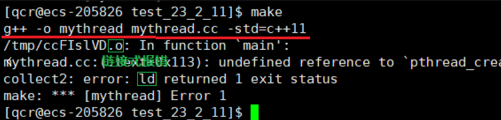
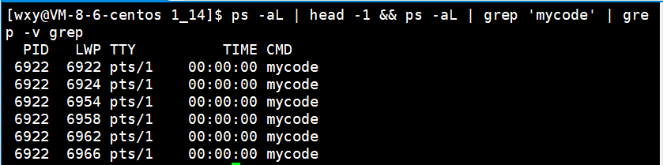

# 什么是多线程

## 目录

-   [Linux中线程概念的建立](#Linux中线程概念的建立)
    -   [Linux特有的方案](#Linux特有的方案)
    -   [重新理解进程](#重新理解进程)
        -   [1. 从资源角度理解。](#1-从资源角度理解)
        -   [2. 进程和线程的关系：](#2-进程和线程的关系)
        -   [3. 从CPU视角下理解](#3-从CPU视角下理解)
-   [总结](#总结)
-   [pthread 线程库](#pthread-线程库)
    -   [介绍](#介绍)
    -   [创建简易线程 - 加深理解](#创建简易线程---加深理解)
        -   [使用](#使用)
-   [总结](#总结)
    -   [线程的优点
        ](#线程的优点)
    -   [线程的缺点](#线程的缺点)

&#x20;**线程在进程内部执行，是操作系统调用的基本单位。**

> **#问：** ​**什么是线程**
>
> -   在一个程序里的一个执行路线就叫做线程（thread）。更准确的定义是：线程是 “一个进程内部的控制序列”
> -   一切进程至少都有一个执行线程
> -   线程在进程内部运行，本质是在进程地址空间内运行
> -   在Linux系统中，在CPU眼中，看到的PCB都要比传统的进程更加轻量化
> -   透过进程虚拟地址空间，可以看到进程的大部分资源，将进程资源合理分配给每个执行流，就形成了线程执行流
>
> **进一步说：** 一种执行流，比进程执行粒度更细、更轻量化、创建和终止都更轻、资源占用更少、调用成本更低 —— 就是线程。

***

## Linux中线程概念的建立

#### **Linux特有的方案**

> 在对应的进程内可以创建多个线程，那么也就意味着，系统当中如果存在着大量的进程，也就可能会存在着大量的线程。所以，这么说来操作系统就需要为了管理线程而创建特定的数据结构，来先描述，再组织。
>
> 以此，填充其的属性、设置其的字段、维护其的关系、上下文保存、代码的执行、线程结构的创建与删除……。但是可以发现这个操作是与进程的逻辑是非常类似的，所以Linux再专门为线程设置无疑就是有些浪费 —— 在内核上Linux并没有区分进程和线程。所有的进程与线程都用task\_struct来统一表示，只不过进程具有独立地址空间，线程和进程共享地址空间，以最少的代码达到实现线程的效果。

***

### **重新理解进程**

#### **1.** **从资源角度理解。**

> 曾经我们所说的：进程 = 该进程对应的内核数据结构 + 该进程对应的代码和数据。其实也是对的，只不过那是在用户的视角下。并且，概念升级 -> 内核数据结构的PCB可以不只一份。
>
> 

> 进程的创建，是第一个PCB，也就是刚创建，资源是没有的。是需要自己创建内核数据结构，构建对应的代码和数据。而线程是进程创建好了，再创建第二、三……个PCB，后面的数据也就没有必要创建了，而是将老概念中的进程的资源分配给其。更直接的来说：线程是被进程 "养" 的，资源从最开始的进程来。

> 所以在内核的视角下：进程 = 承担分配系统资源的基本实体。
>
> 

***

#### 2. **进程和线程的关系：**


-   **理解上：**
    -   进程：通过地址空间 **->** 通过页表映射 **->** 内存代码和数据 **<-** 磁盘。这些行为全部是在向操作系统申请资源。（以进程的身份！）
    -   进程：向操作系统将资源要完了，线程不再向操作系统索要了，而是向进程来要。
        &#x20; 操作系统看来，找他索要资源的不是线程，而是以进程为单位来申请的 —— 系统分配资源的基本单位是进程。

> **#问：** ​**如何理解曾经我们所写的所有代码？**
>
> -   曾经：内部只有一个执行流的进程。
> -   现在：内部具有多个执行流的的进程。

（曾经是现在的子集）

> **Note：**
>
> > **进程**  **=** **是一大批的执行流（至少有一个）+ 地址空间 + 页表等内核数据结构 + 该进程对应的代码和数据。**
>
> -   整体以基本单位的形式来向操作系统申请对应的资源。
> -   以前所说的一个PCB仅仅是一个进程内的执行流。
> -   当有多个PCB的时候 -> 多个执行流 -> 整体是一个进程 -> 称作为：单进程多线程程序。
>
> **Note：**
>
> > **task\_struct**：进程内部的一个执行流。

***

#### 3. 从**CPU视角下**理解

在操纵系统下因为线程，多了一些结构，概念也就发生了转变。但是站在CPU调度的视角下，CPU调度的时候，其是不受任何影响的，因为CPU调度的时候其运行队列里全部都task\_struct。CPU也就不怎么关心当前是进程还是线程的概念，其只认task\_struct。无论进程内部只有一个执行流还是有多个执行流，CPU都是以task\_struct为单位进行调度的。

> **融汇贯通的理解：**
>
> CPU实际上：调用的不是进程，而是调用的task\_struct结构体。
>
> **Note：**
>
> CPU调用的基本单位是：**"线程"**

-   Linux中没有真正的线程，但windows中有真正的线程。（windows为了管理线程而创建特定的数据结构）
-   Linux中没有的线程是由进程来模拟实现的。

> 于是：在Linux下，PCB <= 其他操纵系统内的PCB  ——  Linux下的进程：统一称作为，**轻量级进程**。因为，CUP可能拿到的是一个：
>
> 1.  独立线程的进程的PCB。**（=）**
> 2.  多线程的进程的某一个PCB。**（<）**

***

## 总结

> Linux没有真正意义上的线程结构，因为Linux没有为线程专门设计对应的数据结构。Linux是用进程PCB模拟的线程。

> 在Linux中，不再严格的区分进程和线程：统一叫做轻量级进程。

> 无非就是，一个进程内部只有一个执行流，就对应别的操作系统的单进程；一个进程内部有多个执行流，就对应别的操作系统的多线程。也就是说：Linux用一套方案对应别的操作系统的两套方案。

> 也就导致：Linux并不能直接给我们提供线程相关的接口，只能提供轻量级进程的接口.

-   **Note：**
    > 线程在进程内部执行，是操作系统的基本单位：
    >
    > 线程在进程的地址空间内运行。
    >
    > CPU其实不关心执行流是进程还是线程，只关心PCB（task\_struct）

**创建一个进程：**

-   要与当前父进程共享地址空间：   创建轻量级进程。
-   不要与当前父进程共享地址空间：创建进程，子进程。

***

# **pthread 线程库**

## **介绍**

> 对于操作系统的讲解，也就是进程与线程，没有什么所谓的轻量型进程。用户相对于不关心什么轻量型进程的，用户就是想创建进程 / 创建线程，这也是操作系统教材中的讲解。只能提供轻量级进程的接口，无疑就是有点恶心人的，于是Linux做了一种方案（使得操作更简单易懂）。

> 在用户层实现了一套用户多线程方案，以库的方式提供给用户进行使用：**pthread 线程库 -- 原生线程库**。**（只要是Linux就自带）pthread 线程库会帮我们按照轻量级进程的接口的方式，帮我们创建对应的进程，包括轻量级进程。**（模拟出线程）

***

## **创建简易线程 - 加深理解**

#### **使用**

(由于自是认识多线程，这里只说最基础的接口)


```c++
#include <pthread.h>
// 创建一个新线程
int pthread_create (pthread_t *thread, const pthread_attr_t *attr, void *(*start_routine) (void *), void *arg);

 参数： 
   thread：              线程id
   attr：                线程属性
 - 不用管，默认就可以。
   start_routine：       函数指针
 - 一个线程要执行进程的代码一部份 —> 代码一部份对应的入口函数
   arg：                 传递给函数指针的参数 
  
 返回值： 
- 成功时，返回0；
- 出现错误时，它返回一个错误码，并且*thread的内容未定义。

```

**错误检查:**

-   传统的一些函数是，成功返回0，失败返回-1，并且对全局变量errno赋值以指示错误。
-   pthreads函数出错时不会设置全局变量errno（而大部分其他POSIX函数会这样做）。而是将错误代码通过返回值返回。
-   pthreads同样也提供了线程内的errno变量，以支持其它使用errno的代码。对于pthreads函数的错误，建议通过返回值来判定，因为读取返回值要比读取线程内的errno变量的开销更小。

> **Note:**
>
> &#x20;我们所使用的**pthread 线程库**，属于用户层线程库，所以是一个第三方的库。
>
> -   第一方：语言
> -   第二方：操作系统接口
> -   第三方：其他人写的库
>
> s**pthread 线程库**也可以认为是操作系统自带的，但是也是不属于C/C++的。所以gcc/g++编译的时候，必须引入对应的选项来包含链接这个库：**-lpthread**
>
> 
>
> -   **如果不包含：** 会报以下错误
>
>     
>
>     **error**\*\*：找不到 "pthread\_create"，说明我们的链接有问题。\*\*​

-   以前的多进程叫做：父进程和子进程。现在的多线程叫做：主线程和新线程。

    主线程创建线程：新线程根据回调函数跑过去调用，主线程继续向后执行。
    ```c++
    #include <iostream>
    #include <string>
    #include <pthread.h>
    #include <unistd.h>
     
    void* threadRun(void* args)
    {
        const std::string name = (char*)args;
        while(true)
        {
            std::cout << name << ", pid" << getpid() << std::endl;
            sleep(6);
        }
    }
     
    int main()
    {
        pthread_t tid[5];
        char name[64];
        for(int i = 0; i < 5; ++i)
        {
            snprintf(name, sizeof(name), "%s - %d", "thread", i + 1);
            pthread_create(tid + 1, nullptr, threadRun, name);
            sleep(1); // 缓解传参的BUG
        }
     
        while(true)
        {
            std::cout << "main thread, pid: " << getpid() << std::endl;
            sleep(6);
        }
     
        return 0;
    }
    ```
    编译之后有先确定是否链接上库：

    `ldd` 命令，您可以查看一个可执行文件或共享库文件所依赖的动态链接库的路径。它会列出可执行文件或共享库文件所需要的动态链接库文件的名称以及它们的路径。

    `ldd <file>`

    

    

    可以发现全部都为一个pid —— 线程在进程内部运行。

    我们使用 ps axj 查进程的时候，会发现只有一个进程。

    

    也就是说，在用户层面上的我们看到的只有一个进程，可是执行的时候有6个执行流。其实系统帮我们创建的轻量级进程以` ps -aL` 才能看见。**（-L才看见轻量级进程的选项）**

    

    &#x20;

    **LWP(Lightweight process)** **：** 轻量级进程对应的pid。

    

    其中**PID与LWP一样的就叫做主进程**。

    

    所以操作系统CPU调用时，调度的是LWP，因为PID与轻量级进程的对应关系是1 **:** n —— 曾经所说的，单进程看PID，其实是与看LWP是一样的（因为值本身就一样），但是现在要清楚：看的其实是LWP。

    我们使用 kill -9 pid 将一个进程杀掉，实际上是所有执行流一起退出。

    

    &#x20; 并且，我们再查也没有多余的执行流

    
    > **#问****：为什么利用9号信号杀死对应的进程，其对应的所有执行流也终止了？** ​
    >
    > 因为其对应的执行流，全是该进程所 "养" 的，所有线程的资源全是进程给的。进程被干掉了，对应的资源也就被回收了，其下的线程就没有资源给予运行，于是就终止了 —— 进程被终止，操作系统会自动将其他线程终止。

> **#问：** ​**线程如何看待进程内部的资源？**
>
> -   **进程和线程：**
>     -   进程是资源分配的基本单位
>     -   线程是调度的基本单位
> -   线程共享进程数据，但也拥有自己的一部分数据：（**红色**为重点 - 线程的动态属性）
>     -   <font color="red" size="3.5">线程ID</font>
>     -   <font color="red" size="3.5">一组寄存器</font>（线程的上下文，线程是调度的基本单位，一个线程被CPU调度，其一定会生成私有的上下文）
>     -   <font color="red" size="3.5">栈</font>（每一个线程在运行的时候，要调用不同的函数，即一定涉及到入栈出栈，形成的临时变量需要保存在栈中）
>     -   errno
>     -   信号屏蔽字
>     -   调度优先级（因为是调度的基本单位）
>
> 进程的多个线程共享同一地址空间，因此代码段、数据都是共享的，如果定义一个函数，在各线程中都可以调用，如果定义一个全局变量，在各线程中都可以访问到。即：加上其他，各线程共享以下进程资源和环境：
>
> -   文件描述符表（当进程的fid\[3]被占，即线程打开文件fid\[3]也被占，只能4、5……）
> -   每种信号的处理方式(SIG\_ IGN、SIG\_ DFL或者自定义的信号处理函数)
> -   当前工作目录
> -   用户id和组id
> -   代码区
>     ```c++
>     #include <iostream>
>     #include <string>
>     #include <cstdio>
>     #include <unistd.h>
>     #include <pthread.h>
>              
>      // 验证代码区是共享的 —— 函数可以使用
>      void show(const std::string &name)
>     {
>         std::cout << name << ", pid: " << getpid() << " " << std::endl;
>     }
>              
>     void* threadRun(void* args)
>     {
>         const std::string name = (char*)args;
>         while(true)
>         {
>             show(name);
>             sleep(6);
>         }
>     }
>              
>     int main()
>     {
>         pthread_t tid[5];
>         char name[64];
>         for(int i = 0; i < 5; ++i)
>         {
>             snprintf(name, sizeof(name), "%s - %d", "thread", i + 1);
>             pthread_create(tid + 1, nullptr, threadRun, (void*)name);
>             sleep(1); // 缓解传参的BUG
>         }
>              
>         while(true)
>         {
>             std::cout << "main thread, pid: " << getpid() << std::endl;
>             sleep(6);
>         }
>              
>         return 0;
>     }
>     ```
> -   已初始化数据区和未初始化数据区（如：全局变量可以在线程中使用）
>     ```c++
>     #include <iostream>
>     #include <string>
>     #include <cstdio>
>     #include <unistd.h>
>     #include <pthread.h>
>              
>     // 验证已初始化数据区是共享的 —— 全局变量可以使用
>     int x = 100;
>              
>     void* threadRun(void* args)
>     {
>         const std::string name = (char*)args;
>         while(true)
>         {
>             std::cout << name << ", pid: " << getpid() << " " << x << std::endl;
>             sleep(6);
>         }
>     }
>              
>     int main()
>     {
>         pthread_t tid[5];
>         char name[64];
>         for(int i = 0; i < 5; ++i)
>         {
>             snprintf(name, sizeof(name), "%s - %d", "thread", i + 1);
>             pthread_create(tid + 1, nullptr, threadRun, (void*)name);
>             sleep(1); // 缓解传参的BUG
>         }
>              
>         while(true)
>         {
>             std::cout << "main thread, pid: " << getpid() << std::endl;
>             sleep(6);
>         }
>              
>         return 0;
>     }
>     ```
> -   堆区（malloc可以被其他线程访问，但是由于对堆空间使用需要起始地址，而起始地址一般在线程函数中。于是其他线程没有地址，于是没办法访问 —— 是可以访问的，但是我们默认为是私有的，当然了利用全局变量也就可以访问了）
> -   共享区
> -   环境变量命令行参数


> **#问：** CPU不认识是进程还是线程，它只看PCB，那为什么说线程切换的成本更低？
>
> 因为，若是调用一个进程内的若干个线程。地址空间、页表都不需要切换。如果，CPU调度的时候是不同的进程，就要整体将CPU内部的相关的上下文临时数据 + 页表、地址空间全部进行切换。所以线程的切换成本更低。
>
> > **融汇贯通的理解：** &#x20;
> >
> > 一个执行流在被调度的时候，其对应的地址空间、页表、其对应的PCB，它们的对应的地址，是需要被加载到CPU内部的寄存器的。也就是说对应几个地址的存储只是需要几个寄存器。


> **#问**：为什么页表、地址空间这些少量寄存器存储地址会成本很高？
>
> 其实根本原因是：CPU内部有硬件级别的缓存 —— cache，CPU内部是有L1 \~ L3 cache。    &#x20;
>
> 也就是说：CPU在进行寻址的时候，其每一次去获取指令的时候，每一次都需要向内存里去找对应的指令、代码。这就是一次访存的过程，访存的时候，因为 "距离远" 而且内存的速度会比CPU的速度慢很多，所以每一读取一条指令就要，向内存进行访存行为 —— 导致整机的系统的效率非常低。
>
> 所以，当我们实际CPU在读取指令的时候，不像我们想的一样，读一条指令加载一条指令（这样太慢了），所以CPU内有缓存，如：访问一条指令的时候，其会将下面的很多指令同时cache到CPU的缓存当中，该行为也称作： 预读 （以局部性原理的方式预读进入）。

**线程：**

所以，正因为CPU有这样的特性，当我们执行进程内多线程时，预读有的代码、数据，一定程度上有概率可以优化线程访问的速度。即线程需访问的代码、数据在CPU的缓冲已有。

**进程：**

如果，进程切换cache就立即失效，新进程过来，只能重新缓存。

***

# **总结**

线程的优点

-   创建一个新线程的代价要比创建一个新进程小得多
-   与进程之间的切换相比，线程之间的切换需要操作系统做的工作要少很多
-   线程占用的资源要比进程少很多
-   能充分利用多处理器的可并行数量
-   在等待慢速I/O操作结束的同时，程序可执行其他的计算任务
-   计算密集型应用，为了能在多处理器系统上运行，将计算分解到多个线程中实现
-   I/O密集型应用，为了提高性能，将I/O操作重叠。线程可以同时等待不同的I/O操作。

线程创建的时候轻量化，线程终止的时候轻量化，线程上下文切换的时候轻量化。

有一个程序，是用来加密密码的，也就是一个算法。现在需要我们加密10个G，于是将其分为10份，然后创建10个线程，每一个线程加载一份。 —— 计算密集型：任务大部分时间都在进行运算；IO密集型：任务大部分时间都在进行IO。

> **#问：** 线程说起来这么的好，那创建是不是越来越多越好？
>
> 并不是的，因为CPU还要进行线程的切换。虽然成本很低，但是依然有成本。一般创建线程的总数 = CPU的核数。

***

## **线程的缺点**

-   性能损失（不关键，主要是线程多少的问题）
    -   一个很少被外部事件阻塞的计算密集型线程往往无法与共它线程共享同一个处理器。如果计算密集型线程的数量比可用的处理器多，那么可能会有较大的性能损失，这里的性能损失指的是增加了额外的同步和调度开销，而可用的资源不变。
-   健壮性降低（关键，一个线程出现问题很容易影响另一个线程）
    -   编写多线程需要更全面更深入的考虑，在一个多线程程序里，因时间分配上的细微偏差或者因共享了不该共享的变量而造成不良影响的可能性是很大的，换句话说线程之间是缺乏保护的。最经典的就是主线程挂掉，其他新线程必挂掉。（大部分是能力问题，可以写出健壮性很强的程序的）
-   缺乏访问控制（关键）
    -   进程是访问控制的基本粒度，在一个线程中调用某些OS函数会对整个进程造成影响。**（程度取决于书写者）**
-   编程难度提高（关键）
    -   编写与调试一个多线程程序比单线程程序困难得多（程度取决于书写者）

**只要写的好，多线程的缺陷问题不大。**
