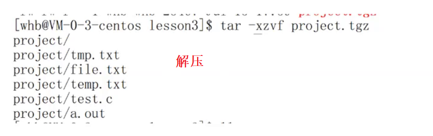

# Linux下基本指令

## 目录

-   [1. ls 指令](#1-ls-指令)
-   [2. pwd命令](#2-pwd命令)
-   [3. cd 指令](#3-cd-指令)
-   [4. mkdir指令（重要）](#4-mkdir指令重要)
-   [5. rmdir指令 && rm 指令（重要）](#5-rmdir指令--rm-指令重要)
-   [6. cp指令](#6-cp指令)
-   [ 7. mv指令（重要）](#-7-mv指令重要)
-   [8. cat](#8-cat)
-   [9. more指令](#9-more指令)
-   [10. less指令（重要）](#10-less指令重要)
-   [11. head指令](#11-head指令)
-   [12. tail指令](#12-tail指令)
-   [13. 时间相关的指令](#13-时间相关的指令)
-   [14. Cal指令](#14-Cal指令)
-   [15. find指令：（灰常重要） -name](#15-find指令灰常重要--name)
-   [16. grep指令](#16-grep指令)
-   [17. zip/unzip指令](#17-zipunzip指令)
-   [18. tar指令（重要）：打包/解包，不打开它，直接看内容](#18-tar指令重要打包解包不打开它直接看内容)
-   [19. bc指令：](#19-bc指令)
-   [20. 重要的几个热键\[Tab\],\[ctrl\]-c, \[ctrl\]-d](#20-重要的几个热键Tabctrl-c-ctrl-d)
-   [21. uname –r指令：](#21-uname-r指令)
-   [22. 关机](#22-关机)
-   [23. which](#23-which)
-   [24. echo](#24-echo)
-   [25. alias](#25-alias)
-   [26. xargs](#26-xargs)
-   [27. |](#27-)
-   [28. >](#28-)
-   [29. < ](#29--)
-   [30 stat](#30-stat)

Linux下一切皆文件!!


# 1. ls 指令

**语法**： ls \[选项]\[目录或文件]

功能：对于目录，该命令列出该目录下的所有子目录与文件。对于文件，将列出文件名以及其他信息。

常用选项：

-   a 列出目录下的所有文件，包括以 . 开头的隐含文件。
-   d 将目录象文件一样显示，而不是显示其下的文件。 如：ls –d 指定目录
-   i 输出文件的 i 节点的索引信息。 如 ls –ai 指定文件
-   k 以 k 字节的形式表示文件的大小。ls –alk 指定文件
-   l 列出文件的详细信息。
-   n 用数字的 UID,GID 代替名称。 （介绍 UID， GID）
-   F 在每个文件名后附上一个字符以说明该文件的类型，“ \*”表示可执行的普通文件；“/”表示目录；“@”表示符号链接；“|”表示FIFOs；“=”表示套接字(sockets)。（目录类型识别）
-   r 对目录反向排序。
-   t 以时间排序。
-   s 在l文件名后输出该文件的大小。（大小排序，如何找到目录下最大的文件）
-   R 列出所有子目录下的文件。(递归)
-   1 一行只输出一个文件。

`ls`是Linux中的一个常用指令，它用于列出当前目录下的文件和文件夹。

以下是使用`ls`指令的一些例子：

1.  列出当前目录下的所有文件和文件夹：
    ```c++
    ls
    ```
2.  列出当前目录下的所有文件和文件夹，并显示详细信息：
    ```c++
    ls -l
    ```
3.  列出当前目录下的所有文件、文件夹和隐藏文件，并显示详细信息：
    ```c++
    ls -al
    ```
4.  列出指定目录下的所有文件和文件夹，并显示详细信息：
    ```c++
    ls -l /path/to/directory
    ```

请注意，`ls`命令还有许多其他的选项和参数，您可以使用`man ls`查阅更多详细信息。

***

# 2. pwd命令

语法: pwd

功能：显示用户当前所在的目录

***

# 3. cd 指令

Linux系统中，磁盘上的文件和目录被组成一棵目录树，每个节点都是目录或文件。


语法:cd 目录名

功能：改变工作目录。将当前工作目录改变到指定的目录下。

举例

> cd .. : 返回上级目录

> cd /home/litao/linux/ : 绝对路径

> cd ../day02/ : 相对路径

> cd \~：进入用户家目

> cd -：返回最近访问目录

Linux中的cd指令用于切换当前工作目录。以下是使用cd指令的一些例子：

1.  切换到根目录：
    ```c++
    cd /
    ```
2.  切换到当前用户的主目录：
    ```c++
    cd ~
    ```
3.  切换到上一级目录：
    ```c++
    cd ...
    ```
4.  切换到指定目录：
    ```c++
    cd /path/to/directory
    ```
5.  返回最近访问目录

```c++
ls -l /path/to/directory
```

请注意，在Linux中，文件路径区分大小写。您需要根据实际情况输入准确的文件路径。

***

# 4. mkdir指令（重要）

**语法：** mkdir \[选项] dirname...

**功能：** 在当前目录下创建一个名为 “dirname”的目录

**常用选项：**

"mkdir -p" 是一个常用的命令，用于创建目录。参数"-p"表示递归创建目录，即如果要创建的目录的上级目录不存在，该命令会自动创建上级目录。

例如，如果您运行以下命令：

```c++
mkdir -p path/to/directory  递归建立多个目录

```

如果`/path`目录不存在，该命令会自动创建`/path`目录，然后再创建`/path/to`目录，最后创建`/path/to/directory`目录。这样可以确保在创建目录时，所有必要的上级目录都会被创建，而不会因为上级目录不存在而导致创建失败。

***

# 5. rmdir指令 && rm 指令（重要）

rmdir是一个与mkdir相对应的命令。mkdir是建立目录，而rmdir是删除命令。

**语法：** rmdir \[-p]\[dirName]

**适用对象：** 具有当前目录操作权限的所有使用者

**功能：** 删除空目录

**常用选项：**

-   -p 当子目录被删除后如果父目录也变成空目录的话，就连带父目录一起删除。

**rm命令可以同时删除文件或目录**

**语法：** rm \[-f-i-r-v]\[dirName/dir]

**适用对象：** 所有使用者

**功能：** 删除文件或目录

**常用选项：**

-   -f  选项表示强制删除，即使文件或目录是只读的或受保护的，也会被删除，而不会向用户发出警告或确认。
-   -i 删除前逐一询问确认
-   -r 选项表示递归删除，将删除目录及其所有子目录和文件。

***

# 6. cp指令

**语法**：cp \[选项] 源文件或目录 目标文件或目录

**功能:** 复制文件或目录

**说明:** cp指令用于复制文件或目录，如同时指定两个以上的文件或目录，且最后的目的地是一个已经存在的目录，则它会把前面指定的所有文件或目录复制到此目录中。若同时指定多个文件或目录，而最后的目的地并非一个已存在的目录，则会出现错误信息

**常用选项：**

-   -f 或 --force 强行复制文件或目录， 不论目的文件或目录是否已经存在
-   -i 或 --interactive 覆盖文件之前先询问用户
-   -r递归处理，将指定目录下的文件与子目录一并处理。若源文件或目录的形态，不属于目录或符号链接，则一律视为普通文件处理
-   -R 或 --recursive递归处理，将指定目录下的文件及子目录一并处理

***

# &#x20;7. mv指令（重要）

mv命令是move的缩写，可以用来移动文件或者将文件改名（move (rename) fifiles），是Linux系统下常用的命令，经常用来备份文件或者目录。

**语法:** mv \[选项] 源文件或目录 目标文件或目录

**功能:**

1.  视mv命令中第二个参数类型的不同（是目标文件还是目标目录），mv命令将文件重命名或将其移至一个新的目录中。
2.  当第二个参数类型是文件时，mv命令完成文件重命名，此时，源文件只能有一个（也可以是源目录名），它将所给的源文件或目录重命名为给定的目标文件名。
3.  当第二个参数是已存在的目录名称时，源文件或目录参数可以有多个，mv命令将各参数指定的源文件均移至目标目录中。

常用选项：

-   -f ：force 强制的意思，如果目标文件已经存在，不会询问而直接覆盖
-   -i ：若目标文件 (destination) 已经存在时，就会询问是否覆盖

***

# 8. cat

**语法**：cat \[选项]\[文件]

**功能**： 查看目标文件的内容

**常用选项**

-   -b 对非空输出行编号
-   -n 对输出的所有行编号
-   -s 不输出多行空行

***

# 9. more指令

**语法**：more \[选项]\[文件]

**功能**：more命令，功能类似 cat

**常用选项：**

-   -n 对输出的所有行编号
-   -q 退出more

`more` 是一个用于按页查看文本文件内容的命令行工具。它可以逐页显示文件的内容，以便更方便地浏览大型文件。要使用 `more` 命令，请打开终端并执行以下命令：

```c++
more [文件路径]
```

其中，`[文件路径]` 是您想要查看的文件的路径。

示例：

```c++
more /home/user/myfile.txt
```

在使用 `more` 命令后，您可以使用以下键盘按键来导航：

-   空格键（Space）：显示下一页内容。
-   Enter 键：显示下一行内容。
-   q 键：退出 `more` 命令。

请注意，在使用 `more` 命令时无法直接编辑文件，仅用于查看文件内容。如果您需要编辑文件，可以考虑使用其他编辑器，如 `nano` 或 `vim`。

查看多少行

```c++
more -(行数) [文件路径]
```

***

# 10. less指令（重要）

-   less 工具也是对文件或其它输出进行分页显示的工具，应该说是linux正统查看文件内容的工具，功能极其强大。
-   less 的用法比起 more 更加的有弹性。在 more 的时候，我们并没有办法向前面翻， 只能往后面看
-   但若使用了 less 时，就可以使用 \[pageup]\[pagedown] 等按键的功能来往前往后翻看文件，更容易用来查看一个文件的内容！
-   除此之外，在 less 里头可以拥有更多的搜索功能，不止可以向下搜，也可以向上搜。

**语法：** less \[参数] 文件

**功能：**

less与more类似，但使用less可以随意浏览文件，而more仅能向前移动，却不能向后移动，而且less在查看之前不会加载整个文件。

选项：

-   -i 忽略搜索时的大小写
-   -N 显示每行的行号
-   /字符串：向下搜索“字符串”的功能
-   ?字符串：向上搜索“字符串”的功能
-   n：重复前一个搜索（与 / 或 ? 有关）
-   N：反向重复前一个搜索（与 / 或 ? 有关）
-   q:quit

***

# 11. head指令

head 与 tail 就像它的名字一样的浅显易懂，它是用来显示开头或结尾某个数量的文字区块，head 用来显示档案的开头至标准输出中，而 tail 想当然尔就是看档案的结尾

**语法：** head \[参数]... \[文件]...&#x20;

**功能：** head 用来显示档案的开头至标准输出中，默认head命令打印其相应文件的开头10行。

选项：

-   **-n<行数> 显示的行数**

***

# 12. tail指令

tail 命令从指定点开始将文件写到标准输出.使用tail命令的-f选项可以方便的查阅正在改变的日志文件,tail -f fifilename会把fifilename里最尾部的内容显示在屏幕上,并且不但刷新,使你看到最新的文件内容.

\*\*语法： \*\*tail\[必要参数]\[选择参数]\[文件]&#x20;

**功能：** 用于显示指定文件末尾内容，不指定文件时，作为输入信息进行处理。常用查看日志文件

**选项：**

-   -f 循环读取
-   -n<行数> 显示行数

**举例：**（简单讲解重定向和管道）

> 有一个文件共有100行内容，请取出第50行内容\<br>

> seq 1 100 > test # 生成1到100的序列装入test

> 方法1 head -n50 test > tmp #将前50行装入临时文件tmp

> tail -n1 tmp #得到中建行

> 方法2 head -n50 test | tail -n1 ( | 管道)

***

# 13. 时间相关的指令

date显示

date 指定格式显示时间： date +%Y:%m:%d

date 用法：date \[OPTION]... \[+FORMAT]

1.  **在显示方面，使用者可以设定欲显示的格式，格式设定为一个加号后接数个标记，其中常用的标记列表如下**

-   %H : 小时(00..23)
-   %M : 分钟(00..59)
-   %S : 秒(00..61)
-   %X : 相当于 %H:%M:%S
-   %d : 日 (01..31)
-   %m : 月份 (01..12)
-   %Y : 完整年份 (0000..9999)
-   %F : 相当于 %Y-%m-%d

1.  **在设定时间方面**

-   date -s //设置当前时间，只有root权限才能设置，其他只能查看。
-   date -s 20080523 //设置成20080523，这样会把具体时间设置成空00:00:00
-   date -s 01:01:01 //设置具体时间，不会对日期做更改
-   date -s “01:01:01 2008-05-23″ //这样可以设置全部时间
-   date -s “01:01:01 20080523″ //这样可以设置全部时间
-   date -s “2008-05-23 01:01:01″ //这样可以设置全部时间
-   date -s “20080523 01:01:01″ //这样可以设置全部时间

1.  **时间戳**

时间->时间戳：date +%s

时间戳->时间：date -d\@1508749502

Unix时间戳（英文为Unix epoch, Unix time, POSIX time 或 Unix timestamp）是从1970年1月1日（UTC/GMT的午夜）开始所经过的秒数，不考虑闰秒

***

# 14. Cal指令

cal命令可以用来显示公历（阳历）日历。公历是现在国际通用的历法，又称格列历，通称阳历。“阳历”又名“太阳历”，系以地球绕行太阳一周为一年，为西方各国所通用，故又名“西历”。

**命令格式：** cal \[参数]\[月份]\[年份]

**功能：** 用于查看日历等时间信息，如只有一个参数，则表示年份(1-9999)，如有两个参数，则表示月份年份

**常用选项：**

-   -3 显示系统前一个月，当前月，下一个月的月历
-   -j 显示在当年中的第几天（一年日期按天算，从1月1号算起，默认显示当前月在一年中的天数）
-   -y 显示当前年份的日历

**举例**：

```c++
Cal –y 2018
```

***

# 15. find指令：（灰常重要） -name

-   Linux下fifind命令在目录结构中搜索文件，并执行指定的操作。
-   Linux下fifind命令提供了相当多的查找条件，功能很强大。由于fifind具有强大的功能，所以它的选项也很多，其中大部分选项都值得我们花时间来了解一下。
-   即使系统中含有网络文件系统( NFS)，fifind命令在该文件系统中同样有效，只你具有相应的权限。
-   在运行一个非常消耗资源的fifind命令时，很多人都倾向于把它放在后台执行，因为遍历一个大的文件系统可能会花费很长的时间(这里是指30G字节以上的文件系统)。

***

**语法**： fifind pathname -options

**功能：** 用于在文件树种查找文件，并作出相应的处理（可能访问磁盘）

**常用选项：**

-   -name 按照文件名查找文件

***

# 16. grep指令

**语法：** grep \[选项] 搜寻字符串 文件

**功能：** 在文件中搜索字符串，将找到的行打印出来

**常用选项：**

`grep` 是一个强大的命令行工具，用于在文件中搜索匹配特定模式的行，并将匹配到的行输出到终端。

要使用 `grep` 命令，请打开终端并执行以下命令：

```c++
grep [选项] 模式 [文件路径]
```

其中，`[选项]` 是可选的，用于提供更多功能。`模式` 是要搜索的模式或正则表达式。`[文件路径]` 是要在其中搜索模式的文件路径。如果未提供文件路径，则 `grep` 将从标准输入中读取数据。

示例：

```c++
grep "keyword" myfile.txt
```

这将在名为 `myfile.txt` 的文件中搜索包含关键字 “keyword” 的行，并将匹配到的行输出到终端。

以下是一些常用的选项：

-   `-i`：忽略大小写，不区分大小写地搜索模式。
-   `-r`：递归搜索，搜索指定目录下的所有文件和子目录。
-   `-v`：反向匹配，输出不包含模式的行。亦即显示出没有 '搜寻字符串' 内容的那一行
-   `-n`：显示匹配行的行号。
-   `-l`：仅显示匹配到模式的文件名，而不显示匹配到的行。
-   `-w`：仅匹配整个单词，而不是模式的部分匹配。

***

# 17. zip/unzip指令

**语法：** zip 压缩文件.zip 目录或文件

**功能：** 将目录或文件压缩成zip格式

**常用选项：**

-   -r 递 归处理，将指定目录下的所有文件和子目录一并处理

**举例：**

> 将test2目录压缩：zip test2.zip test2/\*

> 解压到tmp目录：unzip test2.zip -d /tmp

***

# 18. tar指令（重要）：打包/解包，不打开它，直接看内容

tar \[-cxtzjvf] 文件与目录 ....参数：

**参数：**

-   -c ：建立一个压缩文件的参数指令(create 的意思)；
-   -x ：解开一个压缩文件的参数指令！
-   -t ：查看 tarfifile 里面的文件！
-   -z ：是否同时具有 gzip 的属性？亦即是否需要用 gzip 压缩？
-   -j ：是否同时具有 bzip2 的属性？亦即是否需要用 bzip2 压缩？
-   -v ：压缩的过程中显示文件！这个常用，但不建议用在背景执行过程！
-   -f ：使用档名，请留意，在 f 之后要立即接档名喔！不要再加参数！
-   -C ： 解压到指定目录





***

# 19. bc指令：

bc命令可以很方便的进行浮点运算

***

# 20. 重要的几个热键\[Tab],\[ctrl]-c, \[ctrl]-d

-   \[Tab]按键---具有『命令补全』和『档案补齐』的功能
-   \[Ctrl]-c按键---让当前的程序『停掉』
-   \[Ctrl]-d按键---通常代表着：『键盘输入结束(End Of File, EOF 戒 End OfInput)』的意思；另外，他也可以用来取代exit

***

# 21. uname –r指令：

**语法：** uname \[选项]

**功能：** uname用来获取电脑和操作系统的相关信息。

**补充说明**：uname可显示linux主机所用的操作系统的版本、硬件的名称等基本信息。

**常用选项：**

-   -a或–all 详细输出所有信息，依次为内核名称，主机名，内核版本号，内核版本，硬件名，处理器类

型，硬件平台类型，操作系统名称

***

# 22. 关机

**语法：**shutdown \[选项] \*\* 常见选项：\*\* ​

-   -h ： 将系统的服务停掉后，立即关机。
-   -r ： 在将系统的服务停掉之后就重新启动
-   -t sec ： -t 后面加秒数，亦即『过几秒后关机』的意思

***

# 23. which

`which` 是一个命令行工具，用于定位给定命令的可执行文件路径。

当您在终端上输入一个命令时，系统会通过 `PATH` 环境变量中定义的路径遍历来搜索要执行的命令。`which` 命令会显示找到的第一个命令的完整路径。

要使用 `which` 命令，请打开终端并执行以下命令：

```c++
which [命令]
```

其中，`[命令]` 是要查找路径的命令名。

示例：

```c++
which is
```

这将显示 `ls` 命令的完整路径，例如 `/bin/ls`。

`which` 命令通常在查找特定命令的位置时很有用。它显示了解释器在调用命令时将执行的确切路径。如果系统上有多个命令符合指定名称，`which` 将显示找到的第一个匹配项。

请注意，`which` 命令只显示可执行命令的路径.

***

# 24. echo

`echo` 是一个常用的命令行工具，用于在终端上显示文本或变量的内容。

`echo` 命令的基本语法如下：

```c++
echo [选项] [文本/变量]
```

其中，`[选项]` 是可选的，用于提供更多功能。`[文本/变量]` 是要显示的文本或变量。

示例：

```c++
echo "Hello, World!"
```

这将在终端上显示文本 “Hello, World!”。

`echo` 命令的常用选项包括：

-   `-n`：禁止输出结尾的换行符。这在你想要在同一行上输出多个内容时很有用。
-   `-e`：启用转义字符的解释，可用于显示特殊字符。例如，`echo -e "Line1\nLine2"` 将显示两行文本，每行一个换行符。

***

# 25. alias

`alias` 是一个命令行指令，用于创建自定义命令别名。

在终端中，可以使用 `alias` 命令将长而复杂的命令或一系列命令关联到简单的别名上，以便更方便地使用它们。这样，当您输入别名时，实际上会执行与该别名关联的命令。

`alias` 命令的基本语法如下：

```c++
alias [别名]='命令'
```

其中，`[别名]` 是您要创建的自定义命令的别名，`'命令'` 是与别名关联的实际命令。

示例：

```c++
 alias zhangsan='ls -al' //给命令起别名

```

要删除一个别名，可以使用unalias命令，其语法如下：

`unalias [选项] [别名名称]`

其中，\[别名名称] 是要删除的别名的名称。

例如，要删除之前创建的名为 “zhangsan” 的别名，可以使用以下命令：

`unalias zhangsan`

执行以上命令后，该别名就会被删除，以后再输入 “`zhangsan`” 就不会触发对应的命令了。

另外，要删除所有的别名，可以使用以下命令：

`unalias -a`

执行以上命令后，所有的别名都会被删除。请注意，这个操作是不可逆的，谨慎使用。

***

# 26. xargs

`xargs` 是一个命令行工具，用于从标准输入或文件中读取数据，并将其作为参数传递给指定的命令。

`xargs` 的基本语法如下：

```c++
xargs [选项] [命令]
```

其中，`[选项]` 是可选的，用于提供更多功能。`[命令]` 是要执行的命令。

`xargs` 从标准输入或文件中读取数据，并将其分割成适当的参数，并将这些参数传递给指定的命令进行处理。默认情况下，`xargs` 使用空格作为分隔符。

示例：

```c++
 echo "-l -a -i" | xargs s //将管道的输出结果，作为命令行参数，交给后面的程序
```

将管道的输出结果，作为命令行参数，交给后面的程序

`xargs` 与管道 `|` 一起使用时尤为有用，它可以将一个命令的输出作为另一个命令的输入，并对其进行处理。

***

# 27. |

`|` 是一个特殊的命令行操作符，称为管道（pipe）。它用于将一个命令的输出作为另一个命令的输入，实现两个或多个命令之间的数据传递。

使用 `|` 管道符的基本语法如下：

```c++
command1 | command2
```

其中，`command1` 和 `command2` 是要执行的两个命令。

***

# 28. >

`>` 是一个重定向操作符，在命令行中用于将命令的输出重定向到文件。

使用 `>` 操作符的基本语法如下：

```c++
command > file
```

其中，`command` 是要执行的命令，`file` 是要将输出重定向到的文件名。

示例：

```c++
echo "Hello, World!" > output.txt
```

这个例子中，`echo "Hello, World!"` 命令将字符串 “Hello, World!” 输出到标准输出，然后使用 `>` 操作符将输出重定向到名为 `output.txt` 的文件中。如果 `output.txt` 文件不存在，将创建该文件；如果文件已存在，将覆盖原有内容。

您还可以使用 `>>` 操作符将输出追加到文件的末尾，而不是覆盖文件的内容。示例：

```c++
echo "This is a new line." >> output.txt
```

这个示例中，`echo "This is a new line."` 命令将字符串 “This is a new line.” 输出到标准输出，然后使用 `>>` 操作符将输出追加到 `output.txt` 文件的末尾。

`>` 和 `>>` 操作符可用于将命令的输出重定向到任意文件，以便将输出保存到文件中，或作为其他命令的输入。

需要注意的是，使用 `>` 操作符时会覆盖文件的内容，慎重使用。如果要同时将输出重定向到文件并在屏幕上显示，请结合使用 `tee` 命令。

`>>` 命令是追加重定向

***

# 29. <&#x20;

`<` 是一个输入重定向操作符，在命令行中用于将文件的内容作为输入重定向给命令。

使用 `<` 操作符的基本语法如下：

```c++
command < file
```

其中，`command` 是要执行的命令，`file` 是要将其内容作为输入的文件名。

示例：

```c++
cat < input.txt
```

这个例子中，`cat` 命令会从名为 `input.txt` 的文件中读取内容，

使用 `<` 操作符可以将文件的内容直接传递给命令，而无需手动键入内容或使用管道。

需要注意的是，`<` 操作符用于将文件内容输入到命令中，而不是将命令的输出重定向到文件。

***

# 30 stat

stat命令用于显示文件或文件系统的详细状态信息。它提供了关于文件的权限、所有者、大小、时间戳等信息。以下是stat命令的基本用法：

stat \[选项] 文件名

其中，\[选项] 是一些可选的参数，文件名指定要检查的文件或目录。

以下是一些常用的选项：

-   `-c` 或 `--format`：指定输出格式。
-   `-f` 或 `--file-system`：显示文件的文件系统信息。
-   `-t` 或 `--terse`：使用简洁的格式显示输出。
-   `-L` 或 `--dereference`：对于符号链接，显示链接指向的文件的信息。
-   `-s` 或 `--print-size`：显示文件的大小。

例如，要显示文件 “example.txt” 的详细信息，可以使用以下命令：

```c++
stat example.txt
```

stat查看后的ACM是什么！？

在`stat`命令的输出中，ACM表示文件的访问、变更和修改时间。这些时间戳提供了关于文件的时间相关信息。

具体来说，ACM分别代表以下时间：

-   `A：Access Time`，文件的访问时间，指的是最后一次读取文件的时间。
-   `C：Change Time`，文件的变更时间，指的是最后一次更改文件属性（权限、所有者、链接等）的时间。
-   `M：Modification Time`，文件的修改时间，指的是最后一次修改文件内容的时间。

这些时间戳是文件系统在处理文件时自动更新的，可以用来追踪文件的访问和修改历史。在使用`stat`命令时，你可以查看这些时间戳以了解文件的时间相关信息。

Linux下一切皆文件!!

Linux下一切皆文件!!
