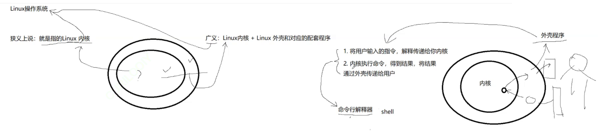
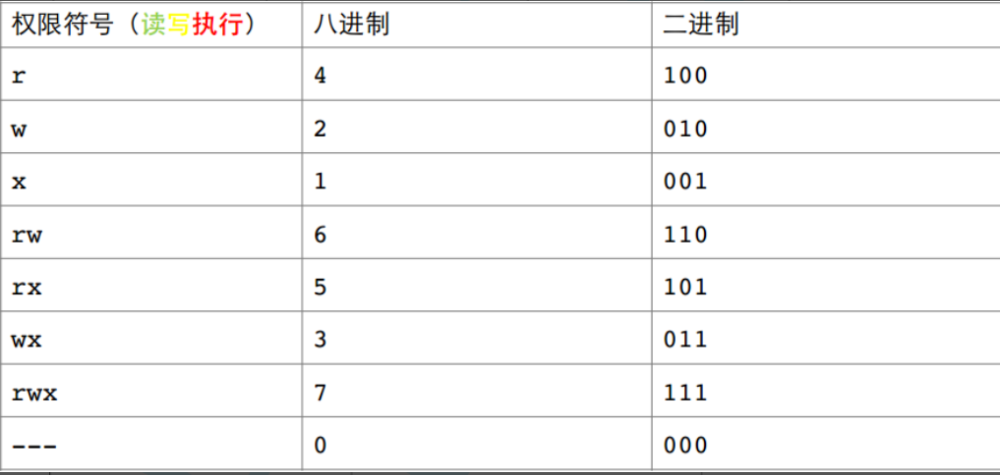

# Linux权限

## 目录

-   [shell命令以及运行原理](#shell命令以及运行原理)
-   [Linux权限的概念](#Linux权限的概念)
    -   [Linux权限管理](#Linux权限管理)
        -   [01.文件访问者的分类（人）](#01文件访问者的分类人)
        -   [02.文件类型和访问权限（事物属性）](#02文件类型和访问权限事物属性)
        -   [a) 文件类型](#a-文件类型)
        -   [b)基本权限](#b基本权限)
        -   [03.文件权限值的表示方法](#03文件权限值的表示方法)
            -   [文件访问权限的相关设置方法](#文件访问权限的相关设置方法)
            -   [a)chmod](#achmod)
            -   [b)chown](#bchown)
            -   [c)chgrp](#cchgrp)
            -   [d)umask](#dumask)
            -   [使用 sudo分配权限](#使用-sudo分配权限)
-   [目录的权限](#目录的权限)
-   [关于权限的总结](#关于权限的总结)

# shell命令以及运行原理

Linux严格意义上说的是一个操作系统，我们称之为“核心（kernel）“ ，但我们一般用户，不能直接使用kernel。而是通过kernel的“外壳”程序，也就是所谓的shell，来与kernel沟通。如何理解？为什么不能直接使用kernel？

> *Shell命令是在操作系统的命令行界面或脚本中使用的一组指令，用于与操作系统进行交互并执行各种任务。Shell（外壳）是操作系统提供的一种用户界面，它接收用户的命令并将其传递给操作系统内核进行处理。*



操作系统提供的 → 外壳程序&#x20;
外壳程序的意义:

&#x20;1\. 是用户和操作系统交互中间软件层

&#x20;2.可以在一定程度，起到保护操作系统的作用

从技术角度，Shell的最简单定义：命令行解释器（command Interpreter）主要包含

-   将使用者的命令翻译给核心（kernel）处理。
-   同时，将核心的处理结果翻译给使用者。

**对比windows GUI**，我们操作windows 不是直接操作windows内核，而是通过图形接口，点击，从而完成我们的操作（比如进入D盘的操作，我们通常是双击D盘盘符.或者运行起来一个应用程序）。

**shell 对于Linux**，有相同的作用，主要是对我们的指令进行解析，解析指令给Linux内核。反馈结果在通过内核运行出结果，通过shell解析给用户.

**Shell命令的运行原理如下：**

1.  用户在命令行中输入命令。
2.  操作系统的Shell解释器接收到命令并进行解析。如有错误直接反馈给用户.
3.  Shell解释器将命令分解为命令名称和参数，并确定要执行的程序或内置命令。
4.  Shell解释器调用操作系统的API（应用程序接口）来执行命令。
5.  操作系统内核根据命令类型执行相应的操作，可能涉及文件操作、进程管理、网络通信等。
6.  命令执行完成后，Shell解释器将结果返回给用户并等待下一个命令。

***

# Linux权限的概念

**Linux下有两种用户：超级用户（root）、普通用户.**

-   超级用户：可以再linux系统下做任何事情，不受限制
-   普通用户：在linux下做有限的事情。
-   超级用户的命令提示符是“#”，普通用户的命令提示符是“\$

**权限(主体，重点)**

> &#x20;对人操作
> root: 只有一个，具有Linux下的最高权限(一般不受权限约束)

> 普通用户:可以有多个，要受权限的约束
> root < --切换-- >普通用户，潜台词就是在切换我当前的权限 !

> Linux下可以同时存在多个用户Linux是一个多用户操作系统!

**命令**：su \[用户名]

**功能：** 切换用户。

**例如**: 要从root用户切换到普通用户user，则使用 su user。 要从普通用户user切换到root用户则使用 su root（root可以省略），此时系统会提示输入root用户的口令。

`su`命令（Switch User）是在Linux和Unix操作系统中用于切换用户身份的命令。它允许当前用户（通常是普通用户）切换到其他用户（通常是超级用户或其他已存在的用户）。`su`命令通常需要超级用户（例如root用户）或具有特定权限的用户才能执行。

`su`命令的基本语法是：

```c++
su [选项] [用户名]
```

常见的选项包括：

-   `-`: 不改变环境变量，使用新用户的环境变量。
-   `-c <指令>`: 在切换用户的同时执行指定的命令。

使用`su`命令的一般步骤如下：

1.  打开终端或命令行界面。
2.  输入`su`命令，后跟要切换到的用户名（如果没有指定用户名，则默认为root用户）。
3.  如果当前用户有权限切换到指定的用户，并且提供了正确的密码，就会成功切换到该用户。
4.  输入被要求的密码（如果需要）。
5.  成功切换到指定的用户后，命令提示符将会更改为目标用户的提示符。现在可以执行需要特权用户身份才能执行的操作。
6.  如果需要退出并返回原来的用户身份，可以输入`exit`命令。


***

## Linux权限管理

### **01.文件访问者的分类（人）**

-   文件和文件目录的所有者：u---User（中国平民 法律问题）
-   文件和文件目录的所有者所在的组的用户：g---Group（不多说）
-   其它用户：o---Others （外国人）

拥有者:文件属于谁 -u
所属组:文件属于哪一个组 -g
other:不属于上面两种的任何一个，就是other -o

### **02.文件类型和访问权限（事物属性）**


### **a) 文件类型**

-   d：文件夹&#x20;
-   -：普通文件
-   l：软链接（类似Windows的快捷方式）
-   b：块设备文件（例如硬盘、光驱等）
-   p：管道文件
-   c：字符设备文件（例如屏幕等串口设备）
-   s：套接口文件


显示的第一列的第一个字符，表明该文件的文件类型

Linux下，不以文件后缀来区分文件类型(并不代表不可以使用，在系统层面没意义，给自己看的.但是在Linux安装的程序比如Vim 是要区分文件后缀的。

### **b)基本权限**


-   i.读（r/4）：Read对文件而言，具有读取文件内容的权限；对目录来说，具有浏览该目录信息的权限
-   ii.写（w/2）：Write对文件而言，具有修改文件内容的权限；对目录来说具有删除移动目录内文件的权限
-   iii.执行（x/1）：execute对文件而言，具有执行文件的权限；对目录来说，具有进入目录的权限
-   iv.“—”表示不具有该项权限

### **03.文件权限值的表示方法**

a)字符表示方法


b)8进制数值表示方法



***

***

#### 文件访问权限的相关设置方法

#### **a)chmod**

**功能：** 设置文件的访问权限

**格式：** chmod \[参数] 权限 文件名

**常用选项：**

-   R -> 递归修改目录文件的权限
-   说明：只有文件的拥有者和root才可以改变文件的权限

**chmod命令权限值的格式**

① 用户表示符+/-=权限字符

+:向权限范围增加权限代号所表示的权限

\-:向权限范围取消权限代号所表示的权限

\=:向权限范围赋予权限代号所表示的权限

用户符号：&#x20;

-   u：拥有者
-   g：拥有者同组用
-   o：其它用户
-   a：所有用户

实例：

```c++
chmod u-rwx test

chmod u+rwx test

chmod a+rwx test

chmod a=x test

```

②三位8进制数字

**实例：** ​**命令权限**

```c++
chmod 777 test  //全部改成rwx

chmod 500 test //把u改成 r-x  g和o 变 --- ---

chmod 000 test //全部权限改成 ---
```

***

#### **b)chown**

**功能：** 修改文件的拥有者

**格式：** chown \[参数] 用户名 文件名

**实例：**

```c++
# chown user1 test
# chown wxy test
```

#### **c)chgrp**

**功能：** 修改文件或目录的所属组

**格式：** chgrp \[参数] 用户组名 文件名

**常用选项：**-R 递归修改文件或目录的所属组

**实例：**

```c++
# charp user1 test
# chown wxy test
```

**没有权限是什么样子的?**

> Permission denied

root不受权限的约束

**那可以把把文件要回来吗？**

> Sure,


如果用户想执行sudo，提升权限，需要该用户在信任列表里面，才可以执行sudo，添加用户到信任列表是需要root身份的!


***

总结:**操作**

1.  改人

> chown chgrp 更改拥有者或者所属组需要提升权限

1.  改属性

> chmod +- 八进制方按

***


#### d)umask

**功能：** 查看或修改文件掩码,凡是在umask中出现的权限都不应该在最终权限中出现!

新建文件夹默认权限=0666

新建目录默认权限=0777

但实际上你所创建的文件和目录，看到的权限往往不是上面这个值。原因就是创建文件或目录的时候还要受到umask的影响。假设默认权限是mask，则实际创建的出来是文件权限是: mask & (\~umask)

**格式：** umask 权限值

**说明：** 将现有的存取权限减去权限掩码后，即可产生建立文件时预设权限。超级用户默认掩码值为0022，普通用户默认为0002。

```c++
# umask 755
# umask //查看
# umask 044//设置
```

**文件权限: mask & (\~umask)**

1.  目录起始权限是从 777，普通文件起始权限从666
2.  最终权限 = 起始权限&  (\~umask)  **mask & (\~umask)**

实例:

```c++
umask 0777
```

umask先对自己 0777按位取反得 `000 000 000`

mask 0777:   `111 111 111`

&#x20;              &

umask :        `000 000 000`

&#x20;     结果：`000 000 000`  权限全为0. 即 - - - - - - - - -

***

#### 使用 sudo分配权限

> sudo（superuser do）是一种在Linux和Unix系统中使用的命令，允许授予普通用户临时获得超级用户（root）权限的能力。这样，用户可以在需要执行需要管理员权限的任务时临时获得权限，而不必一直以超级用户身份登录。使用sudo命令时，用户需要输入自己的密码来验证身份。一旦用户通过验证，他们可以在一定时间内以root用户的身份执行特权操作。

**格式：** 接受权限的用户登陆主机 =（执行命令的用户） 命令

1.  使用 sudo 调用授权的命令

```c++
＄ sudo –u 用户名 命令
```

**实例:**

```c++
＄sudo -u root /usr/sbin/useradd
```

***

# 目录的权限

-   可执行权限: 如果目录没有可执行权限, 则无法cd到目录中.
-   可读权限: 如果目录没有可读权限, 则无法用ls等命令查看目录中的文件内容.
-   可写权限: 如果目录没有可写权限, 则无法在目录中创建文件, 也无法在目录中删除文件.

于是, 问题来了\~\~

换句话来讲, 就是只要用户具有目录的写权限, 用户就可以删除目录中的文件, 而不论这个用户是否有这个文件的写

权限.

这好像不太科学啊, 我张三创建的一个文件, 凭什么被你李四可以删掉? 我们用下面的过程印证一下.

```c++
[root@localhost ~]# chmod 0777 /home/
[root@localhost ~]# ls /home/ -ld 
drwxrwxrwx. 3 root root 4096 9月 19 15:58 /home/
[root@localhost ~]# touch /home/root.c
[root@localhost ~]# ls -l /home/

总用量 4
-rw-r--r--. 1 root root 0 9月 19 15:58 abc.c
drwxr-xr-x. 27 litao litao 4096 9月 19 15:53 litao
-rw-r--r--. 1 root root 0 9月 19 15:59 root.c

[root@localhost ~]# su - litao
[litao@localhost ~]$ rm /home/root.c #litao可以删除root创建的文件
rm：是否删除有写保护的普通空文件 "/home/root.c"？y

[litao@localhost ~]$ exit 
logout
```

为了解决这个不科学的问题, Linux引入了粘滞位的概念

**粘滞位**


```c++
[root@localhost ~]# chmod +t /home/ # 加上粘滞位
[root@localhost ~]# ls -ld /home/
drwxrwxrwt. 3 root root 4096 9月 19 16:00 /home/

[root@localhost ~]# su - litao
[litao@localhost ~]$ rm /home/abc.c #litao不能删除别人的文件
rm：是否删除有写保护的普通空文件 "/home/abc.c"？y
rm: 无法删除"/home/abc.c": 不允许的操作
```

当一个目录被设置为"粘滞位"(用chmod +t),则该目录下的文件只能由

> 一、超级管理员删除

> 二、该目录的所有者删除

> 三、该文件的所有者删除

***

# 关于权限的总结

-   目录的可执行权限是表示你可否在目录下执行命令。
-   如果目录没有-x权限，则无法对目录执行任何命令，甚至无法cd 进入目, 即使目录仍然有-r 读权限（这个地方很容易犯错，认为有读权限就可以进入目录读取目录下的文件）
-   而如果目录具有-x权限，但没有-r权限，则用户可以执行命令，可以cd进入目录。但由于没有目录的读权限
-   所以在目录下，即使可以执行ls命令，但仍然没有权限读出目录下的文档。
