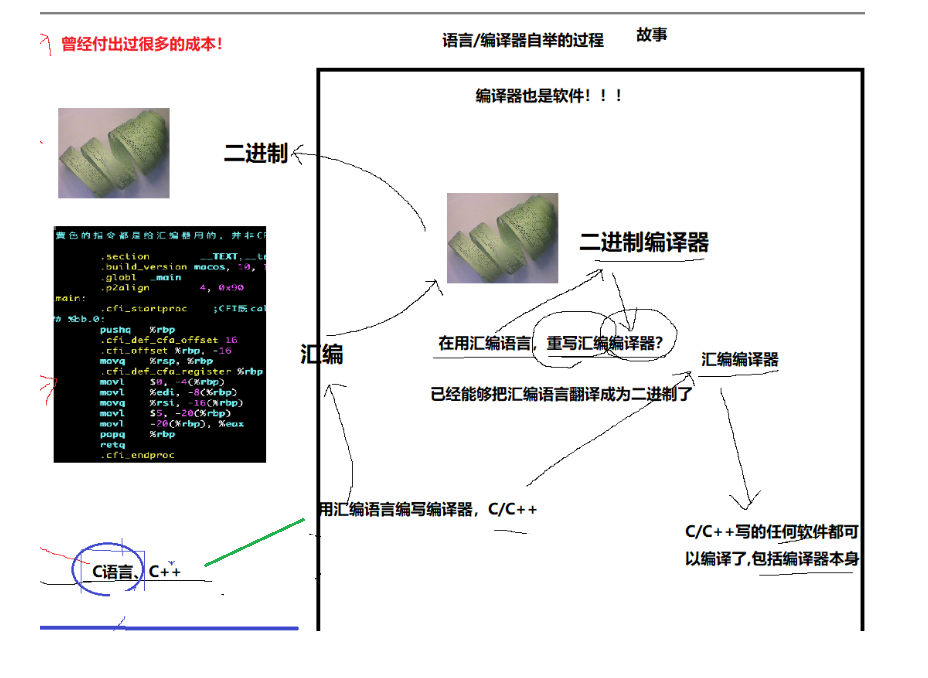

# Linux开发工具使用

## 目录

-   [Linux编辑器-vim使用](#Linux编辑器-vim使用)
    -   [vim的基本操作](#vim的基本操作)
    -   [vim正常模式命令集](#vim正常模式命令集)
    -   [vim视图模式](#vim视图模式)
    -   [vim替换模式](#vim替换模式)
    -   [vim末行模式命令集](#vim末行模式命令集)
-   [vim的基本配置](#vim的基本配置)
    -   [基础配置---初步理解vim配置的原理](#基础配置---初步理解vim配置的原理)
    -   [直接自动化部署配置](#直接自动化部署配置)
-   [Linux编译器-gcc/g++使用](#Linux编译器-gccg使用)
    -   [程序的编译过程](#程序的编译过程)
        -   [预处理](#预处理)
        -   [编译](#编译)
        -   [汇编](#汇编)
        -   [链接](#链接)
        -   [gcc选项记忆](#gcc选项记忆)
        -   [函数库](#函数库)
        -   [动静态库概念与理解](#动静态库概念与理解)
-   [Linux 软件包管理器 yum](#Linux-软件包管理器-yum)
-   [git ](#git-)
-   [Linux调试器-gdb使用](#Linux调试器-gdb使用)
-   [项目自动化构建工具-make/Makefile](#项目自动化构建工具-makeMakefile)
    -   [文件的ACM时间](#文件的ACM时间)
    -   [makefile语法扩展](#makefile语法扩展)
        -   [原理](#原理)
-   [Linux第一个小程序－进度条](#Linux第一个小程序进度条)
    -   [进度条代码](#进度条代码)

# Linux编辑器-vim使用

## vim的基本操作


-   **进入vim,在系统提示符号输入vim及文件名称后，就进入vim全屏幕编辑画面:**

> `$ vim test.c`

> 不过有一点要特别注意，就是你进入vim之后，是处于\[正常模式]，你要切换到\[插入模式]才能够输入文字。

-   **\[正常模式]切换至\[插入模式]**

> 输入a  ： 在光标后一个插入

> 输入i  ：&#x20;

> 输入o  ：切换到下一行插入

-   **\[插入模式]切换至\[正常模式]**

> 目前处于\[插入模式]，就只能一直输入文字，如果发现输错了字,想用光标键往回移动，将该字删除，可以先按一下「ESC」键转到\[正常模式]再删除文字。当然，也可以直接删除。

-   **\[正常模式]切换至\[末行模式]**

> 「shift + ;」, 其实就是输入「:」

-   **退出vim及保存文件,在\[正常模式]下，按一下「:」冒号键进入「Last line mode」,例如:**

> : w （保存当前文件）

> ：w! (强制保存当前文件)

> : wq (输入「wq」,存盘并退出vim)

> : q! (输入q!,不存盘强制退出vim)

***

## vim正常模式命令集

-   **插入模式**

> 按「i」切换进入插入模式「insert mode」，按“i”进入插入模式后是从光标当前位置开始输入文件；

> 按「a」进入插入模式后，是从目前光标所在位置的下一个位置开始输入文字；

> 按「o」进入插入模式后，是插入新的一行，从行首开始输入文字.

-   **从插入模式切换为命令模式**

> 按「ESC」键。

-   **移动光标**

> h ,j , k, l:   左，下， 上， 右

> shift + 6(^):将光标定位到当前行的最开始

> shift + 4(\$):将光标定位到当前行的最结尾

> w,b:  以单词为单位进行光标的前后移动

> shift + g:光标定位到文件的结尾

> gg:光标定位到文件的最开始

> n + shift + g:光标定位到文件的任意行

> o 插入一行

-   **删除文字**

> x 每按一次，删除光标所在位置的一个字符

> 「#x」：例如，「6x」表示删除光标所在位置的“后面（包含自己在内）”6个字符

> 「X」：大写的X，每按一次，删除光标所在位置的“前面”一个字符

> 「#X」：例如，「20X」表示删除光标所在位置的“前面”20个字符

> dd: 将当前光标所在的行，剪切(删除)  支持ndd

> \#dd：从光标所在行开始删除#行

> dd+P 剪切 &#x20;

-   **复制**

> yy: 将当前光标所在的行复制  支持nyy

> p:将复制行进行粘贴  支持：np

-   **替换**

> 「r」：替换光标所在处的字符。 支持nr

> 「R」：替换光标所到之处的字符，直到按下「ESC」键为止。

-   **撤销上一次操作**

> u:撤销操作

> ctrl +r:撤销u操作

-   **跳至指定的行**

> 「ctrl」+「g」列出光标所在行的行号。

> 「#G」：例如，「15G」，表示移动光标至文章的第15行行首

-   其他

> shift \~  按着不动大小写转换

***

## vim视图模式

> ctrl + v 进入视图模式   VISUAL BLOCK

> 批量化注释  ctrl+v → j/k两个按键上下选中区域 → shift + i(I) → // → Esc

> 批量化删除注释: ctrl+v → hjkl 选中区域 → +d 即可

***

## vim替换模式

> shift+r  替换模式

***

## vim末行模式命令集

> set no/取消行号  set nu 打开行号

> vs 文件名:分屏操作,  无论你打开多少个文件，光标只有一个! 光标在哪一个区域，表示当前正在编辑哪一个文件，一切以光标为主!!   ctrl + w 文件光标切换  小技巧: vim file +n 打开文件时候可以指定光标锁定在第几行

> w:写入，w!

> q:退出，q!

> :!cmd:不退出vim执行对应的命令(执行命令行，编译，运行， 查看man)等 !强制执行

> /关键字  查找字符， 如果不是第一次查找的关键字+n可以往下查找

> \#表示一个数子 ，比如输入15，直接跳到15行

***

# vim的基本配置

## 基础配置---初步理解vim配置的原理

1.  vim在启动的时候，会自动扫描当前用户的家目录下的`.vimrc`,让`.vimrc`内部的选项生效
2.  vim配置，其实核心就是向`.vimrc`里面添加更多的配置选项即可
3.  vim 可能会需要各种插件

***

## 直接自动化部署配置

1.  直接下载别人的各种插件。
2.  如果还想新增功能，向`.vimrc`里面添加更多的配置选项即可

[ HGtz2222/VimForCpp 快速将vim打造成c++ IDE https://gitee.com/HGtz2222/VimForCpp?%20from=gitee%20search](https://gitee.com/HGtz2222/VimForCpp?%20from=gitee%20search " HGtz2222/VimForCpp 快速将vim打造成c++ IDE https://gitee.com/HGtz2222/VimForCpp?%20from=gitee%20search")

***

***

# Linux编译器-gcc/g++使用

-   背景知识

电路只认识二进制

> 早期时候只有二进制纸带编程，然后出现了汇编，但是汇编怎么要转换成二进制呢？那就是二进制编译器，把汇编转成二进制。在后来诞生了C/C++，但是C/C++怎么要转换成二进制呢? 在用汇编语言重写汇编编译器，把C/C++转换成汇编，汇编在转换成二进制，所有C/C++写的任何软件都可以编译了,包括编译器本身。 如果直接使用C/C++转成二进制会付出很大代价.



## 程序的编译过程

> 格式 gcc \[选项] 要编译的文件 \[选项] \[生成目标文件]

### 预处理

预处理完依然还是C/C++语言

1.  头文件展开
2.  去注释
3.  条件编译 (预处理指令是以#号开头的代码行)

    &#x20; i. 通过条件编译，可以实现对代码的动态裁减，
4.  宏替换


```c++
gcc –E code.c –o code.i
```

选项“-E”,该选项的作用是让 gcc 在预处理结束后停止编译过程

选项“-o”是指目标文件,“.i”文件为已经过预处理的C原始程序

***

### 编译

C/C++ → 成为汇编

1.  在这个阶段中,gcc 首先要检查代码的规范性、是否有语法错误等,以确定代码的实际要做的工作,在检查

无误后,gcc 把代码翻译成汇编语言

```c++
gcc –S code.i –o code.s
```

用户可以使用“-S”选项来进行查看,该选项只进行编译而不进行汇编,生成汇编代码。

***

### 汇编

汇编→ 可重定位二进制文件

1.  汇编阶段是把编译阶段生成的“.s”文件转成目标文件

```c++
gcc –c code.s –o code.o
```

***

### 链接

形成可执行文件

```c++
.o + 系统库 = 可执行程序

```

```c++
gcc  code.o -o mycode // 这样就可以生成可执行文件了
```

***

### gcc选项记忆

esc,iso例子

```c++
Es是大写的，c小写的就行了。  code.i code.s code.o => .iso
```

***

我们的代码+头文件+库=我们的可执行程序

-   [ ] 头文件和库都是文件!所以，所谓的开发环境安装，一定要做什么工作?怎么理解? ? 安装下载并拷贝头文件和库文件到开发环境中的特定路径下，一定要能被编译器自己找到!在这里涉及到一个重要的概念:函数库

### 函数库

-   [ ] 我们的C程序中，并没有定义“printf”的函数实现,且在预编译中包含的“stdio.h”中也只有该函数的声明,而没有定义函数的实现,那么,是在哪里实“printf”函数的呢?
-   [ ] 最后的答案是:系统把这些函数实现都被做到名为 libc.so.6 的库文件中去了,在没有特别指定时,gcc 会到

&#x20;   系统默认的搜索路径“/usr/lib”下进行查找,也就是链接到 libc.so.6 库函数中去,这样就能实现函数“printf”了,而这也就是链接的作用

&#x20;  libc.so.6  一般去掉前缀和后缀 称为C标准库

```c++
在Linux中后缀为  .so 动态库  .a 静态库 
```

```c++
在Windeows后缀为  .dll 动态库  lib 静态库
```

***

### 动静态库概念与理解

-   函数库一般分为静态库和动态库两种


```c++
ldd指令可以查看 可执行程序依赖的第三方库如 
ldd code.exe
```

-   静态库是指编译链接时,把库文件的代码全部加入到可执行文件中,因此生成的文件比较大,但在运行时也就不再需要库文件了。其后缀名一般为“.a”
-   动态库与之相反,在编译链接时并没有把库文件的代码加入到可执行文件中,而是在程序执行时由运行时

链接文件加载库,这样可以节省系统的开销。动态库一般后缀名为“.so”,如前面所述的 libc.so.6 就是动态

库。gcc 在编译时默认使用动态库。完成了链接之后,gcc 就可以生成可执行文件

-   gcc默认生成的二进制程序，是动态链接的

***

-   动态库:  是C/C++或者其他第三方提供的所有方法的集合被所有程序以链接的方式，关联起来
    动态链接. 库中所有的函数，都有入口地址， 所谓的动态链接，其实就是把要连接的库中的函数地址拷贝到我们的可执行程序的特定位置!  动态链接方式程序里保存的是相关代码的地址,但动态库没有加载到内存的地址是逻辑地址，以后后面有讲. 简单来说就是自己程序中所用到的库函数，将自己程序中所用到的库函数实现方法关联起来
-   静态库 :是C/C++或者其他第三方提供的所有方法的集合,被所有程序以拷贝的方式，将需要的代码，拷贝到自己的可执行程序中静态链接.简单来说就是将库函数所有实现方法以拷贝的方式链接到自己的代码中

动态链接优缺点:&#x20;

&#x20;1\.  优点:形成的可执行程序体积比较小，比较节省资源的!

1.  缺点:稍慢一些 强依赖动态库，动态库没了，所有的依赖这个库的程序都无法运行了

静态链接优

1.  优点: 无视库，可以独立运行&#x20;
2.  缺点: 体积太大，浪费资源

默认情况下，你们的云服务器是没有安装c静态库的，只有动态库，如果你要安装

```c++
C:  sudo yum install glibc-static
```

```c++
C++: sudo yum install sudo yum install -y libstdc++ -static
```


由此可见我们静态成为的链接比动态的空间大了60-70倍.所以大多数编译器是动态链接的.

我们的开发环境，默认都要为我们做什么

1.  下载开发环境 include，lib
2.  设置合理的查找路径
3.  规定好我们形成可执行程序的链接方式

***

# Linux 软件包管理器 yum

yum源:就是一个配置文件

`ls /etc/yum.repos.d`  repo理解为仓库

`sudo yum install -y epel-release`  下载 配置扩展文件


**什么是软件包**

-   在Linux下安装软件, 一个通常的办法是下载到程序的源代码, 并进行编译, 得到可执行程序.
-   但是这样太麻烦了, 于是有些人把一些常用的软件提前编译好, 做成软件包(可以理解成windows上的安装程序)放在一个服务器上, 通过包管理器可以很方便的获取到这个编译好的软件包, 直接进行安装.
-   软件包和软件包管理器, 就好比 "App" 和 "应用商店" 这样的关系.
-   yum(Yellow dog Updater, Modifified)是Linux下非常常用的一种包管理器. 主要应用在Fedora, RedHat,Centos等发行版上.

**关于 rzsz**

> 这个工具用于 windows 机器和远端的 Linux 机器通过 XShell 传输文件.

> 安装完毕之后可以通过拖拽的方式将文件上传过去

**查看软件包**

通过 yum list 命令可以罗列出当前一共有哪些软件包. 由于包的数目可能非常之多, 这里我们需要使用 grep 命令只筛选出我们关注的包. 例如

`yum list | grep lrzsz`

**结果如下:**

`lrzsz.x86_64            0.12.20-36.el7            @base`

@base 是出处

**注意事项:**

-   软件包名称: 主版本号.次版本号.源程序发行号-软件包的发行号.主机平台.cpu架构.
-   "x86\_64" 后缀表示64位系统的安装包, "i686" 后缀表示32位系统安装包. 选择包时要和系统匹配.
-   "el7" 表示操作系统发行版的版本. "el7" 表示的是 centos7/redhat7. "el6" 表示 centos6/redhat6.
-   最后一列, base 表示的是 "软件源" 的名称, 类似于 "小米应用商店", "华为应用商店" 这样的概念

**如何安装软件**

通过 yum, 我们可以通过很简单的一条命令完成 gcc 的安装.

`sudo yum install lrzsz`

yum 会自动找到都有哪些软件包需要下载, 这时候敲 "y" 确认安装.

出现 "complete" 字样, 说明安装完成.

**注意事项:**

-   安装软件时由于需要向系统目录中写入内容, 一般需要 sudo 或者切到 root 账户下才能完成.
-   yum安装软件只能一个装完了再装另一个. 正在yum安装一个软件的过程中, 如果再尝试用yum安装另外一个软件, yum会报错.
-   如果 yum 报错, 请自行百度.

**如何卸载软件**

仍然是一条命令:

`sudo yum remove lrzsz`

-   **yum 三板斧**

```c++
yum list   # yum listgrep | sl
```

```c++
yum install   # sudo yum install -y 安装软件
```

```c++
yum remove  #移除 你的软件
```

# git&#x20;

***

**安装 git**

`yum install git`

**仓库链接下载项目到本地**

创建好一个放置代码的目录:

`git clone [url]`

url就是 git 仓库链接

\*\*三板斧第一招: \*\***`git add`**

将代码放到刚才下载好的目录中

`git add [文件名]`    `git add . [文件名]`

添加我们的代码到本地仓库

**三板斧第二招: git commit**

提交改动到本地

`git commit -m  “这里必须写提交日志”` &#x20;

提交代码带仓库中,提交的时候应该注明提交日志, 描述改动的详细内容

\*\*三板斧第三招: \*\***`git push`**

**`git push`**

提交我们的代码到远端仓库,同步到远端服务器上

需要填入用户名密码. 同步成功后, 刷新 Gitee 页面就能看到代码改动

`git log` 提交的记录

-   其他情况

1.  可能第一次使用，需要你配置用户名和邮箱

`git config --global user.email "`[you@example.com](mailto:you@example.com "you@example.com")`" `

`git config --global `[user.name](http://user.name "user.name")` "Your Name"`

&#x20;" " 里面就是你要输入的

1.  有时候无法提交，会出现提交冲突
    无脑`git pull`
2.  gitignore # 不想提交某些后缀的文件同步到远端的git仓库，就可以添加到`.gitignore`
3.  git rm 可以删除

-   具体步骤

```c++
git rm  [所需删除的文件]
```

```c++
git add .
```

```c++
git commit -m "删除文件"    //" "里面可以写为什么删除
```

```c++
git push
```

需要填入用户名密码. 同步成功后, 刷新 Gitee 页面就能看到代码已删除

***

# Linux调试器-gdb使用

1.  **背景**

-   程序的发布方式有两种，debug模式和release模式
-   Linux gcc/g++出来的二进制程序，默认是release模式
-   要使用gdb调试，必须在源代码生成二进制程序的时候, 加上 -g 选项

gcc && gcc默认形成的可执行程序是release的!! 故无法直接被调试

`gcc mytest.c -o mytest-debug -g`  -g该程序是debug方式发布的!

如果你想让你的代码以debug方式发布，必须给gcc添加-g选项!

**开始使用**

-   gdb会记录最近一条命令，如果命令无变化，可以直接回车
-   quit: 退出gdp
-   r : :开始调试，如果没有设置断点，就直接运行结束
-   break (b) + 行号 : 给特定的行号打断点
-   info b: 查看断点   (并且可以查看断点的编号)
-   d+断点编号 : 删除断点
-   n:逐过程，类似于VsF10
-   s:逐语句，类似于VsF11
-   p 变量名 :打印变量内容
-   bt: 查看当前的调用堆栈
-   finish :  将当前函数跑完，就停下来
-   display 变量名：跟踪查看一个变量，每次停下来都显示它的值
-   undisplay：取消对先前设置的那些变量的跟踪
-   until: 跳转到指定行
-   continue(或c)： : 运行至下一个断点处停下来!
-   disable/enable 断点的编号: 使能(关闭和打开) 断点
-   set var：修改变量的值
-   list／l 行号：显示binFile源代码，接着上次的位置往下列，每次列10行。
-   list／l 函数名：列出某个函数的源代码。


***

# 项目自动化构建工具-make/Makefile

make:      是一个命令
makefile: 是一个在当前目录下存在的一个具有特定格式的文本文件


```c++
.PHONY    依赖方法总是会被执行，不会被任何情况拦截
```

如果不加`.PHONY`像上面 `mycode: code.c`  makefile和make总是不让我们重新编译我们的代码.

他可以 → 通过时间对比，可以做到不让有些代码进行重新编译(不让某些操作进行) 那他是怎么做到的呢？

1.  一个文件的修改时间
2.  时间其实不是本质，通过时间对比出来新旧才是本质!
3.  我们的源文件跟执行文件对比,能体现源文件新旧
4.  我们形成的可执行程序也是一个文件!重新编译的本质，不就是重新写入一个二进制可执行文件吗他的修改时间不是也会更改.

-

<!---->

    第一次的时候，一定是先有源文件,才有mycode文件

<!---->

    源文件的修改时间\<mycode文件的修改时间的

    

    如果我们再次make 是无法成功的

    

    因为此时的mycode是最新的了，只有源文件的修改时间 > mycode文件的修改时间才会编译成功


    第二/n次的时候，我们对源文件做任何修改的时候

    当源文件的修改时间 >mycode文件的修改时间 编译make重新形成可执行.

    

    

Linux的stat指令用于显示文件或文件系统的详细信息。

```c++
stat [选项] 文件名
```

### 文件的ACM时间


-   文件 = 内容加属性

    Access : 是通过访问文件来更新时间的

    Modify: 是通过修改文件内容来更新时间的

    Change: 是通过修改文件属性来更新时间的.（当然修改了文件内容，文件大小也会跟着改变，所以文件属性也会改变）

一般而言，一个文件被查看的频率是非常高的

我们所看到的文件，都在哪里存放着呢? 磁盘 文件= 内容+属性更改时间的本质:其实是访问磁盘!效率低下

Linux系统充满大量的访问磁盘的IO操作，变相的减慢系统效率

所以每次访问的话更改Access时间，会添加了次数限制

比如你cat 一个文件 Access时间修改了，你再多次cat可能并不会修改，因为accesstime添加了次数限制

***

make、makefile是具有依赖性的推导能力的


-

<!---->

    上面的文件 mybin ,它依赖 code.o

<!---->

    code.o, 它依赖code.s

    code.s , 它依赖 code.i

    code.i , 它依赖 code.c

严重不推荐!
直接用gcc形成可执行!

***

1.  makefile文件中，保存了编译器和链接器的参数选项，并且描述了所有源文件之间的关系。make程序会读取makefile文件中的数据，然后根据规则调用编译器，汇编器，链接器产生最后的输出。根据makefile的功能理解，A选项是正确的
2.  Makefile里主要包含了五个东西：显式规则、隐晦规则、变量定义、文件指示和注释， B选项是正确的
    -   显式规则说明了，如何生成一个或多个目标文件。
    -   make有自动推导的功能，所以隐晦的规则可以让我们比较粗糙地简略地书写makefile，比如源文件与目标文件之间的时间关系判断之类
    -   在makefile中可以定义变量，当makefile被执行时，其中的变量都会被扩展到相应的引用位置上，通常使用 \$(var) 表示引用变量
    -   文件指示。包含在一个makefile中引用另一个makefile，类似C语言中的include； 根据这一项可以推导D选项是错误的。
    -   注释，makefile中可以使用 # 在行首表示行注释

-   makefile中使用 .PHONY 来声明伪对象， .PHONY: clean。
-   make的执行规则是，只生成所有目标对象中的第一个，当然make会根据语法规则，递归生成第一个目标对象的所有依赖对象后再回头生成第一个目标对象，生成后退出。
-   make在执行makefile规则中，根据语法规则，会分析目标对象与依赖对象的时间信息，判断是否在上一次生成后，源文件发生了修改，若发生了修改才需要重新生成。
-   makefile中的伪对象表示对象名称并不代表真正的文件名，与实际存在的同名文件没有相互关系，因此伪对象不管同名目标文件是否存在都会执行对应的生成指令。伪对象的作用有两个，1. 使目标对象无论如何都要重新生成。2. 并不生成目标文件，而是为了执行一些指令

### makefile语法扩展

-   1

```c++
mycode: code.c       
       @gcc code.c -o mycode
       @echo "编译成功"
   .PHONY: clean       
    clean:              
       @rm -rf mycode  
       @echo "删除成功"
```

在Makefile中，@字符用于表示不显示命令本身，只显示命令的执行结果。当在命令行前添加@字符时，make将不会输出该命令本身，而只输出命令执行后的结果。这使得在Makefile中可以更加清晰地查看命令的执行结果，而不会受到命令本身的干扰。所有echo后令执行后的结果为编译成功....


-   2
-   还可以给文件名赋值

```c++
 cc = g++                      
 stc = code.c                  
 target = mycode               
                                
  $(target): $(stc)             
      $(cc) $(stc) -o $(target)
                       
  .PHONY: clean        
   clean:               
     rm -rf $(target)  
```

在Makefile中，\$()用于变量替换和函数调用。

-   3

```c++
mybin:code.c
  gcc $^ -o $@
PHONY:clean
 clean:
  rm -f mybin
```

在Makefile中，^和@ 是特殊的变量。

-   \$^: 代表所有的依赖项，也就是mybin冒号后面的所有文件，这里是code.c。
-   \$@: 代表目标文件，也就是mybin冒号前面的文件，这里是mybin。
-   4

```c++
cc=gcc
src=code.c
target=mybin

$(target):$(src)
  gcc $^ -o $@
.PHONY:clean
clean:
  rm -f $(target)
```

***

#### 原理

-   make是如何工作的,在默认的方式下，也就是我们只输入make命令。那么

1.  make会在当前目录下找名字叫“Makefile”或“makefile”的文件。
2.  如果找到，它会找文件中的第一个目标文件（target），在上面的例子中，他会找到“hello”这个文件，并把这个文件作为最终的目标文件。
3.  如果hello文件不存在，或是hello所依赖的后面的hello.o文件的文件修改时间要比hello这个文件新（可以用 touch 测试），那么，他就会执行后面所定义的命令来生成hello这个文件。
4.  如果hello所依赖的hello.o文件不存在，那么make会在当前文件中找目标为hello.o文件的依赖性，如果找到则再根据那一个规则生成hello.o文件。（这有点像一个堆栈的过程）
5.  当然，你的C文件和H文件是存在的啦，于是make会生成 hello.o 文件，然后再用 hello.o 文件声明

&#x20;     make的终极任务，也就是执行文件hello了。

1.  这就是整个make的依赖性，make会一层又一层地去找文件的依赖关系，直到最终编译出第一个目标文件。
2.  在找寻的过程中，如果出现错误，比如最后被依赖的文件找不到，那么make就会直接退出，并报错，

    而对于所定义的命令的错误，或是编译不成功，make根本不理。
3.  make只管文件的依赖性，即，如果在我找了依赖关系之后，冒号后面的文件还是不在，那么对不起，

    我就不工作啦

像clean这种，没有被第一个目标文件直接或间接关联，那么它后面所定义的命令将不会被自动执行，

不过，我们可以显示要make执行。即命令——“make clean”，以此来清除所有的目标文件，以便重编

译。

但是一般我们这种clean的目标文件，我们将它设置为伪目标,用 .PHONY 修饰,伪目标的特性是，总是被

执行的。

可以将我们的 hello 目标文件声明成伪目标，测试一下

***

# Linux第一个小程序－进度条

C语言中 \n 是代码换行+回车

C语言中 \r 是代表回车

回车是到达下一行的起点，换行是直接换到光标所处的下一行同一位置.


```c++
#include <stdio.h>
int main()
{
 printf("hello Makefile!");
 sleep(3);
 return 0;
}
```

这里会出现，printf输出的内容会在Sleep3秒后才打印出来的.因为printf的内容在输出缓冲区里面存储着，并没有马上更新出来。

解决方法:刷新缓冲区或者加一个\n.&#x20;

```c++
int main()
{
  printf("hello Makefile!");
  //printf("hello Makefile!\n");
  fflush(stdout);
  sleep(3);
  return 0;
}
```

C/C++语言，会针对标准输出，给我们提供默认的缓冲区
今天主默认打开三个缓冲区，输入，输出，文件缓冲区，在stdio.h包含


> fflush(stdout) 刷新输出缓冲区

> \n是一种刷新的策略--行刷新

### 进度条代码

-   简单的进度条代码
-   头文件

```c++
#pragma once

#include <stdio.h>
#include <string.h>
#include <unistd.h>

#define SIZE 101
#define MAX_RATE 100
#define STYLE '#'
#define STIME 1000*40

#define STYLE_BODY '='
#define STYLE_HEADER '>'

//typedef void (*callback_t)(int);
typedef void (*callback_t)(double);

void process_v1();
void process_v2(int);
void process_v3(double);
```

-   简单原理版本

```c++
const char *str="|/-\\";

void process_v1()
{
    // version 1
    int rate=0;
    //char bar[SIZE] = {0};
    char bar[SIZE];
    memset(bar, '\0', sizeof(bar));
    int num = strlen(str);

    while(rate <= MAX_RATE)
    {
        printf("[%-100s][%d%%][%c]\r", bar, rate, str[rate%num]);
        fflush(stdout);
        usleep(STIME);
        bar[rate++] = STYLE;
    }
    printf("\n");
}
```

-   实际工程实践版本

```c++
#define TARGET_SIZE 1024*1024 // 1MB
#define DSIZE 1024*10

 // main.c 
 结合场景来谈,v2.1
void download()
{
    int target = TARGET_SIZE;
    int total = 0;

    while(total < target)
    {
        usleep(STIME); // 用简单的休眠时间，模拟本轮下载花费的时间
        total += DSIZE;
        process_v2(total*100/target);
    }
    printf("\n");
}
int main()
{
  download();
}

 //process.c 

// 不能一次将进度条打印完毕，否则无法平滑的和场景结合
// 该函数，应该根据rate，自动的打一次
void process_v2(int rate)
{
    // version 2
    // TODO
    static char bar[SIZE]= {0}; 
    int num = strlen(str);
    if(rate <= MAX_RATE && rate >=0)
    {
        printf("[%-100s][%d%%][%c]\r", bar, rate, str[rate%num]);
        fflush(stdout);
        bar[rate] = STYLE;
    }
    if(rate == MAX_RATE) memset(bar, '\0', sizeof(bar));
}
```

-   加上C语言特色的版本

```c++
//main.c 
void download(callback_t cb)
{
    int testcnt = 100;
    int target = TARGET_SIZE;
    int total = 0;

    while(total <= target)
    {
        usleep(STIME); // 用简单的休眠时间，模拟本轮下载花费的时间
        total += DSIZE;
        double rate = total*100.0/target;
        if(rate > 50.0 && testcnt) {
            total = target/2;
            testcnt--;
        }
        cb(rate); // 回调函数
    }
    cb(MAX_RATE); // 回调函数
    printf("\n");
}


// 下载的软件
int main()
{
    download(process_v3);
    return 0;
}

//process.c
void process_v3(double rate)
{
    // version 2
    // TODO
    static char bar[SIZE]= {0};
    static int cnt = 0;
    int num = strlen(str);
    if(rate <= MAX_RATE && rate >=0)
    {
        cnt++;
        cnt = (cnt >= num ? 0 : cnt); //cnt %= num;
        printf("加载中... [\033[31;44m%-100s\033[0m][%.1f%%][%c]\r", bar, rate, str[cnt]);
        fflush(stdout);
        if(rate < MAX_RATE)
        {
            bar[(int)rate] = STYLE_BODY; //'='
            bar[(int)rate+1] = STYLE_HEADER; //'>'
        }
        else
        {
            bar[(int)rate] = STYLE_BODY;
        }
    }
    //if(rate == MAX_RATE) memset(bar, '\0', sizeof(bar));
}


```
