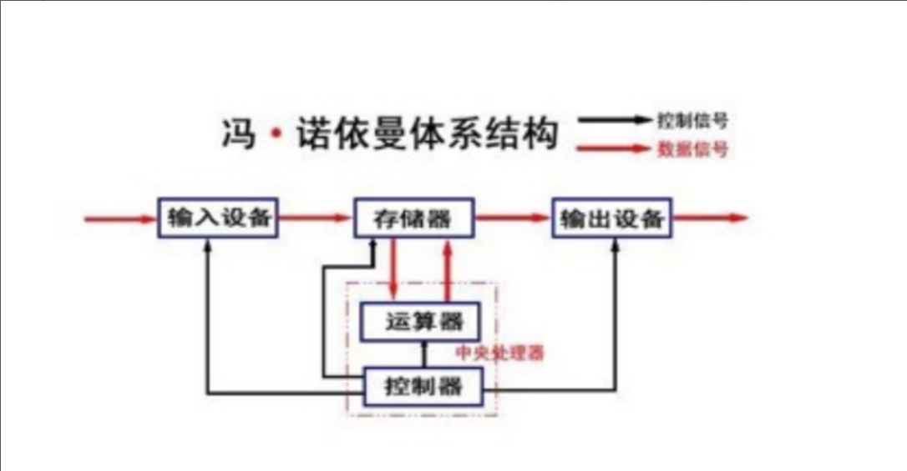
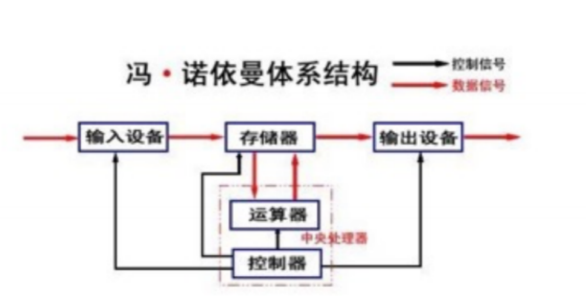
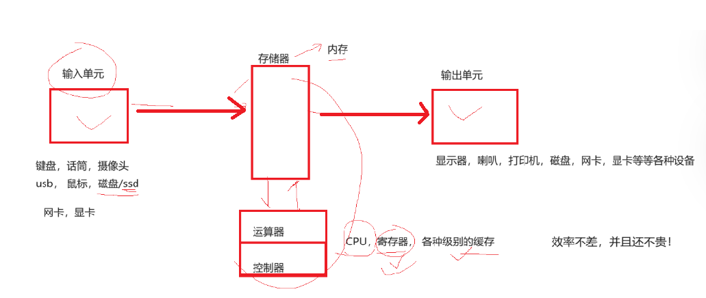
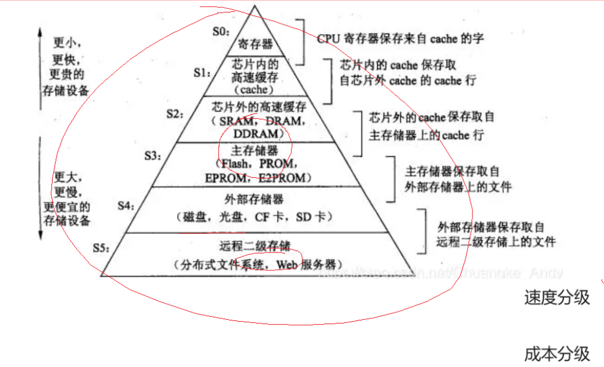
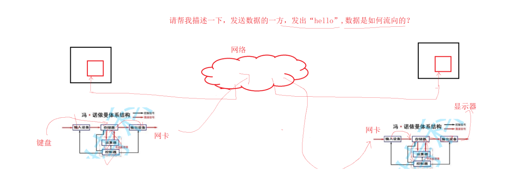

# 冯诺依曼体系结构

# 冯诺依曼体系结构

**冯·诺依曼体系结构的主要特点有：** (选读)

1.  存储器：计算机内部包含一个存储器单元，用于存放指令和数据。指令和数据在存储器中以二进制形式存储，并可被按需读取。
2.  中央处理器（CPU）：CPU负责执行指令并处理数据。它由算术逻辑单元（ALU）和控制单元（CU）组成。ALU执行算术和逻辑运算，而CU控制指令的执行顺序和数据的传输。
3.  控制流：冯·诺依曼计算机通过程序计数器（PC）来指示当前执行的指令位置。控制单元根据PC中存储的地址，将指令从存储器中取出，并按照顺序执行。
4.  数据通路：冯·诺依曼计算机中的数据通路用于在存储器、CPU和其他设备之间传输数据。数据通过数据总线进行传输，地址通过地址总线进行传输，而控制信号则通过控制总线进行传输。
5.  存储程序：冯·诺依曼计算机中的指令和数据都以二进制形式存储在存储器中。指令和数据可以按需从存储器中读取，使得程序能够被存储、传输和执行。

计算机里面的几乎所有的设备，都有数据存储的能力

CPU这个设备，它的处理数据的速度是非常快的然后是内存，然后是各种外设(磁盘)

> 磁盘外设，永久存储介质

以CPU为中心，距离cpu越近，存储效率越高，造价越贵!

冯诺依曼体系结构的计算机，本质:用比较少的钱，做出来效率不错的计算机

1.  **CPU读取数据(数据+代码),都是要从内存中读取。 站在数据的角度，我们认为CPU不和外设直接交互**
2.  **cpu要处理数据，需要先将外设中的数据，加载到内存。站在数据的角度，外设直接只和内存打交道**
3.  **其实内存就是一个硬 件基本大的缓存**

截至目前，我们所认识的计算机，都是有一个个的硬件组件组成

-   输入单元：包括键盘, 鼠标，扫描仪, 写板，网卡等
-   中央处理器(CPU)：含有

&#x20;       运算器 →算术运算，逻辑运算

&#x20;       控制器 →CPU是可以响应外部事件

-   输出单元：显示器，打印机，音响，网卡等

**关于冯诺依曼，必须强调几点**

-   这里的存储器指的是**内存**
-   不考虑缓存情况，这里的CPU能且只能对内存进行读写，不能访问外设(输入或输出设备)。
-   外设(输入或输出设备)要输入或者输出数据，**也只能写入内存**或者从内存中读取。
-   一句话，**所有设备都只能直接和内存打交道**。

程序在运行之前，必须的先加载到内存? 为什么? 程序=代码+数据，最终都CPU来执行处理 cpu需要先读取到这些代码和数据而CPU之和内存有“数据(二进制层面)”层面的交互，但是形成了一个exe，本质就是一个文件，只能在磁盘(外设)中保存

对冯诺依曼的理解，不能停留在概念上，要深入到对软件数据流理解上，请解释，从你登录上qq开始和某位朋友聊天开始，数据的流动过程。从你打开窗口，开始给他发消息，到他的到消息之后的数据流动过程。如果是在qq上发送文件呢？

***
