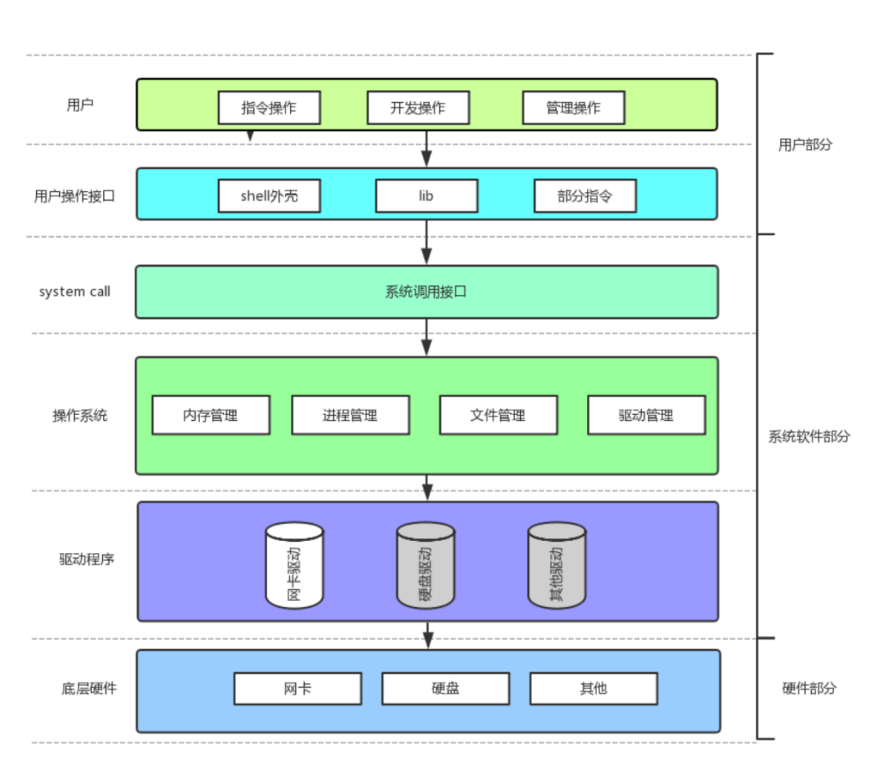

# 深入理解进程概念，了解PCB

# 操作系统(Operator System)

概念

**任何计算机系统都包含一个基本的程序集合，称为操作系统(OS)。笼统的理解，操作系统包括**

-   内核（进程管理，内存管理，文件管理，驱动管理）
-   其他程序（例如函数库，shell程序等等）

**设计OS的目的**

-   与硬件交互，管理所有的软硬件资源
-   为用户程序（应用程序）提供一个良好的执行环境
-   OS: 内部，一定存在大量的数据结构和算法! !

**定位**

-   在整个计算机软硬件架构中，操作系统的定位是：**一款纯正的“搞管理”的软件**

**如何理解 "管理"**

-   管理的例子
-   描述被管理对象
-   组织被管理对象

> system call 操作系统两个部分 相当是内核

**操作系统的设计目的主要包括以下几个方面：**

1.  进程管理： &#x20;

    进程管理是操作系统中的另一个关键功能，负责管理和控制计算机系统中运行的进程（即程序的执行实例）。操作系统通过进程管理，为每个进程分配处理器时间片，调度进程的执行顺序，并提供进程间通信和同步机制，以确保多个进程能够有效地共享系统资源，避免争用和冲突。
2.  内存管理： &#x20;

    内存管理是操作系统中的一个核心功能，负责管理计算机系统的内存资源。它的主要任务是为各个程序分配内存空间，并对内存进行合理的利用和调度。操作系统通过内存管理，提供了一套机制，如虚拟内存、页表管理、内存分配和回收等，以满足不同程序对内存资源的需求，并确保它们之间的隔离和保护。
3.  硬件资源管理：

    操作系统负责管理计算机的硬件资源，包括处理器、内存、存储器、输入输出设备等。它分配和调度这些资源，以满足不同程序的需求。例如，操作系统会决定哪个程序优先执行、如何分配内存给程序、如何管理磁盘存储空间等。
4.  文件系统管理：

    操作系统提供文件系统，用于管理计算机中的文件和目录。它负责文件的创建、读取、写入、删除等操作，以及文件的组织和存储管理。文件系统使得用户能够方便地访问和处理文件数据。
5.  设备驱动程序管理：

    操作系统通过设备驱动程序与硬件设备进行交互。它提供了标准的接口和服务，使得应用程序能够使用各种设备，如键盘、鼠标、显示器、打印机等。操作系统管理和调度这些设备的访问，以确保它们能够正常工作并与应用程序进行通信。
6.  用户程序管理：

    操作系统允许多个用户程序或应用程序同时运行。它负责创建和销毁进程（即执行中的程序实例），以及提供进程间通信和同步机制。操作系统还提供了一套API（应用程序接口），使得开发应用程序变得更加简便和高效。
7.  安全性和保护：

    操作系统提供了安全机制，以保护系统和用户的数据安全。它通过访问控制、身份验证、加密等方式来防止非授权访问和恶意操作。操作系统还提供了保护机制，确保不同程序或用户之间的相互隔离，防止程序之间的干扰或崩溃。

**计算机管理硬件**

先描述，在组织.

1.  描述起来，用struct结构体
2.  组织起来，用链表或其他高效的数据结构

**系统调用和库函数概念**

-   在开发角度，操作系统对外会表现为一个整体，但是会暴露自己的部分接口，供上层开发使用，这部分由操作系统提供的接口，叫做系统调用。
-   系统调用在使用上，功能比较基础，对用户的要求相对也比较高，所以，有心的开发者可以对部分系统调用进行适度封装，从而形成库，有了库，就很有利于更上层用户或者开发者进行二次开发。
