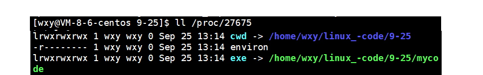

# 深入理解进程概念，了解PCB

# 进程

我们运行的所有的指令，软件，自己写的程序，最终都是进程

**什么叫做进程: 进程 = 对应的代码和数据+ 进程对应的PCB结构体!** 每个进程对应一个PCB

其实，我们自己启动一个软件，本质其实就是启动了一个进程 \~

在Linux在，运行一条命令， ./XXX，运行的时候，其实就是在系统层面创建了一个进程!

Linux是可以同时加载多个程序的，Linux是可能同时存在大量的进程在系统中的(OS，内存)

Linux系统要不要管理进程呢? ? 必须的&#x20;

Linux系统是如何管理大量的进程的呢 ? ? 先描述，在组织

**基本概念**

-   课本概念：程序的一个执行实例，正在执行的程序等
-   内核观点：担当分配系统资源（CPU时间，内存）的实体。

对进程的管理，其实变成了对进程PCB结构体链表的增删改查! !

**描述进程-PCB**

-   进程信息被放在一个叫做进程控制块的数据结构中，可以理解为进程属性的集合。
-   课本上称之为PCB（process control block），Linux操作系统下的PCB是: task\_struct

**task\_struct-PCB的一种**

-   在Linux中描述进程的结构体叫做task\_struct。
-   task\_struct是Linux内核的一种数据结构，它会被装载到RAM(内存)里并且包含着进程的信息.他是按链表来链接每个节点的.

**task\_ struct内容分类**

-   标示符: 描述本进程的唯一标示符，用来区别其他进程。
-   状态: 任务状态，退出代码，退出信号等。
-   优先级: 相对于其他进程的优先级。
-   程序计数器: 程序中即将被执行的下一条指令的地址。eip存储器，pc指针
-   内存指针: 包括程序代码和进程相关数据的指针，还有和其他进程共享的内存块的指针
-   上下文数据: 进程执行时处理器的寄存器中的数据\[休学例子，要加图CPU，寄存器]。
-   I／O状态信息: 包括显示的I/O请求,分配给进程的I／O设备和被进程使用的文件列表。
-   记账信息: 可能包括处理器时间总和，使用的时钟数总和，时间限制，记账号等。
-   其他信息

**组织进程**

-   可以在内核源代码里找到它。所有运行在系统里的进程都以task\_struct链表的形式存在内核里。

**登陆之后，命令行启动的进程，父进程一直不变**

> 启动进程，本质就是创建进程，一般是通过父进程创建的

> 这个父进程就是bash，我们命令行启动的进程，都是bash 的子进程

**查看进程**

-   进程的信息可以通过 `/proc` 系统文件夹查看

    在Linux系统中，/proc目录是一个虚拟文件系统，它提供了对运行中的内核和进程信息的访问。该目录包含了大量的文件和子文件夹，每个文件和文件夹代表一个特定的内核参数、进程或系统状态。

    通过读取/proc目录的文件，可以获取以下信息：
    1.  系统信息：如操作系统版本、内核版本、CPU信息等。
    2.  进程信息：包括正在运行的进程列表、每个进程的PID、进程状态、进程的命令行参数等。
    3.  硬件信息：如内存使用情况、CPU信息、设备信息等。
    4.  网络信息：包括网络接口、连接状态、网络统计信息等。
    5.  文件系统信息：显示已挂载的文件系统、挂载参数、文件系统使用情况等。
        通过在/proc目录中读取或修改这些文件，可以获得关于系统和进程的详细信息，以及对系统进行监控和调整的能力。但需要注意的是，/proc目录中的文件都是虚拟文件，实际上并不存在真实的文件系统中。

如：要获取PID为1的进程信息，你需要查看 /proc/1 这个文件夹。


`/proc`动态的目录结构，存放所有存在的进程，目录的名称，就是以这个进程的id命名的!

> 此时我们的一个程序进程pid为 29675 ，我们进行查看


**一个进程，能找到自己的可执行程序**

> 此时exe指针保存着指向自己可执行程序目录位置



**每一个进程，都要有自己的工作目录**

> 当前工作目录 → cwd   默认情况下，进程启动所处的路径，就是当前路径!
> 什么是当前工作目录 比如在程序下我们fopen打开一个文件，如果没有时候他会自动创造，此时cwd就是他创造时识别的路径
> 当前工作目录，可以更改，chdir0


***

-   大多数进程信息同样可以使用top和ps这些用户级工具来获取

    `ps`是一个用于查看系统中正在运行的进程的命令。它提供了关于进程的各种信息，如进程ID（PID）、父进程ID、进程状态、CPU和内存使用情况等。
    -   `-u`：显示用户相关的列，包括用户ID、CPU利用率、内存占用等。
    -   `-a`：显示所有终端上的进程，包括其他用户运行的进程。
    -   `-x`：显示没有控制终端的进程，也就是守护进程（daemon）。
    -   `-j`：以作业控制格式显示进程信息，包括进程ID（PID）、父进程ID（PPID）、进程组ID（PGID）等。

如：` ``ps axj | grep a.out`

命令会以自定义的格式输出进程信息，包括PPID（父进程ID）和PID（进程ID）。而通过管道（`|`）将结果传递给`grep a.out`命令，则只会输出包含`a.out`的行，因此你看到的只是匹配的结果。


`ps axj | head -1 && ps axj | grep a.out` &#x20;

对于第二个命令`ps -ajx | head -1 && ps -axj | grep a.out`，第一个部分`ps -ajx | head -1`会显示表头，包括PPID和PID，然后通过管道（`|`）将结果传递给第二部分`ps -axj | grep a.out`来显示包含`a.out`的进程信息。


-   扩展：/proc 与 ps区别

    不同于`ps`命令，`/proc`目录提供了一个虚拟文件系统，用于在运行时获取系统和进程信息。通过读取`/proc`目录中的特定文件，可以获得关于进程和系统状态的详细信息，例如进程的命令行参数、内存使用情况、中断信息等。

    `ps`命令提供了一个简单的接口来查看正在运行的进程，而`/proc`目录则提供了更底层和详细的系统和进程信息。`ps`命令是通过读取`/proc`目录下的文件来获取进程信息的一种方式。它们可以被视为在不同层次上查看进程和系统状态的不同工具。

    因此，区别可以总结为：
    -   `ps`是一个命令行工具，提供简洁的进程信息摘要，并可以进行不同的选项和过滤。
    -   `/proc`是一个虚拟文件系统，提供了更底层和详细的系统和进程信息，通过读取特定文件可以获得更具体的信息

***

**结束进程**

`kill -9`是一个用于终止进程的命令，其中`-9`是一个信号编号，表示发送一个强制终止信号给目标进程。为了使用`kill -9`命令，你需要知道目标进程的进程ID（PID）。你可以使用`ps`命令或其他工具来获取进程的PID，然后使用`kill -9 <PID>`来发送强制终止信号。


结束 21222进程

***

**通过系统调用获取进程标示符**

-   进程id（PID）
-   父进程id（PPID）

进程(任务)对应的标识符，pid， process id
进程还有自己的父进程id!
命令行中，父进程一般是命令行解释器 bash

```c++
#include <stdio.h>
#include <sys/types.h>
#include <unistd.h>
int main()
{
 printf("pid: %d\n", getpid());
 printf("ppid: %d\n", getppid());
 return 0;
}
```

```c++
#include <stdio.h>
#include <sys/types.h>
#include <unistd.h>

int main()
{
    printf("I am parent process: pid: %d\n", getpid());

    pid_t ret = fork();
    //变成两个进程,一个是父进程，一个是子进程
    printf("ret: %d, pid: %d, ppid: %d\n", ret, getpid(), getppid());

    sleep(1);
   // while(1)
   // {
   //     pid_t id = getpid(); //获取的是自己的进程PID
   //     printf("hello world, pid: %d, ppid: %d\n", id, getppid());
   //     sleep(1);
   // }
}

 pid_t 是一个数据类型，定义在 <sys/types.h> 头文件中。它是用来表示进程ID（PID）的一种整数类型。

在UNIX和类UNIX操作系统中，每个运行的进程都有一个唯一的标识符，即进程ID。进程ID是一个非负整数，可以用来唯一标识操作系统中的每个进程。pid_t 类型被用来存储和操作这些进程ID。
```

***

**通过系统调用创建进程-fork初识**

-   运行 man fork 认识fork

> 启动一个进程，本质就是系统多个一个进程，OS要管理的进程也就多了一个

> 进程 = 对应的代码和数据+ 进程对应的PCB结构体!  &#x20;

> 创建一个进程，就是系统中要申请内存，保存当前进程的可执行程序+task struct 对象，并将task struct对象添加到进程列表中!

-   fork有两个返回值
    1.  **返回值大于0**：这是在父进程中，表示fork调用成功，返回的是子进程的PID（进程ID）。
    2.  **返回值等于0**：这是在子进程中，表示fork调用成功，返回的是0。
    3.  **返回值小于0**：这表示fork调用失败，通常是由于系统资源不足或其他错误引起的。返回值具体的含义可以参考系统的错误码。
        根据返回值的不同，可以在父进程和子进程中执行不同的逻辑。父进程可以根据返回的子进程PID来对子进程进行操作，而子进程可以根据返回值为0来进行特定的逻辑处理。
    在之前的示例中，父进程根据返回的子进程PID打印了相应的信息，而子进程根据返回值为0打印了自己的信息。

    需要注意的是，fork调用在成功时会创建一个新的进程，该进程与父进程具有相同的代码和状态。然而，父进程和子进程之间是独立运行的，它们有各自独立的内存空间，因此对于变量和数据的修改将不会相互影响。

&#x20;    结：fork成功的时候，会有两个不同的返回值，给子进程返回0，给父进程返回子进程的pid

-   举个例子来解释返回的值为什么在父子进程中不同：“相当于链表，进程形成了链表，父进程的fpid(p 意味point)指向子进程的进程id, 因为子进程没有子进程，所以其fpid为0

> 父子进程代码共享，数据各自开辟空间，私有一份（采用写时拷贝）.  fork创建子进程，系统中会多一个子进程1.以父进程为模板，为子进程创建PCB
>
> 进程的独立性，首先是表现在有各自的PCB进行之间不会互相影响!代码本身是只读的，不会影响!数据父子是会修改的!  代码共享，数据各个进程必须想办法各自私有一份(采用写时拷贝)
>
> 

**为什么会有两个返回值？？**

是因为在调用`fork()`函数后，会创建出一个新的子进程。这个子进程是当前进程的副本，它会继承父进程的所有内存空间、环境变量、打开的文件描述符等。在创建子进程后，`fork()`函数会在父进程和子进程中各返回一次

1.  因为fork内部，父子各白会执行自己的return语句
2.  返回两次，并不意味着会保存两次

**为什么fork的两个返回值，会给父进程返回子进程pid，给子进程返回0?**

&#x20;  1\. 唯一性，因为只有一个父亲，而子进程可能有多个，比例是1:N 的，子进程找到父进程是很简单的，因为有唯一的标识父进程，管理好自己就可以了，所以返回0。

**fork之后，父子进程谁先运行?**

1.  当父子进程的PCB都被创建并在 运行队列中排队的时候哪一个进程的PCB先被选择调度，那个进程就先运行
2.  由操作系统自主决定!!由各自PCB中的调度信息(时间片，优先级等)+调度器算法共同决定.

**如何理解同一个变量，会有不同的值**

1.  进程之间运行的时候，是具有独立性的!!无论是什么关系!


我们在这里只能得出一个结论: 这个地址，绝对不是物理地址!  返回的时候，发生了写时拷贝，所以同一个变量会有不同的值。（写时拷贝）

由于`fork()`函数返回两次，所以父进程和子进程都会从`fork()`函数的返回处开始执行。这就解释了为什么子进程从`fork()`函数调用之后开始执行。

```c++
int main()
{

    printf("I am parent process: pid: %d\n", getpid());

    pid_t ret = fork();
    //变成两个进程,一个是父进程，一个是子进程
    printf("ret: %d, pid: %d, ppid: %d\n", ret, getpid(), getppid());

    sleep(1);
    return 0;
}

 
//输出结果：
I am parent process: pid: 7010
ret: 7011, pid: 7010, ppid: 6026
ret: 0, pid: 7011, ppid: 7010 


```

创建进程是操作系统中的一项重要功能，可以通过系统调用fork来实现。在fork系统调用中，操作系统会复制当前进程，创建一个新的子进程。下面是fork系统调用的一般用法和工作原理的简要说明：

调用fork()系统调用时，会返回一个整数值，即子进程的进程ID（PID）。在父进程中，该值为子进程的PID；在子进程中，该值为0；如果出现错误，则返回-1。

fork调用的工作原理如下：

1.  当调用fork时，操作系统会创建一个与父进程完全相同的子进程，包括代码、数据、堆栈等。
2.  父进程和子进程将在fork调用的位置继续执行。唯一的区别是，子进程获取一个返回值为0的fork调用，而父进程获取子进程的PID。
3.  父进程和子进程是独立运行的，它们有各自独立的内存空间。因此，对于父进程中的变量或数据的修改不会影响子进程中的相应变量或数据。
4.  父进程和子进程之间的执行顺序是不确定的，取决于操作系统的调度算法。

> 我们创建子进程，就是为了让子进程和父进程做不一样的事情，执行不一样的代码.比如边下载。边观看

-   fork 之后通常要用 if 进行分流
    ```c++
    #include <stdio.h>
    #include <sys/types.h>
    #include <unistd.h>
    int main()
    {
       int ret = fork();
       if(ret < 0)
       {
           perror("fork");
         return 1;
        }
       else if(ret == 0)
       { //child
           printf("I am child : %d!, ret: %d\n", getpid(), ret);
       }
       else
       { //father
           printf("I am father : %d!, ret: %d\n", getpid(), ret);
        }
        sleep(1);
        return 0;
    }

     输出结果:
    I am child : 7281!, ret: 0
    I am father : 7280!, ret: 7281
    ```

在调用 `fork()` 函数之前，当前进程是父进程。当调用 `fork()` 函数后，会创建一个新的子进程，此时就有了两个进程在同时执行。

在父进程中，`fork()` 函数会返回子进程的进程ID，因此父进程可以通过这个进程ID来识别和管理子进程。

在子进程中，`fork()` 函数返回的是0。这个0是子进程的一个标识，用于区分子进程的执行逻辑。

所以，在调用 `fork()` 函数后，父进程和子进程会分别执行不同的代码逻辑，它们的行为会有所区别。
