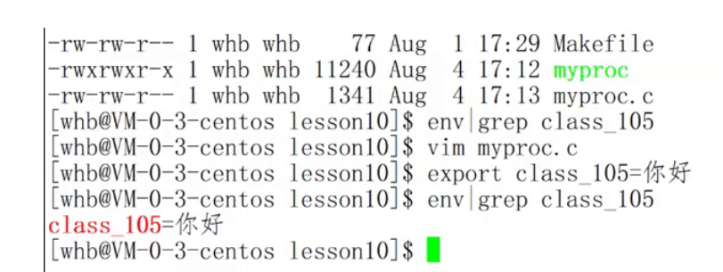

# 环境变量

.子进程默认会复制拥有与父进程相同的环境变量

int main(`int argc, char* `*`argv[]`\*\*, char*\* env\[])

`int argc` 和 `char *argv[]` 是用于接收命令行参数的参数列表。

-   `argc`（argument count）是一个整数，表示命令行参数的数量，包括命令本身。当执行一个程序时，操作系统会将命令行中的参数数量传递给程序。
-   `argv`（argument vector）是一个指向参数字符串的指针数组。每个指针指向一个以 null 结尾的字符串，表示一个命令行参数。
-   **命令行参数**

```c++
int main(int argc, char* argv[])
{
    int i = 0;
   for(; i < argc; i++ )
   {
       printf("%d: %s\n", i, argv[i]);
   }
    return 0;
}

[wxy@VM-8-6-centos 10-14]$ ./mycode
0 -> ./mycode
[wxy@VM-8-6-centos 10-14]$ ./mycode -a
0 -> ./mycode
1 -> -a
[wxy@VM-8-6-centos 10-14]$ ./mycode -a --b --help --version
0 -> ./mycode
1 -> -a
2 -> --b
3 -> --help
4 -> --version

```


-   我们在简单看下用命令行参数做的计算器

```c++
#include <stdio.h>
#include <stdlib.h>
#include <string.h>

int main(int argc, char* argv[])
{
 

    if(argc != 4)
    {
        printf("Use error\nUsage: %s op[-add|sub|mul|div] d1 d2\n", argv[0]); //argv[0], 会不会不存在呢？？
        return 1;
    }
    int x = atoi(argv[2]);
    int y = atoi(argv[3]);
    int result = 0;
    // 你的程序一定有4个命令行参数，第一个是程序名
    if(strcmp(argv[1], "-add") == 0)
    {
        result = x + y;
        printf("%d+%d=%d\n", x, y, result);
    }
    else if(strcmp(argv[1], "-sub") == 0)
    {
        result = x - y;
        printf("%d-%d=%d\n", x, y, result);
    }
    else if(strcmp(argv[1], "-mul") == 0)
    {
        result = x * y;
        printf("%d*%d=%d\n", x, y, result);
    }
    else if(strcmp(argv[1], "-div") == 0)
    {
        if( 0 == y ) printf("%d/%d=error! div zero\n", x, y);
        else printf("%d/%d=%d\n", x, y, x/y);
    }
    else
    {
        printf("Use error, you should use right command line\nUsage: %s op[-add|sub|mul|div] d1 d2\n", argv[0]); //argv[0], 会不会不存在呢？？
    }

    return 0;
}


[wxy@VM-8-6-centos 10-14]$ ./mycode -add 10 20
10+20=30
[wxy@VM-8-6-centos 10-14]$ ./mycode -sub 20 10
20-10=10
[wxy@VM-8-6-centos 10-14]$ ./mycode -mul 10 10
10*10=100
[wxy@VM-8-6-centos 10-14]$ ./mycode -div 20 20
20/20=1
[wxy@VM-8-6-centos 10-14]$ ./mycode
Use error
Usage: ./mycode op[-add|sub|mul|div] d1 d2


```

-   **命令行参数是支持系统选项**

    命令行参数，可以支持各种指令级别的命令行选项的设置! 比如ls -a -l --- 终于理解历史学的指令，选项是什么关系了!
-   环境变量(environment variables)一般是指在操作系统中用来指定操作系统运行环境的一些参数
-   如：我们在编写C/C++代码的时候，在链接的时候，从来不知道我们的所链接的动态静态库在哪里，但是照样可以链接成功，生成可执行程序，原因就是有相关环境变量帮助编译器进行查找。
-   环境变量通常具有某些特殊用途，还有在系统当中通常具有全局特性

## 常见环境变量

1.  `PATH：`用于指定命令的搜索路径。当你在命令行输入一个命令时，操作系统会根据PATH环境变量中列出的路径搜索可执行文件，并找到相应的命令进行执行。
2.  `HOME：`用于指定用户的主工作目录。在Linux系统中，当用户登录时，默认的目录就是其主工作目录（也可以称为家目录）。HOME环境变量指定了用户的主工作目录路径。
3.  `SHELL：`指示当前正在使用的Shell。Shell是一种解释器，可以理解和执行用户在命令行输入的命令。SHELL环境变量存储了当前Shell的路径，通常默认的Shell为/bin/bash，但也可以根据用户的个性化需求进行更改。

使用shell时，默认的环境变量放在`~/.bash_profile`：用户级的环境配置文件，每个用户目录下都会具有各自的，在用户每次登录系统时被读取，里面所有命令都会被shell执行。包括环境变量的配置命令

`/etc/progile.d` 这是个目录或者说文件夹，其中包含了系统级的环境配置文件，任意用户登录时都会执行这个目录下的环境配置文件完成环境配置，但是要注意这个是目录并不是保存环境变量配置的配置文件

***

## 查看环境变量方法

-   `echo $PATH`是一个命令，用于在命令行中显示当前系统的PATH环境变量的值。
-   `echo $NAME` //NAME:你的环境变量名称
-   `env` 用于打印所有环境变量信息
-   `set` 用于输出打印所有环境配置以及变量信息，不限于环境变量

***

## 测试PATH

```c++
include <stdio.h>
int main()
{
  printf("hello \n");
  printf("hello \n");
 
  return 0;
}
```

对比./mycode执行和之间code执行

-   **为什么有些指令可以直接执行，不需要带路径，而我们的二进制程序需要带路径才能执行？**

    要执行一个命令，必须先要找到对应的可执行程序! 因为./是我们的当前路径
-   **将我们的程序所在路径加入环境变量PATH当中,程序所在路径   对比测试**

    \*\*  PATH=\$PATH:\*\* (程序路径)
    ```c++
    [wxy@VM-8-6-centos 10-14]$ pwd
    /home/wxy/2023/10-14

    [wxy@VM-8-6-centos 10-14]$ PATH=$PATH:/home/wxy/2023/10-14
    [wxy@VM-8-6-centos 10-14]$ mycode
    hello
    hello

    #当然使用./mycode 照样还可以运行

    # 我们打印一下路径 PATH环境变量发现我们程序路径也在里面 
    [wxy@VM-8-6-centos 10-14]$ echo $PATH
    /usr/local/bin:/usr/bin:/usr/local/sbin:/usr/sbin:/home/wxy/.local/bin:/home/wxy/bin:/home/wxy/2023/10-14

    #那如何删除呢？
    [wxy@VM-8-6-centos 10-14]$ PATH=/usr/local/bin:/usr/bin:/usr/local/sbin:/usr/sbin:/home/wxy/.local/bin:/home/wxy/bin
    [wxy@VM-8-6-centos 10-14]$ mycode


    ```
-   `PATH=/` 或者` PATH = " "` 可以将所有环境变量清除。ls touch指令全部都没有了，但是重启XSHELL会重新配置.
    -   默认更改环境变量，只限于本次登陆，因为只在内存里面改了，重新登陆，环境变量自动被恢复
-   **环境变量设置之后，不需要重启shell，也不需要重新加载文件，只要设置换环境变量就能直接生效，因此可以使运行环境的配置更加灵活简单**

1.  还有什么方法可以不用带路径，直接就可以运行呢

初识:
1.系统命令可以直接运行，我自己写的程序必须带路径!，如果不想带呢? 如果我想让和运行普通命令一个，可以运行我们的程序??

将我们的程序所在路径加入环境变量PATH当中,` export PATH=$PATH:`加(当前程序路径可通过pwd查看)

`env | grep dir` 是一个命令管道，将`env`命令的输出通过管道传递给`grep`命令进行过滤。

-   `env`命令用于显示当前系统的所有环境变量和它们的值。
-   `grep`命令用于在文本中搜索指定的模式，并输出匹配到的行。

`env | grep dir` 的意思是，首先运行`env`命令来获取系统的所有环境变量，然后将其输出传递给`grep`命令进行过滤。`grep dir`表示在`env`的输出中搜索包含字符串"dir"的行。



***

## 测试HOME

1.  用root和普通用户，分别执行 echo \$HOME ,对比差异

. 执行 cd \~; pwd ,对应 \~ 和 HOME 的关系


-   登陆的时候
    -   输入用户名&&密码
    -   认证
    -   形成环境变量(肯定不止一个，PATH，PWD，HOME)
    -   根据用户名，初始化HOME=/root, HOME=/home/XXX
    -   cd \$HOME

**要查看一下目前所有的环境变量呢**? 请看下面

***

## 和环境变量相关的命令

在Linux和macOS等类Unix系统中，可以通过命令行工具（如`export`和`set`命令）来设置和使用环境变量。

1.  `echo`: 显示某个环境变量值
2.  `export:` 设置一个新的环境变量
3.  `env`是一个用于显示当前系统所有环境变量的命令。
4.  `unset: `清除环境变量
5.  `set: `显示本地定义的shell变量和环境变量

系统中会存在大量的环境变量，每一个环境变量都有它自己的特殊用途，用来完成特定的系统功能

***

## 环境变量的组织方式


每个程序都会收到一张环境表，环境表是一个字符指针数组(env指针)，每个指针指向一个以’\0’结尾的环境字符串

***

## 通过代码如何获取环境变量

-   获取环境变量表的三个方法
    -   getenv
    -   main传参
    -   extern char\*\*environ
-   命令行第三个参数
    ```c++
    #include <stdio.h>
    int main(int argc, char *argv[], char *env[])
    {
      int i = 0;
      for(; env[i]; i++){
        printf("%s\n", env[i]);
      }
      return 0;
    }

    //输出结果跟env指令输出的差不多
    ```
-   通过第三方变量environ获取
    ```c++
    #include <stdio.h>
    int main(int argc, char *argv[])
    {
      extern char **environ;
      int i = 0;
      for(; environ[i]; i++){
        printf("%s\n", environ[i]);
      }
      return 0;
    }
    ```

libc中定义的全局变量environ指向环境变量表,environ没有包含在任何头文件中,所以在使用时 要用extern声明

-   系统启动我们的程序 的时候，可以选择给我们的进程(main)提供两张表
    1\. 命令行参数表
    2\. 环境变量表

    环境变量表 又是从哪里来的.
    -   命令行启动的进程都是shell/bash的子进程，
        子进程的命令行参数和环境变量，是父进程bash给我们传递的,

        父进程的环境变量信息又从哪里来?
        -   我们直接更改的是bash进程内存的环境变量信息!
            每一次重新登陆，都会给我们形成新的bash解释器并且新的bash解释器自动从 读取形成自己的环境变量表信息!
            -   环境变量信息是以脚本配置文件的形式存在的
                -   每一次登陆的时候，bash进程都会读取

                    `vim .bash_profile`   这是个目录或者说文件夹，其中包含了系统级的环境配置文件，任意用户登录时都会执行这个目录下的环境配置文件完成环境配置，但是要注意这个是目录并不是保存环境变量配置的配置文件, 配置文件中的内容，为我们bash进程形成一张环境变量表信息!

                    

***

***

## 环境变量通常是具有全局属性的

-   子进程的环境变量是从父进程来的!默认，所有的环境变量，都会被子进程继承

环境变量可以被子进程继承下去的原因是因为子进程是通过继承父进程的环境来创建的。

总结起来，子进程继承父进程的环境变量是为了方便进程间的信息传递和共享，以及提供灵活性和一致性的运行环境。

```c++
#include <stdio.h>
#include <stdlib.h>
int main()
{
  char * env = getenv("OUR_ENY");
  if(env){
    printf("%s\n", env);
}
  return 0;
}
```

-   直接查看，发现没有结果，说明该环境变量根本不存在

```c++
[wxy@VM-8-6-centos 10-19]$ OUR_ENY=hellolinux 
[wxy@VM-8-6-centos 10-19]$ echo $OUR_ENY
hellolinux
[wxy@VM-8-6-centos 10-19]$ env | grep OUR_ENY

```

-   其实这里配置的是本地变量，无法进环境表
-   那此时需要导出环境变量  export

    export OUR\_ENY="hellolinux "
    ```c++
    [wxy@VM-8-6-centos 10-19]$ env | grep OUR_ENY
    [wxy@VM-8-6-centos 10-19]$ export OUR_ENY=hellolinux
    [wxy@VM-8-6-centos 10-19]$ env | grep OUR_ENY
    OUR_ENY=hellolinux
    ```
-   再次运行程序，发现结果有了！说明：环境变量是可以被子进程继承下去的！想想为什么？


-   在Linux系统中，环境变量是一种特殊的变量，用于存储系统的配置和信息。它们对于操作系统和应用程序来说非常重要，可以影响程序的行为和功能。
    1.  本地变量：本地变量仅对当前Shell会话和其子进程可见。你可以使用"export"命令将本地变量导出为环境变量，使其在子进程中可用。本地变量使用"="赋值，例如：

        `my_var="Hello"`
    2.  环境变量：环境变量是在整个系统范围内可用的变量，可以被所有进程访问。它们可以在启动Shell时定义，或者通过修改配置文件来设置。常见的环境变量包括PATH（定义可执行程序的路径）、HOME（指定当前用户的主目录）等。要创建或修改环境变量，可以使用"export"命令，例如：

        `export MY_VAR="World"`
    为了使环境变量在每次启动时都可用，你可以将其添加到Shell配置文件（例如\~/.bashrc）中。

    使用"printenv"命令可以列出当前Shell会话中定义的环境变量，而使用"env"命令则可以显示所有的环境变量。.
-   在Linux系统中，可以使用以下几种方法将环境变量传递给进程：
    1.  在Shell中直接设置环境变量：在Shell中，可以使用"export"命令将环境变量设置为当前Shell会话的一部分。例如，要将变量"MY\_VAR"设置为"Hello"，可以执行以下命令：

        `export MY_VAR="Hello"`
        这样，"MY\_VAR"变量将在你当前的Shell会话中可用，并且它的值将被传递给你启动的任何子进程。
    2.  在启动程序时设置环境变量：你可以在启动程序时直接设置环境变量，而无需在Shell中使用"export"命令。在终端中，可以通过以下方式直接在命令行中设置环境变量，并运行程序：

        `MY_VAR="Hello" ./my_program`
        这样，"my\_program"进程将在运行时接收到"MY\_VAR"变量并使用其值。

## 实验

-   如果只进行 MYENV＝“helloworld” ,不调用export导出，在用我们的程序查看，会有什么结果？为什么

如果只执行`MYENV="helloworld"`而没有使用`export`命令导出环境变量，那么该环境变量对其他程序可能是不可见的。

在Linux和类Unix系统中，通过在变量赋值语句前使用`export`命令，可以将该变量导出为环境变量，使其对后续执行的程序可见。如果没有使用`export`导出，该变量仅在当前Shell会话中生效。

因此，如果只执行`MYENV="helloworld"`而没有使用`export`导出，其他程序无法访问到这个环境变量。当你使用其他程序来查看环境变量时，该变量不会出现在输出中或返回一个空值。

这是因为环境变量是由父进程传递给子进程的，而不是子进程自己定义的。只有导出的环境变量才会在创建子进程时被继承，并在子进程中可见。

所以，如果你想使其他程序能够访问该环境变量，应该在赋值语句之后使用`export`命令，例如：`export MYENV="helloworld"`。这样设置的环境变量将在当前Shell会话中生效，并在调用其他程序时可见。

等他就是完毕了就会运行放到运行队列里面。

-   本地变量vs环境变量
    1.  本地变量只在bash进程内部有效，不会被子进程继承下去
    2.  环境变量通过让所有的子进程继承的方式，实现自身的全局性!
-   Linux的命令分类:
    1.  常规命令，shell fork让子进程成执行的
    2.  内建命令，shell命令行的一个函数，当然可以直接读取shell内部定义的本地变量喽!

***

## 通过系统调用获取或设置环境变量

`putenv , `后面讲解

`putenv` 是一个用于设置环境变量的C语言函数。它允许您在程序运行时修改当前进程的环境变量。

`putenv` 函数的原型如下：

```c++
int putenv(char *string);
```

`putenv` 函数接受一个包含环境变量设置的字符串作为参数。这个字符串的格式应该符合 `name=value` 的形式，其中 `name` 是环境变量的名称，`value` 是环境变量的值。

使用 `putenv` 函数，您可以在程序中动态地修改环境变量。以下是一个使用 `putenv` 的示例：

```c++
void cd(const char *path)
{
    chdir(path);
    char tmp[1024];
    getcwd(tmp, sizeof(tmp));
    sprintf(cwd, "PWD=%s", tmp); // bug
    putenv(cwd);
}
```

`getenv ,` 本次讲解

```c++
#include <stdio.h>
#include <stdlib.h>
int main()
{
  printf("%s\n", getenv("PATH"));
  printf("%s\n", getenv("Pwd"));
  return 0;
}


[wxy@VM-8-6-centos 10-14]$ ./mycode

/usr/local/bin:/usr/bin:/usr/local/sbin:/usr/sbin:/home/wxy/.local/bin:/home/wxy/bin
/home/wxy/2023/10-14

```

常用getenv和putenv函数来访问特定的环境变量。

-   该程序只能让root使用

```c++
int main()
{
char *who = getenv("USER");

    if(strcmp(who, "root") != 0)
    {
        printf("%s,是一个非法用户\n", who);
        return 1;
    }

    printf("myself command!\n");
    printf("myself command!\n");
    printf("myself command!\n");
    printf("myself command!\n");
    printf("myself command!\n");
   }
```

***
