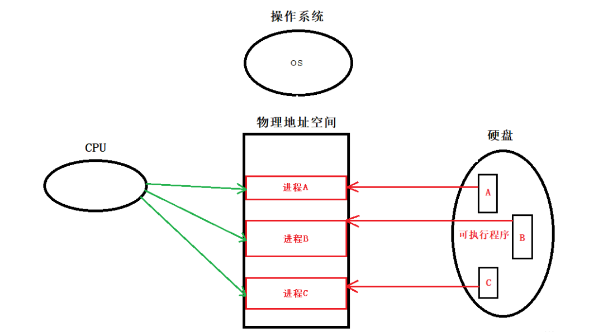
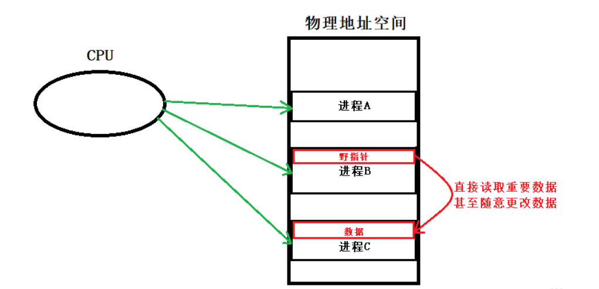
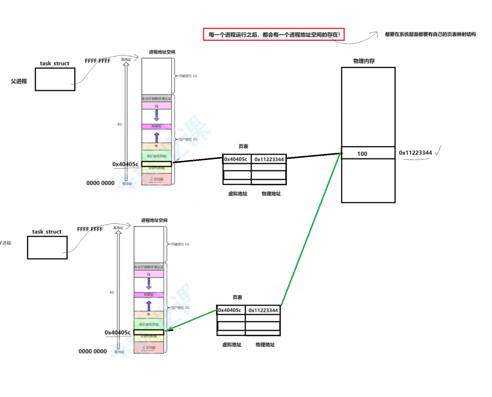
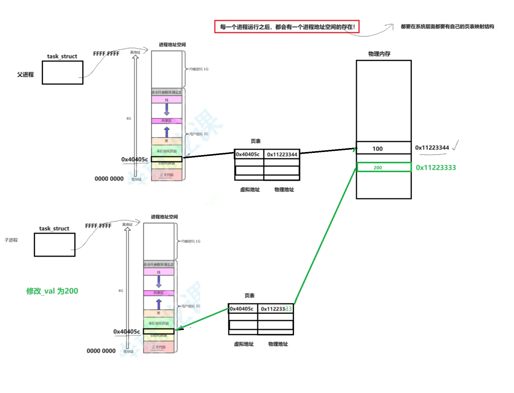
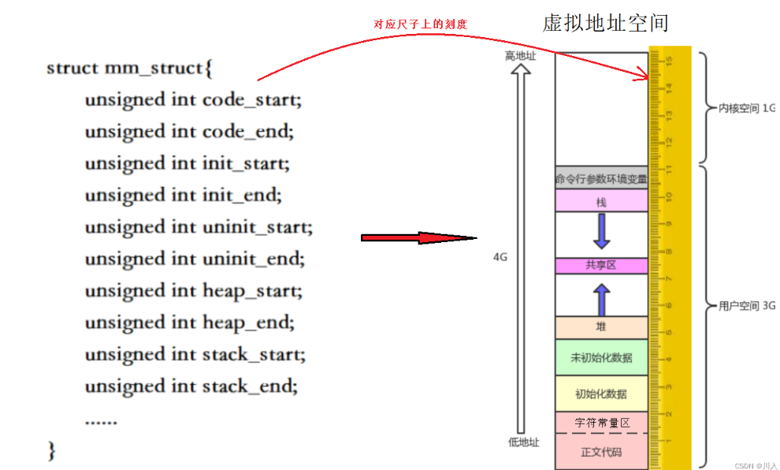
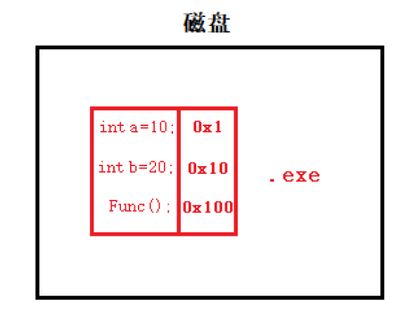
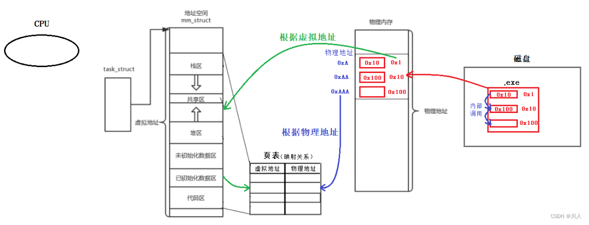
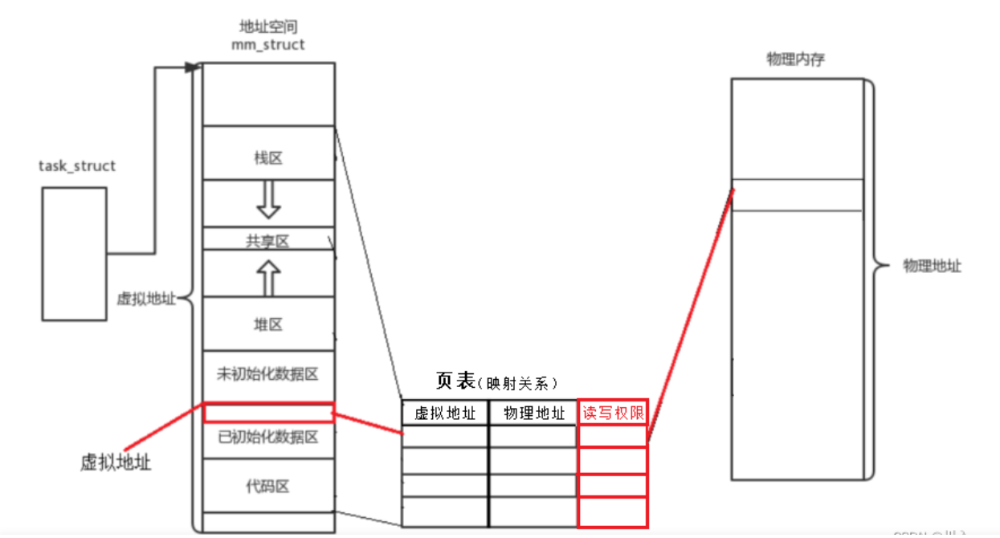
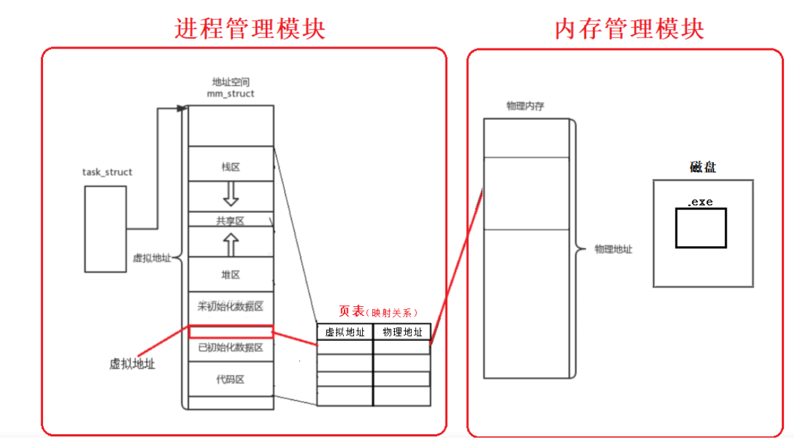
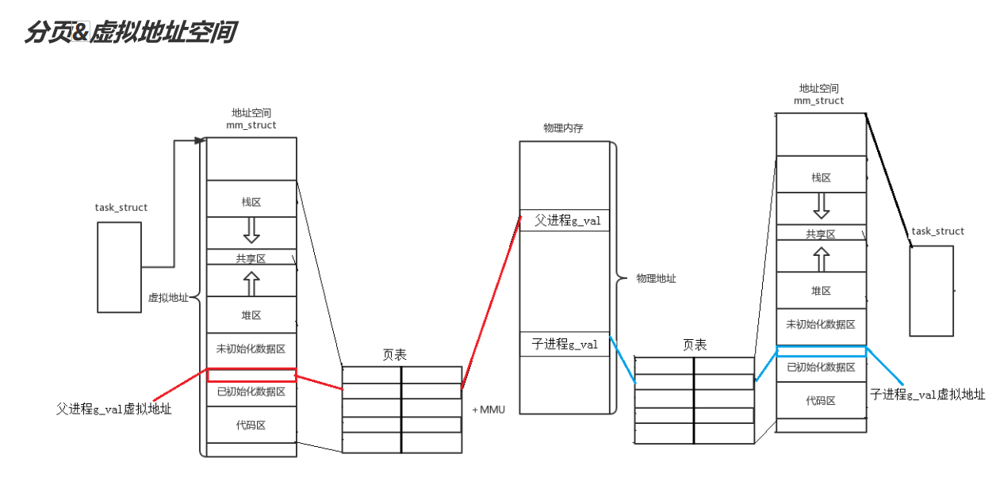

# 程序地址空间

# 程序地址空间

&#x20; 研究背景

&#x20;\> kernel 2.6.32&#x20;

&#x20;\> 32位平台&#x20;

我们在讲C语言的时候，老师给大家画过这样的空间布局图


## 验证程序地址空间

```c++
int init_gval = 0;
int un_gval;
int main()
{
  printf("code addr: %p\n", main);                        //代码区
    char *str = "hello Linux";
    printf("read only char addr: %p\n", str);               //字符常量区
    printf("init global value addr: %p\n", &init_gval);     //已初始化全局数据区
    printf("uninit global value addr: %p\n", &un_gval);     //未初始化全局数据区
    char *heap1 = (char*)malloc(100);
    printf("heap1 addr : %p\n", heap1);                     //堆区
    printf("stack addr : %p\n", &heap1);                    //栈区
    return 0;
}

                code addr: 0x40057d
      read only char addr: 0x4006bf
   init global value addr: 0x601040
 uninit global value addr: 0x601044
              heap1 addr : 0xa01010
        stack addr : 0x7ffe587de8c0


```

-   堆区是由上增长的，而栈区是由下增长的

```c++
#include<stdio.h>
#include<stdlib.h>

int init_gval = 0;
int un_gval;
int main()
{
    char *heap1 = (char*)malloc(100);
    char *heap2 = (char*)malloc(100);
    char *heap3 = (char*)malloc(100);
    char *heap4 = (char*)malloc(100);
    printf("heap1 addr : %p\n", heap1);
    printf("heap2 addr : %p\n", heap2);
    printf("heap3 addr : %p\n", heap3);
    printf("heap4 addr : %p\n", heap4);

    printf("stack addr : %p\n", &heap1);
    printf("stack addr : %p\n", &heap2);
    printf("stack addr : %p\n", &heap3);
    printf("stack addr : %p\n", &heap4);
    return 0;
}

heap1 addr : 0x1d08010   ////heap1 申请的空间先申请所以最小后面向上增长
heap2 addr : 0x1d08080
heap3 addr : 0x1d080f0
heap4 addr : 0x1d08160

stack addr : 0x7ffc1c3e7b58 //heap1的空间先使用所以最大后面向下增长
stack addr : 0x7ffc1c3e7b50
stack addr : 0x7ffc1c3e7b48
stack addr : 0x7ffc1c3e7b40

```

-   C语言中的数组是使用偏移量的形式进行访问的。在C语言中，数组的起始地址是最低地址，而数组元素的索引/下标则表示相对于起始地址的偏移量。假设你有一个整型数组`int a[10]`，并且你想访问其中的元素。数组的第一个元素是`a[0]`，它的地址是最低地址，++他通过类型向后去找，而后续的元素依次排列在连续的内存地址中。所以起始地址+偏移量的访问形式
-   static 静态区可以被称为已初始化的全局数据区

    在内存中，静态区是用于存储已经初始化的全局变量、静态变量和静态常量的一部分。它在程序加载时就会被初始化，并且在整个程序执行期间都存在。

    静态区的初始化是在程序启动时进行的，编译器将为静态区中的变量和常量分配内存，并将其初始值写入相应的内存位置。

    这与另外一个内存区域，即未初始化的数据区（Uninitialized Data Area），有所不同。未初始化的数据区用于存储未赋初值的全局变量和静态变量，其内部的值在程序启动时被初始化为零或空值。

    总之，静态区是已初始化的全局数据区，用于存储已经初始化的全局变量、静态变量和静态常量。

***

## 重新理解地址

-   来段代码感受一下

```c++

#include <stdio.h>
#include <unistd.h>
#include <stdlib.h>
int g_val = 0;
int main()
{
  pid_t id = fork();
  if (id < 0) {
    perror("fork");
    return 0;
  }
  else if (id == 0) { //child
    printf("child[%d]: %d : %p\n", getpid(), g_val, &g_val);
  }
  else { //parent
    printf("parent[%d]: %d : %p\n", getpid(), g_val, &g_val);
  }
  sleep(1);
  return 0;
}

输出
//与环境相关，观察现象即可
parent[2995]: 0 : 0x80497d8
child[2996]:  0 : 0x80497d8

```

我们发现，输出出来的变量值和地址是一模一样的，很好理解呀，因为子进程按照父进程为模版，父子并没有对变量进行进行任何修改。可是将代码稍加改动:

```c++
#include <stdio.h>
#include <unistd.h>
#include <stdlib.h>
int g_val = 0;
int main()
{
  pid_t id = fork();
  if (id < 0) {
    perror("fork");
    return 0;
  }
  else if (id == 0) { //child,子进程肯定先跑完，也就是子进程先修改，完成之后，父进程再读取
    g_val = 100;
    printf("child[%d]: %d : %p\n", getpid(), g_val, &g_val);
  }
  else { //parent
    sleep(3);
    printf("parent[%d]: %d : %p\n", getpid(), g_val, &g_val);
  }
  sleep(1);
  return 0;
}

//与环境相关，观察现象即可
child[3046]: 100 : 0x80497e8
parent[3045]: 0 : 0x80497e8

```

我们发现，父子进程，输出地址是一致的，但是变量内容不一样！能得出如下结论:

1.  变量内容不一样,所以父子进程输出的变量绝对不是同一个变量
2.  但地址值是一样的，说明，该地址绝对不是物理地址！
3.  在Linux地址下，这种地址叫做 虚拟地址
4.  我们在用C/C++语言所看到的地址，全部都是虚拟地址！物理地址，用户一概看不到，由OS统一管理

## 在谈虚拟地址

-   最初，其实并没有虚拟地址空间的概念，是CPU直接对物理地址空间(内存)操作。



由于物理地址空间就是自由的空间，并未对读写设置权限，也没有违规操作的处理：

-   物理地址空间没有隔离，每一个进程都可以修改其他进程的数据，修改内核空间中的数据。
-   由于是直接存储于物理空间内，所以进程数据必须统一规范性放置，会出现碎片化内存浪费。
-   内存地址随机分配，程序运行的地址不确定，CPU需要查询消耗。



**我们需要一个处理方式，使得CPU运行进程的操作是规范的，安全的；对于物理地址空间中的进程管理是合理的。** ​**这样就有了虚拟地址空间的概念。虚拟地址空间的存在**

***

> 可执行程序经过编译后，变量名会被转换为与其对应的内存地址。在编译过程中，变量名会被转换为相应的内存地址，这个过程叫做地址绑定。在执行程序时，变量名已经没有意义，只有对应的内存地址才能被实际访问和使用。

-   &#x20;fork之后，代码是父子共享的，所以子进程的地址空间与页表绝大多数数据都是复制的父进程的地址空间与页表数据，二者是一样的，前提是并未在子或父进程中更改数据。当创造子进程后，父子进程共享代码和数据 ，并且页表的映射地址也会·进行拷贝。



-   但是如果有一方对数据做出了修改，操作系统，会以实时拷贝，开辟一个空间将g\_val复制拷贝，改变子进程页表的映射关系改变成新开辟的空间，然后进行子进程的g\_val的数据更改。我们表面上所看的地址只是虚拟地址，其实在物理内存中，有属于自己的变量空间，只不过在用户层使用同一个变量（虚拟地址）来标识。他们的物理内存进行了改动，业表中的虚拟地址并没有改动，只是改动了物理内存的地址我们在C/C++语言打印所看到的地址都是[虚拟地址](https://so.csdn.net/so/search?q=虚拟地址\&spm=1001.2101.3001.7020 "虚拟地址")，而物理内存的地址对于我们用户是看不到的，由OS管理。所以写时拷贝是在物理内存里面进行的。这样做是不会影响上层语言的



当然上面的物理内存还会保存父进程的代码和数据。

-   进程具有独立性!
    > 进程=内核数据结构+进程的代码和数据，每个进程都要有自己的独立的空间
-   那什么是地址空间?什么是区域划分?
    -   地址空间要被OS管理起来 ! 每一个进程都要有地址空间系统中，一定要对地址空间做管理,那如何管理呢？先描述，在组织。
    -   进程地址空间最终一定是一个内核的数据结构对象!
        就是一个内核结构体struct mm struct

        struct mm struct 直接给进程一个 0x0000……0000 到 0xffff……ffff 的空间，并把每个区域进行划分，将代码与数据 “画” 在图（虚拟地址空间）中。CPU也无需关注物理内存的存在，只需要根据 “图” 中的位置进行访问即可，剩下的转换交给操作系统，操作系统转换 “图” 中的虚拟地址变为物理地址，然后将数据输出给CPU。也就是说：每一个进程都有一幅针对它的 “图”，这副 “图” 是每个进程私有的，而在转换的过程中就是检测CPU操作是否规范的关键所在。
        -   CPU根据虚拟地址空间的位置向操作系统索要数据。
            -   对于虚拟的 0x0000……0000 到 0xffff……ffff 区域的划分，区域的划分就是begin与end：
                
-   CUP通过运行进程，以进程的task\_struct结构题提取到虚拟地址空间中所储存的虚拟地址，该虚拟地址再以页表的映射关系找到物理地址，再以此到物理空间中读取数据。可以说整个过程CPU都是不知道物理内存的存在的，而一直认为虚拟地址空间就是数据真正处于的位置。+
-   地址空间和页表是每一个进程都私有的一份，以每个进程的页表的映射关系就能做到：进程具有独立性
    -   通过映射，虚拟地址与物理地址对应，就能做到，进程之间不会互相干扰，保证进程的独立性。
    -   只有页表中的虚拟地址，或者虚拟地址相对应的物理空间才能访问。就能提高安全性，防止出现野指针越界访问其他进程的问题。

***

### **深入理解虚拟地址**

-   当我们的程序在编译的时候（形成可执行程序的时候），或者说没被加载到内存当中的时候，程序内部其实就已经有地址了。
    -   地址空间不仅仅是操作系统需要遵守的，其实编译器也要遵守。即编译器编译代码的时候，就已经形成了各个区域、代码区、数据区……，并且采用个Linux内核中的一样的编址方式，给每一个变量，每一行代码都进行了编址。
    -   ## 所以：程序在编译的时候，每一个字段其实早就已经具有了一个虚拟地址。
            
    &#x20;其实这正是地址空间与页表，最开始的时候的数据来源。

    

***

#### **为什么要有地址空间**

-   &#x20;**凡是非凡的访问或者是映射，操作系统都会识别到，并终止此进程。**
    -   因为地址空间和页表是操作系统创建并维护的。这也就意味着凡是想用地址空间和页表进行映射，就一定要在操作系统的监管之下来进行访问。也便保护了物理内存中所有的合法数据，包括各个进程以及内核的相关有效数据。
    -   更直接的说就是：有效的保护了物理地址。
        -   所访问的虚拟地址是页表未有的，即访问不合法。
        -   虚拟地址所访问的物理地址是页表未映射的，即访问不合法。
        -   页表中不仅有映射关系，更有读写权限。此也是自由的物理内存，却有只能读的代码区的关键。
            
-   **因为有地址空间和页表的存在，所以在物理内存中，可以对未来的数据进行任意的位置加载。**
    -   由于进程与内存的联系以页表分隔。对于虚拟地址在内存中的物理地址存储，是由页表的映射而联系的，所以内存管理模块与进程管理模块就完成了解耦合。
        -   所以如C/C++语言上的new、malloc申请空间的时候，本质就是在虚拟空间申请。因为对于物理空间申请了，但是无法立马使用，就会造成空间的浪费，而由于两个模块的解耦合，那么两个模块的联系也就是一个页表，对于物理空间并没有立马给与的必要。只需延迟分配的策略，就可以提高整机的效率。
        -   之所以可以延迟分配，本质上：因为有地址空间的存在。所以地址 “许诺” 给进程就可以了，上层申请空间就是在地址空间上申请，物理内存可以一个bit为都不给。进程既不是立马运行，那就延迟实现 “许诺” ，提高内存的使用。而当你真正的对物理地址空间访问的时候，才执行内存的相关管理算法，申请空间，构建页表映射关系）
        -   内存管理操作系统自动完成。用户、CPU、进程完全0感知。
            
-   **因为在物理内存中理论可以任意位置加载，那么物理内存中的几乎所有数据和代码在内存中都是乱序的。**
    -   因为页表的存在，它可以将地址空间上的虚拟地址与物理地址进行映射，所以可以做到在进程的视角中所有的内存分布，是有序的。

        &#x20;  重点：地址空间+页表 = 内存乱序分布变的有序化。
        -   不同进程的需要访问的物理内存中的代码和数据，是由页表规范化，映射到不同的物理内存中，进而可以做到进程的独立性。

            &#x20; 重点：地址空间+页表 = 内存乱序分布变的独立化。
            -   实现的有序化、独立化，更是由于地址空间的存在。因为每一个进程都认为自己有一个4GB空间（32位），进而有了虚拟地址分布的地址空间，并通过页表映射到不同的区域，实现有序化、独立化。

***

#### **程序地址空间的角度理解挂起**

-   加载的本质就是创建进程，按照前面第3点，并不是必须把所有程序的代码和数据加载到内存中，并创建内核数据结构建立映射关系。在极端的情况下，甚至可能只有内核结构被创建出来，并未分配物理空间，这就是未了提高内存利用率进行的分批加载，同样的也有分批换出。
    -   当已被执行完的代码与数据，或者由于处于对于某种资源的等待导致的阻塞，也就是此进程短时间不会再执行了。进程的数据和代码就换出，也就叫做挂起。

***

## 进程地址空间

所以之前说‘程序的地址空间’是不准确的，准确的应该说成 进程地址空间 ，那该如何理解呢？看图

-   地址空间和页表(用户级)是每一个进程pcb都私有一份
    只要保证，每一个进程的页表，映射的是物理内存的不同区域，就能做到，进程之间不会互相干扰保证进程的独立性
-   程序内部的地址，依旧用的是编译器编译好的虚拟地址
    当程序加载到内存的时候，每行代码，每个变量边具有了一个物理地址
-   地址空间不要仅仅理解成为是OS内部要遵守的，其实编译器也要遵守!!!，即编译器编译代码的时候，就已经给我们形成了 各个区域 代码区，数据区，....并且，采用和Linux内核中一样的编址方式，给每一个变量，每一行代码都进行了编址，放，程序在编译的时候，每一个字段早已经具有了一个虚拟地址! ! !
-   **为什么要有地址空间? ?**
    -   &#x20;   凡是非法的访问或者映射，QS都会识别到，并终止你这个进程!有效的保护物理内存,因为地址空间和页表是OS创建并维护的!
        -   比如在C语言阶段 char\* ptr = “hello world” \*ptr = 'h' 会崩，因为他访问了代码区的地址，QS都会识别到，字符串常量存储在程序的只读数据段（常量区），并映射到虚拟内存的只读页面。操作系统会通过内存保护机制保护这部分内存，禁止对其进行写操作。
            &#x20;       &#x20;



&#x20;

-   **说明:**

    上面的图就足矣说名问题，同一个变量，地址相同，其实是虚拟地址相同，内容不同其实是被映射到了不同的物理地址！
-   MMUB. MMU（内存管理单元）将地址从虚拟（逻辑）地址空间映射到物理地址空间。 MMU是计算机系统中负责虚拟内存管理的硬件组件。它将进程使用的虚拟地址转换为对应的物理地址，以便访问主存储器中的数据。

内存管理单元,一种负责处理中央处理器（CPU）的内存访问请求,功能包括虚拟地址到物理地址的转换（即虚拟内存管理）、内存保护、中央处理器高速缓存的控制

-   CACHE	高速缓存
-   DMA	直接内存存取
-   TCB		线程控制块
