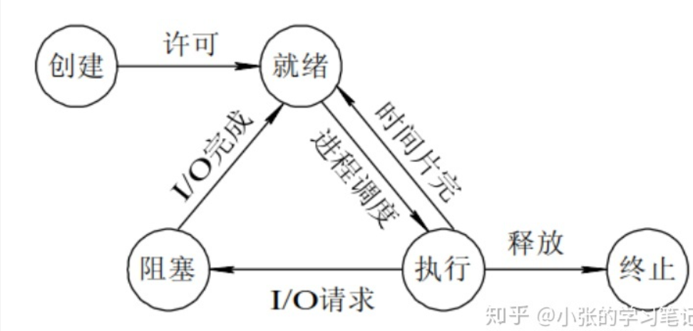

# 进程状态

## 目录

-   [进程状态查看](#进程状态查看)
-   [Z(zombie)-僵尸进程](#Zzombie-僵尸进程)

Lipux操作系统进程的状态

在Linux操作系统中，task\_struct是内核中用于表示进程（或线程）的数据结构。进程可以处于不同的状态，包括运行态、和阻塞态等。

-   **运行态：：** task\_struct 结构体在运行队列中排队，就叫做运行态,表示进程当前正在执行，并占用CPU资源。当一个进程在CPU上运行时，它处于运行态。
-   **阻塞 态：：** 当进程需要等待非CPU资源（如输入/输出设备、磁盘操作、网络通信等）时等 ,待非CPU资源就绪阻塞状态 !  scanf,cin函数是一个典型的阻塞操作。(进入阻塞态并不意味着进程的运行完全停止，只是无法继续执行，直到所需的非CPU资源可用为止。一旦资源就绪，进程将被唤醒)
-   **挂起态：：** 某个进程暂时不活动或暂停执行或者是阻塞进程时。而当内存不足时，操作系统可能采取将进程的部分或全部代码和数据暂时置换到磁盘上的操作I/0交换，以释放内存空间。这个过程通常被称为交换（Swapping），因此，当进程的代码和数据被置换到磁盘上，以释放内存并满足其他进程的需要时，可以说该进程被挂起。挂起状态意味着进程的执行被暂时中断，但并不意味着进程已经终止或被完全移出内存。一旦内存资源可用，进程的状态会从挂起态转换为就绪态，继续执行。交换到swap分区，swap分区不易过大，一般是磁盘的大小或者是两倍.



进程状态，就是PCB中的一个字段，就是PCB中的一个变量，int status


进程状态变化的本质:

1.  更改pcb status整数变量
2.  PCB连入不同的队列中!
3.  所谓的状态变化，本质就是修改整形变量.


-   **操作系统中，会存在非常多的队列，运行队列，等待硬件的设备等待队列等所有系统内的进程是用双链表链接起来的**.
-   &#x20;pcb没有在运行队列中&&状态不是running,CPU不调度你的进程啦,，阻塞状态时都是在操作系统上的设备链表上的queue等待，等他就是完成了就会运行放到运行队列里面。
-   OS一定是最先知道它所管理的设备的状态变化的. dev 设备链表


**看看Linux内核源代码怎么说**

为了弄明白正在运行的进程是什么意思，我们需要知道进程的不同状态。一个进程可以有几个状态（在

Linux内核里，进程有时候也叫做任务）。

下面的状态在kernel源代码里定义

```c++
static const char * const task_state_array[] = {
"R (running)", /* 0 */
"S (sleeping)", /* 1 */
"D (disk sleep)", /* 2 */
"T (stopped)", /* 4 */
"t (tracing stop)", /* 8 */
"X (dead)", /* 16 */
"Z (zombie)", /* 32 */
};
```

-   **R运行状态（running）**: 并不意味着进程一定在运行中，它表明进程要么是在运行中要么在运行队列

里,对应上面的运行态.

-   S **运行状态** **（Sleeping）**：状态表示进程处于轻度睡眠状态，它是一种可中断的睡眠状态。在这种状态下，进程正在等待某种事件的完成，并且可以被其他进程发送的信号中断。(其实也是**阻塞状态**)
-   **D磁盘休眠状态（Disk sleep）**：睡眠状态，磁盘睡眠，深度睡眠，不可被中断，不可以被被动唤醒，进程在这种状态下是不可中断的，即使收到中断信号，进程也不会立即响应。
-   **T停止状态（stopped）：** 通常用于指示进程处于停止状态。**停止状态经常在调试过程中使用**。在这种状态下，进程不再执行任何代码，直到接收到相应的命令来继续执行。进程可以通过发送SIGSTOP或SIGTSTP信号（或其他使进程停止的信号）来进入停止状态。停止状态通常用于暂停进程的执行.
-   **X死亡状态（dead）：** dcad终止 瞬时性非常强，通常用于指示一个程序或进程已经终止或结束，不再运行或存在。这意味着进程已经彻底停止，并且不能再被恢复或重新激活。
-   **Z: 僵尸状态(zombie）**:&#x20;

可以kill -l 查看信号


## **进程状态查看**

```c++
ps aux / ps axj 命令
```

```c++
while true; do
  echo "###############"
  ps axj | head -1 && ps axj | grep mycode
  sleep 1
done

//  连续查看 并且用#分割， sleep一秒查看 true 可以不写
```


## Z(zombie)-僵尸进程

进程=内核PCB+进程的代码和数据，都要占据内存空间，进程退出的核心 工作之一:将 PCB && 自己的代码和数据释。但是怎么知道进程把任务完成的怎么样？

进程在退出的时候，要有一些退出信息，表明自己把任务完成的怎么样，当一个进程在退出的时候，退出信息会由OS写入到当前退出进程的PCB中，可以允许进程的代码和数据空间被释放，但是不能允许进程的PCB被立即释放!!

要让OS或者父进程读取退出进程的PCB中的退出信息，得知子进程退出的原因。进程退出了，但是还没有被父进程或者OS读取OS必须维护这个退出进程的PCB结构!!这个状态叫做 **状态: Z，僵尸状态!** 父进程或者OS读取之后，PCB状态先被改成**X状态死亡状态**，才会被释放。

如果一个进程Z状态了，但是父进程就是不回收它，如果我们不及时回收，会有内存泄漏

```c++
#include <stdio.h>
#include <stdlib.h>
#include<unistd.h>

int main()
{
  pid_t id = fork();
  if(id < 0)
  {
    perror("fork");
    return 1;
  }
  else if(id > 0)
  { 
    //parent
    printf("parent[%d] is sleeping...\n", getpid());
    sleep(30);
  }
  else
  {
    //child  提前退出
    printf("child[%d] is begin Z...\n", getpid());
    sleep(5);
    exit(EXIT_SUCCESS);
   }
  return 0;
}

```


-   **总结**
    -   僵死状态（Zombies）是一个比较特殊的状态。当进程退出并且父进程（使用wait()系统调用,后面讲）没有读取到子进程退出的返回代码时就会产生僵死(尸)进程.
    -   僵死进程会以终止状态保持在进程表中，并且会一直在等待父进程读取该子进程退出状态代码。
    -   所以，只要子进程退出，父进程还在运行，但父进程没有读取子进程状态，子进程进入Z状态

**僵尸进程危害**

-   进程的退出状态必须被维持下去，因为他要告诉关心它的进程（父进程），你交给我的任务，我办的怎么样了。可父进程如果一直不读取，那子进程就一直处于Z状态？是的！
-   维护退出状态本身就是要用数据维护，也属于进程基本信息，所以保存在task\_struct(PCB)中，换句话说，Z状态一直不退出，PCB一直都要维护？是的！
-   那一个父进程创建了很多子进程，就是不回收，是不是就会造成内存资源的浪费？是的！因为数据结构对象本身就要占用内存，想想C中定义一个结构体变量（对象），是要在内存的某个位置进行开辟空间！
-   内存泄漏?是的！
-   如何避免？后面讲

**进程状态总结**

-   至此，值得关注的进程状态全部讲解完成，下面来认识另一种进程

如果子进程的父进程直接退出了，那该怎么办?这就是我们的**孤儿进程**。

**孤儿进程**

-   父进程如果提前退出，那么子进程后退出，进入Z之后，那该如何处理呢？
-   父进程先退出，子进程就称之为“孤儿进程”
-   孤儿进程被**1号init进程 或者 systemd操作系统领养**，当然要有1号进程回收喽。


我们查看 一下 1号进程是谁

ps axj 1

其实 是systemd 操作系统 或者 \*\*init进程 \*\* 在领养。


-   **为什么要领养**

当一个进程的父进程终止时，操作系统需要确保所有进程都能被正确回收，以避免产生僵尸进程。在 Linux 系统中，1号 init 进程（或者它的替代者）被设计为孤儿进程的收养者。

当一个父进程终止时，内核会将该进程的子进程的父进程 ID（PPID）更新为1，并将孤儿进程交由1号 init 进程来回收。1号 init 进程在系统启动时就会被创建，并一直存在于系统中，它是所有进程的祖先进程。

通过将孤儿进程交给1号 init 进程回收，操作系统保证了孤儿进程能够被正确终止和释放资源，同时避免了产生僵尸进程。这种方式可以维护系统的稳定性和资源管理。


守护进程&精灵进程：这两种是同一种进程的不同翻译，是特殊的孤儿进程，不但运行在后台，最主要的是脱离了与终端和登录会话的所有联系，也就是默默的运行在后台不想受到任何影响
