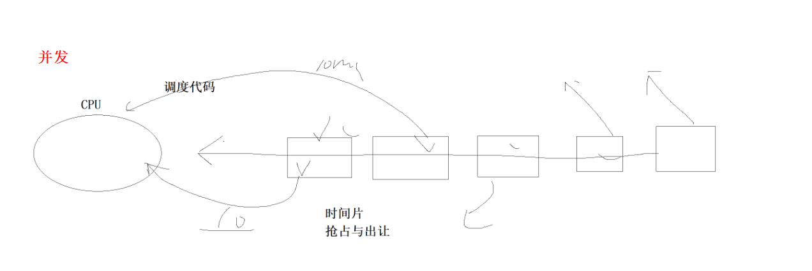

# 进程的优先级

## 目录

-   [进程优先级](#进程优先级)
-   [其他概念](#其他概念)
-   [Linux2.6内核的调度队列与调度原理](#Linux26内核的调度队列与调度原理)
    -   [活动队列](#活动队列)
    -   [过期队列](#过期队列)
    -   [总结](#总结)

## **进程优先级**

基本概念

-   cpu资源分配的先后顺序，就是指进程的优先权（priority）。
-   优先权高的进程有优先执行权利。配置进程优先权对多任务环境的linux很有用，可以改善系统性能。
-   还可以把进程运行到指定的CPU上，这样一来，把不重要的进程安排到某个CPU，可以大大改善系统整体性能

**查看系统进程**

在linux或者unix系统中，用ps –l命令则会类似输出以下几个内容：

-   ID : 代表执行者的身份
-   PID : 代表这个进程的代号
-   PPID ：代表这个进程是由哪个进程发展衍生而来的，亦即父进程的代号
-   PRI ：代表这个进程可被执行的优先级，其值越小越早被执行
-   NI ：代表这个进程的nice值

**PRI and NI**

-   PRI也还是比较好理解的，即进程的优先级，或者通俗点说就是程序被CPU执行的先后顺序，此值越小进程的优先级别越高
-   **那NI呢?就是我们所要说的nice**值了，其表示进程可被执行的优先级的修正数值
-   PRI值越小越快被执行，那么加入nice值后，将会使得PRI变为：**PRI(new)=PRI(old)+nice,每次修正时候都是从一个确定值PRI(old)80开始调整**
-   这样，当nice值为负值的时候，那么该程序将会优先级值将变小，即其优先级会变高，则其越快被执行
-   所以，调整进程优先级，在Linux下，就是调整进程nice值
-   nice其取值范围是-20至19，一共40个级别
-   Linux进程的PRI 优先级数值范围:60\~99, 默认进程的优先级都是:80

**PRI vs NI**

-   需要强调一点的是，进程的nice值不是进程的优先级，他们不是一个概念，但是进程nice值会影响到进程的优先级变化。
-   可以理解nice值是进程优先级的修正修正数据

**查看进程优先级的命令**

用top命令更改已存在进程的nice：

-   top
-   进入top后按“r”–>输入进程PID–>输入nice值

# **其他概念**

-   竞争性: 系统进程数目众多，而CPU资源只有少量，甚至1个，所以进程之间是具有竞争属性的。为了高效完成任务，更合理竞争相关资源，便具有了优先级
-   独立性: 多进程运行，需要独享各种资源，多进程运行期间互不干扰
-   并行: 多个进程在多个CPU下分别，同时进行运行，这称之为并行
-   并发: 多个进程在一个CPU下采用进程切换的方式，在一段时间之内，让多个进程都得以推进，称之为并发

并发中间会**切换**到其他进程，利用时间片.

-   寄存器:&#x20;
    > eax ebx, ecx, edx, ss, ds, cs ,gs, fs, ebp, esp, eip, status reg, cr0\~cr4, ..
-   **为什么我们函数内定义的栈临时变量，会返回给外部**,**不是说只有这个生命周期有效吗，为什么给外部访问到了**
    -   eax寄存器
    -   如果体制过大，会开辟移动空间充当代码的临时空间
    -   寄存器 != 寄存器的内容(比如int a = 10 ， a是变量，10是内容, 寄存器返回时候不是把a返回，而是把寄存器存储的10内容返回了)
-   **为什么我们的程序/进程，它怎么知道我们当前运行到哪里里?如何做到函数间跳转?**
    -   cpu内，eip: 程序计数器

我们的进程在运行的时候，是会使用这些寄存器的,我们的进程，会产生各种数据，在寄存器中临时保存

> EIP存储器是指x86体系结构中的一个寄存器，全称为"Extended Instruction Pointer"（扩展指令指针），它用于存储下一条将要执行的指令的内存地址。EIP寄存器在程序执行过程中不断更新，以指示下一条指令的位置。

> PC指针，也称为程序计数器（Program Counter），是指在计算机体系结构中用于存储下一条将要执行的指令的地址。PC指针也是一种寄存器，其值会随着每条指令的执行逐步增加，指向下一条指令的地址，从而实现程序的顺序执行。

> 需要注意的是，EIP是x86体系结构中专有的术语，而PC是更广泛地用于描述各种计算机体系结构中的概念。

如果我们有多个进程呢?/各个进程在CPU寄存器中形成的临时数据
都应该是不一样的!

-   进程的硬件上下文切换,要被系统保存起来，保存寄存器的内容和数据！,并不是保存寄存器，寄存器硬件带不走！

    那临时保存的数据保存在哪里？ 放在他进程的PCB数据里面，当他重新调动进程PCB时，在把数据和内容放进CPU里。但是当代操作系统不是这样做了 .&#x20;
    > 将cpu内的寄存器数据保存到进程PCB中(简单理解)，本质:CPU寄存器的内容，保存到内存中!
-   **所有的保存都是为了恢复！**&#x20;

***

# Linux2.6内核的调度队列与调度原理

-   维护两个queue\[140] , void \*active指向第一个队列（活动队列），void \*expired指向第二个队列（过期队列）
-   普通优先级：100～139（我们都是普通的优先级，想想nice值的取值范围，可与之对应！）
-   实时优先级：0～99（不关心）

如果正在调度该活动队列的优先级为80的队列，突然来了个优先级的60的队列该怎么办，难度插进去吗？这就体现不了公平性了，所以正在调动的队列是不插入进程的，插入的进程则放在过期队列里面，等活动队列调度完了，在swap(active,expired)， 在重新按优先级调度新插入的进程

## 活动队列

-   时间片还没有结束的所有进程都按照优先级放在该队列
-   nr\_active:总共有多少个运行状态的进程正在调度，如果等于表示该队列没有进程调度，就进行swap(active,expired)
-   queue\[140]:一个元素就是一个进程队列，相同优先级的进程按照FIFO规则进行排队调度,所以，数组下标就是优先级！
-   该结构中，选择一个最合适的进程，过程是怎么的呢？
    1.  从0下表开始遍历queue\[140]
    2.  到第一个非空队列，该队列必定为优先级最高的队列
    3.  拿到选中队列的第一个进程，开始运行，调度完成！
    4.  遍历queue\[140]时间复杂度是常数！但还是太低效了！
-   bitmap\[5]:一共140个优先级，一共140个进程队列，为了提高查找非空队列的效率，就可以用5\*32个比特位表示队列是否为空，这样，便可以大大提高查找效率

## 过期队列

-   active指针永远指向活动队列
-   expired指针永远指向过期队列
-   可是活动队列上的进程会越来越少，过期队列上的进程会越来越多，因为进程时间片到期时一直都存在的。
-   没关系，在合适的时候，只要能够交换active指针和expired指针的内容swap(active,expired)，就相当于有具有了一批新的活动进程！

## 总结

-   在系统当中查找一个最合适调度的进程的时间复杂度是一个常数，不随着进程增多而导致时间成本增加，我们称之为进程调度O(1)算法！
