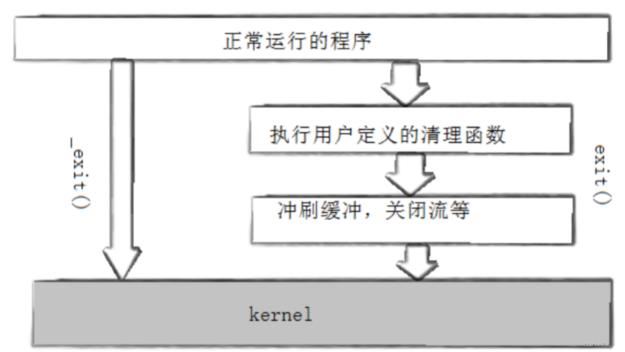

# 进程创建,fork/vfork

## 目录

-   [fork函数](#fork函数)
-   [写时拷贝](#写时拷贝)
-   [进程终止](#进程终止)
    -   [进程常见退出场景](#进程常见退出场景)
        -   [总结](#总结)
    -   [进程常见退出方法](#进程常见退出方法)
    -   [exit函数与\_exit函数](#exit函数与_exit函数)
-   [进程等待](#进程等待)
    -   [进程等待必要性](#进程等待必要性)
        -   [为什么要进行进程等待](#为什么要进行进程等待)
        -   [进程等待的方法](#进程等待的方法)
            -   [wait](#wait)
            -   [waitpid](#waitpid)
            -   [获取子进程status](#获取子进程status)
        -   [非阻塞等待](#非阻塞等待)
        -   [总结](#总结)
-   [进程程序替换](#进程程序替换)
    -   [替换函数](#替换函数)
        -   [函数解释](#函数解释)
        -   [命名理解](#命名理解)
        -   [初步使用exec系列函数](#初步使用exec系列函数)
        -   [execl系列](#execl系列)
        -   [execv系列](#execv系列)
        -   [系统进程程序替换接口execve函数](#系统进程程序替换接口execve函数)
-   [简易的shell](#简易的shell)
    -   [1. 打印提示符&&获取用户命令字符串获取成功](#1-打印提示符获取用户命令字符串获取成功)
    -   [2. 获取命令行](#2-获取命令行)
    -   [3. cd - 内置命令的理解](#3-cd---内置命令的理解)

# fork函数

*fork函数*

在linux中fork函数时非常重要的函数，它从已存在进程中创建一个新进程。新进程为子进程，而原进程为父进程。

> \#include \<unistd.h> pid\_t fork(void);    返回值：子进程中返回0，父进程返回子进程id，出错返回-1

-   进程调用fork，当控制转移到内核中的fork代码后，内核做：
    -   分配新的内存块和内核数据结构给子进程
    -   将父进程部分数据结构内容拷贝至子进程
    -   添加子进程到系统进程列表当中
    -   fork返回，开始调度器调度


当一个进程调用fork之后，就有两个二进制代码相同的进程。而且它们都运行到相同的地方。但每个进程都将可以

开始它们自己的旅程，看如下程序

```c++
int main(void)
{
  pid_t pid;
  printf("Before: pid is %d\n", getpid());
  if ((pid = fork()) == -1)perror("fork()"), exit(1);
  
  printf("After:pid is %d, fork return %d\n", getpid(), pid);
  sleep(1);
  return 0;
}
运行结果：

[root@localhost linux]# . / a.out
Before : pid is 43676

After : pid is 43676, fork return 43677
After : pid is 43677, fork return 0

```

这里看到了三行输出，一行before，两行after。进程43676先打印before消息，然后它有打印after。另一个after
消息有43677打印的。注意到进程43677没有打印before，为什么呢？如下图所示


所以，fork之前父进程独立执行，fork之后，父子两个执行流分别执行。注意，fork之后，谁先执行完全由调度器决定。

-   **fork函数返回值**
    -   子进程返回0，
    -   父进程返回的是子进程的pid。
-   **面试题: 请你描述一下，fork创建子进程，操作系统都做了什么?**
    -   fork创建子进程，是不是系统里多了一个进程,进程 = 内核数据结构 + 进程代码和数据! 进程一般从磁盘中米，也就是你的C/C++程序，加载之后的结果!
    -   创建子进程，给子进程分配对应的内核结构，必须子进程自己独有了，因为进程具有独立性!理论上，进程也要有自己的代码和数据!
        -   由于进程具有独立性，所以创建子进程需给子进程分配对应的内核结构。而对于一个进程来说，子进程应该也要有自己的代码和数据，但是对于fork之后创建的子进程并没有加载的过程，而是创建就立马运行。也就是说：子进程没有自己的代码和数据，子进程只能 “使用” 父进程的代码和数据
            -   **融汇贯通的理解：**

                fork创建子进程的特性是父进程的副本，父子进程代码共享。这与我们C语言中所学的常量字符串是类似的：
                ```c++
                const char* a = "12345";
                const char* b = "12345";
                ```
                1.  对于相同的字符串常量，由于只能读不能写，在并不可能改变的情况下，采取两个空间存储一样的数据，无疑是对于空间的浪费。

                    同样的道理，fork创建子进程的时候就直接进行代码和数据的拷贝分离，并不能保证子进程会的使用这些代码和数据，更或者用的到，也有可能只是读取。
        -   对数据而言: 可能被修改，所以必须分离。
            创建进程的时候，就直接拷贝分离? 问题是 可能子进程根本就不会用到的数据空间.即便是用到了，也可能只是读取。
            -   创建子进程，不需要将不会被访问的数据，或者只会读取的数据，拷贝一份
            -   但是，将来可能会对进程写入的数据，那父子进程会给一起修改吗？答案是不会
                -   所以OS选择了，写时拷贝技术，来进行将父子进程的数据进行分离!

***

# **写时拷贝**

通常，父子代码共享，父子再不写入时，数据也是共享的，当任意一方试图写入，便以写时拷贝的方式各自一份副本。具体见下图:


-   **写时拷贝**（copy-on-write， COW）就是等到**修改数据时**才真正分配内存空间，这是对程序性能的优化，可以延迟甚至是避免内存拷贝，当然目的就是避免不必要的内存拷贝。

    

    在 Linux 系统中，调用 fork 系统调用创建子进程时，并不会把父进程所有占用的内存页复制一份，而是与父进程共用相同的内存页，而当子进程或者父进程对内存页进行修改时才会进行复制 —— 这就是著名的 写时复制 机制。

    
-   **虚拟内存管理中的写时复制**
    -   一般把这种被共享访问的页面标记为只读。当一个task试图向内存中写入数据时，内存管理单元（MMU）抛出一个异常，内核处理该异常时为该task分配一份物理内存并复制数据到此内存，重新向MMU发出执行该task的写操作。
        -   父进程创建子进程的时候首先将自己的读写权限，改成只读，然后再创建子进程
            -   如果用户可能对某一批数据进行写入（如果只是只读如何写入，并且此时代码还在运行，那就由操作系统来管理）他会在某一时间点切入。把他改回写入。
                -   当页表转换会因为权限问题，出错（操作系统就可以介入了）
                    1.  如果是真的出错，那就抛出异常.

                        比如试图改变全局const变量
                    2.  不是出错，是我们某一批数据进行写入

                        触发我们进行重新申请内存拷贝内容的策略机制，
-   **0S为何要选择写时拷贝的技术，对父子进程进行分离**
    1.  用的时候，再给你分配，是高效使用内存的一种表现
    2.  OS无法在代码执行前预知那些空间会被访问
-   **fork之后，父子进程代码共享是所有，还是fork之后？**
    -   由于，我们的代码由编译器汇编之后，会有很多行代码。其会有自己的虚拟地址，也会有加载到内存中的物理地址。物理地址与虚拟地址会根据映射关系放在页表当中，虚拟地址会放在程序地址空间中，给CPU进行使用，CPU所能看见的仅仅是地址空间。也就是说CPU只知道虚拟地址，并不知道物理地址。
        -   因为，进程可能随时在并未执行完的时候被中断。而下次回来执行，还必须从之前中断的位置继续执行。所以执行的位置需要CPU随时记录，所以CPU中会有对应的寄存器数据（EIP）来记录当前进程需执行的位置。
            **融汇贯通的理解：**
        -   其实CPU也不是很聪明，甚至很笨。它只会执行：取指令、分析指令、执行指令。（分析指令需要认识大量的指令。所以CUP很笨，但是不得不说它很强）
        -   而取指令就是CPU的等待任务安排，由寄存器中的上下文数据提供。
            
        -   CPU执行的内容靠EIP提供地址找到地址空间，再以虚拟地址通过页表映射找到物理内存中的数据，随后将数据给与CPU进行分析命令、执行命令。而EIP通过加减此次使用数据的大小到达下一个数据的位置。
    -   虽然父子进程各自调度，各自修改EIP，但是不重要，因为子进程认为EIP起始值就是需要执行的起始点（fork之后的代码）。所以，是共享所有。
-   **fork常规用法**
    -   一个父进程希望复制自己，使父子进程同时执行不同的代码段。例如，父进程等待客户端请求，生成子进程来处理请求。
    -   一个进程要执行一个不同的程序。例如子进程从fork返回后，调用exec函数。
-   **fork调用失败的原因**
    -   系统中有太多的进程
    -   实际用户的进程数超过了限制

***

编译器是怎么知道我们的程序执行到哪里的?


1.  我们的代码汇编之后，会有很多行代码，而且每行代码加载到内存之后，都有对应的地址

&#x20; 2\. 因为进程随时可能被中断 (可能并没有执行完) ，下次回来，还必须从之前的位置继续运行(不是最开始哦!)，就要要求CPU必须随时记录下，当前进程执行的位置，所以，**CPU内有对应的寄存器**数据，用来记录当前进程的执行位置 !寄存器在CPU内，只有一份，寄存器内的数据，是可以有多份的!

-   **创建的时候，要不要给子进程?**

    虽然父子进程各自调度，各自会修改EIP,但是已经不重要了，因为了进程已经认为有了自己的EIP起始值，就是fork之后的代码

***

# 进程终止

-   **进程终止时，操作系统做了什么？**

    进程终止时，要释放进程申请的相关内核数据结构和数据的代码。本质就是释放系统资源。

### **进程常见退出场景**

-   **运行成功**
    -   代码跑完，结果正确
    -   代码跑完，结果不正确
-   **运行失败**
    -   代码没有跑完，程序崩溃了
-   **退出码** →&#x20;

    用代码，如何终结一个进程？什么是一个正确的终结？

    \*\*\*   0：\* \*成功，正确。

    **融汇贯通的理解：**
    -   在C/C++语言的书写上，对于main函数的return 0; 学语法的时候是说由于是int main()，返回值是int类型，所以需要返回一个整数（返回0就行了）。但是在学操作系统时，返回的是什么值就尤为重要了。

        &#x20;    main函数内：return语句，就是终止进程的！（return 退出码）
        写一个main函数return 0，并运行，可以发现：
    **命令：`echo $？`**   保存的是最近一个子进程执行完毕时的退出码

    
    -   &#x20; 因为对于运行结果我们关心的永远是：它错了究竟错在哪里、而不是它对了究竟对在哪里。所以用无数的非0值标识不同错误的原因。给我们的程序在运行结束之后，对于结果不正确时，方便定位错误的原因细节。&#x20;
-   **main函数返回**
    -   总体来说，mian函数返回值的意义是：返回给上一级进程，用来评判该进程执行的结果。
        我们可以利用一下代码将该进程的退出码打印出来。（每一个进程的错误码是不一定相同的，我们可以使用这些退出码和含义。但是。如果自己想定义，也可以自己设计一套退出方案。）

```c++
#include<stdio.h>
#include<string.h>
int main()
{
    for(int i = 0; i <= 134; ++i)
    {
        printf("%d: %s\n", i, strerror(i));
    }
    return 0;
}
```


-   这个进程是因为什么原因失败的! 1，2，3，4，5，6..... 我们就可以用不同的数字表示不同的原因!!
-   main函数的退出码是可以被父进程获取的，用来判断子进程的运行结果

#### **总结**

return是一种更常见的退出进程方法。执行return n等同于执行exit(n),因为调用main的运行时函数会将main的返回值当做 exit的参数。

退出码是出现于代码跑完，运行成功的时候。而退出码是程序员对于自身代码逻辑的判断。所谓好的程序员是代码高内聚，低耦合、代码框架、对象描述是极简并清晰的。但是资深程序员，具备以上的同时，应该对于自身所写的代码逻辑是无比清晰的，可以预判到自己所写的代码可能会出现的错误，并用退出码标识出来。这样可以使得，其对于bug代码的处理无需寻找问题再处理，而是直接处理问题。这就是高效的编写代码。

所以退出码是程序员对自身代码逻辑的一种错误预判标识。

***

-   C语言的错误码 errno

    `strerror` `error`是一个用于获取错误信息的函数。它接受一个整数参数作为错误码，并返回一个描述该错误的字符串。通常情况下，该函数使用全局变量errno来确定错误码。
    -   **strerror**
    ```c++
     int main()                                
    {                                         
        for(int i = 0; i < 200 ; i++)         
        {                                     
            printf("%d -> %s",i,strerror(i));
            printf("\n");                                                                                                                                
        }                                                                                                                                        
     }        
    0 -> Success
    1 -> Operation not permitted
    2 -> No such file or directory
    3 -> No such process
    4 -> Interrupted system call
    5 -> Input/output error
    6 -> No such device or address
    7 -> Argument list too long
    8 -> Exec format error
    9 -> Bad file descriptor
    10 -> No child processes
    11 -> Resource temporarily unavailable
    12 -> Cannot allocate memory
    .......
     
    错误码对应的信息
    ```
    `errno` 是一个全局的错误码变量，在系统调用或库函数的调用过程中遇到错误时，会被设置为一个整数错误代码，以便在程序中进行错误处理。这个错误代码反映了最近一个函数调用失败的原因。
    ```c++
      1 #include<stdio.h>
      2 #include<stdlib.h>
      3 #include<errno.h>
      4 #include<unistd.h>
      5 #include<string.h>
      6      
      7      
      9 int main()
     10 {    
     11     int ret = 0;
     12     printf("before: %d\n", errno);
     13     FILE *fp = fopen("./log.txt", "r");
     14     if(fp == NULL)
     15     {
     16         printf("after: %d, error string : %s\n", errno, strerror(errno));
     17         ret = errno;
     18         return ret;
     19     }
     20      
     21     return ret;                                                                                                                                      
     22 }    
     
      //输出结果 
     before: 0
     after: 2, error string : No such file or directory
    
    ```

***

## 进程常见退出方法

-   正常终止（可以通过`  echo $?  `查看进程退出码
    1.  . 从main返回
    2.  调用exit
    3.  &#x20;\_exit
-   异常退出
    1.  ctrl + c 信号终进程出异常，本质是进程收到了对应的信号，自己终止了
    2.  比如我们在运行程序中，kill 发送段错误或者野指针等信号给正常运行的代码进行中停，也可以信号终进程出异常.
-   错误码vs退出码
    -   错误码通常是 → 衡量一个库函数或者是一个系统调用一个函数的调用情况
    -   退出码通常是  → 一个进程退出的时候，他的退出结果
    当失败的时候，用来衡量函数、进程出错是的出错详细原因
-   父进程通过子进程的退出码来判断一个进程是否出异常，我们只要看有没有收到信号即可!
-   Kill 信号是从1开始的，所有当成功是返回0 。

```c++
[wxy@VM-8-6-centos 10-27]$ kill -l
 1) SIGHUP   2) SIGINT   3) SIGQUIT   4) SIGILL   5) SIGTRAP
 6) SIGABRT   7) SIGBUS   8) SIGFPE   9) SIGKILL  10) SIGUSR1
11) SIGSEGV  12) SIGUSR2  13) SIGPIPE  14) SIGALRM  15) SIGTERM
16) SIGSTKFLT  17) SIGCHLD  18) SIGCONT  19) SIGSTOP  20) SIGTSTP
21) SIGTTIN  22) SIGTTOU  23) SIGURG  24) SIGXCPU  25) SIGXFSZ
26) SIGVTALRM  27) SIGPROF  28) SIGWINCH  29) SIGIO  30) SIGPWR
31) SIGSYS  34) SIGRTMIN  35) SIGRTMIN+1  36) SIGRTMIN+2  37) SIGRTMIN+3
38) SIGRTMIN+4  39) SIGRTMIN+5  40) SIGRTMIN+6  41) SIGRTMIN+7  42) SIGRTMIN+8
43) SIGRTMIN+9  44) SIGRTMIN+10  45) SIGRTMIN+11  46) SIGRTMIN+12  47) SIGRTMIN+13
48) SIGRTMIN+14  49) SIGRTMIN+15  50) SIGRTMAX-14  51) SIGRTMAX-13  52) SIGRTMAX-12
53) SIGRTMAX-11  54) SIGRTMAX-10  55) SIGRTMAX-9  56) SIGRTMAX-8  57) SIGRTMAX-7
58) SIGRTMAX-6  59) SIGRTMAX-5  60) SIGRTMAX-4  61) SIGRTMAX-3  62) SIGRTMAX-2
63) SIGRTMAX-1  64) SIGRTMAX  
```

***

## **exit函数与\_exit函数**

-   \_exit
    ```c++
    #include <unistd.h>
    void _exit(int status);
    参数：status 定义了进程的终止状态，父进程通过wait来获取该值
    ```
    -   说明：虽然status是int，但是仅有低8位可以被父进程所用。所以\_exit(-1)时，在终端执行\$?发现返回值是255。
-   exit

```c++
#include <unistd.h>
void exit(int status);
```

exit最后也会调用\_exit, 但在调用\_exit之前，还做了其他工作：

1.  执行用户通过 atexit或on\_exit定义的清理函数。
2.  关闭所有打开的流，所有的缓存数据均被写入
3.  调用\_exit

***

-   exit在代码的任何地方都可以调用，都表示直接终止进程。

```c++

#include<stdio.h>
#include<unistd.h>
#include<stdlib.h>
int main()
{
    printf("你可以看见我吗？"); //注意此处没有写"\n"
    sleep(1);
    exit(100);
    return 0;
}

```


-   &#x20;  \_exit在代码的任何地方都可以调用，都表示直接终止进程。
    ```c++
    #include<stdio.h>
    #include<unistd.h>
    #include<stdlib.h>
    int main()
    {
        printf("你可以看见我吗？");
        sleep(1);
        _exit(100);
        return 0;
    }
    ```


> 我们们可以发现一样的逻辑代码，只是使用了不同的exit函数与\_exit函数，main函数确实在中途终止，并返回了我们随意写的退出码100。但是一个打印了语句，一个没有打印语句。这就是二者的区别。
>
> -   **知识回顾：**
>
>     在C语言中printf函数有一个特点，其需打印的数据是先放在缓冲区的，通过缓冲才打印出，日常我们所写的进程，是会结束时自动冲刷缓冲区的。而"\n"的是将存储在缓冲区的数据冲刷出，同时也打印后换行。
> -   **exit与\_exit的区别**
>
>     
> -   exit()是库函数（语言，应用）
> -   \_exit()是系统接口（操作系统）
>
>     通过此我们也可以更近一步的知道。所谓的缓冲区一定不是由操作系统维护的，而是由C标准库维护的。因为如果是操作系统维护的，那么缓冲区\_exit()也能进行刷新。我们目前知道的缓冲区，绝对不在操作系统内部
>     -   库函数 exit 可以在任意位置调用，用于退出进程， 并且退出前会刷新文件缓冲区中的数据到文件中
>     -   系统调用 \_exit 可以在任意位置调用，用于退出进程，但是退出时直接释放所有资源，并不会刷新缓冲区

***

# **进程等待**

> &#x20; 利用wait与waitpid操作系统接口进行进程等待。
>
> 进程等待：等待子进程退出，获取子进程返回值，释放子进程资源

## 进程等待必要性

-   子进程退出，父进程不管子进程，子进程就要处于僵尸状态 -- 导致内存泄漏
-   子进程一旦变成僵尸状态，那就刀枪不入，“杀人不眨眼”的kill -9 也无能为力，因为谁也没有办法杀死一个已经死去的进程。
-   最后，父进程派给子进程的任务完成的如何，我们需要知道。如，子进程运行完成，结果对还是不对，
    或者是否正常退出
-   父进程通过进程等待的方式，回收子进程资源，获取子进程退出信息.

***

### 为什么要进行进程等待

> 父进程通过进程等待的方式，回收子进程资源，获取子进程退出信息。父进程也可以不等待子进程，但是需要学习信号完才行。

-   **融汇贯通的理解：**
    -   **问：什么是进程等待？**

        **答：** 通过wait/waitpid的方式，让父进程(一般)对子进程进行资源回收的等待过程
    -   **问：为什么进程等待？**
        1.  解决子进程僵尸问题带来的内存泄漏问题 --- 目前必须
        2.  父进程为什么要创建子进程?要让子进程来完成任务。子进程将任务完成的如何，父进程要不要知道? 要知道--- 需要通过进程等待的方式取子进程退出的信息 --- 两个数字(退出状态,退出码)! --不是必须的，但是系统需要提供这样的基础功能.
    -   **问如何进行等待 ---- 重点**

        `wait /  waitid`
    父进程或者系统需要获取子进程的退出结果，进而就需要子进程维持住僵尸状态，读取结果。由于子进程结束成为并维持住了僵尸状态，就会出现僵尸进程的问题，所以需要通过进程等待的方式回收，否者就会导致内存泄漏。
    -   所以说，这是相互关联相互联系的，这也就是进程等待的作用。

### 进程等待的方法

**命令：man 2 wait**

**命令：man 2 waitpid**


-   如果子进程已经退出，调用wait/waitpid时，wait/waitpid会立即返回，并且释放资源，获得子进程退出信息。
-   如果在任意时刻调用wait/waitpid，子进程存在且正常运行，则进程可能阻塞。
-   如果不存在该子进程，则立即出错返回。

***

#### wait

```c++
#include<sys/types.h>
#include<sys/wait.h>

pid_t wait(int*status);

 返回值 ：
成功返回被等待进程pid，失败返回-1。

 参数： 
输出型参数，获取子进程退出状态,不关心则可以设置成为NULL
```

```c++
#include<stdio.h>
#include<unistd.h>
#include<stdlib.h>
#include <sys/types.h>
#include <sys/wait.h>
int main()
{
    pid_t id = fork();
    if(id < 0)
    {
        perror("fork");
        exit(1); //标识进程运行完毕，结果不正确
    }
    else if(id == 0)
    {
        //子进程
        int cnt = 5;
        while(cnt--)
        {
            printf("cnt: %d, 我是子进程, pid: %d, ppid : %d\n", cnt, getpid(), getppid());
            sleep(1);
        }
    }
    else
    {
       printf("before\n");
       pid_t ret = wait(NULL); //阻塞式的等待！
       printf("after\n");
        //父进程
       printf("我是父进程, pid: %d, ppid: %d\n", getpid(), getppid());
    }
    return 0;
}
```

-   &#x20;进程等待能回收子进程僵尸状态，Z->x
-   如果子进程根本就没有退出，父进程必须在wait上进行阻塞等待。直到子进程僵尸，wait自动回收，返回! (上面代码是这个例子)
-   一般而言，谁先运行不知道，但是最后一般都是父进程最后退出，因为阻塞等待.

`while :; do ps axj | head -1 && ps axj | grep mycode | grep -v grep; sleep 1; echo "----------------------------"; done`

每个一秒循环打印一个表格的头标（表格中数据的名称），并查找里面的myproc并去除grep后的进程最后打印"----------------------------"（用于显示的分割）。


-   **融汇贯通的理解：**

    阻塞的本质就是，当前进程调用某些接口，让自身处于某种等待资源条件的状态，当底层的条件没有就绪的时候，就要将自己处于某种等待队列当中，其中将自身的内核控制块当中的状态从R设置为S或者是D状态，处于等待某种资源的状态，当特定资源就绪时，就会立马从等待队列当中唤醒重新调用。

    简单来说就是：进程阻塞就是在系统函数内部，将进程放入阻塞队列当中。

***

#### waitpid

```c++
pid_ t waitpid(pid_t pid, int *status, int options);

 返回值 ：
1. 当正常返回的时候waitpid返回收集到的子进程的进程ID；   rid > 0: 等待成功 

2. 如果设置了选项WNOHANG,而调用中waitpid发现没有已退出的子进程可收集,则返回0； rid == 0: 等待是成功的 

3. 如果调用中出错,则返回-1,这时errno会被设置成相应的值以指示错误所在； rid < 0: 等待失败 


 参数： 
pid：
Pid=-1,等待任一个子进程。与wait等效。
Pid>0.等待其进程ID与pid相等的子进程。

 status: 
WIFEXITED(status):   若为正常终止子进程返回的状态，则为真。（查看进程是否是正常退出）
WEXITSTATUS(status): 若WIFEXITED非零，提取子进程退出码。（查看进程的退出码）

 options: 
WNOHANG: 若pid指定的子进程没有结束，则waitpid()函数返回0，不予以等待。若正常结束，则返回该子进程的ID。


 
waitpid(pid, NULL, 0) == wait(NULL)
```

-   如果子进程已经退出，调用wait/waitpid时，wait/waitpid会立即返回，并且释放资源，获得子进程退出信息。
-   如果在任意时刻调用wait/waitpid，子进程存在且正常运行，则进程可能阻塞。
-   如果不存在该子进程，则立即出错返回。


***

#### 获取子进程status

-   wait和waitpid，都有一个status参数，该参数是一个输出型参数，由操作系统填充。
-   如果传递NULL，表示不关心子进程的退出状态信息。
-   否则，操作系统会根据该参数，将子进程的退出信息反馈给父进程。
-   status不能简单的当作整形来看待，可以当作位图来看待，具体细节如下图（只研究status低16比特位）

```c++
测试代码：
#include <sys/wait.h>
#include <stdio.h>
#include <stdlib.h>
#include <string.h>
#include <errno.h>
int main(void)
{
    pid_t pid;
    if ((pid = fork()) == -1)
        perror("fork"), exit(1);
    if (pid == 0) {
        sleep(20);
        exit(10);
    }
    else {
        int st;
        int ret = wait(&st);
        if (ret > 0 && (st & 0X7F) == 0) { // 正常退出
            printf("child exit code:%d\n", (st >> 8) & 0XFF);
        }
        else if (ret > 0) { // 异常退出
            printf("sig code : %d\n", st & 0X7F);
        }
    }
}

测试结果：
[root@localhost linux]# . / a.out #等20秒退出
child exit code : 10
[root@localhost linux]# . / a.out #在其他终端kill掉
sig code : 9


```

`(st >> 8) & 0xFF` 和 `st & 0x7F` 是在处理进程状态的位掩码操作。

在这段代码中，父进程调用 `wait(&st)` 来等待子进程的退出状态，子进程的退出状态会保存在 `st` 变量中。

`(st >> 8) & 0xFF`：这个表达式用于获取子进程的退出码（exit code）。`st >> 8` 的操作将 `st` 右移 8 位，然后通过 `& 0xFF` 进行位与操作，以保留最低的 8 位，即获取子进程的退出码。

`st & 0x7F`：这个表达式用于获取导致子进程异常终止的信号码（signal code）。`& 0x7F` 的操作将 `st` 和二进制数 `01111111`（Ox7f） 进行位与操作，以保留低 7 位，即获取子进程终止时所收到的信号码。


-   次8位是进程的退出状态，低8位的第1位是core dump标志（gdb调试崩溃程序信号，此文用不到，先不讲解）。剩下的7位是终止信号。
-   其实waitpid的输出型参数status，对于退出状态、终止信号为了方便提取，都有其对应的提取方式

**其实waitpid的输出型参数status，对于退出状态、终止信号为了方便提取，都有其对应的提取方式**

-   **WIFEXITED(status**)：（查看进程信号是否是正常退出）
-   **WEXITSTATUS(status**)：（查看进程的退出码）
    > ps：&#x20;
    >
    > -   `WIFEXITED(status): `  若为正常终止子进程返回的状态，则为真。（查看进程是否是正常退出）
    > -   `WEXITSTATUS(status):` 若WIFEXITED非零，提取子进程退出码。（查看进程的退出码）

```c++
if(WIFEXITED(status))  （查看进程信号是否是正常退出） 
{
    //子进程是正常退出的
    printf("子进程执行完毕,子进程的退出码: %d\n", WEXITSTATUS(status));  （查看进程的退出码） 
}
else
{
    printf("子进程异常退出: %d\n", WIFEXITED(status));（ 查看进程信号异常码） 
}
```

-   **对于进程结果的判断需要有先后：**
    -   终止信号为0（运行成功），退出状态有效，可以看（结果是否正确）。有没有收到信号怎么判定? exit sig: 0所有这里就可以确定之前我们写的代码 return 0 这些是代码正确的
    -   终止信号为非0（运行失败），进程异常了(收到信号)， 退出状态exit code 已经没有意义了.
    -   **进程信号：** 是进程是否成功运行完的关键。进程异常退出，或者崩溃，本质就是操作系统通过发送信号的方式杀掉了进程。

**`命令：kill -l`**

可以查看操作系统用于发送以杀死进程的终止信号（对于应用层，了解前31个即可）


```c++
向子进程内加入一个野指针：
int* i = NULL;
*i = 100;

```


-   此时终止为非0，那么进程是被操作系统在中途杀死的，所以退出码没有意义。

**外部杀死进程**

> 将正在运行的子进程，通过命令行传入终止信号9杀死


程序异常，不光光是内部代码有问题，也有可能是外力直接杀死。

-   如果有多个子进程等待，我们可以 `waitpid(-1, &status, 0)` ， -1等待任一个子进程。与wai等效
    -   第一个参数
    -   Pid=-1,等待任一个子进程。与wait等效。
        Pid>0.等待其进程ID与pid相等的子进程。
-   我们为什么不用全局变量获取子进程的退出信息?&#x20;

    进程具有独立性，父进程无法直接获得子进程的退出信息

***

### 非阻塞等待

-   阻塞等待

```c++
int main()
{
    pid_t pid;
    pid = fork();
    if (pid < 0) {
        printf("%s fork error\n", __FUNCTION__);
        return 1;
    }
    else if (pid == 0) { //child
        printf("child is run, pid is : %d\n", getpid());
        sleep(5);
        exit(257);
    }
    else {
        int status = 0;
        pid_t ret = waitpid(-1, &status, 0);//阻塞式等待，等待5S
        printf("this is test for wait\n");
        if (WIFEXITED(status) && ret == pid) {
            printf("wait child 5s success, child return code is :%d.\n", WEXITSTATUS(status));
        }
        else {
            printf("wait child failed, return.\n");
            return 1;
        }
    }
    return 0;
}

运行结果:
[root@localhost linux] # . / a.out
child is run, pid is : 45110
this is test for wait
wait child 5s success, child return code is : 1
```

-   **waitpid方法**

    这就要使用waitpid中的参数options：`WNOHANG`选项，代表父进程非阻塞等待。
    -   \#问：为什么是`WNOHANG`而不是数字？

        在代码中没有具体含义的数字。叫做魔鬼数字/魔术数字，因为就一个数字放在那里，并无法直观的知道让他含义。所以采用WNOHANG的方式表明。

        Linux是C语言写的 -> 系统调用接口 -> 操作系统提供的接口 -> 就是C语言写的 -> 系统一般提供的大写标记位，如：WNOHANG就是宏定义的：#define WNOHANG 1

        **便于的理解：**

        WNOHANG可以理解为：Wait No HANG(夯)，在编程上有一个口头说法：夯住了。也就是打开一个软件或者是APP系统没有任何的反应，也就是系统并未对该进程进行CPU调度。要么是在阻塞队列中，要么是等待被调度。

        `pid_ t waitpid(pid_t pid, int *status, int options);`
        -   waitid 返回值

            rid > 0: 等待成功

            rid == 0: 等待是成功的，但是对方还没有退出  (非阻塞等待)

            rid < 0: 等待失败
        -   options
            -   为0 时候  ：   阻塞等待

                &#x20; 阻塞式调用wait/waitpid --- 子进程不退出，wait不返回
            -   WNOHANG: 等待的时候，以非阻塞的方式等待!

                如果我们等待的条件不满足，wait/waitpid不阻塞，而是立即返回!! 非阻塞等待。往往要进行重复调用，轮询轮询+非阻塞方案 == 非阳塞轮询方案，进行进程等待!! -- 好处? 当我们进行等待的过程中，可以顺便做一下自己的

```c++
#include <unistd.h>
#include <string.h>
#include <stdlib.h>
#include<vector>
#include<iostream>
#include <sys/types.h>
#include <sys/wait.h>
 
typedef void (*headler_t)();
 
std::vector<headler_t> handlers;
 
void fun_one()
{
    printf("这是一个临时任务1\n");
}
 
void fun_two()
{
    printf("这是一个临时任务2\n");
}
 
// 设置对应的方法回调
// 以后想让父进程闲了执行任何方法的时候，只要向Load里面注册，就可以让父进程执行对应的方法!
void Load()
{
    handlers.push_back(fun_one);
    handlers.push_back(fun_two);
}
 
int main()
{
    pid_t id = fork();
    if(id == 0)
    {
        //子进程
        int cnt = 3;
        while(cnt)
        {
            printf("我是子进程: %d\n",cnt--);
            sleep(1);
        }
    }
    else
    {
        while(1)
        {
            int status = 0;
            pid_t res = waitpid(-1, &status, WNOHANG); //以非阻塞方式等待
            if(res > 0)
            {
                //等待操作成功 && 等待到子进程结束
                printf("等待等待子进程退出成功, 退出码: %d\n", WEXITSTATUS(status));
                break;
            }
            else if(res == 0)
            {
                //等待操作成功 && 等待到子进程结束
                printf("进程还在运行中，暂时还没有退出，父进程可以在等一等, 处理一下其他事情\n");
                if(handlers.empty()) Load();
                for(auto iter : handlers)
                {
                    //执行处理其他任务
                    iter();
                }
            }
            else
            {
                //等待操作失败
                printf("wait失败！\n");
                break;
            }
            sleep(1); //每隔1s询问一次子进程是否结束
        }
    }
    return 0;
}
```


-   融汇贯通的理解：

    \#问：为什么要用到wait/waitpid？

    答：进程具有独立性，数据就会发生写实拷贝，父进程无法拿到数据。需要wait/waitpid进行获取。

    问：wait/waitpid为什么能拿到子进程数据？

    答：子进程为提供给父进程提取数据，会维持僵尸进程。而僵尸进程保留了该进程的PCB信息，其中的task\_struct里面保留了任何进程退出时的退出结果信息，wait/waitpid的本质就是读取进程task\_struct结构。
-   融汇贯通的理解：
    -   孤儿进程：
        （子进程死亡晚于父进程）父进程结束了、死亡了。而子进程还在运行，此时子进程就会被1号init进程领养
    -   僵尸进程：
        （子进程死亡早于父进程）父进程还在运行。而子进程结束了、死亡了，而子进程为了向父进程提供其需获取的数据，从而进入持续僵尸进程。但是父进程并未管他，进行回收，那么就会出现内核数据结构未释放，因为不会像new申请堆一样结束自动释放空间，于是导致内存泄漏。
    -   孤儿进程与僵尸进程的区别：
        子进程死亡与父进程死亡的相对性早晚。

***

### **总结**

-   等待主要就是阻塞等待与非阻塞等待。
    -   阻塞等待：一般都是在内核中阻塞，伴随着切换，等待被唤醒。
        
    -   非阻塞等待：父进程通过调用waitpid来进行等待，如果子进程没有退出，waitpid的这个系统调用会立马返回。
        
        补充：

    我们需要明白，回收资源，获取子进程退出结果，不是我们做的，而是我们使用接口完成这个操作的。而接口是由操作系统做的，我们通过接口让操作系统去做，而且这个操作只能操作系统去做，因为操作系统是管理者。资源管理，资源调度……只有管理者才能调用。我们是处于最顶层。

***

-   我们所创建的所有的子进程，执行的代码，都是父进程代码的一部分! 如果我们想让子进程执待新的程序呢? ? ? 执行全新的代码和访问全新的数据，不在和父进程有瓜葛
-   创建一个子进程的目的，肯定是为了做与父进程不同的事，于是想让子进程执行一个全新进程。就有了进程程序替换。

# 进程程序替换

-   程序替换，是通过特定的接口，加载磁盘上的一个权限的程序（代码和数据），加载到调用的进程地址空间中。
    -   **问：进程替换，有没有创建新的子进程？**

        没有！进程替换是通过将磁盘中的代码和数据放到内存中，然后改变子进程内核数据结构中的[页表](https://so.csdn.net/so/search?q=页表\&spm=1001.2101.3001.7020 "页表")映射关系。
    -   **什么是进程程序替换**

        &#x20;程序替换是通过特定的接口，加载磁盘上的一个程序（代码和数据），即加载到调用进程的地址空间中。
    -   **为什么，进程程序替换**

        想让子进程执行其他的程序，即不想让子进程执行父进程的部分而是执行一个全新的程序。
    -   **怎么办，进程程序替换？**

        进程程序替换的核心在于，如何将程序放入内存当中，即所谓的新程序的加载。Linux中采用**exec系列函数解决程序的加载**。而exec系列函数进行的操作是在，几乎不变化内核结构PCB的角度，将新的磁盘上的程序加载到内存，并和进程的页表重新建立映射。
-   程序替换是在当前进程pcb并不退出的情况下，替换当前进程正在运行的程序为新的程序（加载另一个程序在内存中，更新页表信息，初始化虚拟地址空间）
-   并且当前进程在运行完替换后的程序后就会退出，并不会继续运行原先的程序，这是尤其需要注意的。

## 替换函数

其实有六种以exec开头的函数,统称exec函数

```c++
#include <unistd.h>`
int execl(const char* path, const char* arg, ...);
int execlp(const char* file, const char* arg, ...);
int execle(const char* path, const char* arg, ..., char* const envp[]);
int execv(const char* path, char* const argv[]);
int execvp(const char* file, char* const argv[]);
int execve(const char *path, char *const argv[], char *const envp[]);

```

### 函数解释

1.  这些函数如果调用成功则加载新的程序从启动代码开始执行,不再返回。
2.  如果调用出错则返回-1
3.  所以exec函数只有出错的返回值而没有成功的返回值

***

### 命名理解

-   这些函数原型看起来很容易混,但只要掌握了规律就很好记。
    1.  l(list) : 表示参数采用列表
    2.  v(vector) : 参数用数组
    3.  p(path) : 有p自动搜索环境变量PATH
    4.  e(env) : 表示自己维护环境变量

***

### **初步使用exec系列函数**

-   man3 exec


-   **可知：**

    上面的6个函数是man 3，所以是由库提供的。是对系统调用的再次封装。而且其文档中有环境变量时的environ，也可以看出其进程程序替换与环境变量的知识关联。此处可更加深层次的了解环境变量。

```c++
int execl(const char *path, const char *arg, ...);
```

-   **path：** 路径 + 目标文件名
-   **arg，. . .：** 可变参数列表（可以传入多个不定个数参数） 最后必须以NULL结尾，表示参数传递完毕
-   **复习：**

    此处，对应环境变量时的知识，其中的main函数的第二个参数。即命令行参数的存储的char\*数组

```c++
#include <stdio.h>

int main(int argc, char* argv[])
{
    int i = 0;
    while (argv[i])
    {
        printf("%d: %s\n", i, argv[i++]);
    }
    return 0;
}
```


-   最后一个参数是NULL，表示命令行参数的结束。

```c++
#include <stdio.h>
#include <unistd.h>
 
int main()
{
    printf("当前进程的开始代码\n");
    execl("/usr/bin/ls","ls","-l",NULL);
    printf("当前进程结束\n");
    return 0;
}
```


还有一条printf怎么不见了??

-   **理解和掌握程序替换的原理，更改多进程版的程序替换的代码， 扩展理解和掌握程序替换的原理多进程**

    我们发现该程序所执行的进程，只是将execl函数之前的printf执行了，并未将其后的printf执行。这正是因为execl是程序替换，调用该函数成功后，会将当前进程的所有的代码和数据都进行替换！包括已经执行的与没有执行的。只不过由于execl函数之前的printf已经执行并输出了。所以，一旦调用成功，后续代码全部不执行。这也代表着execl无需进行返回值的判断，成功之后程序被替换，后续判断也会被替换没。所以没有判定返回值的意义。
    -   **融汇贯通的理解**：

        加载新进程之前，子进程的数据和代码与父进程共享，并且数据具有写时拷贝，这是fork的基本知识。而当子进程加载新进程的时候，在fork时所讲的代码不变而共享的存在，在此时也可以说是和数据一样，称为一种“写入”。所以代码也是需要父子分离，也是需要写时拷贝。如此在不仅仅是数据，代码也是需要写时拷贝的。

        如此在execl之后：父子进程在代码和数据上就彻底分开了，虽然曾经不冲突。
-   **exec函数以执行另一个程序。当进程调用一种exec函数时,该进程的用户空间代码和数据完全被新程序替换,从新程序的启动例程开始执行。调用exec并不创建新进程,所以调用exec前后该进程的id并未改变**
    -   进程不变，仅仅替换当前 进程的 代码和数据的技术，叫做 进程程序替换。并 没有创建新的进程。
        程序替换本质就是 把程序的代码+数据，加载到特定进程的上下文中。C/C++程序要运行，必须要先加载内存中，如何加载呢？是通过加载器，加载器的底层原理就是一系列的exec\*程序替换函数。
        

***

exec*这样的函数，如果当前进程执行成功，则后续代码没有机会在执行了! 因为被替换了!
exec*只有失败的返回值，没有成功返回值
不用判断了! 只要往后走就是出错了!

### **execl系列**

| **函数名** | **参数格式** | **路径提供** | **是否使用当前环境变量** |
| ------- | -------- | -------- | -------------- |
| execl   | **列表**   | **无**    | **是**          |
| execlp  | **列表**   | **有**    | **是**          |
| execle  | **列表**   | **无**    | **需自行传**       |

-   &#x20;**execlp**与**execl**的区别可以说是多了一个p，即可以理解为execl的基础上多了一个PATH，意思就是**会自行在环境变量PATH里查找，不需要使用写明执行的程序在哪个路径下**。但是建议统一按指定的路径写，避免发生什么问题

```c++
int execlp(const char *file, const char *arg, ...);
```

```c++
#include <stdio.h>
#include <unistd.h>
 
int main()
{
    printf("当前进程的开始代码\n");
    execlp("ls","ls", "-l", NULL);
 
    printf("当前进程的结束\n");
    return 0;
}

[wxy@VM-8-6-centos 11-8]$ ./mycode
代码begin::
total 20
-rw-rw-r-- 1 wxy wxy  110 Nov  8 19:59 Makefile
-rwxrwxr-x 1 wxy wxy 8408 Nov  8 20:25 mycode
-rw-rw-r-- 1 wxy wxy  326 Nov  8 20:25 test.c

```

-   **execl**e与**execl**的区别可以说是多了一个e，即可以理解为execl的基础上多了一个evn，也就是environ。意思就是需要我们自行传环境变量。

```c++
int execle(const char *path, const char *arg, ..., char * const envp[]);

```

```c++
#include <stdio.h>
#include <unistd.h>
 
int main(int argc, char *argv[], char* env[])
{
    //extern char **environ;
    printf("当前进程的开始代码\n");
    execle("/usr/bin/ls", "ls", "-l", NULL, env);
    //execle("/usr/bin/ls", "ls", "-l", NULL, environ);
 
    printf("当前进程的结束\n");
    return 0;
}
```

***

### **execv系列**

| **函数名** | **参数格式** | **路径提供** | **是否使用当前环境变量** |
| ------- | -------- | -------- | -------------- |
| execv   | **数组**   | **无**    | **是**          |
| execvp  | **数组**   | **有**    | **是**          |
| execvpe | **数组**   | **有**    | **需自行传**       |

-   **execv与execl的区别可以说是l变为了v**，即可以理解为l是list、v是vector，即一个是可变的链态传递，一个是定的数组态传递。

```c++
int execv(const char *path, char *const argv[]);
```

```c++
#include <stdio.h>
#include <unistd.h>
 
#define NUM 16
 
int main()
{
 
    printf("当前进程的开始代码\n");
    char *const _argv[NUM] = {
        (char*)"ls",
        (char*)"-a",
        (char*)"-l",
        (char*)"-i",
        NULL
    };
    execv("/usr/bin/ls", _argv);
    printf("当前进程的结束\n");
    return 0;
}

当前进程的开始代码
total 28
1446047 drwxrwxr-x  2 wxy wxy 4096 Nov  8 20:42 .
1050706 drwxrwxr-x 14 wxy wxy 4096 Nov  8 19:40 ..
1446048 -rw-rw-r--  1 wxy wxy  110 Nov  8 19:59 Makefile
1446050 -rwxrwxr-x  1 wxy wxy 8408 Nov  8 20:42 mycode
1446049 -rw-rw-r--  1 wxy wxy 1051 Nov  8 20:41 test.c

```

-   &#x20;**execvp**与**execv**的区别可以说是多了一个p，即可以理解为execv的基础上多了一个PATH，意思就是会自行在环境变量PATH里查找，不需要使用写明执行的程序在哪个路径下。但是建议统一按指定的路径写，避免发生什么问题

```c++
int execvp(const char *file, char *const argv[]);

```

```c++
#include <stdio.h>
#include <unistd.h>
 
#define NUM 16
int main()
{
 
    printf("当前进程的开始代码\n");
    char *const _argv[NUM] = {
        (char*)"ls",
        (char*)"-a",
        (char*)"-l",
        (char*)"-i",
        NULL
    };
    execvp("ls", _argv);
    printf("当前进程的结束\n");
    return 0;
}

当前进程的开始代码
total 28
1446047 drwxrwxr-x  2 wxy wxy 4096 Nov  8 20:44 .
1050706 drwxrwxr-x 14 wxy wxy 4096 Nov  8 19:40 ..
1446048 -rw-rw-r--  1 wxy wxy  110 Nov  8 19:59 Makefile
1446050 -rwxrwxr-x  1 wxy wxy 8408 Nov  8 20:44 mycode
1446049 -rw-rw-r--  1 wxy wxy 1424 Nov  8 20:44 test.c


```

-   &#x20;**execvpe**与**execvp**的区别可以说是多了一个e，即可以理解为execl的基础上多了一个evn，也就是environ。意思就是需要我们自行传环境变量。

```c++
int execvpe(const char *file, char *const argv[], char *const envp[]);
```

```c++
#include <stdio.h>
#include <unistd.h>
 
#define NUM 16
int main(int argc, char *argv[], char* env[])
{
    //extern char **environ;
    printf("当前进程的开始代码\n");
    char *const _argv[NUM] = {
        (char*)"ls",
        (char*)"-a",
        (char*)"-l",
        (char*)"-i",
        NULL
    };
    execvpe("/usr/bin/ls", _argv, env);
    //execvpe("/usr/bin/ls", _argv, environ);
    printf("当前进程的结束\n");
    return 0;
}

当前进程的开始代码
total 28
1446047 drwxrwxr-x  2 wxy wxy 4096 Nov  8 20:44 .
1050706 drwxrwxr-x 14 wxy wxy 4096 Nov  8 19:40 ..
1446048 -rw-rw-r--  1 wxy wxy  110 Nov  8 19:59 Makefile
1446050 -rwxrwxr-x  1 wxy wxy 8408 Nov  8 20:44 mycode
1446049 -rw-rw-r--  1 wxy wxy 1919 Nov  8 20:50 test.c

```

***

我们的程序替换，能替换系统指令程序，能替换我写的程序吗?

-   exec\*叫做进程的程序替换,他可以再C语言程序中替换成c++ 或者 .py 或者java 等程序文件，因为系统大于一切
    -   ps：一个makefile文件

        &#x20;
        ```c++
        .PHONY:all
        all:mytest myprocess


        mytest:mytest.cc
          g++ -o $@ $^ -std=c++11
        myprocess:myprocess.c
          gcc -o $@ $^ -std=c99
        .PHONY:clean
        clean:
          rm -f myprocess mytes          
    
        ```
        `.PHONY: all` 是用来声明 `all` 是一个伪目标（phony target），表示它不代表一个真正的文件，而是一个标识符。
    
        `all: mytest myprocess` 定义了一个 `all` 目标，并且它依赖于 `mytest` 和 `myprocess` 两个目标。这意味着当你运行 `make all` 命令时，Make 会按照指定的顺序编译和链接 `mytest` 和 `myprocess`。
    
        通过将这些目标放在 `all` 目标中，当你运行 `make` 命令时，只需要输入 `make all` 或者简单地输入 `make`，Make 就会执行 `all` 目标的规则来生成 `mytest` 和 `myprocess` 可执行文件。
    
        这种方式可以使编译和链接更加方便，而不需要多次写复杂的命令，只需要执行一个简单的 `make` 命令即可生成所有目标。
    
        就是为了生成`mytest myprocess` 写成这样
    -   **myprocess.c**
    ```c++
    #include <stdio.h>
    #include <unistd.h>
    #include <stdlib.h>
    #include <sys/types.h>
    #include <sys/wait.h>
    
    int main()
    {
        pid_t id = fork();
        if (id == 0)
        {
            printf("pid: %d, exec command begin\n", getpid());
            execl("/usr/bin/C++", "test.cc", "test.py", NULL);
            printf("pid: %d, exec command end\n", getpid());
            exit(1);
        }
        else {
            // father
            pid_t rid = waitpid(-1, NULL, 0);
            if (rid > 0)
            {
                printf("wait success, rid: %d\n", rid);
            }
        }
        return 0;
    }
    ```
    -   test.cc
    ```c++
    #include <iostream>
    
    int main(int argc, char *argv[], char *env[])
    {
        std::cout << "hello C++" << std::endl;
        std::cout << "hello C++" << std::endl;
        std::cout << "hello C++" << std::endl;
        std::cout << "hello C++" << std::endl;
    
        return 0;
    }
    ```

***

-   我们进行程序替换的时候，子进程对应的环境变量，是可以直接从父进程来的&#x20;


-   环境变量被子进程继承下去是一种默认行为，不受程序替换的影响，通过地址空间可以让子进程继承父进程的环境变量数据，环境变量和命令行参数也是进程的数据啊.
-   `int execvpe(const char *file, char *const argv[], char *const envp[]);` &#x20;

    envp环境变量 不是新增，而是覆盖式传递!

    传递一个新的环境变量数组（envp），以覆盖现有的环境变量。这意味着传递给该函数的新环境变量将会覆盖已存在的环境变量，而不是新增环境变量。

    在调用execvpe() 函数时，您可以通过 envp 参数传递一个新的环境变量数组。该数组应该是以 NULL 结束的字符串指针数组，每个字符串表示一个环境变量，通常使用 “变量名=值” 的形式表示。传递的新环境变量将会替换原有的环境变量，如果不希望更改环境变量，可以将 envp 参数设置为 NULL。

    总之，execvpe() 函数提供了一种覆盖式传递环境变量的方式，而不是新增环境变量。
-   让子进程执行的时候，获得的环境变量
    1.  将父进程的环境变量原封不动传递给子进程  1. 直接用 2.直接传
    2.  我们想传递我们自己的环境变量 , 我们可以直接构造环境变量表，给子进程传递
    3.  我们想传递我们自己的环境变量! 我们可以直接构造环境变量表，给子进程传递
-   程序替换 可以 将命令行参数，和环境变量通过自己的参数，传递给 被替换的程序的main函数中!

***

### 系统进程程序替换接口execve函数

-   事实上,只有execve是真正的系统调用,其它五个函数最终都调用 execve,所以execve在man手册 第2节,其它函数在man手册第3节。这些函数之间的关系如下图所


```c++
#include <stdio.h>
#include <unistd.h>
 
#define NUM 16
int main()
{
    extern char **environ;
    printf("当前进程的开始代码\n");
    char *const _argv[NUM] = {
        (char*)"ls",
        (char*)"-a",
        (char*)"-l",
        (char*)"-i",
        NULL
    };
    execve("/usr/bin/ls", _argv, environ);
    printf("当前进程的结束\n");
}
```

用fork创建子进程后执行的是和父进程相同的程序(但有可能执行不同的代码分支),子进程往往要调用一种exec函数以执行另一个程序。当进程调用一种exec函数时,该进程的用户空间代码和数据完全被新程序替换,从新程序的启动例程开始执行。调用exec并不创建新进程,所以调用exec前后该进程的id并未改变。

-   **融汇贯通的理解：**

    进程程序替换原理：结合进程地址空间，通过将新的磁盘数据加载到内存中，通过改变子进程页表的映射关系，以此达到建立进程的时候，先创建子进程再加载代码与数据的操作。

    我们的手机或者电脑，并不是先将代码与数据加载到内存，而是先把进程创建出来。然后子进程通过加载函数exec系列系统接口，将磁盘的软件、app程序加载到内存里。

    所以说：进程是一个运行起来的程序，是对的但是不够准确。因为程序也有可能没运行（并未进程替换），但是进程已经有了。

    ————————————————

***

# 简易的shell

shell执行命令的时候，我们所执行的命令是处于磁盘的、在文件系统里面、在目录结构里面是一个特定路径下的程序，跑起来之后变成一个进程。其运行的本质就是shell给其创建了一个子进程，然后让子进程直接执行一个exec类型的系统接口，将磁盘的内容加载到内存中去跑起来。

-   考虑下面这个与shell典型的互动
    ```c++
    [root@localhost epoll]# ls
    client.cpp readme.md server.cpp utility.h
    [root@localhost epoll]# ps
    PID TTY TIME CMD
    3451 pts/0 00:00:00 bash
    3514 pts/0 00:00:00 ps
    ```
    用下图的时间轴来表示事件的发生次序。其中时间从左向右。shell由标识为sh的方块代表，它随着时间的流逝从左向右移动。shell从用户读入字符串"ls"。shell建立一个新的进程，然后在那个进程中运行ls程序并等待那个进程结束

    

    然后shell读取新的一行输入，建立一个新的进程，在这个进程中运行程序 并等待这个进程结束。
    -   以要写一个shell，需要循环以下过程
        1.  打印提示符&&获取用户命令字符串获取
        2.  获取命令行
            -   需要将从标准输入中获取的支付串进行分析，将其分散为可用的命令（如："ls -a -l -i" -> "ls" "-a" "-l" "-i"）。利用C字符串函数strtok
        3.  解析命令行
        4.  建立一个子进程（fork）
        5.  替换子进程（execvp）

***

## 1. 打印提示符&&获取用户命令字符串获取成功

```c++
#include<stdio.h>
#include<stdlib.h>
#include<string.h>


#define NUM 1024

const char* Getusername()
{
    const  char* name = getenv("USER");
    if(name) return name;
    else return NULL;
}

const char* GetHostname()
{
    const char* name = getenv("HOSTNAME");
    if(name) return name;
    else return NULL;
}

const char* GetCwd()
{
    const char* name = getenv("PWD");
    if(name) return name;
    else return NULL;
}

int GetuserCommand(char* usercommand, int num)
{
    printf("[%s@%s %s]# ",Getusername(),GetHostname(),GetCwd());
    char* r =  fgets(usercommand,num,stdin);
    if(r == NULL) return -1;
    usercommand[strlen(usercommand)-1] = '\0';
    return strlen(usercommand);
}

int main()
{
    while(1)
    {
        char usercommand[NUM];
        // 1. 打印提示符&&获取用户命令字符串获取成功
        int n =   GetuserCommand(usercommand,sizeof(usercommand));
        
        //n小于0表示没有输入重新
        if(n<=0) 
            continue;
    }   
}


[wxy@VM-8-6-centos 11-16]$ ll
total 12
-rw-rw-r-- 1 wxy wxy  112 Nov 16 11:59 Makefile
-rw-rw-r-- 1 wxy wxy 1017 Nov 16 12:19 myshell.c
-rw-rw-r-- 1 wxy wxy  330 Nov 16 10:10 test.c
[wxy@VM-8-6-centos 11-16]$ make
编译成功
[wxy@VM-8-6-centos 11-16]$ ./mycode
[wxy@VM-8-6-centos /home/wxy/linux_-code/11-16]# ls

```

—

***

## 2. 获取命令行

> 需要将从标准输入中获取的支付串进行分析，将其分散为可用的命令（如："ls -a -l -i" -> "ls" "-a" "-l" "-i"）。利用C字符串函数strtok

```c++
#include<stdio.h>
#include<stdlib.h>
#include<string.h>
#include<unistd.h>

#define NUM 1024
#define SIZE 64
#define SEP " " 
#define Debug 1
int lastcode = 0;
const char* Getusername()
{
    const  char* name = getenv("USER");
    if(name) return name;
    else return NULL;
}

const char* GetHostname()
{
    const char* name = getenv("HOSTNAME");
    if(name) return name;
    else return NULL;
}

const char* GetCwd()
{
    const char* name = getenv("PWD");
    if(name) return name;
    else return NULL;
}

int GetuserCommand(char* usercommand, int num)
{
    printf("[%s@%s %s]# ",Getusername(),GetHostname(),GetCwd());
    char* r =  fgets(usercommand,num,stdin);
    if(r == NULL) return -1;
    usercommand[strlen(usercommand)-1] = '\0';
    return strlen(usercommand);
}

void commandSplit(char* usercommand, char* argv[])
{
    int index = 0;
    argv[index++] =strtok(usercommand,SEP);
    while(argv[index++]= strtok(NULL,SEP));
#ifdef Debug
    int i = 0 ;
    for( i = 0; argv[i]; i++)
    {
        printf("%d:%s\n", i, argv[i]);
    }
#endif
}

int execute(char* argv[])
{
    pid_t id = fork(); 
    if(id < 0) return -1;
    else  if(id == 0)
    {
        //child
        execvp(argv[0],argv);
        exit(-1);
    }
    else 
    {
        //fater
        int status = 0;
        pid_t ret = waitpid(id,&status,0);
        if(ret > 0)
        {
            lastcode = WEXITSTATUS(status);
        }
    }
    return 0;
}

int main()
{
    while(1)
    {
        char usercommand[NUM];
        char* argv[SIZE];
        // 1. 打印提示符&&获取用户命令字符串获取成功
        int n =   GetuserCommand(usercommand,sizeof(usercommand));
        
        //n小于0表示没有输入重新
        if(n<=0) 
            continue;
        //  2. 分割字符串
        commandSplit(usercommand,argv);
        
        //  4. 执行对应的命令 
        execute(argv);
    }   
}

[wxy@VM-8-6-centos 11-16]$ ./mycode
[wxy@VM-8-6-centos /home/wxy/linux_-code/11-16]# ls -a -l
total 36
drwxrwxr-x 3 wxy wxy 4096 Nov 16 14:58 .
drwxrwxr-x 8 wxy wxy 4096 Nov 16 12:13 ..
drwxrwxr-x 8 wxy wxy 4096 Nov 16 14:51 .git
-rw-rw-r-- 1 wxy wxy  112 Nov 16 11:59 Makefile
-rwxrwxr-x 1 wxy wxy 9064 Nov 16 14:58 mycode
-rw-rw-r-- 1 wxy wxy 1923 Nov 16 14:58 myshell.c
-rw-rw-r-- 1 wxy wxy  330 Nov 16 10:10 test.c
[wxy@VM-8-6-centos /home/wxy/linux_-code/11-16]# pwd
/home/wxy/linux_-code/11-16
[wxy@VM-8-6-centos /home/wxy/linux_-code/11-16]# cd..
[wxy@VM-8-6-centos /home/wxy/linux_-code/11-16]# pwd
/home/wxy/linux_-code/11-16


```

## 3. **cd - 内置命令的理解**

当我们使用myshell执行cd会发现：


&#x20;  当我们执行cd的时候，会发现使用cd成功了，但是myshell中的当前地址并且改变。这是因为我们将cd的操作放在了子进程上，子进程进行了cd并不会改变父进程的当前地址。


我们执行的命令是通过父进程也就是myshell创出的子进程，经过进程替换成我们所输入的命令的可执行程序的代码和数据，其执行起来的进程是子进程角度上的。我们需要在父进程上。

-   **内置命令：** 让父进程（myshell）自己执行的命令，叫做内置命令，内建命令。

    内建命令就是bash自己执行的，类似于自己内部的一个函数

    

    &#x20; cd由于是内置命令，所以其是与普通的如"ls"命令是不同的，其并不是一个存储在硬盘的可执行程序，而是由系统提供的系统接口实现。

    `chdir` 是 C 标准库中的一个函数，用于改变当前进程的工作目录。它是 “change directory” 的缩写。

    `chdir` 的原型如下：
    ```c++
    int chdir(const char *path);
    ```
    `chdir` 函数接受一个字符串作为参数，表示要切换到的目录的路径名。如果切换成功，返回值为 0，否则返回一个非零值。

    `chdir` 函数可以用于在程序运行时操作文件系统目录，切换当前进程的工作目录。

[<https://gitee.com/XMLife/linux> \_-code/blob/master/11-16/myshell.c](https://gitee.com/XMLife/linux_-code/blob/master/11-16/myshell.c "https://gitee.com/XMLife/linux_-code/blob/master/11-16/myshell.c")  最终版本


所写的myshell是用while为核心的，而在经过export,cd,环境变量操作后continue，将会进行下一次while，如果 cwd 写成局部变量 而上一个while的环境变量的实际存储位置是在cwd中，再次循环会因为命令的输入而刷新掉实际环境变量的数据。所于是环境变量表中存储的地址就会变为野指针，不能在一个临时变量里面存储。所以我们需要写一个全局的变量，进行拷贝存放。

```c++
char cwd[];
void cd(const char *path)
{
    //char cwd[]; error
    chdir(path);
    char tmp[1024];
    getcwd(tmp, sizeof(tmp));
    sprintf(cwd, "PWD=%s", tmp); // bug
    putenv(cwd);
}
```

shell执行命令的方式通常有两种：

第三方提供的对应的在磁盘中有具体的二进制文件的可执行程序（由子进程执行）。

shell内部，自己实现的方法，由自己（父进程）来进行执行。 （因为有一些命令就是要影响到shell本身，如：cd，export）

从myshell的角度更可以直接的解释，程序替换的必要性，一定是和应用场景有关的，有时候就是需要子进程去执行一个全新的程序。
