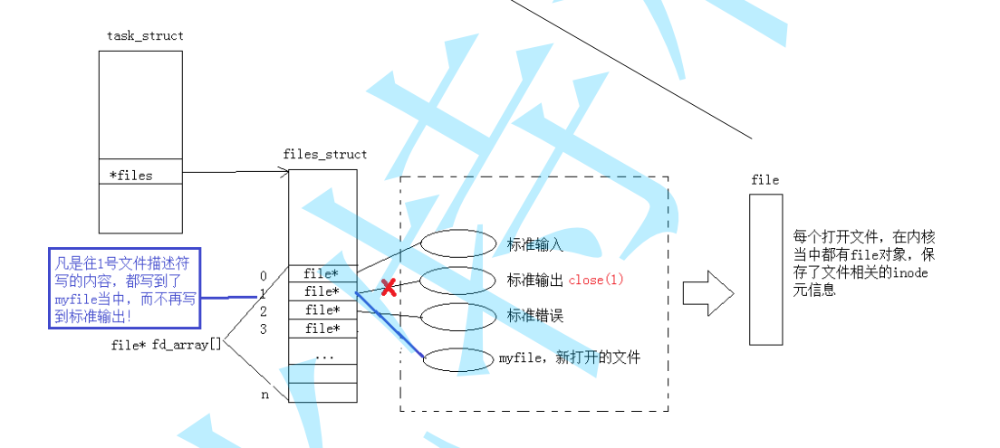
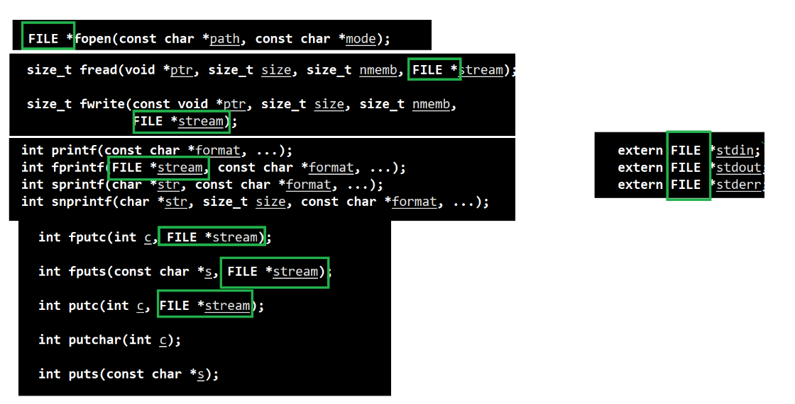

# Linux基础I/0

## 目录

-   [预备知识:](#预备知识)
-   [回顾C文件接口](#回顾C文件接口)
    -   [输出信息到显示器，你有哪些方法](#输出信息到显示器你有哪些方法)
    -   [stdin & stdout & stderr](#stdin--stdout--stderr)
-   [系统文件I/O](#系统文件IO)
    -   [open接口介绍](#open接口介绍)
-   [尝试着理解文件， 打通语言和系统关于问价部分的理解](#尝试着理解文件-打通语言和系统关于问价部分的理解)
-   [文件描述符fd](#文件描述符fd)
-   [0 & 1 & 2](#0--1--2)
-   [Linux理解一切皆文件](#Linux理解一切皆文件)
-   [文件描述符的分配规则](#文件描述符的分配规则)
-   [重定向](#重定向)
-   [使用 dup2 系统调用](#使用-dup2-系统调用)
-   [fopen fclose fread fwrite fseek](#fopen-fclose-fread-fwrite-fseek)
    -   [接口熟悉](#接口熟悉)
-   [read / write / lseek 接
    
    [TOC]
    
    [口](#read--write--lseek-接口)
    -   [使用熟悉接口](#使用熟悉接口)
-   [缓冲区](#缓冲区)
    -   [缓冲区理解](#缓冲区理解)
    -   [来段代码研究缓冲区](#来段代码研究缓冲区)
    -   [理解样列](#理解样列)
    -   [缓冲区刷新](#缓冲区刷新)
    -   [缓冲区在哪里](#缓冲区在哪里)
    -   [模拟实现一下C标准版库的函数](#模拟实现一下C标准版库的函数)
-   [理解文件系统](#理解文件系统)
    
    -   [磁盘级文件](#磁盘级文件)
    -   [磁盘物理结构](#磁盘物理结构)
    -   [磁盘存储结构](#磁盘存储结构)
    -   [磁盘文件系统](#磁盘文件系统)
-   [理解软硬链接](#理解软硬链接)
    -   [软连接](#软连接)
        -   [应用](#应用)
        -   [硬连接](#硬连接)
            -   [应用](#应用)
        -   [软硬链接的区别](#软硬链接的区别)

## 预备知识:

1.  文化 = 内容 + 属性
2.  所有对文件的操作:
    1.  对内容操作&#x20;
    2.  对属性操作
3.  内容是数据，属性其实也是数据 --- 存储文件，必须及存储内容，又存储属性数据 ---! 默认就是在磁盘中的文件!
    -   操作系统来做加载磁盘上的文件，一定会设计到访问磁盘设备  - 操作系统来做
4.  我们要访问一个文件的时候，都是要先把这个文件先打开的
    -   这个“我们”指的是是谁？ 难道编译代码文件就打开了吗？ 只有代码跑起来才会执行打开文件。本质是进程访问文件
    -   文件打开前 是一个 普通的磁盘文件
    -   文件打开后 将文件加载到内存, 又操作系统访问，因为根据冯诺依曼CPU只跟内存打交道.

        CPU通过和内存的交互来操作文件。当需要读取或写入文件时，CPU向操作系统发送相应的指令，然后操作系统负责将文件内容加载到内存中，并让CPU可以通过内存进行访问和操作。
        
5.  一个进程可以打开多个文件吗? 多个进程可以打开多个文件吗 ?&#x20;
    -   加载到内存中，被打开的文件，可能会存在多个

        进程: 打开的文件 = 1: n(1)    一个进程通过操作系统，打开文件.操作系统一定要给我们提供系统调用接口
6.  文件按照是否被打开，分为: 被打开的文件 没有被打开的文件
    -   被打开的文件 : → 内存中
    -   没有被打开 ： → 磁盘中
7.  研究本次文件操作的本质
    -   进程 和 被打开文件的关系

***

# 回顾C文件接口

| 操作方式  | 含义                  | 如果该文件不存在 |
| ----- | ------------------- | -------- |
| "r"   | 为了读，打开一个已经存在的文本文件   | 出错       |
| "w"   | 为了写，打开一个文本文件        | 新建文件     |
| "a"   | 向文本文件尾添加数据          | 新建文件     |
| "rb"  | 为了输入数据，打开一个二进制文件    | 出错       |
| "wb"  | 为了输出数据，打开一个二进制文件    | 新建文件     |
| "ab"  | 向一个二进制文件尾添加数据       | 出错       |
| "r+"  | 为了读和写，打开一个文本文件      | 出错       |
| "w+"  | 为了读和写，新建一个新的文件      | 新建文件     |
| "a+"  | 打开一个文件，在文件尾进行读写     | 新建文件     |
| "rb+" | 为了读和写打开一个二进制文件      | 出错       |
| "wb+" | 为了读和写，新建一个新的二进制文件   | 新建文件     |
| "ab+" | 打开一个二进制文件，在文件尾进行读和写 | 新建文件     |


***

## 输出信息到显示器，你有哪些方法

```c++
#include <stdio.h>
#include <string.h>
int main()
{
const char *msg = "hello fwrite\n";
fwrite(msg, strlen(msg), 1, stdout);
printf("hello printf\n");
fprintf(stdout, "hello fprintf\n");
return 0;
}

[wxy@VM-8-6-centos 11_24]$ ./mycode
hello fwrite
hello printf
hello fprintf

```

## stdin & stdout & stderr

-   C默认会打开三个输入输出流，分别是stdin, stdout, stderr

```c++
#include <stdio.h>#include <string.h>
int main(){
  const char *msg = "hello fwrite\n";
  fwrite(msg, strlen(msg), 1, stdout);
  printf("hello printf\n");
  fprintf(stdout, "hello fprintf\n");return 0;
}
```

-   仔细观察发现，这三个流的类型都是FILE \*, fopen返回值类型，文件指针

***

# 系统文件I/O

操作文件，除了上述C接口（当然，C++也有接口，其他语言也有），我们还可以采用系统接口来进行文件访问，先来直接以代码的形式，实现和上面一模一样的代码.&#x20;

-   我们学习的C语言打开文件的接口，底层一定封装了系统调用接口


## open接口介绍

当使用 `open()` 函数时，你可以整理成以下的 Markdown 语法：

````c++
## open()函数

- 功能：打开一个指定的文件并获得文件描述符，或者创建一个新文件
- 头文件：
  ```c
  #include <sys/types.h>
  #include <sys/stat.h>
  #include <fcntl.h>
````

-   原型：
    -   `int open(const char *pathname, int flags)`
    -   `int open(const char *pathname, int flags, mode_t mode)`
-   参数：
    -   `pathname`：要打开的文件路径名称
    -   `flags`：
        -   `O_RDONLY`：只读打开
        -   `O_WRONLY`：只写打开
        -   `O_RDWR`：可读可写打开
        -   `O_CREAT`：如果文件不存在，就创建该文件
        -   `O_TRUNC`：格式化文件
        -   `O_APPEND`：以追加的方式打开文件
        -   `O_NONBLOCK`：非阻塞
        -   `O_EXCL`：与 `O_CREAT` 一起调用，确保调用者创建出文件。防止两个程序同时创建一个文件，如果文件已经存在，`open` 调用将失败并返回-1。
    -   `mode`：新建的文件的权限
-   返回值：
    -   成功：返回文件的描述符fd (fd为大于0的整数)
    -   失败：返回-1，并且errno会被设置
-   flags  关于函数传入标志位的技巧-- Linux中常用的传参方式, 类型与下面这样

```c++
#include <stdio.h>

#define Print1 1      // 0001
#define Print2 (1<<1) // 0010
#define Print3 (1<<2) // 0100
#define Print4 (1<<3) // 1000

void Print(int flags)
{
    if(flags&Print1) printf("hello 1\n");
    if(flags&Print2) printf("hello 2\n");
    if(flags&Print3) printf("hello 3\n");
    if(flags&Print4) printf("hello 4\n");
}


int main()
{
    Print(Print1);
    Print(Print1|Print2);
    Print(Print1|Print2|Print3);
    Print(Print3|Print4);
    Print(Print4);
    return 0;
}
这段代码展示了如何使用标志位作为函数参数，在函数内部根据标志位的值来执行相关操作。使用标志位作为参数的好处在于可以在一个函数调用中设置多个选项，而不需要使用多个参数。

[wxy@VM-8-6-centos 11_24]$ ./myprocess
hello 1

hello 1
hello 2

hello 1
hello 2
hello 3

hello 3
hello 4

hello 4


```

mode\_t理解：直接 man 手册，比什么都清楚。

open 函数具体使用哪个，和具体应用场景相关，如目标文件不存在，需要open创建，则第三个参数表示创建文件的默认权限,否则，使用两个参数的open.

***

```c++
#include<stdio.h>
#include<stdlib.h>
#include<sys/types.h>
#include<sys/stat.h>
#include<fcntl.h>
#include<unistd.h>
#include<string.h>
int main()
{
    int fd = open("log.txt",O_WRONLY | O_CREAT | O_TRUNC,0666);
    if(fd < 0)
  {
    perror("error : ");
    return 1;
  }
  const char* msg = "ccc\n";
  write(fd,msg,strlen(msg)); 
   fd: 后面讲， msg：缓冲区首地址， len: 本次读取，期望写入多少个字节的数据。 返回值：实际写了多少字节数据   
   close(fd);
  return 0;
}
[wxy@VM-8-6-centos 11_24]$ cat log.txt
ccc

```

-   注意

    当我们想向一个文件中写入字符串的时候，
    不需要strlen +1,"\0"是C语言的规定，不是文件的规定
-   open第三个参数创造出来为什么是664 `rw- rw- r—`
    ```c++
    [wxy@VM-8-6-centos 11_24]$ ll
    total 28
    -rw-rw-r-- 1 wxy wxy    4 Nov 24 14:28 log.txt
    
    ```
    主要是操作系统存在一个掩码，如果不想可以去掉，`umask函数` ` umask(0)` 把掩码改成0， 后面创造就可以按指定的掩码来设定了，可是系统给我们的是002，自己设定000，到底用哪个，就近原则，谁离open最近用谁， 但是不建议自己设定.
-   `write`  函数是通过向文件中写入内容而实现写文件操作，函数默认是从前往后覆盖式写入数据。


***

# 尝试着理解文件， 打通语言和系统关于问价部分的理解

在认识返回值之前，先来认识一下两个概念: 系统调用 和 库函数

-   上面的 `fopen fclose fread fwrite` 都是C标准库当中的函数，我们称之为**库函数（libc）**。
-   &#x20;`open close read write lseek` 都属于系统提供的接口，称之为**系统调用接口**

回忆一下我们讲操作系统概念时，画的一张图


- 打开多个文件，所以在文件当中呢，我们就必须得让操作系统为进程设计一个将进程和文件对应起来的一个数结构.不管你学习到的是C语言还是C++, 不管你叫的是系统调用，还是你用的是库函数，那么我们所说的这些所有的这些动作最终都是由我们的进程来帮我们去完成对应的。什么意思呢？

> 就比如说你自己写了一个fopen调用，这个fopen调用在你的C语言代码当中，你把它写好，写好的时候，如果你的代码没有被编译，没有被运行，那么你的文件就根本就没有被打开。你的文件真正是什么时候打开的呢？那么是你把编程工作做完，把它编成可行程序了啊，编成可行程序，这个时候文件都会被打开，而是当你点击，双击的时候，程序不是开始运行了吗？一旦程序开始运行了，那么此时我们的。CPU执行到了你的fopen了，open了这样的代码，把它执行完了，这个文件才被打开。
>
> 总言 ->  告诉我们一个文件被打开之前，一定是先有进程被创建

> 研究一个文件被打开被访问，本质是研究进程和被打开文件之间的关系

> 无论我们的一个文件可以正常的读，还是被正常的写，无论用户操作任何的操作，这个文件的数据必须加载进内存。

> 其实我们的重点不是文件缓冲区，而是说==语言级别的缓冲区==
>
> >  由C语言,通过printf等函数转换成字符串写入用户级缓冲区，用户级缓冲区在定期刷新使用write接口写入文件系统缓冲区。
>

> 如果直接从用户级数据直接拷贝到系统级缓冲区是可以的，但是C语言不支持，因为要用户切换，从用户态转换成内核态，在从内核态转换成用户态，身份的切换是要让计算机做更多的工作。花费更多的时间。I/O效率更加慢，所以C语言提供了自己的缓冲区.数据拷贝到用户缓冲区，积攒一大批的数据，统一做刷新拷贝到内核缓冲区。这样I/0就快了。

> 文件写入的这一路，本质上就是把数据转换成字符串拷贝到用户级缓冲区，再由用户级缓冲区，拷贝到内核系统区拷贝到外设，
>
> ==所以IO的本质就是拷贝.==

> ---

------


-   系统调用接口和库函数的关系，一目了然。所以，可以认为，f#系列的函数，都是对系统调用的封装，方便二次开发
-   其实File\* 和 int fd 是一样的，File是调用了fd.

# 文件描述符fd

-   通过对open函数的学习，我们知道了文件描述符就是一个小整数

```c++
#include<stdio.h>
#include<stdlib.h>
#include<sys/types.h>
#include<sys/stat.h>
#include<fcntl.h>
#include<unistd.h>
#include<string.h>

int main()
{
    umask(0);
    int fda = open("loga.txt", O_WRONLY | O_CREAT | O_APPEND, 0666);
    int fdb = open("logb.txt", O_WRONLY | O_CREAT | O_APPEND, 0666);
    int fdc = open("logc.txt", O_WRONLY | O_CREAT | O_APPEND, 0666);
    int fdd = open("logd.txt", O_WRONLY | O_CREAT | O_APPEND, 0666);
    
    printf("fda: %d\n", fda);
    printf("fdb: %d\n", fdb);
    printf("fdc: %d\n", fdc);
    printf("fdd: %d\n", fdd);
    return 0;
}

[wxy@VM-8-6-centos 11_24]$ ./mycode
fda: 3
fdb: 4
fdc: 5
fdd: 6

```

-   为什么没有012 呢(后面讲)？
-   open返回值又是什么意思？ 如何理解？
-   操作系统不想文件结构体对象和PCB进程耦合度过大，所有有一个东西维护，就是进程文件描述表。
-   pcb里一个指针指向。 进程文件描述表 `stuct_file_struct`  靠这张表来映射之间的关系。 通过将文件描述符表作为进程控制块中的一个指针，可以实现进程与文件之间的解耦和关联


-   Linux部分源代码示意图如下：

    
-   每个打开的文件都会给进程分配一个文件描述符，用于标识和引用该文件。操作系统维护一个进程文件描述表，其中存储了进程打开的所有文件描述符和相关信息，如文件位置指针、访问权限等。
-   通过使用不同的文件描述符，一个进程可以同时打开多个文件，并针对每个文件进行独立的读取和写入操作。进程可以根据需要在打开的文件之间进行切换，以完成各种文件操作任务。
-   文件描述符fd的本质:就是数组的下标
-   而现在知道，文件描述符就是从0开始的小整数。当我们打开文件时，操作系统在内存中要创建相应的数据结构来描述目标文件。于是就有了file结构体。表示一个已经打开的文件对象。而进程执行open系统调用，所以必须让进程和文件关联起来。每个进程都有一个指针\*files, 指向一张表files\_struct,该表最重要的部分就是包涵一个指针数组，每个元素都是一个指向打开文件的指针！所以，本质上，文件描述符就是该数组的下标。所以，只要拿着文件描述符，就可以找到对应的文件。
-   0，1，2 去哪里了呢? ?
-   理解`struct file`内核对象 (管理被打开对象)
    -   一个进程没有启动前不存在PCB，只有加载时才会创造 读数据: 先将数据加载至内存
        
    -   数据的读写我们在应用层进行本质是什么?&#x20;

        **本质是将内核缓冲区中的数据进行来回拷贝。**&#x20;

        读数据是根据文件描述符找到进程，找到对应的表。根据描述符在找到文件对象，找到对应缓冲区在拷贝上来。然后缓冲区会自动刷新

        具体来说，在读数据时，应用程序通过文件描述符找到进程的文件表项，然后找到对应的文件对象，并将文件对象中的数据拷贝到应用程序的缓冲区中。在写数据时，应用程序将数据从应用程序的缓冲区拷贝到文件对象的缓冲区中。最后，文件对象的缓冲区会自动刷新，将数据写回到内核缓冲区中。

# 0 & 1 & 2

-   `fileno` 是一个用于获取文件描述符的函数，它是标准C库中的一个函数，定义在 `<stdio.h>` 头文件中。

```c++
int main()
{
    printf("stdin->fd: %d\n", stdin->_fileno);
    printf("stdout->fd: %d\n", stdout->_fileno);
    printf("stderr->fd: %d\n", stderr->_fileno);
    return 0;
}


[wxy@VM-8-6-centos 11_24]$ ./mycode
stdin->fd: 0
stdout->fd: 1
stderr->fd: 2

```

-   Linux进程默认情况下会有3个缺省打开的文件描述符，分别是标准输入(stdin)0， 标准输出(stdout)1， 标准错误(stderr)2.     0,1,2对应的物理设备一般是：键盘，显示器，显示器

| 文件描述符 | 描述          | 默认设备    |
| ----- | ----------- | ------- |
| 0     | 标准输入stdin   | 键盘      |
| 1     | 标准输出 stdout | 显示器（终端） |
| 2     | 标准错误stderr  | 显示器（终端） |


-   0s/C语言为什么默认要把0，1, 2 , stdin,stdout,stderr打开呢? ?&#x20;
    -   就是为了让程序员默认进行输入输出代码编写


-   回过头 `FILE`究竟是什么东西呢?&#x20;
    -   是一个C语言提供的结构体类型
    -   必定封装了文件描述符!!
    -   证明
        ```c++
        int main()
        {
            FILE* fp = fopen("log.txt","w");
            printf("%d\n",fp->_fileno);
            return 0;
        }
        
        [wxy@VM-8-6-centos 11_24]$ ./mycode
        3
        
        ```

***

# Linux理解一切皆文件

-   有关于文件方面的系统调用函数：open、write、read、close等函数，也有C语言库中的fopen、fclose、fputs、fprintf等对文件操作的函数，C语言库中的函数是对系统调用函数底层实现原理的封装和优化；
    1.  文件=内容+属性。我们使用的C函数接口对文件的操作只是对其内容进行增删改；而只有使用的chmod、chgrep命令才是对文件的属性操作。
    2.  此外了解了Linux下进程与被打开文件的映射关系和底层原理图，发现：进程的结构体中可以关联到文件描述符表的数组，该数组存放着该进程打开的所有文件描述符及其属性；
    3.  文件被进程打开，操作系统就要管理该文件，本着先描述再管理的理念，OS为管理每个所文件都创建了一个数据结构：struct file，里面涵盖了该文件的所有属性数据。而进程的结构属性中都会指向一个大结构体：struct file\_struct(文件描述符表)，里面存放着被进程打开的所有文件。采用一个指针数组将这些文件串起来。在指针数组struct file\* fd\_array\[ ]里面的每个元素都是一个指针，指向各个文件的地址，根据指针就能很快很方便的找到这些文件，并对其进行操作。而这些元素的下标又称为文件描述符fd，fd的值根据数组的索引下标而定。
-   **Linux下一切皆文件是指，Linux系统中的一切东西全都可以通过文件的方式进行访问或者管理。反过来说，任何被挂在系统中的东西，即使它们的本质并不是文件，也会被OS以文件的眼光来呈现。**

    比如：我们经常讲到的进程、磁盘显示器设备等，实际上都不是文件，但是用户可以以文件系统的规范去访问它，修改属性。目录的特点就是该目录中包含了各个文件的文件名以及指向这些文件的指针，打开目录就等同于打开文件。
    -   任何一个被打开的文件，在内核中呈现的结构体对象是struct file类型。
        
        

    举个例子：在OS中，我们假如对磁盘中的某一文件进行读写操作时，代码中会有系统调用open函数，它的返回值fd描述符会作为指针指向该文件，在进行文件修改操作的过程中，我们会通过进程PCB访问到struct file\_struct，进而找到fd指向该文件的struct file结构体中的readp、writep函数指针调用磁盘中相应的读写函数完成修改。

    所以修改文件并不是简单的以为打开文件、修改完内容、关闭文件就完事了。而是需要通过告知OS系统，让它帮你去调用各类指针、函数、结构成员等一系列操作才能完成。
-   操作系统在将文件加载到内存时，给不同的文件创建同样的结构体类型，但是里面保存不同的方法！
-   不同外设在上层视角下变成了相同的 文件struct，只需要以相同的方式（如调用write）进行操作！这就是“一切皆文件的理解”.
-   其实这里调用技术运用了多态，而C语言实现多态是使用 函数指针实现的

***

# 文件描述符的分配规则

```c++
#include<stdio.h>
#include<sys/types.h>
#include<fcntl.h>
#include<sys/stat.h>
#include<unistd.h>

#define FILENAME "log.txt"

int main()
{
    int fd = open(FILENAME,O_RDWR|O_CREAT,0666);
    if(fd < 0)
    {
        perror("open file");
        return 1;
    }
    printf("%d\n",fd);
    close(fd);
    return 0;
}
[wxy@VM-8-6-centos 11_30]$ ./myprocess
3

```

-   0，1,2，给占了所以输出3

```c++
#include<stdio.h>
#include<sys/types.h>
#include<fcntl.h>
#include<sys/stat.h>
#include<unistd.h>

#define FILENAME "log.txt"

int main()
{
    char buf[1024];
    ssize_t s = read(0,buf,1025);
    if(s > 0)
    {
        buf[s-1] = 0;
        write(1,buf,strlen(buf)-1);
    }
    return 0;
}

[wxy@VM-8-6-centos 11_30]$ ./myprocess
abcdef
echo:abcdef

```

-   操作系统默认打开0，1，2号文件描述符。我们也可以直接进行读写.
-   把0号或者2号关掉
    ```c++
    int main()
    {
       // close(0);
        close(2);
        int fd = open(FILENAME,O_RDWR|O_CREAT,0666);
        if(fd < 0)
        {
            perror("open file");
            return 1;
        }
        printf("%d\n",fd);
        close(fd);
        return 0;
    }
    [wxy@VM-8-6-centos 11_30]$ ./myprocess
    2
    
    ```
    -   &#x20;发现是结果是：把2号文件描述符关闭了，重新open文件描述符的分配规则：在files\_struct数组当中，找到当前没有被使用的最小的一个下标，作为新的文件描述符!

现是结果是： fd: 0 或者 fd 2 可见，文件描述符的分配规则：在files\_struct数组当中，找到当前没有被使用的最小的一个下标，作为新的文件描述符

***

# 重定向

-   那如果关闭1呢？看代码：
    ```c++
    #include<stdio.h>
    #include<sys/types.h>
    #include<fcntl.h>
    #include<sys/stat.h>
    #include<unistd.h>
    #include<string.h>
    
    #define FILENAME "log.txt"
    
    int main()
    {
        close(1);
        int fd = open(FILENAME,O_RDWR|O_CREAT,0666);
        if(fd < 0)
        {
            perror("open file");
            return 1;
        }
        printf("%d\n",fd);
        printf("%d\n",stdout->_fileno);
        fflush(stdout);
        close(fd);
        return 0;
    }
    [wxy@VM-8-6-centos 11_30]$ ./myprocess
    [wxy@VM-8-6-centos 11_30]$ cat log.txt
    1
    1 
    
    ```
    -   我们把1号文件描述符关了，还可以输出到 log.txt文件了。&#x20;
    -   此时，我们发现，本来应该输出到显示器上的内容，输出到了文件 log.txt 当中，其中，fd＝1。这种现象叫做输出重定向。常见的重定向有:>, >>, <
        **那重定向的本质是什么呢？**
        
    -   文件描述符的分配规则是，寻找最小的，没有被使用的数据的位置，分配给指定的打开文件. 因为1号stdout被关闭了。myfile文件描述符就放到1号位置了。

        
    -   printf只认文件描述符1， 上层只向1号文件描述符去打印，指向谁就向谁打。上层不关心底层怎么改，只认文件描述符这样的数子.
-   **重定向的本质，其实就是修改特性文件fd的下标内容**，

    上层fd不变
    底层fd指向的内容在改变
-   **当然还可以连续追加**

```c++
#include<stdio.h>
#include<sys/types.h>
#include<fcntl.h>
#include<sys/stat.h>
#include<unistd.h>
#include<string.h>

#define FILENAME "log.txt"

int main()
{
    close(1);
    int fd = open(FILENAME,O_RDWR|O_CREAT|O_APPEND ,0666);
    if(fd < 0)
    {
        perror("open file");
        return 1;
    }
    printf("%d\n",fd);
    printf("%d\n",stdout->_fileno);
    fflush(stdout);
    close(fd);
    return 0;
}
wxy@VM-8-6-centos 11_30]$ make
编译成功
[wxy@VM-8-6-centos 11_30]$ ./myprocess
[wxy@VM-8-6-centos 11_30]$ ./myprocess
[wxy@VM-8-6-centos 11_30]$ ./myprocess
[wxy@VM-8-6-centos 11_30]$ cat log.txt
1
1
1
1
1
1
1
1


```

-   那有没有什么方法，在不关闭文件描述符的情况下，进行输出重定向呢？**使用 dup2 系统调用**

***

# 使用 dup2 系统调用

-   上层fd不变
    底层fd指向的内容在改变

`dup2()`是一个用于复制文件描述符的系统调用。该系统调用会将旧的文件描述符复制到新的已有文件描述符上，并且关闭旧的文件描述符。下面是一些关于 `dup2()` 的信息：

-   头文件：`#include <unistd.h>`

```c
#include <unistd.h>

int dup2(int oldfd, int newfd);
```

参数说明：

-   `oldfd`：要复制的旧文件描述符。
-   `newfd`：要将旧文件描述符复制到的新文件描述符。

`dup2` 函数的操作步骤如下：

1.  如果 `newfd` 已经打开，则先关闭它，以确保它不指向任何已打开的文件。
2.  复制 `oldfd` 的文件描述符到 `newfd`。

`dup2` 函数返回复制后的文件描述符，如果复制失败，则返回 -1，并设置相应的错误码。

-   最终 oldfd 保留下来了。 dup2(fd, 1);


`dup2(fd, 1)` 的作用是将文件描述符 `fd` 复制到文件描述符 `1`，也就是标准输出。在执行 `dup2` 函数之前，会先关闭文件描述符 `1` 所关联的文件对象，然后再将文件描述符 `fd` 复制到文件描述符 `1`。

至于 `fp`，它是否会被关闭取决于它是如何创建的和如何使用的。如果 `fp` 是通过调用类似于 `fopen` 函数创建的，并且之后没有调用 `fclose` 函数显式地关闭它，那么在执行 `dup2(fd, 1)` 后，`fp` 所关联的文件对象仍然处于打开状态。但是，`fp` 不再指向标准输出 `1`，而是指向与 `fd` 相同的文件描述符对象。

总结来说，`dup2(fd, 1)` 的作用是将文件描述符 `fd` 复制到标准输出(`1`)，关闭标准输出(`1`)之前的文件描述符对象，而 `fp` 是否被关闭取决于它之前是否调用了相关的关闭函数。

```c++
int dup2(int oldfd, int newfd);
函数功能为将newfd描述符重定向到oldfd描述符，相当于重定向完毕后都是操作oldfd所操作的文件
但是在过程中如果newfd本身已经有对应打开的文件信息，则会先关闭文件后再重定向（否则会资源泄露）
```

-   **输出重定向 功能  >**
    ```c++
    #include<stdio.h>
    #include<sys/types.h>
    #include<fcntl.h>
    #include<sys/stat.h>
    #include<unistd.h>
    
     #d efine FILENAME "log.txt"
    int main()
    {
       int fd = open(FILENAME,O_RDWR | O_CREAT,0666);
       if(fd < 0)
       {
          perror("fd :false");  
       }
       dup2(fd,1);
       printf("hello linux\n"); 
       fprintf(stdout,"hello linux\n");
       close(fd); 
       return 0;
    }
    [wxy@VM-8-6-centos 12_1]$ gcc -o mycode test.c
    [wxy@VM-8-6-centos 12_1]$ ll
    total 16
    -rwxrwxr-x 1 wxy wxy 8656 Dec  1 23:57 mycode
    -rw-rw-r-- 1 wxy wxy  353 Dec  1 23:57 test.c
    [wxy@VM-8-6-centos 12_1]$ ./mycode
    [wxy@VM-8-6-centos 12_1]$ ll
    total 20
    -rw-rw-r-- 1 wxy wxy   24 Dec  1 23:58 log.txt
    -rwxrwxr-x 1 wxy wxy 8656 Dec  1 23:57 mycode
    -rw-rw-r-- 1 wxy wxy  353 Dec  1 23:57 test.c
    [wxy@VM-8-6-centos 12_1]$ cat log.txt
    hello linux
    hello linux
    
    ----------------------------------------------------
    
    ```
-   \*\*输入重定向 功能  \*\*<

    `fread` 是 C 标准库中的一个函数，用于从文件中读取数据到指定的缓冲区中。它的函数原型如下：
    ```c
    size_t fread(void *ptr, size_t size, size_t count, FILE *stream);
    ```
    `fread` 函数的参数说明如下：
    -   `ptr`：指向目标缓冲区的指针，用于存储读取的数据。
    -   `size`：要读取的每个数据项的大小，以字节为单位。
    -   `count`：要读取的数据项的数量。
    -   `stream`：指向文件的指针，用于指定要从哪个文件中读取数据。通常使用 `fopen` 函数打开文件后，将返回的文件指针作为参数传递给 `fread` 函数。
        `fread` 函数会从文件中按照指定的数据项大小和数量读取数据，并将读取的数据存储到指定的缓冲区 `ptr` 中。它返回实际成功读取的数据项数量，如果读取失败或遇到文件结尾，它会返回一个比 `count` 小的值，或者返回 0。
    ```c++
    #include<stdio.h>
    #include<sys/types.h>
    #include<fcntl.h>
    #include<sys/stat.h>
    #include<unistd.h>


    #define FILENAME "log.txt"
    int main()
    {
       int fd = open(FILENAME,O_RDWR | O_CREAT | O_APPEND ,0666);
       if(fd < 0)
       {
          perror("fd :false");  
       }
       dup2(fd,0);
       char buf[1024]; 
       fread(buf,1,1024,stdin);
       printf("%s\n",buf); 
       close(fd); 
       return 0;
    }
    
    //输入重定向
    -rw-rw-r-- 1 wxy wxy   24 Dec  1 23:58 log.txt
    -rwxrwxr-x 1 wxy wxy 8656 Dec  2 00:07 mycode
    -rw-rw-r-- 1 wxy wxy  372 Dec  2 00:06 test.c
    [wxy@VM-8-6-centos 12_1]$ ./mycode
    hello linux
    hello linux
    ```
-   **在myshell中添加重定向功能**


-   **程序替换会不会影响曾经的重定向呢？？不会！！ 为什么？如何理解？？**

    当子进程调用 `execvp` 函数执行程序替换时，子进程会将自己的进程映像替换为新的程序映像。这意味着子进程将完全变成新程序的一个实例，并继承曾经设置的重定向配置。

    此时的重定向配置是在子进程的新程序替换之前设置的，在替换后仍然有效。`open` 和 `dup2` 函数都是对底层文件描述符进行操作的，而进程的文件描述符表在进行程序替换时是不会改变的。

    因此，子进程调用 `execvp` 执行新的程序之后，该程序仍然会与曾经设置的重定向配合工作。

    简而言之，程序替换不会影响之前设置的重定向，因为子进程在替换之前已经继承了相应的文件描述符和重定向配置。

    
-   重定向功能，其实就是我们以前用的
    -   \>>
    -   \>
    -   <
-   **请简述重定向的实现原理**

    每个文件描述符都是一个内核中文件描述信息数组的下标，对应有一个文件的描述信息用于操作文件，而重定向就是在不改变所操作的文件描述符的情况下，通过改变描述符对应的文件描述信息进而实现改变所操作的文件。
-   **为什么要有标准错误，尤其是它指向的也是显示器!**
    ```c++
    #include<stdio.h>
    
    int main()
    {
        fprintf(stdout, "hellor stdout 1 显示器输出\n");
        fprintf(stderr, "hellor stderr 2 显示器标准错误\n"); 
        return 0;
    }
    
    ```
    -   两个都会向显示器上打印
    ```c++
    [wxy@VM-8-6-centos 12_2]$ ./mycode
    hellor stdout 1 显示器输出
    hellor stderr 2 显示器标准错误
    
    ```
    -   那重定向一下呢
        ```c++
        [wxy@VM-8-6-centos 12_2]$ ./mycode > log.txt
        hellor stderr 2 显示器标准错误
        [wxy@VM-8-6-centos 12_2]$ cat log.txt
        hellor stdout 1 显示器输出
        
        ```
        -   为什么 `hellor stderr 2 显示器标准错误` 还会从显示器上打呢？

            因为在做重定向时候，只是把标准输出stdout 做了重定向。

            \> log.txt 先做重定向

            

            做的所有动作跟 **2stderr**没有关系。所以**stderr2**号文件描述符 还会再从显示器上打印。
            **其实完整的写法是这样的**
        ```c++
        [wxy@VM-8-6-centos 12_2]$ ./mycode 1 > log.txt
        hellor stderr 2 显示器标准错误
        [wxy@VM-8-6-centos 12_2]$ cat log.txt
        hellor stdout 1 显示器输出
        ```
    -   如果你想要将`标准输出`和`标准错误`都重定向到同一个文件中
        ```c++
        [wxy@VM-8-6-centos 12_2]$ ./mycode -> log.txt 2>&1
        [wxy@VM-8-6-centos 12_2]$ cat log.txt
        hellor stderr 2 显示器标准错误
        hellor stdout 1 显示器输出
        ```
        `./mycode -> log.txt 2>&1` 把1号描述符 里面的内容 放到二号描述符里面

        

        \*\*因为是从左向右解析  \*\*

        重定向符号 `>` 用于将命令的标准输出（stdout）重定向到指定文件中。在命令 `./mycode > log.txt` 中，这条命令的标准输出会被重定向到 `log.txt` 文件中，因此 `log.txt` 文件会包含命令的标准输出。

        重定向操作符 `>` 和 `2>` 都是用于将输出重定向到文件的文件描述符。`>` 表示将标准输出重定向到指定文件中，`2>` 则表示将标准错误重定向到指定文件中。`&` 是用于指定文件描述符的符号，`1` 表示标准输出文件描述符，`2` 表示标准错误文件描述符。所以，`2>&1` 就是将标准错误文件描述符重定向到标准输出文件描述符所指向的地方。

        **其实完整的写法是这样的**
        ```c++
        [wxy@VM-8-6-centos 12_2]$ ./mycode 1 > log.txt 2>&1
        [wxy@VM-8-6-centos 12_2]$ cat log.txt
        hellor stderr 2 显示器标准错误
        hellor stdout 1 显示器输出
        ```
    -   回到正题**为什么要有标准错误**呢 ？
        ```c++
        [wxy@VM-8-6-centos 12_2]$ ./mycode 1>log.txt 2>log.txt.error
        [wxy@VM-8-6-centos 12_2]$ cat log.txt
        hellor stdout 1 显示器输出
        [wxy@VM-8-6-centos 12_2]$ cat log.txt.error
        hellor stderr 2 显示器标准错误
        
        ```
        标准错误（stderr）是与标准输出（stdout）并行的一种输出流。它用于将程序或命令的错误消息和其他诊断信息输出到屏幕上，或者重定向到文件中。

        标准错误的存在是为了区别于标准输出并提供对错误、警告和其他诊断信息的处理。标准错误中通常会输出与程序执行相关的错误消息、异常、调试信息等、**所以以后写软件时候 可以打开两个文件，一个存放标准输出的信息，一个存放标准错误的信息。方便统一排查。**

        在C语言中

        `printf` （`标准输出`）是个通用的格式化输出函数，而 `perror`（`标准错误`） 则是专门用于打印错误消息的函数，它会自动输出与当前系统错误相关的消息，在调试和错误处理中非常有用。

        在C++中 是cout （标准输出）cerr（标准错误）
        ```c++
        #include<iostream>
        using namespace std;
        int main()
        {
            cout << "hello  标准输出" << endl;
            cerr << "hello  标准错误" << endl;
            return 0;
        }
        [wxy@VM-8-6-centos 12_2]$ ./a.out
        hello  标准输出
        hello  标准错误
        
        // 写到一个文件里 
        [wxy@VM-8-6-centos 12_2]$ ./a.out > log.txt 2>&1
        [wxy@VM-8-6-centos 12_2]$ cat log.txt
        hello  标准输出
        hello  标准错误
         
        以打开两个文件，一个存放标准输出的信息，一个存放标准错误的信息。方便统一排查。 
        [wxy@VM-8-6-centos 12_2]$ ./a.out>log.txt 2>log.txt.error
        [wxy@VM-8-6-centos 12_2]$ cat log.txt
        hello  标准输出
        [wxy@VM-8-6-centos 12_2]$ cat log.txt.error
        hello  标准错误
        
        ```

***

# fopen fclose fread fwrite fseek

好的，我可以帮您整理成表格形式：

| 函数       | 功能       | 参数                                                                                                                 | 返回值                                   |
| -------- | -------- | ------------------------------------------------------------------------------------------------------------------ | ------------------------------------- |
| `fread`  | 从文件中读取数据 | `void *ptr`：指向缓冲区的指针&#xA;`size_t size`：每个元素的大小（字节）&#xA;`size_t count`：要读取的元素个数&#xA;`FILE *stream`：指向文件的指针          | 成功读取的元素个数，遇到错误或到达文件末尾时返回小于 `count` 的值 |
| `fwrite` | 向文件中写入数据 | `const void *ptr`：指向要写入的数据的指针&#xA;`size_t size`：每个元素的大小（字节）&#xA;`size_t count`：要写入的元素个数&#xA;`FILE *stream`：指向文件的指针 | 成功写入的元素个数，遇到错误时返回小于 `count` 的值        |

| 函数名       | `fseek()`                                              |
| --------- | ------------------------------------------------------ |
| 包含头文件     | `#include <stdio.h>`                                   |
| 函数原型      | `int fseek(FILE *stream, long offset, int whence)`     |
| 参数 stream | 文件指针，指向要定位的流                                           |
| 参数 offset | 以字节为单位的偏移量，指定文件指针相对于起始点、当前位置或文件末尾的位置。正数表示向后移动，负数表示向前移动 |
| 参数 whence | 指定从哪里开始移动文件指针的位置。可能的取值有：                               |
|           | - `SEEK_CUR`：当前位置                                      |
|           | - `SEEK_END`：文件末尾                                      |
|           | - `SEEK_SET`：文件开头                                      |
| 返回值       | 如果成功，返回 0 ，如果发生错误，返回非零值                                |

## 接口熟悉

```c++
#include <stdio.h>
#include <string.h>


int main()
{
    FILE *fp = fopen("./bite", "wb+");
    if (fp == NULL) {
        perror("fopen error");
        return -1; 
    }   
    fseek(fp, 0, SEEK_SET);
    char *data = "linux so easy!\n";
    //size_t fwrite(const void *ptr, size_t size, size_t nmemb, FILE *stream);
    size_t ret = fwrite(data, 1, strlen(data), fp);
    if (ret != strlen(data)) {
        perror("fwrite error");
        return -1; 
    }   
    fseek(fp, 0, SEEK_SET); //跳转读写位置到，从文件起始位置开始偏移0个字节 
    char buf[1024] = {0};
    //size_t fread(void *ptr, size_t size, size_t nmemb, FILE *stream);
    ret = fread(buf, 1, 1023, fp);/ /因为设置读取块大小位1，块个数为1023因此fread返回值为实际读取到的数据长度 
    if (ret == 0) {
        if (ferror(fp)) //判断上一次IO操作是否正确
            printf("fread error\n");
        if (feof(fp)) //判断是否读取到了文件末尾
            printf("read end of file!\n");
        return -1; 
    }   
    printf("%s", buf);
    fclose(fp);
    return 0;
}
```

***

# read / write / lseek 接口

| 函数名      | `write()`                                            | `read()`                                      |
| -------- | ---------------------------------------------------- | --------------------------------------------- |
| 包含头文件    | `#include <unistd.h>`                                | `#include <unistd.h>`                         |
| 函数原型     | `ssize write(int fd, const void *buf, size_t count)` | `ssize read(int fd, void *buf, size_t count)` |
| 参数 fd    | 文件描述符，指向写入的文件                                        | 文件描述符，指向要读取的文件                                |
| 参数 buf   | 定义的缓冲区，指向要写入文件的内存                                    | 用于接收数据的缓冲区                                    |
| 参数 count | 写入文件的字节数                                             | 要读取的字节数的大小不能超过buf的大小                          |
| 返回值      | 成功返回写入文件的字节数，失败返回-1。                                 | 成功返回实际读取的字节数，失败返回-1。                          |

| 函数名称 | `lseek`                                                                                                                             |
| ---- | ----------------------------------------------------------------------------------------------------------------------------------- |
| 头文件  | `<unistd.h>`                                                                                                                        |
| 原型   | `off_t lseek(int fd, off_t offset, int whence);`                                                                                    |
| 参数   | `fd`：文件描述符，指定要操作的文件。&#xA;`offset`：要相对于 `whence` 参数指定位置的偏移量。&#xA;`whence`：确定 `offset` 的参考位置，可选值为 `SEEK_SET`、`SEEK_CUR` 或 `SEEK_END`。 |
| 返回值  | 成功时返回新的文件偏移量（offset），出错时返回 -1。                                                                                                      |
| 常见用途 | - 定位文件中的特定位置以进行读取或写入操作。&#xA;- 在文件中跳过一些数据而不进行读取。                                                                                     |

### 使用熟悉接口

要求:

-   使用代码打开当前路径下的“bite”文件（如果文件不存在在创建文件），向文件当中写入“i like linux!”.
-   在从文件当中读出文件当中的内容， 打印到标准输出当中； 关闭文件描述符

```c++
#include <stdio.h>
#include <unistd.h>//是close， write这些接口的头文件
#include <string.h>
#include <fcntl.h>//是 O_CREAT 这些宏的头文件
#include <sys/stat.h>//umask接口头文件


int main()
{
    //将当前进程的默认文件创建权限掩码设置为0--- 并不影响系统的掩码，仅在当前进程内生效
    umask(0);
     //int open(const char *pathname, int flags, mode_t mode); 
    int fd = open("./bite", O_CREAT|O_RDWR, 0664);
    if(fd < 0) {
        perror("open error");
        return -1; 
    }   
    char *data = "i like linux!\n";
     //ssize_t write(int fd, const void *buf, size_t count); 
    ssize_t ret = write(fd, data, strlen(data));
    if (ret < 0) {
        perror("write error");
        return -1; 
    }   
      //off_t lseek(int fd, off_t offset, int whence); 
    lseek(fd, 0, SEEK_SET);
    
    char buf[1024] = {0};
     //ssize_t read(int fd, void *buf, size_t count); 
    ret = read(fd, buf, 1023);
    if (ret < 0) {
        perror("read error");
        return -1; 
    }else if (ret == 0) {
        printf("end of file!\n");
        return -1; 
    }   
    printf("%s", buf);
    close(fd);
    return 0;
}
```

—

***

文件流指针是标准库IO操作句柄，是一个FILE\*结构体指针，其中内部封装有文件描述符，其对应的操作接口有：fopen, fread, fwrite, fseek, fclose...

文件描述符是系统调用接口操作句柄，是一个非负整数，期对应的操作接口有： open, read, write, lseek, close...

***

# 缓冲区

## 缓冲区理解

-   **缓冲区的本质**

    **就是一段内存**
-   **为什么要有缓冲区呢**？

    大家在日常生活中，如果我们想寄东西给朋友，我们会先到快递站去寄。如果没有快递站，我们自己去寄，那么就会耽误自己的时间。那么这个缓冲区就相当于快递站，我们就相当于进程，你的朋友就是外设。

    缓冲区第一个作用：为了解放使用缓冲区的进程的时间。

    缓冲区第二个作用：可以集中处理数据刷新，减少IO的次数，从而达到提高整机的效率的目的。
    -   **总结**&#x20;

        提高效率 ，提高使用者的效率
-   **冲区因为能够暂存数据，必定要有一定的刷新方式**
    1.  无缓冲 (立即刷新)
    2.  行缓冲(行刷新)
    3.  全缓冲(缓冲区满了，再刷新)
-   **一般策略，特殊情况:**
    1.  强制刷新&#x20;
    2.  进程退出的时候，一般要进行刷新缓冲区
-   **一般对于显示器文件，行刷新(行缓冲)**
-   **对于磁盘上的文件，全缓冲(缓冲写满，在刷新)**

***

## 来段代码研究缓冲区

```c++
```

-   **运行出结果：**


-   **但如果对进程实现输出重定向呢？ ./mycode > log.txt  我们发现结果**还是一样


-   **但将我们的代码稍微改动一下 在最后面加个fork会怎么样？**

    
    -   **运行出结果：**

        
    -   **但如果对进程实现输出重定向呢？ ./mycode > log.txt  我们发现结果不一样了**

        

        那我们发现跟以前不一样了

        打印了7条信息
        C语言的接口打印了 两条
        系统接口打印了 一条

***

## 理解样列


1.  当我们直接向显示器打印的时候，显示器文件的刷新方式是行刷新!而且你的代码输出的所有字符串，都有\n，fork之前，数据全部已经被刷新，包括系统调用system call
2.  重定向到log.txt，本质是向磁盘文件中写入(不是显示了哦!)，我们系统对于数据的刷新方式
    已经由行刷新，变成了全缓冲!
3.  全缓冲意味着缓冲区变大，实际写入的简单数据，不足以把缓冲区写满，fork执行的时候数据依旧在缓冲区中。
4.  我们目前所谈的"缓冲区”, 和操作系统是没有关系的只能和C语言本身有关.
5.  C/C++提供的缓冲区，里面一定保存的是用户的数据，属不属于当前进程在运行时自己的数据呢?&#x20;
    > 属于! 如果我们把数据交给了OS，这个数据就属于OS，不属于我自己的.
    > 

<!---->

1.  当进程退出的时候，一般要进行刷新缓冲区，即便你的数据没有满足刷新条件. 那这属不属于清空或者"写入”操作呢?&#x20;
    > 算。&#x20;
    -   **fork立马退出，任意一个进程在退出的时候，刷新缓冲区，就要发生写时拷贝.** 所以C语言接口打印了两条
    -   **至于系统接口write打印了 一条是因为**

        write系统调用，没有使用C的缓冲区
        直接写入到操作系统!不属于进程了!
        不发生写时拷贝了

-   **什么叫做缓冲区刷新！**

***

## **缓冲区刷新**

-   **我们日常用的最多的起始是C/C++提供的语言级别的缓冲区。**

**从C缓冲区写入OS这个工作叫做刷新**


-   **其实就是把语言的缓冲区数据刷新到操作系统写到文件里**
    -   **那为什么先要写到语言的缓冲区在进行刷新呢? 为什么要兜那么大圈子?**
        -   **答->: 提高效率 提高用户效率等缓冲区满了在进行刷新，或者特定刷新，提高printf效率，那为什么要提高他的效率呢**？
            -   **答:其实并不是，他不止提高了printf的效率，而且还有fprintf等等，printf只是一个代码，提交了C语言整体的I/0接口效率**
-   **系统那个缓冲区是按他自己的刷新策略来完成的，这已经是跟硬件与文件来打交道了，我们不需了解**

那C/C++的这个缓冲区在哪里?

***

## 缓冲区在哪里



-   任何情况下，我们输出输入的时候，都要有一个FILEFILE是一个结构体，FILE里面包含了`fd`
    -   并且FILE\* 里面 还提供了`一段缓冲区`
-   **路径**


***

## 模拟实现一下C标准版库的函数

[c\_lib · 虾米Life/Linux\_Code - 码云 - 开源中国 (gitee.com)](https://gitee.com/XMLife/linux_-code/tree/master/c_lib "c_lib · 虾米Life/Linux_Code - 码云 - 开源中国 (gitee.com)")

***

# 理解文件系统

-   在语言级、系统级，文件操作函数中。在Linux下的一切皆文件中，我们所操作的皆是被打开的文件（被我们所打开、默认打开stdin等）。其本质上是：一个文件被加载到系统当中，操作系统就把该文件管理起来了。也就是存储内存当中，是进程和文件的关系。（已经被打开，已经纳入操作系统内部，已经由操作系统为了管理所创建的数据结构场景）。文件是大量的，总有未被打开的文件：打开的文件在内存当中，没有被打开的文件在外设当中。位置不一样，管理方式不一样，操作不一样，绝对不能混为一谈。
-   现在服务器的主流存储方式为：SSD（固态硬盘）、磁盘（机械硬盘）等。但是由于SSD贵于磁盘，虽然快于磁盘的多，但是服务器主流还是使用的磁盘，因为性价比高，便宜容量还大。所以：对于应用级开发学习磁盘即可。
-   没有被打开的文件，一定在磁盘当中按照一定的规律进行存储好，方便用户随时读取，什么叫随时读取？随时打开，随时进行把文件数据换入内存。

> - 文件的管理工作:
>   1. 打开的文件进行管理
>   2. 没有被打开的文件也要在磁盘中进行管理

***

### **磁盘级文件**

-   首先，操作系统作为管理者，硬盘级文件没有被打开，就是由系统在磁盘上统一管理的。而磁盘是很慢的（CPU纳秒级、内存微秒级、外设毫秒级/秒级）。慢是很需要处理的.
-   外设：冯诺依曼体系中承担输入输出的设备。

&#x20;

**核心：如何在磁盘上高效的存取**。 操作系统对其的操作，比如常说的将数据预存，预读，预加载。

需要学习的侧重点：**（如何进行对磁盘文件进行分门别类的存储，用来支持更好的存取）**

-   **单文件角度：** 文件在哪、文件多大、文件的其他属性是什么。
-   **多文件角度：** 一共有多少个文件、各自属性在哪里、如何快速查找、空出的可存储文件空间的余量、如何快速的查找到指定文件。


> 大部分文件都不是被打开的 (当前并不需要被访问)都在磁盘中进行保存.所以我们学习的测重点是==快速定位文件找到文件==。-> 路径

***

## 磁盘物理结构

- **内存**： 掉电易失存储介质

- **磁盘**： 永久性存储介质

-   磁盘是一个外设 + 计算机中唯一的机械设备。磁盘结构：磁盘盘片、磁头、伺服系统、音圈马达……

    
    - 磁头是拿来寻址定位的。

    - 伺服系统是磁盘的控制系统，能接收二进制指令。

    -   面是多层的，一层盘片两面皆可用，其一面的性质相当于光盘。
    
        
    
        
        
    - 磁盘的数据都是在这个光盘的盘面上。他是可以被读写的。
    
    - 但是其本质上，并不是光面的，而是由一系列的同心圆构成的，只有在同心圆之上才有所谓的类似磁铁南北极的两态状态的二进制，让我们去写。二进制的01在 -> 在计算机里的01是什么呢？
    
      - > 比如说有或者无，就是高低电平，那么有高电平就认为是1，没有那就是0.所以它也表示就叫做01 ，南极北极我们可以规定南    极是S级，那么南极北极我们也可以把它规定成南极为1，北极为0，或者反过来都可以。01是在物理特性之上被规定出来的

***

## **磁盘存储结构**

-   物理上的磁盘存储方式，CHS寻址：
    -   在哪一个磁道（柱面(Cylinder)）上。
    -   在哪一个面上（对应哪一个磁头(Head)）。
    -   在哪一个扇面(Sector)上。
        
        
    -   一个盘面可以有很多的同心磁道，一圈磁道可以有很多扇形的扇区(每一个磁道全部割裂成了一个的小的区域,这个区域我们把它称之为叫做扇区)
    -   磁盘在进行存储时，扇区是磁盘的最小存储单元。一般是512字节,4KB.我们按==512字节==来理解.（根据发展，扇区大小可能是不同的，扇区的大小可能比**512字节**大）。
    -   磁盘在访问时在硬件上最基本的单元叫做我们的扇区。
    -   磁盘哪怕你只想访问一个bit位，你也必须把512全部给我搞到内存里，你把这一个位置给修改了，然后刷新时你也必须512为单位给我刷过来，不能只刷一个bit位做不到，这就是磁盘。所以我们把磁盘这样的设备叫做块设备
    
    
    
    **如果我想向一个扇区写入，我们该如何寻址，定位**
    
    > 1. 选择那一面 --- 本质选择磁头 Head
    >
    > 2. 选择该面上的哪一个磁道 Track (Cylinder)
    > 3. 选择在该磁道的哪一个扇区 Sector
    
    
    
    > 我们可以向一个写入，就可以向任意一个/多个写入连续多个扇区式的写入，当然也可以随机写入
    
    
    
    >  文件存储的问题，所有的文件存储本质是属性和内容的存储，属性和内容最终不就是二进制数据，所以所有的文件的属性和内容最终都是会落在光盘当中，磁盘当中，以扇区的形式为基本单元，把文件的属性和数据全部给我们保存好了.
    
    
    
    - 没有被打开的文件，它这些文件的存储全部都是在哪里？
    
    >  全部都是在磁盘的盘片特定特定某一面上的某个磁道上的某个扇区里，512. 如果你文件太大，你可能要存储多个512，如果你是内容，你就是内容，属性你也就是属性，所以你的有的时候有的扇区上传的是属性，有的扇区上传的是内容，所以我们可能用多个扇区。
    
    
    
    ---
    
    
    
    ## 磁盘存储的逻辑抽象结构
    
    -   根据磁盘的物理结构，由于柱面、磁道、扇区可以将磁盘的抽象（虚拟、逻辑）结构：
    
        
        -   &#x20; 磁盘的盘面结构（圆形结构）拉出来-> 磁带的线性结构。我们可以将磁盘盘面根据磁带的原理拉伸成一个数组，磁盘的扇区是存储数据的基本单位.==将磁盘盘片想象成为线性空间==，对磁盘的管理，就变成了对数组的管理
            

***

## 磁盘文件系统

（前面说提的所有理论都是为了更加理解磁盘文件系统）

-   Linux在磁盘上存储文件的时候，将内容和属性是分开存储的。扇区是存储数据的基本单位。但是操作系统（文件系统）和磁盘进行IO的基本单位是4KB。因为如果使用原本的扇区(512KB)基本单位：
    1.  扇区的单位太小了，使用有可能会导致多次IO，进而导致效率降低。
    2.  如果操作系统使用和磁盘结构的基本单位一样的大小，万一磁盘基本大小改变了，操作系统的源代码就需要更改，这样会导致软件和硬件耦合度过高。所以不适用磁盘结构大小也是为了解耦合。
-   **假设磁盘的大小为500G：**

    

    &#x20; &#x20;
    -   操作系统就需要对500G的磁盘进行管理，但是500G的数据量是巨大的，**如果整体管理就是低效的**。操作系统采取的是**分治的方式**，对磁盘的管理 -> **对一个小分区的管理**。只需将一个小分区管好，其他组就能管好


-   将500G分成几个大分区后，再次分割成组进行管理。只需将一个组管好，其他组就能管好。

    
-   **Boot Block（不重要了解）** **：** 一个分区有一个，启动块，开机的属性信息等，每个分区可能存在一份，主要是为了备份，有时候计算机有可能无法成功启动。windows说要不要恢复，也就是可能其中的一个分区的启动块出问题了，恢复也就是找其他分区的启动块，将数据备份一份过去。跟启动有关.


>  &#x20;补充Linux小知识
>
> > ```ll -li``` 会多出一行数据
> >
> > 
>
> > 这一串数据是inode编号，一般情况，一个文件一个inode编号，基本上，inode每个文件都要有。
>
> > 在整个分区具有唯一性，Linux内核中，识别文件，和文件名无关只和inode有关


- **Linux在磁盘上存储文件的时候，将内容和属性是分开存储的：**

  

  - **inode Table**(也叫节点表)：<font color="red" size="3.5">存放文件属性 如 文件大小，所有者，最近修改时间等 inode</font> ,保存文件属性是通过结构体inode保存的. 

    ​	 1. 假如inode Tables里面有4B*1000,里面有32000个struct inode（128字节） 

    ​	 2. struct inode inode table[N]就是一个数组，inode就是一个数组的下标，我们很快就能找到相对应的inode了

    

  - 

    >  inode是一个大小为128字节的空间，保存的是对应特定文件的属性，该块组内，所有文件的inode空间的集合，需要标识唯一性，每一个inode Tables块，都要有一个inode编号。一般而言一个文件，一个inode Tables，一个inode编号。相对应的，文件的属性与内容是分开管理的，并且一个块组内的为文件个数也是很多的，因此对于文件的属性与内容我们也需要进行管理。此处的管理方式是位图。

    **Data blocks**： 会根据分区的大小划分为数个Block Group，如：多个==4KB==(扇区\*8)大小的集合。<font color="red" size="3.5">保存的都是特定文件的内容</font>。

    

  > - 那我们应该怎么找到这些文件内容呢？
  >
  > 其实inode结构体里面还会存储一个 ```int blocks[N]```存储的是该inode所对应文件blocks的块号下标。
  >
  > > 将来我们要读取文件，只需找到一个文件的inode，找到inode整个文件的属性全都有了。把int blocks[N]块里面存储的下标将 对应 blocks块导入内存里面

  

  

  

  

  - **block Bitmap**：假设有10000+个block，就会有10000+个比特位，比特位和特定的blocks是一一对应的。其中bitmap中比特位1，代表该block被占用，表示可用。

  - **inode Bitmap**：假设有10000+个inode ，就会有10000+个比特位，比特位和特定的inode 是一一对应的。其中bitmap中比特位为1，代表该inode 被占用，表示可用。

  - **GDT(Group Descriptor Table)**：块组(Block group)描述符，这个块组有多大，已经使用了多少。有多少个inode，使用了多少个，还有多少。有多少个block，使用了多少个，还有多少。……

    

  - **超级块（Super Block）**：存放文件系统本身的结构信息。记录的信息主要有：bolck 和 inode的总量，未使用的block和inode的数量，一个block和inode的大小，最近一次挂载的时间，最近一次写入数据的时间，最近一次检验磁盘的时间等其他文件系统的相关信息。

    > Super Block的信息被破坏，可以说整个文件系统结构就被破坏了.  为了防止这个事情发生,他把自己**Block group 块组里**挑上几个,保存在不同的块组里 . 如果我们系统出问题了,系统识别到我们经常用的 super block出问题,直接把其他**Block group 块组里**的super block，直接拷贝过来或者是做校验恢复出来，那么此时我们就能够保证整个文件系统的稳定性。

    

    

  - 通过将整个磁盘划分为：大分区  **->** 小分区  **->** Boot Block + n个块组 **->**  块组  **->** 6个区域。通过此方式，将快组分割成如此，并且写入相关的管理数据  **->** 每一个块组都这么干  **->**  整个分区就被写入了[文件系统](https://so.csdn.net/so/search?q=文件系统\&spm=1001.2101.3001.7020 "文件系统")信息（格式化）。

    

    1.  多个block属于一个同一个文件
    2.  找到文件，只需要找到文件对应的inode编号，就能找到文件的inode Tables属性集合。
    3.  一个文件"只"对应一个inode Tables属性节点，inode编号。
    4.  一个文件不是只能有一个block。

  

  

- **对于数据量小的文件：**

  &#x20;inode 是一个结构体，其中的成员是对应特定文件的属性，一般而言一个文件，一个inode，一个inode编号。而inode需将文件所占的空间标识。

  

- **对于数据量大的文件：**

  &#x20;当文件的大小过大时，inode tables中指向数据的数组终究是有限的。这个时候其实变化不在inode中而是在int block中，不是所有的data block，只能存文件数据,其实也可以存其他块的块号。

  

  > block [0] 这Block Group 4kb里面保存更多的块列表。
  >
  > 如果在自己对应的整个块组分搞文件，实在分配不出Block Group来了。其实也可以跨**Block group 块组**访问的。在本组的Block Group里面再记录下来放在哪个Block group 块组，它的括号是多少。就可以了。在把Block group块里面把它对应的位图和位图置为一，那么该块就和其他的块组的块也就可以被你使用，所以==文件系统也支持跨组进行使用文件。==

  

  

- **inode编号与文件名：**

  &#x20;  找到文件：inode编号(在分区内有效)  ->  分区特定的Block group  ->  inode  ->  属性  ->  内容。

  &#x20;  本质上系统通过找文件是使用inode标号，并不是如我们所编写的一样使用文件名查找文件，因为在Linux中，inode属性里其实并没有文件名的说法，因为inode编号依托于目录结构：
  -   一个目录下，可以有很多个文件，但是这些文件不可同名。
  -   Linux下一切皆文件 -> 目录也是文件 -> 目录有自己的inode(目录的创建时间、所属组、权限……)与data block。

  

- **目录的data block：**

  - 目录也有数据块， 自己目录内部直接保存的是 文件名 和 inode的映射关系 如test.c 1234，所以同一个目录不能存在一个同名文件。
  - 目录也是普通文件，存储方式和普通文件一样。
  - &#x20;文件的名字并不在其文件的inode里存储，因为Linux 文件名不属于文件属性 ，而我们的使用以及查找结果，都是文件名，正式因为```目录data block```的存在：
  - ```目录data block```存储的是：**文件名与inode 编号的映射关系**。由于文件名与inode 编号（因为处于一个black group）都具有唯一性，所以互为Key值。
  - **融会贯通的理解：**

    融会贯通的理解：

    回想对于目录的权限操作：
    -   进入文件需要x（可执行）权限。
    -   创建文件需要w（可写）权限。

        因为，需要将文件名与inode编号的映射关系写入到目录的data block中。
    -   显示文件名与属性需要r（可读）权限。

        因为，需要显示文件名，但是文件名存储在目录中，需要文件名就需要在目录中查找；显示文件属性，就需要查找到文件，就需要依托于目录中文件名与inode编号的映射关系。
    正是因为，查找inode编号是依托于目录结构，所以Linux下查找文件需要绝对路径或相对路径。

  

- **创建文件：**

  创建文件时，可以通过以下步骤执行：
  1.  根据给定的路径，确定文件所在的分区和块组。
  2.  在对应的块组中，通过对inode 的遍历查找空闲的inode 位置（即值为0的位置），使用计数器分配一个inode编号。
  3.  在找到的空闲inode位置上存储文件的属性信息，例如文件类型、权限、所有者等。
  4.  根据文件内容，调整inode 中的block数组。如果文件没有数据内容，则清空block数组；如果有数据内容，则根据block Bitmap分配相应的数据块。
  5.  根据文件所在的目录名，找到目录的inode 属性信息。
  6.  根据目录的inode 属性信息，找到目录的Data block，并将新建文件的文件名和对应的inode编号写入其中，完成文件名与inode标号的映射。
  > 在Linux内核中，常用的目录结构以树的形式进行组织，文件名与目录的inode编号有映射关系。通过该映射关系，能够根据文件名获取其对应的inode，进而通过文件目录找到目录的inode，并最终找到目录的Data block，将新建文件的文件名与inode标号写入其中。

  

- **删除文件：**

  删除文件，即通过传入文件名，以此找到对应的目录与目录的inode，以此在目录的data black中根据映射关系，找到文件名对应的inode标号，以此找到文件的inode，然后将该文件的inode Bitmap与black Bitmap进行置0。
  > 这也正是：为什么拷贝（下载）文件的时候很慢，而删除文件的时候很快的原因。
  >
  > 正是由于拷贝（下载）文件，需要对inode的分配，data block的分配。并覆盖式的一一写入数据。而删除文件只需将标识inode与data block是否有效的Bitmap置0即可。
  >
  > 如同通行的路，开辟时需要慢慢建造填补，因为废弃等原因而放弃时只需要一个标识牌即可。需要再次使用时直接铺设就行。


-   **查找文件**

    根据文件名，在其处于的目录的data block中查找到映射的文件inode编号，以此找到文件的inode。
    
    
    
-   **当重装操作系统的时候：**
    
    1.  需要你对磁盘进行分区，就是电脑中的A、B、C……盘。
    2.  需要进行格式化，在磁盘写入文件系统，也就是从哪到哪是一个Block group块的区域的划分、块中的Data block区域划分、inode Table区域的划分、Bitmap区域的划分以及清0、……。（格式化也很简单，就是重写文件系统，清空数据本质上：将Super Bloack、Group Rescriptor Table、两个Bitmap的4个区域全部清0）
        由于inode是固定的，data block是固定的。所以有时可能出现，其中一个还有空间但是另一个没空间了。于是就会出现系统里还有空间，但是创建文件老是失败的问题。


- 上面所说的是 Ext2文件系统

- ==最终结论==: 对存储设备的管理OS层面，转换成为了对数组的增删改查!


- 该代码在进程里做了什么

```c++
int fd = fopen("/log.txt", "r")
```

	1. 是进程打开这个文件，进程有自己的CWD(当前工作目录)，根据进程的CWD联合传入的路径```/log.txt```定位到这个路径在磁盘的那里，根据路径确认哪个分区里面，找到上级目录的inode，属性找到，将属性加载到内存当中，在内存中构建struct file，把inode的属性填到struct file 里面。指向inode.此时文件的属性就有了，在把文件inode找到data block把数据块加载到文件里，缓冲区就有了。读的时候，把缓冲区的数据拷贝到应用层

***


# 理解**软硬链接**

-   核心：有无独立的inode标号。

***

## **软连接**

主要作用是 ： 快速定位文件。软连接内容是指向的目标文件的路径

软连接是一个独立的文件，独立的inode。


> **命令：`ln -s myproc myproc-s`**
>
> 将myproc.s软连接到myproc上


[软连接](https://so.csdn.net/so/search?q=软连接\&spm=1001.2101.3001.7020 "软连接")的myproc.s的inode编号与myproc.c的inode编号不同，即本质上：不是同一个文件。可以理解为：软连接的文件的内容，是指向的文件对应的路径。


#### **应用**

-   &#x20;  由于可执行程序放在一个路径下，所以我们执行其，需要相对路径或绝对路径。

    
-   &#x20;  我们可以通过使用软连接，相当于多了一个快捷方式。

    
-   &#x20; 如同windows下的桌面的快捷方式：

    

***


## **硬连接**

>  硬链接不是一个独立的文件

> 硬链接是什么
>
> - 就是在指定目录内部的一组映射关系: 文件名<->inode的映射关系!


> **命令：`ln`**`myproc myproc.s`

> 将myproc.s硬连接到myproc上

-   **特性**

    

    硬连接的hello与test.c的inode编号相同，但是本质上：是同一个文件。可以理解为：硬连接是在指定的目录下，建立了文件名和指定inode的映射关系。也就是建立文件名关联（建立引用）。
    -   &#x20;在 ls -il 的命令中，有一个对硬链接的计数。

        
        -   何知道多少个文件名是关联的：

            
            &#x20; &#x20;
        当我们删除一个文件的时候，并不是把这个文件的inode删除，而是将这个文件的inode与引用计数，==当引用计数为0的时候，这个文件，才删除==。


- 用户无法对目录建立硬链接 


---

#### **应用**

-   当我们创建一个目录的时候我们可以发现，关联数并不是1而是2。而我们创造的文件是1

    

    &#x20;
    -   这是因为目录中有两个隐藏的文件，需要使用 ls 的 -a 才能显示出来。&#x20;

        
    -   &#x20;` `\*\*`.`\*\*也是一个文件，是硬链接到目录test上的。同时也可以发现有一个 **`..`**` `。

        
    -   以以此，我们可以通过将一个目录的硬连接数-2就可以推算出该目录内有多少个目录。

## **软硬链接的区别**

1.  软链接是一个独立的文件，有独立的inode，而硬链接没有独立的inode。可以理解为：软连接的文件的内容，是指向的文件对应的路径。
2.  硬链接本质没有创建文件，只是建立了一个文件名和已有的inode的映射关系，并写入当前目录的Data block中存储。可以理解为：硬连接是在指定的目录下，建立了文件名和指定inode的映射关系。也就是建立文件名关联（建立引用）。

