# 动态库和静态库

## 目录

-   [动静态库的了解](#动静态库的了解)
-   [库基本认识](#库基本认识)
-   [静态库](#静态库)
    -   [创建静态库](#创建静态库)
    -   [使用静态库](#使用静态库)
-   [动态库](#动态库)
    -   [创建动态库](#创建动态库)
    -   [使用动态库](#使用动态库)
-   [总结](#总结)

# 动静态库的了解

-   链接:
    1.  我们现在所写的所有代码，都是站在巨人的肩膀上，已经有人给我们写好了对应的可以直接使用的函数了
    2.  你所说的的这批功能函数在哪里? 以什么方式呈现给我的呢? ? ---- 库!
-   函数库一般分为静态库和动态库两种
    1.  静态库是指编译链接时,把库文件的代码全部加入到可执行文件中,因此生成的文件比较大,但在运行时也就不再需要库文件了。其后缀名一般为“.a"
    2.  动态库与之相反,在编译链接时并没有把库文件的代码加入到可执行文件中,而是在程序执行时由运行时. 链接文件加载库,这样可以节省系统的开销。动态库一般后缀名为“.so”
-   动态库: 是C/C++或者其他第三方提供的所有方法的集合被所有程序以链接的方式，关联起来动态链接.库中所有的函数，都有入口地址，所谓的动态链接，其实就是把要连接的库中的函数地址拷贝到我们的可执行程序的特定位置! 动态链接方式程序里保存的是相关代码的地址,但动态库没有加载到内存的地址是逻辑地址，简单来说就是自己程序中所用到的库函数，将自己程序中所用到的库函数实现方法关联起来
-   静态库:是C/C++或者其他第三方提供的所有方法的集合,被所有程序以拷贝的方式，将需要的代码，拷贝到自己的可执行程序中静态链接简单来说就是将库函数所有实现方法以拷贝的方式链接到自己的代码中.
-   动态链接优缺点:
    -   优点:形成的可执行程序体积比较小，比较节省资源的!
    -   缺点:稍慢一些 强依赖动态库，动态库没了，所有的依赖这个库的程序都无法运行了
-   静态链接优点
    -   优点: 无视库，可以独立运行
    -   缺点: 体积太大，浪费资源
-   gcc默认生成的二进制程序，是动态链接的
-   gcc 在编译时默认使用动态库。完成了链接之后,gcc 就可以生成可执行文件

默认情况下，你们的云服务器是没有安装c静态库的，只有动态库，如果你要安装

```c++
C:  sudo yum install glibc-static
```

```c++
C++: sudo yum install sudo yum install -y libstdc++ -static
```

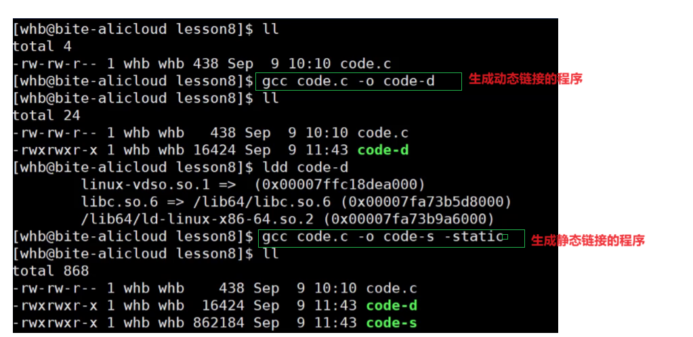

由此可见我们静态成为的链接比动态的空间大了60-70倍.所以大多数编译器是动态链接的.

我们的开发环境，默认都要为我们做什么

1.  下载开发环境 include，lib
2.  设置合理的查找路径
3.  规定好我们形成可执行程序的链接方式

***

# **库基本认识**

动态库 **`.`**`so `-> 动态链接：我们的程序和库产生关联，我们执行的时候需要指定库函数调用，直接跳指定库中去执行。执行完就返回。体积小

静态库` `**`.`**`a` -> 静态链接：将静态库中的内容拷贝到我们的可执行程序中。体积大

> **Note：** 库里面不能放mian函数，因为库是给别人用的，如果有会导致与使用者的main函数产生冲突。

-   当我们对于所写的源文件和头文件在Linux下进行处理变为可执行程序需要一下四步：
    1.  预处理：完成包含的头文件的展开、注释删除、define宏替换、条件编译等，最终形成 `xxx.i` 文件。
    2.  编译：完成词法分析、语法分析、语义分析、符号汇总等，检查无误后将代码翻译成汇编指令，最终形成`  xxx.s  `文件。
    3.  汇编：将汇编指令转换成二进制指令，形成符号表，最终形成 `xxx.o` 文件。
    4.  链接：将生成的各个 `xxx.o` 文件进行链接，合并段表，符号表的合并和重定位，最终形成  .exe(.out) 可执行程序。
-   提供方法：

    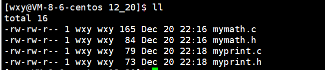

    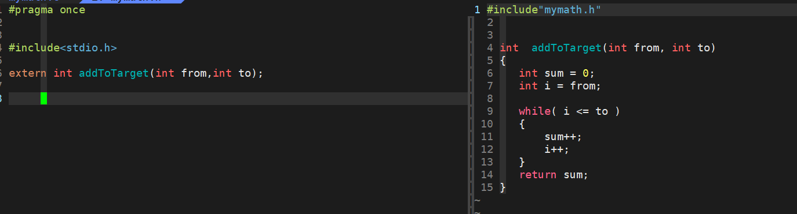

    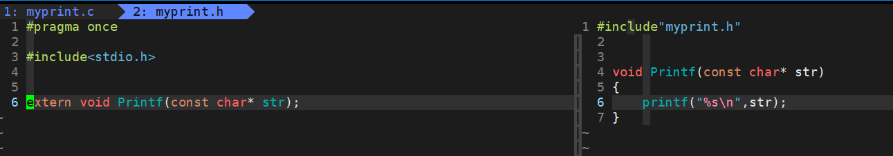

    当我们相直接使用执行的时候，可以直接用main.c进行调用。

    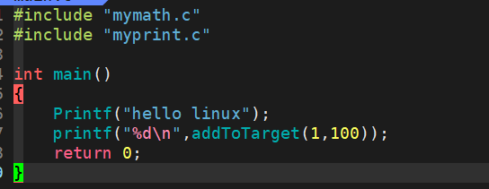
    -   通过将所有的.c文件变为可执行程序 **.exe** 文件。
        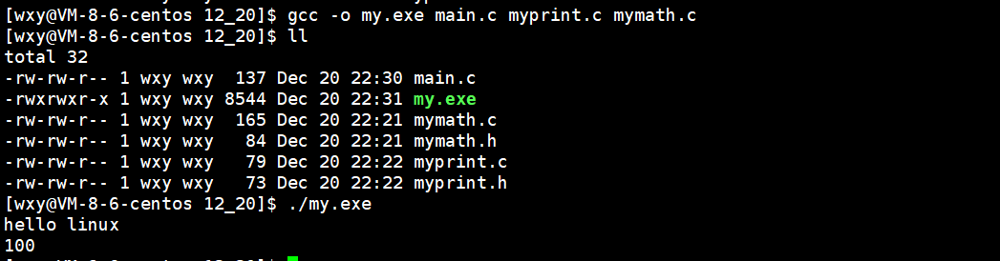
    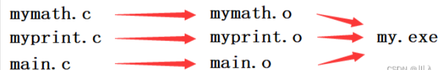

    &#x20;实际上，我们对于库的操作是基于3到4步(`既.o到.exe)`。库的本质就是将提供方法的目标文件(`xxx.o`)进行集合，以达到库当中并不包含主函数而只是包含了大量的方法，所以说动静态库本质是可执行程序的 “半成品集合” 。

***

&#x20;

# 静态库

-   只将 **.** o 与 **.** h 文件给与别人时就能够使用，但是直接全部给别人，这个量又太大了，看着一堆 **.** o ，重要的是编译的时候全要带，更重要的是万一漏了一个，所以需要将所有的进行打包 -- 这个过程就叫做形成静态库。

    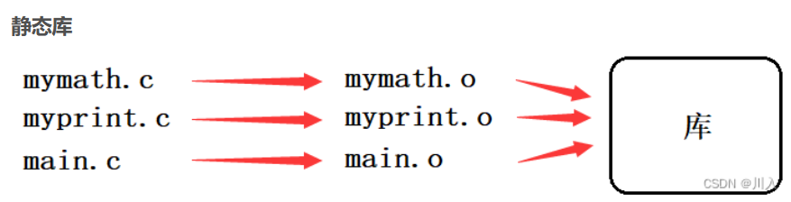

***

#### **创建静态库**

-   本质上： **.** o 打了一个包。

> **命令：****`ar -rc libtest.a`**** 所有的.o文件** .&#x20;

> ar(Archive 归档) -r(replace 替换) -c(create 创建)

> 将所有 \*\*.**o打包成一个libxxx**.a的静态库。

> **node：** 库的名字前缀必须是 lib 名字随便取，后缀必须是 **.** a

-   利用Makefile封装静态库
    ```makefile
    libtest.a: mymath.o myprint.o
      ar -rc libtest.a mymath.o myprint.o
    mymath.o: mymath.c
      gcc -c mymath.c -o mymath.o
    myprint.o: myprint.c
      gcc -c myprint.c -o  myprint.o
     
    .PHONY:clean
    clean:
      rm -rf *.o libtest.a
    ```

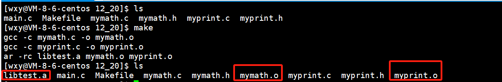

-   libtest.a  静态库有了，就要考虑如何发布。


-   **所以需要将Makefile进行修改**

    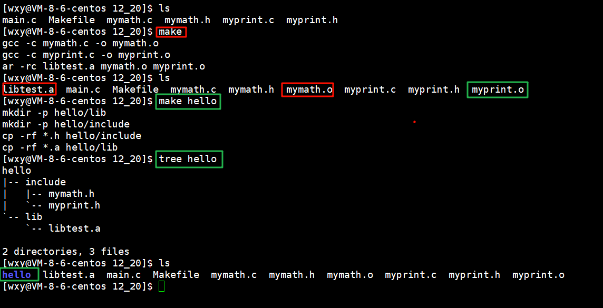

***

## 使用静态库

-   **直接将库拷贝到系统的路径下**（不建议，因为我们写的软件没有经过可靠性的验证的）
    -   系统头文件 gcc 的默认搜索路径在` /usr/include` 下，包含的是所有的 **`.`**`h` 。

        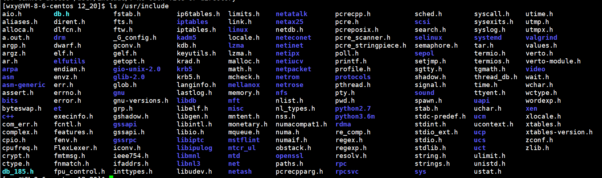
    -   &#x20;系统库文件的默认搜索路径是 `/lib64` 或 `/usr/lib64` 。

        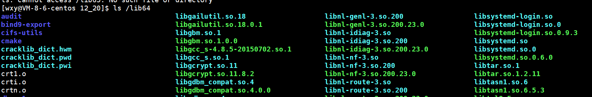

        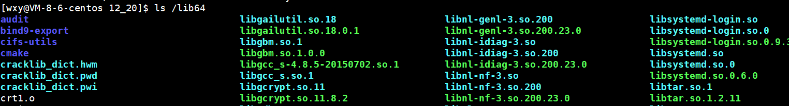
-   将发布的hello中的库文件与头文件分别导入到系统中。

    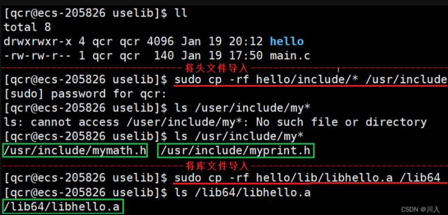

又因为，我们自己所写的库是，属于第三方库（不是语言提供的，也不是操作系统自带的）。系统自带的可以自动运行。语言提供如gcc、g++默认就能连接语言的标准库。第三方库必须告诉gcc我们要连接的库是哪一个库。

> **命令：`gcc main.c -ltest`**

> &#x20;-l 后跟库名( \*\*libhello.a 处去 lib 与 .a \*\*) 告诉gcc我们要连接的是 libhello.a

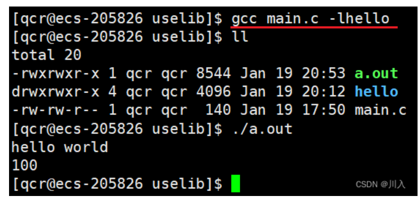

-   我们刚刚的拷贝库到系统的默认路径下，就叫做库的安装。
    -   **融会贯通的理解：**&#x20;

        无论是在windows还是Linux下安装软件，本质上就是拷贝。将软件拷贝到指定路径下。（安装软件 -本质-> 拷贝软件）
-   不建议直接将库拷贝到系统的路径下，因为我们写的软件没有经过可靠性的验证的， 可能会出现污染其他的文件，所以**此处学习完要立马删除**。（这个过程就叫做卸载）

    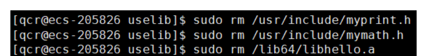
-   **不进行库与头文件的拷贝移动**
    -   **复习：**

        gcc的查找文件的默认路径为先当前路径，后系统路径。

        当前路径是一个目录下的文件。我们的头文件是在include目录下与库文件是在lib目录下，所以此处不是与 a **.** out 同一个路径。

**命令：`gcc main.c -I ./hello/include/ -L ./hello/lib/`**

-I(大写的i)(include)  gcc在默认路径（当前路径、系统路径）下找不到头文件，那么就到我们给与的路径下查找。

-L(library)  gcc在默认路径（当前路径、系统路径）下找不到库文件，那么就到我们给与的路径下查找。

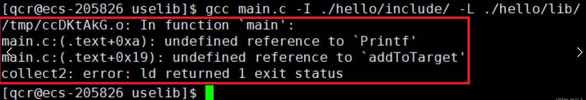

但是会发现此处还是错误。

-   **Note：**

    因为我们并不能保证 **.**/hello/lib 下，一定只有一个库。很有可能其中含有大量的库。所以我们还需要将库进行指明 -lhello 。（库去掉前缀和后缀）

    命令 → **`gcc main.c -I ./hello/include/ -L ./hello/lib/ -lhello`**

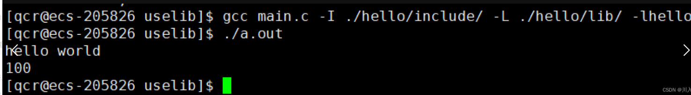

-   **总结ls的操作：**
    -   -I(大写i)    头文件搜索路径
    -   -L    库文件搜索路径
    -   -l库名    特定路径下，使用哪一个库

***

# 动态库

***

#### **创建动态库**

-   动态库也需要将 **.** c 变为 **.** o 文件

> **命令：`gcc -fPIC -c mymath.c -o mymath.o`**

> -fPIC(大写的i)    形成与位置无关的目标二进制文件。

-   **与位置无关的目标二进制文件：**
    -   动态库形成了，它可以在内存中的任意位置都进行加载。（位置无关）
    -   静态库是需要编译进可执行的，可执行具有自己的地址空间。所以静态库拷进去就必须在，其的地址空间的特定的位置。（位置有关）
-   **融汇贯通的理解：**
    -   静态库在编址的时候，必须按照可执行程序的编址按序进行。（绝对编址）即需要考虑地址空间，固定的加载位置。
    -   动态库在编址的时候，不用根据可执行程序的编址按序进行。（相对编址）即不需要考虑地址空间，只需要知道代码在什么地方开始调用动态库，随意的加载位置，相对的加载位置。
        > 例如：一把尺子对于静态库的描述是在刻度30上。对于动态库的描述是尺子的某刻度位置有一个标志物，相对于标志物的距离是多少（段地址加偏移的方式）。于是如果尺子左右衍生，就会导致刻度失效  ->  绝对编制可能会失效、相对编址一定不会失效。
-   **意义：**&#x20;
    -   **可执行程序存储的地址空间就是尺子，动态库就是尺子上的标志物。**
        -   用静态库实行可执行层序时，是将静态库拷贝进代码中，放入地址空间中采取如尺子上绝对路径的方式。
            
        -   动态库形成库和可执行程序是两码事，可执行程序通过地址调用动态库，再通过加偏移找到。
            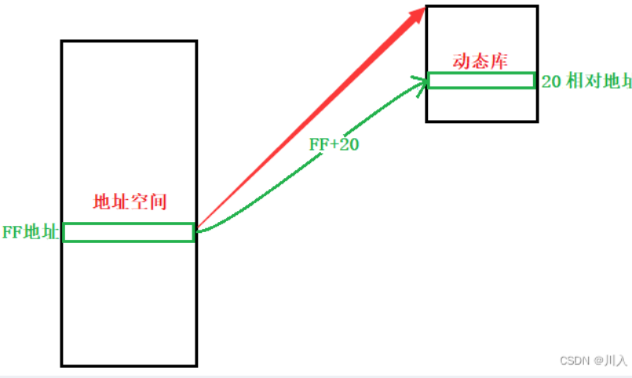

**命令：`gcc  -shared myprint.o mymath.o -o `**[**libhello.so**](http://libhello.so "libhello.so")

`-shared`   告诉gcc形成的是[动态库](https://so.csdn.net/so/search?q=动态库\&spm=1001.2101.3001.7020 "动态库")，不是可执行程序。

将所有`**.`**`o`****打包成一个****`libxxx`**`.**so`的动态库。

**node：**动态库的名字前缀必须是 `lib` ，名字随便取，后缀必须是` `**`.`**`so`

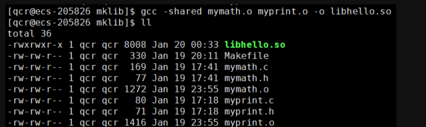

-   **利用Makefile封装动态库**
    ```makefile
    libhello.so: mymath.o myprint.o
      gcc -shared mymath.o myprint.o -o libhello.so
    mymath.o:mymath.c
      gcc -fPIC -c mymath.c -o mymath.o
    myprint.o:myprint.c
      gcc -fPIC -c myprint.c -o myprint.o
     
    .PHONY:hello
    hello:
      mkdir -p hello/lib
      mkdir -p hello/include
      cp -rf *.h hello/include
      cp -rf *.so hello/lib
     
    .PHONY:clean
    clean:
      rm -rf *.o libhello.so hello
    ```
    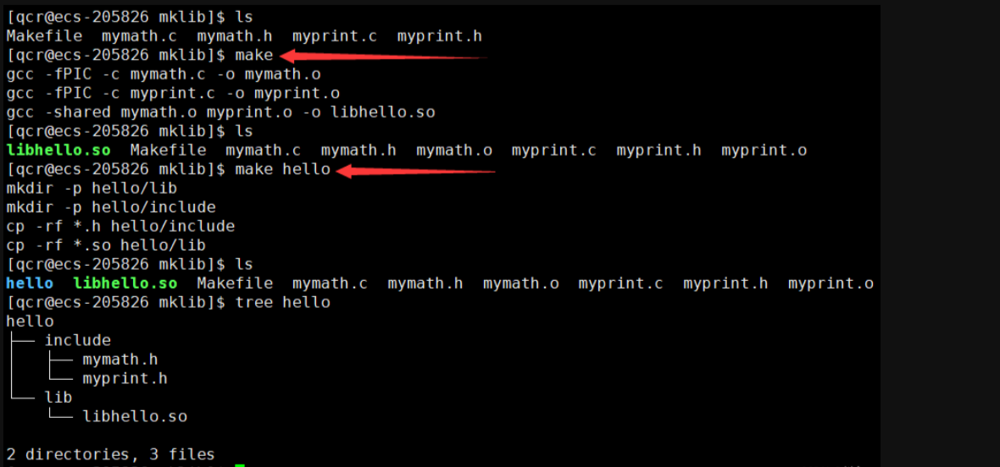

***

#### **使用动态库**

-   **直接将库拷贝到系统的路径下**（不建议，因为我们写的软件没有经过可靠性的验证的）

    &#x20;方法与静态库的一样。
-   **不进行库与头文件的拷贝移动**

    当我们将静态库和动态库，放在一起进行发布时。
    -   利用Makefile同时发布静态库、动态库。
    ```makefile
    .PHONY:all
    all:libhello.so libhello.a
     
    libhello.so:mymath_d.o myprint_d.o
      gcc -shared mymath_d.o myprint_d.o -o libhello.so
    mymath_d.o:mymath.c
      gcc -c -fPIC mymath.c -o mymath_d.o
    myprint_d.o:myprint.c
      gcc -c -fPIC myprint.c -o myprint_d.o
     
    libhello.a: mymath.o myprint.o
      ar -rc libhello.a mymath.o myprint.o
    mymath.o:mymath.c
      gcc -c mymath.c -o mymath.o
    myprint.o:myprint.c
      gcc -c myprint.c -o myprint.o
     
    .PHONY:hello
    hello:
      mkdir -p hello/lib
      mkdir -p hello/include
      cp -rf *.h hello/include
      cp -rf *.a hello/lib
      cp -rf *.so hello/lib
     
    .PHONY:clean
    clean:
      rm -rf *.o libhello.so hello
    ```
    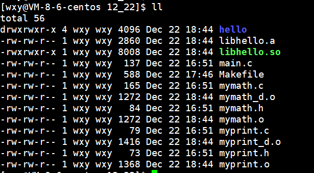

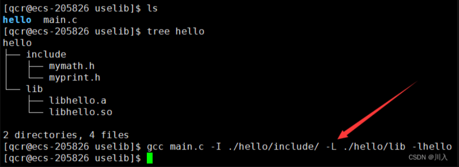

**#问：** 这个时候main.c使用的是静态库还是动态库？

> **命令：`ldd 可执行文件`**  用来查看一个可执行程序所依赖的动态库文件。

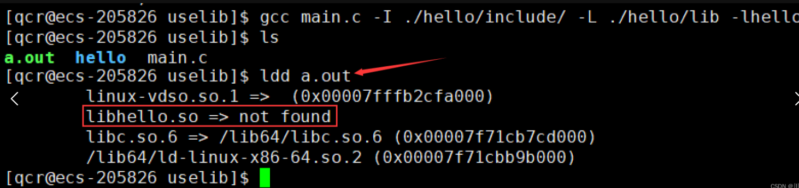

-   gcc默认对动态库进行动态连接。如果将动态库移除只保留静态库。

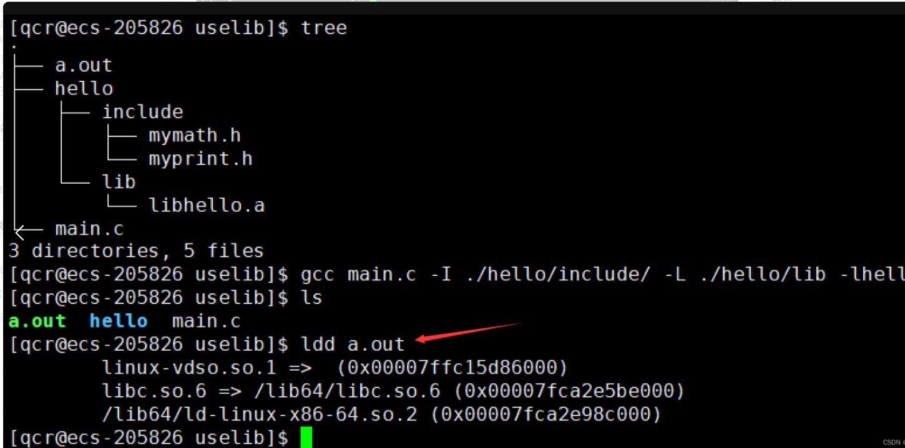

&#x20;  此时其连接的是静态库，而其他的连接的是动态库。-> 如果是动静态库同时存在的时候，默认先连接动态库，如果只有静态库，那么就只能连接静态库。

&#x20;  如果动静态库同时存在，又非要使用静态库。

> **命令：`gcc main.c -I ./hello/include/ -L ./hello/lib -lhello -static`**

> `-static `   摒弃默认优先使用动态库的原则，而是直接使用静态库的方案

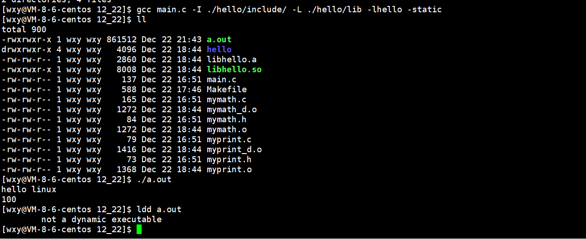

知晓了默认是优先连接动态库，但是我们连接动态库会发现并不能运行。

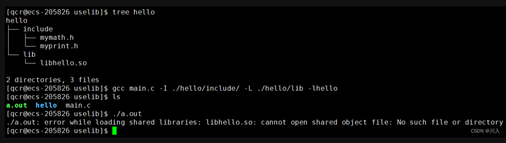

&#x20;在此处可以发现，可执行程序 a.out 已经形成，说明找不到动态库是并不会影响可执行程序的形成，但是运行的时候会报错。

-   **动态库的加载**

    动态库是一个独立的文件，其与可执行程序是进行分批加载，如图可执行程序在内存的一个区域内，动态库在内存的另一个区域内，而可执行程序通过存储动态库的符号链接使用动态库。

    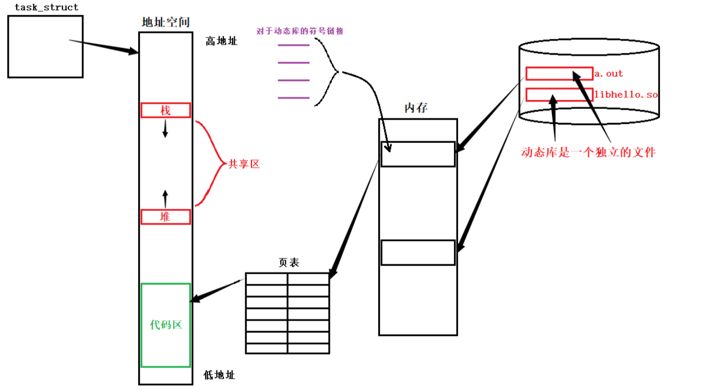

    可执行程序程序对于动态库的调用，是通过栈区与堆区之间共享区存储的动态库的方法。
-   **动态库的存储**
-   **使用动态库的路径**

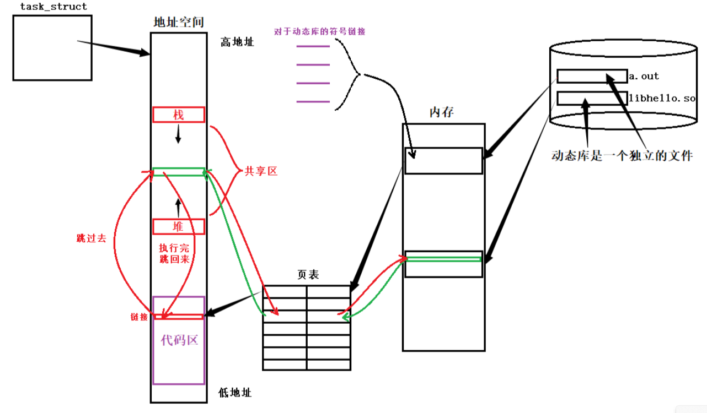

> **补充：**
>
> 如果是静态库，a.out里面直接就包含了库代码，直接加载a.out到内存里，我们的代码和库的代码就同时加载到内存里了。（是一个统一进程的代码和数据以统一使用）

-   动态库可以和可执行程序分开加载 。（先加载可执行程序，后续将动态库加载，建立映射关系）
-   静态库需要拷贝到可执行程序里。（静态库的代码、数据和可执行程序的代码、数据是揉在一起，按照规律放在地址空间）

当多个进程需要使用动态库的时候，如上已经由一个进程加载时，将动态库加载到了内存中，那么后序的进程无需再次加载动态库，直接与动态库建立映射关系即可。所以一个动态库可以被很多个进程共同使用 -> 叫做共享库。

> **补充：**
>
> 由于静态库不是共享库，需要拷贝进入可执行程序，所以如果有10个进程同时使用一个静态库，需要每一个奖进程都将静态库拷贝如可执行程序，就会导致内存中有9份一摸一样的代码。并且这些空间还是只读的  -  空间的浪费。（此处凸显了：共享库的意义）

-   **现在再让我们回头看一下之前的报错：**

    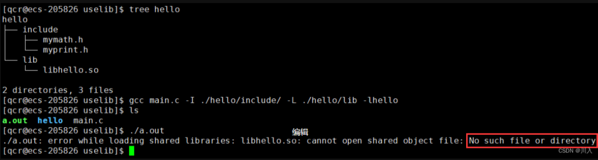

**#问：** ​**此处的错误是：找不到动态库。但是此处我们使用了 ****-l库名**** 告诉了是哪一个动态库，去报找不到该库。这是为什么？**

因为，根据前面所讲，动态库和可执行程序是分批加载的，所以在加载可执行程序后，需要将动态库单独加载入内存，但是此时我们告诉的是gcc该动态库在哪，而本质上运行加载的时候和gcc并没有关系（当准备加载动态库进行运行的时候，可执行程序已经形成了，此时就跟gcc没任何关系了）。是需要操作系统加载器进行加载，需要告诉系统。

> **环境变量：`LD_LIBRARY_PATH`**

> LD(load 加载)  LIBRARY(library 库) PATH(path 路径)  动态库加载的搜索路径。

系统搜索对应的动态库路径时，会在系统的 /lib64 进行搜索，找到动态库就用，找不到直接终止。如果默认路径/lib64下没有找到，如果`LD_LIBRARY_PATH`中不为空，就去其中搜索。

**Note：**

千万不要直接将路径带上，这样会将`LD_LIBRARY_PATH`中原生的东西直接覆盖掉。

> **命令：****`export LD_LIBRARY_PATH=$LD_LIBRARY_PATH:/home/qcr/.VimForCpp/vim/bundle/YCM.so/el7.x86_64`****（:加动态库的绝对路径）**&#x20;

> 将`LD_LIBRARY_PATH`的原生内容与追加内容放在`LD_LIBRARY_PATH`中。

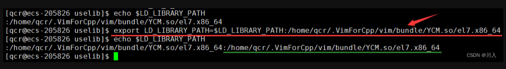

**Note：**

这个导的环境变量是内存级的环境变量，一旦退出再重新登陆，LD\_LIBRARY\_PATH就会自动到系统配置文件里拿数据，就将之前的清掉了。 --  **这个方法是临时方案。**

-   **一劳永逸的方法 - 新增配置文件**

&#x20;      在系统里面修改配置文件。

&#x20; 系统会存在一个动态库的默认搜索库文件：

> **命令：`ls /etc/ld.so.conf.d/`**

> ` /etc/ld.so.conf.d/` 这个路径里面会保存可以允许自定义配置搜索动态库路径  **--** 永久解决方案。

&#x20;

也就是说，当觉得一个动态库非常的重要（常用），但是又不想将其安装到系统里面，需要写一个配置文件告诉系统怎么做。很简单：

在路径` /etc/ld.so.conf.d/` 下开辟一个文件，里面存储我们的需要放入的动态库的绝对路径即可。

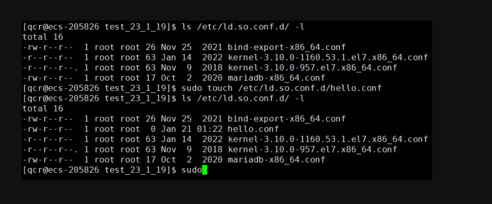

> 命令：`sudo ldconfig`

> 将该路径 `/etc/ld.so.conf.d/` 下的配置的所有配置文件生效一下。

此时 `LD_LIBRARY_PATH` 中并没有存储我们的动态库的地址，但是可以使用。甚至重新登陆照样也可以。

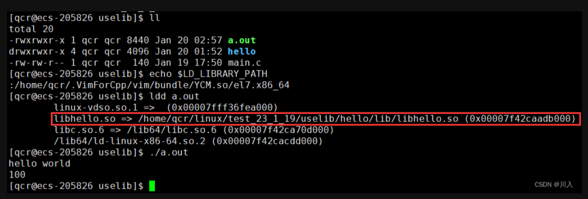

-   &#x20;这就是新增配置文件的方法，一劳永逸的方法。
-   **利用软链接**

    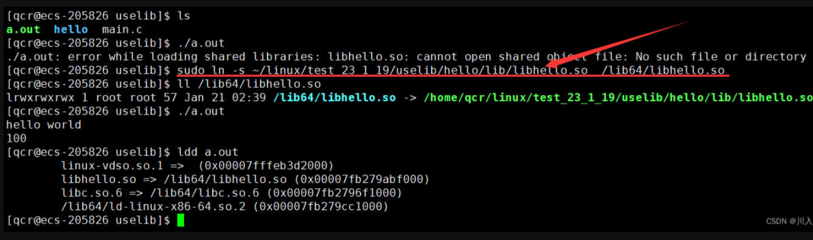
    -   **Note：**
        此处一定要使用绝对地址，不要使用相对地址。找不到就会一直飘红，相当于快捷快捷方式在可执行程序没了。
    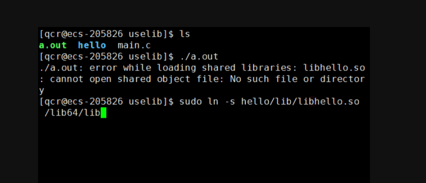

    需要删除重新进行设置。

    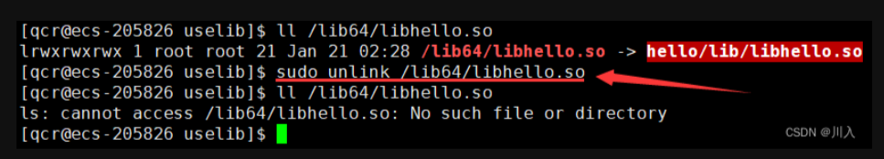

***

# 总结

库的操作是很复杂的，所以对于库的建设以及排查是十分重要的。（重要：需要有排查的思路）

如：将库的路径导入了环境变量中 LD\_LIBRARY\_PATH 中。还是不行，一定是环境变量设错了。无非就两种：

-   环境变量名写错了。
-   导入环境变量中的库路径，最好使用ls确认一下，能不能找到对应的库。

> **融会贯通的理解：**
>
> 动态库里面的地址采用的是相对地址，所有的函数编址采用相对于库头0开始编址。正是因为如此，当其加载到内存映射时，每一个动态库，映射到进程地址空间的位置可能是不一样的。其可采用共享区中的：动态库起始加载虚拟地址 + (动态库中)函数偏移量。
>
> 所以所谓的共享区(目前可以确定)：是给堆、栈足够的空间时，也用于存储动态库。

***

为什么要有库

因为现实中，别人的框架、组件什么的，是好于我们自己写的，学习期间需要造轮子，但是工作上我们要学会用轮子（争取不要用自己写的东西），这是一个站在巨人肩膀上的问题。

-   使用库的角度：库的存在，可以大大减少我们开发的周期，提高软件本身的质量。
-   写库人的角度：
    -   简单（无需提供书写细节，只用提供使用方法）
    -   代码安全（可以不公开源代码）
