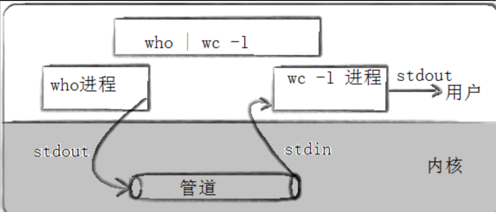

# Linux 进程间通信

## 目录

-   [进程间通讯概念的引入](#进程间通讯概念的引入)
    -   [思维构建](#思维构建)
-   [进程间通信方式](#进程间通信方式)
-   [管道](#管道)
    -   [站在用户角度-浅度理解管道](#站在用户角度-浅度理解管道)
        -   [匿名管道 pipe函数](#匿名管道-pipe函数)
    -   [站在文件描述符角度-深度理解管道](#站在文件描述符角度-深度理解管道)
    -   [站在内核角度-管道本质](#站在内核角度-管道本质)
    -   [代码实现的关键：](#代码实现的关键)
    -   [管道的特点总结：](#管道的特点总结)
    -   [匿名管道的拓展](#匿名管道的拓展)
        -   [单机版的负载均衡](#单机版的负载均衡)
    -   [匿名管道读写规则](#匿名管道读写规则)
    -   [命名管道](#命名管道)
        -   [前言](#前言)
        -   [原理](#原理)
        -   [创建一个命名管道](#创建一个命名管道)
    -   [用命名管道实现myServer\&myClient通信](#用命名管道实现myServermyClient通信)
    -   [匿名管道与命名管道的区别](#匿名管道与命名管道的区别)
    -   [命名管道的打开规则](#命名管道的打开规则)
-   [system V共享内存](#system-V共享内存)
    -   [共享内存数据结构](#共享内存数据结构)
    -   [共享内存函数](#共享内存函数)
        -   [shmget函数](#shmget函数)
        -   [shmat函数](#shmat函数)
        -   [shmdt函数](#shmdt函数)
        -   [shmctl函数](#shmctl函数)
    -   [key概念引入](#key概念引入)
        -   [ftok](#ftok)
    -   [简易的使用shmget函数结合ftok函数：](#简易的使用shmget函数结合ftok函数)
    -   [shm共享内存实例代码](#shm共享内存实例代码)
-   [共享内存shm + 管道pipe 应用](#共享内存shm--管道pipe-应用)
-   [基于共享内存理解信号量](#基于共享内存理解信号量)
    -   [申请信号量：](#申请信号量)
    -   [总结](#总结)

# **进程间通讯概念的引入**

在没有进程间通讯之前，理论上都是单进程的，那么也就无法使用并发能力，更无法实现多进程协同（将一个事，分几个进程做）。而进程间通讯，就是对于实现多进程协同的手段。

-   **数据传输：** 一个进程需要将它的数据发送给另一个进程
-   **资源共享：** 多个进程之间共享同样的资源。
-   **通知事件：** 一个进程需要向另一个或一组进程发送消息，通知它（它们）发生了某种事件（如进程终止时要通知父进程）。
-   **进程控制：** 有些进程希望完全控制另一个进程的执行（如Debug进程），此时控制进程希望能够拦截另一个进程的所有陷入和异常，并能够及时知道它的状态改变。

***

## 思维构建

&#x20;进程间通讯重点，就在与如何让不同的进程资源的传递。而进程是具有独立性的，也就是说进程相通讯会难度较大  --  因为进程间通讯的本质是：先让不同的进程看见同一份资源。

> **融汇贯通的理解：**
>
> 进程的设计天然就是为了保证独立性的（即，进程之间无瓜葛），所以深入的说：所谓的同一份资源不能所属于任何一个进程，更强调共享，不属于任何一个进程。

***

# **进程间通信方式**

-   **管道**
    -   匿名管道pipe
    -   命名管道
-   **System V IPC**
    -   System V 消息队列
    -   System V 共享内存
    -   System V 信号量
-   **POSIX IPC**
    -   消息队列
    -   共享内存
    -   信号量
    -   互斥量
    -   条件变量
    -   读写锁

***

# 管道

我们把从一个进程连接到另一个进程的数据流称为一个“管道”。

当在两个命令之间设置管道 "|" 时，管道符 "|" 左边命令的输出就变成了右边命令的输入。只要第一个命令向标准输出写入，而第二个令是从标准输入读取，那么这两个命令就可以形成一个管道。大部分的 Linux 命令都可以用来形成管道。

> **命令：**`who | wc -l`  用于查看当前服务器下登陆的用户人数。
>
> 

> **补充：**\*\*Linux`who`命令：\*\*用于显示系统中有哪些使用者正在上面，显示的资料包含了使用者 ID、使用的终端机、从哪边连上来的、上线时间、呆滞时间、CPU 使用量、动作等等。使用权限：所有使用者都可使用。
>
> 

其中，运行起来后who命令与wc命令就是两个不同的进程。who进程作为数据提供方，通过标准输入将数据写入管道，wc进程再通过标准输入将数据从管道中读取出，进而再将数据进行处理 "-l" ，后以标准输出的方式将结果给用户。



***

### **站在用户角度-浅度理解管道**

#### **匿名管道** **pipe函数**

| 函数名称 | `pipe`                                                                                   |
| ---- | ---------------------------------------------------------------------------------------- |
| 头文件  | `<unistd.h>`                                                                             |
| 功能   | 创建一个无名管道                                                                                 |
| 原型   | `int pipe(int pipefd[2]);`                                                               |
| 参数   | - `pipefd`：输出型参数，通过该参数获得打开的文件描述符&#xA;- `pipefd[0]`：管道读端文件描述符&#xA;- `pipefd[1]`：管道写端文件描述符 |
| 返回值  | - 成功时，返回 0&#xA;- 出现错误时，返回 -1                                                             |

-   父进程创建管道&#x20;

    
-   父进程fork出子进程

    
-   &#x20;父进程关闭读 / 写，子进程关闭写 / 读。（fork之后各自关掉不用的描述符）

    

> **Note：** 对于pipe函数创建的管道，只能够进行单向通信。（反之，会导致读写导致管道中数据污染、混乱）。我们需要对于父或子进程中的fd参数中的，文件符号进行关闭。


-   [pipe](https://so.csdn.net/so/search?q=pipe\&spm=1001.2101.3001.7020 "pipe")函数的使用需要结合fork函数的父子进程。

***

### **站在文件描述符角度-深度理解管道**

> **#问**：如何做到让不同的进程，看到同一份资源？

以fork让子进程继承，能够让具有“血缘关系”的进程进行进程间通讯。（管道：常用于父进程进程）

> **融汇贯通的理解：**
>
> fork创建子进程，等于系统中多了一个子进程。而进程 = 内核数据结构 + 进程代码和数据。进程相关内核数据结构来源于操作系统，进程代码和数据一般来源于磁盘。
>
> 而由于为了进程具有独立性，所以创建子进程的同时，需要分配对应的进程相关内核结构。对于数据，被写入更改时操作系统采用写时拷贝技术，进行对父子进程数据的分离。
>
> 父进程与子进程拥有自身的fd\_array\[]存储文件描述符fd，但是其中存储的fd时相同的，而文件相关内核数据，并不属于进程数据结构，所以并不会单独为子进程创建。于是：父进程与子进程指向的是一个文件  ->  这就让不同的进程看到了同一份资源。
>
> 
>
> 管道本质上就是一个文件。一个具有读写功能，并且无需放入磁盘的文件（通道是进程进行通讯的临时内存空间，无需将内容放入磁盘中保留）。

-   **（tty：标准输入、标准输出、标准错误）**
    1.  父进程创建管道

        
    2.  父进程fork出子进程

        
    3.  父进程关闭读 / 写，子进程关闭写 / 读。（fork之后各自关掉不用的描述符）

        

***

## 站在内核角度-管道本质


所以，看待管道，就如同看待文件一样！管道的使用和文件一致，迎合了“Linux一切皆文件思想”

***

## **代码实现的关键：**

1.  创建管道 -- 分别以读写方式打开同一个问题
2.  创建子进程 -- 以fork函数创建子进程
3.  构造单向通讯的通道 -- 双方进程各自关闭自己不需要的文件描述符

```c++
#include <iostream>
#include <unistd.h>
#include <assert.h>
#include <string>
#include <string.h>
#include <sys/wait.h>
#include <sys/types.h>
 
using namespace std;
 
int main()
{
    //1.创建管道
    int pipefd[2] = {0};
    int n = pipe(pipefd);
    assert(n != -1);
    (void)n; // 只被定义没有被使用，Release下就会出现代码大量告警  --  证明使用过
 
// 用于调试验证fd申请
#ifdef DEBUG
    cout << "pipefd[0]: " << pipefd[0] << endl;
    cout << "pipefd[1]: " << pipefd[1] << endl;
#endif
 
    //2.创建子进程
    pid_t id = fork();
    assert(id != -1);
    if(id > 1)
    {
        // 子进程 -- 只读
        // 3.构造单向通讯的通道, 父进程写入，子进程读取
 
        // 3.1 关闭子进程不需要的fd
        close(pipefd[1]);
 
        char child_buffer[1024*4];
        while(true)
        {
            ssize_t s = read(pipefd[0], child_buffer, sizeof(child_buffer) - 1);
            //3.2 访问控制:
            //   a、写入的一方，fd没有关闭，如果有数据，就读，没有数据就等
            //   b、写入的一方，fd关闭, 读取的一方，read会返回0，表示读到了文件的结尾！
            if(s > 0)
            {
                child_buffer[s] = 0;
                cout << "child get a message[" << getpid() << "] Father# " << child_buffer << endl;
            }
            else if(s == 0)
            {
                cout << "-----------writer quit(father), me quit!-----------" << endl;
                break;
            }
        }
        exit(0);
    }
    // 父进程 -- 只写
    // 3.构造单向通讯的通道, 父进程写入，子进程读取
 
    // 3.1 关闭父进程不需要的fd
    close(pipefd[0]);
 
    string message = "我是父进程，发送有效信息。";
    int count = 0; // 传递的次数
    char father_buffer[1024*4];
    while(true)
    {
        //3.2 构建一个变化的字符串
        snprintf(father_buffer, sizeof(father_buffer), "%s[%d] : %d",
                message.c_str(), getpid(), count++);
        
        //3.3 写入
        write(pipefd[1], father_buffer, strlen(father_buffer));
 
        //3.4 故意sleep凸显访问控制
        sleep(1);
        if(count == 3)
        {
            cout << "----------------father wirte quit!----------------" <<endl;
            break;
        } 
    }
    close(pipefd[1]);
    pid_t ret = waitpid(id, nullptr, 0);
    assert(ret > 0);
    (void)ret;
 
    return 0;
}
```


***

## **管道的特点总结**：

-   匿名管道是用来进程具有血缘关系的进程进行进程间通讯。

    通常，一个管道由一个进程创建，然后该进程调用fork，此后父、子进程之间就可应用该管道。
-   匿名管道具有通过让进程间通讯，提供访问控制。
    1.  写端快，读端慢，写满了不能再写了。
    2.  写端慢，读端快，管道没有数据的时候，读需要等待。
        **补充：**
    c、写端关闭，读端为0，标识读到了文件结尾。

    d、读端关闭，写端继续写，操作系统终止写端进程。
-   管道提供的是面向流式的通信服务 -- 面向字节流。
-   .管道是基于文件的，文件的生命周期是随进程的，所以管道的生命周期是随进程的。
-   管道是单向通行的，就是半双工通信的一种特殊情况。数据只能向一个方向流动；需要双方通信时，需要建立起两个管道

    
-   数据的传送方式可以分为三种：
    -   &#x20;**单工通信**(Half Duplex) **：** 是通讯传输的一个术语。一方固定为发送端，另一方固定为接收端。即：一方只能写一方只能读。
    -   **半双工通信**(Half Duplex) **：** 是通讯传输的一个术语。指数据传输指数据可以在一个信号载体的两个方向上传输，但是不能同时传输。即：一段时间内，只能一方写一方读。
    -   **全双工通信**(Full Duplex) **：** 是通讯传输的一个术语。指通信允许数据在两个方向上同时传输，它在能力上相当于两个单工通信方式的结合。即：一段时间内，每方能写且读。

***

## 匿名管道的**拓展**

#### **单机版的负载均衡**

&#x20; 以循环fork函数开辟多个子进程，并利用pipe函数。针对于每一个子进程开辟一个管道，父进程通过管道安排其中一个子进程做某任务.


[pipes\_Single-machine · 虾米Life/Linux\_Code - 码云 - 开源中国 (gitee.com)](https://gitee.com/XMLife/linux_-code/tree/master/pipes_Single-machine "pipes_Single-machine · 虾米Life/Linux_Code - 码云 - 开源中国 (gitee.com)")

***

## **匿名管道读写规则**

-   当没有数据可读时
    -   O\_NONBLOCK disable：read调用阻塞，即进程暂停执行，一直等到有数据来到为止
    -   O\_NONBLOCK enable：read调用返回-1，errno值为EAGAIN。
-   当管道满的时候
    -   O\_NONBLOCK disable： write调用阻塞，直到有进程读走数据
    -   O\_NONBLOCK enable：调用返回-1，errno值为EAGAIN
-   如果所有管道写端对应的文件描述符被关闭，则read返回0
-   如果所有管道读端对应的文件描述符被关闭，则write操作会产生信号SIGPIPE,进而可能导致write进程退出
-   当要写入的数据量不大于PIPE\_BUF时，linux将保证写入的原子性。
-   当要写入的数据量大于PIPE\_BUF时，linux将不再保证写入的原子性。

> **原子性**：要么做，要么不做，没有所谓的中间状态。
>
> POSIX.1-2001要求PIPE\_BUF至少为512字节。（在Linux上，PIPE\_BUF为4096字节。）
>
> **拓展：**
>
> 讨论原子性，需要在多执行流下，数据出现并发访问的时候，讨论原子性才有意义。（此处不深入）

> **融会贯通的理解：**
>
> &#x20;   匿名管道就是一个文件，一个内存级别的文件，并不会在磁盘上存储，并不会有自身的文件名。作为基础间通讯的方式是：看见同一个文件 -- 通过父子进程父子继承的方式看见。是一个，只有通过具有 “血缘关系” 的进程进行使用，可以称做：**父子进程通讯**。

***

## **命名管道**

### **前言**

匿名管道只能使用于具有“**亲缘关系**”的进程之间通信，而对于毫无关系的两个进程无法使用匿名管道通讯，如果我们想在不相关的进程之间交换数据，可以使用FIFO文件来做这项工作，它经常被称为命名管道。命名管道是一种特殊类型的文件。

***

### **原理**

当两个进程需要同时带开一个文件的时候，由于为了保证进程的独立性，所以两个进程会有各自的files\_struct，而对于文件数据，并不会为每一个进程都备一份（是内存的浪费），此时A进程的files\_struct与B进程的files\_struct是不同的，但是其中的文件符fd指向的是由磁盘文件加载到内存中的同一份数据空间。

命名管道就是如此，其原理与匿名管道很相识。命名管道在磁盘中，所以其有自己的文件名、属性信息、路径位置……，但是其没有文件内容。即，命名管道是内存文件，其在磁盘中的本质是命名管道在磁盘中的映像，且映像的大小永远为0。意义就是为了让毫无关系的基进程，皆能够调用到命名管道。而管道中的数据是进程通讯时的临时数据，无存储的意义，所以命名管道在磁盘中为空。


### **创建一个命名管道**

-   **命名管道可以从命令行上创建：**

> **命令：`mkfifo fifo`**

> 创建一个名为fifo命名管道


> 此时文件类型不是常用 - 与 d ，而是 p ，此文件的类型为管道：


&#x20;此时会发现处于等待状态。因为由于我们写了，但是对方还没有打开，于是处于阻塞状态。


此时 echo "hello linux"（进程A）就是写入的进程， cat（进程B）就是读取的进程。这就是所谓的一个进程向另一个进程写入消息的过程（通过管道写入的方式）。

我们可以在命令行上使用循环的方式，往管道内每隔1s写入数据。即，进程A原来应向显示器文件写入的数据，通过输入重定向的方式，将数据写入管道中，再将管道中数据通过输出重定向，通过进程B将数据写入到显示器文件中。如此，以毫无相关的进程A与进程B通过命名管道进行数据传输 **-** 进程间通信。


此时我们通过终止读取进程方，导致写入端向管道写入的数据无意义了（无读取端），此时作为写入端的进程就应该被操作系统杀掉。此时需要注意，echo是内置命令，所以是bush本身自行执行的命令，所以此时杀掉写入端的进程无疑就是杀掉bash。于是bash被操作系统杀死，云服务器即退出。

> **内置命令：** 让父进程（myshell）自己执行的命令，叫做内置命令，内建命令。


-   **命名管道可以从程序里创建：**

    

| 函数名称 | `mkfifo`                                                                                                                                         |
| ---- | ------------------------------------------------------------------------------------------------------------------------------------------------ |
| 头文件  | `<sys/types.h>`, `<sys/stat.h>`                                                                                                                  |
| 功能   | 创建命名管道                                                                                                                                           |
| 原型   | `int mkfifo(const char *pathname, mode_t mode);`                                                                                                 |
| 参数   | - `pathname`：要创建的命名管道文件的路径&#xA;- `mode`：创建命名管道文件的默认权限                                                                                            |
| 返回值  | - 命名管道创建成功，返回 0&#xA;- 命名管道创建失败，返回 -1                                                                                                             |
| 注意事项 | 创建的文件权限会受到 `umask` (文件默认掩码) 的影响。默认的 `umask` 值为 `0002`，实际创建出来的文件权限为 `mode & (~umask)`。如果想要更改默认权限，可以使用 `umask` 函数进行修改。`umask(0);` 可以将默认值设为 `0000`。 |
|      |                                                                                                                                                  |

关闭所有 `unlink`

***

## 用命名管道实现myServer\&myClient通信

利用命名管道，实现服务端myServer与客户端myClient之间进行通讯。将服务端myServer运行起来并用mkfifo函数开辟一个命名管道。而客户端myClient中利用open打开命名管道（命名管道本质为文件），以write向管道中输入数据。以此服务端myServer利用open打开命名管道，以read从管道中读取数据。

-   **comm.hpp**

    [named\_pipe/Log.hpp · 虾米Life/Linux\_Code - 码云 - 开源中国 (gitee.com)](https://gitee.com/XMLife/linux_-code/blob/master/named_pipe/Log.hpp "named_pipe/Log.hpp · 虾米Life/Linux_Code - 码云 - 开源中国 (gitee.com)")
    -   &#x20;所展开的头文件集合。
-   **Log.hpp**

    [named\_pipe/Log.hpp · 虾米Life/Linux\_Code - 码云 - 开源中国 (gitee.com)](https://gitee.com/XMLife/linux_-code/blob/master/named_pipe/Log.hpp "named_pipe/Log.hpp · 虾米Life/Linux_Code - 码云 - 开源中国 (gitee.com)")
    -   编程的日志：就是当前程序运行的状态。
-   [**myServer.c**](http://myServer.cc "myServer.c")xx

    [named\_pipe/server.cxx · 虾米Life/Linux\_Code - 码云 - 开源中国 (gitee.com)](https://gitee.com/XMLife/linux_-code/blob/master/named_pipe/server.cxx "named_pipe/server.cxx · 虾米Life/Linux_Code - 码云 - 开源中国 (gitee.com)")

    细节：

    mkfifo的第二个参数传入权限0666之前需要以umask(0)，对于服务端因为只需要在命名管道中读取数据，所以以只读的方式（O\_RDONLY）open管道文件，后序以fork开辟子进程，让子进程read读取即可，同时也需要注意，C语言的字符串结尾必须是 '\0'（读取大小：sizeof(buffer) - 1）。

    由于我们让子进程执行读取工作，所以需要以waitpid等在子进程（此处我们让nums个子进程进行，所以waitpid的第一个参数为 -1 ，等待任意一个子进程）。

    由于open打开了管道类型的文件，所以需要以close(fd)关闭文件，由于mkfifo开辟了管道，所以需要以unlink删除管道文件。
-   [**myClient.cc**](http://myClient.cc "myClient.cc")

    [named\_pipe/client.cxx · 虾米Life/Linux\_Code - 码云 - 开源中国 (gitee.com)](https://gitee.com/XMLife/linux_-code/blob/master/named_pipe/client.cxx "named_pipe/client.cxx · 虾米Life/Linux_Code - 码云 - 开源中国 (gitee.com)")

    对于客户端因为只需要在命名管道中写入数据，所以以只写的方式（O\_WRONLY）open管道文件，后序write即可。
-   &#x20;由于命名管道的创建是在服务端myServer中，所以需要先运行myServer。

    

    服务端myServer进程运行起来，我们就能看到创建的命名管道文件。此时服务端myServer处于阻塞状态也是管道文件的特性（写入端未开辟，读取端需要等待写入端开辟）。

    
    -   可以通过 ps 命令查看进程是否相关：
        
    &#x20;  从此可以看出myServer与myClient是毫无相关的进程，即myServer的三个子进程与myClient也是毫无相关的进程。

***

## **匿名管道与命名管道的区别**

-   匿名管道由pipe函数创建并打开。
-   命名管道由mkfififo函数创建，打开用open
-   FIFO（命名管道）与pipe（匿名管道）之间唯一的区别在它们创建与打开的方式不同，一但这些工作完成之后，它们具有相同的语义。

***

## **命名管道的打开规则**

-   如果当前打开操作是为读而打开FIFO时
    O\_NONBLOCK disable：阻塞直到有相应进程为写而打开该FIFO
    O\_NONBLOCK enable：立刻返回成功
-   如果当前打开操作是为写而打开FIFO时
    O\_NONBLOCK disable：阻塞直到有相应进程为读而打开该FIFO
    O\_NONBLOCK enable：立刻返回失败，错误码为ENXIO

***

# system V**共享内存**

&#x20;    system V共享内存是与管道不同的，管道基于操作系统已有的文件操作。文件部分，无论有没有通讯的需求，这个文件都需要维护，有没有通讯都需要和指定进程建立关联，通不通讯都会有。

&#x20;    而共享内存是，不用来通讯，操作系统就不用进行管理，只有需要使用时，操作系统才提供 - 有通讯才会有，共享内存。共享内存是操作系统单独设立的内核模块，专门为进程间通讯设计 --  这个内核模块就是system V。

**即：** 前面的匿名管道、命名管道通讯是恰好使用文件方案可以实现。而共享内存是操作系统专门为了通讯设计。

-   共享内存的建立：

    
    -   共享区：共享内存、内存映射和共享库保存位置。

***

### **共享内存数据结构**

共享内存的提供者，是操作系统。

大量的进程进行通讯 **->** 共享内存是大量的。所以，操作系统对于共享内存需要进行管理，需要管理 -> 先描述，再组织 -> 重新理解：共享内存 = 共享内存块 + 对应的共享内存的内核数据结构。

共享内存的数据结构` shmid_ds` 在 `/usr/include/linux/shm.h` 中定义：

**（cat命令即可）**

```c++
struct shmid_ds

{
        struct ipc_perm        shm_perm;    /* operation perms */
        int            shm_segsz;    /* size of segment (bytes) */
        __kernel_time_t        shm_atime;    /* last attach time */
        __kernel_time_t        shm_dtime;    /* last detach time */
        __kernel_time_t        shm_ctime;    /* last change time */
        __kernel_ipc_pid_t    shm_cpid;    /* pid of creator */
        __kernel_ipc_pid_t    shm_lpid;    /* pid of last operator */
        unsigned short        shm_nattch;    /* no. of current attaches */
        unsigned short         shm_unused;    /* compatibility */
        void             *shm_unused2;    /* ditto - used by DIPC */
        void            *shm_unused3;    /* unused */
};

```

此处首先提一下key值（后面共享内存的建立引入），其是在上面的共享内存的第一个参数struct ipc\_perm类型的shm\_perm变量中的一个变量。

在 `/usr/include/linux/ipc.h `中定义：

```c++
struct ipc_perm
{
        __kernel_key_t    key;
        __kernel_uid_t    uid;
        __kernel_gid_t    gid;
        __kernel_uid_t    cuid;
        __kernel_gid_t    cgid;
        __kernel_mode_t    mode; 
        unsigned short    seq;
};

```

***

## 共享内存函数

### shmget函数

```c++
#include <sys/ipc.h>
#include <sys/shm.h>
// 用来创建共享内存
int shmget(key_t key, size_t size, int shmflg);
```

参数：

**key：** 这个共享内存段名字。

**size：** 共享内存大小。

-   大小建议为4096的整数倍。（原因使用时讲解）

**shmflg：** 由九个权限标志构成，它们的用法和创建文件时使用的mode模式标志是一样的。

| 组合方式                    | 作用                                         |
| ----------------------- | ------------------------------------------ |
| `IPC_CREAT`             | 创建共享内存，如果底层已经存在，获取之，并且返回。如果底层不存在，创建之，并且返回。 |
| `IPC_EXCL`              | 没有意义                                       |
| `IPC_CREAT \| IPC_EXCL` | 创建共享内存，如果底层不存在，创建之，并且返回。如果底层存在，出错返回。       |

`IPC_CREAT | IPC_EXCL`意义：可以保证，放回成功一定是一个全新的共享内存（shm）。

此外创建需要权限的初始化：

如：`IPC_CREAT | IPC_EXCL | 0666`

返回值：

成功返回一个非负整数，即该共享内存段的标识码（用户层标识符）；失败返回-1。

***

### shmat函数

-   功能：将共享内存段连接到进程地址空见
-   原型

    `void *shmat(int shmid, const void *shmaddr, int shmflg)`
-   参数
    -   shmid: 共享内存标识
    -   shmaddr:指定连接的地址shmflg:它的两个可能取值是SHM\_RND和SHM\_RDONLY
    -   返回值：成功返回一个指针，指向共享内存第一个节；失败返回-1
-   说明
    -   shmaddr为NULL，核心自动选择一个地址
    -   shmaddr不为NULL且shmflg无SHM\_RND标记，则以shmaddr为连接地址。
    -   shmaddr不为NULL且shmflg设置了SHM\_RND标记，则连接的地址会自动向下调整为SHMLBA的整数倍。`公式：shmaddr - (shmaddr % SHMLBA)`
    -   shmflg=SHM\_RDONLY，表示连接操作用来只读共享内存

***

### shmdt函数

-   功能：将共享内存段与当前进程脱离
-   原型

    `int shmdt(const void *shmaddr);`
-   参数
    -   shmaddr: 由shmat所返回的指针返回值：成功返回0；失败返回-1
-   意：将共享内存段与当前进程脱离不等于删除共享内存段

***

### shmctl函数

-   功能：用于控制共享内存
-   原型

    `int shmctl(int shmid, int cmd, struct shmid_ds *buf);`
-   参数
    -   hmid:由shmget返回的共享内存标识码
    -   cmd:将要采取的动作（有三个可取值）
    -   buf:指向一个保存着共享内存的模式状态和访问权限的数据结构返回值：成功返回0；失败返回-1


***

## **key概念引入**

-   &#x20;  进程间通讯，首先需要保证的看见同一份资源。

> 融会贯通的理解：
>
> -   匿名管道：通过pipe函数开辟内存级管道 -- 本质是文件 -- 通过pipe函数的参数（文件符fd）-- 看见同一份资源。
> -   命名管道：通过mkfifo函数根据路径开辟管道文件（可以从权限p看出）-- 本质是开辟一个文件（可以从第二个参数需要初始化权限看出）-- 利用open、write、read、close文件级操作 -- 看见同一份资源。

管道 -- 内存级文件 -- 恰巧利用文件操作。前面已有所提system V共享内存，是操作系统为进程间通讯专门设计 ，并无法利用类似于管道利用文件实现。于是便有了key。

-   **key概念解析**

    &#x20;key其实就是一个整数，是一个利用算法实现的整数。我们可以将key想象为一把钥匙，而共享内存为一把锁。

    更像是同心锁和一对对情侣，情侣拿着同样的钥匙只可解一堆锁中的一把锁。

    

    &#x20;如同一把钥匙会按照固定的形状制造。其会使用同样的算法规则形成一个唯一值key，同时再创建共享内存时，会将key值设置进其中，**此时两个毫无关系的进程，就可以通过key值用共享内存进行通讯**（一方创建共享内存，一方获取共享内存）。
-   **制造唯一值key的算法：**
    ### ftok
    
    ```c++
    #include <sys/types.h>
    #include <sys/ipc.h>
     
    key_t ftok(const char *pathname, int proj_id);
    ```
    &#x20;    其不进行任何系统调用，其内部是一套算法，该算法就是将两个参数合起来，形成一个唯一值就可以，数值是几不重要。（对于第一个参数，ftok是拿带文件的inode标号，所以路径可以随意写，但必须保证具体访问权限），proj\_id(项目id)，随意写即可，一般是0\~255之间，可以随便写，因为超了其也会直接截断。

    返回值：

    成功后，返回生成的key\_t值。失败时返回-1。

    **note：**
    -   终究就是个简易的算法，所以key值可能会产生冲突，于是可以对传入ftok函数的参数进行修改。
    -   需要保证需要通讯的进程使用的 pathname 与 proj\_id 相同，如此才能保证生成的是同一个key值。

***

***

## **简易的使用shmget函数结合ftok函数：**

其不进行任何系统调用，其内部是一套算法，该算法就是将两个参数合起来，形成一个唯一值就可以，数值是几不重要。（对于第一个参数，ftok是拿带文件的inode标号，路径可以随意写，但必须保证具体访问权限）

两个进程要通讯，就要保证两个看见统一个共享内存，本质上：保证两个看到同一个key。

与文件不同，文件是打开了，最后进程退出，文件没有进程与其关联，文件就会自动释放。

操作系统为了维护共享内存，就需要先描述，再组织。所以，共享内存在内核里，处理共享内存的存储内存空间，也需要存储对其描述信息的数据结构。所以，为了设置或获取其的属性，就通过第三个参数。（当只需要删除的时候，第三个参数设为nullptr即可）

&#x20;操作系统管理物理内存的时候，页得大小是以4KB为单位。也就是4096byte，如果我们用4097byte，就多这1byte，操作系统就会在底层，直接创建4096 \* 2byte的空间，此时多余的4095byte并不会使用，就浪费了。

此处，我们以4097byte申请，操作系统开辟了4096 \* 2byte，但是查询下是4097byte，因为，操作系统分配了空间，但是并不代表对所有都有权利访问，我们要的是4097byte，那操作系统只会给对应的权限。所以建议配4096byte的整数倍。

`prems：`权限。此处为0 ，代表任何一个人，包括我们，都没有权力读写共享内存，此时创建共性内存也就没了意义。于是我们需要再加一个选项，设置权限。

` nattch：`n标识个数，attch表示关联。表示有多少个进程与该共享内存关联。

需要将指定的共享内存，挂接到自己的进程的地址空间。

参数：

-   挂接的共享内存的用户管理的对应的id。（获取共享内存时的id）
-   我们需要指定的虚拟地址。共享内存挂接时，可将其挂接到指定的虚拟地址。（一般不推荐，因为虚拟地址的使用情况我们并不是十分的清楚。即使，我们能获取到），设置为nullptr让操作系统自行挂接即可。
-   挂接方式。设置为0即可，默认会以读写的方式挂好。

&#x20;范围值，共享内存的起始地址。

> 文件描述符，文件有其对应的文件指针，可用户从来不会用文件指针，用的全是文件描述符，它们都可以用来标定一个文件。同样的道理shmid与key，它们都可以用来标定共享内存的唯一性。（key：标定共享内存在系统级别上的唯一性。shmid：标定共享内存的用户级别上的唯一性。）所以我们在用的时候全部都是shmid。只要是指令编写的时候，就是在用户层次的，所以ipcs等用的是shmid。

> &#x20;system V IPC资源，生命周期随内核，与之相对的是生命周期随进程。即，操作系统会一直保存这个资源，除非用户用手动命令删除，否则用代码删除

-   享内存由操作系统提供，并对其进行管理（先描述，再组织） -> 共享内存 = 共享内存块 + 对应的共享内存的内核数据结构。

> 融会贯通的理解：
>
> 一个内存为4G的地址空间，0\~3G属于用户，3\~4G属于内核。所谓的操作系统在进行调度的时候，执行系统调用接口、库函数。本质上都是要将代码映射到地址空间当中，所以我们的代码无论是执行动态库，还是执行操作系统的代码。都是在其地址空间中完成的。所以对于任何进程，3\~4G都是操作系统的代码和数据，所以无论进程如何千变万化，操作系统永远都能被找到。

-   &#x20;  堆栈之间的共享区：是用户空间，该空间拿到了，无需经过系统调用便可直接访问。 -- 共享内存，是不用经过系统调用，直接可以进行访问！双方进程如果要通讯，直接进行内存级的读和写即。

> 融会贯通的理解：
>
> 前面所说的匿名管道（pipe）、命名管道（fifo）。都需要通过read、write（IO系统调用）来进行通讯。因为这两个属于文件，而文件是在内核当中的特定数据结构，所以其是操作系统维护的 -- 其是在3\~4G的操作系统空间范围中。（无权访问，必须使用系统接口）

-   共享内存在被创建号之后，默认被清成全0，所以打印字符是空串。

    &#x20;共享内存就是天然的为了让我们可以快速访问的机制，所以其内部没有提供任何的控制策略。（共享内存中有数据读端读，没数据读端也读。甚至客户端（写入端）不在了，其也读。）更直接的说：写入端和读取端根本不知道对方的存在。
-   &#x20;缺乏控制策略 -- 会带来并发的问题。

    **拓展：**

    并发的问题，如：

    客户端想让一个进程处理一个完整的数据内容，然而客户端在未完全写入共享内存时，读取方就将不完整的数据读取并处理，此时处理结果为未定义。 --  数据不一致问题

***

## shm共享内存实例代码

[shm · 虾米Life/Linux\_Code - 码云 - 开源中国 (gitee.com)](https://gitee.com/XMLife/linux_-code/tree/master/shm "shm · 虾米Life/Linux_Code - 码云 - 开源中国 (gitee.com)")

-   如果ctrl+c终止进程,再次重启
    ```bash
    # ./server
    shmget: File exists
    # ipcs -m
    ------ Shared Memory Segments --------
    key shmid owner perms bytes nattch status
    0x66026a25 688145 root 666 4096 0
    # ipcrm -m 688145 #删除shm ipc资源，注意，不是必须通过手动来删除，这里只为演示相关指令，删除IPC资源是进程该做的事情
    ```

***

# 共享内存shm + 管道pipe 应用

[shm\_Named-pipe · 虾米Life/Linux\_Code - 码云 - 开源中国 (gitee.com)](https://gitee.com/XMLife/linux_-code/tree/master/shm_Named-pipe "shm_Named-pipe · 虾米Life/Linux_Code - 码云 - 开源中国 (gitee.com)")


***

# **基于共享内存理解信号量**

-   根据前面的学习：
-   匿名管道通过派生子进程的方式看见同一份资源。
-   命名管道通过路径的方式看见同一份资源。
-   共享内存通过key值得方式看见同一份资源。

所以，为了让进程间通讯 **->** 让不同的进程之间，看见同一份资源 **->** 本质：让不同的进程看见同一份资源。

通过前面得到学习我们会发现，如共享进程，其并没有访问控制，即：独断读取的时机是不确定的，这也就带来了一些时序问题 **——** 照成数据的不一致问题。而管道在底层已经帮我们做了进程互斥的问题

> 比如这个进程数据才写了一半，另外的进程就来读了，这样会导致数据不一致.

**引入两个概念：**

1.  临界资源：我们把多个进程（执行流）看到的公共的一份资源，称作临界资源。
2.  临界区：我们把自己的进程，访问的临界资源的代码，称作临界区。

所以，多个进程（执行流），互相运行的时候互相干扰，主要是我们不加以保护的访问了相同的资源（临界资源），在非临界区多个进程（执行流）互相是不干扰的。

而为了更好的进行临界资源的保护，可以让多个进程（执行流）在任何时刻，都只能有一个进程进入临界区 ——  互斥 。


&#x20;我们可以将，一个执行流：人，临界区：电影院(一个位置的电影院)。

看电影一定要有位置（电影院中的唯一位子）。当前一个人在其中看电影，那么其他人必须等待他看完才可进入观看。并且电影院中，此唯一的位置是并不属于观影人的，而是买票，只要买了票，即在你进去看完电影之前，就拥有了这个位置。买票：就是对座位的 预定 机制。

&#x20;同样的道理，进程想进入临界资源，访问临界资源，不能让进程直接去使用临界资源（不能让用户直接去电影院内部占资源），需要先申请票 ——  信号量 。申请完了信号量，只要申请成功了，一定在临界资源里面有一个对应的资源给你提供好的。

&#x20;信号量 的存在是等于一张票。"票"的意义是互斥，而互斥的本质是串形化，互斥就是一个在跑另一个就不能跑，需要等待跑完才能跑。其必须串形的去执行。但是一旦串形的去执行，多并发的效率就差了。所以：

&#x20;当有一份公共资源，只要有多个执行流访问的是这个公共资源的不同区域，这个时候可以允许多个执行流同时进入临界区。这个时候可以根据区域的数量（如同电影院座位的个数 -> 允许观影的人数），可以让对应的进程个数并发的执行自己临界区的代码（看电影的自行观影）。


信号量本质上：就是一个计数器，类似于int count = n（n张票）。（不准确）

***

## **申请信号量：**

1.  申请信号量的本质：让信号量计数器 -- 。
    > 比如电影院里面卖了一张票，200张票卖了一张，还剩下199。&#x20;
2.  释放信号量的本质：让信号量计数器++。
3.  信号量申请成功，临界资源内部就一定会预留所需要的资源 —— 申请信号量本质其实是对临界资源的一种“ 预定 ”机制。

只要申请信号量成功 ……只要申请成功，一定在临界区中有一个资源对应提供的。

换句话说：首先，我们要进行访问信号量计数器，要每一个线程访问计数器，必须保证信号量本身的 --操作 以及 ++操作 是原子的。否者很难保护临界资源。其次，信号量需要是公共的，能被所有进程能看到的资源，叫做临界资源 —— 而信号量计数器存在的意义就是保护临界资源，但是其有又成了临界资源，所以其必须保证自己是安全的，才能保证临界资源的安全。

> 信号量是一个计数器， int n = 10;用一个整数，能不能标识信号量呢？

> （因为全局变量在进程父子进程分离时会发生写时拷贝，相当于两个进程都拿到了不同的全局变量。 并没有访问同一个）

> **：** 那如果用一个整数，表示信号量。假设让多个进程（整数n在共享内存里），看见同一个全局变量，都可以进行申请信号量 —— 不可以的。
>
> 
>
> -   这里面临着一个问题.
>
> 计算要在CPU内
>
> 数据在内存的n变量里面
>
> **CPU执行指令的时候：**
>
> 1.  将内存中的数据加载到CPU内的寄存器中（读指令）。
> 2.  n--（分析 && 执行指令）。
> 3.  将CPU修改完的数据n写回到内存（写回结果）。
>
> 执行流在执行的时候，在任何时刻都可能被切换。

> **复习：**
>
> 切换的本质：CPU内的寄存器是只有一份的，但是寄存器需要存储的临时数据（上下文）是多份的，分别对应不同的进程！
>
> 
>
> 我们知道，每一个进程的上下文是不一样的，寄存器只有一份，那么根据并发，为下一个进程让出位置。并且由于，上下文数据绝而对不可以被抛弃！
>
> 当进程A暂时被切下来的时候，需要进程A顺便带走直接的上下文数据！带走暂时保存数据的是为了下一次回来的时候，能够恢复上去，以此继续按照之前的逻辑继续向后运行，就如同没有中断过一样。

由于寄存器只有一套，被所有的执行流共享，但是寄存器里面的数据，属于一个执行流（属于该执行流的上下文数据）。所以对应的执行流需要将上下文数据进行保护，方便与上下文数据恢复（重新回到CPU，更具上下文数据继续执行）。

当myClient执行的时候，重点在于n--，到n++，因为时序的问题，会导致n有中间状态。切换为myServer执行的时候，中间状态会导致数据不一致。

即，CPU执行myClient中的写入数据到共享内存时，就被替换了：

**（CUP执行到n的中间状态）**


**（myClient被切换为myServer）**


**（myServer信号量执行完了，并将n写回）**


**（myCilent带着自己的上下文数据，并将n写回）**


&#x20;此时1 **->** 2，凸显了信号量操作必须是原子性的，只有原子性才不会怕因时序，导致的数据不一致问题。

**总结：**

-   申请信号量 **->** 计数器-- **->** **P操作** **->** 必须是原子的
-   申请信号量 **->** 计数器++ **->** **V操作** **->** 必须是原子的

***

## 总结

所以，由于信号量的思想，也是让我们看见同一份资源，所以其本质与上面的管道、共享内存没有太大的区别。所以，信号量被纳入进程间通讯的范畴。

信号量是为了保证特定的临界资源不被受侵害，保证临界资源数据一致性。前面所讲：信号量也是一个临界资源，所以首先其需要保证自己的安全性 —— 提出信号量操作需是原子性的。&#x20;

而信号量理论的提出是由于：临界区、临界资源的 互斥 ，当多个执行流（进程）才会真正的凸显出来，所以此处由于是进程间通讯 —— 需要提出信号量，但作用凸显在多线程 —— 多线程再深入讲解信号量。
